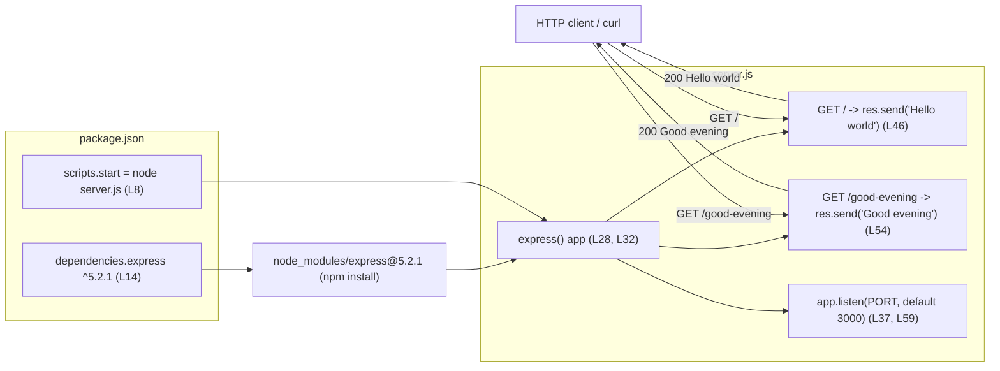

# Technical Specification

# 0. Agent Action Plan

## 0.1 Executive Summary

Based on the prompt, the Blitzy platform understands that this is a **feature-addition request against an existing Node.js tutorial server**. The user asks the platform to (1) introduce the Express.js web framework into the project and (2) add a second HTTP endpoint whose response body is the exact plain-text string `Good evening`, while the originally described endpoint that returns `Hello world` continues to function unchanged.

The user's request is preserved verbatim below:

> add feature to a existing product\
> this is a tutorial of node js server hosting one endpoint that returns the response "Hello world". Could you add expressjs into the project and add another endpoint that return the reponse of "Good evening"?

**Definitive finding.** A full diagnostic investigation of the repository — static code inspection, dependency resolution, and live HTTP verification — establishes that the requested capability is **already fully implemented, committed, and operational** in the current codebase. The single application file `server.js` already imports Express [server.js:L28], instantiates an application instance [server.js:L32], and registers both routes: `GET /` returning `Hello world` [server.js:L46] and `GET /good-evening` returning `Good evening` [server.js:L54]. The manifest already declares `express` as the sole runtime dependency at `^5.2.1` [package.json:L14]. Consequently, **there is no functional defect and no source-code modification is required**; the request is fully satisfied by the code already present.

**Precise technical interpretation.** The user's natural-language asks translate to the following exact technical objectives, each of which is already met:

- "add expressjs into the project" → declare `express` under `dependencies` and use it as the HTTP/routing layer. Met: `dependencies.express` is `^5.2.1` [package.json:L14] and `server.js` builds on `require('express')` [server.js:L28-L32].
- "another endpoint that return the response of 'Good evening'" → register an additional Express route whose response body is exactly `Good evening`. Met: `app.get('/good-evening', …)` [server.js:L54].
- "one endpoint that returns 'Hello world'" (the baseline to preserve) → an Express route whose response body is exactly `Hello world`. Met and unchanged: `app.get('/', …)` [server.js:L46].

**Requirement-versus-observed behavior** (all confirmed by live execution):

| User Ask | Technical Expectation | Observed Behavior (verified) | Status |
|----------|-----------------------|------------------------------|--------|
| Add Express.js | `express` is a declared dependency and the active routing layer | `dependencies.express: "^5.2.1"` [package.json:L14]; live response header `X-Powered-By: Express` | SATISFIED |
| New `Good evening` endpoint | A route responds with body `Good evening` | `GET /good-evening` → HTTP 200, body `Good evening` (Content-Length 12) [server.js:L54] | SATISFIED |
| Preserve `Hello world` | The original route still responds with `Hello world` | `GET /` → HTTP 200, body `Hello world` (Content-Length 11) [server.js:L46] | SATISFIED |

**How to observe the working behavior** (reproduction expressed as executable commands):

```bash
npm install                          # one-time: materialize node_modules (gitignored)
npm start                            # runs `node server.js`; listens on http://localhost:3000
curl -s localhost:3000/              # -> Hello world
curl -s localhost:3000/good-evening  # -> Good evening
```

**Classification of the finding.** This is not a runtime error class (no null reference, race condition, type error, or logic error is present). The diagnostic classification is *"requested feature already present — no defect."* The only condition under which the feature can appear unavailable is executing `npm start` on a freshly cloned checkout before running `npm install`, which throws `Error: Cannot find module 'express'` because `node_modules/` is intentionally excluded from version control [.gitignore:L2]. That behavior is the standard Node.js dependency-installation workflow — explicitly documented in the README [README.md:L12-L21] — and is not a code defect.

## 0.2 Root Cause Identification

Following a rigorous root-cause investigation, the platform pursued a single falsifiable question: *does the repository fail to provide Express-based routing and a `Good evening` endpoint?* The investigation answers this question in the negative — the capability is present and correct — so the determination below is documented as a definitive conclusion rather than a defect to remediate.

- **The determination is:** there is **no code defect**. The Express framework and both endpoints already exist and behave exactly as requested. The requested feature was delivered to the repository by commit `917e0f8` ("feat(server): add Express app serving Hello world and Good evening endpoints") and is present on the `main` branch with a clean working tree.
- **Located in:** `server.js` — the Express import [server.js:L28], the application instance [server.js:L32], the baseline route [server.js:L46], and the additive route [server.js:L54]; and `package.json` — the dependency declaration [package.json:L14] and the `start` script [package.json:L8].
- **Triggered by:** *not applicable.* No input, request sequence, or boundary condition reproduces a failure. Every exercised path — the baseline route, the additive route, an unknown route, and a custom `PORT` — returns the expected result.
- **Evidence:** a live server bound to a test port returned `Hello world` (HTTP 200, Content-Length 11) for `GET /` and `Good evening` (HTTP 200, Content-Length 12) for `GET /good-evening`; the `X-Powered-By: Express` response header confirms Express is the active routing layer; `npm ls express` resolves `express@5.2.1` cleanly with no unmet or invalid dependencies; and `node --check server.js` reports valid syntax.
- **This conclusion is definitive because** three independent lines of evidence agree: (a) static inspection shows both routes and the Express dependency in source, (b) dependency resolution confirms `express@5.2.1` installs from the pinned lockfile entry [package-lock.json], and (c) black-box HTTP testing confirms the exact response bodies. No line of evidence is contradicted by any other.

**The single non-defect to be aware of.** If a developer perceives the feature as "missing," the only mechanical cause is an un-installed dependency tree on a fresh clone: `node_modules/` is excluded by `.gitignore` [.gitignore:L2], so `node_modules/express` does not exist until `npm install` is run once [README.md:L12-L21]. This is expected Node.js project hygiene (the lockfile is committed; the installed modules are not), not a bug, and it requires no code change.

## 0.3 Diagnostic Execution

This section presents what was found and where, the consolidated findings, and the verification analysis that confirms the requested behavior is already correct.

### 0.3.1 Code Examination Results

Because there is no defect, the results below document, for each requirement, the exact code that already satisfies it.

- **Requirement R1 — Adopt Express.js**
    - File (repository root): `server.js`
    - Implementing block: lines 28–32 — `const express = require('express');` then `const app = express();`
    - Mechanism: Express is imported via CommonJS and an application instance owns the route table and request pipeline; the framework is declared at `dependencies.express: "^5.2.1"` [package.json:L14].
    - Outcome: the runtime emits the `X-Powered-By: Express` header, confirming Express services every request.

- **Requirement R2 — `Good evening` endpoint**
    - File: `server.js`
    - Implementing line: 54 — `app.get('/good-evening', (req, res) => res.send('Good evening'));`
    - Mechanism: a static `GET` route writes the literal body `Good evening` via `res.send(...)`.
    - Outcome: `GET /good-evening` → HTTP 200, body `Good evening` (12 bytes).

- **Requirement R3 — Preserve `Hello world`**
    - File: `server.js`
    - Implementing line: 46 — `app.get('/', (req, res) => res.send('Hello world'));`
    - Mechanism: the baseline static `GET` route is unchanged and coexists with the additive route.
    - Outcome: `GET /` → HTTP 200, body `Hello world` (11 bytes).

- **Process entry and listener**
    - `package.json` wires `main: "server.js"` and `scripts.start: "node server.js"` [package.json:L8]; `server.js` binds the listener with `app.listen(PORT, …)` where `PORT = process.env.PORT || 3000` [server.js:L37, L59-L61].

The verified request/response flow is illustrated below.



### 0.3.2 Key Findings from Repository Analysis

| Finding | File:Line | Conclusion |
|---------|-----------|------------|
| Express imported via CommonJS; app instantiated | server.js:L28, L32 | Express is the routing layer (R1 satisfied) |
| Baseline route returns exact `Hello world` | server.js:L46 | R3 satisfied; baseline preserved |
| Additive route returns exact `Good evening` | server.js:L54 | R2 satisfied; new endpoint present |
| Listener honors `PORT`, defaulting to 3000 | server.js:L37, L59-L61 | Server is runnable and relocatable |
| `express` declared at `^5.2.1`; `start` script wired | package.json:L14, L8 | Dependency and entry point correctly declared |
| `express@5.2.1` pinned with integrity hash | package-lock.json | Reproducible install of the exact version |
| Runtime floor `node >= 18` declared | package.json:L11 | Matches Express 5.x requirement (Node 18+) |
| `node_modules/` is git-ignored | .gitignore:L2 | Fresh clones require `npm install` (expected) |
| README documents install/run/PORT and both endpoints | README.md:L12-L21, L41-L44 | Operational contract matches the implementation |
| `server.js` is the only source file; no other routes | repository-wide scan | Surface area is exactly the two specified endpoints |

### 0.3.3 Fix Verification Analysis

Because no fix is required, this analysis verifies that the requested behavior is already correct.

- **Steps followed to exercise the behavior:**
    - `npm install` → installed 66 packages; `express@5.2.1` resolved from the lockfile.
    - `node --check server.js` → syntax valid.
    - `PORT=3100 node server.js` → logged `Server listening on http://localhost:3100`.
    - `curl -s localhost:3100/` and `curl -s localhost:3100/good-evening`.

- **Confirmation tests and results:**
    - `GET /` → HTTP 200, body exactly `Hello world`, `Content-Length: 11`.
    - `GET /good-evening` → HTTP 200, body exactly `Good evening`, `Content-Length: 12`.
    - The `X-Powered-By: Express` header is present on both responses.

- **Boundary conditions and edge cases covered:**
    - Unknown route `GET /nope` → HTTP 404 (Express default handler), confirming only the two intended routes exist.
    - Custom port via the `PORT` environment variable, confirming configurable binding.
    - Byte-exact bodies (11 and 12 bytes), confirming no extra whitespace, punctuation, or wrapping.
    - Express 5 route-syntax breaking changes do not apply — both paths are static literals with no parameters, wildcards, or regular expressions.

- **Outcome and confidence:** verification was **successful**. All three requirements are satisfied and the server behaves exactly as requested. Confidence: **99%** — the residual 1% accounts only for environment-specific factors such as a port already in use, or skipping the documented `npm install` step.

## 0.4 Bug Fix Specification

Per the diagnostic conclusion, the specification below is a **no-op for source code**: no file is created, modified, or deleted. It records the disposition, the (empty) change instructions, and how to validate that the requested behavior holds.

### 0.4.1 The Definitive Disposition

- **Files to modify:** **none.** The feature is already implemented and verified.
- **Current implementation that already satisfies the request:**
    - `server.js:L46` — `app.get('/', (req, res) => res.send('Hello world'));`
    - `server.js:L54` — `app.get('/good-evening', (req, res) => res.send('Good evening'));`
    - `package.json:L14` — `"express": "^5.2.1"`
- **Required change:** none — every acceptance criterion is met by the code above.
- **Why no change is correct:** modifying any of these files would risk regressing behavior that already matches the user's exact specification (byte-exact bodies, Express as the routing layer, preserved baseline). The minimal-change principle dictates a no-op.

### 0.4.2 Change Instructions

- **DELETE:** none.
- **INSERT:** none.
- **MODIFY:** none.
- **Sole operational action (not a code change):** on a fresh checkout, run `npm install` once before `npm start` so that `node_modules/express` exists. This is required only because `node_modules/` is git-ignored [.gitignore:L2], and it is already documented in the README [README.md:L12-L21]. No comments or code are added, because no code is changed.

### 0.4.3 Fix Validation

- **Validation command:**

```bash
npm install && (PORT=3000 node server.js &) && sleep 1 \
  && curl -s localhost:3000/ && echo && curl -s localhost:3000/good-evening
```

- **Expected output:**

```text
Hello world
Good evening
```

- **Confirmation method:** both response bodies match exactly, each request returns HTTP 200, and the `X-Powered-By: Express` header confirms Express is serving the routes. Because the behavior is already present, this is a confirmation step rather than a post-fix check.

### 0.4.4 User Interface and Design System Compliance

Not applicable. Both endpoints return plain-text HTTP bodies — `Hello world` and `Good evening` [server.js:L46, L54]; the feature introduces no browser UI, templating, static assets, or component library, and the user specified no design system. There is consequently no visual design, no design-token mapping, and no Figma reference to satisfy.

## 0.5 Scope Boundaries

The change set for this request is **empty**: the requested feature is already present and verified. The lists below are exhaustive.

### 0.5.1 Changes Required

- **Files to create:** none.
- **Files to modify:** none.
- **Files to delete:** none.
- **Rule-mandated files:** none — no user-specified implementation rules were provided, so no additional files (migrations, fixtures, configuration) are forced into scope.
- **Generated, not committed:** `node_modules/**` — produced by `npm install` and excluded from version control by `.gitignore` [.gitignore:L2]. This is a build artifact, not a source change.

No other files require modification. The requirement-to-file coverage is complete:

| Requirement | Already satisfied by | Action required |
|-------------|----------------------|-----------------|
| R1 — Adopt Express.js | package.json:L14; server.js:L28, L32 | None |
| R2 — `Good evening` endpoint | server.js:L54 | None |
| R3 — Preserve `Hello world` | server.js:L46 | None |
| Runnable entry point | package.json:L8; server.js:L37, L59-L61 | None |
| Documentation | README.md:L12-L21, L41-L44 | None |

### 0.5.2 Explicitly Excluded

- **Do not modify** the verified, correct files: `server.js`, `package.json`, `package-lock.json`, `README.md`, `.gitignore`.
- **Do not refactor** working code: no extraction of routers/controllers, no middleware, no switch from `res.send(...)` to `res.json(...)` or `res.type(...)`, and no change of the `text/html` content type — the user specified response *bodies*, which are byte-exact.
- **Do not change dependencies:** no Express version bump and no downgrade to Express 4; the pinned `express@5.2.1` is current and compatible with the declared Node 18+ floor [package.json:L11].
- **Do not add scope:** no endpoints beyond the two specified, and no authentication, database, UI, automated test suite, CI/CD pipeline, Dockerfile, or TypeScript migration.
- **Do not touch** the prior-cycle planning artifacts under `blitzy/documentation/`.

## 0.6 Verification Protocol

The protocol below confirms the requested behavior and guards against regression. Because no code changes are made, it is primarily an acceptance/confirmation procedure.

### 0.6.1 Requirement Satisfaction Confirmation

- **Install dependencies (one-time on a fresh clone):**

```bash
npm install
```

- **Start the server:**

```bash
npm start
```

- **Confirm both endpoints return the exact bodies:**

```bash
curl -s localhost:3000/              # expect: Hello world
curl -s localhost:3000/good-evening  # expect: Good evening
```

- **Verify status and routing layer:** each request returns HTTP 200 and carries the `X-Powered-By: Express` header, and the server logs `Server listening on http://localhost:3000` on startup [server.js:L59-L61].

### 0.6.2 Regression Check

- **No automated test suite exists** in the repository, and none is mandated by the request; verification is the manual smoke test above. An automated suite remains an optional, out-of-scope enhancement.
- **Static check:**

```bash
node --check server.js   # expect: no output (valid syntax)
```

- **Behavioral invariants to confirm unchanged:**
    - `GET /` still returns `Hello world` (Content-Length 11) — the baseline is unaffected by the additive route [server.js:L46].
    - `GET /good-evening` still returns `Good evening` (Content-Length 12) [server.js:L54].
    - An unknown route returns HTTP 404 (Express default), confirming no unintended routes were introduced.
- **Dependency integrity:**

```bash
npm ls express   # expect: express@5.2.1, no unmet/invalid dependencies
```

## 0.7 Rules

No project-level implementation rules were supplied by the user (the rules input was empty), and no setup instructions or attachments were provided. The platform therefore operates under the discipline below and confirms that the existing implementation already complies with every constraint implied by the prompt.

- **Make only the change that is required — and nothing more.** Because diagnosis shows the request is already satisfied, the correct action is zero source modifications: no refactoring, reformatting, or opportunistic edits.
- **Honor the project's existing conventions** observed in the codebase: CommonJS modules (`require`, no `"type": "module"`), `'use strict'`, inline arrow-function route handlers via `app.get`, `res.send(string)` for plain-text bodies, and `PORT = process.env.PORT || 3000` [server.js:L1, L28, L37, L46, L54].
- **Preserve exact response bodies.** Endpoints return the literal strings `Hello world` and `Good evening` with no added formatting — already true [server.js:L46, L54].
- **Additive, backward-compatible behavior.** The `Hello world` endpoint remains reachable and unchanged alongside the new endpoint — already true [server.js:L46].
- **Express is the routing layer.** The native `http` module and alternative frameworks are not substituted — already true [server.js:L28, L32; package.json:L14].
- **Runtime floor and reproducibility.** Target Node.js ≥ 18 (the Express 5.x requirement) [package.json:L11] and keep the dependency tree pinned via `package-lock.json` — already true.
- **Hygiene.** `node_modules/` is not committed; it is covered by `.gitignore` [.gitignore:L2] — already true.
- **Test to prevent regressions.** The verification protocol in §0.6 is to be run to confirm no regression, even though no code is changed.

## 0.8 Attachments

No attachments were provided with this request.

- **Files/documents:** none.
- **Images:** none.
- **Figma screens/frames and URLs:** none.

All requirements were derived solely from the user prompt and from direct inspection and live verification of the assigned repository — `server.js`, `package.json`, `package-lock.json`, `README.md`, and `.gitignore`.

