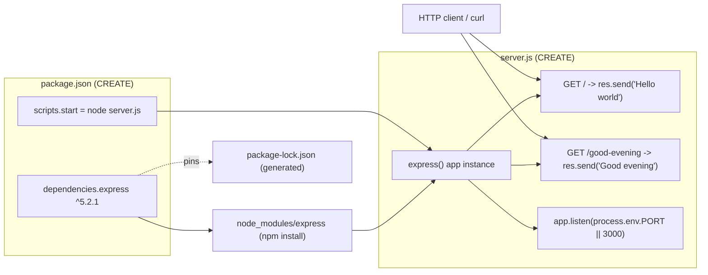

# Technical Specification

# 0. Agent Action Plan

## 0.1 Intent Clarification

Based on the prompt, the Blitzy platform understands that the new feature requirement is to introduce the Express.js web framework into a Node.js project and to expose a second HTTP endpoint that responds with the plain-text body `Good evening`, while preserving the original endpoint that responds with `Hello world`.

A critical reconciliation must be stated up front. The user describes an *existing* tutorial Node.js server, but the repository as indexed contains exactly one file — `README.md`, whose entire content is the single line `# Artifact-2` [README.md:L1]. There is no `package.json`, no server source file, and no subdirectory present. This is corroborated by the broader specification, which records that the repository's root directory contains exactly one entry — the `README.md` file — and no subdirectories. Consequently, the described "Hello world" baseline server is **not materialized in the codebase** and must be established as part of this work. The platform therefore interprets the request as an *establish-then-extend* operation: scaffold the minimal Node.js + Express baseline that serves `Hello world`, and in the same change add the second `Good evening` endpoint.

### 0.1.1 Core Feature Objective

The feature decomposes into three explicit requirements and a set of implicit prerequisites that the platform has surfaced.

Explicit requirements (stated by the user):

- **R1 — Adopt Express.js.** Add the `express` package as a project dependency and use it as the HTTP framework for the server.
- **R2 — New endpoint.** Add a second endpoint that returns the exact response `Good evening`.
- **R3 — Preserve the baseline.** Keep the pre-existing endpoint that returns the exact response `Hello world` (this is an additive change, not a replacement).

Implicit requirements (surfaced by the platform, necessary for R1–R3 to function):

- **I1 — Project manifest.** Create `package.json` declaring the project metadata, the `express` dependency, and an `npm start` script. Express's own documentation notes that for a brand-new project a `package.json` should be created first.
- **I2 — Server bootstrap.** Create the server entry file that instantiates an Express application, registers both routes, and binds a listener to a port.
- **I3 — Dependency installation.** Run `npm install` to materialize `node_modules/` and generate `package-lock.json`, which pins the resolved dependency tree.
- **I4 — Express-native baseline.** Because no native `http` server exists to migrate, the `Hello world` route is authored directly on Express rather than ported from existing code.
- **I5 — Ignore rules.** Add a `.gitignore` so that `node_modules/` is not committed.
- **I6 — Documentation.** Update `README.md` with prerequisites, install/run instructions, and the endpoint catalog.

Feature dependencies and prerequisites:

- A Node.js runtime of version 18 or higher (required by Express 5.x). The verified build environment provides Node.js v22.22.2 and npm 11.1.0, which satisfy this constraint.
- Network access to the npm registry to resolve `express` during `npm install`.

### 0.1.2 Special Instructions and Constraints

- **Framework is prescribed.** The user explicitly requires Express.js. The implementation must not substitute the native `http` module or any alternative framework (e.g., Fastify, Koa) for the routing layer.
- **Backward compatibility.** The `Hello world` response must remain reachable and byte-for-byte identical after the change; adding the new endpoint must not alter the existing one.
- **Exact response strings.** The endpoints must return the literal strings `Hello world` and `Good evening` respectively, exactly as written by the user.
- **Repository conventions.** With no existing source code or style guide present in the repository [README.md:L1], the implementation should follow idiomatic Express/Node conventions and the official minimal-server pattern.

User Example (preserved exactly as provided):

> add feature to a existing product
> this is a tutorial of node js server hosting one endpoint that returns the response "Hello world". Could you add expressjs into the project and add another endpoint that return the reponse of "Good evening"?

Web search requirements: research was required to confirm the current stable Express release, its Node.js floor, and the canonical minimal-server pattern. This research is documented in §0.2.2 and §0.3.

### 0.1.3 Technical Interpretation

These feature requirements translate to the following technical implementation strategy:

- To **adopt Express (R1)**, we will create `package.json` and declare `express` under `dependencies`, then install it to produce `package-lock.json` and `node_modules/`.
- To **add the `Good evening` endpoint (R2)**, we will register a route handler on the Express application instance (recommended `GET /good-evening`) that calls `res.send('Good evening')`.
- To **preserve the `Hello world` response (R3)**, we will register the baseline route (recommended `GET /`) on the same Express application that calls `res.send('Hello world')`.
- To **make the server runnable**, we will bind the Express app to a listener (`app.listen(process.env.PORT || 3000)`) inside the server entry file and wire an `npm start` script.

The following ambiguities were detected; the platform proceeds on the stated assumptions and flags them for confirmation:

| ID | Ambiguity | Assumption Adopted |
|----|-----------|--------------------|
| A1 | Route path for the new endpoint is unspecified | `GET /good-evening` for the new route; `GET /` for the existing one |
| A2 | Express major version is unspecified | `express@^5.2.1` (latest stable); `^4.22.2` noted as a legacy alternative |
| A3 | The described baseline server is absent from the repository | Create the baseline as part of this change (establish-then-extend) |
| A4 | HTTP method is unspecified | `GET` for both endpoints (idempotent text responses) |
| A5 | Listen port is unspecified | `process.env.PORT || 3000` |

## 0.2 Repository Scope Discovery

A full inspection of the repository was performed using folder traversal, semantic file search, direct file reads, and filesystem scans. The repository is a documentation stub: the single tracked artifact is `README.md` containing only `# Artifact-2` [README.md:L1]. No source files, manifests, lockfiles, configuration, or subdirectories exist.

### 0.2.1 Comprehensive File Analysis

The complete inventory of existing files and the absence of every integration surface the feature would normally touch is summarized below.

| Path | Exists Today | Role in This Feature | Mode |
|------|--------------|----------------------|------|
| `README.md` | Yes — content `# Artifact-2` [README.md:L1] | Project documentation to be expanded with run instructions and endpoint catalog | UPDATE |
| `package.json` | No | Project manifest + `express` dependency + `start` script | CREATE |
| `server.js` | No | Express bootstrap hosting both endpoints | CREATE |
| `.gitignore` | No | Exclude `node_modules/` from version control | CREATE |
| `package-lock.json` | No | Pin the resolved dependency tree (generated by `npm install`) | CREATE (generated) |
| `node_modules/` | No | Installed dependency tree (generated, not committed) | GENERATED |

Integration point discovery — every conventional touchpoint is absent and therefore must be created rather than modified:

- **API endpoints:** No router, controller, or handler files exist [README.md:L1]; both routes are net-new.
- **Database models/migrations:** None exist and none are required by the feature.
- **Service classes:** None exist; the tutorial scope needs no service layer.
- **Controllers/handlers:** None exist; route handlers will be inline Express callbacks in `server.js`.
- **Middleware/interceptors:** None exist; no custom middleware is required for plain-text responses.

Because there is no pre-existing code, there are no inbound or outbound integration edges to reconcile; all wiring is self-contained within the newly created files.

### 0.2.2 Web Search Research Conducted

Research targeted the correct, current Express version and the canonical server pattern:

- **Current stable release.** Express `5.2.1` is the latest published version on the npm registry, and Node.js 18 or higher is required. The verified `npm` dist-tags are `latest = 5.2.1` and `latest-4 = 4.22.2`.
- **Node.js floor.** Express v5 dropped support for Node.js versions before v18, per the official v5 release announcement; the Express CI matrix includes Node.js 22, which matches the build environment (Node v22.22.2).
- **Canonical minimal-server pattern.** The official quick-start creates an app, registers a `GET /` handler that calls `res.send(...)`, and starts a listener on a port — the exact shape adopted for `server.js`.
- **Project bootstrapping.** Express guidance recommends creating a `package.json` first (via `npm init`) for a brand-new project, which validates the CREATE-manifest-first sequencing in §0.5.

No additional libraries (logging, validation, ORM, auth) were indicated as necessary for the stated requirements; `express` is the sole functional dependency.

### 0.2.3 New File Requirements

New source files to create:

- `package.json` — project manifest declaring `express` under `dependencies` and an `npm start` script that runs the server entry file.
- `server.js` — Express application entry point: imports Express, instantiates the app, registers `GET /` (`Hello world`) and `GET /good-evening` (`Good evening`), and binds `app.listen(process.env.PORT || 3000)`.

New supporting/configuration files:

- `.gitignore` — excludes `node_modules/` and npm debug logs.
- `package-lock.json` — generated by `npm install`; pins the exact `express` version and its transitive tree.

New test files:

- None are mandated by the request. An optional smoke test (manual `curl` against both endpoints, described in §0.5) is the verification method; a formal automated suite is treated as an out-of-scope optional enhancement (§0.6).

New documentation:

- `README.md` is updated (not created); a dedicated `docs/` tree is unnecessary at tutorial scope.

## 0.3 Dependency Inventory

This feature introduces exactly one direct dependency. There are no dependencies to update or remove because the repository declares no dependency manifest today [README.md:L1].

### 0.3.1 Package Registry and Versions

| Registry | Package | Version | Type | Purpose |
|----------|---------|---------|------|---------|
| npm | `express` | `^5.2.1` | dependency (runtime) | Minimalist web framework: provides the application instance, `app.get` routing, and the `res.send` response helper used by both endpoints |

Version notes:

- `^5.2.1` is the current npm `latest` dist-tag and is compatible with the environment's Node.js v22.22.2 (Express 5.x requires Node.js ≥ 18).
- A legacy alternative, `express@^4.22.2` (npm `latest-4` dist-tag), is available if Express 4 route-matching semantics are explicitly desired; Express 5 is recommended for a new project.
- `express@5` carries roughly two dozen transitive dependencies that npm resolves automatically; only `express` is declared directly. The exact transitive tree is pinned in the generated `package-lock.json`.
- No `devDependencies` are required for the minimal tutorial. `nodemon` (live-reload) is an optional developer convenience and is intentionally excluded from the default plan.

### 0.3.2 Dependency Updates

Import additions (no transformations of existing imports are required because no source files exist [README.md:L1]):

- New code in `server.js` will introduce a single import: `const express = require('express');` (or the ESM equivalent `import express from 'express'` if `package.json` sets `"type": "module"`).

External reference updates:

- `package.json` — declares `express` under `dependencies` and an `npm start` script.
- `package-lock.json` — generated/updated by `npm install` to record exact resolved versions.
- `README.md` — documents the `npm install` and `npm start` commands and the available endpoints.

There are no CI/CD, build-system, or configuration files in the repository to update [README.md:L1], so no further external reference changes apply.

## 0.4 Integration Analysis

Because the repository contains no executable code [README.md:L1], there are no existing modules to modify and no inbound callers to reconcile. All integration is internal to the newly created files. This section documents those internal touchpoints and the runtime wiring.

### 0.4.1 Existing Code Touchpoints

Direct modifications to existing files:

- `README.md` — the only existing file [README.md:L1]; updated to describe installation, the run command, and the two endpoints. No code-level coupling.

New internal wiring (created by this change):

- **Framework binding:** `server.js` requires `express` (resolved from `package.json` → `dependencies.express`) and creates the application instance.
- **Route registration:** the `GET /` and `GET /good-evening` handlers are registered on the Express app instance inside `server.js`.
- **Process entry:** `package.json` → `scripts.start` (`node server.js`) and `main` (`server.js`) make `server.js` the executable entry point.
- **Listener:** `server.js` calls `app.listen(process.env.PORT || 3000)` to bind the HTTP server.

Dependency injection / service registration:

- Not applicable. The tutorial uses inline route handlers and requires no DI container, service registry, or configuration wiring.

Database / schema updates:

- Not applicable. The feature introduces no persistence, migrations, or schema.

The component relationships and request flow are illustrated below.



## 0.5 Technical Implementation

This section gives the exhaustive, file-by-file plan. Every file listed must be created or modified to satisfy the feature.

### 0.5.1 File-by-File Execution Plan

**Group 1 — Core Feature Files**

- **CREATE `package.json`** — declare project metadata, `express` under `dependencies`, `"main": "server.js"`, and `scripts.start = "node server.js"`.
- **CREATE `server.js`** — Express bootstrap that registers both routes and starts the listener. Representative shape:

```js
const express = require('express');
const app = express();
app.get('/', (req, res) => res.send('Hello world'));
app.get('/good-evening', (req, res) => res.send('Good evening'));
app.listen(process.env.PORT || 3000);
```

**Group 2 — Supporting Infrastructure**

- **CREATE `.gitignore`** — ignore `node_modules/` and `npm-debug.log*`.
- **CREATE (generated) `package-lock.json`** — produced by `npm install`; pins `express@5.2.1` and its transitive tree. Committed to the repository.

**Group 3 — Documentation**

- **UPDATE `README.md`** — retain the `# Artifact-2` title [README.md:L1] and add an overview, prerequisites (Node.js ≥ 18), install (`npm install`) and run (`npm start`) instructions, and the endpoint catalog.

| Mode | File | Summary |
|------|------|---------|
| CREATE | `package.json` | Manifest + `express` dependency + `start` script |
| CREATE | `server.js` | Express app, both routes, listener |
| CREATE | `.gitignore` | Exclude `node_modules/` |
| CREATE (generated) | `package-lock.json` | Pin resolved versions |
| UPDATE | `README.md` | Run instructions + endpoint catalog |

### 0.5.2 Implementation Approach per File

The recommended execution order establishes the foundation, installs the framework, then layers the routes:

- **Establish the manifest first.** Author `package.json` with `express` under `dependencies` and the `start` script (Express recommends creating the manifest before installing).
- **Install the framework.** Run `npm install`, which resolves `express@^5.2.1`, populates `node_modules/`, and writes `package-lock.json`.
- **Author the server.** Create `server.js` to instantiate the Express app, register `GET /` returning `Hello world` and `GET /good-evening` returning `Good evening`, and bind `app.listen(process.env.PORT || 3000)`.
- **Add ignore rules.** Create `.gitignore` so `node_modules/` is never committed.
- **Document usage.** Update `README.md` with prerequisites, commands, and the endpoint table.
- **Verify.** Start the server (`npm start`) and confirm both responses, for example `curl -s localhost:3000/` returns `Hello world` and `curl -s localhost:3000/good-evening` returns `Good evening`.

No file in this plan references a Figma URL, because none were provided.

### 0.5.3 User Interface Design

Not applicable. Both endpoints return plain-text HTTP responses (`Hello world` and `Good evening`); the feature introduces no browser UI, templating, static assets, or component library. There is consequently no visual design, no design-system alignment, and no Figma reference to satisfy.

## 0.6 Scope Boundaries

The change set is small and fully enumerable. The lists below are exhaustive.

### 0.6.1 Exhaustively In Scope

- Project manifest and lockfile:
    - `package.json` (CREATE)
    - `package-lock.json` (CREATE — generated by `npm install`)
- Application source:
    - `server.js` (CREATE) — hosts `GET /` (`Hello world`) and `GET /good-evening` (`Good evening`)
- Configuration:
    - `.gitignore` (CREATE)
- Documentation:
    - `README.md` (UPDATE)
- Generated, not committed:
    - `node_modules/**` (produced by `npm install`)

The only file group expressed as a wildcard is `node_modules/**`; all hand-authored files are individually named because the surface area is minimal.

### 0.6.2 Explicitly Out of Scope

- Any frontend or UI layer, templating engine, static assets, or design system.
- Authentication, authorization, sessions, or security middleware.
- Databases, ORMs, migrations, and data models.
- Additional endpoints beyond the two specified (`Hello world`, `Good evening`).
- CI/CD pipelines, Dockerfiles, and deployment/infrastructure-as-code.
- TypeScript migration, linters, formatters, and bundlers.
- Performance work (clustering, HTTP/2, HTTPS/TLS) and caching.
- Refactoring of unrelated code — none exists to refactor [README.md:L1].
- A formal automated test suite (optional enhancement only; verification is a manual `curl` smoke check per §0.5.2).
- All other technical-specification sections (1–9); this plan governs only the code change.

## 0.7 Rules for Feature Addition

No project-level implementation rules were supplied by the user (the rules input was empty), and no setup instructions were attached. The following feature-specific rules are derived directly from the prompt and govern the implementation.

- **Use Express.js for routing.** Both endpoints must be served by an Express application instance; the native `http` module or alternative frameworks must not be substituted for the routing layer.
- **Additive, backward-compatible change.** The `Hello world` endpoint must remain reachable and unchanged after the new endpoint is added; this is an extension, not a replacement.
- **Exact response bodies.** Endpoints must return the literal strings `Hello world` and `Good evening` exactly as written by the user, with no additional formatting, punctuation, or markup.
- **Minimal, idiomatic footprint.** Follow the official Express minimal-server pattern; introduce no dependencies beyond `express` unless a later requirement demands it.
- **Runtime floor.** Target Node.js ≥ 18 (Express 5.x requirement); pin the dependency tree via `package-lock.json`.
- **Hygiene.** Do not commit `node_modules/`; ensure it is covered by `.gitignore`.

Integration, performance, and security considerations specific to this feature:

- **Integration:** all wiring is internal to the new files; there are no external systems or existing modules to integrate with [README.md:L1].
- **Performance/scalability:** none specified; default single-process Express behavior is acceptable for a tutorial.
- **Security:** none specified; no input handling, authentication, or sensitive data is involved. Adopting Express 5.x inherits its hardened, ReDoS-resistant route matcher by default.

## 0.8 Attachments

No attachments were provided with this request.

- Files/documents: none.
- Images: none.
- Figma screens/frames and URLs: none.

All requirements were derived solely from the user prompt and from inspection of the repository, whose only file is `README.md` (`# Artifact-2`) [README.md:L1].

