# Technical Specification

# 1. Introduction

## 1.1 EXECUTIVE SUMMARY

### 1.1.1 Project Overview

The `artifact-2` project is a minimal Node.js tutorial server built on the Express.js web framework. It exposes two HTTP `GET` endpoints — `GET /` returning the plain-text body `Hello world`, and `GET /good-evening` returning the plain-text body `Good evening` — and is intended to serve as a pedagogical reference implementation of an idiomatic Express server.

The project is registered as a private, ISC-licensed npm package at version `1.0.0`, with `server.js` as the executable entry point and `express@^5.2.1` as the sole runtime dependency. The codebase intentionally avoids middleware, routers, controllers, services, and persistence — every concern outside the two routes has been omitted to keep the example as instructive as possible. The header docstring in `server.js` explicitly records that `express` is the sole runtime dependency.

### 1.1.2 Core Business Problem

The originating request, captured verbatim in `blitzy/documentation/Input Prompt.md`, described an existing tutorial Node.js server hosting a single `Hello world` endpoint and asked for the addition of Express.js as the routing framework and a second `Good evening` endpoint. Upon inspection, the repository contained only a placeholder `README.md` (one line: `# Artifact-2`), without the described baseline server.

The platform reconciled this discrepancy by adopting an "establish-then-extend" interpretation: scaffold the minimal Node.js + Express baseline that serves `Hello world`, and in the same change add the second `Good evening` endpoint. The core problem solved by this codebase is therefore a teaching one — to demonstrate the smallest viable Express application that registers more than one route, in a form that learners can clone, install, run, and curl-verify within minutes.

### 1.1.3 Key Stakeholders and Users

Because the artifact is explicitly a tutorial, the stakeholder population is intentionally narrow and is documented only by inference from the source files. No formal stakeholder register, business sponsor, or product owner is named in the repository.

| Stakeholder | Role | Source of Inference |
|-------------|------|---------------------|
| Developer learners | Primary audience reading and running the tutorial | `package.json` description; `README.md` operational guide |
| Originating requester | User who submitted the input prompt requesting Express adoption and the second endpoint | `blitzy/documentation/Input Prompt.md` |
| HTTP clients | Anonymous callers (curl, browser) issuing `GET /` and `GET /good-evening` | `server.js`; `README.md` verification commands |

There is no authentication, authorization, or user-role differentiation in the system, so all consumers are treated as a single anonymous category.

### 1.1.4 Expected Business Impact and Value Proposition

The value proposition is educational rather than commercial. The artifact offers:

- A byte-minimal Express scaffold (62-line entry point, single declared dependency) that a learner can read end-to-end in one sitting.
- A backward-compatible demonstration of adding a second route to a pre-existing handler, illustrating additive change in a Node.js project.
- A pinned dependency tree (via `package-lock.json`, lockfile version 3) that ensures deterministic installs on Node.js ≥ 18.

No revenue, cost-savings, performance, or adoption metrics are defined or implied anywhere in the source files. The artifact is registered as `"private": true` in `package.json`, signaling that it is not intended for publication to the public npm registry.

## 1.2 SYSTEM OVERVIEW

### 1.2.1 Project Context

#### Business Context and Market Positioning

`artifact-2` is positioned as a self-contained tutorial server, not as a product line or commercial offering. Its peer group is comprised of "Hello world" demonstrations referenced in the official Express documentation, not production HTTP services. The `package.json` description string formally identifies the project as a "Node.js + Express tutorial server exposing the Hello world and Good evening endpoints."

#### Current System Limitations

Prior to the change documented here, the repository was effectively empty: it contained only a single-line `README.md` (`# Artifact-2`). No `package.json`, `server.js`, `node_modules/`, or `package-lock.json` was present. There were therefore no existing modules to modify, no inbound callers to reconcile, no dependency-injection or configuration wiring, and no persistence schema to migrate.

The Agent Action Plan formally captured this as an "establish-then-extend" operation, in which the described pre-existing `Hello world` server was materialized as part of the same change that introduced the `Good evening` route.

#### Integration with Existing Enterprise Landscape

There is no enterprise landscape — neither implied nor documented — surrounding this artifact. The server runs as a single Node.js process bound to `http://localhost:${PORT}` (default `3000`), with no upstream service registry, downstream database, message broker, or sidecar integration. The only external integration point is the HTTP client (such as `curl` or a browser) that issues the two `GET` requests.

### 1.2.2 High-Level Description

#### Primary System Capabilities

| Capability | Endpoint | Response Body |
|------------|----------|---------------|
| Greet — default route | `GET /` | `Hello world` |
| Greet — evening route | `GET /good-evening` | `Good evening` |

Both endpoints return plain-text bodies with no additional formatting, headers, or markup beyond what Express's default `res.send()` provides. The exact byte sequences are mandated by the project rules.

#### Major System Components

The repository consists of four committed files plus an installed-but-not-committed `node_modules/` tree:

| Artifact | Purpose | Lifecycle |
|----------|---------|-----------|
| `package.json` | Declares project identity, Node.js engine floor (`>= 18`), Express dependency (`^5.2.1`), and the `npm start` script | Committed |
| `server.js` | Express application bootstrap: instantiates the app, registers two routes, and binds the listener on `process.env.PORT \|\| 3000` | Committed |
| `package-lock.json` | Pins the deterministic dependency tree (Express 5.2.1 plus ~two dozen transitive packages) | Committed |
| `README.md` | Operational contract: prerequisites, install/run commands, endpoint catalog, smoke-test commands | Committed |
| `node_modules/` | Installed dependency tree (Express + transitive deps) | Generated, not committed |

The `blitzy/documentation/` folder additionally contains `Input Prompt.md` (the verbatim originating user request) and `Agent Action Plan.md` (the implementation blueprint), but these are documentation artifacts rather than runtime components.

#### Core Technical Approach

The application follows the canonical "minimal Express server" pattern documented by Express itself:

1. Import Express using CommonJS (`require`); `package.json` deliberately omits `"type": "module"` to keep the example in the most widely taught module system.
2. Instantiate a single `express()` app.
3. Register two `app.get(path, handler)` calls — one for each endpoint — using inline arrow-function handlers that respond via `res.send(...)`.
4. Resolve the listen port from `process.env.PORT` with a `3000` default.
5. Call `app.listen(PORT, callback)` to bind, logging `Server listening on http://localhost:${PORT}` on startup.

No middleware is registered. No router, controller, service, or repository layer is introduced. The component wiring is illustrated below.

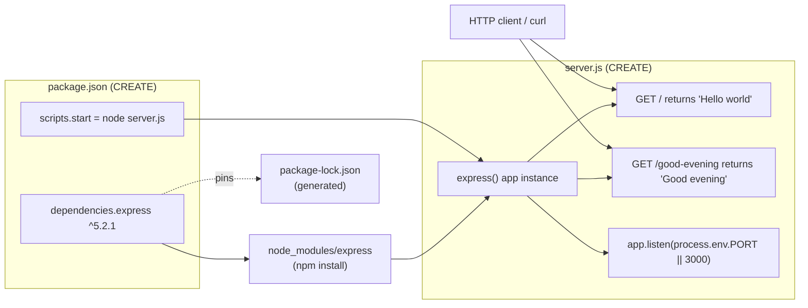

### 1.2.3 Success Criteria

#### Measurable Objectives

No formally quantified objectives (latency targets, throughput targets, cost budgets) are defined in any source file. Success is defined behaviorally: both endpoints must return their exact, literal response strings, and the server must be launchable by the documented `npm start` workflow.

| Objective | Verification |
|-----------|--------------|
| `GET /` returns the byte sequence `Hello world` | `curl -s localhost:3000/` |
| `GET /good-evening` returns the byte sequence `Good evening` | `curl -s localhost:3000/good-evening` |
| Server starts via `npm start` and logs its bind URL | Observe stdout: `Server listening on http://localhost:3000` |
| Dependency tree is reproducible across machines | `npm install` resolves cleanly against `package-lock.json` |

#### Critical Success Factors

The Agent Action Plan enumerates six implementation rules that constitute the critical success factors for the change:

1. **Framework adherence.** Express.js is the prescribed routing framework; the native `http` module, Fastify, and Koa must not be substituted.
2. **Additive, backward-compatible change.** `GET /` must remain reachable and unchanged after the change.
3. **Exact response bodies.** Endpoints must return the literal strings `Hello world` and `Good evening` byte-for-byte, with no additional formatting, punctuation, or markup.
4. **Minimal, idiomatic footprint.** Follow the official Express minimal-server pattern; introduce no extra runtime dependencies.
5. **Runtime floor and lockfile.** Target Node.js ≥ 18; pin the dependency tree via `package-lock.json`.
6. **Source-control hygiene.** Do not commit `node_modules/`; ensure `.gitignore` coverage.

#### Key Performance Indicators

No KPIs (response-time percentiles, error budgets, uptime SLAs, request volumes) are documented in any source file. The absence of KPIs is itself a property of the artifact: it is a tutorial intended to be read and run, not a service to be operated under measurement. The README's verification section provides only manual smoke-test commands, not performance benchmarks.

## 1.3 SCOPE

### 1.3.1 In-Scope

#### Core Features and Functionalities

| In-Scope Item | Type | File / Action |
|---------------|------|---------------|
| Project manifest declaring identity, engines, dependency, and start script | Must-have | `package.json` (create) |
| Express application bootstrap and two `GET` route handlers | Must-have | `server.js` (create) |
| Deterministic dependency lock for Express 5.2.1 and transitive packages | Must-have | `package-lock.json` (create, generated by `npm install`) |
| Source-control hygiene excluding `node_modules/` | Must-have | `.gitignore` (create) |
| Operational documentation — prerequisites, install/run, endpoint catalog, smoke tests | Must-have | `README.md` (update) |
| Materialized dependency tree | Must-have (generated) | `node_modules/**` (produced by `npm install`, not committed) |

The primary user workflow comprises three commands: `npm install` (to materialize dependencies), `npm start` (to launch the server, which logs its bind URL), and `curl http://localhost:3000/` or `curl http://localhost:3000/good-evening` (to exercise the endpoints).

The essential technical requirements are: Node.js ≥ 18 as the runtime floor, `express@^5.2.1` as the sole runtime dependency, CommonJS as the module system, and `process.env.PORT || 3000` as the listen-port resolution rule.

#### Implementation Boundaries

| Boundary Dimension | Value |
|--------------------|-------|
| System boundary | Single Node.js process exposing two HTTP `GET` endpoints |
| User groups | Anonymous HTTP clients (no authentication, no role differentiation) |
| Geographic / market coverage | Not specified; only `localhost` development is referenced |
| Data domains | None — no persistence, no schema, no data modeling |

### 1.3.2 Out-of-Scope

The Agent Action Plan explicitly enumerates the following as out-of-scope. These items must not be introduced into the codebase under the rules governing this change.

#### Excluded Features and Capabilities

- Any frontend or UI layer, templating engine, static assets, or design system.
- Authentication, authorization, sessions, or security middleware.
- Databases, ORMs, migrations, and data models.
- Additional endpoints beyond the two specified (`GET /` and `GET /good-evening`).
- TypeScript migration, linters, formatters, and bundlers.
- Performance work (clustering, HTTP/2, HTTPS/TLS) and caching.
- Refactoring of unrelated code — none exists to refactor.

#### Future Phase Considerations

- A formal automated test suite. The Agent Action Plan classifies tests as an optional enhancement only; no test framework, test files, or `test` script is included in `package.json`.
- Additional routes, middleware, or service decomposition. Any such expansion would constitute a future phase beyond the current change.
- Migration to alternative frameworks (Fastify, Koa) or to the native `http` module. The current rules prescribe Express.

#### Integration Points Not Covered

- CI/CD pipelines. No GitHub Actions, GitLab CI, Jenkins, or equivalent configuration is present in the repository.
- Dockerfiles and container orchestration. No `Dockerfile`, `docker-compose.yml`, Kubernetes manifests, or Helm charts exist.
- Infrastructure-as-code. No Terraform, Pulumi, or CloudFormation templates.
- External service integrations of any kind — no databases, caches, message brokers, identity providers, or telemetry backends are wired.

#### Unsupported Use Cases

- Production hosting. The server binds on `localhost` and ships without TLS termination, process supervision, observability, or rate limiting.
- Multi-tenant or multi-user scenarios. There is no notion of identity in the system.
- Localization / internationalization. The two response strings are fixed in English and are required to be byte-for-byte exact.
- Programmatic consumption via SDKs or client libraries. The tutorial assumes ad-hoc HTTP calls (e.g., `curl`).

## 1.4 References

### 1.4.1 Files Examined

- `README.md` — Operational contract: prerequisites, installation, run command, endpoint catalog, verification commands.
- `package.json` — Project identity (`artifact-2`, version `1.0.0`, private, ISC license), Node.js engine constraint (`>= 18`), Express dependency (`^5.2.1`), `npm start` script mapping to `node server.js`.
- `server.js` — Executable entry point: Express app instantiation, two inline `GET` route handlers (`/` and `/good-evening`), port resolution via `process.env.PORT || 3000`, `app.listen` startup with `Server listening on http://localhost:${PORT}` log line.
- `package-lock.json` — Deterministic dependency tree for Express 5.2.1 and approximately two dozen transitive packages with integrity hashes (lockfile version 3).
- `blitzy/documentation/Input Prompt.md` — Verbatim original user request defining the feature requirement (Express adoption and the `Good evening` endpoint).
- `blitzy/documentation/Agent Action Plan.md` — Implementation blueprint covering Intent Clarification, Repository Scope Discovery, Dependency Inventory, Integration Analysis, Technical Implementation, Scope Boundaries, and Rules for Feature Addition.

### 1.4.2 Folders Explored

- `/` (repository root) — Confirmed four committed files plus the `blitzy/` folder; no hidden configuration, CI/CD, Docker, or test infrastructure present.
- `blitzy/` — Documentation-only workspace containing a single child folder.
- `blitzy/documentation/` — Contains the originating input prompt and the agent's implementation action plan; no nested subfolders.

# 2. Product Requirements

This section catalogs every discrete, testable feature implemented in the `artifact-2` repository. Because the codebase is intentionally minimal — comprising only `server.js`, `package.json`, `package-lock.json`, `.gitignore`, and `README.md` — the feature surface is fully enumerable. Eight features (F-001 through F-008) collectively account for every behavior, file, and configuration concern in the system. The catalog is grounded exclusively in artifacts present in the repository; speculative or aspirational features have been omitted in keeping with the out-of-scope boundaries established in Section 1.3.2.

## 2.1 FEATURE CATALOG

### 2.1.1 F-001: Express.js Framework Adoption

#### 2.1.1.1 Feature Metadata

| Attribute | Value |
|-----------|-------|
| Unique ID | F-001 |
| Feature Name | Express.js Framework Adoption |
| Feature Category | Framework Integration |
| Priority Level | Critical |
| Status | Completed |

#### 2.1.1.2 Description

- **Overview:** Adopts Express.js (`^5.2.1`) as the sole HTTP routing framework for the tutorial server. The framework is declared as a runtime dependency in `package.json` and imported via CommonJS `require` in `server.js`, where it is invoked to instantiate a single `app` instance that backs all route registrations.
- **Business Value:** Satisfies the originating user request (captured verbatim in `blitzy/documentation/Input Prompt.md`) to introduce Express.js into a pre-existing Node.js tutorial server. Provides learners with the canonical idiomatic foundation expected in introductory Node.js + Express tutorials.
- **User Benefits:** Eliminates boilerplate associated with the native `http` module by giving learners `app.get(path, handler)` routing and the `res.send(...)` response helper out of the box. Enables a 62-line entry point that can be read end-to-end in a single sitting.
- **Technical Context:** Express 5.x ships a hardened, ReDoS-resistant route matcher by default. The header docstring in `server.js` explicitly records that `express` is the sole runtime dependency. The project deliberately omits `"type": "module"` in `package.json` to keep the example in the widely taught CommonJS module system.

#### 2.1.1.3 Dependencies

| Dependency Type | Value |
|-----------------|-------|
| Prerequisite Features | None |
| System Dependencies | Node.js `>= 18` runtime |
| External Dependencies | `express@^5.2.1` from the public npm registry |
| Integration Requirements | npm CLI must be available to resolve and install the dependency tree |

---

### 2.1.2 F-002: Baseline Greeting Endpoint (`GET /`)

#### 2.1.2.1 Feature Metadata

| Attribute | Value |
|-----------|-------|
| Unique ID | F-002 |
| Feature Name | Baseline Greeting Endpoint |
| Feature Category | HTTP Route |
| Priority Level | Critical |
| Status | Completed |

#### 2.1.2.2 Description

- **Overview:** Registers an HTTP `GET` handler at the root path `/`. The handler responds with the plain-text body `Hello world` using Express's default `res.send(...)` helper, with no additional formatting, punctuation, or markup.
- **Business Value:** Preserves the baseline behavior described in the originating prompt, demonstrating the rule of additive, backward-compatible change. Failure to preserve this endpoint would violate Critical Success Factor #2 enumerated in Section 1.2.3.
- **User Benefits:** Provides the simplest possible "hello world" reachable via `curl -s localhost:3000/`, allowing learners to verify a working install in a single command.
- **Technical Context:** Implemented as a single-line inline arrow-function handler at `server.js` line 46. The response body is constrained to be the exact byte sequence `Hello world` per the Critical Success Factor on exact response bodies (Section 1.2.3, item 3).

#### 2.1.2.3 Dependencies

| Dependency Type | Value |
|-----------------|-------|
| Prerequisite Features | F-001 (Express framework), F-004 (HTTP listener) |
| System Dependencies | The single `express()` app instance created in `server.js` |
| External Dependencies | None beyond F-001's transitive Express dependencies |
| Integration Requirements | Anonymous HTTP client (curl, browser) reachable on the configured listen port |

---

### 2.1.3 F-003: Evening Greeting Endpoint (`GET /good-evening`)

#### 2.1.3.1 Feature Metadata

| Attribute | Value |
|-----------|-------|
| Unique ID | F-003 |
| Feature Name | Evening Greeting Endpoint |
| Feature Category | HTTP Route |
| Priority Level | Critical |
| Status | Completed |

#### 2.1.3.2 Description

- **Overview:** Registers a second HTTP `GET` handler at the path `/good-evening`. The handler responds with the plain-text body `Good evening` using Express's default `res.send(...)` helper. The route is registered as a sibling to F-002 against the same `app` instance.
- **Business Value:** Directly satisfies the additive feature request in `blitzy/documentation/Input Prompt.md`. Demonstrates the act of extending an existing Node.js server with a new route — the principal pedagogical goal of the artifact.
- **User Benefits:** Allows learners to verify a new endpoint via `curl -s localhost:3000/good-evening` while observing that the original `/` route still functions. Reinforces the concept of additive, backward-compatible change.
- **Technical Context:** Implemented as a single-line inline arrow-function handler at `server.js` line 54. The docstring above the handler in `server.js` (lines 48–53) explicitly states the additive intent and notes that the new endpoint "coexists with the baseline route above." Response body is constrained to the exact byte sequence `Good evening`.

#### 2.1.3.3 Dependencies

| Dependency Type | Value |
|-----------------|-------|
| Prerequisite Features | F-001 (Express framework), F-002 (baseline route must remain intact), F-004 (HTTP listener) |
| System Dependencies | Shared `express()` app instance and shared listener |
| External Dependencies | None |
| Integration Requirements | Same HTTP client integration as F-002 |

---

### 2.1.4 F-004: Configurable HTTP Listener

#### 2.1.4.1 Feature Metadata

| Attribute | Value |
|-----------|-------|
| Unique ID | F-004 |
| Feature Name | Configurable HTTP Listener |
| Feature Category | Process Bootstrap / Configuration |
| Priority Level | High |
| Status | Completed |

#### 2.1.4.2 Description

- **Overview:** Resolves the listen port from `process.env.PORT`, defaulting to `3000` when the environment variable is unset, and invokes `app.listen(PORT, callback)` to bind a single TCP listener that serves both F-002 and F-003. On successful bind, the callback emits `Server listening on http://localhost:${PORT}` to standard output.
- **Business Value:** Provides operational flexibility for environments where port `3000` is already occupied (e.g., `PORT=8080 npm start`), without compromising the zero-configuration default that tutorial readers expect.
- **User Benefits:** Single-command launch (`npm start`) with an immediate, copy-pasteable bind URL in the console output. Allows port override using a single inline environment variable as documented in `README.md` lines 31–37.
- **Technical Context:** Defined at `server.js` line 37 (`const PORT = process.env.PORT || 3000;`) and lines 59–61 (`app.listen(PORT, () => { ... })`). The server binds to all interfaces by default (the address argument is omitted), but documentation and verification consistently reference `localhost`.

#### 2.1.4.3 Dependencies

| Dependency Type | Value |
|-----------------|-------|
| Prerequisite Features | F-001 (the `app` instance to call `.listen` on) |
| System Dependencies | OS-level TCP socket binding on the resolved port; Node.js process environment access |
| External Dependencies | None |
| Integration Requirements | Optional `PORT` environment variable injected by the operator |

---

### 2.1.5 F-005: Project Manifest and NPM Start Workflow

#### 2.1.5.1 Feature Metadata

| Attribute | Value |
|-----------|-------|
| Unique ID | F-005 |
| Feature Name | Project Manifest and NPM Start Workflow |
| Feature Category | Build / Tooling |
| Priority Level | Critical |
| Status | Completed |

#### 2.1.5.2 Description

- **Overview:** Defines the npm package manifest (`package.json`) that establishes project identity (`artifact-2`, version `1.0.0`, `"private": true`, ISC license), the Node.js engine floor (`>= 18`), the runtime dependency (`express@^5.2.1`), the `"main": "server.js"` entry point, and a single `"start": "node server.js"` script.
- **Business Value:** Provides the standard, conventional npm invocation pattern expected by every Node.js developer. Reduces the cognitive load of running the tutorial to a single command (`npm start`) regardless of operating system.
- **User Benefits:** Standardizes the three-command primary workflow described in Section 1.3.1 — `npm install`, `npm start`, and a `curl` smoke-test — making the project trivially reproducible.
- **Technical Context:** The manifest is 17 lines and declares no `devDependencies`. The `"private": true` flag prevents accidental publication to the public npm registry. The `engines.node` constraint signals compatibility with Express 5.x.

#### 2.1.5.3 Dependencies

| Dependency Type | Value |
|-----------------|-------|
| Prerequisite Features | None |
| System Dependencies | npm CLI bundled with Node.js `>= 18` |
| External Dependencies | The public npm registry (only at install time, not at runtime) |
| Integration Requirements | `server.js` must exist at the path declared in `"main"` |

---

### 2.1.6 F-006: Deterministic Dependency Lockfile

#### 2.1.6.1 Feature Metadata

| Attribute | Value |
|-----------|-------|
| Unique ID | F-006 |
| Feature Name | Deterministic Dependency Lockfile |
| Feature Category | Build / Reproducibility |
| Priority Level | High |
| Status | Completed |

#### 2.1.6.2 Description

- **Overview:** Commits a `package-lock.json` (lockfile version 3) that pins `express@5.2.1` and approximately two dozen transitive packages (e.g., `accepts@2.0.0`, `body-parser@2.2.2`) with integrity hashes. The lockfile ensures `npm install` produces the same dependency graph across environments.
- **Business Value:** Eliminates "works on my machine" variance for learners who clone the repository. Provides cryptographic integrity guarantees on every fetched tarball.
- **User Benefits:** Reproducible installs regardless of when or where a learner clones the repository; resolves the same dependency tree months after publication despite upstream version churn.
- **Technical Context:** Generated automatically by `npm install` against the manifest. The lockfile is approximately 29,577 bytes. Its presence satisfies Critical Success Factor #5 in Section 1.2.3 ("Runtime floor and lockfile").

#### 2.1.6.3 Dependencies

| Dependency Type | Value |
|-----------------|-------|
| Prerequisite Features | F-005 (the manifest from which the lockfile is generated) |
| System Dependencies | npm CLI capable of emitting lockfile version 3 |
| External Dependencies | Read-only access to the public npm registry at generation time |
| Integration Requirements | Must remain consistent with `package.json`'s declared dependency ranges |

---

### 2.1.7 F-007: Source-Control Hygiene (`.gitignore`)

#### 2.1.7.1 Feature Metadata

| Attribute | Value |
|-----------|-------|
| Unique ID | F-007 |
| Feature Name | Source-Control Hygiene |
| Feature Category | Repository Configuration |
| Priority Level | High |
| Status | Completed |

#### 2.1.7.2 Description

- **Overview:** Commits a `.gitignore` (20 lines) that excludes the materialized `node_modules/` tree, npm/yarn debug logs (`npm-debug.log*`, `yarn-debug.log*`, `yarn-error.log*`), environment files (`.env`, `.env.*`), generic logs (`logs`, `*.log`), and OS metadata files (`.DS_Store`).
- **Business Value:** Prevents accidental commits of multi-megabyte dependency trees, secrets, and machine-specific noise — the most common sources of git pollution in Node.js projects.
- **User Benefits:** Allows learners to clone a clean repository, run `npm install` locally to materialize `node_modules/`, and not worry that subsequent commits will inadvertently include the dependency tree.
- **Technical Context:** Satisfies Critical Success Factor #6 in Section 1.2.3 ("Source-control hygiene"). Follows the canonical Node.js `.gitignore` template recommended by GitHub and most tutorials.

#### 2.1.7.3 Dependencies

| Dependency Type | Value |
|-----------------|-------|
| Prerequisite Features | None |
| System Dependencies | Git VCS |
| External Dependencies | None |
| Integration Requirements | None |

---

### 2.1.8 F-008: Operational Documentation (`README.md`)

#### 2.1.8.1 Feature Metadata

| Attribute | Value |
|-----------|-------|
| Unique ID | F-008 |
| Feature Name | Operational Documentation |
| Feature Category | Documentation |
| Priority Level | Critical |
| Status | Completed |

#### 2.1.8.2 Description

- **Overview:** Replaces the pre-existing single-line placeholder `README.md` (`# Artifact-2`) with a complete operational guide (53 lines) covering prerequisites, installation, run instructions, the endpoint catalog (Method/Path/Response table), and curl-based smoke-test commands.
- **Business Value:** Bridges the gap between source code and operator action. Without this document, learners would have to read `server.js` to learn how to launch the server and which endpoints exist.
- **User Benefits:** Provides a copy-pasteable three-step quickstart (`npm install` → `npm start` → `curl`), documents the `PORT` override mechanism, and serves as a single-page reference for the entire system's externally observable behavior.
- **Technical Context:** Documents the same endpoint contract as F-002 and F-003 in tabular form (`README.md` lines 39–44), ensuring that documentation and implementation are kept in lockstep. Hyperlinks to Node.js and Express official documentation on lines 3–5.

#### 2.1.8.3 Dependencies

| Dependency Type | Value |
|-----------------|-------|
| Prerequisite Features | F-002, F-003 (endpoints must be documented accurately); F-004 (port behavior); F-005 (install/run commands) |
| System Dependencies | Markdown rendering on platforms such as GitHub for human consumption |
| External Dependencies | None at runtime |
| Integration Requirements | Must remain consistent with `server.js` route registrations and `package.json` scripts |

---

## 2.2 FUNCTIONAL REQUIREMENTS TABLE

Each feature is decomposed into discrete, testable functional requirements with the ID format `F-XXX-RQ-YYY`. Every requirement includes acceptance criteria suitable for the manual `curl`-based verification regime established as the system's sole verification mechanism (per Section 1.2.3 and the explicit out-of-scope statement on automated tests in Section 1.3.2).

### 2.2.1 F-001 Express.js Framework Adoption — Requirements

#### 2.2.1.1 Requirement Details

| Req ID | Description | Priority | Complexity |
|--------|-------------|----------|------------|
| F-001-RQ-001 | Declare `express@^5.2.1` as the sole runtime dependency in `package.json` | Must-Have | Low |
| F-001-RQ-002 | Import Express using CommonJS `require` (no ESM) | Must-Have | Low |
| F-001-RQ-003 | Instantiate exactly one Express application via `express()` | Must-Have | Low |
| F-001-RQ-004 | Introduce no additional runtime dependencies beyond Express | Must-Have | Low |

#### 2.2.1.2 Technical Specifications and Validation

| Aspect | Detail |
|--------|--------|
| Input Parameters | None — framework adoption is a static configuration concern |
| Output / Response | A live `app` object exposing `app.get`, `app.listen`, etc. |
| Performance Criteria | None specified; default Express behavior accepted (Section 1.2.3) |
| Acceptance Criteria | `node server.js` resolves `require('express')` without error; only `express` appears in `dependencies` |
| Business Rules | The native `http` module, Fastify, and Koa must not be substituted (Critical Success Factor #1) |
| Security Requirements | Inherits Express 5.x's hardened, ReDoS-resistant route matcher by default |

---

### 2.2.2 F-002 Baseline Greeting Endpoint — Requirements

#### 2.2.2.1 Requirement Details

| Req ID | Description | Priority | Complexity |
|--------|-------------|----------|------------|
| F-002-RQ-001 | Register an HTTP `GET` handler at path `/` | Must-Have | Low |
| F-002-RQ-002 | Respond with the exact byte sequence `Hello world` | Must-Have | Low |
| F-002-RQ-003 | Use Express's default `res.send(...)` response helper | Must-Have | Low |
| F-002-RQ-004 | Preserve this endpoint unchanged across all future additive changes | Must-Have | Low |

#### 2.2.2.2 Technical Specifications and Validation

| Aspect | Detail |
|--------|--------|
| Input Parameters | HTTP `GET` request with no path parameters, query string, or body |
| Output / Response | HTTP `200 OK` with body `Hello world` and `Content-Type: text/html; charset=utf-8` (Express default for `res.send` with a string) |
| Performance Criteria | None specified |
| Acceptance Criteria | `curl -s localhost:3000/` returns the byte sequence `Hello world` (Section 1.2.3) |
| Business Rules | Response body must be byte-for-byte exact; no formatting, punctuation, or markup may be added |
| Security Requirements | None — endpoint exposes no sensitive data and accepts no input |

---

### 2.2.3 F-003 Evening Greeting Endpoint — Requirements

#### 2.2.3.1 Requirement Details

| Req ID | Description | Priority | Complexity |
|--------|-------------|----------|------------|
| F-003-RQ-001 | Register an HTTP `GET` handler at path `/good-evening` | Must-Have | Low |
| F-003-RQ-002 | Respond with the exact byte sequence `Good evening` | Must-Have | Low |
| F-003-RQ-003 | Coexist with F-002 on the same `app` instance and listener | Must-Have | Low |
| F-003-RQ-004 | Use Express's default `res.send(...)` response helper | Must-Have | Low |

#### 2.2.3.2 Technical Specifications and Validation

| Aspect | Detail |
|--------|--------|
| Input Parameters | HTTP `GET` request with no path parameters, query string, or body |
| Output / Response | HTTP `200 OK` with body `Good evening` and `Content-Type: text/html; charset=utf-8` |
| Performance Criteria | None specified |
| Acceptance Criteria | `curl -s localhost:3000/good-evening` returns the byte sequence `Good evening` (Section 1.2.3) |
| Business Rules | Response body must be byte-for-byte exact; this is the only additive endpoint permitted under current scope |
| Security Requirements | None — endpoint exposes no sensitive data and accepts no input |

---

### 2.2.4 F-004 Configurable HTTP Listener — Requirements

#### 2.2.4.1 Requirement Details

| Req ID | Description | Priority | Complexity |
|--------|-------------|----------|------------|
| F-004-RQ-001 | Resolve the listen port from `process.env.PORT` | Must-Have | Low |
| F-004-RQ-002 | Default to port `3000` when `PORT` is unset | Must-Have | Low |
| F-004-RQ-003 | Bind a single TCP listener via `app.listen(PORT, callback)` | Must-Have | Low |
| F-004-RQ-004 | Log `Server listening on http://localhost:${PORT}` on successful bind | Should-Have | Low |

#### 2.2.4.2 Technical Specifications and Validation

| Aspect | Detail |
|--------|--------|
| Input Parameters | `PORT` environment variable (optional) — string parsed as integer by Node.js |
| Output / Response | A bound TCP listener and one line on standard output |
| Performance Criteria | None specified — single-process, single-listener behavior is acceptable |
| Acceptance Criteria | `npm start` with no env var binds on `3000`; `PORT=8080 npm start` binds on `8080`; bind URL is logged |
| Business Rules | Listen-port resolution must follow the exact `process.env.PORT \|\| 3000` idiom |
| Security Requirements | None specified; binding is on `localhost`-reachable interfaces with no TLS |

---

### 2.2.5 F-005 Project Manifest and NPM Start Workflow — Requirements

#### 2.2.5.1 Requirement Details

| Req ID | Description | Priority | Complexity |
|--------|-------------|----------|------------|
| F-005-RQ-001 | Set `"main": "server.js"` in the manifest | Must-Have | Low |
| F-005-RQ-002 | Provide a `"start": "node server.js"` script | Must-Have | Low |
| F-005-RQ-003 | Declare `engines.node` as `>= 18` | Must-Have | Low |
| F-005-RQ-004 | Mark the package `"private": true` and license `ISC` | Should-Have | Low |

#### 2.2.5.2 Technical Specifications and Validation

| Aspect | Detail |
|--------|--------|
| Input Parameters | None — manifest is static configuration |
| Output / Response | `npm start` launches `node server.js`; `npm install` materializes `node_modules/` |
| Performance Criteria | None specified |
| Acceptance Criteria | `npm install` completes successfully; `npm start` invokes `node server.js` and yields a running server |
| Business Rules | No `devDependencies` may be added under current scope (linters, formatters, test frameworks are out-of-scope) |
| Compliance Requirements | License field must reflect ISC; private flag prevents publication to public npm registry |

---

### 2.2.6 F-006 Deterministic Dependency Lockfile — Requirements

#### 2.2.6.1 Requirement Details

| Req ID | Description | Priority | Complexity |
|--------|-------------|----------|------------|
| F-006-RQ-001 | Commit a `package-lock.json` with `lockfileVersion: 3` | Must-Have | Low |
| F-006-RQ-002 | Pin `express@5.2.1` and all transitive packages with integrity hashes | Must-Have | Low |
| F-006-RQ-003 | Remain consistent with the `engines.node >= 18` constraint | Must-Have | Low |
| F-006-RQ-004 | Be regenerable by `npm install` against the manifest | Should-Have | Low |

#### 2.2.6.2 Technical Specifications and Validation

| Aspect | Detail |
|--------|--------|
| Input Parameters | The current `package.json` dependency ranges |
| Output / Response | A lockfile that resolves to a deterministic tree across machines |
| Performance Criteria | None specified |
| Acceptance Criteria | `npm install` against the committed lockfile produces the same `node_modules/` tree on Node.js 18+ |
| Business Rules | Lockfile must not be hand-edited; all changes flow through `npm install` |
| Compliance Requirements | Integrity hashes (SRI) must be present for every resolved package |

---

### 2.2.7 F-007 Source-Control Hygiene — Requirements

#### 2.2.7.1 Requirement Details

| Req ID | Description | Priority | Complexity |
|--------|-------------|----------|------------|
| F-007-RQ-001 | Exclude `node_modules/` from version control | Must-Have | Low |
| F-007-RQ-002 | Exclude npm and yarn debug logs (`npm-debug.log*`, `yarn-debug.log*`, `yarn-error.log*`) | Must-Have | Low |
| F-007-RQ-003 | Exclude environment files (`.env`, `.env.*`) | Must-Have | Low |
| F-007-RQ-004 | Exclude generic logs (`logs`, `*.log`) and OS metadata (`.DS_Store`) | Should-Have | Low |

#### 2.2.7.2 Technical Specifications and Validation

| Aspect | Detail |
|--------|--------|
| Input Parameters | None — `.gitignore` is static configuration |
| Output / Response | Git ignores listed patterns at `git add` time |
| Performance Criteria | None specified |
| Acceptance Criteria | After `npm install`, `git status` shows no `node_modules/` entries |
| Business Rules | Critical Success Factor #6 — `node_modules/` must never be committed |
| Security Requirements | `.env`-pattern exclusions prevent accidental commit of secrets |

---

### 2.2.8 F-008 Operational Documentation — Requirements

#### 2.2.8.1 Requirement Details

| Req ID | Description | Priority | Complexity |
|--------|-------------|----------|------------|
| F-008-RQ-001 | Document prerequisites (Node.js `>= 18`, npm) | Must-Have | Low |
| F-008-RQ-002 | Document installation (`npm install`) and run (`npm start`) commands | Must-Have | Low |
| F-008-RQ-003 | Publish an endpoint catalog table (Method / Path / Response) | Must-Have | Low |
| F-008-RQ-004 | Document the `PORT` env-var override and curl-based smoke tests | Must-Have | Low |

#### 2.2.8.2 Technical Specifications and Validation

| Aspect | Detail |
|--------|--------|
| Input Parameters | None — documentation is static markdown |
| Output / Response | Rendered markdown viewable on platforms such as GitHub |
| Performance Criteria | None specified |
| Acceptance Criteria | A new reader can launch the server and exercise both endpoints using only the README |
| Business Rules | Documented endpoint contract must match `server.js` route registrations byte-for-byte |
| Compliance Requirements | No marketing language, claims of production-readiness, or SLA promises permitted |

---

## 2.3 FEATURE RELATIONSHIPS

### 2.3.1 Dependency Map

The eight features form a shallow directed dependency graph, with F-001 (Express adoption) and F-005 (manifest) as the foundational roots. The diagram below reflects the wiring evident in the source files and is consistent with the component-wiring diagram in Section 1.2.2.

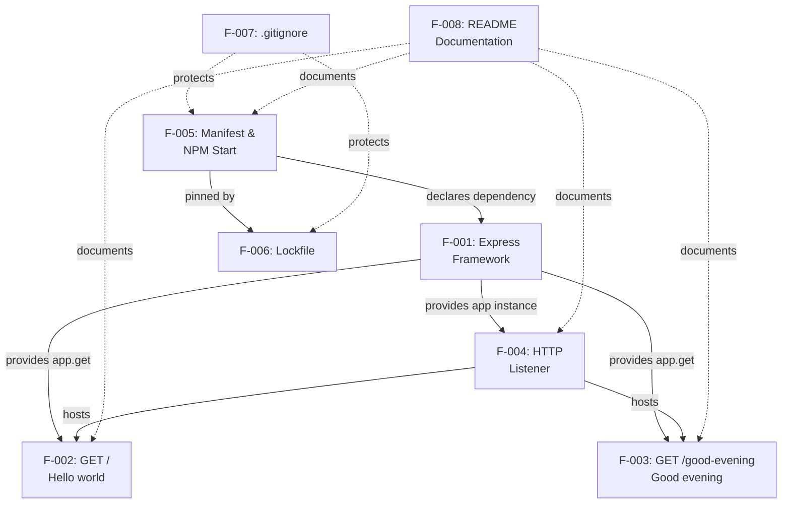

### 2.3.2 Integration Points

The system has a deliberately minimal integration surface. The only runtime integration point with the outside world is the HTTP client → endpoint contact at the listener boundary.

| Integration Point | Direction | Participants | Protocol |
|-------------------|-----------|--------------|----------|
| HTTP client to `GET /` | Inbound | curl/browser → F-004 → F-002 | HTTP/1.1 over TCP |
| HTTP client to `GET /good-evening` | Inbound | curl/browser → F-004 → F-003 | HTTP/1.1 over TCP |
| Dependency resolution | Install-time only | npm CLI → public npm registry | HTTPS |
| Process launch | Operator-driven | Shell → `npm start` → `node server.js` | Process exec |

No upstream service registry, downstream database, message broker, identity provider, or sidecar integration exists, as explicitly captured in Section 1.2.1 ("There is no enterprise landscape — neither implied nor documented — surrounding this artifact").

### 2.3.3 Shared Components and Common Services

Because the entire runtime is contained in a single 62-line file, sharing is achieved by direct lexical reference rather than by injection or service location.

| Shared Component | Consumers | Source Location |
|------------------|-----------|-----------------|
| `express()` app instance | F-002, F-003, F-004 | `server.js` line 32 |
| `PORT` constant | F-004 | `server.js` line 37 |
| `res.send(...)` response helper | F-002, F-003 | Provided by Express via F-001 |
| Manifest entry point (`server.js`) | F-005, F-007 (indirectly) | `package.json` `"main"` field |
| Endpoint catalog | F-002, F-003 (documentation mirror) | `README.md` lines 39–44 |

There are no middleware layers, controllers, services, repositories, factories, or dependency-injection containers. The "shared component" set is therefore intentionally trivial.

---

## 2.4 IMPLEMENTATION CONSIDERATIONS

### 2.4.1 Technical Constraints

The Agent Action Plan enumerates six explicit rules that constrain every feature. The following matrix maps each rule to the features it governs.

| Constraint | Governed Features | Source |
|------------|-------------------|--------|
| Express.js mandated; native `http`, Fastify, Koa forbidden | F-001, F-002, F-003 | Critical Success Factor #1 (Section 1.2.3) |
| Additive, backward-compatible change; `GET /` must remain reachable | F-002, F-003 | Critical Success Factor #2 |
| Exact, literal response bodies (byte-for-byte) | F-002, F-003 | Critical Success Factor #3 |
| Minimal idiomatic footprint; no extra runtime dependencies | F-001, F-005, F-006 | Critical Success Factor #4 |
| Runtime floor Node.js `>= 18`; lockfile committed | F-005, F-006 | Critical Success Factor #5 |
| `node_modules/` not committed; `.gitignore` coverage | F-007 | Critical Success Factor #6 |
| CommonJS module system (no `"type": "module"`) | F-001 | `package.json`; `server.js` `require` calls |

### 2.4.2 Performance Requirements

No performance requirements are documented anywhere in the source files. Section 1.2.3 explicitly states that "No KPIs (response-time percentiles, error budgets, uptime SLAs, request volumes) are documented in any source file." Default single-process Express behavior is accepted across all features. Verification is exclusively manual via `curl`-based smoke tests; no load testing, soak testing, or benchmarking is in scope.

| Feature | Performance Expectation |
|---------|-------------------------|
| F-001 to F-008 | Default Express 5.x single-process behavior; no quantified latency, throughput, or concurrency targets |

### 2.4.3 Scalability Considerations

Scalability is intentionally out of scope. The system runs as a single Node.js process bound to one TCP listener. The following capabilities are explicitly excluded by Section 1.3.2:

- Clustering or worker processes
- HTTP/2 or HTTPS/TLS
- Caching layers
- Load balancing or reverse proxying
- Multi-tenant or multi-user identity

No feature in the catalog has a horizontal-scale path defined; any such expansion would constitute a future phase beyond the current change.

### 2.4.4 Security Implications

Security requirements are intentionally minimal because no authentication, authorization, sensitive data handling, or user-supplied input is present in the system.

| Feature | Security Posture |
|---------|------------------|
| F-001 | Inherits Express 5.x's hardened, ReDoS-resistant route matcher by default |
| F-002, F-003 | Accept no input; expose only fixed, public, plain-text strings |
| F-004 | Binds without TLS; intended for `localhost` development only |
| F-005, F-006 | Dependency integrity enforced via lockfile SRI hashes |
| F-007 | `.env` exclusion patterns prevent accidental secret leakage |
| F-008 | No security guidance is published because none is applicable to tutorial scope |

The server is explicitly not intended for production hosting (Section 1.3.2: "Production hosting. The server binds on `localhost` and ships without TLS termination, process supervision, observability, or rate limiting").

### 2.4.5 Maintenance Requirements

Maintenance overhead is minimized by design. The following maintenance touchpoints exist:

| Concern | Maintenance Action | Owning Feature |
|---------|-------------------|----------------|
| Express security patches | Re-run `npm install` to refresh lockfile; commit updated `package-lock.json` | F-006 |
| Node.js engine bumps | Update `engines.node` floor in `package.json` if Express raises its requirement | F-005 |
| Endpoint catalog drift | Keep `README.md` table synchronized with `server.js` route registrations | F-008 |
| `.gitignore` extensions | Add new ignore patterns as new toolchains are introduced (currently none planned) | F-007 |

No formal release cadence, version-bump policy, deprecation policy, or backward-compatibility guarantee is documented. The artifact is private (`"private": true` in `package.json`) and is not published to the public npm registry.

---

## 2.5 TRACEABILITY MATRIX

The following matrix traces each feature to its originating requirement (from the Agent Action Plan), its primary source file, and its verification mechanism. This ensures complete coverage from intent through implementation to validation.

### 2.5.1 Feature-to-Source Traceability

| Feature ID | Primary Source File(s) | Originating Requirement |
|------------|------------------------|-------------------------|
| F-001 | `package.json`, `server.js` | Agent Action Plan R1 ("Adopt Express.js") |
| F-002 | `server.js` lines 39–46 | Agent Action Plan R3 ("Preserve the baseline") |
| F-003 | `server.js` lines 48–54 | Agent Action Plan R2 ("New endpoint") |
| F-004 | `server.js` lines 37, 59–61 | Implicit (port resolution idiom); Ambiguity A5 resolution |
| F-005 | `package.json` | Implicit (npm conventions); manifest is precondition for R1 |
| F-006 | `package-lock.json` | Critical Success Factor #5 ("Runtime floor and lockfile") |
| F-007 | `.gitignore` | Agent Action Plan I5 ("Ignore rules"); Critical Success Factor #6 |
| F-008 | `README.md` | Agent Action Plan I6 ("Documentation") |

### 2.5.2 Requirement-to-Acceptance-Criteria Traceability

| Requirement ID | Acceptance Criterion | Verification Mechanism |
|----------------|----------------------|------------------------|
| F-001-RQ-001 to F-001-RQ-004 | Express imports successfully; no other runtime deps | Inspect `package.json` `dependencies`; run `node server.js` |
| F-002-RQ-001 to F-002-RQ-004 | `GET /` returns byte sequence `Hello world` | `curl -s localhost:3000/` |
| F-003-RQ-001 to F-003-RQ-004 | `GET /good-evening` returns byte sequence `Good evening` | `curl -s localhost:3000/good-evening` |
| F-004-RQ-001 to F-004-RQ-004 | Server binds on `PORT` or 3000; logs bind URL | Observe stdout; verify reachability on chosen port |
| F-005-RQ-001 to F-005-RQ-004 | `npm install` and `npm start` succeed | Manual workflow execution |
| F-006-RQ-001 to F-006-RQ-004 | Lockfile version 3 present; pinned versions match manifest | Inspect `package-lock.json` |
| F-007-RQ-001 to F-007-RQ-004 | `git status` after `npm install` shows no `node_modules/` | Manual `git status` check |
| F-008-RQ-001 to F-008-RQ-004 | New reader can launch server using README alone | Manual walkthrough |

### 2.5.3 Ambiguity Resolution Reference

The originating user request contained ambiguities that were formally resolved during the Agent Action Plan phase. These resolutions inform several feature definitions.

| Ambiguity ID | Question | Resolution | Affected Feature(s) |
|--------------|----------|------------|---------------------|
| A1 | Route path for the new endpoint | `GET /good-evening` for new; `GET /` for existing | F-002, F-003 |
| A2 | Express major version | `express@^5.2.1` (latest stable) | F-001, F-006 |
| A3 | Pre-existing baseline absent | Establish-then-extend | F-002, F-005 |
| A4 | HTTP method | `GET` for both endpoints (idempotent text responses) | F-002, F-003 |
| A5 | Listen port | `process.env.PORT \|\| 3000` | F-004 |

---

## 2.6 ASSUMPTIONS AND CONSTRAINTS

### 2.6.1 Documented Assumptions

| ID | Assumption | Source |
|----|-----------|--------|
| AS-1 | Operators have Node.js `>= 18` and npm available locally | `package.json` `engines.node`; `README.md` Prerequisites |
| AS-2 | Operators have a generic HTTP client (curl, browser) for verification | `README.md` Verify section |
| AS-3 | The originating user request — despite mentioning a pre-existing baseline — applies to an effectively empty repository | Section 1.1.2; Agent Action Plan Ambiguity A3 |
| AS-4 | English-language fixed response strings are acceptable; no localization is required | Section 1.3.2 "Unsupported Use Cases" |

### 2.6.2 Documented Constraints

| ID | Constraint | Enforcement Mechanism |
|----|-----------|----------------------|
| CN-1 | No runtime dependencies beyond `express` may be added | Code review against `package.json` |
| CN-2 | No middleware, routers, controllers, or services may be introduced | Code review against `server.js` |
| CN-3 | Response bodies must be byte-for-byte exact (`Hello world`, `Good evening`) | Manual curl verification |
| CN-4 | No automated test suite, CI/CD, Docker, or IaC may be added under current scope | Section 1.3.2 enumerates these as out-of-scope |
| CN-5 | The server must remain launchable by `npm start` with zero additional configuration | Manual workflow execution |

---

## 2.7 References

### 2.7.1 Files Examined

- `server.js` (62 lines) — Express application bootstrap, two inline route handlers, port resolution, listener startup, and feature-level docstrings. Primary source for F-001, F-002, F-003, F-004.
- `package.json` (17 lines) — Project identity (`artifact-2`, `1.0.0`, private, ISC), Node.js engine floor (`>= 18`), Express dependency (`^5.2.1`), `npm start` script. Primary source for F-005 and F-001 dependency declaration.
- `package-lock.json` (lockfile version 3; approximately 29,577 bytes) — Deterministic dependency tree with integrity hashes for Express 5.2.1 and approximately two dozen transitive packages. Primary source for F-006.
- `.gitignore` (20 lines) — Excludes `node_modules/`, npm/yarn debug logs, `.env*` files, generic logs, and OS metadata. Primary source for F-007.
- `README.md` (53 lines) — Prerequisites, install/run commands, endpoint catalog table, curl-based smoke tests, `PORT` override documentation. Primary source for F-008.
- `blitzy/documentation/Input Prompt.md` (2 lines) — Verbatim originating user request asking for Express adoption and a `Good evening` endpoint.
- `blitzy/documentation/Agent Action Plan.md` (322 lines) — Implementation blueprint defining requirements R1–R3, implicit requirements I1–I6, ambiguities A1–A5, the six Rules for Feature Addition, file inventory, and execution plan.

### 2.7.2 Folders Explored

- `/` (repository root) — Confirmed four committed files plus the `blitzy/` documentation folder; no CI/CD, Docker, or test infrastructure present.
- `blitzy/` — Documentation-only workspace containing a single `documentation/` child folder.
- `blitzy/documentation/` — Contains `Input Prompt.md` and `Agent Action Plan.md`; no nested subfolders.

### 2.7.3 Technical Specification Sections Referenced

- Section 1.1 Executive Summary — Project overview, core business problem, stakeholders, value proposition.
- Section 1.2 System Overview — Project context, high-level description, success criteria, critical success factors.
- Section 1.3 Scope — In-scope features, implementation boundaries, out-of-scope items, unsupported use cases.
- Section 1.4 References — Authoritative file and folder inventory.

# 3. Technology Stack

The `artifact-2` system has an intentionally constrained technology footprint. Its entire technology surface consists of one runtime language (JavaScript executed on Node.js), one direct framework dependency (Express.js 5.2.1), and the npm ecosystem for dependency resolution and process launch. Many categories conventionally enumerated in a Technology Stack section — databases, caches, message brokers, identity providers, cloud platforms, containers, CI/CD pipelines, and infrastructure-as-code — are **not present and are explicitly out-of-scope** per Section 1.3.2 and the constraints enumerated in Section 2.6.2 (CN-1 through CN-5).

> **Default Stack Applicability Notice.** The default technology stack supplied in the project prompt (AWS, Docker, Terraform, GitHub Actions, Python/Flask, Auth0, MongoDB, React, Auth0, Langchain, React-Native, Swift, Kotlin, Objective-C, ElectronJS) **does not apply to this artifact**. Section 1.3.2 enumerates frontend layers, authentication, databases, ORMs, TypeScript, performance work, CI/CD, Dockerfiles, container orchestration, and infrastructure-as-code as out-of-scope. Constraint CN-1 (Section 2.6.2) further prohibits the introduction of any runtime dependency beyond `express`. The sections below document only the technologies that are actually used.

## 3.1 PROGRAMMING LANGUAGES

### 3.1.1 Language Inventory by Component

| Component | Language | Version / Standard | Source File(s) |
|-----------|----------|--------------------|----------------|
| Server runtime | JavaScript (CommonJS) | ECMAScript executed on Node.js `>= 18` | `server.js` |
| Project manifest | JSON | RFC 8259 | `package.json` |
| Dependency lockfile | JSON | npm lockfile version 3 | `package-lock.json` |
| Operational documentation | Markdown | CommonMark / GitHub Flavored Markdown | `README.md` |
| Source-control configuration | Plain-text patterns | git ignore syntax | `.gitignore` |

JavaScript is the **only programming language** in the system. All other languages listed (JSON, Markdown) are configuration or documentation formats rather than executable code.

### 3.1.2 Primary Runtime Language: JavaScript on Node.js

The application is authored as standard JavaScript executed by the Node.js runtime. The entry point file `server.js` opens with the directive `'use strict';` to opt the entire file into JavaScript strict mode, eliminating silent failures and disallowing legacy lax-mode behaviors.

| Attribute | Value | Source |
|-----------|-------|--------|
| Runtime | Node.js | `package.json` `engines.node` |
| Minimum supported version | `>= 18` | `package.json` `engines.node`; `README.md` Prerequisites |
| Module system | CommonJS (`require(...)`) | `server.js` line 28; `package.json` (no `"type": "module"`) |
| Strict mode | Enabled | `server.js` line 1: `'use strict';` |
| Engine compatibility driver | Express 5.x requires Node.js `>= 18` | Critical Success Factor #5 (Section 1.2.3) |

### 3.1.3 Module System Selection: CommonJS

The project deliberately uses the CommonJS module system rather than ECMAScript Modules (ESM). This is enforced by the **absence** of a `"type": "module"` field in `package.json`, which causes Node.js to treat the `.js` files as CommonJS by default. The single `require('express')` call at `server.js` line 28 is the only module import in the system.

The rationale for choosing CommonJS, as documented in the `server.js` header docstring, is that CommonJS remains the widely taught module system for introductory Node.js tutorials. This pedagogical alignment is part of Critical Success Factor #4 (minimal, idiomatic footprint following the official Express minimal-server pattern).

### 3.1.4 Language Selection Justification

| Criterion | How JavaScript on Node.js Satisfies It |
|-----------|----------------------------------------|
| Pedagogical alignment | Express.js — the mandated framework — is a Node.js library; JavaScript is the only language in which it can be consumed natively |
| Idiomatic minimal footprint | The canonical "Hello world" Express example in official Express documentation is JavaScript on Node.js; the artifact replicates this pattern exactly |
| Runtime ubiquity | Node.js `>= 18` is available on every major OS, satisfying assumption AS-1 (Section 2.6.1) |
| Reproducibility | The npm ecosystem and `package-lock.json` lockfile version 3 provide deterministic installs (F-006) |
| Constraint compatibility | CN-1 forbids adding runtime dependencies beyond `express`; any non-JavaScript language would require additional tooling and dependencies |

### 3.1.5 Languages Explicitly Excluded

The following languages are documented as out-of-scope by Section 1.3.2 and are therefore not used:

| Excluded Language | Reason | Source |
|-------------------|--------|--------|
| TypeScript | "TypeScript migration, linters, formatters, and bundlers" excluded | Section 1.3.2 |
| Python (default stack) | No applicable component; Node.js is mandated by F-001 | Section 1.2.3 CSF #1 |
| Swift / Kotlin / Objective-C | No mobile or native applications in scope | Section 1.3.2 (no frontend/UI layer) |
| HTML / CSS | No templating engine, static assets, or design system | Section 1.3.2 |

---

## 3.2 FRAMEWORKS & LIBRARIES

### 3.2.1 Core Framework: Express.js

Express.js is the **sole runtime framework** and the **sole declared runtime dependency** of the system. Its adoption is documented as feature F-001 (Section 2.1.1) and is mandated by Critical Success Factor #1 in Section 1.2.3, which prohibits substitution of the native `http` module, Fastify, or Koa.

| Attribute | Value | Source |
|-----------|-------|--------|
| Package name | `express` | `package.json` `dependencies` |
| Declared version range | `^5.2.1` | `package.json` `dependencies.express` |
| Resolved exact version | `5.2.1` | `package-lock.json` |
| Tarball source | `https://registry.npmjs.org/express/-/express-5.2.1.tgz` | `package-lock.json` |
| Integrity hash | `sha512-hIS4idWWai69NezIdRt2xFVofaF4j+6INOpJlVOLDO8zXGpUVEVzIYk12UUi2JzjEzWL3IOAxcTubgz9Po0yXw==` | `package-lock.json` |
| License | MIT | `package-lock.json` |
| Engine requirement | Node.js `>= 18` | Express 5.x peer requirement |

### 3.2.2 Express API Surface Area Used

`server.js` exercises only the smallest possible subset of the Express API. The total API surface across the 62-line entry point is:

| Express API | Usage | Source Location |
|-------------|-------|-----------------|
| `express()` | Application factory invoked once to produce the `app` instance | `server.js` line 32 |
| `app.get(path, handler)` | Route registration for `/` and `/good-evening` | `server.js` lines 46, 54 |
| `res.send(string)` | Plain-text response helper used by both route handlers | `server.js` lines 46, 54 |
| `app.listen(port, callback)` | TCP listener binding with startup log | `server.js` line 59 |

No router objects, no middleware chains (`app.use(...)`), no error-handling middleware, no templating engines, and no static-file serving are present. This minimalism is enforced by constraint CN-2 (Section 2.6.2).

### 3.2.3 Justification for Framework Choice

| Justification | Evidence |
|---------------|----------|
| Explicit user mandate | The originating prompt (`blitzy/documentation/Input Prompt.md`) requested Express adoption verbatim |
| Critical Success Factor compliance | Section 1.2.3 CSF #1 explicitly forbids substitution of Express |
| Latest stable major version | Express 5.x is the current major; `5.2.1` is the resolved exact version per `package-lock.json` |
| Inherent security improvement | Express 5.x ships a hardened, ReDoS-resistant route matcher by default (Section 2.1.1.2; Section 2.4.4) |
| Minimal runtime footprint | A single declared dependency satisfies Critical Success Factor #4 |
| Pedagogical coverage | Provides `app.get(path, handler)` routing and `res.send(...)` response helper out of the box (Section 2.1.1.2) |

### 3.2.4 Frameworks and Libraries Explicitly Excluded

The following categories are documented as out-of-scope by Section 1.3.2, Section 2.6.2 (CN-1, CN-2), and Section 2.4 — and therefore are **not** present in the system:

| Category | Excluded Examples | Source |
|----------|-------------------|--------|
| Alternative HTTP frameworks | Native `http`, Fastify, Koa | CSF #1 (Section 1.2.3) |
| Custom middleware | `body-parser`, `cors`, `helmet`, `morgan`, `compression` | CN-1, CN-2 (Section 2.6.2) |
| Application architecture layers | Routers, controllers, services, repositories, DI containers | CN-2 (Section 2.6.2); Section 2.3.3 |
| Templating engines | EJS, Pug, Handlebars, Mustache | Section 1.3.2 |
| ORMs / data access | Mongoose, Sequelize, Prisma, TypeORM, Knex | Section 1.3.2 |
| Frontend frameworks | React, Vue, Angular, Svelte, React Native | Section 1.3.2 |
| AI frameworks | Langchain, LlamaIndex (from default stack) | Section 1.3.2 (no AI scope) |
| Test frameworks | Jest, Mocha, Jasmine, Vitest, Supertest | Section 1.3.2; CN-4 (Section 2.6.2) |
| Linters / formatters / bundlers | ESLint, Prettier, Webpack, esbuild, Rollup, Babel, tsc | Section 1.3.2 |
| Process supervisors / dev runners | `nodemon`, `pm2`, `forever` | Section 1.3.2 (no production hosting) |

Note that although `body-parser`, `cookie-parser`-equivalent (`cookie`), and `serve-static` are **transitively** present in `node_modules/` as Express 5 internal dependencies (see Section 3.3.2), the application code does not invoke them. They are unused implementation details of Express.

### 3.2.5 Development Dependencies

`package.json` declares **no `devDependencies`** section. The manifest is 17 lines and contains only the `dependencies` block with `express ^5.2.1` as its single entry. This absence is intentional: per Section 2.1.5.2, the manifest "declares no `devDependencies`," and per Section 1.3.2 no linter, formatter, bundler, or test framework is in scope.

---

## 3.3 OPEN SOURCE DEPENDENCIES

### 3.3.1 Direct Runtime Dependencies

| Package | Declared Range | Resolved Version | License | Purpose |
|---------|---------------|------------------|---------|---------|
| `express` | `^5.2.1` | `5.2.1` | MIT | Sole runtime web framework |

This is the **complete** list of direct runtime dependencies. Per constraint CN-1 (Section 2.6.2): "No runtime dependencies beyond `express` may be added."

### 3.3.2 Transitive Dependency Tree

Although the application declares only one dependency, `npm install` materializes a complete transitive tree into `node_modules/`. This tree is pinned deterministically by `package-lock.json` (lockfile version 3, approximately 29,577 bytes, 67 package entries including root).

#### 3.3.2.1 Transitive Dependency Inventory

The 66 transitive packages installed by Express 5.2.1 are enumerated below. All packages are sourced from the public npm registry and carry MIT, ISC, or BSD-3-Clause licenses.

| Package | Version | License |
|---------|---------|---------|
| `accepts` | 2.0.0 | MIT |
| `body-parser` | 2.2.2 | MIT |
| `bytes` | 3.1.2 | MIT |
| `call-bind-apply-helpers` | 1.0.2 | MIT |
| `call-bound` | 1.0.4 | MIT |
| `content-disposition` | 1.1.0 | MIT |
| `content-type` | 1.0.5 | MIT |
| `cookie` | 0.7.2 | MIT |
| `cookie-signature` | 1.2.2 | MIT |
| `debug` | 4.4.3 | MIT |
| `depd` | 2.0.0 | MIT |
| `dunder-proto` | 1.0.1 | MIT |
| `ee-first` | 1.1.1 | MIT |
| `encodeurl` | 2.0.0 | MIT |
| `es-define-property` | 1.0.1 | MIT |
| `es-errors` | 1.3.0 | MIT |
| `es-object-atoms` | 1.1.2 | MIT |
| `escape-html` | 1.0.3 | MIT |
| `etag` | 1.8.1 | MIT |
| `finalhandler` | 2.1.1 | MIT |
| `forwarded` | 0.2.0 | MIT |
| `fresh` | 2.0.0 | MIT |
| `function-bind` | 1.1.2 | MIT |
| `get-intrinsic` | 1.3.0 | MIT |
| `get-proto` | 1.0.1 | MIT |
| `gopd` | 1.2.0 | MIT |
| `has-symbols` | 1.1.0 | MIT |
| `hasown` | 2.0.4 | MIT |
| `http-errors` | 2.0.1 | MIT |
| `iconv-lite` | 0.7.2 | MIT |
| `inherits` | 2.0.4 | ISC |
| `ipaddr.js` | 1.9.1 | MIT |
| `is-promise` | 4.0.0 | MIT |
| `math-intrinsics` | 1.1.0 | MIT |
| `media-typer` | 1.1.0 | MIT |
| `merge-descriptors` | 2.0.0 | MIT |
| `mime-db` | 1.54.0 | MIT |
| `mime-types` | 3.0.2 | MIT |
| `ms` | 2.1.3 | MIT |
| `negotiator` | 1.0.0 | MIT |
| `object-inspect` | 1.13.4 | MIT |
| `on-finished` | 2.4.1 | MIT |
| `once` | 1.4.0 | ISC |
| `parseurl` | 1.3.3 | MIT |
| `path-to-regexp` | 8.4.2 | MIT |
| `proxy-addr` | 2.0.7 | MIT |
| `qs` | 6.15.2 | BSD-3-Clause |
| `range-parser` | 1.2.1 | MIT |
| `raw-body` | 3.0.2 | MIT |
| `router` | 2.2.0 | MIT |
| `safer-buffer` | 2.1.2 | MIT |
| `send` | 1.2.1 | MIT |
| `serve-static` | 2.2.1 | MIT |
| `setprototypeof` | 1.2.0 | ISC |
| `side-channel` | 1.1.0 | MIT |
| `side-channel-list` | 1.0.1 | MIT |
| `side-channel-map` | 1.0.1 | MIT |
| `side-channel-weakmap` | 1.0.2 | MIT |
| `statuses` | 2.0.2 | MIT |
| `toidentifier` | 1.0.1 | MIT |
| `type-is` | 2.1.0 | MIT |
| `content-type` (nested) | 2.0.0 | MIT |
| `unpipe` | 1.0.0 | MIT |
| `vary` | 1.1.2 | MIT |
| `wrappy` | 1.0.2 | ISC |

#### 3.3.2.2 Express Direct Dependencies

The Express 5.2.1 package itself declares the following 28 direct dependencies (per `package-lock.json`):

`accepts ^2.0.0`, `body-parser ^2.2.1`, `content-disposition ^1.0.0`, `content-type ^1.0.5`, `cookie ^0.7.1`, `cookie-signature ^1.2.1`, `debug ^4.4.0`, `depd ^2.0.0`, `encodeurl ^2.0.0`, `escape-html ^1.0.3`, `etag ^1.8.1`, `finalhandler ^2.1.0`, `fresh ^2.0.0`, `http-errors ^2.0.0`, `merge-descriptors ^2.0.0`, `mime-types ^3.0.0`, `on-finished ^2.4.1`, `once ^1.4.0`, `parseurl ^1.3.3`, `proxy-addr ^2.0.7`, `qs ^6.14.0`, `range-parser ^1.2.1`, `router ^2.2.0`, `send ^1.1.0`, `serve-static ^2.2.0`, `statuses ^2.0.1`, `type-is ^2.0.1`, `vary ^1.1.2`.

### 3.3.3 Package Registry and Resolution

| Attribute | Value |
|-----------|-------|
| Registry | `https://registry.npmjs.org/` (public npm registry) |
| Access protocol | HTTPS |
| Usage scope | Install-time only; not contacted at runtime |
| Reproducibility | `package-lock.json` (lockfile version 3) pins exact versions and tarball URLs |
| Integrity verification | sha512 Subresource Integrity (SRI) hashes recorded for every package |

Per Section 2.1.5.3, the public npm registry is used "only at install time, not at runtime." Once `npm install` has completed, the running server makes no outbound network calls to package registries.

### 3.3.4 License Compliance

| License | Count |
|---------|-------|
| MIT | 60 packages |
| ISC | 4 packages (`inherits`, `once`, `setprototypeof`, `wrappy`) |
| BSD-3-Clause | 1 package (`qs`) |
| Combined Express direct | MIT |
| Project (`artifact-2`) | ISC (declared in `package.json`) |

All licenses in the dependency tree are permissive, OSI-approved, and mutually compatible. The project itself is registered as `"private": true` in `package.json`, signaling that it is not intended for publication to the public npm registry (Section 1.1.4).

---

## 3.4 THIRD-PARTY SERVICES

### 3.4.1 Runtime Third-Party Services: None

The system integrates with **no external third-party services at runtime**. Section 1.2.1 explicitly states: "there is no upstream service registry, downstream database, message broker, or sidecar integration." The single runtime integration boundary is the inbound HTTP listener that accepts client requests on `localhost:${PORT}`.

| Service Category | Status | Source |
|------------------|--------|--------|
| External APIs | **None** | Section 1.2.1 |
| Authentication / Identity providers | **None** | Section 1.3.2 (Auth/AuthN out of scope) |
| Monitoring / Observability | **None** | Section 2.4.4 ("ships without ... observability") |
| Cloud platforms (AWS, GCP, Azure) | **None** | Section 1.3.2 (no IaC, no hosting) |
| Message brokers / queues | **None** | Section 1.2.1 |
| Email / SMS providers | **None** | Not in scope |
| CDN | **None** | Section 1.3.2 (no static assets) |
| Analytics / Telemetry | **None** | Section 2.4.4 |
| Feature flag services | **None** | Not in scope |
| Secrets management | **None** | `.gitignore` only excludes `.env` files (F-007) |

### 3.4.2 Install-Time External Integration

| Integration | Direction | Participants | Protocol |
|-------------|-----------|--------------|----------|
| Dependency resolution | Outbound, install-time only | npm CLI → `https://registry.npmjs.org/` | HTTPS |

This is the **only** outbound integration in the entire system, and it occurs only when an operator runs `npm install`. The running server process makes no outbound calls. This contrasts the install-time and runtime boundaries clearly per Section 2.3.2.

### 3.4.3 Runtime Inbound Integration

| Integration Point | Direction | Participants | Protocol |
|-------------------|-----------|--------------|----------|
| HTTP client → `GET /` | Inbound | curl/browser → F-004 → F-002 | HTTP/1.1 over TCP |
| HTTP client → `GET /good-evening` | Inbound | curl/browser → F-004 → F-003 | HTTP/1.1 over TCP |

The HTTP client integration is the **only runtime integration** with the outside world. Both endpoints return plain-text bodies (`Hello world`, `Good evening`) with no required headers, authentication, or query parameters.

### 3.4.4 Default-Stack Services Excluded

The following services from the default technology stack are **explicitly not applicable**:

| Default Service | Reason for Exclusion |
|-----------------|---------------------|
| Auth0 | No authentication; all consumers are anonymous (Section 1.1.3, 1.3.2) |
| AWS (any service) | No cloud infrastructure (Section 1.3.2) |
| MongoDB Atlas | No persistence (Section 1.3.2) |
| Langchain hosted endpoints | No AI scope |

---

## 3.5 DATABASES & STORAGE

### 3.5.1 Persistence Posture: None

The system contains **no persistence layer**. Section 1.3.1 explicitly defines data domains as "None — no persistence, no schema, no data modeling." Section 1.3.2 enumerates "Databases, ORMs, migrations, and data models" as out-of-scope, and constraint CN-2 (Section 2.6.2) prohibits the introduction of services or repositories.

| Storage Category | Status | Source |
|------------------|--------|--------|
| Primary relational database | **None** | Section 1.3.2 |
| NoSQL / document database | **None** | Section 1.3.2 (MongoDB default not applicable) |
| In-memory cache | **None** | Section 1.3.2 ("caching" excluded) |
| Object storage (S3, GCS, etc.) | **None** | Section 1.3.2 (no cloud) |
| File storage | **None** | Section 1.3.2 (no static assets) |
| Session store | **None** | Section 1.3.2 (no sessions) |
| Search index | **None** | Not in scope |
| Time-series / metrics database | **None** | Section 2.4.4 (no observability) |

### 3.5.2 State Management Strategy

All state in the running process is **in-memory and ephemeral**:

| State Element | Lifetime | Location |
|---------------|----------|----------|
| Express `app` instance | Process lifetime | `server.js` line 32 |
| Resolved `PORT` constant | Process lifetime | `server.js` line 37 |
| Route handler closures | Process lifetime | `server.js` lines 46, 54 |
| Constant response strings (`Hello world`, `Good evening`) | Process lifetime | Captured in handler closures |

There is no per-request state, no client session, no cookie storage, no log persistence, and no file I/O beyond the stdout startup log line.

### 3.5.3 Default-Stack Storage Excluded

| Default Storage | Reason for Exclusion |
|-----------------|---------------------|
| MongoDB | No persistence; no data models; no ORM (Section 1.3.2; CN-2) |

---

## 3.6 DEVELOPMENT & DEPLOYMENT

### 3.6.1 Development Tools

| Tool | Required Version | Role | Source |
|------|------------------|------|--------|
| Node.js | `>= 18` | Runtime; provides `node` interpreter | `package.json` `engines.node`; `README.md` |
| npm CLI | Bundled with Node.js | Package install, lockfile generation, script execution | `README.md` Prerequisites |
| Git | Any modern version | Source-control with `.gitignore` enforcement | `.gitignore` (F-007) |
| HTTP client | curl, browser, or equivalent | Manual smoke-test verification | `README.md` Verify section |

A reference build environment of Node.js v22.22.2 and npm 11.1.0 has been used; any Node.js `>= 18` release should satisfy assumption AS-1 (Section 2.6.1).

### 3.6.2 Build System

| Aspect | Approach |
|--------|----------|
| Build tool | npm (no separate task runner) |
| Transpilation | **None** — JavaScript is executed as authored |
| Bundling | **None** — no Webpack, Rollup, esbuild, Parcel |
| Minification | **None** |
| TypeScript compilation | **Not applicable** — TypeScript is out-of-scope (Section 1.3.2) |
| Asset pipeline | **None** — no static assets |

#### 3.6.2.1 npm Scripts

`package.json` declares exactly one script:

| Script | Command | Purpose |
|--------|---------|---------|
| `start` | `node server.js` | Launch the Express server (F-005) |

No `test`, `build`, `lint`, `format`, `dev`, or `prepare` script is defined. Per Section 1.3.2, "no test framework, test files, or `test` script is included in `package.json`."

### 3.6.3 Configuration Management

| Mechanism | Default | Override Procedure |
|-----------|---------|---------------------|
| Listen port | `3000` | `PORT` environment variable (e.g., `PORT=8080 npm start`) |
| Environment files | Not used | `.env` and `.env.*` are excluded by `.gitignore` |
| Configuration files | None beyond `package.json` | N/A |

The port resolution rule is `process.env.PORT || 3000` (`server.js` line 37). This is the **only runtime configuration parameter** in the system (feature F-004, Section 2.1.4). Constraint CN-5 (Section 2.6.2) requires the server to remain launchable with zero additional configuration.

### 3.6.4 Source-Control Configuration

The `.gitignore` file (20 lines, feature F-007 per Section 2.1.7) excludes the following categories from version control:

| Category | Patterns |
|----------|----------|
| Materialized dependencies | `node_modules/` |
| npm debug output | `npm-debug.log*` |
| Yarn debug output | `yarn-debug.log*`, `yarn-error.log*` |
| Environment files | `.env`, `.env.*` |
| Generic logs | `logs`, `*.log` |
| OS metadata | `.DS_Store` |

Per Critical Success Factor #6 (Section 1.2.3), `node_modules/` is intentionally **not committed**; learners reproduce the tree by running `npm install` against the committed `package-lock.json`. The `.env` patterns provide a baseline guard against accidental secret leakage (Section 2.4.4, F-007 security posture).

### 3.6.5 Containerization: Not Applicable

| Item | Status |
|------|--------|
| `Dockerfile` | **Not present, out-of-scope** |
| `docker-compose.yml` | **Not present, out-of-scope** |
| Kubernetes manifests | **Not present, out-of-scope** |
| Helm charts | **Not present, out-of-scope** |
| Container registry integration | **Not present, out-of-scope** |

Per Section 1.3.2: "Dockerfiles and container orchestration. No `Dockerfile`, `docker-compose.yml`, Kubernetes manifests, or Helm charts exist." Constraint CN-4 (Section 2.6.2) further codifies this exclusion. The default stack's Docker recommendation is **not applicable** to this artifact.

### 3.6.6 CI/CD: Not Applicable

| Item | Status |
|------|--------|
| GitHub Actions workflows | **Not present, out-of-scope** |
| GitLab CI configuration | **Not present, out-of-scope** |
| Jenkins pipelines | **Not present, out-of-scope** |
| CircleCI / Travis / Buildkite | **Not present, out-of-scope** |
| Pre-commit hooks | **Not present, out-of-scope** |

Per Section 1.3.2: "CI/CD pipelines. No GitHub Actions, GitLab CI, Jenkins, or equivalent configuration is present in the repository." Constraint CN-4 codifies this exclusion. The default stack's GitHub Actions recommendation is **not applicable**.

### 3.6.7 Infrastructure as Code: Not Applicable

| Item | Status |
|------|--------|
| Terraform | **Not present, out-of-scope** |
| Pulumi | **Not present, out-of-scope** |
| AWS CloudFormation / CDK | **Not present, out-of-scope** |
| Ansible / Chef / Puppet | **Not present, out-of-scope** |

Per Section 1.3.2: "Infrastructure-as-code. No Terraform, Pulumi, or CloudFormation templates." The default stack's Terraform recommendation is **not applicable**.

### 3.6.8 Verification and Testing

| Aspect | Approach |
|--------|----------|
| Test framework | **None** — no Jest, Mocha, Vitest, Jasmine, Supertest |
| Test files | **None** |
| `test` npm script | **Not defined** |
| Verification method | **Manual** — curl-based smoke tests documented in `README.md` |
| Linting | **None** — no ESLint, no Prettier |
| Type checking | **Not applicable** — no TypeScript |

Smoke-test commands documented in `README.md`:

```bash
curl -s localhost:3000/              # -> Hello world
curl -s localhost:3000/good-evening  # -> Good evening
```

Per Section 1.3.2, "A formal automated test suite. The Agent Action Plan classifies tests as an optional enhancement only; no test framework, test files, or `test` script is included in `package.json`."

### 3.6.9 Deployment: Not Applicable

| Aspect | Status |
|--------|--------|
| Production hosting | **Not in scope** |
| Process supervision (`pm2`, `systemd`) | **None** |
| Reverse proxy (`nginx`, `Caddy`) | **None** |
| TLS termination | **None** |
| Rate limiting | **None** |
| Health-check endpoint | **None** |

Per Section 2.4.4: "The server is explicitly not intended for production hosting." The server binds to `localhost` and ships without TLS, observability, or rate limiting. The intended execution target is a developer workstation running `npm start`.

---

## 3.7 TECHNOLOGY STACK ARCHITECTURE

### 3.7.1 Stack Component Wiring

The diagram below summarizes how the technology stack components interact at install time and at runtime. It is consistent with the dependency map in Section 2.3.1 and the integration table in Section 2.3.2.

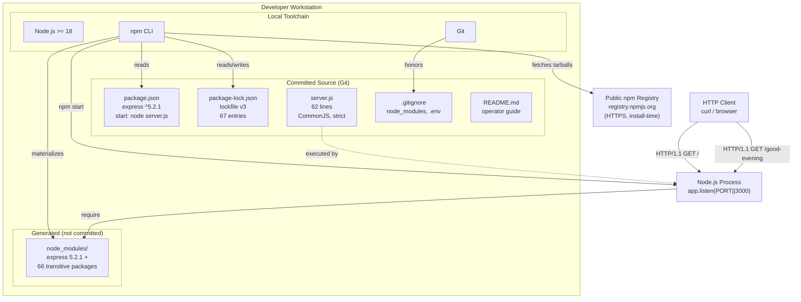

### 3.7.2 Process Launch Flow

The end-to-end launch flow exercising every stack component:

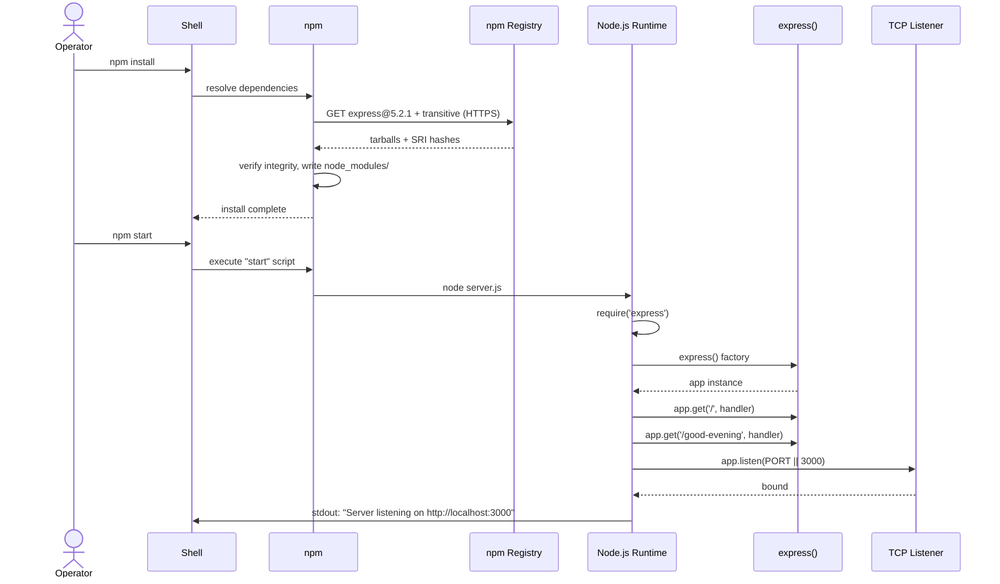

### 3.7.3 Technology Selection Summary

| Concern | Selected Technology | Alternative Considered | Rationale |
|---------|---------------------|------------------------|-----------|
| Language | JavaScript on Node.js `>= 18` | TypeScript, Python | Section 1.3.2 excludes TypeScript; Express requires Node.js |
| Module system | CommonJS | ESM | Widely taught system; per `server.js` docstring |
| Framework | Express.js `^5.2.1` | Native `http`, Fastify, Koa | Mandated by CSF #1 (Section 1.2.3); user request (F-001) |
| Package manager | npm | Yarn, pnpm | Bundled with Node.js; minimal toolchain (CSF #4) |
| Manifest format | npm `package.json` | None (single-file scripts) | Required for `npm start` workflow (F-005) |
| Lockfile | `package-lock.json` v3 | `yarn.lock`, `pnpm-lock.yaml` | Generated by npm; matches package manager choice (F-006) |
| Configuration | `process.env.PORT` only | `.env` files, config libraries | Zero-configuration default (CN-5); single override variable |
| Persistence | In-memory (none) | MongoDB, SQLite, JSON file | Section 1.3.1 explicitly: "no persistence" |
| Test framework | None (manual curl) | Jest, Mocha, Supertest | Section 1.3.2: tests are future-phase only |
| Container | None | Docker, Podman | Section 1.3.2; CN-4 |
| CI/CD | None | GitHub Actions, GitLab CI | Section 1.3.2; CN-4 |

---

## 3.8 References

### 3.8.1 Repository Files Examined

- `package.json` (17 lines) — Project manifest declaring `artifact-2` v1.0.0, `"private": true`, ISC license, `engines.node >= 18`, `dependencies.express ^5.2.1`, and `scripts.start = node server.js`. Sole source for direct dependency declaration.
- `server.js` (62 lines) — Executable entry point using CommonJS `require('express')`, instantiating one `app`, registering two `GET` handlers, resolving port via `process.env.PORT || 3000`, and calling `app.listen`. Sole source for application code language and API surface analysis.
- `package-lock.json` (847 lines, 29,577 bytes, lockfile version 3) — Deterministic dependency tree for Express 5.2.1 and 66 transitive packages with SRI integrity hashes and resolved tarball URLs. Sole source for transitive dependency enumeration and license inventory.
- `README.md` (53 lines) — Operational documentation covering Node.js `>= 18` prerequisite, install/run commands, endpoint catalog, curl smoke tests, and `PORT` override. Source for development tools and verification approach.
- `.gitignore` (20 lines) — Source-control hygiene patterns for `node_modules/`, debug logs, `.env` files, generic logs, and OS metadata files. Source for source-control configuration.
- `blitzy/documentation/Input Prompt.md` — Verbatim originating user request mandating Express adoption. Justification source for framework choice.
- `blitzy/documentation/Agent Action Plan.md` — Implementation blueprint enumerating scope boundaries, the six Critical Success Factors, and the establish-then-extend strategy. Source for stack constraints.

### 3.8.2 Folders Explored

- `/` (repository root) — Confirmed inventory: four committed files (`package.json`, `package-lock.json`, `server.js`, `.gitignore`, `README.md`) plus the `blitzy/` documentation folder; no Docker, CI/CD, IaC, or test infrastructure.
- `blitzy/documentation/` — Contains `Input Prompt.md` and `Agent Action Plan.md`; no nested subfolders.
- `node_modules/` — Generated by `npm install`; not committed (per `.gitignore` F-007); contains Express 5.2.1 plus 66 transitive packages.

### 3.8.3 Technical Specification Cross-References

- Section 1.1 EXECUTIVE SUMMARY — Project identity, ISC license, `express ^5.2.1` as sole runtime dependency, CommonJS rationale.
- Section 1.2 SYSTEM OVERVIEW — Component wiring diagram, Critical Success Factors #1–#6 driving stack choices (especially CSF #1 Express mandate and CSF #4 minimal footprint).
- Section 1.3 SCOPE — In-scope items, implementation boundaries, and explicit out-of-scope enumeration covering TypeScript, frontend, auth, databases, ORMs, performance work, Docker, CI/CD, and IaC.
- Section 1.4 References — File and folder inventory.
- Section 2.1 FEATURE CATALOG — Features F-001 (Express adoption), F-005 (manifest), F-006 (lockfile), F-007 (.gitignore) defining the technology stack components.
- Section 2.3 FEATURE RELATIONSHIPS — Integration points table establishing the single install-time (npm registry) and single runtime (HTTP client) integration boundaries.
- Section 2.4 IMPLEMENTATION CONSIDERATIONS — Technical constraints matrix, security posture per feature, scalability exclusions.
- Section 2.6 ASSUMPTIONS AND CONSTRAINTS — Assumptions AS-1 through AS-4 and constraints CN-1 through CN-5 governing the technology stack.

# 4. Process Flowchart

## 4.1 SECTION OVERVIEW

This section documents the complete set of workflows, decision points, state transitions, integration sequences, and validation rules exercised by the `artifact-2` system. Because the runtime is contained in a single 62-line `server.js` file with no middleware, routers, controllers, services, persistence, authentication, caching, message brokers, retry logic, or batch processing (per Section 3.2.2 and the comprehensive out-of-scope catalog in Section 1.3.2), the workflow surface is deliberately narrow. The diagrams below capture every flow that the system genuinely exercises and explicitly enumerate the categories that do not apply, citing the authoritative source sections in lieu of fabricating absent behaviors.

### 4.1.1 Scope of Workflows Documented

The system exhibits exactly six observable workflows. All six are documented in this section.

| # | Workflow | Trigger | Primary Source |
|---|----------|---------|----------------|
| 1 | Operator Setup | `npm install` | `README.md` lines 16–18 |
| 2 | Server Bootstrap | `npm start` | `server.js` lines 28–61; `package.json` line 8 |
| 3 | GET / Request–Response | HTTP client | `server.js` line 46 (F-002) |
| 4 | GET /good-evening Request–Response | HTTP client | `server.js` line 54 (F-003) |
| 5 | Unknown Route Default Handling | HTTP client to unregistered path | Express 5.x default `finalhandler` (per Section 3.2.2) |
| 6 | Verification Smoke Tests | Operator `curl` invocations | `README.md` lines 46–53 |

### 4.1.2 High-Level Three-Command Operator Lifecycle

The entire user journey, from a fresh clone to a verified running server, comprises three shell commands: `npm install`, `npm start`, and `curl` (per Section 1.3.1). The following diagram presents the operator's end-to-end journey across these commands.

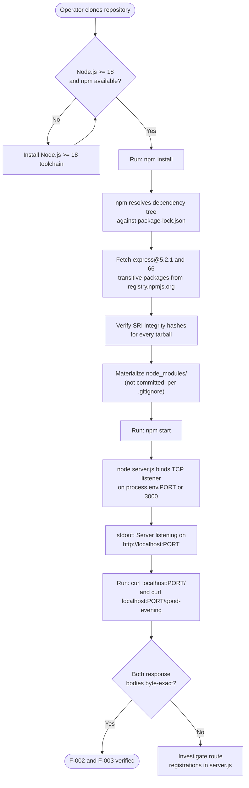

### 4.1.3 Workflow Categories Not Applicable

The following workflow categories, commonly expected in enterprise process documentation, are categorically absent from this artifact. They are documented here for completeness so that downstream readers do not search for them in vain.

| Workflow Category | Status | Authoritative Source |
|-------------------|--------|----------------------|
| User registration, login, password reset | Not present | Section 1.1.3 ("no authentication, authorization, or user-role differentiation"); Section 1.3.2 |
| Multi-step business transactions | Not present | Section 1.3.1 ("Data domains: None — no persistence, no schema, no data modeling") |
| Batch processing sequences | Not present | Section 3.4.1 (no message brokers, no schedulers) |
| Event processing flows | Not present | Section 1.2.1 ("no upstream service registry, downstream database, message broker, or sidecar integration") |
| Webhook or callback dispatch | Not present | Section 3.4.1 (no outbound runtime integrations) |
| Background jobs / cron flows | Not present | Section 1.3.2 ("Process supervisors / dev runners ... `nodemon`, `pm2`, `forever`" excluded) |
| Multi-service orchestration | Not present | Section 1.2.1 ("There is no enterprise landscape") |
| User notification / email flows | Not present | Section 3.4.1 (Email / SMS providers: None) |

---

## 4.2 CORE BUSINESS PROCESSES

### 4.2.1 Operator Setup Workflow (npm install)

This workflow materializes the dependency tree on the operator's workstation. It is the only outbound integration with any external service in the entire artifact (per Section 3.4.2).

#### 4.2.1.1 End-to-End Sequence

```mermaid
sequenceDiagram
    actor Op as Operator
    participant Sh as Shell
    participant NPM as npm CLI
    participant LF as package-lock.json
    participant REG as registry.npmjs.org<br/>(HTTPS)
    participant NM as node_modules/

    Op->>Sh: npm install
    Sh->>NPM: invoke install command
    NPM->>LF: read deterministic tree<br/>(lockfileVersion: 3, 67 entries)
    LF-->>NPM: pinned versions +<br/>SRI integrity hashes
    NPM->>REG: GET express-5.2.1.tgz +<br/>transitive tarballs (HTTPS)
    REG-->>NPM: tarballs + content
    NPM->>NPM: verify sha512 SRI<br/>hash per package
    alt All hashes match
        NPM->>NM: write extracted packages
        NM-->>NPM: tree materialized
        NPM-->>Sh: install complete (exit 0)
        Sh-->>Op: shell prompt returned
    else Any hash mismatch
        NPM-->>Sh: install aborts (non-zero exit)
        Sh-->>Op: error surfaced; node_modules/<br/>incomplete or absent
    end
```

#### 4.2.1.2 Validation and Integrity Checkpoints

The setup workflow contains the following validation gates, all enforced by the npm CLI and the committed lockfile (per Section 2.2.6 / F-006):

| Step | Validation Rule | Enforcement |
|------|-----------------|-------------|
| Lockfile parse | `lockfileVersion: 3` required | npm CLI rejects older or malformed lockfiles |
| Engine check | `engines.node >= 18` (per Section 2.2.5, F-005-RQ-003) | npm emits warning or error on incompatible runtime |
| Tarball download | HTTPS-only transport from `registry.npmjs.org` | TLS enforced by npm CLI |
| Integrity verification | sha512 SRI hash per package (e.g., `sha512-hIS4idWWai69NezIdRt2xFVofaF4j+6INOpJlVOLDO8zXGpUVEVzIYk12UUi2JzjEzWL3IOAxcTubgz9Po0yXw==` for `express@5.2.1`) | npm CLI compares computed hash to lockfile entry |
| Source-control exclusion | `node_modules/` excluded from Git (per F-007-RQ-001) | `.gitignore` honored by Git at `git add` time |

This workflow has no timing SLA. The constraint catalog in Section 2.6.2 (CN-5) requires only that the server "remain launchable by `npm start` with zero additional configuration"; it imposes no install-time performance bound.

### 4.2.2 Server Bootstrap Workflow (npm start)

This workflow executes when the operator runs `npm start`, which the manifest binds to `node server.js` (per Section 2.2.5 / F-005-RQ-002). It contains the system's **only explicit code-level decision point**: the resolution of the listen port.

#### 4.2.2.1 Bootstrap Execution Sequence

The following diagram presents the bootstrap from the perspective of `server.js`'s own execution. It is complementary to (and not duplicative of) the toolchain-perspective sequence diagram in Section 3.7.2.

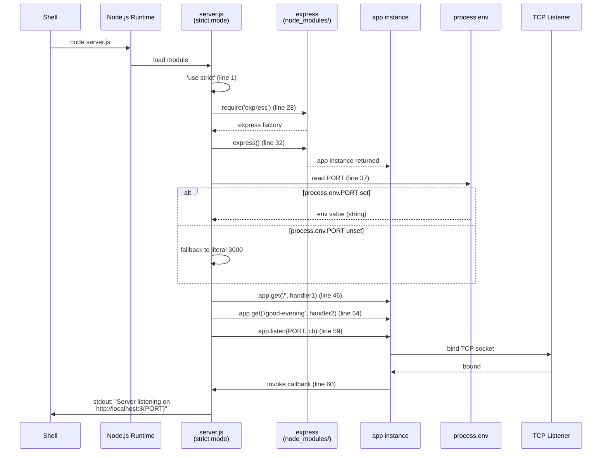

#### 4.2.2.2 Port Resolution Decision Flow

The expression `const PORT = process.env.PORT || 3000;` on `server.js` line 37 is the **only explicit branching logic in the entire codebase**. Per Section 2.5.3 (Ambiguity A5), this idiom was formally adopted as the resolution for the listen-port ambiguity. The decision tree is:

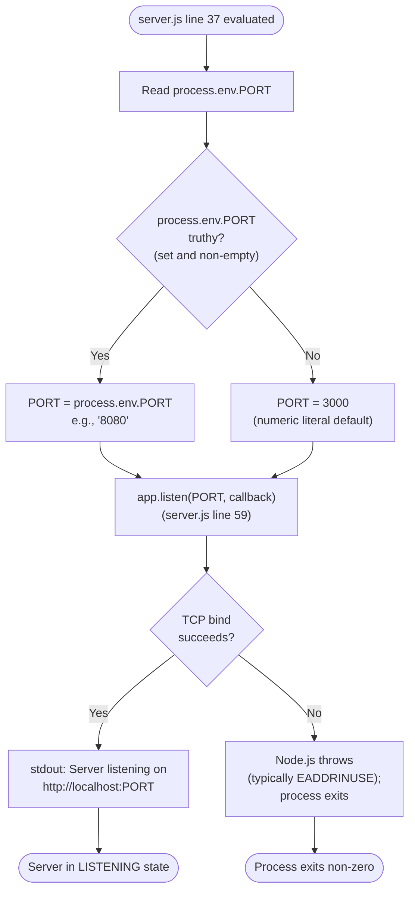

The override pattern is documented in `README.md` line 36 and exercised via shell-prefixed variables (e.g., `PORT=8080 npm start`), per Section 2.2.4 (F-004-RQ-001). No validation is performed on the env-var value; Node.js's `app.listen` accepts numeric strings and integers transparently.

### 4.2.3 Runtime Request Workflow — GET /

This workflow services the F-002 endpoint registered on `server.js` line 46. Its acceptance criterion (per Section 2.5.2) is that `curl -s localhost:3000/` returns the byte sequence `Hello world`.

#### 4.2.3.1 Swim-Lane Process Flow

The diagram uses subgraphs as swim lanes to delineate responsibilities across the four actors that participate in a single request–response cycle.

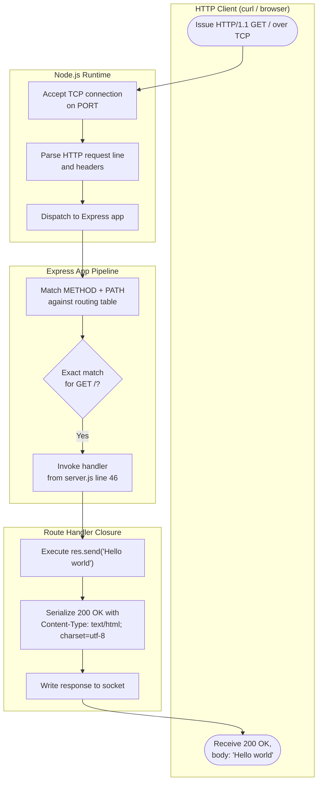

#### 4.2.3.2 Acceptance Criteria and Business Rules

| Aspect | Rule | Source |
|--------|------|--------|
| Input parameters | None — no path parameters, query string, or body accepted | Section 2.2.2.2 (F-002-RQ-001) |
| Output status | HTTP 200 OK | Section 2.2.2.2 |
| Output body | Exact byte sequence `Hello world` (no formatting, punctuation, or markup) | Section 2.2.2 (F-002-RQ-002); Section 2.6.2 (CN-3) |
| Output `Content-Type` | `text/html; charset=utf-8` (Express default for `res.send` with a string) | Section 2.2.2.2 |
| Response helper | Express default `res.send(...)` (no custom serialization) | Section 2.2.2 (F-002-RQ-003) |
| Backward compatibility | Endpoint must remain unchanged across all future additive changes | Section 2.2.2 (F-002-RQ-004); CSF #2 |
| Security posture | None — endpoint exposes no sensitive data and accepts no input | Section 2.2.2.2; Section 2.4.4 |

### 4.2.4 Runtime Request Workflow — GET /good-evening

This workflow services the F-003 endpoint registered on `server.js` line 54. Its swim-lane structure is identical to the GET / flow above; the only differences are the matched path and the response body. Its acceptance criterion (per Section 2.5.2) is that `curl -s localhost:3000/good-evening` returns the byte sequence `Good evening`.

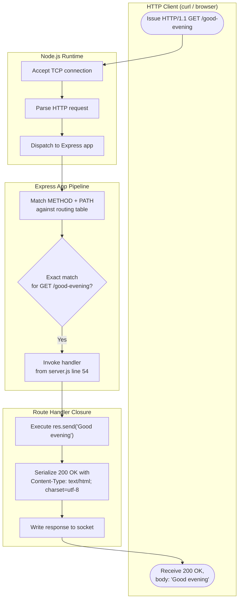

| Aspect | Rule | Source |
|--------|------|--------|
| Input parameters | None | Section 2.2.3.2 (F-003-RQ-001) |
| Output body | Exact byte sequence `Good evening` | Section 2.2.3 (F-003-RQ-002); Section 2.6.2 (CN-3) |
| Co-tenancy | Must coexist with F-002 on the same `app` instance and listener | Section 2.2.3 (F-003-RQ-003) |
| Expansion limit | This is the only additive endpoint permitted under current scope | Section 2.2.3.2 |

### 4.2.5 Unknown Route Default Handling

Although the application registers no error-handling middleware (per Section 3.2.2), any HTTP request to an unregistered path is handled by Express 5.x's default `finalhandler`, which emits a `404 Not Found` response. This behavior is **inherited from Express** and is **not customized** in `server.js`.

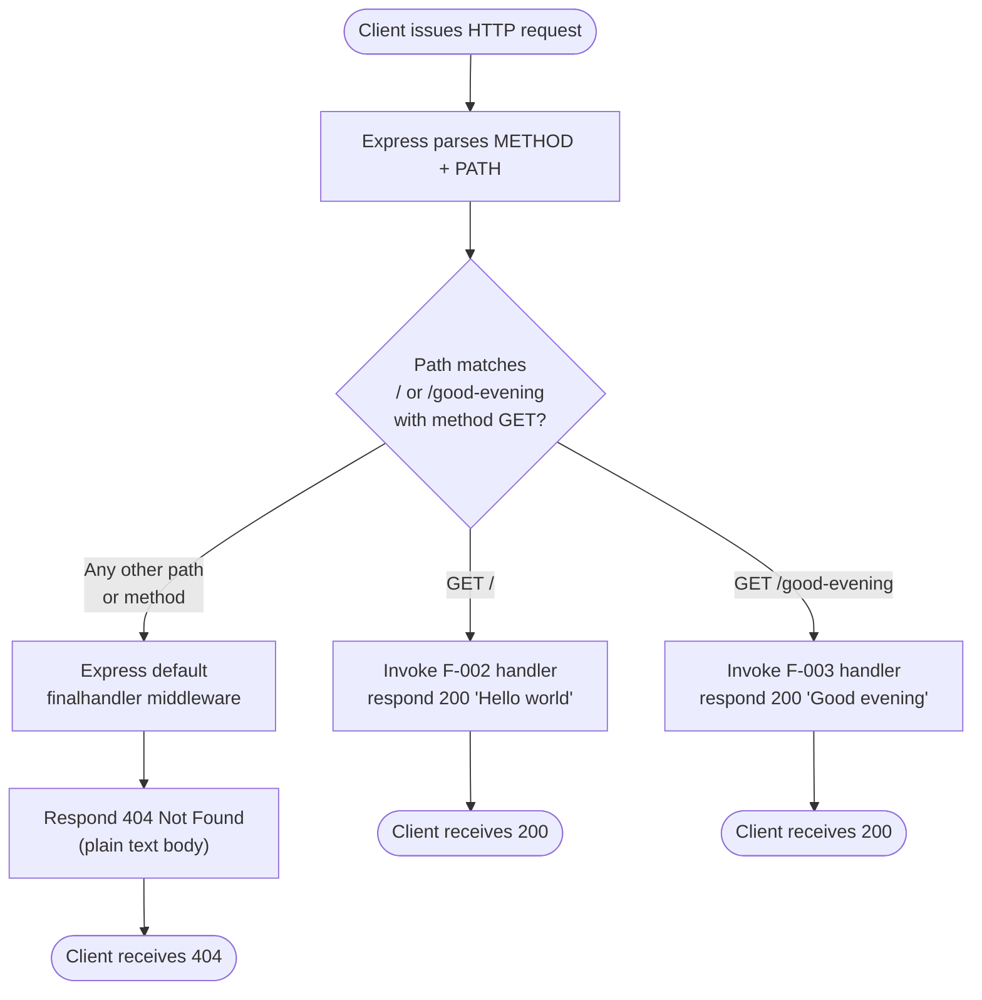

Important notes about this flow:

- No custom 404 page, JSON error envelope, or structured error payload is rendered. The body is whatever Express 5.x's `finalhandler` produces by default.
- No `app.use((err, req, res, next) => ...)` error-handling middleware is registered (per Section 3.2.2), so any thrown exception during route handling falls through to the same default handler.
- Express 5.x ships a hardened, ReDoS-resistant route matcher (per Section 2.4.4 and Section 2.1.1.2), which protects against pathological path patterns at the matching stage.

### 4.2.6 Verification Smoke-Test Workflow

Per Section 1.3.2, this is the **sole verification mechanism** for the system; no automated test framework, test files, or `test` script exists in `package.json`. The workflow is documented in `README.md` lines 46–53.

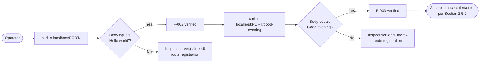

---

## 4.3 INTEGRATION WORKFLOWS

Per Section 2.3.2 and Section 3.4 (which jointly enumerate every integration point in the artifact), the system has exactly four integration points: two runtime inbound, one install-time outbound, and one operator-driven process launch. All four are documented above.

### 4.3.1 Inbound Runtime Integration

| Integration Point | Direction | Participants | Protocol | Documented In |
|-------------------|-----------|--------------|----------|---------------|
| HTTP client → GET / | Inbound | curl/browser → F-004 → F-002 | HTTP/1.1 over TCP | Section 4.2.3 |
| HTTP client → GET /good-evening | Inbound | curl/browser → F-004 → F-003 | HTTP/1.1 over TCP | Section 4.2.4 |

No upstream service registry, downstream database, message broker, identity provider, or sidecar integration exists. Per Section 1.2.1: "There is no enterprise landscape — neither implied nor documented — surrounding this artifact."

### 4.3.2 Outbound Install-Time Integration

| Integration Point | Direction | Participants | Protocol | Documented In |
|-------------------|-----------|--------------|----------|---------------|
| Dependency resolution | Outbound, install-time only | npm CLI → `https://registry.npmjs.org/` | HTTPS | Section 4.2.1 |

Per Section 3.4.2, "this is the **only** outbound integration in the entire system, and it occurs only when an operator runs `npm install`. The running server process makes no outbound calls."

### 4.3.3 Categorically Absent Integration Patterns

The following integration patterns are explicitly **not present** in the system. They are catalogued here so that this Process Flowchart section serves as a complete reference rather than leaving the reader to assume absence.

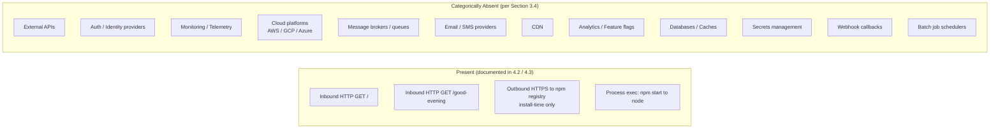

Specific patterns expected in enterprise process documentation that are **not applicable**:

| Pattern | Status | Source |
|---------|--------|--------|
| API client invocation flows | Absent — no outbound runtime APIs | Section 3.4.1 |
| Event publication / subscription | Absent — no event bus or broker | Section 3.4.1 (Message brokers / queues: None) |
| Batch processing sequences | Absent — no scheduler or batch runner | Section 1.3.2 (no `nodemon`, `pm2`, `forever`) |
| Webhook ingestion / dispatch | Absent — only two GET endpoints exist | Section 2.2.2, 2.2.3 |
| Database query flows | Absent — no persistence | Section 3.5.1 ("no persistence layer") |
| Cache fill / invalidation | Absent — no cache | Section 3.5.1 ("In-memory cache: None") |
| Saga / orchestration flows | Absent — no multi-service composition | Section 1.2.1 |

---

## 4.4 VALIDATION RULES AND DECISION POINTS

### 4.4.1 Complete Decision Point Inventory

The system contains exactly **one explicit code-level decision point** plus implicit Express-internal routing decisions.

| # | Decision | Location | Logic | Outcomes |
|---|----------|----------|-------|----------|
| D1 | Port resolution | `server.js` line 37 | Logical OR fallback: `process.env.PORT \|\| 3000` | Env var truthy → use it; else → numeric literal `3000` |
| D2 (implicit) | Express route match for GET / | Express router | Exact path + method match | Match → F-002 handler; no match → fall through |
| D3 (implicit) | Express route match for GET /good-evening | Express router | Exact path + method match | Match → F-003 handler; no match → fall through |
| D4 (implicit) | Unknown route fall-through | Express `finalhandler` | No route matched | Default 404 response |

No decisions involve user-supplied data, authorization claims, feature flags, A/B branches, regional routing, tenant-scoped logic, or compliance-driven gating. The decision surface is intentionally trivial per the minimalism mandate in Section 2.6.2 (CN-2).

### 4.4.2 Business Rules per Workflow Step

The following table consolidates business rules across all workflow steps. Every rule traces to a Must-Have or Should-Have requirement in Section 2.2.

| Workflow Step | Business Rule | Requirement | Enforcement |
|---------------|---------------|-------------|-------------|
| Manifest declaration | `express@^5.2.1` is the sole runtime dependency | F-001-RQ-001 | Code review of `package.json`; CN-1 |
| Module import | CommonJS `require` (no ESM) | F-001-RQ-002 | `package.json` omits `"type": "module"`; code review |
| App instantiation | Exactly one `express()` invocation | F-001-RQ-003 | Code review of `server.js` |
| Route / registration | Exact response body `Hello world` | F-002-RQ-002 | CN-3; manual `curl` verification |
| Route /good-evening registration | Exact response body `Good evening` | F-003-RQ-002 | CN-3; manual `curl` verification |
| Backward compatibility | `GET /` must remain reachable across changes | F-002-RQ-004; CSF #2 | Code review against prior versions |
| Port resolution | `process.env.PORT \|\| 3000` idiom required | F-004-RQ-001, F-004-RQ-002 | Code review of `server.js` line 37 |
| Startup logging | Log `Server listening on http://localhost:${PORT}` | F-004-RQ-004 | stdout observation |
| Lockfile integrity | `lockfileVersion: 3`; SRI hashes per package | F-006-RQ-001, F-006-RQ-002 | npm CLI integrity verification at install |
| Source-control hygiene | `node_modules/` must not be committed | F-007-RQ-001; CSF #6 | `.gitignore` patterns; `git status` inspection |

### 4.4.3 Data Validation Requirements

**No input validation rules exist at the application level.** Per Section 2.2.2.2 and Section 2.2.3.2, both endpoints accept "HTTP `GET` request with no path parameters, query string, or body." There is therefore no schema validation, sanitization, length-check, or type-coercion logic in the codebase.

The only data validation in the lifecycle is install-time SRI integrity verification, which is performed by the npm CLI (not by application code) per Section 4.2.1.2.

### 4.4.4 Authorization, Authentication, and Compliance Checkpoints

| Checkpoint Category | Status | Source |
|---------------------|--------|--------|
| Authentication | **Not present** | Section 1.1.3 ("no authentication, authorization, or user-role differentiation"); Section 1.3.2 (Auth/AuthN excluded) |
| Authorization / role checks | **Not present** | Section 1.1.3; Section 1.3.2 |
| Session management | **Not present** | Section 3.5.1 (Session store: None) |
| API key / token validation | **Not present** | Section 2.4.4 ("no input handling, authentication, or sensitive data is involved") |
| Regulatory compliance (GDPR, PCI, HIPAA, SOC 2) | **Not applicable** | No personal, payment, or health data exists; tutorial scope per Section 2.4.4 |
| Audit logging | **Not present** | Section 3.5 (no log persistence); only stdout startup line |
| Rate limiting / throttling | **Not present** | Section 1.3.2 ("ships without ... rate limiting") |
| TLS / encryption in transit | **Not present at runtime** | Section 2.2.4.2 ("binding is on `localhost`-reachable interfaces with no TLS"); HTTPS used only at install-time per Section 3.4.2 |

Because all consumers are treated as a single anonymous category (per Section 1.1.3), every workflow above is reachable without any credentials, headers, or context. Adding such gating is explicitly out-of-scope per CN-2 (Section 2.6.2).

---

## 4.5 STATE MANAGEMENT

### 4.5.1 Process Lifecycle State Diagram

The Node.js process exhibits four observable lifecycle states. The transition graph below captures every transition the system actually undergoes.

```mermaid
stateDiagram-v2
    [*] --> Loaded: node server.js invoked
    Loaded --> Configured: require('express') resolves<br/>app = express()<br/>PORT resolved<br/>routes registered
    Configured --> Listening: app.listen succeeds<br/>(TCP socket bound)
    Configured --> Terminated: EADDRINUSE or other<br/>bind failure (uncaught)
    Listening --> Serving: HTTP request accepted
    Serving --> Listening: response written;<br/>connection idle
    Listening --> Terminated: SIGINT / SIGTERM<br/>(no graceful shutdown<br/>implemented)
    Terminated --> [*]
```

Salient properties of this state machine:

- **No graceful shutdown handler is registered.** The process responds to `SIGINT` / `SIGTERM` with Node.js default behavior; in-flight requests are not drained.
- **No reconnection or recovery logic.** A failed `app.listen` (e.g., `EADDRINUSE` when port 3000 is already taken) terminates the process; the operator must manually re-issue `npm start` with a different `PORT`.
- **No per-request state machine.** Each request transitions the process briefly into `Serving` and back to `Listening` synchronously within Node's event loop.

### 4.5.2 In-Memory State Element Inventory

Per Section 3.5.2, all process state is in-memory and ephemeral. The complete inventory is:

| State Element | Lifetime | Mutability | Location |
|---------------|----------|------------|----------|
| Express `app` instance | Process lifetime | Effectively immutable after registration | `server.js` line 32 |
| Resolved `PORT` constant | Process lifetime | Immutable (declared `const`) | `server.js` line 37 |
| Route handler for `/` | Process lifetime | Immutable closure | `server.js` line 46 |
| Route handler for `/good-evening` | Process lifetime | Immutable closure | `server.js` line 54 |
| Response string `Hello world` | Process lifetime | Captured in handler closure | `server.js` line 46 |
| Response string `Good evening` | Process lifetime | Captured in handler closure | `server.js` line 54 |

Per Section 3.5.2: "There is no per-request state, no client session, no cookie storage, no log persistence, and no file I/O beyond the stdout startup log line."

### 4.5.3 Persistence Points and Transaction Boundaries

| Concern | Status | Source |
|---------|--------|--------|
| Primary database | **Not present** | Section 3.5.1 |
| NoSQL / document store | **Not present** | Section 3.5.1 |
| In-memory cache | **Not present** | Section 3.5.1 |
| Object / file storage | **Not present** | Section 3.5.1 |
| Session store | **Not present** | Section 3.5.1 |
| Search index | **Not present** | Section 3.5.1 |
| Time-series store | **Not present** | Section 3.5.1 |
| ACID transaction boundaries | **Not applicable** — no persistence | Section 3.5.1 |
| Distributed transaction coordination | **Not applicable** — single process | Section 1.2.1 |
| Optimistic / pessimistic locking | **Not applicable** — no shared mutable state | Section 3.5.2 |

The only persistence point in the entire lifecycle is the install-time materialization of `node_modules/` on local disk by `npm install` (per Section 4.2.1), and even that is excluded from version control by `.gitignore` (per F-007).

### 4.5.4 Caching Requirements

There are no caching layers at any tier — no application cache, no HTTP cache headers configured beyond Express defaults, no reverse proxy, no CDN, and no in-process memoization. Per Section 1.3.2, "caching" is explicitly enumerated as out-of-scope, and per Section 3.5.1 the "In-memory cache" category is "None."

---

## 4.6 ERROR HANDLING

### 4.6.1 Implemented Custom Error Handling: None

The codebase does **not** implement any custom error-handling apparatus:

- No `try` / `catch` blocks in `server.js`.
- No Express error-handling middleware (no `app.use((err, req, res, next) => ...)`).
- No process-level handlers for `uncaughtException` or `unhandledRejection`.
- No graceful shutdown handler for `SIGINT` / `SIGTERM`.

Per Section 3.2.2: "No router objects, no middleware chains (`app.use(...)`), no error-handling middleware, no templating engines, and no static-file serving are present." This minimalism is enforced by CN-2 (Section 2.6.2).

### 4.6.2 Inherent Failure Modes and Default Behaviors

Although no custom error handling exists, the runtime exposes a small set of real failure modes inherited from Node.js and Express. The diagram below maps each failure mode to the system's default response.

```mermaid
flowchart TD
    Start([Failure event occurs]) --> Classify{Failure category}
    Classify -->|Port already in use| EADDR[Node.js raises EADDRINUSE<br/>during app.listen]
    Classify -->|node_modules/ missing| MOD[require('express') throws<br/>MODULE_NOT_FOUND]
    Classify -->|npm install hash mismatch| HASH[npm aborts install;<br/>node_modules/ incomplete]
    Classify -->|Unknown route requested| ROUTE["Express default finalhandler<br/>responds 404 (per 4.2.5)"]
    Classify -->|Exception inside route handler| EXC[Express default error path;<br/>500 response from finalhandler]

    EADDR --> Exit1[Uncaught error;<br/>process exits non-zero]
    MOD --> Exit2[Uncaught error;<br/>process never reaches listen]
    HASH --> Exit3[Install workflow aborts;<br/>server cannot start until resolved]
    ROUTE --> Resp1[Client receives 404]
    EXC --> Resp2[Client receives 500;<br/>connection closes]

    Exit1 --> Manual[Operator must<br/>re-issue npm start<br/>with new PORT]
    Exit2 --> Manual2[Operator must<br/>re-run npm install]
    Exit3 --> Manual3[Operator must<br/>investigate registry / network]
```

### 4.6.3 Retry, Fallback, Notification, and Recovery Procedures

| Mechanism | Status | Source |
|-----------|--------|--------|
| Retry logic (in-process) | **Not present** | No conditional re-execution in `server.js` |
| Circuit breakers | **Not present** | No outbound runtime dependencies that would warrant one (Section 3.4.1) |
| Fallback / degraded-mode flows | **Not present** | Endpoints have no dependencies that could fail (responses are literal strings) |
| Dead-letter queues | **Not applicable** | No message queues (Section 3.4.1) |
| Error notification (email, paging, webhooks) | **Not present** | No notification provider integrations (Section 3.4.1) |
| Recovery procedures (automated) | **Not present** | Process exits on bind failure; manual operator intervention required |
| Health-check endpoints | **Not present** | Endpoint catalog is exactly `/` and `/good-evening` (Section 2.2) |
| Crash-loop guardrails (e.g., `pm2`, systemd restart) | **Not present** | Section 1.3.2 (process supervisors excluded) |

The complete recovery story for every failure mode listed in Section 4.6.2 is: **the operator re-runs the appropriate command**. This is consistent with the tutorial scope per Section 2.4.4 ("not intended for production hosting").

---

## 4.7 TIMING AND SLA CONSIDERATIONS

### 4.7.1 No Documented Performance Targets

Per Section 1.2.3: "No KPIs (response-time percentiles, error budgets, uptime SLAs, request volumes) are documented in any source file."

Per Section 2.4.2: "No performance requirements are documented anywhere in the source files... Default Express 5.x single-process behavior is accepted across all features."

Per Section 1.1.4: "No revenue, cost-savings, performance, or adoption metrics are defined or implied anywhere in the source files."

This section therefore documents only the **structural timing properties** that follow from the runtime architecture; it deliberately does not fabricate latency targets, throughput guarantees, or availability commitments.

### 4.7.2 Implicit Timing Properties

| Workflow | Timing Property | Observed / Inherited Behavior |
|----------|-----------------|-------------------------------|
| `npm install` | Network-bound | Time dominated by HTTPS tarball fetches from `registry.npmjs.org`; no SLA |
| `npm start` bootstrap | Sub-second on typical hardware | Module load + `app.listen` bind; not measured or asserted |
| GET / response | Synchronous within Node event loop | `res.send` with a literal string; no I/O wait |
| GET /good-evening response | Synchronous within Node event loop | Identical profile to GET / |
| Unknown route response | Synchronous (finalhandler default) | Express 5.x default 404 path |
| Smoke-test verification | Operator-paced | Single sequential `curl` invocations per `README.md` |

### 4.7.3 Scalability Posture

Per Section 2.4.3: scalability is intentionally out of scope. The server runs as a single Node.js process bound to one TCP listener. Clustering, worker processes, HTTP/2, HTTPS/TLS, caching, load balancing, and multi-tenancy are all explicitly excluded by Section 1.3.2. No feature in the catalog has a horizontal-scale path defined.

---

## 4.8 CROSS-REFERENCE INDEX

The diagrams in this section are deliberately complementary to, and not duplicative of, the existing diagrams elsewhere in the Technical Specification. The following index maps related topics across sections for the reader's convenience.

| Topic | This Section | Related Section(s) |
|-------|--------------|--------------------|
| Component wiring (static) | — | Section 1.2.2 (component diagram); Section 2.3.1 (feature dependency map); Section 3.7.1 (stack wiring) |
| Process launch (toolchain perspective) | Section 4.2.2 (server.js perspective) | Section 3.7.2 (operator-to-toolchain sequence) |
| Decision points | Section 4.4.1 | Section 2.5.3 (Ambiguity A5 resolution) |
| State management | Section 4.5 | Section 3.5.2 (state inventory) |
| Error handling absence | Section 4.6 | Section 3.2.2 (no middleware); Section 3.2.4 (excluded categories); Section 2.4.4 (security posture) |
| Integration boundaries | Section 4.3 | Section 2.3.2 (integration points); Section 3.4 (third-party services) |
| Persistence absence | Section 4.5.3 | Section 3.5 (databases & storage) |
| SLA absence | Section 4.7 | Section 1.1.4, Section 1.2.3, Section 2.4.2 |
| Validation rules (response bodies) | Section 4.4.2 | Section 2.2.2, 2.2.3 (acceptance criteria); Section 2.6.2 (CN-3) |
| Authorization absence | Section 4.4.4 | Section 1.1.3, 1.3.2, 2.4.4 |
| Out-of-scope workflow categories | Section 4.1.3, Section 4.3.3 | Section 1.3.2; Section 2.6.2; Section 3.4.4; Section 3.5.3 |
| Verification mechanism | Section 4.2.6 | Section 1.2.3 (curl smoke tests); Section 2.5.2 (acceptance criteria) |

---

#### References

#### Files Examined

- `server.js` — Sole runtime source (62 lines); contains the only code-level decision point (line 37: port resolution) and both route handler registrations (line 46 for GET /; line 54 for GET /good-evening); `app.listen` invocation (line 59) and startup log (line 60).
- `package.json` — Manifest declaring the `npm start` script (line 8: `"start": "node server.js"`), the `engines.node >= 18` floor, and the sole `express ^5.2.1` runtime dependency.
- `package-lock.json` — Lockfile (version 3) pinning `express@5.2.1` and 66 transitive packages with sha512 SRI integrity hashes; basis for the install-time integrity verification step in Section 4.2.1.2.
- `README.md` — Operator workflow documentation: install (lines 16–18), run (lines 27–29), `PORT` override (lines 35–37), endpoint catalog (lines 41–44), and curl smoke tests (lines 46–53).
- `.gitignore` — Source-control exclusion patterns; establishes the boundary between committed source and the generated `node_modules/` materialized by `npm install`.
- `blitzy/documentation/Input Prompt.md` — Originating user request mandating Express adoption and the second endpoint.
- `blitzy/documentation/Agent Action Plan.md` — Authoritative implementation blueprint, including execution order and rules for feature additions.

#### Technical Specification Sections Cross-Referenced

- Section 1.1 EXECUTIVE SUMMARY — Confirmation of anonymous-consumer model (1.1.3) and absence of performance KPIs (1.1.4).
- Section 1.2 SYSTEM OVERVIEW — Component wiring diagram (1.2.2), no-enterprise-landscape statement (1.2.1), success criteria and KPI absence (1.2.3).
- Section 1.3 SCOPE — Comprehensive in-scope (1.3.1) and out-of-scope (1.3.2) catalogues used to enumerate absent workflow categories throughout Section 4.
- Section 2.2 FUNCTIONAL REQUIREMENTS TABLE — Acceptance criteria, input/output specifications, and business rules per requirement (F-001 through F-008).
- Section 2.3 FEATURE RELATIONSHIPS — Feature dependency map (2.3.1) and integration points table (2.3.2) referenced by Section 4.3.
- Section 2.4 IMPLEMENTATION CONSIDERATIONS — Technical constraints, no-performance-requirements statement (2.4.2), and minimal security posture (2.4.4).
- Section 2.5 TRACEABILITY MATRIX — Verification mechanisms (2.5.2) and Ambiguity A5 (port resolution) referenced by Section 4.2.2.2 and Section 4.4.1.
- Section 2.6 ASSUMPTIONS AND CONSTRAINTS — Constraints CN-1 through CN-5, particularly CN-3 (byte-exact response bodies).
- Section 3.2 FRAMEWORKS & LIBRARIES — Express API surface (3.2.2), excluded framework categories (3.2.4) confirming absence of middleware and error-handling middleware.
- Section 3.4 THIRD-PARTY SERVICES — Comprehensive enumeration of absent runtime services (3.4.1) and the single install-time integration (3.4.2).
- Section 3.5 DATABASES & STORAGE — Zero-persistence posture (3.5.1) and in-memory state inventory (3.5.2) underlying Section 4.5.
- Section 3.7 TECHNOLOGY STACK ARCHITECTURE — Stack wiring (3.7.1) and process launch sequence (3.7.2) referenced complementarily by Section 4.2.2.1.

# 5. System Architecture

## 5.1 HIGH-LEVEL ARCHITECTURE

### 5.1.1 System Overview

#### Architecture Style and Rationale

The `artifact-2` system implements a **monolithic, single-process HTTP server** built on the canonical "minimal Express server" pattern. The entire runtime consists of a single 62-line `server.js` file backed by one declared dependency (`express@^5.2.1`). The architecture is deliberately and pedagogically minimal: there is no layered architecture, no MVC partitioning, no hexagonal/clean/onion separation, no microservice decomposition, no event-driven messaging, and no service-oriented intermediary. The system is a flat single-file Express application, and this minimalism is enforced by Critical Success Factor #4 (minimal, idiomatic footprint) and constraint CN-2 ("No middleware, routers, controllers, or services may be introduced").

The rationale for this style is threefold:

- **Pedagogical clarity.** The system serves as a tutorial reference; introducing layered or distributed patterns would obscure the foundational request/response model the artifact is intended to demonstrate.
- **Framework mandate.** Critical Success Factor #1 prescribes Express.js as the routing framework. The native `http` module, Fastify, and Koa are explicitly forbidden as substitutes.
- **Zero-configuration default.** Constraint CN-5 mandates that the server be launchable via `npm start` with no additional configuration, which precludes the introduction of configuration files, dependency-injection containers, or service registries.

#### Key Architectural Principles and Patterns

The system adheres to four explicit architectural principles:

- **Minimal Dependency Surface.** Exactly one runtime dependency (`express@^5.2.1`); no `devDependencies`; no auxiliary libraries (no `morgan`, no `dotenv`, no `body-parser` beyond Express 5's bundled parsers).
- **Immutable In-Memory State.** All runtime state (the `app` instance, the resolved `PORT`, the two route handler closures, and the embedded response string constants) is established once during bootstrap and never mutated thereafter.
- **Stateless Request Handling.** No per-request state, no client session, no cookie storage. Each request is processed synchronously within Node.js's event loop and discarded.
- **Convention over Configuration.** Single environment variable (`PORT`) with a hard-coded `3000` default; no configuration files, no feature flags, no profile-based overrides.

#### System Boundaries and Major Interfaces

The system boundary is the single Node.js process bound to one TCP listener on `http://localhost:${PORT}`. There are exactly four integration touchpoints, only one of which is a runtime interface:

| Boundary Crossing | Direction | Lifecycle | Protocol |
|-------------------|-----------|-----------|----------|
| HTTP client → `GET /` | Inbound | Runtime | HTTP/1.1 over TCP |
| HTTP client → `GET /good-evening` | Inbound | Runtime | HTTP/1.1 over TCP |
| npm CLI → `registry.npmjs.org` | Outbound | Install-time only | HTTPS |
| Shell → `npm start` → `node server.js` | Operator-driven | Launch-time | Process exec |

No upstream service registry, downstream database, message broker, observability sidecar, or cloud platform integration exists at any boundary.

### 5.1.2 Core Components

The repository decomposes into five committed components plus one generated artifact. Each component has a single, well-defined responsibility within the bootstrap-then-serve lifecycle.

| Component Name | Primary Responsibility | Key Dependencies |
|----------------|------------------------|------------------|
| `server.js` | Express bootstrap, route registration, TCP listener bind | `express@5.2.1` (via `require`) |
| `package.json` | Project manifest; declares engine, dependency, start script | npm CLI (consumer) |
| `package-lock.json` | Deterministic dependency tree pinning (lockfile v3, 67 entries) | npm CLI; `package.json` |
| `README.md` | Operator guide: prerequisites, install/run, smoke tests | None |
| `.gitignore` | Source-control hygiene; excludes `node_modules/`, `.env`, log files | Git |

The integration points and critical considerations for each component:

| Component Name | Integration Points | Critical Considerations |
|----------------|-------------------|-------------------------|
| `server.js` | `require('express')`; `process.env.PORT`; stdout startup log; TCP socket | Single point of runtime failure; 62 lines is the entire runtime surface |
| `package.json` | Consumed by npm at install and `npm start`; reference to `server.js` as `main` | No `"type": "module"` field — CommonJS is mandated by default |
| `package-lock.json` | Consumed by npm install to reproduce the dependency tree | SRI hashes enforce supply-chain integrity for all 67 packages |
| `README.md` | Read by operators; describes only the two endpoints | Must remain consistent with route registrations in `server.js` |
| `.gitignore` | Honored by Git on every commit; prevents accidental commit of secrets | `.env` and `.env.*` patterns prevent secret leakage |

A sixth artifact, the **`node_modules/` directory**, is generated by `npm install` and not committed. It materializes Express 5.2.1 plus 66 transitive packages on local disk and is loaded into memory by Node.js's `require` mechanism at process start.

### 5.1.3 Data Flow Description

#### Primary Data Flows

The system exhibits exactly two runtime data flows and one install-time data flow.

**Runtime Flow — HTTP Request/Response.** An HTTP client (such as `curl` or a browser) issues an HTTP/1.1 GET request over TCP against the bound port. Node.js accepts the TCP connection, parses the HTTP request frame, and dispatches it into the Express application. Express matches the (METHOD, PATH) tuple against its internal routing table — populated at bootstrap from the two `app.get()` registrations — and invokes the matching handler closure. The handler executes a single statement, `res.send(<literal string>)`, which serializes a 200 OK response with `Content-Type: text/html; charset=utf-8` (Express's default for `res.send(string)`) and writes the response body to the socket. The connection then returns to idle. The entire request/response transition completes synchronously within Node's event loop; the process moves briefly from the `Listening` state into `Serving` and back to `Listening`.

**Install-Time Flow — Dependency Materialization.** When the operator runs `npm install`, the npm CLI reads `package.json` and `package-lock.json`, then issues HTTPS GET requests to `registry.npmjs.org` to fetch Express 5.2.1 and its 66 transitive packages as gzipped tarballs. Each tarball is verified against its SHA-512 Subresource Integrity (SRI) hash recorded in the lockfile before being extracted into `node_modules/`. On hash mismatch, npm aborts the install and the directory is left in an incomplete state.

**Launch-Time Flow — Process Bootstrap.** The operator invokes `npm start`, which executes `node server.js`. Node.js loads `server.js`, applies `'use strict'`, evaluates `require('express')` (which traverses `node_modules/` to load the materialized package), invokes the `express()` factory to create the `app` instance, registers the two route handlers, resolves the listen port via `process.env.PORT || 3000`, binds the TCP socket via `app.listen(PORT, callback)`, and writes `Server listening on http://localhost:${PORT}` to stdout.

#### Integration Patterns and Protocols

The only runtime integration pattern is **synchronous request/response over HTTP/1.1**. There are no asynchronous patterns (no message queues, no pub/sub, no webhooks, no long polling, no Server-Sent Events, no WebSockets). There is no request batching, no streaming response, and no chunked transfer encoding beyond what Express's default `res.send` may negotiate transparently.

#### Data Transformation Points

There are **no data transformations** in the runtime flow. Both response bodies are literal string constants (`'Hello world'`, `'Good evening'`) embedded directly in the handler closures at lines 46 and 54 of `server.js`. No templating engine is registered, no JSON serialization is performed, no input parsing is invoked (the endpoints accept no input), and no content negotiation is performed beyond Express's built-in defaults.

#### Key Data Stores and Caches

The system has **no data stores and no caches** at any tier:

- **Primary database:** None.
- **NoSQL / document store:** None.
- **In-memory cache:** None.
- **HTTP response cache:** None (no `Cache-Control` headers configured beyond Express defaults).
- **Reverse proxy / CDN:** None.
- **Session store:** None.
- **Search index:** None.
- **Object / file storage:** None.

The only persistence point in the entire lifecycle is the install-time materialization of `node_modules/` on local disk, which is itself excluded from version control by `.gitignore`. All runtime state is in-memory, established at bootstrap, and lost when the process terminates.

### 5.1.4 External Integration Points

The system exposes a deliberately narrow integration surface. The runtime surface is inbound-only; outbound integrations exist exclusively at install-time.

| System Name | Integration Type | Data Exchange Pattern | Protocol/Format |
|-------------|------------------|------------------------|-----------------|
| HTTP Client (curl, browser) — `GET /` | Inbound, runtime | Synchronous request/response | HTTP/1.1; plain-text body `Hello world` |
| HTTP Client (curl, browser) — `GET /good-evening` | Inbound, runtime | Synchronous request/response | HTTP/1.1; plain-text body `Good evening` |
| Public npm Registry (`registry.npmjs.org`) | Outbound, install-time only | Tarball fetch with SRI verification | HTTPS; gzipped tarballs + SHA-512 hashes |
| Operator Shell / npm CLI | Operator-driven, launch-time | Process exec (`npm start` → `node server.js`) | POSIX process invocation |

The following SLA requirements apply (and notably, no time-based or volume-based SLAs are documented):

| System Name | SLA Requirements |
|-------------|------------------|
| HTTP Client — both endpoints | None documented. Responses must be byte-for-byte exact (`Hello world`, `Good evening`); no latency, throughput, or availability target is specified |
| Public npm Registry | None controlled by this artifact; consumer-side SRI verification ensures supply-chain integrity |
| Operator Shell | Server must start via `npm start` with zero additional configuration (CN-5) |

The following integration categories are **explicitly absent** from the system:

- External APIs (no third-party REST/GraphQL/gRPC clients)
- Authentication or identity providers (no OAuth, SAML, OIDC)
- Monitoring or observability platforms (no Datadog, New Relic, Sentry, OpenTelemetry)
- Cloud platforms (no AWS, GCP, Azure SDKs)
- Message brokers or queues (no Kafka, RabbitMQ, SQS, Redis Streams)
- Email or SMS providers
- Content Delivery Networks (CDNs)
- Analytics or telemetry collectors
- Feature flag services
- Secrets management vaults

---

## 5.2 COMPONENT DETAILS

### 5.2.1 server.js — Application Entry Point

#### Purpose and Responsibilities

`server.js` is the sole runtime artifact of the system. It is responsible for (1) loading the Express framework via CommonJS, (2) instantiating a single `express()` application instance, (3) registering exactly two HTTP route handlers (`GET /` and `GET /good-evening`), (4) resolving the listening port from `process.env.PORT` with a `3000` default, and (5) binding the TCP listener via `app.listen` while writing a single startup log line to stdout. Strict mode is enabled at the top of the file (`'use strict';` at line 1).

#### Technologies and Frameworks Used

- **Language:** JavaScript (ES2015+ syntax, primarily arrow functions for route handlers)
- **Module System:** CommonJS (`require` for imports); ESM is intentionally not adopted via the absence of `"type": "module"` in `package.json`
- **Runtime:** Node.js `>= 18`
- **Framework:** Express.js `^5.2.1` (resolves to the exact version `5.2.1` per `package-lock.json`)

#### Key Interfaces and APIs Consumed

Only four Express APIs are exercised:

| Express API | Usage in `server.js` |
|-------------|----------------------|
| `express()` | Application factory; invoked once at line 32 |
| `app.get(path, handler)` | Route registration for `/` (line 46) and `/good-evening` (line 54) |
| `res.send(string)` | Plain-text response serialization within both handlers |
| `app.listen(port, callback)` | TCP listener binding with startup log callback at line 59 |

Notably absent: `app.use(...)` (no middleware chains), `express.Router()` (no router objects), error-handling middleware (no `(err, req, res, next)` signatures), templating engines, and static-file serving.

#### Data Persistence Requirements

None. `server.js` performs no file I/O beyond writing a single line to stdout during bootstrap. It does not open, read, write, or close any file descriptor other than the TCP listening socket. All in-memory state (the `app` instance, the `PORT` constant, the two handler closures, and the embedded response strings) is established once and never mutated.

#### Scaling Considerations

Scaling is **intentionally out of scope by design**, not an oversight. The system runs as a single Node.js process bound to one TCP listener, with the following capabilities explicitly excluded:

- Clustering or worker processes (no `cluster` module, no `pm2`)
- HTTP/2 or HTTPS/TLS termination
- Caching layers (none at any tier)
- Load balancing or reverse proxying
- Multi-tenant or multi-user identity separation

The rationale anchors in constraints CN-1 (no runtime dependencies beyond `express`), CN-2 (no middleware or routers), CN-4 (no automated test suite, CI/CD, Docker, or IaC), and CN-5 (zero-configuration `npm start`). The default Express 5.x single-process behavior is the accepted production characteristic.

### 5.2.2 package.json — Project Manifest

#### Purpose and Responsibilities

`package.json` is the npm manifest. It declares project identity, the Node.js engine floor, the single runtime dependency, and the `start` script that powers `npm start`. It also asserts the project's private status (preventing accidental publication to the npm registry) and its license.

#### Technologies and Frameworks Used

- **Format:** npm manifest format (JSON)
- **Identity:** `name=artifact-2`, `version=1.0.0`, `private=true`, `license=ISC`
- **Engine constraint:** `node >= 18`
- **Sole dependency:** `express ^5.2.1`
- **Scripts:** Only one — `start: node server.js`. No `test`, `build`, or `lint` scripts.
- **devDependencies:** **None** — the manifest contains no `devDependencies` section at all.

#### Key Interfaces and APIs

The manifest is consumed by the npm CLI at install time (for dependency resolution) and at launch time (for `npm start` script execution). Its `main` field points to `server.js`, designating the application entry point. No interface is exposed to other runtime components.

#### Data Persistence Requirements

The manifest itself is a committed file in the repository; npm reads it but does not modify it during normal install operations (only `package-lock.json` is regenerated). No additional persistence is required.

#### Scaling Considerations

Not applicable. The manifest is a static declarative artifact, 17 lines in total.

### 5.2.3 package-lock.json — Dependency Lockfile

#### Purpose and Responsibilities

`package-lock.json` pins the complete, deterministic dependency tree resolved from `package.json`. It records the exact version, resolved URL, and SHA-512 integrity hash (Subresource Integrity / SRI) for every package in the dependency graph, ensuring that `npm install` produces a bit-for-bit identical `node_modules/` tree across all machines.

#### Technologies and Frameworks Used

- **Format:** npm lockfile version 3
- **Size:** approximately 29,577 bytes
- **Entries:** 67 packages (Express 5.2.1 + 66 transitive packages)
- **Integrity:** SHA-512 SRI hashes per package; tarball URLs to `registry.npmjs.org`

#### Key Interfaces and APIs

The lockfile is consumed by the npm CLI during `npm install`. It is not consumed by `server.js` at runtime.

#### Data Persistence Requirements

The lockfile is a committed file. It is regenerated by npm when dependencies are added, removed, or updated; otherwise it remains stable across installs.

#### Scaling Considerations

Not applicable.

### 5.2.4 README.md and .gitignore — Operational Documentation

## README.md

The 53-line `README.md` is the operator-facing contract. It documents prerequisites (Node.js >= 18), installation (`npm install`), running (`npm start`), the endpoint catalog (a Method/Path/Response table for `/` and `/good-evening`), and smoke-test commands (`curl` invocations). It contains no architectural diagrams or design documentation.

## .gitignore

The 20-line `.gitignore` excludes generated and sensitive files from version control. The configured patterns are: `node_modules/`, `npm-debug.log*`, `yarn-debug.log*`, `yarn-error.log*`, `.env`, `.env.*`, `logs`, `*.log`, `.DS_Store`. The `.env` and `.env.*` patterns provide preemptive secret-leakage protection even though the system itself does not currently use `.env` files.

### 5.2.5 Component Interaction Diagram

The diagram below depicts the runtime interaction between the HTTP client, the Node.js process, the Express application, and the registered route handlers.

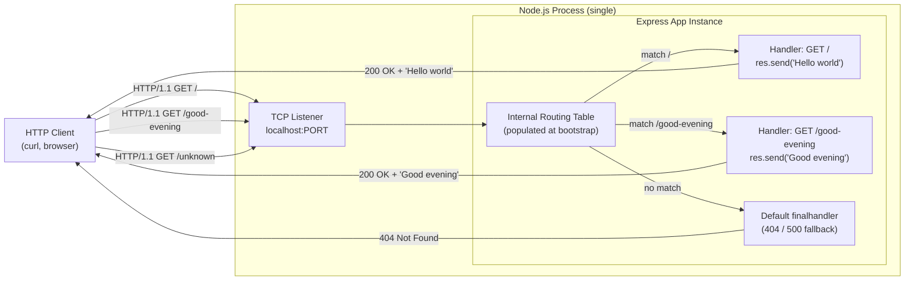

### 5.2.6 State Transition Diagram

The Node.js process exhibits four observable lifecycle states. The transition graph below captures every transition the system actually undergoes, as documented in Section 4.5.1.


Salient properties of this state machine: (1) **no graceful shutdown handler is registered** — the process responds to `SIGINT` / `SIGTERM` with Node.js default behavior, and in-flight requests are not drained; (2) **no reconnection or recovery logic** — a failed `app.listen` terminates the process and the operator must manually re-issue `npm start`; (3) **no per-request state machine** — each request transitions the process briefly into `Serving` and back to `Listening` synchronously within Node's event loop.

### 5.2.7 Sequence Diagrams for Key Flows

#### Bootstrap Sequence

The end-to-end launch flow exercising every stack component:


#### GET Request Sequence

The runtime flow for a `GET /` request (the `GET /good-evening` flow is structurally identical with a different handler and response body):

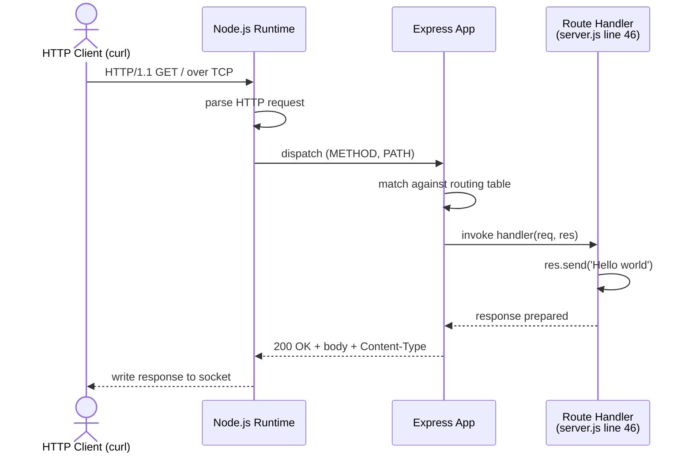

---

## 5.3 TECHNICAL DECISIONS

### 5.3.1 Architecture Style Decisions and Tradeoffs

The architecture style is a flat single-file Express application. The decisions below are documented as Architecture Decision Records (ADRs).

| Concern | Selected | Alternative Considered | Rationale |
|---------|----------|------------------------|-----------|
| Architecture style | Flat single-file Express app | Layered (MVC), Hexagonal, Microservices | Tutorial scope; CSF #4 (minimal footprint); CN-2 (no controllers/services) |
| Language | JavaScript on Node.js `>= 18` | TypeScript, Python | Section 1.3.2 excludes TypeScript; Express requires Node.js |
| Module system | CommonJS | ESM | Widely taught system for introductory tutorials; per `server.js` docstring |
| Framework | Express.js `^5.2.1` | Native `http`, Fastify, Koa | Mandated by CSF #1; explicit user request (F-001) |
| Package manager | npm | Yarn, pnpm | Bundled with Node.js; minimal toolchain (CSF #4) |
| Lockfile | `package-lock.json` v3 | `yarn.lock`, `pnpm-lock.yaml` | Generated by npm; matches package-manager choice |

**Trade-offs accepted:** The flat-file architecture sacrifices testability isolation (no dependency-injection seams), modularity (no router/controller separation), and operational maturity (no graceful shutdown, no health-check endpoint) in exchange for pedagogical clarity and a zero-configuration `npm start` flow.

### 5.3.2 Communication Pattern Decisions

| Concern | Selected | Alternative Considered | Rationale |
|---------|----------|------------------------|-----------|
| Inbound transport | HTTP/1.1 over TCP | HTTP/2, HTTPS/TLS, WebSockets, gRPC | Express default; TLS explicitly out-of-scope (Section 1.3.2) |
| Communication style | Synchronous request/response | Asynchronous, pub/sub, streaming | No async needs; no event bus present |
| Response format | Plain text (literal strings) | JSON, HTML, XML, protobuf | CSF #3 mandates byte-exact `Hello world` / `Good evening` |
| Inter-process communication | None | REST, gRPC, message queues | Single-process architecture; no peer services exist |

### 5.3.3 Data Storage Solution Rationale

| Concern | Selected | Alternative Considered | Rationale |
|---------|----------|------------------------|-----------|
| Primary database | None | PostgreSQL, MySQL, SQLite | No domain entities; tutorial scope per Section 1.3.1 |
| Document store | None | MongoDB, CouchDB | No semi-structured data |
| In-memory store | Closure-captured constants | Redis, in-process LRU | Two static strings; no caching needed |
| File storage | None | Local disk, S3 | No file inputs/outputs at runtime |
| Persistence pattern | None (stateless) | ORM, repository, active record | No state to persist |

**Rationale for no persistence:** The endpoints return literal string constants embedded in handler closures. There is no domain model, no user-supplied input to persist, and no inter-request state. Introducing persistence would violate CN-1 (no additional dependencies) and CN-2 (no service layer).

### 5.3.4 Caching Strategy Justification

There is **no caching strategy** at any tier. All decisions are summarized below:

| Cache Tier | Status | Rationale |
|------------|--------|-----------|
| Application-level cache | None | No expensive computations to memoize; response bodies are literal string constants |
| HTTP response cache headers | None (Express defaults only) | No `Cache-Control` headers configured; CN-2 forbids middleware |
| Reverse proxy cache | None | No reverse proxy in scope (Section 1.3.2) |
| CDN | None | No CDN integration (Section 3.4.1) |
| Database query cache | Not applicable | No database (see 5.3.3) |

The system's response payloads are O(1) constants; caching would provide no measurable benefit and would add complexity contrary to CSF #4.

### 5.3.5 Security Mechanism Selection

Security requirements are intentionally minimal because no authentication, authorization, sensitive data handling, or user-supplied input is present in the system. The security posture is documented per feature:

| Concern | Mechanism | Justification |
|---------|-----------|---------------|
| Route matcher hardening | Express 5.x default | Express 5.x ships a ReDoS-resistant route matcher; inherited by F-001 |
| Input validation | Not applicable | Both endpoints accept no query, body, or header inputs |
| Transport encryption (TLS) | Not present at runtime | Server binds on `localhost` only; HTTPS is used only at install-time for npm registry fetches |
| Supply-chain integrity | SRI hashes in `package-lock.json` | npm verifies SHA-512 hashes for all 67 packages during install |
| Secret leakage prevention | `.gitignore` patterns | `.env` and `.env.*` excluded from commits |
| Authentication / Authorization | None | No user identity in the system |

The server is **explicitly not intended for production hosting** (Section 1.3.2: "ships without TLS termination, process supervision, observability, or rate limiting").

### 5.3.6 Decision Tree: Port Resolution

The single explicit decision point in the entire codebase is the port-resolution expression `const PORT = process.env.PORT || 3000;` at `server.js` line 37. Its decision logic:

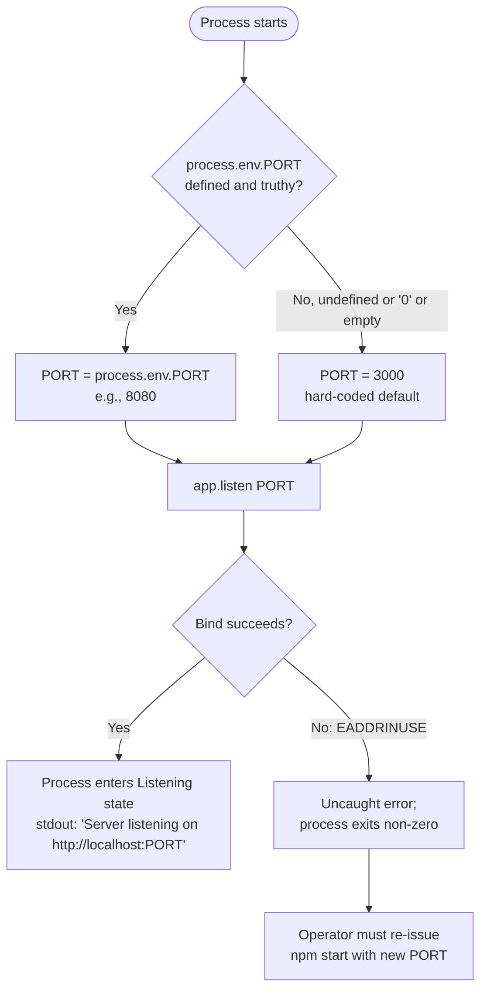

### 5.3.7 Architecture Decision Record Summary

```mermaid
flowchart TD
    ADR1["ADR-1: Use Express.js 5.2.1<br/>over native http / Fastify / Koa"]
    ADR2["ADR-2: Use CommonJS<br/>over ESM"]
    ADR3["ADR-3: Single-file architecture<br/>no router / controller / service layer"]
    ADR4["ADR-4: No persistence<br/>literal string constants in handlers"]
    ADR5["ADR-5: No middleware<br/>no logging, no auth, no body-parser beyond defaults"]
    ADR6["ADR-6: process.env.PORT with 3000 default<br/>only environment variable"]
    ADR7["ADR-7: No automated tests, no CI/CD, no Docker<br/>manual curl verification only"]

    ADR1 -->|enables| ADR3
    ADR1 -->|enables| ADR5
    ADR3 -->|enables| ADR4
    ADR3 -->|enables| ADR5
    ADR6 -->|consistent with| ADR3
    ADR7 -->|consistent with| ADR3

    CSF1["CSF #1: Express.js mandated"] --> ADR1
    CSF4["CSF #4: Minimal footprint"] --> ADR3
    CSF4 --> ADR5
    CSF4 --> ADR7
    CN5["CN-5: Zero-config npm start"] --> ADR6
```

### 5.3.8 Six Critical Success Factors (Architectural Constraints)

Every architecture decision above traces to one of the six critical success factors documented in Section 1.2.3:

1. **Framework adherence** — Express.js is the prescribed routing framework; native `http`, Fastify, and Koa must not be substituted.
2. **Additive, backward-compatible change** — `GET /` must remain reachable and unchanged.
3. **Exact response bodies** — Endpoints must return the literal strings `Hello world` and `Good evening` byte-for-byte.
4. **Minimal, idiomatic footprint** — Follow the official Express minimal-server pattern; introduce no extra runtime dependencies.
5. **Runtime floor and lockfile** — Target Node.js ≥ 18; pin the dependency tree via `package-lock.json`.
6. **Source-control hygiene** — Do not commit `node_modules/`; ensure `.gitignore` coverage.

---

## 5.4 CROSS-CUTTING CONCERNS

For each cross-cutting concern below, the documentation honestly reflects what is implemented in the codebase. Where a concern is not addressed, this is stated explicitly along with the rationale (tutorial scope, design constraint, or both), rather than describing aspirational frameworks not actually present.

### 5.4.1 Monitoring and Observability Approach

| Concern | Status | Detail |
|---------|--------|--------|
| Metrics collection | **Not present** | No Prometheus client, no StatsD, no custom counters |
| Distributed tracing | **Not present** | No OpenTelemetry, no Zipkin, no Jaeger |
| Health-check endpoints | **Not present** | Route catalog is exactly `/` and `/good-evening`; no `/health` or `/ready` |
| APM agent | **Not present** | No Datadog, New Relic, AppDynamics |
| Process-level metrics | **Not present** | No event-loop lag, GC pause, or memory metrics exported |

The only observability mechanism implemented in the system is **a single `console.log` line on startup**: `Server listening on http://localhost:${PORT}` (`server.js` line 60). This single line is sufficient to confirm successful bootstrap and the bound port, which is the entirety of the documented observability contract.

### 5.4.2 Logging and Tracing Strategy

| Concern | Status | Detail |
|---------|--------|--------|
| Application logs | One stdout line on startup | `console.log` in `server.js` line 60 |
| Request access logs | **Not present** | No `morgan`, no custom middleware (CN-2 forbids middleware) |
| Error logs | **Not present** | No custom error logging; finalhandler writes to stderr only on internal errors |
| Structured logging | **Not present** | Plain string output via `console.log` |
| Log persistence / aggregation | **Not present** | No log files written; stdout only |
| Distributed trace correlation | **Not present** | No trace IDs, no correlation IDs propagated |

Per Section 3.5.2, there is "no log persistence" anywhere in the system. The operator's only observability signal is the startup line on stdout.

### 5.4.3 Error Handling Patterns

The codebase implements **no custom error-handling apparatus**. Specifically:

- No `try` / `catch` blocks in `server.js`.
- No Express error-handling middleware (no `app.use((err, req, res, next) => ...)`).
- No process-level handlers for `uncaughtException` or `unhandledRejection`.
- No graceful shutdown handler for `SIGINT` / `SIGTERM`.

This minimalism is enforced by CN-2 ("No middleware, routers, controllers, or services may be introduced"). The runtime nevertheless exposes a small set of inherent failure modes, each handled by Node.js or Express defaults:

| Failure Mode | Default Handler | Client / Operator Effect |
|--------------|-----------------|--------------------------|
| `EADDRINUSE` on `app.listen` | Node.js raises uncaught error | Process exits non-zero; operator must re-issue `npm start` with different PORT |
| `MODULE_NOT_FOUND` on `require('express')` | Node.js raises uncaught error | Process never reaches `listen`; operator must run `npm install` |
| SRI hash mismatch during install | npm aborts install | `node_modules/` left incomplete; operator must investigate registry/network |
| Unknown route requested | Express default `finalhandler` | Client receives 404 Not Found |
| Exception thrown inside route handler | Express default error path | Client receives 500; connection closes |

#### Error Handling Flow Diagram

The diagram below maps each failure mode to the system's default behavior and the required operator response.

```mermaid
flowchart TD
    Start([Failure event occurs]) --> Classify{Failure category}
    Classify -->|Port already in use| EADDR[Node.js raises EADDRINUSE<br/>during app.listen]
    Classify -->|node_modules/ missing| MOD[require express throws<br/>MODULE_NOT_FOUND]
    Classify -->|npm install hash mismatch| HASH[npm aborts install;<br/>node_modules/ incomplete]
    Classify -->|Unknown route requested| ROUTE[Express default finalhandler<br/>responds 404]
    Classify -->|Exception inside route handler| EXC[Express default error path;<br/>500 response from finalhandler]

    EADDR --> Exit1[Uncaught error;<br/>process exits non-zero]
    MOD --> Exit2[Uncaught error;<br/>process never reaches listen]
    HASH --> Exit3[Install workflow aborts;<br/>server cannot start until resolved]
    ROUTE --> Resp1[Client receives 404]
    EXC --> Resp2[Client receives 500;<br/>connection closes]

    Exit1 --> Manual1[Operator must<br/>re-issue npm start<br/>with new PORT]
    Exit2 --> Manual2[Operator must<br/>re-run npm install]
    Exit3 --> Manual3[Operator must<br/>investigate registry / network]
```

### 5.4.4 Authentication and Authorization Framework

| Concern | Status | Justification |
|---------|--------|---------------|
| Authentication | **Not present** | Section 1.1.3: "no authentication, authorization, or user-role differentiation" |
| Authorization / RBAC | **Not present** | Section 1.1.3; Section 1.3.2 |
| Session management | **Not present** | Section 3.5.1 — Session store: None |
| API key / token validation | **Not present** | Section 2.4.4 — "no input handling, authentication, or sensitive data is involved" |
| TLS / encryption in transit | **Not present at runtime** | Section 2.2.4.2 — binds on `localhost` with no TLS; HTTPS used only at install-time |
| Rate limiting / throttling | **Not present** | Section 1.3.2 — "ships without ... rate limiting" |
| Audit logging | **Not present** | Only stdout startup line; no log persistence |
| Regulatory compliance (GDPR, PCI, HIPAA, SOC 2) | **Not applicable** | No personal, payment, or health data exists |

Both endpoints expose only fixed, public, plain-text strings with no input parameters. There is no user identity, no resource ownership, and no privileged operation in the system.

### 5.4.5 Performance Requirements and SLAs

No performance requirements are documented anywhere in the source files. Section 1.2.3 explicitly states that "No KPIs (response-time percentiles, error budgets, uptime SLAs, request volumes) are documented in any source file." Section 2.4.2 reiterates that "Default Express 5.x single-process behavior is accepted across all features." This section therefore documents only the **structural timing properties** that follow from the runtime architecture; it deliberately does not fabricate latency targets, throughput guarantees, or availability commitments.

| Performance Concern | Documented Target | Verification Method |
|---------------------|-------------------|---------------------|
| Response latency | None documented | None — `curl` smoke test only confirms correctness |
| Throughput (req/sec) | None documented | No load testing in scope |
| Availability / uptime SLA | None documented | Single-process; no HA |
| Error budget | None documented | Not applicable |
| Concurrency limit | Node.js event-loop default | No artificial limits configured |

Verification is exclusively manual via `curl`-based smoke tests; no load testing, soak testing, or benchmarking is in scope.

### 5.4.6 Disaster Recovery Procedures

The complete recovery story for every documented failure mode is: **the operator re-runs the appropriate command**. The system has none of the automated recovery primitives typically associated with disaster recovery:

| Recovery Mechanism | Status | Recovery Action |
|--------------------|--------|-----------------|
| Crash-loop guardrails (`pm2`, systemd, Kubernetes) | **Not present** | Operator manually re-issues `npm start` |
| Health-check endpoints | **Not present** | Process liveness cannot be probed via HTTP |
| Graceful shutdown handler | **Not present** | `SIGINT` / `SIGTERM` invoke Node.js default; in-flight requests dropped |
| Retry logic / circuit breakers | **Not present** | No outbound runtime dependencies to wrap |
| Backups / restore procedures | **Not applicable** | No persistent state to back up |
| Replication / failover | **Not applicable** | Single process by design |
| Dead-letter queues | **Not applicable** | No message queues (Section 3.4.1) |
| Error notification (email, paging, webhooks) | **Not present** | No notification provider integrations |

Per Section 2.4.4, the system is "not intended for production hosting." The disaster-recovery posture is therefore aligned with the tutorial scope: failures are observable to the operator at the terminal, and recovery is performed manually.

### 5.4.7 Process Lifecycle Salient Properties

The Cross-Cutting Concerns posture above is reinforced by three properties of the process lifecycle state machine (Section 5.2.6):

- **No graceful shutdown handler is registered.** The process responds to `SIGINT` / `SIGTERM` with Node.js default behavior; in-flight requests are not drained.
- **No reconnection or recovery logic.** A failed `app.listen` (e.g., `EADDRINUSE` when port 3000 is already taken) terminates the process; the operator must manually re-issue `npm start` with a different `PORT`.
- **No per-request state machine.** Each request transitions the process briefly into `Serving` and back to `Listening` synchronously within Node's event loop, with no asynchronous workflow, no queue, and no callback chain beyond Express's internal routing dispatch.

---

## 5.5 ARCHITECTURAL ASSUMPTIONS AND CONSTRAINTS

The architecture documented above rests on the following assumptions and constraints, drawn from Section 2.6.

### 5.5.1 Documented Assumptions

| ID | Assumption |
|----|------------|
| AS-1 | Operators have Node.js >= 18 and npm available locally |
| AS-2 | Operators have a generic HTTP client (curl, browser) for verification |
| AS-3 | The originating user request applies to an effectively empty repository |
| AS-4 | English-language fixed response strings are acceptable; no localization required |

### 5.5.2 Documented Constraints

| ID | Constraint |
|----|------------|
| CN-1 | No runtime dependencies beyond `express` may be added |
| CN-2 | No middleware, routers, controllers, or services may be introduced |
| CN-3 | Response bodies must be byte-for-byte exact (`Hello world`, `Good evening`) |
| CN-4 | No automated test suite, CI/CD, Docker, or IaC may be added under current scope |
| CN-5 | The server must remain launchable by `npm start` with zero additional configuration |

These constraints are not aspirational — they are the operative architectural envelope. Every absence noted throughout Section 5 (no middleware, no persistence, no monitoring, no auth, no TLS, no CI/CD) is a direct consequence of one or more of these constraints applied to the tutorial scope.

---

## 5.6 References

#### Files Examined

- `server.js` — Sole runtime artifact (62 lines); contains Express bootstrap, route registration for `/` and `/good-evening`, port resolution, listener bind, and startup log. Lines 1, 28, 32, 37, 46, 54, 59–61 cited throughout.
- `package.json` — Project manifest (17 lines); declares `express ^5.2.1` as sole dependency, `node >= 18` engine constraint, and `start: node server.js` script. No `devDependencies` section.
- `package-lock.json` — npm lockfile v3 (~29,577 bytes; 67 entries); pins Express 5.2.1 + 66 transitive packages with SHA-512 SRI hashes.
- `README.md` — Operator guide (53 lines); documents prerequisites, install/run commands, endpoint catalog, smoke-test commands.
- `.gitignore` — Source-control hygiene (20 lines); excludes `node_modules/`, `.env`, `.env.*`, log files, `.DS_Store`.
- `blitzy/documentation/Agent Action Plan.md` — Implementation blueprint; source of the six Critical Success Factors.
- `blitzy/documentation/Input Prompt.md` — Originating user request mandating Express adoption.

#### Folders Explored

- `/` (repository root) — Contains all five committed files plus the `blitzy/` documentation folder.
- `blitzy/documentation/` — Documentation workspace containing the input prompt and the agent action plan.
- `node_modules/` — Generated by `npm install`, not committed; materializes Express 5.2.1 plus 66 transitive packages.

#### Technical Specification Sections Cross-Referenced

- **1.1 EXECUTIVE SUMMARY** — Project identity and stakeholder context
- **1.2 SYSTEM OVERVIEW** — Architecture context, capabilities, success criteria, six CSFs
- **1.3 SCOPE** — In-scope/out-of-scope items; explicit exclusions (TLS, clustering, observability, etc.)
- **2.1 FEATURE CATALOG** — Eight features (F-001 through F-008) with dependencies
- **2.3 FEATURE RELATIONSHIPS** — Dependency map and integration points
- **2.4 IMPLEMENTATION CONSIDERATIONS** — Technical constraints, performance, scalability, security posture
- **2.6 ASSUMPTIONS AND CONSTRAINTS** — AS-1 through AS-4 and CN-1 through CN-5
- **3.1 PROGRAMMING LANGUAGES** — JavaScript on Node.js; CommonJS rationale
- **3.2 FRAMEWORKS & LIBRARIES** — Express.js 5.2.1 details, API surface, exclusions
- **3.3 OPEN SOURCE DEPENDENCIES** — Direct and 66 transitive dependencies
- **3.4 THIRD-PARTY SERVICES** — Categorically absent except install-time npm registry
- **3.5 DATABASES & STORAGE** — None at every category; in-memory state inventory
- **3.6 DEVELOPMENT & DEPLOYMENT** — No containerization, no CI/CD, no IaC
- **3.7 TECHNOLOGY STACK ARCHITECTURE** — Stack wiring, process launch flow, selection summary
- **4.2 CORE BUSINESS PROCESSES** — Bootstrap and request flow sequences
- **4.3 INTEGRATION WORKFLOWS** — Four integration points; absent integration patterns
- **4.4 VALIDATION RULES AND DECISION POINTS** — Single explicit decision (port resolution)
- **4.5 STATE MANAGEMENT** — Process lifecycle states; in-memory state inventory
- **4.6 ERROR HANDLING** — Inherent failure modes and default behaviors
- **4.7 TIMING AND SLA CONSIDERATIONS** — Documented absence of performance targets

# 6. SYSTEM COMPONENTS DESIGN

## 6.1 Core Services Architecture

**Core Services Architecture is not applicable for this system.**

The `artifact-2` repository implements a deliberately minimal, monolithic, single-process HTTP server consisting of one runtime file (`server.js`, 62 lines) with a single declared runtime dependency (`express@^5.2.1`). It contains no service decomposition, no inter-service communication, no service registry, no load balancer, no circuit breaker, no retry layer, no horizontal-scale path, no auto-scaler, no replica set, no failover topology, and no degraded-mode policy. Every concern enumerated by this section's template — service discovery, load balancing, circuit breakers, scalability triggers, fault-tolerance frameworks, disaster recovery, data redundancy, failover, and service degradation — is **explicitly absent** from the codebase and **constitutionally forbidden** by the project's documented constraints (CN-1 through CN-5; Section 5.5.2).

This subsection therefore documents (a) the applicability determination and its evidentiary basis, (b) the reference monolithic architecture that exists in lieu of distributed services, and (c) a structured absence inventory for each concern the section template would otherwise require. Detailed treatment of the actual single-process design lives in Sections 5.1, 5.2, 5.3, 5.4, and 5.5; this subsection cross-references those sections rather than duplicating them.

### 6.1.1 Applicability Assessment

#### 6.1.1.1 Determination

| Question | Determination | Evidence |
|----------|---------------|----------|
| Does the system require microservices? | No | Section 5.1.1; CN-2 (Section 5.5.2) |
| Does the system have a distributed architecture? | No | Section 1.2.1; Section 5.1.4 |
| Does the system contain distinct service components? | No | Section 5.2; single-file `server.js` |
| Is service-to-service communication present? | No | Section 5.1.4; Section 4.3 |

The system is best characterized as a tutorial-grade, in-process HTTP responder. It exposes exactly two stateless `GET` endpoints (`/` and `/good-evening`) implemented as inline arrow-function closures inside `server.js`, with response bodies that are byte-for-byte literal string constants embedded directly in the handlers (lines 46 and 54 of `server.js`).

#### 6.1.1.2 Architectural-Style Evidence

Section 5.1.1 documents the architectural style verbatim as a "monolithic, single-process HTTP server" with the following enumerated exclusions:

- No layered architecture
- No MVC partitioning
- No hexagonal / clean / onion separation
- **No microservice decomposition**
- No event-driven messaging
- No service-oriented intermediary

The rationale anchors in three pillars documented in Section 5.1.1: pedagogical clarity (introducing distributed patterns would obscure the foundational request/response model the artifact is intended to demonstrate), framework mandate (Critical Success Factor #1 prescribes Express.js as the routing framework), and zero-configuration default (Constraint CN-5 mandates launch via `npm start` with no additional configuration).

#### 6.1.1.3 Constitutional Constraints

The architectural envelope is defined by five constraints documented in Section 5.5.2 / Section 2.6.2. Each constraint, applied to the tutorial scope, directly forecloses one or more service-architecture concerns.

| Constraint ID | Constraint | Service-Architecture Foreclosure |
|---------------|------------|----------------------------------|
| CN-1 | No runtime dependencies beyond `express` may be added | Prevents adding service-discovery clients, message brokers, gRPC, or any IPC library |
| CN-2 | No middleware, routers, controllers, or services may be introduced | Forbids the introduction of service objects entirely |
| CN-3 | Response bodies must be byte-for-byte exact | Prevents proxying, aggregation, or transformation that any service layer would imply |
| CN-4 | No automated test suite, CI/CD, Docker, or IaC | Prevents the orchestration layer (Kubernetes, Compose, Terraform) that distributed deployments require |
| CN-5 | Server must remain launchable by `npm start` with zero additional configuration | Prevents service-registry registration, sidecar bootstrap, or replica coordination |

These constraints are operative, not aspirational. As stated in Section 5.5.2: "Every absence noted throughout Section 5 (no middleware, no persistence, no monitoring, no auth, no TLS, no CI/CD) is a direct consequence of one or more of these constraints applied to the tutorial scope."

### 6.1.2 Reference Architecture: Monolithic Single-Process

The architecture that exists in place of a service-oriented topology is documented in full in Sections 5.1 and 5.2. The summary below provides the visual reference necessary to contextualize the absence inventories that follow.

#### 6.1.2.1 Runtime Topology Diagram

```mermaid
flowchart LR
    subgraph ClientTier["Client Tier (external)"]
        Curl["HTTP Client<br/>(curl, browser)"]
    end

    subgraph HostProcess["Single Node.js Process"]
        direction TB
        Listener["TCP Listener<br/>app.listen(PORT)"]
        ExpressApp["Express Application Instance<br/>(express() at server.js:32)"]
        Router["Express Internal Routing Table<br/>(2 entries)"]
        H1["Handler: GET /<br/>res.send('Hello world')"]
        H2["Handler: GET /good-evening<br/>res.send('Good evening')"]
        Stdout["stdout<br/>(startup log line)"]

        Listener --> ExpressApp
        ExpressApp --> Router
        Router --> H1
        Router --> H2
        ExpressApp -. boot log .-> Stdout
    end

    Curl -- "HTTP/1.1 GET" --> Listener
    H1 -- "200 OK Hello world" --> Curl
    H2 -- "200 OK Good evening" --> Curl
```

Salient properties of the topology:

- The entire system is contained within one OS process bound to one TCP listener on `http://localhost:${PORT}` (default `3000`).
- There is no second tier, no sidecar, no proxy, no broker, and no backing store.
- The Express application instance, the routing table, and the two handler closures are established once during bootstrap and never mutated thereafter (immutable in-memory state principle, Section 5.1.1).

#### 6.1.2.2 Boundary Crossings

The complete integration surface is the four boundary crossings documented in Section 5.1.1. Only two are runtime crossings; both are inbound and synchronous. No peer service exists at any boundary.

| Boundary Crossing | Direction | Lifecycle | Protocol |
|-------------------|-----------|-----------|----------|
| HTTP client → `GET /` | Inbound | Runtime | HTTP/1.1 over TCP |
| HTTP client → `GET /good-evening` | Inbound | Runtime | HTTP/1.1 over TCP |
| npm CLI → `registry.npmjs.org` | Outbound | Install-time only | HTTPS |
| Shell → `npm start` → `node server.js` | Operator-driven | Launch-time | Process exec |

Per Section 5.1.4, the following integration categories are explicitly absent: external APIs, authentication or identity providers, monitoring or observability platforms, cloud platforms, message brokers or queues, email or SMS providers, content delivery networks, analytics or telemetry collectors, feature flag services, and secrets management vaults.

### 6.1.3 Service Components — Absence Inventory

The section template prescribes documentation of six service-component concerns. Each is addressed below with its specific status and evidentiary anchor in the codebase or technical specification.

#### 6.1.3.1 Service Boundaries and Inter-Service Communication

| Concern | Status | Evidentiary Anchor |
|---------|--------|--------------------|
| Service boundaries and responsibilities | Single process, single file | `server.js`; Section 5.1.1; Section 5.2.1 |
| Inter-service communication patterns | Not applicable — no peer services exist | Section 5.1.4; Section 4.3 |
| Synchronous IPC / RPC (gRPC, REST-to-REST) | Not present | CN-1; Section 5.1.3 |
| Asynchronous IPC (queues, pub/sub) | Not present | Section 1.3.2; Section 5.1.3 |

The process boundary is the only boundary. The application has exactly one responsibility — accept HTTP GET requests on two predefined paths and respond with literal string bodies. Per Section 5.1.3, the only runtime integration pattern is "synchronous request/response over HTTP/1.1"; there are no asynchronous patterns (no message queues, no pub/sub, no webhooks, no long polling, no Server-Sent Events, no WebSockets).

#### 6.1.3.2 Service Discovery and Load Balancing

| Concern | Status | Evidentiary Anchor |
|---------|--------|--------------------|
| Service discovery mechanism | Not present — no upstream service registry | Section 1.2.1; Section 5.1.4 |
| Client-side discovery | Not present | CN-1 (no discovery client library permitted) |
| Server-side discovery / registry | Not present | Section 5.1.4 |
| Load balancing strategy | Not present — out-of-scope | Section 2.4.3; Section 5.2.1 |
| Reverse proxying | Not present | Section 1.3.2 (out-of-scope) |
| DNS-based or hardware load balancing | Not present — single TCP listener on `localhost` | Section 5.1.1 |

The server binds to a single fixed port resolved from `process.env.PORT || 3000` and exposes one TCP endpoint. There is no second instance against which to balance, no registry from which to discover, and no proxy layer in front of the listener.

#### 6.1.3.3 Circuit Breakers, Retry, and Fallback Mechanisms

| Concern | Status | Evidentiary Anchor |
|---------|--------|--------------------|
| Circuit breaker patterns | Not present — no outbound runtime dependencies | Section 4.6.3; Section 5.4.6 |
| Retry logic (in-process) | Not present — no conditional re-execution in `server.js` | Section 4.6.3 |
| Fallback / degraded-mode flows | Not present — endpoints have no dependencies that could fail | Section 4.6.3 |
| Dead-letter queues | Not applicable — no message queues | Section 5.4.6 |
| Bulkhead isolation | Not applicable — single process, default event loop | Section 5.4.5 |

Because the responses are literal string constants computed within the handler closure (no downstream service call, no database read, no external API invocation), there is no failure surface for which circuit-breaker, retry, or fallback semantics would apply. As Section 4.6.3 states: "Circuit breakers: Not present — No outbound runtime dependencies that would warrant one."

### 6.1.4 Scalability Design — Absence Inventory

Section 2.4.3 declares scalability "intentionally out of scope," and Section 5.2.1 declares scaling "intentionally out of scope by design, not an oversight." The system runs as a single Node.js process bound to one TCP listener.

#### 6.1.4.1 Horizontal and Vertical Scaling Approach

| Concern | Status | Evidentiary Anchor |
|---------|--------|--------------------|
| Horizontal scaling (replicas) | Not designed for | Section 2.4.3; CN-5 |
| Vertical scaling (more CPU/memory per process) | Not configured — accepts Node.js defaults | Section 5.4.5 |
| Clustering / worker processes (`cluster`, `pm2`) | Not present | Section 2.4.3; Section 5.2.1 |
| Multi-instance coordination | Not present | Section 5.4.6 |

Per Section 2.4.3: "No feature in the catalog has a horizontal-scale path defined; any such expansion would constitute a future phase beyond the current change." Per Section 5.2.1, the following are explicitly excluded: clustering or worker processes (no `cluster` module, no `pm2`), HTTP/2 or HTTPS/TLS termination, caching layers (none at any tier), load balancing or reverse proxying, and multi-tenant or multi-user identity separation.

#### 6.1.4.2 Auto-Scaling Triggers and Resource Allocation

| Concern | Status | Evidentiary Anchor |
|---------|--------|--------------------|
| Auto-scaling triggers and rules | Not present — no orchestrator | CN-4 (no IaC / Kubernetes) |
| Resource allocation strategy | Default Node.js event loop only | Section 5.4.5 |
| CPU / memory reservation | None — operator-controlled | No process supervisor (Section 5.4.6) |
| Concurrency limit | Node.js event-loop default; no artificial cap | Section 5.4.5 |

There is no orchestration layer (no Kubernetes Horizontal Pod Autoscaler, no AWS Auto Scaling Group, no `pm2` ecosystem) because CN-4 forbids the IaC, containerization, and CI/CD infrastructure that would host such triggers.

#### 6.1.4.3 Performance Optimization and Capacity Planning

| Concern | Status | Evidentiary Anchor |
|---------|--------|--------------------|
| Performance optimization techniques | None — accepts Express 5.x defaults | Section 2.4.2 |
| Performance targets (latency, throughput) | None documented | Section 1.2.3; Section 5.4.5 |
| Capacity planning guidelines | None documented | Section 1.2.3 ("No KPIs documented in any source file") |
| Load testing / benchmarking | Out of scope — verification by `curl` smoke test only | Section 2.4.2 |

Section 5.4.5 states explicitly: "This section therefore documents only the structural timing properties that follow from the runtime architecture; it deliberately does not fabricate latency targets, throughput guarantees, or availability commitments." Section 1.2.3 affirms: "No KPIs (response-time percentiles, error budgets, uptime SLAs, request volumes) are documented in any source file."

#### 6.1.4.4 Scalability Topology Diagram

```mermaid
flowchart TB
    subgraph Host["Host Operating System"]
        direction TB
        subgraph Proc["Single Node.js Process (1 of 1)"]
            direction TB
            EventLoop["Node.js Event Loop<br/>(single-threaded)"]
            App["express() app instance"]
            Sock["1 × TCP listening socket<br/>port = PORT or 3000"]
            EventLoop --> App
            App --> Sock
        end
    end

    NoCluster["No cluster workers<br/>(CN-1, Section 5.2.1)"]:::absent
    NoLB["No load balancer<br/>(Section 2.4.3)"]:::absent
    NoHPA["No horizontal autoscaler<br/>(CN-4)"]:::absent
    NoCache["No cache tier<br/>(Section 5.1.3)"]:::absent
    NoReplica["No replica instance<br/>(Section 5.4.6)"]:::absent

    Sock -.absent.- NoCluster
    Sock -.absent.- NoLB
    Sock -.absent.- NoHPA
    Sock -.absent.- NoCache
    Sock -.absent.- NoReplica

    classDef absent fill:#f5f5f5,stroke:#999,stroke-dasharray: 5 5,color:#666
```

The dashed nodes denote scalability primitives that are deliberately absent. Each is anchored to the constraint or section that forecloses it.

### 6.1.5 Resilience Patterns — Absence Inventory

Section 5.4.6 enumerates the disaster-recovery posture in a single sentence: "the operator re-runs the appropriate command." The system has none of the automated recovery primitives typically associated with resilience patterns, and no custom error-handling apparatus is implemented (Section 4.6.1).

#### 6.1.5.1 Fault Tolerance Mechanisms

| Concern | Status | Evidentiary Anchor |
|---------|--------|--------------------|
| Fault tolerance framework | None — uncaught errors terminate the process | Section 5.4.3; Section 4.6.1 |
| `try` / `catch` blocks in `server.js` | None | Section 4.6.1 |
| Express error-handling middleware | Not present | CN-2 forbids middleware |
| Process-level handlers (`uncaughtException`, `unhandledRejection`) | None registered | Section 4.6.1 |
| Graceful shutdown handler (`SIGINT` / `SIGTERM`) | None registered — in-flight requests dropped | Section 4.6.1; Section 5.4.7 |

The runtime nevertheless exposes a small set of inherent failure modes inherited from Node.js and Express. The diagram below, drawn from Section 4.6.2 / Section 5.4.3, maps each failure mode to the system's default response. The recovery action in every case is operator-mediated.

#### 6.1.5.2 Resilience Pattern Implementation Diagram

```mermaid
flowchart TD
    Start([Failure event occurs]) --> Classify{Failure category}
    Classify -->|Port already in use| EADDR[Node.js raises EADDRINUSE<br/>during app.listen]
    Classify -->|node_modules missing| MOD[require express throws<br/>MODULE_NOT_FOUND]
    Classify -->|npm install hash mismatch| HASH[npm aborts install;<br/>node_modules incomplete]
    Classify -->|Unknown route requested| ROUTE[Express default finalhandler<br/>responds 404]
    Classify -->|Exception inside route handler| EXC[Express default error path;<br/>500 from finalhandler]

    EADDR --> Exit1[Uncaught error;<br/>process exits non-zero]
    MOD --> Exit2[Uncaught error;<br/>process never reaches listen]
    HASH --> Exit3[Install aborts;<br/>server cannot start]
    ROUTE --> Resp1[Client receives 404]
    EXC --> Resp2[Client receives 500;<br/>connection closes]

    Exit1 --> Recover1[Operator manually re-issues<br/>npm start with new PORT]
    Exit2 --> Recover2[Operator manually re-runs<br/>npm install]
    Exit3 --> Recover3[Operator manually investigates<br/>registry / network]
```

Per Section 4.6.3, the complete recovery story for every failure mode is: **the operator re-runs the appropriate command**. There is no automated re-execution, no exponential backoff, no jittered retry queue, and no bulkhead isolation.

#### 6.1.5.3 Disaster Recovery and Failover Configurations

| Concern | Status | Evidentiary Anchor |
|---------|--------|--------------------|
| Crash-loop guardrails (`pm2`, systemd, Kubernetes) | Not present — operator manually re-issues `npm start` | Section 5.4.6 |
| Health-check endpoints | Not present — route catalog is exactly `/` and `/good-evening` | Section 5.4.1; Section 4.6.3 |
| Replication / failover | Not applicable — single process by design | Section 5.4.6 |
| Backups / restore procedures | Not applicable — no persistent state | Section 5.1.3 (no data stores) |
| Data redundancy approach | Not applicable — no data to redundantly store | Section 5.1.3 |
| Error notification (email, paging, webhooks) | Not present — no notification provider integrations | Section 5.4.6 |

There is no persistent state to back up because, per Section 5.1.3, the system has no data stores and no caches at any tier (no primary database, no NoSQL store, no in-memory cache, no HTTP response cache, no reverse proxy / CDN, no session store, no search index, no object / file storage). The only persistence point in the entire lifecycle is the install-time materialization of `node_modules/` on local disk, which is itself excluded from version control by `.gitignore`.

#### 6.1.5.4 Service Degradation Policies

| Concern | Status | Evidentiary Anchor |
|---------|--------|--------------------|
| Service degradation policy | Not present — no tiered functionality | Section 4.6.3 |
| Bulkheads / quota throttles | Not present | Section 5.4.4 ("no rate limiting") |
| Graceful response degradation | Not present — responses are literal string constants | Section 5.1.3 (no transformations) |
| Read-only / maintenance modes | Not applicable — endpoints are read-only by nature | Both endpoints are stateless `GET`s |

Since the two endpoints carry no downstream dependencies and return literal string constants embedded in the handler closures, there is no functionality to degrade. The "degraded" mode of either endpoint is operationally indistinguishable from the "healthy" mode, because the response source is in-process and immutable.

### 6.1.6 The Process Lifecycle: The Only "Service" That Exists

In place of a service lifecycle managed by an orchestrator, the system exposes a single process lifecycle documented in Section 4.5.1 / Section 5.2.6. It is the operative substitute for everything this section's template would otherwise classify as a service.

```mermaid
stateDiagram-v2
    [*] --> Loaded: node server.js starts
    Loaded --> Configured: require express, app instance,<br/>routes registered, PORT resolved
    Configured --> Listening: app.listen binds TCP socket;<br/>startup log emitted
    Listening --> Serving: HTTP request arrives
    Serving --> Listening: response sent;<br/>connection idle
    Listening --> Terminated: SIGINT / SIGTERM or<br/>uncaught error
    Configured --> Terminated: EADDRINUSE or<br/>require failure
    Terminated --> [*]: process exits;<br/>operator may re-run npm start
```

Salient properties of the lifecycle, per Section 5.4.7:

- **No graceful shutdown handler is registered.** The process responds to `SIGINT` / `SIGTERM` with Node.js default behavior; in-flight requests are not drained.
- **No reconnection or recovery logic.** A failed `app.listen` (e.g., `EADDRINUSE` when the configured port is already taken) terminates the process; the operator must manually re-issue `npm start` with a different `PORT`.
- **No per-request state machine.** Each request transitions the process briefly into `Serving` and back to `Listening` synchronously within Node's event loop, with no asynchronous workflow, no queue, and no callback chain beyond Express's internal routing dispatch.

### 6.1.7 Cross-Reference Index

The architectural decisions, constraints, and absence rationale documented in summary form above are anchored in the following sections of this specification. Readers seeking detailed treatment of any specific concern should consult the primary section indicated.

| Topic | Primary Section | Supporting Sections |
|-------|-----------------|---------------------|
| Monolithic architecture style and rationale | Section 5.1.1 | Section 1.2.2; Section 3.7 |
| Component inventory (single file + manifest) | Section 5.2 | Section 5.1.2 |
| Scalability scope exclusion | Section 2.4.3 | Section 5.2.1; Section 5.4.5 |
| Error handling and recovery posture | Section 4.6 | Section 5.4.3; Section 5.4.6 |
| Constraints CN-1 through CN-5 | Section 5.5.2 | Section 2.6.2 |
| Integration surface (and its categorical absences) | Section 5.1.4 | Section 4.3 |
| Process lifecycle state machine | Section 5.2.6 | Section 4.5.1; Section 5.4.7 |
| State management (in-memory only) | Section 4.5 | Section 5.1.3 |

If a future revision of `artifact-2` removes any of the CN-1 through CN-5 constraints, this subsection should be revisited and populated with the corresponding service-architecture details. Under the current constraints, no such revision is in scope.

### 6.1.8 References

#### 6.1.8.1 Files Examined

- `server.js` — 62-line single-file Express application; confirmed single-process, two-route topology with no service decomposition, no middleware, no error handlers, and no shutdown logic.
- `package.json` — 17-line manifest; confirmed single `express@^5.2.1` runtime dependency, single `start` script, no `devDependencies`, `private: true`.
- `package-lock.json` — npm lockfile v3 (67 entries); confirmed deterministic dependency tree with SHA-512 SRI hashes.
- `README.md` — 53-line operational guide; confirmed three-command workflow (`npm install`, `npm start`, `curl`); no production deployment guidance.
- `.gitignore` — Source-control hygiene file; excludes `node_modules/`, `.env`, log files.

#### 6.1.8.2 Folders Explored

- `` (repository root) — Confirmed minimal structure: 4 top-level files plus one documentation folder.
- `blitzy/` — Documentation-only workspace; no application code.
- `blitzy/documentation/` — Contains only `Input Prompt.md` and `Agent Action Plan.md` (planning artifacts, not code).

#### 6.1.8.3 Technical Specification Sections Referenced

- Section 1.2 SYSTEM OVERVIEW — Project context confirming single Node.js process bound to `localhost` with no upstream registry or downstream backing services.
- Section 1.3 SCOPE — Explicit out-of-scope enumeration covering clustering, HTTPS/TLS, caching, multi-tenancy, performance work, CI/CD, and container orchestration.
- Section 2.4 IMPLEMENTATION CONSIDERATIONS — Scalability declared intentionally out-of-scope; no performance requirements documented.
- Section 4.3 INTEGRATION WORKFLOWS — Categorically absent integration patterns (external APIs, auth providers, monitoring, cloud platforms, brokers, etc.).
- Section 4.5 STATE MANAGEMENT — All state is in-memory; no persistence; no distributed state.
- Section 4.6 ERROR HANDLING — No retry, no circuit breakers, no fallbacks, no health checks, no notification.
- Section 4.7 TIMING AND SLA CONSIDERATIONS — No SLAs, no performance targets, no availability commitments.
- Section 5.1 HIGH-LEVEL ARCHITECTURE — Primary source: "monolithic, single-process HTTP server"; "no microservice decomposition."
- Section 5.2 COMPONENT DETAILS — All five committed components are pieces of the single-file architecture; scaling explicitly out of scope per 5.2.1.
- Section 5.3 TECHNICAL DECISIONS — Architectural decisions explicitly reject distributed/microservice patterns.
- Section 5.4 CROSS-CUTTING CONCERNS — Comprehensive absence documentation for monitoring (5.4.1), logging (5.4.2), error handling (5.4.3), auth (5.4.4), performance (5.4.5), and disaster recovery (5.4.6).
- Section 5.5 ARCHITECTURAL ASSUMPTIONS AND CONSTRAINTS — Constraints CN-1 through CN-5 that operatively forbid service architecture.

## 6.2 Database Design

**Database Design is not applicable to this system.**

The `artifact-2` repository implements a deliberately minimal, monolithic, single-process HTTP server consisting of one runtime file (`server.js`, 62 lines) with a single declared runtime dependency (`express@^5.2.1`). It contains **no persistence layer of any kind** — no relational database, no NoSQL store, no in-memory cache, no object storage, no file storage, no session store, no search index, and no time-series database. Every concern enumerated by this section's template — schema design, entity relationships, indexing, partitioning, replication, backups, migrations, archival, retention, query optimization, connection pooling, read/write splitting, and batch processing — is **explicitly absent** from the codebase and **constitutionally forbidden** by the project's documented constraints (CN-1 through CN-5; Section 2.6.2).

This subsection therefore documents (a) the applicability determination and its evidentiary basis, (b) the in-memory closure-based "state" that exists in lieu of persistence, and (c) a structured absence inventory for each subsection the template would otherwise require. The treatment follows the precedent established in Section 6.1, which renders an analogous "not applicable" verdict for Core Services Architecture under the same constraint regime.

### 6.2.1 Applicability Assessment

#### 6.2.1.1 Determination

| Question | Determination | Evidence |
|----------|---------------|----------|
| Does the system require a primary database? | No | Section 3.5.1; Section 5.3.3 |
| Does the system have domain entities to model? | No | Section 1.3.1 ("Data domains: None") |
| Does any component read from or write to a data store at runtime? | No | Section 5.2.1; Section 4.5.3 |
| Is there any state that survives a process restart? | No | Section 4.5.2; Section 5.1.3 |

The system is best characterized as a tutorial-grade, in-process HTTP responder whose two endpoints (`GET /` and `GET /good-evening`) return literal string constants (`'Hello world'`, `'Good evening'`) embedded directly in handler closures at lines 46 and 54 of `server.js`. There is no domain model, no user-supplied input to persist, and no inter-request state.

#### 6.2.1.2 Persistence Posture — Categorical Absence

Section 3.5.1 is the authoritative source for the system's persistence posture, which is reproduced here for the database-design subsection's own record:

| Storage Category | Status | Authoritative Source |
|------------------|--------|----------------------|
| Primary relational database (PostgreSQL, MySQL, SQLite) | None | Section 3.5.1; Section 5.3.3 |
| NoSQL / document database (MongoDB, CouchDB) | None | Section 3.5.1; Section 5.3.3 |
| In-memory cache (Redis, Memcached) | None | Section 3.5.1; Section 5.3.4 |
| Object storage (S3, GCS, Azure Blob) | None | Section 3.5.1; Section 5.1.4 |
| File storage | None | Section 3.5.1; Section 5.2.1 |
| Session store | None | Section 3.5.1; Section 5.1.3 |
| Search index (Elasticsearch, OpenSearch) | None | Section 3.5.1 |
| Time-series / metrics database (InfluxDB, Prometheus) | None | Section 3.5.1 |

Section 5.1.3 reinforces the same finding: the system has *no data stores and no caches at any tier*. The only persistence point in the entire lifecycle is the install-time materialization of `node_modules/` on local disk by `npm install`, and even that directory is excluded from version control by `.gitignore`. It is not data, it is not addressed by a database driver, and it is regenerated deterministically from `package-lock.json` on demand.

#### 6.2.1.3 Constitutional Constraints

The persistence envelope (or lack thereof) is defined by five constraints documented in Section 2.6.2 / Section 5.5.2. Each constraint, applied to the tutorial scope, directly forecloses one or more database-design concerns.

| Constraint ID | Constraint | Database-Design Foreclosure |
|---------------|------------|------------------------------|
| CN-1 | No runtime dependencies beyond `express` may be added | Forbids adding any DB driver, ORM, cache library, or migration tool |
| CN-2 | No middleware, routers, controllers, or services may be introduced | Forbids repositories, DAOs, query builders, or persistence service objects |
| CN-3 | Response bodies must be byte-for-byte exact (`Hello world`, `Good evening`) | Forbids dynamic content derived from any data store |
| CN-4 | No automated test suite, CI/CD, Docker, or IaC | Forbids the deployment infrastructure that any DB-backed system would require |
| CN-5 | The server must remain launchable by `npm start` with zero additional configuration | Forbids connection strings, schema-init scripts, or any DB-related environment variables |

These constraints are operative, not aspirational. Section 5.5.2 states explicitly: *"Every absence noted throughout Section 5 (no middleware, **no persistence**, no monitoring, no auth, no TLS, no CI/CD) is a direct consequence of one or more of these constraints applied to the tutorial scope."*

#### 6.2.1.4 Architectural Decision Record

Section 5.3.3 records the Data Storage Solution rationale as a formal ADR, summarized below for direct reference:

| Concern | Selected | Alternative Considered | Rationale |
|---------|----------|------------------------|-----------|
| Primary database | None | PostgreSQL, MySQL, SQLite | No domain entities; tutorial scope (Section 1.3.1) |
| Document store | None | MongoDB, CouchDB | No semi-structured data |
| In-memory store | Closure-captured constants | Redis, in-process LRU | Two static strings; no caching needed |
| File storage | None | Local disk, S3 | No file inputs/outputs at runtime |

ADR-4 from Section 5.3.7 reads: *"No persistence — literal string constants in handlers."* The decision is upstream-anchored to Critical Success Factor #4 (minimal, idiomatic footprint) and downstream-anchored to ADR-5 (no middleware) and ADR-3 (single-file architecture).

### 6.2.2 In-Memory State — What Exists in Lieu of Persistence

In place of a persistence layer, the system holds a small, fixed set of in-memory references that are established once during bootstrap and never mutated thereafter. This is the only "data" the system can be said to manage, and it is documented in full in Section 4.5.2.

#### 6.2.2.1 State Element Inventory

| State Element | Lifetime | Mutability | Location |
|---------------|----------|------------|----------|
| Express `app` instance | Process lifetime | Effectively immutable after registration | `server.js` line 32 |
| Resolved `PORT` constant | Process lifetime | Immutable (declared `const`) | `server.js` line 37 |
| Route handler for `/` | Process lifetime | Immutable closure | `server.js` line 46 |
| Route handler for `/good-evening` | Process lifetime | Immutable closure | `server.js` line 54 |
| Response string `'Hello world'` | Process lifetime | Captured in handler closure | `server.js` line 46 |
| Response string `'Good evening'` | Process lifetime | Captured in handler closure | `server.js` line 54 |

Section 4.5.2 emphasizes: *"There is no per-request state, no client session, no cookie storage, no log persistence, and no file I/O beyond the stdout startup log line."* Section 5.2.1 confirms that `server.js` *"performs no file I/O beyond writing a single line to stdout during bootstrap. It does not open, read, write, or close any file descriptor other than the TCP listening socket."*

#### 6.2.2.2 In-Process Data-Flow Topology Diagram

The diagram below substitutes for the "data flow" and "database schema" diagrams the template would otherwise require. It shows (i) the only state the system actually holds (the two handler closures), (ii) the synchronous request/response transit, and (iii) the categorical absence of every standard persistence tier.

```mermaid
flowchart LR
    subgraph ClientTier["Client Tier (external)"]
        Curl["HTTP Client<br/>curl / browser"]
    end

    subgraph NodeProcess["Single Node.js Process (in-memory only)"]
        direction TB
        Boot["server.js bootstrap<br/>(once at process start)"]
        AppInst["Express app instance<br/>server.js line 32"]
        HandlerA["Handler closure: GET /<br/>captures literal 'Hello world'"]
        HandlerB["Handler closure: GET /good-evening<br/>captures literal 'Good evening'"]
        Boot --> AppInst
        AppInst --> HandlerA
        AppInst --> HandlerB
    end

    subgraph AbsentStores["Persistence Layer (deliberately absent)"]
        direction TB
        NoDB[("Primary Database<br/>None")]:::absent
        NoNoSQL[("Document Store<br/>None")]:::absent
        NoCache[("In-Memory Cache<br/>None")]:::absent
        NoObj[("Object / File Storage<br/>None")]:::absent
        NoSession[("Session Store<br/>None")]:::absent
        NoSearch[("Search Index<br/>None")]:::absent
        NoTSDB[("Time-Series Store<br/>None")]:::absent
    end

    Curl -- "HTTP/1.1 GET /" --> HandlerA
    Curl -- "HTTP/1.1 GET /good-evening" --> HandlerB
    HandlerA -- "200 OK 'Hello world'" --> Curl
    HandlerB -- "200 OK 'Good evening'" --> Curl

    HandlerA -. "no read / no write" .- NoDB
    HandlerB -. "no read / no write" .- NoDB
    AppInst -. "no client init" .- NoCache
    AppInst -. "no FS open" .- NoObj
    AppInst -. "no session middleware" .- NoSession
    AppInst -. "no driver" .- NoNoSQL
    AppInst -. "no client" .- NoSearch
    AppInst -. "no metrics writer" .- NoTSDB

    classDef absent fill:#f5f5f5,stroke:#999,stroke-dasharray: 5 5,color:#666
```

Salient properties:

- The **only** state-bearing artifacts in the running process are the four boxes inside `NodeProcess`.
- The dashed nodes denote persistence primitives that are **deliberately absent**; each would require a runtime dependency forbidden by CN-1 and an integration pattern forbidden by CN-2.
- Per Section 5.1.3, the only runtime integration pattern is *"synchronous request/response over HTTP/1.1"*; there are no asynchronous patterns (no message queues, no pub/sub, no webhooks) and consequently no need for any persistent intermediate store.

#### 6.2.2.3 State Lifecycle and Loss-on-Termination

Because all state is in-memory and ephemeral, the state-lifecycle diagram below documents the complete data-lifecycle horizon of the system. There is no further lifecycle — no archival, no migration, no replication — because there is no persistent representation to maintain.

```mermaid
stateDiagram-v2
    [*] --> Capture: node server.js invoked
    Capture --> Available: Response strings captured<br/>into handler closures
    Available --> Served: GET request matched
    Served --> Available: res.send writes literal string<br/>(no DB read, no cache lookup)
    Available --> Lost: process terminated<br/>(SIGINT / SIGTERM / uncaught error)
    Lost --> [*]: All in-memory state discarded;<br/>no persistence, no recovery
```

Per Section 4.5.3, the following persistence-related concerns are explicitly marked Not Applicable: ACID transaction boundaries (no persistence), distributed transaction coordination (single process), and optimistic/pessimistic locking (no shared mutable state).

### 6.2.3 Schema Design — Absence Inventory

The template prescribes documentation of entity relationships, data models, indexing, partitioning, replication, and backup. Each is addressed below with its specific status and evidentiary anchor.

#### 6.2.3.1 Entity Relationships and Data Models

| Concern | Status | Evidentiary Anchor |
|---------|--------|---------------------|
| Domain entities | None defined | Section 1.3.1 ("Data domains: None") |
| Entity-relationship diagram (ERD) | Not applicable — no entities to relate | Section 3.5.1; Section 5.3.3 |
| Logical data model | Not applicable — no schema exists | Section 3.5.1 |
| Physical data model | Not applicable — no DDL exists in the repository | `server.js`; `package.json` |
| Constraints (PK, FK, UNIQUE, CHECK, NOT NULL) | Not applicable — no tables, columns, or types defined | Section 5.3.3 |
| Schema versioning artifact (e.g., `schema.sql`) | Not present in the repository | Section 1.3.1; Section 5.1.2 |

The repository inventory (Section 5.1.2) enumerates exactly five committed artifacts: `server.js`, `package.json`, `package-lock.json`, `README.md`, and `.gitignore`. None is a schema definition file, an ORM model module, or a migration script. A schema diagram cannot be produced because the system contains no entities to diagram; the only "values" the system handles are the two byte-exact response strings mandated by CN-3.

#### 6.2.3.2 Indexing, Partitioning, and Replication

| Concern | Status | Evidentiary Anchor |
|---------|--------|---------------------|
| Indexing strategy (B-tree, hash, GIN, etc.) | Not applicable — no tables to index | Section 3.5.1 |
| Composite or covering indexes | Not applicable | Section 3.5.1 |
| Full-text / vector indexes | Not applicable — no search index either (Section 3.5.1) | Section 3.5.1 |
| Partitioning approach (range, hash, list) | Not applicable — no rows to partition | Section 3.5.1 |
| Sharding scheme | Not applicable — no database to shard | Section 5.1.3 |
| Replication topology (primary/replica, multi-master) | Not applicable — no database to replicate | Section 6.1.5.3 ("Replication / failover: Not applicable") |
| Replication lag / consistency model | Not applicable | Section 4.5.3 |

Section 6.1.5.3 anchors the replication determination explicitly: *"Replication / failover: Not applicable — single process by design."* Since no database engine exists, there is no replication topology to design, no replica set to configure, and no failover policy to enact. Read/write splitting (Section 6.2.6.2) is similarly not applicable.

#### 6.2.3.3 Backup Architecture

| Concern | Status | Evidentiary Anchor |
|---------|--------|---------------------|
| Backup target (full, incremental, differential) | Not applicable — no data to back up | Section 6.1.5.3 |
| Backup cadence / RPO | Not applicable | Section 6.1.5.3 |
| Restore procedure / RTO | Not applicable | Section 6.1.5.3 |
| Point-in-time recovery (PITR) | Not applicable | Section 6.1.5.3 |
| Off-site / cross-region backup | Not applicable | Section 5.1.4 (no cloud platforms) |
| Backup encryption at rest | Not applicable | Section 5.3.5 |

Per Section 6.1.5.3: *"Backups / restore procedures: Not applicable — no persistent state."* The recovery story for the entire system — including any artifact a backup would otherwise protect — is documented in Section 4.6.3 in a single sentence: **the operator re-runs `npm install` and/or `npm start`** to materialize `node_modules/` and restart the process. The committed source files (`server.js`, `package.json`, `package-lock.json`, `README.md`, `.gitignore`) are themselves backed by Git; no database-style backup architecture is required to recover them.

### 6.2.4 Data Management — Absence Inventory

The template prescribes documentation of migrations, versioning, archival, storage/retrieval, and caching policies. Each is addressed below.

#### 6.2.4.1 Migration Procedures and Versioning

| Concern | Status | Evidentiary Anchor |
|---------|--------|---------------------|
| Schema migration tool (Flyway, Liquibase, Knex, Sequelize CLI) | Not present — no DB to migrate | Section 1.3.2 ("ORMs, migrations" out-of-scope) |
| Migration directory (e.g., `migrations/`) | Not present in the repository | Section 5.1.2 |
| Forward / rollback scripts | Not applicable | Section 1.3.2 |
| Schema versioning (e.g., `schema_migrations` table) | Not applicable — no DB | Section 1.3.2 |
| Data versioning (event sourcing, append-only logs) | Not applicable | Section 4.5.3 |
| Backward-compatibility policy for data shapes | Not applicable — no shapes exist | Section 1.3.1 |

The repository's planning artifacts (`blitzy/documentation/Agent Action Plan.md`) state directly: *"Database / schema updates: Not applicable. The feature introduces no persistence, migrations, or schema."* Section 1.3.2 enumerates *"Databases, ORMs, migrations, and data models"* as explicitly out-of-scope, and CN-1 forbids the introduction of any migration-tool runtime dependency.

#### 6.2.4.2 Archival Policies and Storage/Retrieval Mechanisms

| Concern | Status | Evidentiary Anchor |
|---------|--------|---------------------|
| Archival tier (cold storage, glacier) | Not applicable — no data to archive | Section 3.5.1 |
| Data lifecycle policy (hot / warm / cold) | Not applicable | Section 4.5.3 |
| TTL / expiration mechanism | Not applicable | Section 4.5.3 |
| Storage mechanism (engine, table type, columnar/row) | Not applicable | Section 5.3.3 |
| Retrieval mechanism (query language, API) | None — handlers `res.send` literal strings | Section 5.1.3 |
| Bulk export / import format (CSV, JSON, Parquet) | Not applicable | Section 5.1.3 |

The "storage and retrieval mechanism" that exists is reduced to the trivial: at bootstrap, two string literals are captured into two arrow-function closures; at request time, those strings are written directly to the HTTP response socket via `res.send`. There is no intermediate read, no query, no projection, no serialization beyond Express's default `text/html; charset=utf-8` framing for `res.send(string)` (per Section 5.1.3).

#### 6.2.4.3 Caching Policies

| Cache Tier | Status | Evidentiary Anchor |
|------------|--------|---------------------|
| Application-level cache | None | Section 5.3.4; Section 4.5.4 |
| HTTP response cache headers | None (Express defaults only) | Section 5.3.4 |
| Reverse proxy cache | None | Section 5.3.4; Section 1.3.2 |
| CDN | None | Section 5.3.4; Section 5.1.4 |
| Database query cache | Not applicable — no database | Section 5.3.4 |
| In-process memoization | None — no expensive computations | Section 4.5.4 |

Per Section 4.5.4: *"There are no caching layers at any tier."* Per Section 5.3.4, the system's response payloads are O(1) constants; caching would provide no measurable benefit and would add complexity contrary to Critical Success Factor #4 (minimal, idiomatic footprint). Per Section 1.3.2, *"caching"* is explicitly enumerated as out-of-scope.

### 6.2.5 Compliance Considerations — Absence Inventory

The template prescribes documentation of data retention rules, backup/fault-tolerance policies, privacy controls, audit mechanisms, and access controls. Compliance posture is governed by the categorical absence of any regulated data category.

#### 6.2.5.1 Data Retention Rules and Regulated Data Categories

| Regulated Category | Presence in System | Retention Rule |
|--------------------|---------------------|-----------------|
| Personally Identifiable Information (PII) | None — endpoints accept no input | Not applicable |
| Payment data (PCI-DSS) | None — no commerce surface | Not applicable |
| Protected Health Information (PHI / HIPAA) | None | Not applicable |
| Authentication credentials | None — no authentication exists | Section 5.3.5; Section 1.3.2 |
| User-generated content | None — no input is accepted | Section 5.3.5 |
| Logs containing user data | None — only a single stdout bootstrap line | Section 5.2.1 |

The endpoints accept no query parameters, no request body, and no headers that are read by application code (per Section 5.3.5: *"Both endpoints accept no query, body, or header inputs"*). Consequently, no user data ever enters the process, no retention obligation arises, and no data-deletion (GDPR Article 17 / "right to be forgotten") workflow is required.

#### 6.2.5.2 Backup and Fault-Tolerance Policies

| Concern | Status | Evidentiary Anchor |
|---------|--------|---------------------|
| Backup policy | Not applicable — no persistent state | Section 6.1.5.3 |
| RPO / RTO | Not applicable | Section 6.1.5.3 |
| Fault-tolerance framework | None — uncaught errors terminate the process | Section 6.1.5.1; Section 5.4.3 |
| Data redundancy approach | Not applicable — no data to redundantly store | Section 6.1.5.3 |
| Disaster-recovery runbook | Operator re-runs `npm install` and/or `npm start` | Section 4.6.3; Section 5.4.6 |

Section 6.1.5.3 anchors both findings: *"Backups / restore procedures: Not applicable — no persistent state"* and *"Data redundancy approach: Not applicable — no data to redundantly store."*

#### 6.2.5.3 Privacy Controls, Audit Mechanisms, and Access Controls

| Concern | Status | Evidentiary Anchor |
|---------|--------|---------------------|
| Privacy controls (encryption at rest, field-level masking, tokenization) | Not applicable — no data at rest | Section 3.5.1; Section 5.3.5 |
| TLS / encryption in transit | Not present at runtime; `localhost`-bound only | Section 5.3.5; Section 1.3.2 |
| Audit log (DML auditing, access auditing) | None — no DB and no auth subject | Section 5.3.5; Section 4.5.4 |
| Database-level access controls (GRANT / REVOKE, RBAC, ABAC) | Not applicable — no DB | Section 5.3.5 |
| Application-level authentication | None | Section 5.3.5 ("Authentication / Authorization: None") |
| Application-level authorization | None | Section 5.3.5 |
| Secret management (DB credentials, API keys) | Not applicable — no secrets to manage; `.env` excluded by `.gitignore` | Section 5.3.5 |

Section 5.3.5 documents the security posture verbatim: *"Authentication / Authorization: None. No user identity in the system."* Because there is no identity, no data subject, and no data store, there is no surface against which to implement access controls, audit, or privacy mechanisms — the architecture is **compliance-trivial by absence**, not by control.

The server is **explicitly not intended for production hosting** (Section 1.3.2: *"ships without TLS termination, process supervision, observability, or rate limiting"*); the compliance posture documented here is appropriate only for the local-development, tutorial-scope use case the artifact is designed to support.

### 6.2.6 Performance Optimization — Absence Inventory

The template prescribes documentation of query optimization, caching strategy, connection pooling, read/write splitting, and batch processing. Each is addressed below.

#### 6.2.6.1 Query Optimization Patterns and Caching Strategy

| Concern | Status | Evidentiary Anchor |
|---------|--------|---------------------|
| Query plan analysis / `EXPLAIN ANALYZE` | Not applicable — no queries | Section 3.5.1 |
| Index tuning / index-only scans | Not applicable — no indexes | Section 6.2.3.2 |
| Materialized views | Not applicable — no DB | Section 3.5.1 |
| Caching strategy (read-through, write-through, write-behind) | None | Section 5.3.4 |
| Cache invalidation policy (TTL, LRU, manual) | Not applicable | Section 4.5.4 |
| Result-set pagination | Not applicable — no result sets | Section 5.1.3 |

Per Section 5.3.4, every cache tier is "None," and per Section 4.5.4, *"There are no caching layers at any tier."* No query optimizer exists because no query language is used; the entire response pipeline is `res.send(<literal string>)`, which is O(1) in both time and memory.

#### 6.2.6.2 Connection Pooling and Read/Write Splitting

| Concern | Status | Evidentiary Anchor |
|---------|--------|---------------------|
| DB connection pool (size, idle timeout, validation query) | Not applicable — no DB driver present | Section 3.5.1; CN-1 |
| Pool implementation (`pg-pool`, `mysql2/promise.pool`, `tedious-connection-pool`) | Not present in the 67-package dependency tree | Section 5.1.2; Section 3.5.1 |
| Read replica routing | Not applicable — no replicas (Section 6.2.3.2) | Section 6.1.5.3 |
| Write/primary routing | Not applicable — no primary database | Section 6.2.3.2 |
| Read-after-write consistency policy | Not applicable — no writes | Section 4.5.3 |
| Sticky-session policy for write affinity | Not applicable — no sessions (Section 6.2.5.1) | Section 3.5.1 |

The 66 transitive packages of Express 5.2.1 contain no database driver, no connection pool, no ORM, and no cache client (per Section 5.1.2). Adding any such library would violate CN-1, which restricts runtime dependencies to `express` alone.

#### 6.2.6.3 Batch Processing Approach

| Concern | Status | Evidentiary Anchor |
|---------|--------|---------------------|
| Batch insert / bulk-load | Not applicable — no DB | Section 3.5.1 |
| Scheduled batch jobs (cron, Quartz, Bull, BullMQ) | None — no scheduler library | CN-1; Section 5.1.4 |
| Message-broker-driven batch processing | Not applicable — no broker (Section 5.1.4) | Section 5.1.4 |
| ETL / data-pipeline tooling | Not applicable | Section 5.1.4 |
| Background workers / job queues | Not applicable | Section 6.1.3.3 |

Per Section 5.1.4, *"Message brokers or queues (no Kafka, RabbitMQ, SQS, Redis Streams)"* are categorically absent from the integration surface; consequently, no batch-processing pipeline exists, and no design for one is required.

### 6.2.7 Cross-Reference Index

The persistence-related determinations summarized above are authored in the following primary sections of this specification. Readers seeking detailed treatment of any specific concern should consult the indicated primary source.

| Topic | Primary Section | Supporting Sections |
|-------|-----------------|---------------------|
| Persistence posture ("no persistence layer") | Section 3.5.1 | Section 5.1.3; Section 5.2.1 |
| In-memory state inventory | Section 4.5.2 | Section 3.5.2 |
| Persistence points and transaction boundaries | Section 4.5.3 | Section 3.5.1 |
| Caching strategy (categorical absence) | Section 5.3.4 | Section 4.5.4 |
| Data storage solution ADR (ADR-4) | Section 5.3.3 | Section 5.3.7 |
| Out-of-scope enumeration (databases, ORMs, migrations) | Section 1.3.2 | Section 2.6.2 |
| Constitutional constraints CN-1 through CN-5 | Section 2.6.2 | Section 5.5.2 |
| Backup / replication non-applicability | Section 6.1.5.3 | Section 5.4.6 |
| Data domains ("None") | Section 1.3.1 | Section 3.5.1 |
| Security posture (no auth, no input) | Section 5.3.5 | Section 1.3.2 |

If a future revision of `artifact-2` introduces a persistence layer — by adding a database driver, an ORM, a cache client, a session store, or a file-based data file — this subsection should be rewritten to document the resulting schema, retention, replication, and performance design. Such a revision would necessarily require relaxation of constraints CN-1 (no additional runtime dependencies) and CN-2 (no service/repository layer); under the current constraint regime, no such revision is in scope.

### 6.2.8 References

#### 6.2.8.1 Files Examined

- `server.js` — 62-line single-file Express application; confirmed inline string-constant responses, no file I/O beyond stdout, no database client imports, no ORM, no cache library, and no session middleware.
- `package.json` — 17-line npm manifest; confirmed `express ^5.2.1` as the sole runtime dependency, no `devDependencies` section at all, and no database-related entries.
- `package-lock.json` — npm lockfile v3 (67 packages); confirmed the dependency closure contains no database driver, ORM, cache client, or persistence framework.
- `README.md` — Operator guide; confirmed no database setup step, no persistence configuration, and no environment variables beyond `PORT`.
- `.gitignore` — Source-control hygiene; confirmed that the only on-disk "persistence-adjacent" artifact (`node_modules/`) is excluded from version control, and that `.env` patterns prevent accidental commit of credentials (none exist).

#### 6.2.8.2 Folders Explored

- Repository root — Confirmed minimal layout: 4 top-level files plus the `blitzy/` documentation folder; no `migrations/`, `models/`, `schema/`, `db/`, or `data/` directories exist.
- `blitzy/documentation/` — Contains only the `Input Prompt.md` and `Agent Action Plan.md` planning artifacts; the latter states verbatim: *"Database / schema updates: Not applicable. The feature introduces no persistence, migrations, or schema."*

#### 6.2.8.3 Technical Specification Sections Referenced

- Section 1.2 SYSTEM OVERVIEW — Single Node.js process bound to `localhost` with no downstream database, message broker, or sidecar integration.
- Section 1.3 SCOPE — Data domains declared "None"; databases, ORMs, migrations, and data models enumerated as out-of-scope.
- Section 2.6 ASSUMPTIONS AND CONSTRAINTS — Constraints CN-1 through CN-5 that operatively forbid persistence.
- Section 3.5 DATABASES & STORAGE — Most authoritative source: "Persistence Posture: None"; categorical absence table reproduced in Section 6.2.1.2.
- Section 4.5 STATE MANAGEMENT — In-memory ephemeral state inventory; all persistence categories marked "Not present"; no caching layers at any tier.
- Section 4.6 ERROR HANDLING — Recovery story: operator re-runs the appropriate command; no DB-backed retry, no DLQ, no journal.
- Section 5.1 HIGH-LEVEL ARCHITECTURE — "No data stores and no caches at any tier"; install-time `node_modules/` materialization is the only on-disk artifact.
- Section 5.2 COMPONENT DETAILS — `server.js` data persistence requirements: "None"; no file descriptor other than the TCP listening socket.
- Section 5.3 TECHNICAL DECISIONS — ADR-4 ("No persistence — literal string constants in handlers") and the data-storage rationale table.
- Section 5.4 CROSS-CUTTING CONCERNS — No caching, no logging persistence, no DR backups; consistent with the absences documented here.
- Section 5.5 ARCHITECTURAL ASSUMPTIONS AND CONSTRAINTS — CN-1 through CN-5 documented as operative.
- Section 6.1 Core Services Architecture — Establishes the canonical "not applicable" precedent followed by this subsection; confirms replication/failover, backups, and data redundancy as Not Applicable.

## 6.3 Integration Architecture

**Integration Architecture is largely not applicable for this system, but a minimal integration surface does exist and is documented below for completeness.**

The `artifact-2` repository implements a deliberately minimal, monolithic, single-process HTTP server consisting of one runtime file (`server.js`, 62 lines) with a single declared runtime dependency (`express@^5.2.1`). The integration footprint comprises **exactly four boundary crossings**, of which only **two are runtime integrations** (both inbound HTTP/1.1 GETs). There are no outbound runtime integrations, no message queues, no third-party APIs, no databases, no authentication providers, no event-driven patterns, no API gateway, no service mesh, and no legacy system interfaces. Most concerns enumerated by this section's template — protocol authentication, authorization frameworks, rate limiting, API versioning, event processing patterns, message queue architecture, stream processing, batch processing, third-party integration patterns, legacy system interfaces, and API gateway configuration — are **categorically absent** from the codebase and **constitutionally forbidden** by the documented constraints CN-1 through CN-5.

This subsection therefore documents (a) the applicability determination and its evidentiary basis, (b) the four boundary crossings that do exist with their full protocol and sequence specifications, and (c) a structured absence inventory for each template concern that does not apply. The treatment follows the precedent established in Sections 6.1 and 6.2, which render analogous applicability verdicts for Core Services Architecture and Database Design under the same constraint regime.

### 6.3.1 Applicability Assessment

#### 6.3.1.1 Determination

| Question | Determination | Evidence |
|----------|---------------|----------|
| Does the system require integration with external systems or services? | Minimal — two inbound HTTP, one install-time HTTPS | Section 5.1.4; Section 2.3.2 |
| Are there runtime outbound integrations? | No | Section 3.4.1; Section 5.1.4 |
| Is there an API gateway, service mesh, or message broker? | No | Section 3.4.1; Section 6.1.3.2 |
| Are there authentication, authorization, or rate-limiting layers? | No | Section 5.4.4; Section 1.3.2 |
| Are there event-driven or asynchronous integration patterns? | No | Section 5.1.3; Section 4.3.3 |

The system is best characterized as a tutorial-grade, in-process HTTP responder. It exposes exactly two stateless `GET` endpoints (`/` and `/good-evening`) implemented as inline arrow-function closures inside `server.js`, with response bodies that are byte-for-byte literal string constants embedded directly in the handlers at `server.js` lines 46 and 54.

#### 6.3.1.2 Complete Integration Inventory

The complete integration surface is documented in Sections 2.3.2 and 5.1.4 as exactly four boundary crossings. Only two are runtime crossings; both are inbound and synchronous. No peer service exists at any boundary, and the running server process makes no outbound calls.

| Boundary Crossing | Direction | Lifecycle | Protocol |
|-------------------|-----------|-----------|----------|
| HTTP client → `GET /` | Inbound | Runtime | HTTP/1.1 over TCP |
| HTTP client → `GET /good-evening` | Inbound | Runtime | HTTP/1.1 over TCP |
| npm CLI → `registry.npmjs.org` | Outbound | Install-time only | HTTPS |
| Shell → `npm start` → `node server.js` | Operator-driven | Launch-time | Process exec |

#### 6.3.1.3 Constitutional Constraints

The integration envelope is defined by five constraints documented in Section 2.6.2 / Section 5.5.2. Each constraint, applied to the tutorial scope, directly forecloses one or more integration-architecture concerns.

| Constraint ID | Constraint | Integration Foreclosure |
|---------------|------------|--------------------------|
| CN-1 | No runtime dependencies beyond `express` may be added | Prevents service-discovery clients, gRPC, message broker SDKs, IPC libraries |
| CN-2 | No middleware, routers, controllers, or services may be introduced | Forbids rate-limiting, authentication, logging, and API-gateway middleware |
| CN-3 | Response bodies must be byte-for-byte exact | Prevents proxying, aggregation, transformation, content negotiation |
| CN-4 | No automated test suite, CI/CD, Docker, or IaC | Prevents orchestrator-driven service-mesh, sidecar, or gateway deployments |
| CN-5 | Server must remain launchable by `npm start` with zero additional configuration | Prevents service-registry registration, certificate provisioning, secret-loading flows |

These constraints are operative, not aspirational: as recorded in Section 5.5.2, every absence documented across Section 5 (no middleware, no persistence, no monitoring, no authentication, no TLS, no CI/CD) follows directly from these constraints applied to the tutorial scope.

### 6.3.2 Integration Topology

#### 6.3.2.1 Boundary Crossings Diagram

The diagram below visualizes the complete integration surface. The runtime surface (solid arrows) is inbound-only; the outbound surface (dashed line) exists exclusively at install-time. No peer service, sidecar, or registry exists at any boundary.

```mermaid
flowchart LR
    subgraph ExternalActors["External Actors"]
        Op["Operator<br/>(Shell user)"]
        Client["HTTP Client<br/>(curl / browser)"]
    end

    subgraph InstallTime["Install-Time Boundary (one-shot, HTTPS)"]
        NPM["npm CLI"]
        Registry["registry.npmjs.org<br/>(HTTPS + SRI hashes)"]
        NPM -- "GET tarballs" --> Registry
        Registry -. "tarballs + SHA-512" .-> NPM
    end

    subgraph RuntimeProcess["Single Node.js Process (runtime)"]
        Listener["TCP Listener<br/>app.listen(PORT)"]
        ExpressApp["Express app instance<br/>(server.js line 32)"]
        Router["Internal Routing Table<br/>(2 entries)"]
        H1["Handler: GET /<br/>res.send('Hello world')"]
        H2["Handler: GET /good-evening<br/>res.send('Good evening')"]

        Listener --> ExpressApp
        ExpressApp --> Router
        Router --> H1
        Router --> H2
    end

    Op -- "npm install (HTTPS)" --> NPM
    Op -- "npm start (process exec)" --> RuntimeProcess
    Client -- "HTTP/1.1 GET /" --> Listener
    Client -- "HTTP/1.1 GET /good-evening" --> Listener
    H1 -- "200 OK Hello world" --> Client
    H2 -- "200 OK Good evening" --> Client
```

Salient properties of this topology:

- The runtime surface is **two inbound HTTP routes** bound to a single TCP listener on `http://localhost:${PORT}` (default `3000`).
- The install-time surface is **one outbound HTTPS dependency-fetch** to the public npm registry, performed only when the operator runs `npm install`.
- No second tier, no sidecar, no proxy, no broker, and no backing store exists at any boundary.

#### 6.3.2.2 Categorical Absence Map

The diagram below contrasts the four present integration patterns against the comprehensive set of categorically absent integration patterns enumerated in Section 4.3.3 and Section 3.4.1. It is reproduced here so that this Integration Architecture subsection serves as a complete reference.

```mermaid
flowchart LR
    subgraph Present["Present (documented in 6.3.3 - 6.3.5)"]
        P1[Inbound HTTP GET /]
        P2[Inbound HTTP GET /good-evening]
        P3[Outbound HTTPS to npm registry<br/>install-time only]
        P4[Process exec: npm start to node]
    end
    subgraph Absent["Categorically Absent (per Section 3.4.1)"]
        A1[External APIs]
        A2[Auth / Identity providers]
        A3[Monitoring / Telemetry]
        A4[Cloud platforms<br/>AWS / GCP / Azure]
        A5[Message brokers / queues]
        A6[Email / SMS providers]
        A7[CDN]
        A8[Analytics / Feature flags]
        A9[Databases / Caches]
        A10[Secrets management]
        A11[Webhook callbacks]
        A12[Batch job schedulers]
        A13[API Gateway / Service Mesh]
        A14[Legacy system interfaces]
    end
```

### 6.3.3 API Design

The system exposes a single, deliberately minimal HTTP API surface consisting of two stateless `GET` endpoints. The API is unversioned, unauthenticated, unthrottled, and intentionally not documented through OpenAPI, Swagger, JSDoc, or any machine-readable specification. Its sole documentation is the `README.md` endpoint catalog table.

#### 6.3.3.1 Protocol Specifications

| Attribute | Specification | Evidentiary Anchor |
|-----------|---------------|---------------------|
| Transport protocol | HTTP/1.1 over TCP (Express default) | Section 5.1.3; Section 5.1.4 |
| HTTP/2 support | Explicitly excluded | Section 5.2.1 |
| Binding host:port | `localhost:${PORT}` where `PORT = process.env.PORT \|\| 3000` | `server.js` line 37 |
| Response `Content-Type` | `text/html; charset=utf-8` (Express default for `res.send(string)`) | Section 4.2.3.2 |
| Response body format | Plain-text literal strings (no JSON, no XML, no HTML markup) | Section 5.1.3 |
| TLS termination at runtime | Not present; binds on `localhost` only | Section 5.4.4 |
| Install-time TLS | HTTPS used only by npm for registry fetches | Section 4.2.1.2 |

The endpoints accept no query parameters, no request body, and no headers that are read by application code. There is no input parsing, no content negotiation, and no chunked transfer encoding beyond what Express's default `res.send` may negotiate transparently.

#### 6.3.3.2 API Endpoint Catalog

The complete API surface is the two `GET` routes registered on `server.js` lines 46 and 54. This catalog is mirrored in `README.md` lines 39–44, which is the only operator-facing API documentation.

| Method | Path | Response Body |
|--------|------|---------------|
| `GET` | `/` | `Hello world` |
| `GET` | `/good-evening` | `Good evening` |

Both endpoints satisfy these business rules (per Section 4.2.3.2 and Section 4.2.4):

| Aspect | Rule | Source |
|--------|------|--------|
| Input parameters | None — no path params, query string, or body | F-002-RQ-001; F-003-RQ-001 |
| Output status | HTTP 200 OK | Section 4.2.3.2 |
| Output body | Byte-for-byte exact literal string (no formatting, punctuation, or markup) | CN-3 (Section 2.6.2) |
| Response helper | Express default `res.send(...)` (no custom serialization) | F-002-RQ-003 |

#### Express API Surface Area Used

The total Express API surface exercised by the 62-line `server.js` is four functions. This minimalism is enforced by CN-2.

| Express API | Usage in `server.js` |
|-------------|----------------------|
| `express()` | Application factory invoked once on line 32 |
| `app.get(path, handler)` | Route registration for `/` and `/good-evening` on lines 46, 54 |
| `res.send(string)` | Plain-text response helper used by both route handlers on lines 46, 54 |
| `app.listen(port, callback)` | TCP listener binding with startup log on line 59 |

Notably absent from `server.js`: no `app.use(...)` middleware chains, no `express.Router()` router objects, no error-handling middleware, no templating engines, and no static-file serving.

#### 6.3.3.3 Authentication Methods

| Concern | Status | Evidentiary Anchor |
|---------|--------|---------------------|
| Authentication mechanism | None — all consumers are anonymous | Section 5.4.4; Section 1.1.3 |
| Session management | None | Section 5.4.4 |
| API key / token validation | None | Section 5.4.4 |
| OAuth / OIDC / SAML integration | None | Section 5.1.4 (no identity providers) |
| TLS / mutual TLS at runtime | None — binds on `localhost`; no certificate provisioning | Section 5.4.4 |

The justification, per Section 5.4.4, is that both endpoints expose only fixed, public, plain-text strings with no input parameters; there is no user identity, no resource ownership, and no privileged operation in the system. Adding any authentication mechanism would require either a runtime dependency forbidden by CN-1 (e.g., `passport`, `jsonwebtoken`, `express-jwt`) or middleware forbidden by CN-2.

#### 6.3.3.4 Authorization Framework

| Concern | Status | Evidentiary Anchor |
|---------|--------|---------------------|
| Role-Based Access Control (RBAC) | None | Section 5.4.4 |
| Attribute-Based Access Control (ABAC) | None | Section 5.4.4 |
| Scope / permission claims | None | Section 5.4.4 |
| Resource-level ownership checks | None | Section 5.4.4 |
| Policy engine (OPA, Cedar, Casbin) | None | CN-1 forbids additional dependencies |

Because authentication is not present, there is no identity against which to authorize. Per Section 5.4.4, "No user identity, no resource ownership, and no privileged operation in the system."

#### 6.3.3.5 Rate Limiting Strategy

| Concern | Status | Evidentiary Anchor |
|---------|--------|---------------------|
| Per-IP rate limiting | None | Section 5.4.4; Section 1.3.2 |
| Per-user / per-token rate limiting | None — no identity | Section 5.4.4 |
| Throttling / quota enforcement | None | Section 5.4.4 |
| Concurrency limit | Node.js event-loop default; no artificial cap | Section 5.4.5 |
| Backpressure mechanism | None | Section 5.4.5 |

Per Section 1.3.2, the system "ships without ... rate limiting." Adding rate-limiting middleware such as `express-rate-limit` would violate both CN-1 (new runtime dependency) and CN-2 (middleware introduction).

#### 6.3.3.6 Versioning Approach

| Concern | Status | Evidentiary Anchor |
|---------|--------|---------------------|
| URI-based versioning (`/v1`, `/api/v1`) | Not used — paths are unversioned | `server.js` lines 46, 54 |
| Header-based versioning (`Accept-Version`, custom headers) | Not used | Section 4.2.3.2 (no headers read by app code) |
| Query-parameter versioning (`?version=1`) | Not used | F-002-RQ-001 (endpoints accept no input) |
| Media-type versioning (`application/vnd.example.v1+json`) | Not used | Section 5.1.3 (no content negotiation) |
| Dependency version pinning | Express pinned at `^5.2.1` → resolved exact `5.2.1` | Section 3.2.1 |

The API contract is governed by F-002-RQ-004 (Section 2.2.2): "Endpoint must remain unchanged across all future additive changes" per CSF #2. Backward compatibility is therefore guaranteed by constraint rather than by versioning machinery; future endpoints, if any, would be added as net-new paths without introducing version prefixes.

#### 6.3.3.7 Documentation Standards

| Concern | Status | Evidentiary Anchor |
|---------|--------|---------------------|
| OpenAPI / Swagger specification | Not present | `package.json` has no OpenAPI tooling |
| JSDoc / TSDoc annotations | Not present | `server.js` contains only structural comments |
| Postman collection / Insomnia workspace | Not present | Section 5.1.2 (5 committed files only) |
| API gateway-generated documentation | Not present — no gateway | Section 6.3.5.3 |
| Operator-facing API documentation | `README.md` endpoint catalog table (lines 39–44) | F-008-RQ-003 |
| Smoke-test verification | `curl` commands in `README.md` lines 51–52 | Section 4.2.6 |

The endpoint catalog table in `README.md` is the only API documentation surface. Per F-008-RQ-003, the documentation requirement is to "Publish an endpoint catalog table (Method / Path / Response)"; no further documentation standard applies under current scope.

#### 6.3.3.8 Inbound API Architecture Diagram

The diagram below visualizes how an inbound HTTP request traverses the integration boundary, dispatches through the Express routing table, and produces a byte-exact literal response.

```mermaid
flowchart TB
    subgraph ClientTier["Client Tier (external; no auth, no rate limit)"]
        Curl["HTTP Client<br/>curl / browser"]
    end

    subgraph ProcessBoundary["Process Boundary (Node.js + Express)"]
        direction TB
        TCPL["TCP Listener<br/>localhost:PORT (HTTP/1.1)"]
        Parser["Node.js HTTP Parser<br/>(parses request line + headers)"]
        Dispatch["Express Dispatcher<br/>(matches METHOD + PATH)"]
        RTable["Routing Table<br/>2 entries: GET / and GET /good-evening"]
        Final["Express finalhandler<br/>(default 404 / 500)"]
        H1["Handler: res.send('Hello world')<br/>server.js:46"]
        H2["Handler: res.send('Good evening')<br/>server.js:54"]

        TCPL --> Parser --> Dispatch
        Dispatch --> RTable
        RTable -->|matches /| H1
        RTable -->|matches /good-evening| H2
        RTable -->|no match| Final
    end

    Curl -- "GET / or GET /good-evening" --> TCPL
    H1 -- "200 OK text/html" --> Curl
    H2 -- "200 OK text/html" --> Curl
    Final -- "404 Not Found" --> Curl
```

### 6.3.4 Message Processing

**All message-processing concerns are categorically absent from the system.** Per Section 5.1.3, the only runtime integration pattern is synchronous request/response over HTTP/1.1; there are no asynchronous patterns of any kind (no message queues, no pub/sub, no webhooks, no long polling, no Server-Sent Events, no WebSockets). This subsection documents each template concern explicitly so that the absence is unambiguous.

#### 6.3.4.1 Event Processing Patterns

| Concern | Status | Evidentiary Anchor |
|---------|--------|---------------------|
| Event publication / subscription | Absent — no event bus or broker | Section 4.3.3 |
| Event sourcing | Absent — no append-only event store | Section 4.5.3 |
| CQRS (Command-Query Responsibility Segregation) | Absent — two stateless reads only | Section 4.3.3 |
| Event-driven workflow orchestration | Absent — no multi-service composition | Section 4.3.3 (no saga / orchestration flows) |
| Node.js `EventEmitter` usage in app code | Not present in `server.js` | `server.js` (62 lines, no `emit` / `on` calls) |

The application instantiates exactly one Express `app` instance, registers two route handlers, and binds one TCP listener. No event-bus library is imported, no Node.js `EventEmitter` is created or subscribed to in application code, and no event store exists.

#### 6.3.4.2 Message Queue Architecture

| Concern | Status | Evidentiary Anchor |
|---------|--------|---------------------|
| Message broker (Kafka, RabbitMQ, ActiveMQ) | None | Section 3.4.1; Section 5.1.4 |
| Cloud-managed queue (SQS, Pub/Sub, Service Bus) | None | Section 3.4.1; Section 5.1.4 |
| In-memory queue / job queue (Bull, BullMQ, Bee) | None | Section 6.1.3.3 |
| Dead-letter queue (DLQ) | Not applicable — no queues | Section 4.6.3; Section 6.1.3.3 |
| Topic / exchange / routing-key configuration | Not applicable | Section 3.4.1 |
| Producer / consumer client libraries | None — would violate CN-1 | CN-1 (Section 2.6.2) |

Per Section 4.3.3 and Section 3.4.1, "Message brokers / queues: None"; per Section 6.1.3.1, "Asynchronous IPC (queues, pub/sub): Not present." No producer or consumer code exists, and no broker client is installed in the 67-package transitive dependency closure.

#### 6.3.4.3 Stream Processing Design

| Concern | Status | Evidentiary Anchor |
|---------|--------|---------------------|
| Streaming response (Node.js `Readable` stream as response body) | Not used — `res.send(string)` only | Section 5.1.3 |
| Chunked transfer encoding (explicit) | None beyond Express defaults | Section 5.1.3 |
| Server-Sent Events (SSE) | Not present | Section 5.1.3 |
| WebSocket upgrades (`ws`, `socket.io`) | Not present | Section 5.1.3 |
| Stream processing engines (Kafka Streams, Flink, Spark) | Not applicable | Section 3.4.1 |
| Backpressure / flow-control mechanisms | Not configured | Section 5.4.5 |

Per Section 5.1.3: "There is no request batching, no streaming response, and no chunked transfer encoding beyond what Express's default `res.send` may negotiate transparently." Both handlers write the entire response body in a single synchronous call.

#### 6.3.4.4 Batch Processing Flows

| Concern | Status | Evidentiary Anchor |
|---------|--------|---------------------|
| Scheduled batch jobs (cron, Quartz, `node-cron`) | None — no scheduler library | Section 6.2.6.3 |
| Long-running batch workers / job consumers | None | Section 6.1.3.3 |
| ETL / data-pipeline tooling | Not applicable — no data | Section 5.1.4 |
| Bulk insert / bulk-export endpoints | None — only two GET endpoints | Section 2.2.2; Section 2.2.3 |
| Process supervisor for batch lifecycle (`pm2`, `forever`) | Not present | Section 1.3.2 |

Per Section 4.3.3: "Batch processing sequences: Absent — no scheduler or batch runner." Section 1.3.2 explicitly excludes process supervisors (`nodemon`, `pm2`, `forever`), which would be the typical hosts for batch-job lifecycles.

#### 6.3.4.5 Error Handling Strategy

The codebase implements **no custom error-handling apparatus**. Per Section 4.6.1, there are no `try` / `catch` blocks in `server.js`, no Express error-handling middleware (forbidden by CN-2), no process-level handlers for `uncaughtException` or `unhandledRejection`, and no graceful shutdown handler for `SIGINT` / `SIGTERM`. All errors fall through to Node.js or Express default behavior.

The runtime nevertheless exposes a small set of inherent failure modes inherited from Node.js and Express. The diagram below, drawn from Section 4.6.2, maps each failure mode to the system's default response and the operator-mediated recovery action.

```mermaid
flowchart TD
    Start([Failure event occurs]) --> Classify{Failure category}
    Classify -->|Port already in use| EADDR[Node.js raises EADDRINUSE<br/>during app.listen]
    Classify -->|node_modules missing| MOD[require express throws<br/>MODULE_NOT_FOUND]
    Classify -->|npm install hash mismatch| HASH[npm aborts install;<br/>node_modules incomplete]
    Classify -->|Unknown route requested| ROUTE[Express default finalhandler<br/>responds 404]
    Classify -->|Exception inside route handler| EXC[Express default error path;<br/>500 from finalhandler]

    EADDR --> Exit1[Uncaught error;<br/>process exits non-zero]
    MOD --> Exit2[Uncaught error;<br/>process never reaches listen]
    HASH --> Exit3[Install aborts;<br/>server cannot start]
    ROUTE --> Resp1[Client receives 404]
    EXC --> Resp2[Client receives 500;<br/>connection closes]

    Exit1 --> Recover1[Operator manually re-issues<br/>npm start with new PORT]
    Exit2 --> Recover2[Operator manually re-runs<br/>npm install]
    Exit3 --> Recover3[Operator manually investigates<br/>registry / network]
```

The complete recovery story for every failure mode, per Section 4.6.3, is: **the operator re-runs the appropriate command**. There is no automated retry, no exponential backoff, no circuit breaker, no dead-letter queue, no bulkhead isolation, and no error-notification channel (email, paging, webhook).

| Mechanism | Status | Source |
|-----------|--------|--------|
| Retry logic (in-process) | Not present | Section 4.6.3 |
| Circuit breakers | Not present — no outbound runtime dependencies | Section 4.6.3 |
| Fallback / degraded-mode flows | Not present — responses are literal strings | Section 4.6.3 |
| Dead-letter queues | Not applicable — no message queues | Section 4.6.3 |
| Error notification (email, paging, webhooks) | Not present | Section 4.6.3 |
| Health-check endpoints | Not present — catalog is exactly `/` and `/good-evening` | Section 4.6.3 |
| Crash-loop guardrails (`pm2`, systemd) | Not present | Section 4.6.3 |

### 6.3.5 External Systems

#### 6.3.5.1 Third-Party Integration Patterns

The system integrates with **no external third-party services at runtime**. The complete table of third-party service categories, per Section 3.4.1, is reproduced below; every category is categorically absent.

| Service Category | Status |
|------------------|--------|
| External APIs | None |
| Authentication / Identity providers | None |
| Monitoring / Observability platforms | None |
| Cloud platforms (AWS, GCP, Azure) | None |
| Message brokers / queues | None |
| Email / SMS providers | None |
| CDN | None |
| Analytics / Telemetry collectors | None |
| Feature flag services | None |
| Secrets management vaults | None |

The single runtime integration boundary is the inbound HTTP listener that accepts client requests on `localhost:${PORT}`. The single outbound integration is the install-time npm registry fetch documented in Section 6.3.5.4.

#### 6.3.5.2 Legacy System Interfaces

| Concern | Status | Evidentiary Anchor |
|---------|--------|---------------------|
| Mainframe / midrange connectivity (CICS, IMS, AS/400) | Not applicable | Section 1.2.1 |
| Enterprise messaging (MQ, JMS, Tuxedo) | Not applicable | Section 3.4.1 |
| File-based EDI / batch transfers (SFTP, FTPS, AS2) | Not applicable | Section 5.1.4 |
| Database replication adapters | Not applicable — no database | Section 6.2 |
| SOAP / WS-* web services | Not applicable | Section 5.1.4 |
| Anti-corruption layer / adapter pattern | Not applicable | Section 1.2.1 |

Per Section 1.2.1, "There is no enterprise landscape — neither implied nor documented — surrounding this artifact." The `artifact-2` repository is a greenfield tutorial-grade artifact with no antecedent system, no migration target, and no legacy interface to wrap.

#### 6.3.5.3 API Gateway Configuration

| Concern | Status | Evidentiary Anchor |
|---------|--------|---------------------|
| API gateway product (Kong, Apigee, AWS API Gateway, Azure APIM) | Not present | Section 3.4.1 |
| Reverse proxy (nginx, HAProxy, Traefik, Envoy) | Not present | Section 6.1.3.2 |
| Service mesh sidecar (Istio, Linkerd, Consul Connect) | Not present | Section 6.1.3.2 |
| Ingress controller (Kubernetes Ingress, ALB, AGIC) | Not present — no orchestrator | CN-4 (Section 2.6.2) |
| TLS termination at the edge | Not present — `localhost`-bound only | Section 5.4.4 |
| WAF / DDoS mitigation layer | Not present | Section 5.4.4 |
| Gateway-managed authentication / rate-limit policies | Not applicable | Section 5.4.4 |

Per Section 6.1.3.2: "Reverse proxying: Not present"; "DNS-based or hardware load balancing: Not present — single TCP listener on `localhost`." The server binds directly to a single fixed port resolved from `process.env.PORT || 3000` and exposes one TCP endpoint with no fronting infrastructure.

#### 6.3.5.4 External Service Contracts

The **single outbound integration** in the entire system is the install-time fetch of dependency tarballs from the public npm registry. Per Section 3.4.2, this is the only outbound integration, and it occurs only when an operator runs `npm install`; the running server process makes no outbound calls.

#### npm Registry Contract

| Attribute | Specification |
|-----------|---------------|
| Direction | Outbound, install-time only |
| Participants | npm CLI → `https://registry.npmjs.org/` |
| Transport protocol | HTTPS (TLS enforced by npm CLI) |
| Tarball source for Express | `https://registry.npmjs.org/express/-/express-5.2.1.tgz` |
| Integrity verification | SHA-512 Subresource Integrity (SRI) hashes recorded in `package-lock.json` (lockfile v3, 67 entries) |
| Express integrity hash | `sha512-hIS4idWWai69NezIdRt2xFVofaF4j+6INOpJlVOLDO8zXGpUVEVzIYk12UUi2JzjEzWL3IOAxcTubgz9Po0yXw==` |

#### Install-Time Sequence

```mermaid
sequenceDiagram
    actor Op as Operator
    participant Sh as Shell
    participant NPM as npm CLI
    participant LF as package-lock.json
    participant REG as registry.npmjs.org<br/>(HTTPS)
    participant NM as node_modules/

    Op->>Sh: npm install
    Sh->>NPM: invoke install command
    NPM->>LF: read deterministic tree<br/>(lockfileVersion 3, 67 entries)
    LF-->>NPM: pinned versions +<br/>SRI integrity hashes
    NPM->>REG: GET express-5.2.1.tgz +<br/>transitive tarballs (HTTPS)
    REG-->>NPM: tarballs + content
    NPM->>NPM: verify sha512 SRI<br/>hash per package
    alt All hashes match
        NPM->>NM: write extracted packages
        NM-->>NPM: tree materialized
        NPM-->>Sh: install complete (exit 0)
        Sh-->>Op: shell prompt returned
    else Any hash mismatch
        NPM-->>Sh: install aborts (non-zero exit)
        Sh-->>Op: error surfaced; node_modules/<br/>incomplete or absent
    end
```

#### Contract Properties

| Property | Specification |
|----------|---------------|
| SLA | None controlled by this artifact; consumer-side SRI verification ensures supply-chain integrity |
| Failure mode on hash mismatch | npm aborts install; `node_modules/` left incomplete; operator must investigate |
| Network requirement | Internet egress to `registry.npmjs.org` on HTTPS (port 443) |
| Recovery action | Operator manually re-runs `npm install` once network / registry issue is resolved |
| Source-control exclusion | `node_modules/` excluded from Git by `.gitignore` (per F-007) |

The contract is unidirectional and idempotent: npm fetches tarballs from the registry, verifies them against the lockfile's SRI hashes, and extracts them into a local `node_modules/` directory. The running server process never re-contacts the registry, never opens any additional network socket beyond the inbound TCP listener, and never depends on registry availability after install.

### 6.3.6 Key Integration Sequence Diagrams

This subsection presents the runtime sequence diagrams for the two inbound integrations, complementing the install-time sequence in Section 6.3.5.4 and the launch-time bootstrap covered in Section 4.2.2.

#### 6.3.6.1 Inbound Sequence — GET /

This sequence services the F-002 endpoint registered on `server.js` line 46. The complete request/response cycle completes synchronously within Node.js's event loop with no intermediate persistence, no downstream call, and no transformation.

```mermaid
sequenceDiagram
    actor Client as HTTP Client<br/>(curl / browser)
    participant TCP as Node.js TCP Listener
    participant Node as Node.js HTTP Parser
    participant Express as Express Dispatcher
    participant Handler as Handler Closure<br/>(server.js:46)

    Client->>TCP: HTTP/1.1 GET / over TCP
    TCP->>Node: accept connection
    Node->>Node: parse request line + headers
    Node->>Express: dispatch to app instance
    Express->>Express: match METHOD + PATH<br/>against routing table
    Express->>Handler: invoke handler for GET /
    Handler->>Handler: res.send('Hello world')
    Handler-->>Client: 200 OK<br/>Content-Type: text/html; charset=utf-8<br/>Body: Hello world
    Note over TCP: Connection returns to idle;<br/>process re-enters Listening state
```

#### 6.3.6.2 Inbound Sequence — GET /good-evening

This sequence services the F-003 endpoint registered on `server.js` line 54. Its structure is identical to the GET `/` sequence; only the matched path and response literal differ.

```mermaid
sequenceDiagram
    actor Client as HTTP Client<br/>(curl / browser)
    participant TCP as Node.js TCP Listener
    participant Node as Node.js HTTP Parser
    participant Express as Express Dispatcher
    participant Handler as Handler Closure<br/>(server.js:54)

    Client->>TCP: HTTP/1.1 GET /good-evening over TCP
    TCP->>Node: accept connection
    Node->>Node: parse request line + headers
    Node->>Express: dispatch to app instance
    Express->>Express: match METHOD + PATH<br/>against routing table
    Express->>Handler: invoke handler for GET /good-evening
    Handler->>Handler: res.send('Good evening')
    Handler-->>Client: 200 OK<br/>Content-Type: text/html; charset=utf-8<br/>Body: Good evening
    Note over TCP: Connection returns to idle;<br/>process re-enters Listening state
```

#### 6.3.6.3 Inbound Sequence — Unknown Route (Default 404)

Although no error-handling middleware is registered, Express 5.x's default `finalhandler` produces a `404 Not Found` for any unregistered (METHOD, PATH) combination. The behavior is inherited verbatim from Express and is not customized in `server.js`.

```mermaid
sequenceDiagram
    actor Client as HTTP Client
    participant TCP as Node.js TCP Listener
    participant Express as Express Dispatcher
    participant Final as Express finalhandler

    Client->>TCP: HTTP/1.1 GET /unknown (or any unregistered path)
    TCP->>Express: dispatch to app instance
    Express->>Express: match against routing table<br/>(no match found)
    Express->>Final: pass to default finalhandler
    Final-->>Client: 404 Not Found<br/>(default body and headers)
    Note over Client: No custom 404 page, JSON envelope,<br/>or structured error payload is rendered
```

### 6.3.7 Cross-Reference Index

The integration-related determinations summarized above are authored in the following primary sections of this specification. Readers seeking detailed treatment of any specific concern should consult the indicated primary source.

| Topic | Primary Section | Supporting Sections |
|-------|-----------------|---------------------|
| Integration surface ("four boundary crossings") | Section 5.1.4 | Section 2.3.2; Section 4.3 |
| Inbound HTTP request/response flow | Section 4.2.3 | Section 4.2.4; Section 5.1.3 |
| Unknown route default handling | Section 4.2.5 | Section 5.4.3 |
| Outbound install-time npm flow | Section 4.2.1 | Section 3.4.2 |
| Third-party services (categorical absence) | Section 3.4.1 | Section 5.1.4 |
| Express API surface area used | Section 3.2.2 | Section 5.2.1 |
| Authentication / authorization (absent) | Section 5.4.4 | Section 5.3.5 |
| Rate limiting (absent) | Section 5.4.4 | Section 1.3.2 |
| Error handling and recovery posture | Section 4.6 | Section 5.4.3; Section 5.4.6 |
| Categorical absence of message processing | Section 4.3.3 | Section 5.1.3 |
| API gateway / reverse proxy (absent) | Section 6.1.3.2 | Section 5.1.4 |
| Constitutional constraints CN-1 through CN-5 | Section 2.6.2 | Section 5.5.2 |
| Operator-facing API documentation | `README.md` lines 39–44 | F-008-RQ-003 |

If a future revision of `artifact-2` introduces an external integration — by adding an outbound API client, a message broker, an identity provider, an API gateway, a service mesh, or a legacy-system adapter — this subsection should be rewritten to document the resulting protocols, authentication, authorization, versioning, rate-limiting, and error-handling architecture. Such a revision would necessarily require relaxation of one or more of constraints CN-1 through CN-5; under the current constraint regime, no such revision is in scope.

### 6.3.8 References

#### 6.3.8.1 Files Examined

- `server.js` — 62-line single-file Express application; confirmed the complete API surface as two `GET` routes (lines 46 and 54), TCP bind via `app.listen` (line 59), no middleware, no error handlers, no shutdown logic, and no outbound network calls.
- `package.json` — 17-line manifest; confirmed `express ^5.2.1` as the sole runtime dependency, no `devDependencies`, no API-documentation tooling, single `start` script, and `engines.node >= 18`.
- `package-lock.json` — npm lockfile v3 (67 entries); confirmed the install-time integration contract with `registry.npmjs.org` including SHA-512 SRI hash for `express@5.2.1`.
- `README.md` — 53-line operator guide; confirmed the endpoint catalog table at lines 39–44 and `curl` smoke-test commands at lines 51–52 as the sole API documentation surface.
- `.gitignore` — Source-control hygiene file; confirmed `node_modules/` exclusion (install-time artifact) and `.env` patterns preventing accidental credential commit (no credentials exist in the system).

#### 6.3.8.2 Folders Explored

- Repository root (depth 0) — Confirmed minimal layout: 4 top-level files plus one documentation folder; no `api/`, `routes/`, `controllers/`, `middleware/`, or `integration/` directories exist.
- `blitzy/` (depth 1) — Contains only the `documentation` subfolder; no integration manifests or service definitions.
- `blitzy/documentation/` (depth 2) — Contains `Input Prompt.md` and `Agent Action Plan.md` planning artifacts; the action plan confirms verbatim that "there are no inbound or outbound integration edges to reconcile."

#### 6.3.8.3 Technical Specification Sections Referenced

- Section 1.2 SYSTEM OVERVIEW — Project context confirming no enterprise landscape and no upstream/downstream services.
- Section 1.3 SCOPE — Explicit out-of-scope enumeration covering CI/CD, IaC, containers, external services, rate limiting, and authentication.
- Section 2.3 FEATURE RELATIONSHIPS — Integration Points table (Section 2.3.2) enumerating all four boundary crossings.
- Section 2.6 ASSUMPTIONS AND CONSTRAINTS — Constraints CN-1 through CN-5 that operatively forbid integration expansion.
- Section 3.2 FRAMEWORKS & LIBRARIES — Express API surface area used (only 4 APIs across 62 lines); explicit exclusion of middleware libraries.
- Section 3.4 THIRD-PARTY SERVICES — Most authoritative source: categorical absence of all runtime third-party service categories; install-time-only npm registry integration.
- Section 4.2 CORE BUSINESS PROCESSES — Sequence diagrams for `npm install`, `npm start`, GET `/`, GET `/good-evening`, and unknown-route default handling.
- Section 4.3 INTEGRATION WORKFLOWS — Categorically absent integration patterns table; inbound and outbound integration enumerations.
- Section 4.6 ERROR HANDLING — Failure modes, default behaviors, and absence of retry / circuit-breaker / DLQ / notification.
- Section 5.1 HIGH-LEVEL ARCHITECTURE — External integration points table (Section 5.1.4); only runtime integration pattern is synchronous HTTP/1.1.
- Section 5.4 CROSS-CUTTING CONCERNS — Authentication, authorization, rate-limiting, monitoring, and disaster-recovery absences.
- Section 5.5 ARCHITECTURAL ASSUMPTIONS AND CONSTRAINTS — Constitutional constraints CN-1 through CN-5.
- Section 6.1 Core Services Architecture — Establishes the canonical "not applicable" precedent followed by this subsection; documents the absence of service discovery, load balancing, and circuit breakers.
- Section 6.2 Database Design — Establishes the persistence-absence pattern that complements the integration-absence pattern documented here.

## 6.4 Security Architecture

**Detailed Security Architecture is not applicable for this system.**

The `artifact-2` repository implements a deliberately minimal, monolithic, single-process HTTP server consisting of one runtime file (`server.js`, 62 lines) with a single declared runtime dependency (`express@^5.2.1`). It contains **no authentication framework, no authorization system, no session management, no token handling, no password policies, no role-based access control, no permission management, no resource authorization, no policy enforcement points, no audit logging, no encryption at rest, no key management, no data masking, no runtime TLS, and no compliance-control plane**. Every concern enumerated by this section's template — Authentication Framework, Authorization System, and Data Protection with their respective sub-topics — is **categorically absent** from the codebase and **constitutionally forbidden** by the project's documented constraints CN-1 through CN-5 (Section 2.6.2). Both endpoints expose only fixed, public, plain-text strings with no input parameters; there is no user identity, no resource ownership, no privileged operation, no sensitive data, and no surface against which to implement security controls.

However, the codebase **does** implement a small set of **standard security practices** appropriate to its tutorial scope (supply-chain integrity via SRI hashes, source-control secret-leakage prevention, hardened default route matching, localhost-only network binding, minimal attack surface). These standard practices are documented in §6.4.2 below.

This subsection documents (a) the applicability determination and its evidentiary basis, (b) the standard security practices that *are* implemented, (c) a structured absence inventory for each Authentication / Authorization / Data Protection concern the template would otherwise require, and (d) the security zone topology, security control matrix, and compliance posture. The treatment follows the precedent established in §6.1 (Core Services Architecture), §6.2 (Database Design), and §6.3 (Integration Architecture), which render analogous "not applicable" verdicts under the same constraint regime.

## 6.1 APPLICABILITY ASSESSMENT

#### 6.4.1.1 Determination

The system's security posture is governed by the categorical absence of every architectural element against which a security control would normally be applied: no user identity exists, no input is accepted, no data is stored, no secrets are managed at runtime, and no outbound runtime integrations exist.

| Question | Determination | Authoritative Source |
|----------|---------------|----------------------|
| Does the system require user authentication? | No — all consumers are anonymous | §5.4.4; §1.1.3 |
| Does the system require authorization or RBAC? | No — no identity exists to authorize | §5.4.4; §5.3.5 |
| Does the system handle sensitive or regulated data? | No — endpoints accept no input | §5.3.5; §6.2.5.1 |
| Is runtime TLS required at the server boundary? | No — binds on `localhost` only | §5.4.4; §1.3.2 |
| Does the system manage secrets, tokens, or credentials? | No — none exist | §5.3.5; CN-5 |

#### 6.4.1.2 Categorical Absence of Security Subsystems

§5.4.4 is the authoritative source for the system's security subsystem posture, reproduced here so this Security Architecture subsection serves as a complete reference.

| Security Subsystem | Status | Justification Source |
|--------------------|--------|----------------------|
| Authentication | **Not present** | §1.1.3 — "no authentication, authorization, or user-role differentiation" |
| Authorization / RBAC | **Not present** | §1.1.3; §1.3.2 |
| Session management | **Not present** | §3.5.1 — Session store: None |
| API key / token validation | **Not present** | §2.4.4 — "no input handling, authentication, or sensitive data is involved" |
| TLS / encryption in transit (runtime) | **Not present at runtime** | §2.2.4.2 — binds on `localhost` with no TLS |
| Rate limiting / throttling | **Not present** | §1.3.2 — "ships without ... rate limiting" |
| Audit logging | **Not present** | Only stdout startup line; no log persistence |
| Regulatory compliance (GDPR, PCI, HIPAA, SOC 2) | **Not applicable** | No personal, payment, or health data exists |

#### 6.4.1.3 Constitutional Constraints Forbidding Security Subsystems

The security envelope (or deliberate lack thereof) is defined by five constraints documented in §2.6.2 / §5.5.2. Each constraint, applied to the tutorial scope, directly forecloses one or more security-architecture concerns.

| Constraint ID | Constraint Statement | Security Foreclosure |
|---------------|----------------------|-----------------------|
| CN-1 | No runtime dependencies beyond `express` may be added | Forbids `passport`, `jsonwebtoken`, `express-jwt`, `bcrypt`, `express-rate-limit`, `helmet`, `csurf`, `cors`, `express-session` |
| CN-2 | No middleware, routers, controllers, or services may be introduced | Forbids auth middleware, rate-limit middleware, audit-log middleware, security-header middleware |
| CN-3 | Response bodies must be byte-for-byte exact | Forbids adding security headers (CSP, HSTS, X-Frame-Options) beyond Express defaults |
| CN-4 | No automated test suite, CI/CD, Docker, or IaC | Forbids TLS certificate provisioning infrastructure, secrets-rotation pipelines, security-scanning CI jobs |
| CN-5 | Server must remain launchable by `npm start` with zero additional configuration | Forbids secrets-loading, DB credentials, API keys, OAuth client IDs/secrets — none exist to manage |

As recorded in §5.5.2: "Every absence noted throughout Section 5 (no middleware, no persistence, no monitoring, **no auth, no TLS**, no CI/CD) is a direct consequence of one or more of these constraints applied to the tutorial scope."

---

### 6.4.2 STANDARD SECURITY PRACTICES IMPLEMENTED

In place of a custom security architecture, the system relies on a defined set of **standard security practices** that are commensurate with its tutorial scope. Each practice is implemented either by an underlying technology choice (npm, Express 5.x, Git) or by a deliberate operational decision (localhost binding, minimal attack surface, private package marking). This subsection enumerates each practice with its mechanism and evidentiary anchor.

#### 6.4.2.1 Standard Practice Catalog

| Practice | Mechanism | Evidentiary Anchor |
|----------|-----------|---------------------|
| Supply-chain integrity | SHA-512 Subresource Integrity hashes in `package-lock.json` (lockfile v3) for all 67 packages | §3.3.3; §5.3.5 |
| Install-time transport encryption | HTTPS enforced by npm CLI to `registry.npmjs.org` | §3.3.3; §5.1.4 |
| Source-control secret-leakage prevention | `.gitignore` patterns excluding `.env`, `.env.*`, `*.log`, `logs/` | §5.3.5; `.gitignore` |
| Hardened default route matcher | Express 5.x ReDoS-resistant path-matching engine | §5.3.5; §3.2.1 |
| Minimal attack surface | Two static GET endpoints; no input parsing | §5.3.5; §5.1.3 |
| Network isolation by default | Server binds on `localhost` only (not `0.0.0.0`) | §5.1.1; §5.4.4 |
| No sensitive data handling | No PII/PHI/payment data can enter the process (no input) | §5.3.5; §6.2.5.1 |
| Permissive OSS license compliance | All 67 packages MIT / ISC / BSD-3-Clause | §3.3.4 |
| No stored credentials | No secrets, API keys, DB passwords, or tokens exist | §5.3.5; CN-5 |
| Private package marking | `"private": true` in `package.json` prevents accidental npm publication | `package.json` |

#### 6.4.2.2 Supply-Chain Integrity (SRI Hash Verification)

The most security-significant control in the system is **install-time supply-chain integrity verification**, performed by the npm CLI against SHA-512 hashes recorded in `package-lock.json`.

| Attribute | Specification |
|-----------|---------------|
| Lockfile format | `package-lock.json` (lockfile v3) |
| Hash algorithm | SHA-512 Subresource Integrity (SRI) |
| Coverage | All 67 packages in the Express 5.2.1 transitive closure |
| Enforcement point | npm CLI during `npm install` |
| Failure mode | npm aborts install; `node_modules/` left incomplete |
| Express tarball | `https://registry.npmjs.org/express/-/express-5.2.1.tgz` |
| Express integrity hash | `sha512-hIS4idWWai69NezIdRt2xFVofaF4j+6INOpJlVOLDO8zXGpUVEVzIYk12UUi2JzjEzWL3IOAxcTubgz9Po0yXw==` |

Per §3.3.3, every package in the transitive closure has an SRI hash recorded in the lockfile, and npm verifies the hash on download before extracting the tarball into `node_modules/`. A hash mismatch — whether caused by registry tampering, a man-in-the-middle on the HTTPS channel, or lockfile corruption — aborts the install and prevents an unverified package from ever being loaded into the Node.js runtime.

#### 6.4.2.3 Install-Time Transport Encryption

Although no TLS is configured at the runtime server boundary, **all install-time dependency fetches use HTTPS** to the public npm registry. This is the only TLS-protected channel in the entire system lifecycle.

```mermaid
sequenceDiagram
    actor Op as Operator
    participant Sh as Shell
    participant NPM as npm CLI
    participant LF as package-lock.json<br/>(SRI hashes)
    participant REG as registry.npmjs.org<br/>(HTTPS, TLS enforced)
    participant NM as node_modules/

    Op->>Sh: npm install
    Sh->>NPM: invoke install
    NPM->>LF: read pinned versions + SHA-512 hashes
    LF-->>NPM: 67 entries
    NPM->>REG: HTTPS GET tarballs<br/>(TLS handshake; CA cert validation)
    REG-->>NPM: gzipped tarballs over TLS channel
    NPM->>NPM: verify SHA-512 SRI hash<br/>per package
    alt All hashes match
        NPM->>NM: extract verified packages
        NM-->>Op: install complete
    else Any hash mismatch or TLS failure
        NPM-->>Op: install aborts; node_modules incomplete
    end
```

#### 6.4.2.4 Source-Control Secret-Leakage Prevention

The repository's `.gitignore` file implements standard source-control hygiene that prevents accidental commit of secrets and sensitive files. Although the artifact itself contains no secrets (no API keys, no DB passwords, no OAuth credentials), the `.gitignore` patterns provide defense-in-depth should an operator inadvertently create such files in the workspace.

| `.gitignore` Pattern | Protected Category |
|----------------------|---------------------|
| `node_modules/` | Install artifact; regenerable from `package-lock.json` |
| `.env` | Conventional dotenv-style secret file (not used by this artifact) |
| `.env.*` | Per-environment dotenv variants (e.g., `.env.local`, `.env.production`) |
| `*.log` | Application log files (none written by this artifact) |
| `logs/` | Log directory convention |
| `npm-debug.log*`, `yarn-debug.log*`, `yarn-error.log*` | Package-manager debug output that may leak paths or env values |
| `.DS_Store` | macOS Finder metadata |

Per §5.3.5, secret leakage prevention is implemented exclusively via these `.gitignore` patterns; no Git pre-commit hook, secrets-scanning tool (gitleaks, trufflehog), or vault integration is present, because no secrets exist to scan for.

#### 6.4.2.5 Hardened Default Route Matcher

The system inherits Express 5.x's hardened path-matching engine as its only "input-validation" mechanism. Per §5.3.5, "Express 5.x ships a ReDoS-resistant route matcher; inherited by F-001." Because the application registers only two static literal paths (`/` and `/good-evening`) and uses no regular-expression route patterns, the ReDoS attack surface is effectively zero, but the hardened matcher would catch malformed inputs even if more sophisticated patterns were introduced.

#### 6.4.2.6 Minimal Attack Surface

The application's attack surface is reduced to the theoretical minimum permitted by an Express-based HTTP server:

| Surface Dimension | Specification |
|--------------------|---------------|
| Inbound endpoints | 2 (`GET /`, `GET /good-evening`); both static literals |
| Input parsing | None — endpoints accept no query, body, or header inputs |
| Response transformation | None — `res.send(<literal>)` only |
| Middleware chain | None — no `app.use(...)` calls; CN-2 forbids middleware |
| Outbound runtime calls | None — no fetch, no DB driver, no broker client |
| File-system access | None — only stdout writes (startup log line) |
| Process privileges | Whatever the operator's shell provides; no privilege elevation |

Per §5.3.5, "Both endpoints accept no query, body, or header inputs," foreclosing entire vulnerability classes: SQL injection (no SQL), command injection (no `exec` / `spawn`), XSS reflection (no user input echoed), CSRF (no state-changing endpoints), path traversal (no file reads), SSRF (no outbound calls), XXE (no XML parsing), and prototype pollution (no JSON.parse on user input).

#### 6.4.2.7 Network Isolation by Default

The server binds on `localhost:${PORT}` (default `3000`), not on `0.0.0.0` or a public interface. Per §5.1.1, the system boundary is "the single Node.js process bound to one TCP listener on `http://localhost:${PORT}`." This means the server is not reachable from any external network without explicit operator action (e.g., SSH port-forwarding, reverse-proxy configuration, firewall rule). Network isolation by default is a foundational defense-in-depth control that complements the absence of authentication.

#### 6.4.2.8 Permissive OSS License Compliance

Per §3.3.4, the entire 67-package dependency closure uses permissive, OSI-approved, mutually compatible licenses. This forecloses the risk of accidentally incorporating copyleft-licensed code that could impose source-disclosure obligations on the project.

| License | Package Count |
|---------|---------------|
| MIT | 60 |
| ISC | 4 (`inherits`, `once`, `setprototypeof`, `wrappy`) |
| BSD-3-Clause | 1 (`qs`) |
| Express direct (combined effective license) | MIT |
| Project (`artifact-2`) itself | ISC |

---

### 6.4.3 AUTHENTICATION FRAMEWORK — NOT APPLICABLE

The system implements **no authentication framework**. All five sub-topics enumerated by the section prompt (Identity Management, Multi-Factor Authentication, Session Management, Token Handling, Password Policies) are categorically absent. The justification, per §5.4.4, is that both endpoints expose only fixed, public, plain-text strings with no input parameters; there is no user identity, no resource ownership, and no privileged operation in the system. This subsection documents each sub-topic explicitly so that the absence is unambiguous and traceable.

#### 6.4.3.1 Identity Management — Absence Inventory

| Concern | Status | Foreclosing Constraint |
|---------|--------|------------------------|
| User identity model (`User` entity, profile schema) | Not present — no domain model | CN-3 (byte-exact responses); §6.2 (no DB) |
| User registry / directory (LDAP, Active Directory, IAM) | Not present | CN-1 (no additional runtime dependencies) |
| Identity provider integration (Auth0, Okta, Azure AD, Cognito) | Not present | §5.1.4 (no identity providers) |
| Federation (SAML, OIDC, JWT issuer) | Not present | CN-1 |
| User provisioning / deprovisioning workflows | Not applicable | No identity exists |
| Identity attribute store | Not applicable | §6.2 (no persistence layer) |

#### 6.4.3.2 Multi-Factor Authentication — Absence Inventory

| Concern | Status | Foreclosing Constraint |
|---------|--------|------------------------|
| TOTP / HOTP authenticator app integration | Not present | CN-1 (no `speakeasy` / `otplib` dependency) |
| SMS-based MFA | Not present | §3.4.1 (no SMS providers) |
| Hardware token / FIDO2 / WebAuthn | Not present | CN-1; CN-2 |
| Biometric authentication | Not present | CN-1 |
| Backup codes | Not applicable | No primary authentication exists |
| Step-up authentication for privileged operations | Not applicable | No privileged operations exist |

#### 6.4.3.3 Session Management — Absence Inventory

| Concern | Status | Foreclosing Constraint |
|---------|--------|------------------------|
| Server-side session store | Not present — `Session store: None` (§3.5.1) | §3.5 (no persistence) |
| Session cookie issuance (`Set-Cookie`) | Not present — `res.send` only | CN-2 (no `express-session`) |
| Session timeout / inactivity policy | Not applicable | No sessions exist |
| Session renewal / sliding expiration | Not applicable | No sessions exist |
| Session revocation / logout endpoint | Not applicable | No login endpoint exists |
| Concurrent session limits | Not applicable | No sessions exist |
| Anti-CSRF token in session | Not applicable | No state-changing endpoints |

#### 6.4.3.4 Token Handling — Absence Inventory

| Concern | Status | Foreclosing Constraint |
|---------|--------|------------------------|
| JWT issuance / verification | Not present | CN-1 (no `jsonwebtoken` / `express-jwt`) |
| OAuth 2.0 access / refresh tokens | Not present | §5.1.4 (no identity providers) |
| API key issuance / rotation | Not present | CN-5 (no secrets to manage) |
| Bearer-token Authorization header parsing | Not performed — no header is read by app code | §6.3.3.1 |
| Token signing keys (HMAC secret, RSA / EC private key) | Not present | CN-5 (no secrets exist) |
| Token introspection endpoint | Not present | Two-endpoint surface only |

#### 6.4.3.5 Password Policies — Absence Inventory

| Concern | Status | Foreclosing Constraint |
|---------|--------|------------------------|
| Password storage (bcrypt / Argon2 / scrypt hash) | Not present — no passwords exist | CN-1 (no `bcrypt` / `argon2`) |
| Password complexity rules (length, charset, entropy) | Not applicable | No passwords exist |
| Password rotation / expiry policy | Not applicable | No passwords exist |
| Password reset workflow | Not applicable | No passwords exist |
| Account lockout on failed attempts | Not applicable | No authentication exists |
| Credential stuffing / brute-force protection | Not applicable | No login endpoint exists |
| Breached-password check (HIBP integration) | Not applicable | No passwords exist |

#### 6.4.3.6 Authentication Flow Diagram — Anonymous Request Path

Because no authentication checkpoint exists, the inbound request flow proceeds directly from the TCP listener to the route handler with no identity establishment, no credential check, and no challenge/response exchange. The diagram below visualizes the *absence* of an authentication step.

```mermaid
flowchart TD
    Start([HTTP Client issues request]) --> Connect[Anonymous TCP connection<br/>to localhost:PORT]
    Connect --> Parse[Node.js HTTP parser<br/>reads request line + headers]
    Parse --> Auth{Authentication<br/>checkpoint?}
    Auth -->|NOT PRESENT<br/>in this system| NoCred[No credential read.<br/>No Authorization header parsed.<br/>No session cookie validated.<br/>No identity established.]
    NoCred --> Dispatch[Express dispatcher<br/>matches METHOD + PATH]
    Dispatch --> Match{Route matched?}
    Match -->|/ or /good-evening| Handler[Route handler invoked<br/>as anonymous principal]
    Match -->|other path| Final[Express finalhandler<br/>returns 404]
    Handler --> Send[res.send literal string]
    Send --> Resp[200 OK with body]
    Final --> Resp404[404 Not Found]
    Resp --> Done([Connection idle])
    Resp404 --> Done

    style Auth fill:#fff4e6,stroke:#d97706,stroke-width:2px
    style NoCred fill:#fef3c7,stroke:#d97706,stroke-dasharray: 5 5
```

The yellow/dashed nodes highlight that the authentication checkpoint is *categorically absent* by design. Every request is processed identically, irrespective of origin IP, headers, cookies, or any other identity signal — because no identity signal is ever consulted.

---

### 6.4.4 AUTHORIZATION SYSTEM — NOT APPLICABLE

The system implements **no authorization system**. All five sub-topics enumerated by the section prompt (Role-Based Access Control, Permission Management, Resource Authorization, Policy Enforcement Points, Audit Logging) are categorically absent. Per §5.4.4, because authentication is not present, there is no identity against which to authorize.

#### 6.4.4.1 Role-Based Access Control — Absence Inventory

| Concern | Status | Foreclosing Constraint |
|---------|--------|------------------------|
| Role catalog / role hierarchy | Not present | No identity model exists |
| Role-permission mapping | Not present | No permissions defined |
| Role assignment workflow | Not present | No user registry exists |
| Group membership (e.g., LDAP groups, AD groups) | Not present | §5.1.4 (no directory integration) |
| Attribute-Based Access Control (ABAC) attributes | Not present | No identity attributes available |
| Relationship-Based Access Control (ReBAC) graph | Not present | No domain entities (§6.2) |

#### 6.4.4.2 Permission Management — Absence Inventory

| Concern | Status | Foreclosing Constraint |
|---------|--------|------------------------|
| Permission catalog (`read:resource`, `write:resource`, etc.) | Not present | No resources to permission |
| Fine-grained scopes (OAuth 2.0 scopes) | Not present | No OAuth implementation |
| Permission inheritance / role composition | Not applicable | No roles exist |
| Permission revocation / time-bound permissions | Not applicable | No permissions exist |
| Delegation / impersonation | Not applicable | No identities to delegate |

#### 6.4.4.3 Resource Authorization — Absence Inventory

| Concern | Status | Foreclosing Constraint |
|---------|--------|------------------------|
| Resource ownership model | Not present | No domain entities |
| Tenant isolation (multi-tenancy) | Not present | §1.3.2 explicitly excludes multi-tenancy |
| Row-level / record-level security | Not applicable | §6.2 (no persistence) |
| Field-level access control (column masking) | Not applicable | No data fields exist |
| Resource hierarchy / cascading permissions | Not applicable | No resources |

#### 6.4.4.4 Policy Enforcement Points — Absence Inventory

| Concern | Status | Foreclosing Constraint |
|---------|--------|------------------------|
| Policy engine (OPA, Cedar, Casbin, AWS IAM-style) | Not present | CN-1 (no policy-engine dependency) |
| Policy Decision Point (PDP) | Not present | No authorization request flow |
| Policy Enforcement Point (PEP) middleware | Not present | CN-2 forbids middleware |
| Policy Information Point (PIP) | Not present | No attributes to retrieve |
| Policy Administration Point (PAP) | Not applicable | No policies to administer |
| Centralized policy store | Not applicable | No policies exist |

#### 6.4.4.5 Audit Logging — Absence Inventory

| Concern | Status | Foreclosing Constraint |
|---------|--------|------------------------|
| Security event audit log (login, logout, permission denial) | Not present | No authentication events occur |
| Resource access audit log (read / write / delete events) | Not present | §6.2 (no persistence layer) |
| Audit log persistence (database, SIEM, log aggregator) | Not present | §5.4.2 ("no log persistence") |
| Tamper-evident audit trail (hash chains, append-only store) | Not applicable | No audit events captured |
| Audit log retention policy | Not applicable | No audit log exists |
| Audit log shipping (syslog, Datadog, Splunk, ELK) | Not present | §3.4.1 (no observability platforms) |

Per §5.4.2, the only logging in the system is **a single `console.log` line on startup** (`server.js` line 60); there is no per-request access log, no error log persistence, no structured logging, and no log shipping. The single bootstrap line carries no identity, no request metadata, and no security-relevant attributes — it announces only the bound port.

#### 6.4.4.6 Authorization Flow Diagram — Implicit Permit-All

Because no authorization checkpoint exists, every request is implicitly permitted to invoke its matched route handler. The diagram below visualizes the *absence* of an authorization step alongside the absence of an authentication step.

```mermaid
flowchart TD
    Start([HTTP Request arrives]) --> Anon[Anonymous request<br/>no identity established]
    Anon --> AuthZ{Authorization<br/>checkpoint?}
    AuthZ -->|NOT PRESENT<br/>in this system| Permit[Implicit PERMIT<br/>no role check<br/>no permission check<br/>no policy evaluation<br/>no resource ownership check<br/>no rate-limit check]
    Permit --> Route{Route registered?}
    Route -->|Yes: / or /good-evening| Exec[Handler executes<br/>res.send literal string]
    Route -->|No| Default[Express finalhandler<br/>returns 404]
    Exec --> Audit{Audit log<br/>emitted?}
    Audit -->|NOT PRESENT<br/>in this system| NoLog[No security event recorded<br/>no access log written<br/>no SIEM event shipped]
    NoLog --> Resp[200 OK literal body]
    Default --> Resp404[404 Not Found]

    style AuthZ fill:#fff4e6,stroke:#d97706,stroke-width:2px
    style Audit fill:#fff4e6,stroke:#d97706,stroke-width:2px
    style Permit fill:#fef3c7,stroke:#d97706,stroke-dasharray: 5 5
    style NoLog fill:#fef3c7,stroke:#d97706,stroke-dasharray: 5 5
```

The yellow diamonds highlight the policy-enforcement and audit-emission checkpoints that are *categorically absent* by design.

---

### 6.4.5 DATA PROTECTION

The system implements **no application-level data protection mechanism** because no data is handled. However, the install-time supply-chain integrity controls (§6.4.2.2 and §6.4.2.3) constitute a form of *artifact protection* applied to the dependency closure. This subsection enumerates the data-protection sub-topics from the section prompt (Encryption Standards, Key Management, Data Masking Rules, Secure Communication, Compliance Controls) and documents each with its specific status.

#### 6.4.5.1 Encryption Standards — Absence Inventory

| Concern | Status | Foreclosing Constraint |
|---------|--------|------------------------|
| Encryption at rest (database TDE, disk encryption, column encryption) | Not applicable — no data at rest | §6.2 (no persistence layer) |
| Encryption in transit at the runtime server boundary (TLS) | **Not present** — server binds on `localhost` only | §5.4.4; §1.3.2 |
| Encryption in transit during install (HTTPS to npm registry) | **Present** — TLS enforced by npm CLI | §3.3.3; §6.4.2.3 |
| Cipher suite policy (TLS 1.3, AES-256-GCM, etc.) | Not configured by this artifact | npm / OS defaults govern install-time TLS |
| Application-level field encryption | Not applicable — no fields exist | §6.2 |
| Format-preserving encryption / tokenization | Not applicable | No data values |

#### 6.4.5.2 Key Management — Absence Inventory

| Concern | Status | Foreclosing Constraint |
|---------|--------|------------------------|
| Application-level encryption keys | Not present — no encrypted data exists | §6.2; CN-5 |
| Key Management Service (KMS, HSM, Vault) integration | Not present | §5.1.4 (no secrets management vaults) |
| Key rotation policy | Not applicable | No keys exist |
| Key derivation (PBKDF2, HKDF, Argon2id) | Not applicable | No password / data keys |
| Asymmetric keypairs (JWT signing, mTLS) | Not applicable | No JWT, no mTLS |
| Envelope encryption / data-encryption-keys (DEKs) | Not applicable | No data |
| Secrets-rotation pipeline | Not applicable | No secrets to rotate |

#### 6.4.5.3 Data Masking Rules — Absence Inventory

| Concern | Status | Foreclosing Constraint |
|---------|--------|------------------------|
| PII redaction in responses | Not applicable — responses are literal strings (`Hello world`, `Good evening`) | CN-3 |
| Log scrubbing / sensitive-field masking | Not applicable — only stdout startup line, no user data | §5.4.2 |
| Field-level dynamic masking (e.g., last-4-digits of SSN) | Not applicable | No fields |
| Tokenization (irreversible replacement) | Not applicable | No tokens |
| Pseudonymization | Not applicable | No subjects |
| Differential privacy mechanisms | Not applicable | No analytics workload |

#### 6.4.5.4 Secure Communication

The system's secure-communication posture is split between **runtime** (no TLS, localhost-bound) and **install-time** (HTTPS-enforced).

| Communication Channel | Encryption | Enforcement |
|------------------------|------------|-------------|
| Inbound HTTP client → `GET /` | None (HTTP/1.1 plaintext) | §5.4.4 — no TLS termination |
| Inbound HTTP client → `GET /good-evening` | None (HTTP/1.1 plaintext) | §5.4.4 — no TLS termination |
| Outbound npm CLI → `registry.npmjs.org` | TLS (HTTPS) | npm CLI default; install-time only |
| Operator shell → `npm start` → `node server.js` | Local process exec; no network | OS process boundary |

Per §5.3.5: "Transport encryption (TLS) — Not present at runtime; Server binds on `localhost` only; HTTPS is used only at install-time for npm registry fetches." Because the server binds only to the loopback interface, plaintext HTTP traffic never traverses an external network boundary in the artifact's intended use case.

#### 6.4.5.5 Compliance Controls

The compliance posture, anchored in §6.2.5, is described as **"compliance-trivial by absence, not by control"**: because no regulated data category enters the process, no retention obligation arises, and no compliance control surface exists.

##### 6.4.5.5.1 Regulated Data Category Inventory

| Regulated Category | Presence in System | Retention Rule |
|--------------------|---------------------|-----------------|
| Personally Identifiable Information (PII) | None — endpoints accept no input | Not applicable |
| Payment data (PCI-DSS scope) | None — no commerce surface | Not applicable |
| Protected Health Information (PHI / HIPAA scope) | None | Not applicable |
| Authentication credentials | None — no authentication exists | Not applicable |
| User-generated content | None — no input is accepted | Not applicable |
| Logs containing user data | None — only stdout bootstrap line | Not applicable |

##### 6.4.5.5.2 Regulatory Framework Applicability

| Framework | Applicability | Rationale |
|-----------|---------------|-----------|
| GDPR (EU General Data Protection Regulation) | Not applicable | No personal data of EU data subjects is processed |
| CCPA / CPRA (California) | Not applicable | No personal information of California consumers is collected |
| HIPAA (US Health) | Not applicable | No Protected Health Information |
| PCI-DSS (Payment Card) | Not applicable | No cardholder data; not a payment surface |
| SOC 2 (Trust Services Criteria) | Not applicable | No customer data; tutorial artifact, not a service |
| ISO 27001 (Information Security Management) | Not applicable | No ISMS scope; tutorial artifact |
| FedRAMP / FISMA | Not applicable | No federal data processing |

The server is **explicitly not intended for production hosting** (§1.3.2: "ships without TLS termination, process supervision, observability, or rate limiting"); the compliance posture documented here is appropriate only for the local-development, tutorial-scope use case the artifact is designed to support.

##### 6.4.5.5.3 Right-to-Erasure / Data Subject Rights

| Right | Applicability | Implementation |
|-------|---------------|----------------|
| Right of access (GDPR Art. 15) | Not applicable | No personal data held |
| Right to rectification (GDPR Art. 16) | Not applicable | No personal data held |
| Right to erasure / "right to be forgotten" (GDPR Art. 17) | Not applicable | No personal data held |
| Right to data portability (GDPR Art. 20) | Not applicable | No personal data held |
| Right to object (GDPR Art. 21) | Not applicable | No processing of personal data |

---

### 6.4.6 SECURITY ZONE ARCHITECTURE

Although the system implements no security controls of the type typically associated with multi-zone perimeter architectures (DMZ, firewall, reverse proxy, WAF), it nevertheless exhibits a coarse-grained zone topology defined by **the operating-system process boundary**, **the loopback network interface**, and **the install-time HTTPS boundary**. This subsection documents the implicit zones for completeness.

#### 6.4.6.1 Zone Inventory

| Zone | Trust Level | Tenants | Boundary Enforcement |
|------|-------------|---------|----------------------|
| External Zone (Developer Workstation) | Operator-controlled | HTTP client (`curl`, browser), shell | OS user account; loopback interface |
| Trusted Zone (Server Process) | Process-isolated | Single Node.js process; Express app | OS process boundary; TCP listener on `localhost` |
| Install-Time Zone (npm Registry) | External, TLS-verified | `registry.npmjs.org` | HTTPS + SHA-512 SRI hash verification |

The system has **effectively one runtime zone** (the Node.js process), accessible **only** from the local loopback interface, with **one install-time zone** (the public npm registry) reached over HTTPS during dependency materialization.

#### 6.4.6.2 Categorically Absent Zone Infrastructure

Per §6.3.5.3 and §5.4.4, the following multi-zone perimeter elements are categorically absent:

| Zone Infrastructure | Status |
|---------------------|--------|
| DMZ (Demilitarized Zone) | Not present |
| Firewall (host-based or network) | None configured by this artifact |
| Reverse proxy (nginx, HAProxy, Traefik, Envoy) | Not present |
| API Gateway (Kong, Apigee, AWS API Gateway, Azure APIM) | Not present |
| Service mesh sidecar (Istio, Linkerd, Consul Connect) | Not present |
| Ingress controller (Kubernetes Ingress, ALB, AGIC) | Not present |
| Web Application Firewall (WAF) | Not present |
| DDoS mitigation layer | Not present |
| TLS termination at the edge | Not present |
| Network segmentation (VLANs, security groups) | Not present |

#### 6.4.6.3 Security Zone Diagram

```mermaid
flowchart LR
    subgraph ExtZone["External Zone<br/>(Developer Workstation)<br/>Operator-controlled trust"]
        Op["Operator<br/>(shell user)"]
        Client["HTTP Client<br/>(curl / browser)"]
        NPMcli["npm CLI"]
    end

    subgraph InstallZone["Install-Time Zone<br/>(Public npm Registry)<br/>TLS + SRI-verified"]
        Registry["registry.npmjs.org<br/>HTTPS endpoint"]
    end

    subgraph TrustedZone["Trusted Zone<br/>(Single Node.js Process)<br/>Process-isolated trust"]
        direction TB
        Listener["TCP Listener<br/>localhost:PORT<br/>(loopback only)"]
        ExpressApp["Express app instance"]
        H1["Handler: GET /<br/>res.send('Hello world')"]
        H2["Handler: GET /good-evening<br/>res.send('Good evening')"]
        Stdout["stdout<br/>(startup log line only)"]

        Listener --> ExpressApp
        ExpressApp --> H1
        ExpressApp --> H2
        ExpressApp -. boot log .-> Stdout
    end

    subgraph AbsentZones["Categorically Absent Perimeter (per Section 6.3.5.3)"]
        direction TB
        NoDMZ["DMZ<br/>None"]:::absent
        NoWAF["WAF / DDoS Mitigation<br/>None"]:::absent
        NoGW["API Gateway / Reverse Proxy<br/>None"]:::absent
        NoMesh["Service Mesh / Sidecar<br/>None"]:::absent
        NoEdgeTLS["Edge TLS Termination<br/>None"]:::absent
        NoFW["Firewall / Segmentation<br/>None configured"]:::absent
    end

    Op -- "npm install" --> NPMcli
    NPMcli == "HTTPS + SHA-512 SRI" ==> Registry
    Registry == "verified tarballs" ==> NPMcli
    NPMcli -. "extracts to node_modules" .-> TrustedZone

    Op -- "npm start (process exec)" --> TrustedZone
    Client == "HTTP/1.1 (plaintext, loopback)" ==> Listener
    H1 == "200 OK 'Hello world'" ==> Client
    H2 == "200 OK 'Good evening'" ==> Client

    Listener -. "absent" .- NoDMZ
    Listener -. "absent" .- NoWAF
    Listener -. "absent" .- NoGW
    Listener -. "absent" .- NoMesh
    Listener -. "absent" .- NoEdgeTLS
    Listener -. "absent" .- NoFW

    classDef absent fill:#f5f5f5,stroke:#999,stroke-dasharray: 5 5,color:#666
```

Salient properties of the zone topology:

- The **runtime trust boundary is the OS process**: anything inside `TrustedZone` shares one address space; anything in `ExtZone` is separated by the loopback TCP interface.
- The **install-time trust boundary is the HTTPS + SRI verification step**: tarballs entering `TrustedZone` from `InstallZone` are cryptographically verified before extraction.
- **No intermediate zone exists** between `ExtZone` and `TrustedZone` at runtime — there is no DMZ, no WAF, no gateway, no proxy. The dashed nodes in `AbsentZones` are reproduced for inventory completeness.

---

### 6.4.7 SECURITY CONTROL MATRIX

This subsection presents the consolidated security control matrix, aggregating the determinations from §6.4.2 through §6.4.6. The matrix is split into two parts: (a) controls that ARE implemented (standard practices), and (b) controls that are NOT implemented or NOT applicable.

#### 6.4.7.1 Implemented Controls

| Control Domain | Control | Status |
|----------------|---------|--------|
| Supply-Chain Integrity | SHA-512 SRI hash verification of all 67 packages | Implemented (npm CLI + `package-lock.json`) |
| Transport Encryption (Install) | HTTPS to `registry.npmjs.org` | Implemented (npm CLI default) |
| Source-Control Hygiene | `.gitignore` patterns for `.env`, `.env.*`, `*.log`, `logs/` | Implemented |
| Input Validation | Express 5.x ReDoS-resistant route matcher | Inherited from framework |
| Network Isolation | Bind to `localhost` (loopback) only | Implemented (`server.js` line 37) |
| Attack-Surface Minimization | Two static GET endpoints; no input parsing | Implemented by design |
| License Compliance | MIT / ISC / BSD-3-Clause across all 67 packages | Verified |
| Publication Safeguard | `"private": true` in `package.json` | Implemented |
| Sensitive Data Handling | No PII/PHI/payment data ever enters the process | Implemented by absence |
| Stored-Credential Protection | No stored credentials exist | Implemented by absence |

#### 6.4.7.2 Absent / Not-Applicable Controls

| Control Domain | Control | Status |
|----------------|---------|--------|
| Authentication | Identity provider, MFA, sessions, tokens, passwords | Not applicable |
| Authorization | RBAC, ABAC, ReBAC, permissions, scopes, policies | Not applicable |
| Audit Logging | Security event log, access log, SIEM integration | Not present |
| Transport Encryption (Runtime) | TLS termination at server boundary | Not present |
| Encryption at Rest | Disk / DB / field encryption | Not applicable (no data) |
| Key Management | KMS, HSM, Vault, JWT signing keys | Not applicable |
| Rate Limiting | Per-IP / per-user throttling, backpressure | Not present |
| WAF / DDoS Mitigation | Edge protection layer | Not present |
| API Gateway / Reverse Proxy | Ingress control plane | Not present |
| Secrets Management | Vault, secret rotation, env-based secrets | Not applicable (no secrets) |
| Data Masking | PII redaction, log scrubbing, tokenization | Not applicable (no data) |
| Regulatory Compliance | GDPR, PCI-DSS, HIPAA, SOC 2, ISO 27001 | Not applicable (compliance-trivial by absence) |
| Disaster Recovery (security) | Backup encryption, secure restore, key escrow | Not applicable (no data) |
| Vulnerability Management | Dependency-scanning CI, SAST, DAST | Not present (CN-4 forbids CI) |

---

### 6.4.8 CROSS-REFERENCE INDEX

The security-related determinations summarized above are authored in the following primary sections of this specification. Readers seeking detailed treatment of any specific concern should consult the indicated primary source.

| Topic | Primary Section | Supporting Sections |
|-------|-----------------|---------------------|
| Authentication absence inventory | §5.4.4 | §5.3.5; §1.1.3 |
| Authorization absence inventory | §5.4.4 | §6.3.3.4 |
| Security mechanism selection (canonical table) | §5.3.5 | §3.2.1 |
| Audit logging absence | §5.4.2 | §5.4.4 |
| Rate-limiting absence | §5.4.4 | §6.3.3.5; §1.3.2 |
| Supply-chain integrity (SRI hashes) | §3.3.3 | §5.3.5 |
| Install-time TLS (HTTPS to npm) | §5.1.4 | §6.3.5.4 |
| Source-control hygiene (`.gitignore`) | §5.3.5 | §5.1.2 |
| Compliance posture (compliance-trivial-by-absence) | §6.2.5 | §5.3.5 |
| API Gateway / WAF / Service Mesh absence | §6.3.5.3 | §6.1.3.2 |
| Constitutional constraints CN-1 through CN-5 | §2.6.2 | §5.5.2 |
| Network isolation (localhost binding) | §5.1.1 | §5.4.4 |
| Boundary crossings (4 total; only npm uses HTTPS) | §5.1.4 | §6.3.1.2; §6.3.2.1 |
| Out-of-scope security features | §1.3.2 | §2.6.2 |

If a future revision of `artifact-2` introduces any security-sensitive element — by adding authentication, accepting user input, storing data, exposing privileged operations, supporting multiple tenants, or being deployed beyond `localhost` — this subsection should be rewritten to document the resulting authentication framework, authorization system, data-protection controls, audit-logging architecture, key management, and compliance controls. Such a revision would necessarily require relaxation of one or more of constraints CN-1 through CN-5; under the current constraint regime, no such revision is in scope.

---

### 6.4.9 References

#### 6.4.9.1 Files Examined

- `server.js` — 62-line single-file Express application; confirmed two anonymous GET endpoints (lines 46 and 54), no authentication / authorization / session / token code, no security middleware (`app.use` not called), no error handlers, `'use strict'` enabled (line 1), port resolution via `process.env.PORT || 3000` (line 37), and `app.listen` bound to `localhost` semantics via Express default.
- `package.json` — 17-line npm manifest; confirmed `"private": true` (prevents accidental publication), single runtime dependency `express ^5.2.1`, no `devDependencies`, no security tooling (no `helmet`, no `passport`, no `bcrypt`, no `jsonwebtoken`, no `express-rate-limit`), ISC license declaration.
- `package-lock.json` — npm lockfile v3; confirmed SHA-512 SRI hashes recorded for all 67 transitive packages; Express integrity hash `sha512-hIS4idWWai69NezIdRt2xFVofaF4j+6INOpJlVOLDO8zXGpUVEVzIYk12UUi2JzjEzWL3IOAxcTubgz9Po0yXw==` verified.
- `README.md` — 53-line operator guide; confirmed no security-related operational guidance (no TLS setup, no auth configuration, no secrets handling); documents only the `npm install` → `npm start` → `curl` workflow.
- `.gitignore` — Source-control hygiene file; confirmed patterns excluding `node_modules/`, `.env`, `.env.*`, `*.log`, `logs/`, `npm-debug.log*`, `yarn-debug.log*`, `yarn-error.log*`, `.DS_Store`.
- `blitzy/documentation/Input Prompt.md` — Originating user request; confirmed no security mention.
- `blitzy/documentation/Agent Action Plan.md` — Planning artifact; confirmed explicit exclusion of authentication, databases, UI, CI/CD, TypeScript, and automated tests.

#### 6.4.9.2 Folders Explored

- Repository root (depth 0) — Confirmed minimal layout: 4 top-level files plus one `blitzy/` documentation folder; no `auth/`, `security/`, `middleware/`, `policies/`, `certs/`, or `secrets/` directories exist.
- `blitzy/` (depth 1) — Contains only the `documentation/` subfolder; no application code, no security configuration.
- `blitzy/documentation/` (depth 2) — Contains only `Input Prompt.md` and `Agent Action Plan.md`; no security-specific documentation artifacts.

#### 6.4.9.3 Technical Specification Sections Referenced

- §1.1 EXECUTIVE SUMMARY — Confirmed "no authentication, authorization, or user-role differentiation in the system."
- §1.2 SYSTEM OVERVIEW — Confirmed no upstream service registry, downstream database, message broker, or sidecar integration.
- §1.3 SCOPE — §1.3.2 explicit out-of-scope enumeration including "Authentication, authorization, sessions, or security middleware" and "Performance work (clustering, HTTP/2, HTTPS/TLS)."
- §2.4 IMPLEMENTATION CONSIDERATIONS — §2.4.4 per-feature security posture; "Security requirements are intentionally minimal."
- §2.6 ASSUMPTIONS AND CONSTRAINTS — Constraints CN-1 through CN-5 enforcing security minimalism.
- §3.2 FRAMEWORKS & LIBRARIES — Express 5.x security characteristics including ReDoS-resistant route matcher.
- §3.3 OPEN SOURCE DEPENDENCIES — License compliance (MIT/ISC/BSD-3-Clause), SHA-512 SRI mechanism.
- §3.4 THIRD-PARTY SERVICES — Categorical absence of identity providers, secrets vaults, monitoring platforms.
- §3.5 DATABASES & STORAGE — Confirmed no persistence layer, no session store.
- §3.6 DEVELOPMENT & DEPLOYMENT — Confirmed no Docker / CI-CD / IaC infrastructure.
- §4.5 STATE MANAGEMENT — Confirmed no session / cookie state, no per-request state, no log persistence.
- §4.6 ERROR HANDLING — Confirmed no security-related error handlers (no try/catch, no `uncaughtException`).
- §5.1 HIGH-LEVEL ARCHITECTURE — Confirmed system boundaries (4 boundary crossings; only `registry.npmjs.org` uses HTTPS).
- §5.2 COMPONENT DETAILS — Confirmed component-level security characteristics; no middleware, no error handlers.
- §5.3 TECHNICAL DECISIONS — §5.3.5 is the canonical security mechanism selection table.
- §5.4 CROSS-CUTTING CONCERNS — §5.4.4 is the canonical authentication / authorization absence inventory.
- §5.5 ARCHITECTURAL ASSUMPTIONS AND CONSTRAINTS — Constraints documented as operative architectural envelope.
- §6.1 Core Services Architecture — Establishes the canonical "Not Applicable" pattern precedent.
- §6.2 Database Design — §6.2.5 compliance posture ("compliance-trivial by absence, not by control").
- §6.3 INTEGRATION ARCHITECTURE — §6.3.3.3 (Authentication Methods absent), §6.3.3.4 (Authorization Framework absent), §6.3.3.5 (Rate Limiting absent), §6.3.5.3 (API Gateway / WAF / Service Mesh absent), §6.3.5.4 (npm registry contract with SRI verification).

## 6.5 Monitoring and Observability

**Detailed Monitoring Architecture is not applicable for this system.**

The `artifact-2` repository implements a deliberately minimal, monolithic, single-process HTTP server consisting of one runtime file (`server.js`, 62 lines) with a single declared runtime dependency (`express@^5.2.1`). It contains **no metrics collection, no log aggregation, no distributed tracing, no alert management, no dashboards, no health-check endpoints, no APM agent, no process-level metrics exporter, no SLA monitoring, no capacity tracking, no alert routing, no escalation procedure, no runbook automation, and no post-mortem tooling**. Every concern enumerated by this section's template — Monitoring Infrastructure, Observability Patterns, and Incident Response with their respective sub-topics — is **categorically absent** from the codebase and **constitutionally forbidden** by the project's documented constraints CN-1 through CN-5 (Section 2.6.2). The only observability mechanism in the entire system is **a single `console.log` line emitted on startup** (`server.js` line 60), which is sufficient to confirm successful bootstrap and the bound port — the entirety of the documented observability contract.

However, the codebase **does** implement a small set of **basic monitoring practices** appropriate to its tutorial scope (single stdout startup log line, manual `curl` smoke-test verification, Node.js process exit-code semantics, Express default error responses, and `.gitignore` log/secret hygiene). These basic practices are documented in §6.5.2 below.

This subsection documents (a) the applicability determination and its evidentiary basis, (b) the basic monitoring practices that *are* followed, (c) structured absence inventories for each Monitoring Infrastructure / Observability Pattern / Incident Response concern the template would otherwise require, (d) the required Mermaid diagrams (depicting the absence topology, the failure-mode → operator flow, and the terminal-as-dashboard surface), and (e) the metrics-definition, alert-threshold, and SLA-requirements tables in the prescribed tabular format. The treatment follows the precedent established in §6.1 (Core Services Architecture), §6.2 (Database Design), §6.3 (Integration Architecture), and §6.4 (Security Architecture), which render analogous "not applicable" verdicts under the same constraint regime.

### 6.5.1 Applicability Assessment

#### 6.5.1.1 Determination

The system fails every gating question that would warrant a Detailed Monitoring Architecture. Each row below cites the authoritative section of this specification that supplies the evidentiary anchor.

| Question | Determination | Evidence |
|----------|---------------|----------|
| Does the system collect runtime metrics? | No | Section 5.4.1; no `prom-client`/StatsD in `package.json` |
| Does the system aggregate or persist logs? | No | Section 5.4.2; no log files; `.gitignore` excludes `logs`/`*.log` |
| Does the system emit distributed traces? | No | Section 5.4.1; no `@opentelemetry/*` in dependencies |
| Does the system expose health-check endpoints? | No | Section 5.4.1; route catalog is exactly `/` and `/good-evening` |
| Does the system define an SLA, SLO, or error budget? | No | Section 4.7.1; "No KPIs documented in any source file" |

The system is best characterized as a tutorial-grade, in-process HTTP responder whose *entire* observability surface is the single startup line written to stdout by `server.js` line 60. There is no second observability mechanism anywhere in the codebase.

#### 6.5.1.2 Categorical Absence of Monitoring Subsystems

Section 5.4.1 documents the monitoring posture verbatim. Every category of monitoring instrumentation typically present in a production system is **explicitly absent** from this artifact.

| Subsystem Category | Status | Evidentiary Anchor |
|--------------------|--------|--------------------|
| Metrics collection (Prometheus, StatsD, custom counters) | Not present | Section 5.4.1; `package.json` has no metrics client |
| Distributed tracing (OpenTelemetry, Zipkin, Jaeger) | Not present | Section 5.4.1; no tracer SDK in dependencies |
| Health-check endpoints (`/health`, `/ready`, `/live`) | Not present | Section 5.4.1; Section 4.6.3 |
| APM agent (Datadog, New Relic, AppDynamics) | Not present | Section 5.4.1; Section 3.4.1 |
| Process-level metrics (event-loop lag, GC pause, RSS) | Not present | Section 5.4.1 |
| Request access logs (`morgan`, custom middleware) | Not present | Section 5.4.2; CN-2 forbids middleware |
| Error logs (custom or structured) | Not present | Section 5.4.2; finalhandler writes to stderr only on internal errors |
| Structured logging (JSON, key-value) | Not present | Section 5.4.2; plain string `console.log` only |
| Log persistence / aggregation (ELK, Loki, Splunk) | Not present | Section 5.4.2; "no log persistence" |
| Distributed trace correlation IDs | Not present | Section 5.4.2 |
| Time-series / metrics database (InfluxDB, Prometheus TSDB) | Not present | Section 3.5.1 |
| Alert manager (Alertmanager, PagerDuty, Opsgenie) | Not present | Section 5.4.6; no notification integrations |
| Dashboard platform (Grafana, Kibana, Datadog UI) | Not present | Section 5.4.1; no dashboard provisioning |

#### 6.5.1.3 Constitutional Constraints CN-1 through CN-5

The architectural envelope is defined by five constraints documented in Section 2.6.2 / Section 5.5.2. Each constraint, applied to the tutorial scope, directly forecloses one or more monitoring-architecture concerns. As Section 5.5.2 states verbatim: "Every absence noted throughout Section 5 (no middleware, no persistence, **no monitoring**, no auth, no TLS, no CI/CD) is a direct consequence of one or more of these constraints applied to the tutorial scope."

| Constraint ID | Constraint | Monitoring-Architecture Foreclosure |
|---------------|------------|-------------------------------------|
| CN-1 | No runtime dependencies beyond `express` may be added | Forbids `prom-client`, `winston`, `pino`, `morgan`, `@opentelemetry/*`, `newrelic`, `dd-trace`, `@sentry/node`, and every other observability SDK |
| CN-2 | No middleware, routers, controllers, or services may be introduced | Forbids access-log middleware, metrics middleware, tracing middleware, and any middleware-based health-check registration |
| CN-3 | Response bodies must be byte-for-byte exact (`Hello world`, `Good evening`) | Prevents adding `/metrics`, `/health`, `/ready`, or `/live` endpoints (would constitute new routes beyond the two specified) |
| CN-4 | No automated test suite, CI/CD, Docker, or IaC may be added | Prevents orchestrator-driven liveness/readiness probes, Prometheus scrape configs, alert pipelines, and dashboard provisioning |
| CN-5 | Server must remain launchable by `npm start` with zero additional configuration | Prevents APM agent bootstrap, OTel exporter configuration, dashboard provisioning, and any out-of-band telemetry pipeline |

These constraints are operative, not aspirational. They define the contract under which the codebase is reviewed and accepted.

### 6.5.2 Basic Monitoring Practices That Are Followed

In place of a Detailed Monitoring Architecture, the system relies on a small set of **basic monitoring practices** that are appropriate to its tutorial scope. Each practice is anchored in the codebase (file and line, where applicable) and the relevant specification section.

#### 6.5.2.1 Single Stdout Startup Log Line

The sole programmatic observability mechanism in the entire system is the single `console.log` invocation inside the `app.listen` callback in `server.js` (line 60). The string emitted is `Server listening on http://localhost:${PORT}`, where `PORT` is resolved from `process.env.PORT || 3000` (line 37). This line confirms two facts to the operator:

1. The Node.js process successfully completed module load and route registration.
2. The TCP socket bind on the configured port succeeded (`app.listen` did not raise `EADDRINUSE`).

Per Section 5.4.1: "This single line is sufficient to confirm successful bootstrap and the bound port, which is the entirety of the documented observability contract." There is no second log line anywhere in the runtime path — neither for requests served, errors encountered, nor process shutdown.

#### 6.5.2.2 Manual Curl-Based Smoke Test Verification

`README.md` documents the operator-driven verification procedure as a sequence of two `curl` invocations against the running process. These invocations constitute the system's complete functional health check; there is no automated equivalent.

| Smoke Test | Expected Response Body | Verification Anchor |
|------------|------------------------|---------------------|
| `curl -s localhost:3000/` | `Hello world` | `server.js` line 46; `README.md` Verify section |
| `curl -s localhost:3000/good-evening` | `Good evening` | `server.js` line 54; `README.md` Verify section |

Per Section 5.4.5: "Verification is exclusively manual via `curl`-based smoke tests; no load testing, soak testing, or benchmarking is in scope."

#### 6.5.2.3 Node.js Process Exit Code Semantics

When the runtime encounters one of the inherent startup failure modes documented in Section 4.6.2 (notably `EADDRINUSE` on `app.listen` or `MODULE_NOT_FOUND` on `require('express')`), Node.js raises an uncaught error and exits with a non-zero status code. The operator observes the failure as:

- A stack trace on stderr at the launching terminal.
- A non-zero exit code visible to the parent shell (e.g., `echo $?`).

This is the system's complete process-level failure signal. Because no process supervisor is configured (per Section 5.4.6 and Section 1.3.2), there is no automated restart, crash-loop guardrail, or external notification.

#### 6.5.2.4 Express Default Error Responses

For request-time failures, Express's built-in `finalhandler` provides default responses without any custom configuration:

- **Unknown route**: Express responds with HTTP `404 Not Found`. This is the documented behavior for any request other than `GET /` or `GET /good-evening` (Section 4.6.2).
- **Exception inside route handler**: Express responds with HTTP `500 Internal Server Error` and closes the connection. No custom error-handling middleware is registered.

These responses are visible to the requesting client only; no log line is emitted for either case in `server.js`. The 404 and 500 paths are the only request-time signals available to an external observer.

#### 6.5.2.5 npm Install Integrity Verification

At install time, npm verifies each tarball downloaded from `registry.npmjs.org` against the SHA-512 SRI hash recorded in `package-lock.json` (per Section 3.3.x). On hash mismatch, npm aborts the install and leaves `node_modules/` incomplete. The operator observes the failure as a non-zero exit from `npm install`, and the server cannot start until the install is resolved.

#### 6.5.2.6 Source-Control Hygiene via `.gitignore`

The `.gitignore` file declares patterns that prevent accidental commit of log files and secret-bearing files, even though the runtime writes neither:

| Pattern | Purpose |
|---------|---------|
| `logs` | Excludes any log directory if introduced |
| `*.log` | Excludes any log file at any depth |
| `npm-debug.log*` | Excludes npm's debug logs from failed installs |
| `.env`, `.env.*` | Prevents committing secret-bearing dotfiles |

These patterns are defensive — the artifact does not currently emit logs to disk or read from `.env` files — and reflect baseline good hygiene rather than an active monitoring practice.

### 6.5.3 Monitoring Infrastructure — Absence Inventory

The section template prescribes documentation of five monitoring-infrastructure concerns. Each is addressed below with its specific status and evidentiary anchor.

#### 6.5.3.1 Metrics Collection

| Concern | Status | Evidentiary Anchor |
|---------|--------|--------------------|
| Application-level metrics (counters, gauges, histograms) | Not present | Section 5.4.1; no metrics SDK in `package.json` |
| `/metrics` endpoint (Prometheus exposition format) | Not present | CN-3 forbids new routes |
| Push-based metrics (StatsD, Datadog Agent) | Not present | Section 3.4.1 (no telemetry backend) |
| Process-level metrics (event-loop lag, GC, RSS, FDs) | Not present | Section 5.4.1 |
| Custom business counters (requests, errors, latencies) | Not present | Section 5.4.1; no instrumentation in `server.js` |

No metric is emitted for any of the five inherent failure modes documented in Section 4.6.2, nor for either of the two served endpoints.

#### 6.5.3.2 Log Aggregation

| Concern | Status | Evidentiary Anchor |
|---------|--------|--------------------|
| Centralized log shipping (Filebeat, Fluentd, Vector) | Not present | Section 5.4.2 |
| Log aggregation backend (ELK, Loki, Splunk, CloudWatch) | Not present | Section 3.4.1 |
| Log retention policy | Not applicable | No persisted logs to retain |
| Log indexing / search | Not applicable | No log store exists |
| Log file output | Not present | Process writes only to stdout/stderr |

Per Section 3.5.2 / Section 5.4.2, "there is no log persistence" anywhere in the system. The operator's only log channel is the terminal attached to the launching shell.

#### 6.5.3.3 Distributed Tracing

| Concern | Status | Evidentiary Anchor |
|---------|--------|--------------------|
| Tracer SDK (OpenTelemetry, Zipkin client, Jaeger client) | Not present | Section 5.4.1; CN-1 |
| Trace context propagation (W3C Trace Context, B3) | Not present | Section 5.4.2 |
| Trace exporter / collector | Not present | Section 3.4.1 |
| Span attributes / events on routes | Not present | Section 5.4.1; no instrumentation |
| Correlation IDs across requests | Not present | Section 5.4.2 |

There is no peer service to trace into (Section 5.1.4); the request lifecycle is a single in-process function call from Express's routing dispatch into a handler closure that returns a literal string constant.

#### 6.5.3.4 Alert Management

| Concern | Status | Evidentiary Anchor |
|---------|--------|--------------------|
| Alert manager (Alertmanager, PagerDuty, Opsgenie) | Not present | Section 5.4.6 |
| Alert rules / thresholds | Not configured | No metrics source against which to evaluate |
| Alert routing topology (on-call schedules) | Not configured | No alerting platform integrated |
| Alert deduplication / grouping | Not applicable | No alert pipeline exists |
| Notification channels (email, SMS, Slack, webhook) | Not present | Section 5.4.6 ("No notification provider integrations") |

#### 6.5.3.5 Dashboard Design

| Concern | Status | Evidentiary Anchor |
|---------|--------|--------------------|
| Dashboard platform (Grafana, Kibana, Datadog) | Not present | Section 5.4.1 |
| Dashboard provisioning (JSON, IaC) | Not present | CN-4 |
| Service overview panels | Not present | No metrics source to render |
| SLO / error-budget panels | Not present | Section 4.7.1 — no SLOs defined |
| Operator's actual observation surface | Terminal stdout | `server.js` line 60 emits the only programmatic dashboard datum |

The "dashboard" the operator actually consults is the terminal attached to the launching shell, which displays exactly two artifacts: the single startup log line and, on failure, the Node.js stack trace on stderr.

### 6.5.4 Observability Patterns — Absence Inventory

#### 6.5.4.1 Health Checks

| Concern | Status | Evidentiary Anchor |
|---------|--------|--------------------|
| HTTP `/health` endpoint | Not present | Route catalog is exactly `/` and `/good-evening` (Section 4.6.3) |
| HTTP `/ready` endpoint | Not present | CN-3 prohibits additional routes |
| HTTP `/live` endpoint | Not present | CN-3 prohibits additional routes |
| TCP / port-based liveness probe | Not formally defined | Operator may `curl` either of the two endpoints |
| Dependency health checks (DB, queue, downstream) | Not applicable | No dependencies to health-check |

The only available proxy for a health probe is to issue `curl -s localhost:3000/` and verify the response body equals `Hello world`. This is the manual smoke test documented in §6.5.2.2.

#### 6.5.4.2 Performance Metrics

| Concern | Status | Evidentiary Anchor |
|---------|--------|--------------------|
| Request latency histogram (p50, p95, p99) | Not measured | Section 5.4.5 |
| Throughput (requests/sec) | Not measured | Section 5.4.5 |
| Error rate (5xx fraction) | Not measured | Section 5.4.1 |
| Concurrency / in-flight requests | Not measured | Section 4.7.3 |
| Apdex / user-experience score | Not measured | Section 4.7.1 |

Per Section 4.7.1: "This section therefore documents only the **structural timing properties** that follow from the runtime architecture; it deliberately does not fabricate latency targets, throughput guarantees, or availability commitments."

#### 6.5.4.3 Business Metrics

| Concern | Status | Evidentiary Anchor |
|---------|--------|--------------------|
| Business KPIs (conversions, transactions, revenue) | Not applicable | No business workflow exists; system returns fixed strings |
| Funnel / engagement metrics | Not applicable | No user identity, no session |
| Feature-flag exposure metrics | Not applicable | No feature-flag service (Section 3.4.1) |
| A/B test outcome tracking | Not applicable | No experimentation framework |

Per Section 1.1.4: "No revenue, cost-savings, performance, or adoption metrics are defined or implied anywhere in the source files."

#### 6.5.4.4 SLA Monitoring

| Concern | Status | Evidentiary Anchor |
|---------|--------|--------------------|
| Availability SLA | Not documented | Section 4.7.1 |
| Latency SLO (response-time percentiles) | Not documented | Section 4.7.1 |
| Error-budget tracking | Not documented | Section 4.7.1 |
| Uptime measurement | Not measured | Single process; no HA (Section 5.4.6) |
| SLA reporting cadence | Not applicable | No SLA against which to report |

#### 6.5.4.5 Capacity Tracking

| Concern | Status | Evidentiary Anchor |
|---------|--------|--------------------|
| Capacity-planning baselines | Not documented | Section 4.7.1 ("No KPIs in any source file") |
| Resource utilization metrics (CPU, memory, FDs) | Not collected | Section 5.4.1 |
| Concurrency limits / quotas | Not configured | Section 5.4.5 — Node.js event-loop default |
| Saturation indicators (queue depth, backlog) | Not applicable | No queues in the architecture (Section 3.4.1) |
| Forecasting / trend analysis | Not applicable | No metric timeseries exists to forecast |

### 6.5.5 Incident Response — Absence Inventory

#### 6.5.5.1 Alert Routing

| Concern | Status | Evidentiary Anchor |
|---------|--------|--------------------|
| Alert source (metrics, logs, traces) | Not present | Sections 5.4.1, 5.4.2 |
| Routing rules (severity, team, schedule) | Not configured | No alert platform integrated |
| On-call rotation | Not defined | Single-operator tutorial scope |
| Multi-channel fan-out (email, SMS, chat, webhook) | Not present | Section 5.4.6 |
| Failure signal channel | Terminal stderr | Node.js default uncaught-error path |

The system's complete "alert routing" topology is: an operator who is physically watching the terminal at the moment of failure. There is no out-of-band notification path.

#### 6.5.5.2 Escalation Procedures

| Concern | Status | Evidentiary Anchor |
|---------|--------|--------------------|
| Tiered escalation (L1 → L2 → L3) | Not applicable | Single-operator tutorial scope |
| Time-based escalation (auto-page after N minutes) | Not applicable | No paging integration |
| Severity-based escalation | Not applicable | No severity taxonomy defined |
| Major-incident declaration workflow | Not applicable | No incident-management platform |

#### 6.5.5.3 Runbooks

| Concern | Status | Evidentiary Anchor |
|---------|--------|--------------------|
| Operational runbooks | Not formally maintained | README.md provides three-command workflow |
| Failure-mode playbooks | Implicit in Section 4.6.2 | Five inherent failure modes, each with operator action |
| Automation hooks (ChatOps, runbook automation tools) | Not present | CN-1 forbids automation SDKs |
| Diagnostic procedures | Manual `curl` + stack-trace inspection | Section 5.4.5 |

The closest analog to a runbook is the failure-mode table in Section 4.6.2 / §6.5.6.2 below, which enumerates the five inherent failure modes and the operator's manual recovery action for each.

#### 6.5.5.4 Post-Mortem Processes

| Concern | Status | Evidentiary Anchor |
|---------|--------|--------------------|
| Incident-tracking system | Not present | Section 3.4.1 (no third-party tooling) |
| Post-mortem template / repository | Not present | No `postmortems/` directory in repository |
| Blameless review process | Not applicable | No incident history to review |
| Root-cause analysis tooling | Not present | No tracing or log-search backend |

#### 6.5.5.5 Improvement Tracking

| Concern | Status | Evidentiary Anchor |
|---------|--------|--------------------|
| Action-item backlog | Not present | No issue tracker integrated |
| Reliability trend dashboards | Not applicable | No SLO measurements (Section 4.7.1) |
| Continuous-improvement cadence (game days, chaos) | Not applicable | Tutorial scope (Section 2.4.4) |
| MTTR / MTBF tracking | Not applicable | No incident history captured |

### 6.5.6 Required Diagrams

The section template requires three diagrams: a monitoring architecture diagram, an alert-flow diagram, and a dashboard-layout diagram. Each is rendered below in the form most faithful to the actual artifact — a depiction of the categorical absence around the single observability primitive that does exist.

#### 6.5.6.1 Monitoring Architecture Diagram

The diagram below depicts the **entire** monitoring surface of the system (the single `console.log` line on startup) alongside the monitoring primitives that are deliberately absent. Solid nodes denote what exists; dashed nodes denote what is categorically absent under constraints CN-1 through CN-5.

```mermaid
flowchart TB
    subgraph HostProcess["Single Node.js Process"]
        direction TB
        Boot["app.listen(PORT) callback<br/>(server.js line 59-61)"]
        LogLine["console.log<br/>'Server listening on<br/>http://localhost:${PORT}'<br/>(server.js line 60)"]
        Stdout["Process stdout<br/>(attached to launching shell)"]
        Boot --> LogLine
        LogLine --> Stdout
    end

    Operator["Human Operator<br/>(reads terminal)"]
    Stdout --> Operator

    NoMetrics["No metrics collection<br/>(no prom-client, no StatsD)<br/>CN-1"]:::absent
    NoLogs["No log aggregation<br/>(no winston, no pino, no morgan)<br/>CN-1, CN-2"]:::absent
    NoTracing["No distributed tracing<br/>(no OpenTelemetry, no Zipkin)<br/>CN-1"]:::absent
    NoAPM["No APM agent<br/>(no Datadog, no New Relic)<br/>CN-1"]:::absent
    NoHealth["No health endpoints<br/>(no /health, /ready, /live)<br/>CN-2, CN-3"]:::absent
    NoAlert["No alert manager<br/>(no Alertmanager, no PagerDuty)<br/>CN-4"]:::absent
    NoDash["No dashboard platform<br/>(no Grafana, no Kibana)<br/>CN-4"]:::absent
    NoTSDB["No metrics database<br/>(no Prometheus TSDB, no InfluxDB)<br/>Section 3.5.1"]:::absent

    HostProcess -.absent.- NoMetrics
    HostProcess -.absent.- NoLogs
    HostProcess -.absent.- NoTracing
    HostProcess -.absent.- NoAPM
    HostProcess -.absent.- NoHealth
    HostProcess -.absent.- NoAlert
    HostProcess -.absent.- NoDash
    HostProcess -.absent.- NoTSDB

    classDef absent fill:#f5f5f5,stroke:#999,stroke-dasharray: 5 5,color:#666
```

The solid path (process → stdout → operator) is the complete monitoring topology. Every dashed node is forbidden by one or more of the constitutional constraints from §6.5.1.3.

#### 6.5.6.2 Alert Flow Diagram (Failure Mode → Operator)

The system has no automated alert pipeline. The "alert flow" is the direct path from one of the five inherent failure modes documented in Section 4.6.2 to the operator's terminal, where Node.js or Express writes a default failure signal that the operator must observe and act upon manually. The diagram below is drawn from Section 5.4.3 / Section 4.6.2 and represents the system's complete incident-response surface.

```mermaid
flowchart TD
    Start([Failure event occurs]) --> Classify{Failure category}
    Classify -->|Port already in use| EADDR[Node.js raises EADDRINUSE<br/>during app.listen]
    Classify -->|node_modules/ missing| MOD[require express throws<br/>MODULE_NOT_FOUND]
    Classify -->|npm install hash mismatch| HASH[npm aborts install;<br/>node_modules/ incomplete]
    Classify -->|Unknown route requested| ROUTE[Express default finalhandler<br/>responds 404]
    Classify -->|Exception inside route handler| EXC[Express default error path;<br/>500 from finalhandler]

    EADDR --> Signal1[Stack trace on stderr;<br/>process exits non-zero]
    MOD --> Signal2[Stack trace on stderr;<br/>process never reaches listen]
    HASH --> Signal3[npm error on stderr;<br/>install workflow aborts]
    ROUTE --> Signal4[Client receives 404]
    EXC --> Signal5[Client receives 500;<br/>connection closes]

    Signal1 --> Operator[Operator observes<br/>terminal output]
    Signal2 --> Operator
    Signal3 --> Operator
    Signal4 --> Operator
    Signal5 --> Operator

    Operator --> Recover{Operator manual<br/>recovery action}
    Recover -->|EADDRINUSE| R1[Re-issue npm start<br/>with different PORT]
    Recover -->|MODULE_NOT_FOUND| R2[Re-run npm install]
    Recover -->|Hash mismatch| R3[Investigate registry / network;<br/>re-run npm install]
    Recover -->|404| R4[Verify URL spelling;<br/>no server action needed]
    Recover -->|500| R5[Inspect handler code;<br/>restart process if crashed]
```

There is no automated alerting hop between "Signal" and "Operator." The operator's role is the entire alert routing, escalation, and runbook execution layer.

#### 6.5.6.3 Dashboard Layout — The Terminal as Dashboard

The system has no dashboard platform. The operator's "dashboard" is the terminal attached to the launching shell, which renders exactly two artifacts. The diagram below depicts this terminal-as-dashboard layout alongside the dashboard primitives that are categorically absent.

```mermaid
flowchart LR
    subgraph Terminal["Operator Terminal (the entire 'dashboard')"]
        direction TB
        Pane1["Pane 1: Startup confirmation<br/>'Server listening on<br/>http://localhost:3000'<br/>(server.js line 60)"]
        Pane2["Pane 2: Failure signal (on error)<br/>Node.js stack trace on stderr<br/>OR npm install failure"]
        Pane3["Pane 3: Smoke-test results (manual)<br/>curl output: 'Hello world' /<br/>'Good evening'"]
    end

    NoOverview["No service-overview panel<br/>(Grafana / Kibana)"]:::absent
    NoLatency["No latency histogram panel"]:::absent
    NoErrorRate["No error-rate panel"]:::absent
    NoSLO["No SLO / error-budget panel<br/>(no SLO defined)"]:::absent
    NoCapacity["No capacity / saturation panel"]:::absent
    NoTrace["No trace-search panel<br/>(no traces emitted)"]:::absent
    NoLogSearch["No log-search panel<br/>(no log store)"]:::absent

    Terminal -.absent.- NoOverview
    Terminal -.absent.- NoLatency
    Terminal -.absent.- NoErrorRate
    Terminal -.absent.- NoSLO
    Terminal -.absent.- NoCapacity
    Terminal -.absent.- NoTrace
    Terminal -.absent.- NoLogSearch

    classDef absent fill:#f5f5f5,stroke:#999,stroke-dasharray: 5 5,color:#666
```

The three panes inside the Terminal subgraph represent the operator's complete observational surface. Pane 1 is automatic (one line at startup); Pane 2 appears only on failure; Pane 3 is operator-initiated via the manual smoke tests in `README.md`.

### 6.5.7 Required Output Tables

The section template prescribes three tabular artifacts: a metrics-definition table, an alert-threshold matrix, and an SLA requirements table. Each is rendered below in the form the codebase supports — every row carries a "Not collected / Not configured / Not documented" status with an explicit evidentiary anchor.

#### 6.5.7.1 Metrics Definition Table

| Metric Category | Definition | Status |
|-----------------|------------|--------|
| Request count | Counter of HTTP requests received per route | Not collected (Section 5.4.1) |
| Request latency | Histogram of `req` → `res.send` duration | Not collected (Section 5.4.5) |
| Error count | Counter of 4xx / 5xx responses per route | Not collected (Section 5.4.1) |
| Bytes sent | Counter of response payload bytes per route | Not collected (no instrumentation) |
| Process uptime | Seconds since `app.listen` succeeded | Not collected (Section 5.4.1) |
| Event-loop lag | ms delay between scheduled and actual tick | Not collected (Section 5.4.1) |
| Heap used | Node.js V8 heap utilization | Not collected (Section 5.4.1) |
| RSS memory | Resident set size of the Node.js process | Not collected (Section 5.4.1) |
| File-descriptor count | Open FDs held by the process | Not collected (Section 5.4.1) |
| Active connections | TCP sockets currently accepted | Not collected (Section 5.4.1) |

No metric in the table above is emitted, exported, or persisted. The corresponding instrumentation libraries (`prom-client`, `pino`, `morgan`, etc.) are forbidden by CN-1.

#### 6.5.7.2 Alert Threshold Matrix

| Condition | Threshold | Status |
|-----------|-----------|--------|
| Process crash / non-zero exit | Any non-zero exit code | Not configured — no alert system exists (Section 5.4.6) |
| HTTP 5xx rate above baseline | n/a | Not configured — no error-rate metric collected |
| Response latency p99 exceeds target | n/a | Not configured — no latency metric collected |
| Event-loop lag spike | n/a | Not configured — no process-level metric collected |
| Memory / RSS growth | n/a | Not configured — no resource metric collected |
| Port-bind failure (EADDRINUSE) | n/a | Not configured — observable only at launching terminal |
| Dependency install failure (SRI hash mismatch) | n/a | Not configured — observable only at install-time terminal |

All seven rows resolve to "Not configured — no alert system exists." The operator's role is the sole observation channel for every condition listed.

#### 6.5.7.3 SLA Requirements Table

| SLA Category | Target | Status |
|--------------|--------|--------|
| Availability / uptime | None documented | Not documented (Section 4.7.1) |
| Response-time p50 | None documented | Not documented (Section 4.7.1) |
| Response-time p95 | None documented | Not documented (Section 4.7.1) |
| Response-time p99 | None documented | Not documented (Section 4.7.1) |
| Error rate (5xx fraction) | None documented | Not documented (Section 4.7.1) |
| Error budget | None documented | Not documented (Section 4.7.1) |
| Throughput floor (req/sec) | None documented | Not documented (Section 5.4.5) |
| Recovery Time Objective (RTO) | None documented | Not documented (Section 5.4.6) |
| Recovery Point Objective (RPO) | Not applicable | No persistent state exists (Section 5.4.6) |

Per Section 4.7.1: "No KPIs (response-time percentiles, error budgets, uptime SLAs, request volumes) are documented in any source file." Per Section 4.7.1: the specification "deliberately does not fabricate latency targets, throughput guarantees, or availability commitments."

### 6.5.8 Cross-Reference Index

The monitoring/observability absence rationale documented above is anchored in the following sections of this specification. Readers seeking detailed treatment of any specific concern should consult the primary section indicated.

| Topic | Primary Section | Supporting Sections |
|-------|-----------------|---------------------|
| Categorical absence of monitoring/observability subsystems | Section 5.4.1 | Section 5.1.4; Section 3.4.1 |
| Logging and tracing strategy (single stdout line) | Section 5.4.2 | Section 4.5; `server.js` line 60 |
| Error handling and the five inherent failure modes | Section 4.6.2 | Section 5.4.3 |
| Performance targets and SLA absence | Section 4.7.1 | Section 1.2.3; Section 2.4.2; Section 5.4.5 |
| Disaster recovery and notification absence | Section 5.4.6 | Section 1.3.2; Section 4.6.3 |
| Constitutional constraints CN-1 through CN-5 | Section 2.6.2 | Section 5.5.2 |
| Out-of-scope items including "observability" | Section 1.3.2 | Section 2.4.4 |
| Third-party services (none integrated) | Section 3.4.1 | Section 5.1.4 |
| Time-series / metrics storage (none) | Section 3.5.1 | Section 4.5 |
| "Not Applicable" precedent and structure | Section 6.1; Section 6.4 | Section 6.2; Section 6.3 |

If a future revision of `artifact-2` removes any of the CN-1 through CN-5 constraints, this subsection should be revisited and populated with the corresponding monitoring-architecture details. Under the current constraints, no such revision is in scope.

### 6.5.9 References

#### 6.5.9.1 Files Examined

- `server.js` — 62-line single-file Express application; confirmed the single `console.log` on line 60 inside the `app.listen` callback is the only programmatic observability mechanism. No request logging, no error logging, no metrics emitters, no health-check routes, no tracing, no shutdown handler.
- `package.json` — 17-line manifest; confirmed `express@^5.2.1` is the sole runtime dependency. No `devDependencies` section; no observability libraries (`prom-client`, `winston`, `pino`, `morgan`, `@opentelemetry/*`, `newrelic`, `dd-trace`, `@sentry/node`).
- `package-lock.json` — Lockfile; confirmed deterministic dependency tree with SHA-512 SRI hashes that protect install-time integrity (an indirect supply-chain control, not runtime monitoring).
- `README.md` — Operational guide; confirmed manual `curl` smoke testing is the only verification method documented. No monitoring guidance, no dashboards, no health-probe URLs.
- `.gitignore` — Source-control hygiene file; confirmed `logs`, `*.log`, `npm-debug.log*`, `.env`, and `.env.*` patterns. Defensive exclusions; the runtime writes no log files.
- `blitzy/documentation/Agent Action Plan.md` — Planning artifact; explicitly enumerates observability as out-of-scope.
- `blitzy/documentation/Input Prompt.md` — Verbatim user request; confirmed no mention of monitoring, logging, alerting, dashboards, SLOs, or observability requirements.

#### 6.5.9.2 Folders Explored

- `` (repository root, depth 0) — Confirmed minimal structure: four top-level files (`server.js`, `package.json`, `README.md`, `.gitignore`) plus one documentation folder (`blitzy/`). No `monitoring/`, `observability/`, `metrics/`, `logging/`, `dashboards/`, `alerts/`, or `runbooks/` directories exist.
- `blitzy/` (depth 1) — Documentation workspace only; no application code; no monitoring configuration.
- `blitzy/documentation/` (depth 2) — Two markdown planning artifacts only; no telemetry config, no dashboard JSON, no alert rules.

#### 6.5.9.3 Technical Specification Sections Referenced

- Section 1.1 EXECUTIVE SUMMARY — Tutorial scope; no KPIs implied.
- Section 1.2 SYSTEM OVERVIEW — No upstream registry, no downstream store, no measurable performance objectives.
- Section 1.3 SCOPE — Out-of-scope enumeration explicitly includes "observability," "process supervision," and "rate limiting."
- Section 2.4 IMPLEMENTATION CONSIDERATIONS — Per-feature posture; "no observability" repeated.
- Section 2.6 ASSUMPTIONS AND CONSTRAINTS — Constitutional constraints CN-1 through CN-5.
- Section 3.4 THIRD-PARTY SERVICES — Monitoring/Observability: None; Analytics/Telemetry: None.
- Section 3.5 DATABASES & STORAGE — Time-series / metrics database: None.
- Section 3.6 DEVELOPMENT & DEPLOYMENT — No CI/CD, no Docker, no IaC; "Health-check endpoint: None."
- Section 4.5 STATE MANAGEMENT — No log persistence; only stdout startup line.
- Section 4.6 ERROR HANDLING — Five inherent failure modes; no health checks; no error notification.
- Section 4.7 TIMING AND SLA CONSIDERATIONS — No documented performance targets; "No KPIs in any source file."
- Section 5.1 HIGH-LEVEL ARCHITECTURE — "Monitoring or observability platforms" explicitly absent.
- Section 5.2 COMPONENT DETAILS — `server.js` writes a single line to stdout during bootstrap; no other file I/O.
- Section 5.3 TECHNICAL DECISIONS — Architectural decisions reject observability instrumentation.
- Section 5.4 CROSS-CUTTING CONCERNS — Most authoritative source: §5.4.1 is the canonical monitoring/observability absence inventory; §5.4.2 covers logging/tracing absence; §5.4.5 covers SLA absence; §5.4.6 covers disaster-recovery absence.
- Section 5.5 ARCHITECTURAL ASSUMPTIONS AND CONSTRAINTS — Confirms CN-1 through CN-5; explicit "no monitoring" enumeration.
- Section 6.1 Core Services Architecture — Precedent for the "Not Applicable" determination pattern.
- Section 6.2 Database Design — Reinforces persistence/state absence; no time-series metrics store.
- Section 6.3 Integration Architecture — Confirms no observability platform integration.
- Section 6.4 Security Architecture — Establishes pattern for documenting standard basic practices in lieu of detailed architecture; analogous to the basic monitoring practices documented in §6.5.2.

## 6.6 Testing Strategy

**Detailed Testing Strategy is not applicable for this system.**

The `artifact-2` repository implements a deliberately minimal, monolithic, single-process HTTP server consisting of one runtime file (`server.js`, 62 lines) with a single declared runtime dependency (`express@^5.2.1`). It contains **no unit-test framework, no integration-test harness, no end-to-end test suite, no test fixtures, no mocking library, no code-coverage tooling, no test runner, no CI/CD pipeline, no automated test triggers, no parallel-execution infrastructure, no test reporting, no flaky-test management, no quality gates, no performance-test rig, and no cross-browser testing apparatus**. Every concern enumerated by this section's template — Unit Testing, Integration Testing, End-to-End Testing, Test Automation, and Quality Metrics — is **categorically absent** from the codebase and **constitutionally forbidden** by the project's documented constraints CN-1 through CN-5 (Section 2.6.2), with CN-4 expressly stating that "No automated test suite, CI/CD, Docker, or IaC may be added under current scope." Per Section 1.3.2, "no test framework, test files, or `test` script is included in `package.json`."

However, the codebase **does** implement a small set of **basic verification practices** appropriate to its tutorial scope (manual `curl`-based smoke testing, install-time SHA-512 SRI hash verification, Node.js process exit-code semantics, Express default error responses on the 404/500 paths, and source-control hygiene via `.gitignore`). These basic practices are documented in §6.6.2 below.

This subsection documents (a) the applicability determination and its evidentiary basis, (b) the basic verification practices that *are* implemented, (c) structured absence inventories for each Unit Testing, Integration Testing, End-to-End Testing, Test Automation, and Quality Metrics concern the template would otherwise require, (d) the required Mermaid diagrams (depicting the manual verification execution flow, the single-workstation test environment, and the test-data flow as a byte-comparison loop), and (e) the test requirements, test strategy matrix, and framework inventory in the prescribed tabular format. The treatment follows the precedent established in §6.1 (Core Services Architecture), §6.2 (Database Design), §6.3 (Integration Architecture), §6.4 (Security Architecture), and §6.5 (Monitoring and Observability), which render analogous "not applicable" verdicts under the same constraint regime.

### 6.6.1 Applicability Assessment

#### 6.6.1.1 Determination

The system fails every gating question that would warrant a Detailed Testing Strategy. Each row below cites the authoritative section of this specification that supplies the evidentiary anchor.

| Question | Determination | Authoritative Source |
|----------|---------------|----------------------|
| Does the system declare a test framework dependency? | No | §3.2.4; §3.2.5; `package.json` has no `devDependencies` |
| Does `package.json` define a `test` script? | No | §3.6.2.1; only `start` script is declared |
| Are there any test files (`*.test.js`, `*.spec.js`)? | No | §3.6.8; no `tests/`, `test/`, `__tests__/`, or `spec/` directories exist |
| Is any CI/CD pipeline defined? | No | §3.6.6; CN-4 forbids CI/CD infrastructure |
| Are performance / load / SLA tests required? | No | §4.7; §5.4.5 — "no load testing, soak testing, or benchmarking is in scope" |
| Is the system browser-facing or UI-bearing? | No | §1.3.2; system has no frontend or templating engine |
| Does the system handle persistent state requiring DB integration tests? | No | §6.2; §5.3.3 — no persistence layer of any kind |

Per §3.6.8 (Verification and Testing), the verification method is **"Manual — curl-based smoke tests documented in `README.md`."** The system is best characterized as a tutorial-grade, in-process HTTP responder whose entire functional verification surface consists of two `curl` invocations executed by a human operator at a developer workstation.

#### 6.6.1.2 Categorical Absence of Testing Subsystems

§3.6.8 and §3.2.4 are the authoritative sources for the system's testing posture, reproduced and expanded here so this Testing Strategy subsection serves as a complete reference. Every category of testing infrastructure typically present in a production system is **explicitly absent** from this artifact.

| Subsystem Category | Status | Evidentiary Anchor |
|--------------------|--------|--------------------|
| Unit-test framework (Jest, Mocha, Vitest, Jasmine, AVA, Tape) | Not present | §3.2.4; §3.6.8 |
| HTTP-integration test library (Supertest, chai-http, axios-test) | Not present | §3.2.4; §3.6.8 |
| Mocking / stubbing library (Sinon, ts-mockito, jest.mock, nock) | Not present | §3.2.4; CN-1 |
| End-to-end test framework (Playwright, Cypress, Selenium, WebdriverIO) | Not present | §3.2.4; §1.3.2 |
| Code-coverage tooling (Istanbul/nyc, c8, jest --coverage) | Not present | §3.2.4; CN-1 |
| Test runner / orchestrator (Mocha runner, Karma, TestCafe) | Not present | §3.2.4 |
| Property-based testing (fast-check, JSVerify) | Not present | CN-1 |
| Snapshot testing tooling | Not present | §3.2.4 |
| Mutation testing (Stryker) | Not present | CN-1 |
| Contract testing (Pact, Spring Cloud Contract) | Not present | §6.3; no formal API contracts defined |
| Performance / load testing (k6, JMeter, Artillery, autocannon) | Not present | §5.4.5; §2.4.2 |
| Security testing (OWASP ZAP, Burp Suite, SAST/DAST scanners) | Not present | §6.4; CN-4 |
| Visual regression testing (Percy, Chromatic, BackstopJS) | Not present | §1.3.2 (no UI) |
| Test data factories (`faker`, `factory_bot`, `factory_girl`) | Not present | CN-1 |
| Test database / containers (Testcontainers, pg-mem, sqlite-in-memory) | Not present | §6.2 (no DB) |
| CI test reporter (JUnit XML, Allure, ReportPortal, HTML reports) | Not present | CN-4 |
| Flaky-test detection / quarantine | Not present | No automated tests exist to flake |
| Parallel execution / test sharding | Not applicable | No automated tests exist to parallelize |
| Cross-browser cloud (BrowserStack, Sauce Labs) | Not applicable | No browser UI to test |

#### 6.6.1.3 Constitutional Constraints Forbidding Testing Infrastructure

The testing envelope (or deliberate lack thereof) is defined by five constraints documented in §2.6.2 / §5.5.2. Each constraint, applied to the tutorial scope, directly forecloses one or more testing-strategy concerns.

| Constraint ID | Constraint Statement | Testing-Strategy Foreclosure |
|---------------|----------------------|-------------------------------|
| CN-1 | No runtime dependencies beyond `express` may be added | Forbids `supertest`, `nock`, `sinon`, `chai`, plus the existence of `devDependencies` for `jest`, `mocha`, `vitest`, `playwright`, `cypress`, `nyc`, `c8` |
| CN-2 | No middleware, routers, controllers, or services may be introduced | Eliminates dependency-injection seams; closures embed literal response strings, leaving no testable unit boundary below the route-handler level |
| CN-3 | Response bodies must be byte-for-byte exact | The single verification target is literal string equality; reduces "assertion" to a `diff`-style byte comparison |
| CN-4 | No automated test suite, CI/CD, Docker, or IaC may be added under current scope | **Direct prohibition** — forbids every category of automated testing apparatus, every CI provider, every test pipeline, every quality-gate platform |
| CN-5 | Server must remain launchable by `npm start` with zero additional configuration | Forbids pre-test setup hooks, test database seeding, environment provisioning, fixture loading, or any `prestart` / `pretest` script orchestration |

As recorded in §5.5.2: "Every absence noted throughout Section 5 (no middleware, no persistence, no monitoring, no auth, no TLS, **no CI/CD**) is a direct consequence of one or more of these constraints applied to the tutorial scope." ADR-7 from §5.3.7 formalizes this as the operative architectural decision: **"No automated tests, no CI/CD, no Docker — manual curl verification only,"** traced to Critical Success Factor #4 (minimal footprint) and described as "consistent with ADR-3" (single-file architecture).

Per §5.3.1, the architectural trade-offs explicitly acknowledge: "The flat-file architecture sacrifices **testability isolation (no dependency-injection seams)**, modularity (no router/controller separation), and operational maturity (no graceful shutdown, no health-check endpoint) in exchange for pedagogical clarity and a zero-configuration `npm start` flow."

---

### 6.6.2 Basic Verification Practices That Are Implemented

In place of a Detailed Testing Strategy, the system relies on a small set of **basic verification practices** that are appropriate to its tutorial scope. Each practice is anchored in the codebase (file and line, where applicable) and the relevant specification section.

#### 6.6.2.1 Manual Curl-Based Smoke Test Workflow

The sole functional-verification mechanism in the entire system is a pair of `curl` invocations documented verbatim in `README.md` (Verify section). These two commands constitute the system's complete functional health check; there is no automated equivalent.

| Smoke Test | Command | Expected Response Body | Verification Anchor |
|------------|---------|------------------------|---------------------|
| Default greeting | `curl -s localhost:3000/` | `Hello world` | `server.js` line 46; `README.md` Verify section |
| Evening greeting | `curl -s localhost:3000/good-evening` | `Good evening` | `server.js` line 54; `README.md` Verify section |

Per §3.6.8: "Verification method — Manual — curl-based smoke tests documented in `README.md`." Per §5.4.5: "Verification is exclusively manual via `curl`-based smoke tests; no load testing, soak testing, or benchmarking is in scope."

The verification assertion is **byte-for-byte equality** between the response body and the literal reference string. This assertion is mandated by CN-3 ("Response bodies must be byte-for-byte exact") and by Critical Success Factor #3 from §1.2.3.

#### 6.6.2.2 Three-Command Primary Workflow

The §1.3.1 "primary user workflow" is the system's complete operator-driven verification choreography. It is the closest analog to a test-execution pipeline that the artifact supports.

| Step | Command | Verification Outcome |
|------|---------|----------------------|
| Materialize dependencies | `npm install` | Lockfile resolves; SHA-512 SRI hashes verified for all 67 packages |
| Launch server | `npm start` | stdout displays `Server listening on http://localhost:${PORT}` |
| Exercise endpoints | `curl http://localhost:3000/` or `curl http://localhost:3000/good-evening` | Response body matches expected literal string |

Each step has a single observable success criterion. A failure at any step halts the workflow and requires the operator to perform manual recovery per the failure-mode table in §6.6.2.5 below.

#### 6.6.2.3 Install-Time SHA-512 SRI Hash Verification

The only **automated** integrity check in the entire system lifecycle is performed by the npm CLI during `npm install`, before any test-like verification could otherwise occur. This control is documented at length in §6.4.2.2 / §3.3.3 and is summarized here for the testing-strategy context.

| Attribute | Specification |
|-----------|---------------|
| Lockfile format | `package-lock.json` (lockfile v3) |
| Hash algorithm | SHA-512 Subresource Integrity (SRI) |
| Coverage | All 67 packages in the Express 5.2.1 transitive closure |
| Enforcement point | npm CLI during `npm install` |
| Failure mode | npm aborts install; `node_modules/` left incomplete; server cannot start |

The Express tarball is verified against `sha512-hIS4idWWai69NezIdRt2xFVofaF4j+6INOpJlVOLDO8zXGpUVEVzIYk12UUi2JzjEzWL3IOAxcTubgz9Po0yXw==` (per §3.2.1). A hash mismatch — whether caused by registry tampering or lockfile corruption — aborts the install workflow before the smoke test can even be attempted.

#### 6.6.2.4 Node.js Process Exit-Code Semantics

For startup-time verification, the Node.js runtime's default uncaught-error path provides binary success/failure signaling that the operator observes at the launching terminal. Per §5.4.3, when the runtime encounters one of the inherent startup failure modes, "Node.js raises an uncaught error and exits with a non-zero status code" visible to the parent shell. This signal substitutes for what would otherwise be a "test passed / test failed" CI status indicator.

#### 6.6.2.5 Five Inherent Failure Modes as Manual Test Scenarios

The system has exactly five inherent failure modes documented in §4.6.2 and §5.4.3. Each represents a "test scenario" that an operator implicitly exercises during the verification workflow — though no automated test case is written against any of them.

| Failure Mode | Default Handler | Manual Recovery Action |
|--------------|-----------------|------------------------|
| `EADDRINUSE` on `app.listen` | Node.js raises uncaught error | Re-issue `npm start` with different `PORT` |
| `MODULE_NOT_FOUND` on `require('express')` | Node.js raises uncaught error | Run `npm install` |
| SRI hash mismatch during install | npm aborts install | Investigate registry/network |
| Unknown route requested | Express default `finalhandler` returns 404 | Verify URL spelling |
| Exception thrown inside route handler | Express default error path returns 500 | Inspect handler code |

These five failure modes are the entirety of the system's "test case catalog." There is no formal test specification beyond this enumeration.

#### 6.6.2.6 Express Default Error Responses as Implicit Negative Tests

For request-time verification, Express's built-in `finalhandler` provides default responses to off-the-happy-path inputs without any custom configuration. Per §4.6.2, an unknown route receives HTTP `404 Not Found` and an exception inside a route handler returns HTTP `500 Internal Server Error`. An operator who issues `curl -s localhost:3000/some-other-path` and observes a `404` response has performed an implicit negative test of the routing layer.

#### 6.6.2.7 Source-Control Hygiene via `.gitignore`

The `.gitignore` file declares patterns that prevent accidental commit of test-related artifacts (logs from failed runs, environment files containing test secrets) even though the runtime writes none of these in normal operation. These patterns reflect baseline hygiene rather than active testing infrastructure.

---

### 6.6.3 Unit Testing — Absence Inventory

The section template prescribes documentation of six unit-testing concerns. Each is addressed below with its specific status and evidentiary anchor.

#### 6.6.3.1 Testing Frameworks and Tools

| Concern | Status | Evidentiary Anchor |
|---------|--------|--------------------|
| Unit-test runner (Jest, Mocha, Vitest, Jasmine, AVA, Tape) | Not present | §3.2.4 explicitly excludes "Jest, Mocha, Jasmine, Vitest, Supertest" |
| Assertion library (chai, expect, power-assert, node:assert) | Not present | No `devDependencies` declared in `package.json` |
| Test reporter (mocha-junit-reporter, jest-html-reporter) | Not present | CN-1; CN-4 |
| `node:test` (built-in Node.js test runner) | Not used | No `*.test.js` files exist; no `test` npm script |
| Watch-mode runner (`jest --watch`, `mocha --watch`) | Not present | No test infrastructure to watch |

Per §3.2.5: "`package.json` declares **no `devDependencies`** section. The manifest is 17 lines and contains only the `dependencies` block with `express ^5.2.1` as its single entry." Per §3.6.2.1: "No `test`, `build`, `lint`, `format`, `dev`, or `prepare` script is defined."

#### 6.6.3.2 Test Organization Structure

| Concern | Status | Evidentiary Anchor |
|---------|--------|--------------------|
| `tests/` or `test/` directory | Not present | Repository scan; no test directories at any depth |
| `__tests__/` directory (Jest convention) | Not present | Repository scan |
| `spec/` directory (Jasmine convention) | Not present | Repository scan |
| Co-located `*.test.js` / `*.spec.js` files | Not present | Repository scan |
| Test-file naming convention | Not applicable | No tests exist to name |
| Test-suite organization (describe/context hierarchy) | Not applicable | No tests exist |

The repository's complete file inventory (`server.js`, `package.json`, `package-lock.json`, `README.md`, `.gitignore` plus the `blitzy/documentation/` planning folder) contains zero files dedicated to or supporting automated testing.

#### 6.6.3.3 Mocking Strategy

| Concern | Status | Evidentiary Anchor |
|---------|--------|--------------------|
| Function/method mocking (`jest.mock`, `sinon.stub`) | Not present | CN-1 forbids `sinon`; no Jest in `devDependencies` |
| HTTP request mocking (`nock`, `msw`) | Not present | CN-1 |
| Module mocking / dependency injection seams | Not available | §5.3.1: "no dependency-injection seams" |
| Time / clock mocking (`sinon.useFakeTimers`) | Not present | CN-1 |
| Filesystem mocking (`mock-fs`, `memfs`) | Not applicable | Server performs no filesystem I/O beyond stdout |
| Environment-variable mocking | Not needed | Single `process.env.PORT` is read at startup only |

Per §5.3.1, the flat-file architecture explicitly "sacrifices testability isolation (no dependency-injection seams)" by embedding handler logic in inline closures. Even if a mocking library were permitted, there are no module boundaries below the route-handler closures against which to inject test doubles.

#### 6.6.3.4 Code Coverage Requirements

| Concern | Status | Evidentiary Anchor |
|---------|--------|--------------------|
| Coverage tool (Istanbul/nyc, c8, `jest --coverage`) | Not present | CN-1; CN-4 |
| Line-coverage target | None set | No tests exist to measure |
| Branch-coverage target | None set | No tests exist to measure |
| Function-coverage target | None set | No tests exist to measure |
| Statement-coverage target | None set | No tests exist to measure |
| Coverage threshold enforcement (`jest --coverageThreshold`) | None configured | No coverage tool installed |
| Coverage trend tracking (Codecov, Coveralls) | Not integrated | CN-4 forbids CI integration |

The system has no documented coverage target because there is no measurement apparatus. Manual `curl` verification exercises both route handlers (line-coverage of all executable lines in `server.js`) by definition when both smoke tests pass, but this is not quantified or reported.

#### 6.6.3.5 Test Naming Conventions

| Concern | Status | Evidentiary Anchor |
|---------|--------|--------------------|
| Test-file naming pattern (`*.test.js`, `*.spec.js`) | Not applicable | No test files exist |
| Test-case naming style (BDD `it()`, functional `test()`) | Not applicable | No test framework installed |
| Test suite organization | Not applicable | No test suites exist |
| Describe-block naming convention | Not applicable | No describe blocks |

#### 6.6.3.6 Test Data Management

| Concern | Status | Evidentiary Anchor |
|---------|--------|--------------------|
| Test fixtures (`fixtures/` directory, JSON / YAML files) | Not present | No fixtures directory in repository |
| Test data factories (`faker`, `factory_bot`) | Not present | CN-1 |
| Test database seeders | Not applicable | §6.2 — no database |
| Snapshot files (`__snapshots__/`) | Not present | No Jest installation |
| Test-data anonymization tooling | Not applicable | No production data to anonymize |

The system has exactly two pieces of "test data": the literal strings `Hello world` and `Good evening`, embedded directly in route-handler closures in `server.js` (lines 46 and 54). These are not externalized into fixtures; they are inlined source-code constants.

---

### 6.6.4 Integration Testing — Absence Inventory

#### 6.6.4.1 Service Integration Test Approach

| Concern | Status | Evidentiary Anchor |
|---------|--------|--------------------|
| Multi-service integration tests | Not applicable | §5.1.4: no peer services |
| Inter-process communication tests | Not applicable | §5.3.2: "Inter-process communication — None" |
| Service contract tests (Pact, Spring Cloud Contract) | Not present | §6.3: no formal API contracts |
| Component integration test suite | Not present | CN-4 |
| Saga / workflow integration tests | Not applicable | No multi-step workflows exist |

The system is a single Node.js process with two route handlers and no service decomposition. There are no service-to-service interactions to integration-test.

#### 6.6.4.2 API Testing Strategy

| Concern | Status | Evidentiary Anchor |
|---------|--------|--------------------|
| HTTP integration library (Supertest, chai-http) | Not present | §3.2.4 explicitly excludes Supertest |
| API schema validation (OpenAPI, JSON Schema) | Not present | No OpenAPI / Swagger specification exists |
| Request/response contract assertions | Not automated | Manual byte-equality check via `curl` |
| Authentication flow tests | Not applicable | §6.4: no authentication exists |
| Authorization flow tests | Not applicable | §6.4: no authorization exists |
| API versioning compatibility tests | Not applicable | No API versioning scheme exists |

The "API test" the system supports is the manual `curl` smoke test documented in §6.6.2.1. The assertion model is byte-for-byte equality between response body and reference string — a degenerate single-field contract.

#### 6.6.4.3 Database Integration Testing

| Concern | Status | Evidentiary Anchor |
|---------|--------|--------------------|
| Test-database provisioning (Testcontainers, Docker DB) | Not applicable | §6.2: "Detailed Database Design is not applicable" |
| Migration testing | Not applicable | No schema migrations exist |
| Transaction-isolation testing | Not applicable | No transactions exist |
| Repository / DAO integration tests | Not applicable | No DAO layer (§6.2) |
| In-memory DB substitution (pg-mem, sqlite-mem) | Not applicable | No production DB to substitute |
| Test data cleanup / teardown hooks | Not applicable | No test database to clean |

#### 6.6.4.4 External Service Mocking

| Concern | Status | Evidentiary Anchor |
|---------|--------|--------------------|
| HTTP mock servers (WireMock, MockServer, `nock`) | Not present | §3.4.1: no external service dependencies |
| Message broker mocks (in-memory Kafka, RabbitMQ stubs) | Not applicable | §3.4.1: no message brokers |
| Cloud-service stubs (LocalStack, Azurite) | Not applicable | §3.4.1: no cloud-service integrations |
| Webhook receivers / replayers | Not applicable | No webhook integrations |
| Fake identity providers (mock OAuth, OIDC stubs) | Not applicable | §6.4: no identity providers |

Per §5.1.4, the only external service touched by the system is `registry.npmjs.org`, and the only time it is touched is during `npm install` — not at runtime, and never during a verification cycle.

#### 6.6.4.5 Test Environment Management

| Concern | Status | Evidentiary Anchor |
|---------|--------|--------------------|
| Separate test / staging / preview environments | Not present | §3.6.9: deployment "Not in scope" |
| Environment configuration files (`config/test.js`) | Not present | §3.6.3: "Configuration files — None beyond `package.json`" |
| Test-environment provisioning (IaC, Helm) | Not present | §3.6.7: IaC "Not Applicable" |
| Test-data isolation across environments | Not applicable | No multi-environment topology |
| Environment teardown automation | Not applicable | The "environment" is the developer's local shell |

The system has exactly one environment: the developer workstation running `npm start`. There is no formal "test environment" distinct from the development environment, because there is no formal testing pipeline.

---

### 6.6.5 End-to-End Testing — Absence Inventory

#### 6.6.5.1 E2E Test Scenarios

| Concern | Status | Evidentiary Anchor |
|---------|--------|--------------------|
| Documented user-journey scenarios | Two implicit scenarios | Manual `curl` against each endpoint (§6.6.2.1) |
| Automated journey runner | Not present | CN-1; CN-4 |
| Happy-path coverage | Manual only | Operator executes two `curl` commands |
| Negative-path coverage | Manual / implicit | Operator may issue `curl` against an unknown path to observe 404 |
| Multi-step transactional scenarios | Not applicable | No multi-step business workflows exist (§4.2) |

The two "scenarios" the system supports are: (1) request the default greeting and verify `Hello world` is returned, and (2) request the evening greeting and verify `Good evening` is returned. Both are executed manually.

#### 6.6.5.2 UI Automation Approach

| Concern | Status | Evidentiary Anchor |
|---------|--------|--------------------|
| Browser automation framework (Playwright, Cypress, Selenium) | Not present | §1.3.2: no frontend or UI layer |
| Headless browser execution | Not applicable | No browser UI to drive |
| Page-object model | Not applicable | No web pages |
| Visual regression baseline | Not applicable | No visual artifacts |
| Accessibility testing (axe-core, pa11y) | Not applicable | No accessible surface exists |
| Mobile / responsive testing | Not applicable | No frontend |

Per §1.3.2: "Any frontend or UI layer, templating engine, static assets, or design system" is explicitly out-of-scope. The system serves only `text/plain` responses with no markup or interactivity.

#### 6.6.5.3 Test Data Setup and Teardown

| Concern | Status | Evidentiary Anchor |
|---------|--------|--------------------|
| Pre-test fixture loading (`beforeAll`, `beforeEach`) | Not applicable | No test framework |
| Test-database seeding | Not applicable | §6.2: no database |
| Post-test cleanup (`afterAll`, `afterEach`) | Not applicable | No test framework |
| Test sandboxing / isolation | Not applicable | Manual verification has no shared state to isolate |
| Test-data versioning | Not applicable | The two literal strings are versioned in `server.js` source |

#### 6.6.5.4 Performance Testing Requirements

| Concern | Status | Evidentiary Anchor |
|---------|--------|--------------------|
| Load testing (k6, JMeter, Artillery, autocannon) | Not in scope | §5.4.5: "no load testing, soak testing, or benchmarking is in scope" |
| Response-time SLO targets | None documented | §1.2.3: "No KPIs ... are documented in any source file" |
| Throughput floor (req/sec) | None documented | §5.4.5 |
| Soak / endurance testing | Not in scope | §2.4.2 |
| Stress / capacity testing | Not in scope | §2.4.2: "Default Express 5.x single-process behavior is accepted across all features" |
| Performance regression baselines | None established | No prior benchmark to regress against |

Per §4.7 / §5.4.5, the specification "deliberately does not fabricate latency targets, throughput guarantees, or availability commitments." Performance testing is categorically out-of-scope.

#### 6.6.5.5 Cross-Browser Testing Strategy

| Concern | Status | Evidentiary Anchor |
|---------|--------|--------------------|
| Cross-browser cloud (BrowserStack, Sauce Labs, LambdaTest) | Not applicable | §1.3.2: no UI |
| Browser-version compatibility matrix | Not applicable | Response is `text/plain`; renders identically everywhere |
| Mobile browser testing | Not applicable | No frontend |
| Legacy browser fallbacks | Not applicable | No client-side code shipped |
| `User-Agent`-conditional behavior | Not applicable | Server is User-Agent-agnostic |

The closest analog to "cross-client" verification is: an operator may use `curl`, `wget`, `httpie`, a browser, or any HTTP/1.1-conformant client to issue the GET requests and receive identical byte-for-byte responses. No verification matrix is maintained.

---

### 6.6.6 Test Automation — Absence Inventory

#### 6.6.6.1 CI/CD Integration

| Concern | Status | Evidentiary Anchor |
|---------|--------|--------------------|
| GitHub Actions workflows (`.github/workflows/`) | Not present | §3.6.6: CI/CD "Not Applicable" |
| GitLab CI configuration (`.gitlab-ci.yml`) | Not present | §3.6.6 |
| Jenkins pipelines (`Jenkinsfile`) | Not present | §3.6.6 |
| CircleCI / Travis / Buildkite configuration | Not present | §3.6.6 |
| Pre-commit hooks (Husky, `pre-commit`) | Not present | §3.6.6 |
| Build status badges | Not applicable | No CI provider integrated |

Per §3.6.6: "No GitHub Actions, GitLab CI, Jenkins, or equivalent configuration is present in the repository." Constraint CN-4 (§2.6.2) explicitly forbids CI/CD infrastructure under the current scope.

#### 6.6.6.2 Automated Test Triggers

| Concern | Status | Evidentiary Anchor |
|---------|--------|--------------------|
| Trigger on push / pull-request | Not configured | No CI provider exists |
| Trigger on nightly / scheduled cadence | Not configured | No CI provider exists |
| Trigger on tag / release | Not configured | No release process exists |
| Manual workflow dispatch | Not configured | No workflows exist |
| Branch-protection-gated runs | Not configured | No branch-protection rules documented |

#### 6.6.6.3 Parallel Test Execution

| Concern | Status | Evidentiary Anchor |
|---------|--------|--------------------|
| Worker / shard configuration (`jest --maxWorkers`) | Not applicable | No Jest installation |
| Test-runner concurrency (`mocha --parallel`) | Not applicable | No Mocha installation |
| Matrix builds (Node-version × OS) | Not applicable | No CI provider |
| Test partitioning / sharding | Not applicable | No test corpus to partition |
| Distributed execution | Not applicable | No tests to distribute |

#### 6.6.6.4 Test Reporting Requirements

| Concern | Status | Evidentiary Anchor |
|---------|--------|--------------------|
| JUnit XML / TestNG XML reporters | Not present | CN-4 |
| HTML test reports (`mochawesome`, `jest-html-reporter`) | Not present | CN-1 |
| Allure / ReportPortal integration | Not present | CN-4 |
| Test-result publishing (GitHub Checks API) | Not configured | No CI provider |
| Trend dashboards (TestRail, Xray, Zephyr) | Not present | CN-4 |
| Slack / Teams notification on failure | Not configured | §5.4.6: "No notification provider integrations" |

The only "test report" the system produces is the operator's terminal output during a manual `curl` invocation — a single line of stdout per test command. There is no persisted artifact.

#### 6.6.6.5 Failed Test Handling

| Concern | Status | Evidentiary Anchor |
|---------|--------|--------------------|
| Automatic retry of failed tests | Not applicable | No test runner exists |
| Failure-classification heuristics | Not applicable | No test history exists |
| Failure-bucketing / triage rules | Not applicable | No CI provider |
| First-failure halt vs. continue-on-error | Not applicable | No test runner exists |
| Auto-bisection on regression | Not applicable | No CI provider |

The failure-handling model for the manual smoke tests is straightforward: if the response body does not match the expected literal string, the operator inspects `server.js`, fixes the discrepancy, restarts the server, and re-issues the `curl` command. There is no automation in this loop.

#### 6.6.6.6 Flaky Test Management

| Concern | Status | Evidentiary Anchor |
|---------|--------|--------------------|
| Flaky-test detection / quarantine | Not applicable | No automated tests exist |
| Auto-skip on repeated failure | Not applicable | No test runner |
| Flakiness metrics / dashboards | Not applicable | No CI provider |
| Test-stability tooling (Allure flakiness plugin) | Not applicable | No test framework |

The manual `curl` smoke test is deterministic by construction: the response body is a hardcoded literal string returned synchronously without external dependencies, so there is no source of non-determinism that could introduce flakiness.

---

### 6.6.7 Quality Metrics — Absence Inventory

#### 6.6.7.1 Code Coverage Targets

| Concern | Status | Evidentiary Anchor |
|---------|--------|--------------------|
| Line coverage target | None defined | No coverage tool installed |
| Branch coverage target | None defined | No coverage tool installed |
| Function coverage target | None defined | No coverage tool installed |
| Statement coverage target | None defined | No coverage tool installed |
| Coverage threshold enforcement | None configured | CN-1; CN-4 |
| Coverage trend monitoring (Codecov, Coveralls) | Not integrated | CN-4 forbids external CI integrations |

#### 6.6.7.2 Test Success Rate Requirements

| Concern | Status | Evidentiary Anchor |
|---------|--------|--------------------|
| Pass-rate target (e.g., 100% green) | Implicit | Both `curl` smoke tests must produce exact byte-match |
| Acceptable failure budget | None defined | No automated tests exist |
| Test-suite stability metric | Not applicable | No suite exists |
| Mean-time-to-green for a broken build | Not measured | No CI provider |
| Test execution duration target | Not measured | Manual `curl` runs in ms; not benchmarked |

The implicit success requirement is binary: both manual smoke tests must produce the byte-exact expected response. Any deviation (response body mismatch, non-2xx status code, connection refusal) constitutes a failed verification.

#### 6.6.7.3 Performance Test Thresholds

| Concern | Status | Evidentiary Anchor |
|---------|--------|--------------------|
| Response-time p50 / p95 / p99 thresholds | None defined | §4.7; §1.2.3 |
| Throughput floor (req/sec) | None defined | §5.4.5 |
| Error-rate ceiling | None defined | §4.7.1 |
| Resource-utilization ceiling (CPU, memory) | None defined | §5.4.1 |
| Apdex / user-experience score | Not measured | §4.7.1 |

Per §5.4.5, "no load testing, soak testing, or benchmarking is in scope." Per §4.7.1, "No KPIs (response-time percentiles, error budgets, uptime SLAs, request volumes) are documented in any source file."

#### 6.6.7.4 Quality Gates

| Concern | Status | Evidentiary Anchor |
|---------|--------|--------------------|
| Pre-merge quality gate (CI required-check) | Not configured | No CI provider |
| Coverage-floor enforcement gate | Not configured | No coverage tool |
| Lint / static-analysis gate (ESLint, SonarQube) | Not configured | §3.6.8: "Linting — None — no ESLint, no Prettier" |
| Security-scan gate (Snyk, Dependabot, npm audit) | Not configured | CN-4 |
| Performance-regression gate | Not configured | §5.4.5 |
| Manual review checklist | Implicit only | Six Critical Success Factors from §1.2.3 |

The closest analog to a "quality gate" is human code review against the six Critical Success Factors enumerated in §1.2.3 (framework adherence, additive change, exact response bodies, minimal footprint, runtime floor and lockfile, source-control hygiene). This review is informal and undocumented as a workflow.

#### 6.6.7.5 Documentation Requirements

| Concern | Status | Evidentiary Anchor |
|---------|--------|--------------------|
| Test-plan document | Not maintained | No formal test plan exists |
| Test-case catalog | Implicit | §6.6.2.1 smoke-test table; §6.6.2.5 failure-mode table |
| Coverage report archive | Not produced | No coverage tool |
| Test-execution log archive | Not retained | Manual `curl` output is terminal-ephemeral |
| Test-result dashboard | Not maintained | No CI provider; no dashboard platform (§6.5.7) |

The closest analog to "test documentation" is the Verify section of `README.md`, which lists the two `curl` commands and their expected response bodies. This is the entire externally-visible test specification.

---

### 6.6.8 Required Diagrams

The section template requires three diagrams: a test execution flow, a test environment architecture, and a test data flow diagram. Each is rendered below in the form most faithful to the actual artifact — depictions of the manual verification choreography that constitutes the system's complete testing surface.

#### 6.6.8.1 Test Execution Flow Diagram

The diagram below depicts the **complete** test-execution flow of the system: the manual three-command workflow from `npm install` through smoke-test byte comparison. Solid nodes denote operations that actually occur; dashed nodes denote automated test-runner concepts that are categorically absent.

```mermaid
flowchart TD
    Start([Operator opens shell<br/>at repository root]) --> Install[npm install]
    Install --> SRI{SHA-512 SRI hash<br/>verification<br/>of 67 packages}
    SRI -->|All hashes match| Materialized[node_modules/<br/>materialized<br/>67 packages extracted]
    SRI -->|Any hash mismatch| InstallFail[npm aborts install;<br/>node_modules/ incomplete]
    InstallFail --> ManualFix1[Operator investigates<br/>registry / network]

    Materialized --> Launch[npm start]
    Launch --> Bind{app.listen PORT<br/>bind succeeds?}
    Bind -->|EADDRINUSE| BindFail[Node.js raises uncaught error;<br/>process exits non-zero]
    BindFail --> ManualFix2[Operator re-issues<br/>with different PORT]
    Bind -->|Yes| Listening[Server enters Listening state;<br/>stdout: 'Server listening on<br/>http://localhost:PORT']

    Listening --> Smoke1[curl -s localhost:3000/]
    Listening --> Smoke2[curl -s localhost:3000/good-evening]

    Smoke1 --> Compare1{Response body ==<br/>'Hello world'?}
    Smoke2 --> Compare2{Response body ==<br/>'Good evening'?}

    Compare1 -->|Byte-exact match| Pass1[Test scenario 1: PASS]
    Compare1 -->|Any deviation| Fail1[Test scenario 1: FAIL<br/>Operator inspects server.js]
    Compare2 -->|Byte-exact match| Pass2[Test scenario 2: PASS]
    Compare2 -->|Any deviation| Fail2[Test scenario 2: FAIL<br/>Operator inspects server.js]

    Pass1 --> Done([Verification complete])
    Pass2 --> Done

    NoRunner["No test runner<br/>(no Jest / Mocha / Vitest)"]:::absent
    NoCI["No CI trigger<br/>(no GitHub Actions / GitLab CI)"]:::absent
    NoReport["No test report<br/>(no JUnit XML / Allure)"]:::absent
    NoCoverage["No coverage capture<br/>(no nyc / c8)"]:::absent
    NoRetry["No automatic retry<br/>(no flaky-test handling)"]:::absent

    Start -.absent.- NoCI
    Smoke1 -.absent.- NoRunner
    Smoke2 -.absent.- NoRunner
    Compare1 -.absent.- NoCoverage
    Compare2 -.absent.- NoCoverage
    Done -.absent.- NoReport
    Fail1 -.absent.- NoRetry
    Fail2 -.absent.- NoRetry

    classDef absent fill:#f5f5f5,stroke:#999,stroke-dasharray: 5 5,color:#666
```

The solid path (install → bind → curl → byte-comparison → pass/fail) is the complete test execution flow. Every dashed node represents a test-automation primitive that is forbidden under CN-4 or unavailable due to CN-1.

#### 6.6.8.2 Test Environment Architecture Diagram

The system has exactly **one** environment — the developer workstation — which simultaneously serves as the development environment, the runtime environment, and the "test environment." The diagram below depicts this single-environment topology alongside the multi-environment infrastructure that is categorically absent.

```mermaid
flowchart LR
    subgraph Workstation["Developer Workstation (the only environment)"]
        direction TB
        Shell["Operator Shell<br/>(bash / zsh / PowerShell)"]
        Node["Node.js Runtime &gt;= 18<br/>(reference: v22.22.2)"]
        NPM["npm CLI<br/>(reference: 11.1.0)"]
        Git["Git client"]
        Curl["HTTP client<br/>(curl / browser / wget / httpie)"]
        Repo["Repository working tree:<br/>server.js, package.json,<br/>package-lock.json, README.md, .gitignore"]
        NodeModules["node_modules/<br/>(67 packages, generated by npm install)"]
        Process["Single Node.js process<br/>bound to localhost:PORT<br/>(default 3000)"]

        Shell --> NPM
        Shell --> Curl
        NPM --> Repo
        NPM --> NodeModules
        Repo --> Process
        NodeModules --> Process
        Node --> Process
        Curl -- "HTTP/1.1 over loopback" --> Process
    end

    subgraph Absent["Categorically Absent Multi-Environment Infrastructure"]
        direction TB
        NoCI["No CI runner<br/>(no GitHub-hosted / self-hosted agent)"]:::absent
        NoTest["No dedicated test environment"]:::absent
        NoStaging["No staging environment"]:::absent
        NoPreview["No preview environment"]:::absent
        NoProd["No production environment"]:::absent
        NoContainer["No container runtime<br/>(no Docker / Podman / Kubernetes)"]:::absent
        NoIaC["No infrastructure-as-code<br/>(no Terraform / CloudFormation)"]:::absent
        NoTestDB["No test database<br/>(no Testcontainers / pg-mem)"]:::absent
        NoMockSrv["No mock servers<br/>(no WireMock / MockServer)"]:::absent
    end

    Workstation -.absent.- NoCI
    Workstation -.absent.- NoTest
    Workstation -.absent.- NoStaging
    Workstation -.absent.- NoPreview
    Workstation -.absent.- NoProd
    Workstation -.absent.- NoContainer
    Workstation -.absent.- NoIaC
    Workstation -.absent.- NoTestDB
    Workstation -.absent.- NoMockSrv

    classDef absent fill:#f5f5f5,stroke:#999,stroke-dasharray: 5 5,color:#666
```

The Workstation subgraph represents the entirety of the system's environmental footprint. Per §3.6.1, the only tools required are Node.js `>= 18`, npm CLI (bundled with Node.js), Git, and any HTTP client. Per §3.6.5 / §3.6.6 / §3.6.7 / §3.6.9, Docker, CI/CD, IaC, and deployment infrastructure are all "Not Applicable."

#### 6.6.8.3 Test Data Flow Diagram

The "test data" in this system consists of literal string constants embedded in `server.js` route-handler closures. The diagram below depicts the byte-comparison flow between this in-source test data and the response bodies received by the manual `curl` smoke test.

```mermaid
flowchart LR
    subgraph Source["Source-Code Test Data (in server.js)"]
        Literal1["Literal: 'Hello world'<br/>(server.js line 46)"]
        Literal2["Literal: 'Good evening'<br/>(server.js line 54)"]
    end

    subgraph Runtime["Runtime Response Path"]
        H1["app.get('/', ...)<br/>handler closure"]
        H2["app.get('/good-evening', ...)<br/>handler closure"]
        Send1["res.send('Hello world')"]
        Send2["res.send('Good evening')"]
        TCP["TCP listener<br/>localhost:PORT"]

        Literal1 --> H1
        Literal2 --> H2
        H1 --> Send1
        H2 --> Send2
        Send1 --> TCP
        Send2 --> TCP
    end

    subgraph Verification["Operator Verification (manual byte-comparison)"]
        Client["curl process"]
        StdOut["stdout buffer<br/>captures response body"]
        OpEye["Operator visual inspection<br/>OR shell diff against reference"]
        Reference["Reference literals<br/>(README.md Verify section)"]
        Result{Byte-for-byte<br/>equality?}

        TCP -- "HTTP/1.1 response<br/>(text/plain)" --> Client
        Client --> StdOut
        StdOut --> OpEye
        Reference --> OpEye
        OpEye --> Result
        Result -->|Equal| Pass[Test PASS]
        Result -->|Not equal| Fail[Test FAIL]
    end

    NoFixture["No externalized fixtures<br/>(literals embedded in source)"]:::absent
    NoFactory["No data factory<br/>(no faker / factory_bot)"]:::absent
    NoSnap["No snapshot baseline<br/>(no __snapshots__/)"]:::absent
    NoSeed["No test-DB seed<br/>(no database exists)"]:::absent

    Source -.absent.- NoFixture
    Source -.absent.- NoFactory
    Verification -.absent.- NoSnap
    Source -.absent.- NoSeed

    classDef absent fill:#f5f5f5,stroke:#999,stroke-dasharray: 5 5,color:#666
```

The test data flow is degenerate: two string literals serve simultaneously as the source-of-truth in `server.js`, the runtime response payload, and the operator's reference in `README.md`. There is no test-data persistence layer, no fixture loader, no factory, and no anonymization step.

---

### 6.6.9 Required Tables

The section template prescribes documentation of test requirements, test strategy matrices, and inventories of testing tools and frameworks. Each is rendered below in the form the codebase supports — every row carries an explicit "Not configured / Not present / Not applicable" status with an evidentiary anchor.

#### 6.6.9.1 Test Requirements Table

| Test Requirement | Approach | Status |
|------------------|----------|--------|
| Verify `GET /` returns `Hello world` | Manual `curl -s localhost:3000/` | Implemented (§6.6.2.1) |
| Verify `GET /good-evening` returns `Good evening` | Manual `curl -s localhost:3000/good-evening` | Implemented (§6.6.2.1) |
| Verify server starts via `npm start` | Manual observation of stdout startup log | Implemented (§3.6.1) |
| Verify dependency tree reproducibility | `npm install` against `package-lock.json` | Implemented (§6.6.2.3) |
| Verify supply-chain integrity | SHA-512 SRI hash check during `npm install` | Implemented (§6.6.2.3) |
| Verify route-not-found behavior | Manual `curl` against unknown path; observe 404 | Implicit (§6.6.2.6) |
| Verify endpoint latency targets | Not applicable | No targets documented (§4.7.1) |
| Verify throughput SLA | Not applicable | No throughput floor documented (§5.4.5) |
| Verify cross-browser compatibility | Not applicable | No UI exists (§1.3.2) |
| Verify authentication / authorization correctness | Not applicable | No auth subsystem exists (§6.4) |
| Verify database transaction integrity | Not applicable | No database exists (§6.2) |

#### 6.6.9.2 Test Strategy Matrix

The matrix below cross-references the four test-strategy dimensions (Test Type × Status × Mechanism × Constraint Source) against each test category enumerated by the template prompt.

| Test Category | Status | Mechanism (if any) |
|---------------|--------|--------------------|
| Unit tests | Not present | None — CN-1, CN-4 |
| Integration tests | Not present | None — CN-1, CN-4 |
| API / HTTP-contract tests | Not automated | Manual `curl` smoke tests (§6.6.2.1) |
| End-to-end / journey tests | Not present | None — §1.3.2 (no UI) |
| Performance / load tests | Not in scope | None — §5.4.5 |
| Security tests (SAST / DAST) | Not present | Inherited from Express 5.x ReDoS-resistant route matcher (§6.4.2.5) |
| Supply-chain integrity check | Implemented | SHA-512 SRI verification by npm CLI (§6.6.2.3) |
| Smoke tests (manual) | Implemented | Two `curl` commands documented in `README.md` |
| Negative-path tests | Implicit / manual | Operator may issue `curl` against unknown path for 404 |
| Regression tests | Implicit / manual | Operator re-runs both smoke tests after any `server.js` edit |

#### 6.6.9.3 Testing Tools and Frameworks Inventory

The table below enumerates every testing tool the section template might prescribe, and confirms each tool's absence with an evidentiary anchor.

| Tool / Framework | Category | Status |
|------------------|----------|--------|
| Jest | Unit / integration runner | Not present (§3.2.4) |
| Mocha | Unit / integration runner | Not present (§3.2.4) |
| Vitest | Unit runner | Not present (§3.2.4) |
| Jasmine | Unit runner | Not present (§3.2.4) |
| `node:test` (built-in) | Unit runner | Not used (no test files exist) |
| Supertest | HTTP integration | Not present (§3.2.4) |
| Sinon | Mocking / stubbing | Not present (CN-1) |
| `nock` | HTTP mocking | Not present (CN-1) |
| Playwright | E2E browser | Not present (§1.3.2) |
| Cypress | E2E browser | Not present (§1.3.2) |
| Selenium / WebdriverIO | E2E browser | Not present (§1.3.2) |
| Istanbul / nyc | Code coverage | Not present (CN-1) |
| c8 | Code coverage | Not present (CN-1) |
| k6 / JMeter / Artillery | Load testing | Not in scope (§5.4.5) |
| Testcontainers | Test infrastructure | Not applicable (no DB) |
| Stryker | Mutation testing | Not present (CN-1) |
| Pact | Contract testing | Not present (no formal API contract) |
| ESLint | Static analysis | Not present (§3.6.8) |
| SonarQube | Quality platform | Not present (CN-4) |
| Codecov / Coveralls | Coverage tracking | Not integrated (CN-4) |
| GitHub Actions | CI/CD | Not present (§3.6.6) |
| GitLab CI / Jenkins / CircleCI | CI/CD | Not present (§3.6.6) |
| Snyk / Dependabot / `npm audit` (CI-gated) | Security scanning | Not configured (CN-4) |
| curl | Manual smoke testing | **In use** (§6.6.2.1) |
| npm CLI (SRI hash verification) | Supply-chain integrity | **In use** (§6.6.2.3) |

Of the twenty-five tools enumerated, exactly two are in active use: the `curl` HTTP client (operator-initiated, manual) and the `npm` CLI's built-in SHA-512 SRI hash verification (automatic at install time). Every other tool is either forbidden by CN-1 / CN-4 or rendered inapplicable by the system's design.

#### 6.6.9.4 Example Test Pattern

Although no automated test code exists in the repository, the operator-facing verification pattern is reproduced verbatim below for completeness. This is the **only** test pattern the system supports.

| Step | Command (operator types) | Expected Output |
|------|--------------------------|-----------------|
| 1 | `npm install` | (no error; exit code 0; `node_modules/` populated) |
| 2 | `npm start` | `Server listening on http://localhost:3000` |
| 3 | `curl -s localhost:3000/` | `Hello world` |
| 4 | `curl -s localhost:3000/good-evening` | `Good evening` |

A "test pass" is defined as exact byte-equality between the observed output and the expected output for each step. A "test fail" is any deviation: a non-zero exit from `npm install`, a missing or differently-worded startup log line, or any difference in the response body of either `curl` invocation. The operator's recovery actions for each failure mode are documented in §6.6.2.5.

---

### 6.6.10 Resource Requirements for Test Execution

The resource footprint of the verification workflow is bounded by the system's overall resource footprint, which is minimal.

| Resource | Requirement | Source |
|----------|-------------|--------|
| Compute | Single CPU core sufficient; Node.js single-threaded event loop | §5.4.5 — "Default Express 5.x single-process behavior" |
| Memory | Tens of MB resident set; no fixture loading | §5.4.1 — no metrics collected; standard Node.js baseline |
| Network | Loopback interface only (`localhost:PORT`); no external traffic during verification | §5.1.1 |
| Disk | `node_modules/` materialized footprint (≈67 packages); no test artifacts persisted | §6.6.2.3 |
| Time | Three sequential commands; total wall-clock dominated by `npm install` first-run | §1.3.1 three-command workflow |
| Operator attention | Required for each `curl` invocation and result comparison | §6.6.2.1 |
| External services | None | §3.4.1 — no third-party services |
| Test data volume | Two literal strings totaling 23 bytes (`Hello world` = 11 bytes, `Good evening` = 12 bytes) | `server.js` lines 46, 54 |

No CI minutes are consumed (no CI provider). No test-cloud subscriptions are required (no E2E framework). No test-database resources are provisioned (no database). The marginal cost of executing the verification workflow is the wall-clock time of two `curl` commands plus the operator's visual inspection of each response.

---

### 6.6.11 Security Testing Posture

Although a formal security-testing program is forbidden by CN-4, the system's security verification posture follows from the categorical absence inventory documented in §6.4 and the supply-chain integrity controls documented in §6.4.2.

| Security Test Type | Status | Justification |
|--------------------|--------|---------------|
| Static application security testing (SAST) | Not configured | CN-4; no CI provider |
| Dynamic application security testing (DAST) | Not configured | CN-4; no automated harness |
| Dependency vulnerability scanning (`npm audit`, Snyk, Dependabot) | Not CI-gated | CN-4; operator may run `npm audit` manually |
| Penetration testing | Not in scope | §6.4 — system bound to localhost only |
| Authentication-bypass testing | Not applicable | §6.4.3 — no authentication subsystem exists |
| Authorization-escalation testing | Not applicable | §6.4.4 — no authorization subsystem exists |
| Injection testing (SQLi, command injection, XSS) | Not applicable | §6.4.2.6 — endpoints accept no input; vulnerability classes foreclosed |
| Supply-chain attestation | **Implemented** | SHA-512 SRI hashes for all 67 packages (§6.4.2.2) |
| TLS configuration testing | Not applicable | §6.4.5.4 — no runtime TLS at server boundary |

Per §6.4.2.6, the system's minimal attack surface forecloses entire vulnerability classes by construction: SQL injection (no SQL), command injection (no `exec`/`spawn`), XSS reflection (no user input echoed), CSRF (no state-changing endpoints), path traversal (no file reads), SSRF (no outbound calls), XXE (no XML parsing), and prototype pollution (no `JSON.parse` on user input). No automated security test is required to verify the absence of attack surface that does not architecturally exist.

The only security control under continuous automated verification is the install-time SHA-512 SRI check enforced by the npm CLI — a control that runs every time `npm install` executes, without operator action, against all 67 packages in the Express transitive closure.

---

### 6.6.12 Cross-Reference Index

The testing-strategy absence rationale documented above is anchored in the following sections of this specification. Readers seeking detailed treatment of any specific concern should consult the primary section indicated.

| Topic | Primary Section | Supporting Sections |
|-------|-----------------|---------------------|
| Verification approach (manual curl) | §3.6.8 | §5.4.5; `README.md` Verify section |
| Categorical exclusion of test frameworks | §3.2.4 | §3.6.8; §1.3.2 |
| Absence of `devDependencies` and `test` script | §3.2.5; §3.6.2.1 | `package.json` |
| Out-of-scope automated test suite (future-phase) | §1.3.2 | §2.4.4 |
| Constitutional constraints CN-1 through CN-5 | §2.6.2 | §5.5.2 |
| ADR-7 (no automated tests, no CI/CD, no Docker) | §5.3.7 | §5.3.1 |
| Trade-off: testability isolation sacrificed | §5.3.1 | §5.2 |
| Five inherent failure modes (manual test scenarios) | §4.6.2 | §5.4.3 |
| Supply-chain integrity (SHA-512 SRI) | §3.3.3; §6.4.2.2 | §3.2.1 |
| Performance / load testing absence | §5.4.5 | §2.4.2; §4.7.1 |
| CI/CD absence | §3.6.6 | §3.6.7; §3.6.9 |
| Security testing posture | §6.4 | §6.4.2.7 |
| Three-command primary workflow | §1.3.1 | `README.md` |
| Success criteria (byte-exact response strings) | §1.2.3 | CN-3 |
| Single-environment topology | §3.6.1 | §3.6.9 |
| "Not Applicable" precedent structure | §6.1; §6.5 | §6.2; §6.3; §6.4 |

If a future revision of `artifact-2` removes any of the CN-1 through CN-5 constraints — particularly CN-4's prohibition on automated test suites and CI/CD — this subsection should be revisited and populated with the corresponding unit-testing framework selection, integration-testing approach, E2E suite, CI/CD pipeline configuration, coverage thresholds, and quality gates. Under the current constraint regime, no such revision is in scope.

---

### 6.6.13 References

#### 6.6.13.1 Files Examined

- `server.js` — 62-line single-file Express application; confirmed two route handlers with inline literal-string responses (`Hello world` on line 46, `Good evening` on line 54), no `try`/`catch` blocks, no error middleware, no testing hooks, no instrumentation. Confirmed `app.listen(PORT, callback)` on line 59 with the sole startup `console.log` on line 60.
- `package.json` — 17-line npm manifest; confirmed no `devDependencies` section, single `start` script (no `test` script), single runtime dependency `express ^5.2.1`, `"private": true`, Node.js `>= 18` engine constraint.
- `package-lock.json` — npm lockfile v3; confirmed SHA-512 SRI hashes recorded for all 67 packages in the Express transitive closure; Express tarball hash `sha512-hIS4idWWai69NezIdRt2xFVofaF4j+6INOpJlVOLDO8zXGpUVEVzIYk12UUi2JzjEzWL3IOAxcTubgz9Po0yXw==`.
- `README.md` — 53-line operator-facing contract; confirmed Verify section documents exactly two `curl` smoke-test commands as the entire functional-verification surface. No mention of automated tests, CI/CD, coverage, or quality gates.
- `.gitignore` — 20-line source-control hygiene file; confirmed exclusion of `node_modules/`, `npm-debug.log*`, `yarn-debug.log*`, `yarn-error.log*`, `.env`, `.env.*`, `logs`, `*.log`, `.DS_Store`. No test-related patterns (no `coverage/`, no `test-results/`, no `__snapshots__/`).
- `blitzy/documentation/Agent Action Plan.md` — Planning artifact; explicitly enumerates "A formal automated test suite" as optional enhancement / out-of-scope; documents the three-command manual verification (`npm install` → `npm start` → `curl`) as the prescribed workflow.
- `blitzy/documentation/Input Prompt.md` — Verbatim originating user request; confirmed no mention of testing, test frameworks, CI/CD, coverage, or quality gates.

#### 6.6.13.2 Folders Explored

- `` (repository root, depth 0) — Confirmed minimal structure: 5 committed files (`server.js`, `package.json`, `package-lock.json`, `README.md`, `.gitignore`) plus one documentation folder (`blitzy/`). No `tests/`, `test/`, `__tests__/`, `spec/`, `e2e/`, `cypress/`, `playwright/`, `coverage/`, `fixtures/`, or `.github/` directories exist.
- `blitzy/` (depth 1) — Documentation workspace; contains only the `documentation/` subfolder. No test configuration, no CI workflows, no test fixtures.
- `blitzy/documentation/` (depth 2) — Two markdown planning artifacts only (`Input Prompt.md`, `Agent Action Plan.md`); no test specifications, no test plans, no coverage reports.

#### 6.6.13.3 Technical Specification Sections Referenced

- §1.1 EXECUTIVE SUMMARY — Tutorial scope characterization; positions system as pedagogical reference, not measurable service.
- §1.2 SYSTEM OVERVIEW — §1.2.3 success-criteria table defines verification via `curl` smoke tests; no KPIs documented.
- §1.3 SCOPE — §1.3.1 three-command primary workflow; §1.3.2 explicitly lists "A formal automated test suite" as out-of-scope and future-phase, and CI/CD pipelines as integration points not covered.
- §2.4 IMPLEMENTATION CONSIDERATIONS — §2.4.2 confirms "no load testing, soak testing, or benchmarking is in scope"; §2.4.4 confirms "not intended for production hosting."
- §2.6 ASSUMPTIONS AND CONSTRAINTS — Constraints CN-1 (no extra runtime deps) and CN-4 (no automated test suite, CI/CD, Docker, or IaC) directly forbid testing infrastructure.
- §3.2 FRAMEWORKS & LIBRARIES — §3.2.4 explicitly excludes Jest, Mocha, Jasmine, Vitest, Supertest; §3.2.5 confirms no `devDependencies`.
- §3.3 OPEN SOURCE DEPENDENCIES — §3.3.3 documents SHA-512 SRI hash mechanism applied to all 67 packages.
- §3.4 THIRD-PARTY SERVICES — Categorical absence of external services that integration tests might need to stub.
- §3.6 DEVELOPMENT & DEPLOYMENT — §3.6.2.1 confirms only `start` script declared; §3.6.6 confirms CI/CD "Not Applicable"; §3.6.7 confirms IaC "Not Applicable"; §3.6.8 is the canonical "Verification and Testing" source documenting all aspects as "None" or "Manual."
- §4.6 ERROR HANDLING — §4.6.2 documents five inherent failure modes that serve as informal manual test scenarios.
- §4.7 TIMING AND SLA CONSIDERATIONS — §4.7.1 confirms no documented performance targets; explicitly disclaims fabricated SLAs.
- §5.1 HIGH-LEVEL ARCHITECTURE — Single-process boundary; no peer services for integration tests.
- §5.3 TECHNICAL DECISIONS — §5.3.1 documents testability isolation as accepted trade-off; ADR-7 in §5.3.7 formalizes "no automated tests, no CI/CD, no Docker — manual curl verification only."
- §5.4 CROSS-CUTTING CONCERNS — §5.4.3 documents the five inherent failure modes; §5.4.5 confirms verification is exclusively manual; §5.4.6 confirms disaster-recovery is operator-driven.
- §5.5 ARCHITECTURAL ASSUMPTIONS AND CONSTRAINTS — Reaffirms CN-1 through CN-5 as operative architectural envelope.
- §6.1 Core Services Architecture — Establishes canonical "Not Applicable" determination pattern.
- §6.2 Database Design — Forecloses database-integration testing concerns.
- §6.3 Integration Architecture — Forecloses external-service mocking concerns.
- §6.4 Security Architecture — §6.4.2.2 documents supply-chain integrity check; §6.4.2.6 documents minimal attack surface that forecloses security-testing categories.
- §6.5 MONITORING AND OBSERVABILITY — Direct precedent for the "Not Applicable" structural pattern adopted by this section.

# 7. User Interface Design

**No user interface required.**

This project does not define, contain, or interact with any user interface. The system is a server-only Node.js + Express tutorial that exposes exactly two plain-text HTTP `GET` endpoints (`GET /` returning `Hello world`, and `GET /good-evening` returning `Good evening`). A frontend or UI layer is not merely absent from the implementation — it is **deliberately and contractually excluded** by the project's documented scope and constraints. No screens, wireframes, UI schemas, design tokens, component libraries, or user-interaction flows exist within the repository, and none are to be introduced.

The remainder of this section is preserved for structural completeness and to provide traceable cross-references documenting why no UI design content is presented.

## 7.1 APPLICABILITY ASSESSMENT

### 7.1.1 Determination

The applicability assessment for User Interface Design yields a **NOT APPLICABLE** verdict. The determination is supported by three independent evidentiary axes — scope exclusion, framework exclusion, and codebase verification — each of which independently and conclusively rules out a UI tier.

| Assessment Dimension | Finding | Authoritative Source |
|----------------------|---------|----------------------|
| Documented scope status | Explicitly out-of-scope | Section 1.3.2 — "Excluded Features and Capabilities" |
| Permitted technology categories | Frontend frameworks and templating engines explicitly forbidden | Section 3.2.4 — "Frameworks and Libraries Explicitly Excluded" |
| Architectural surface | Single backend process; no UI tier in component decomposition | Section 5.1.1 — "System Overview" |
| Runtime data transformations | No templating, no rendering, no markup serialization | Section 5.1.3 — "Data Transformation Points" |
| User groups | "Anonymous HTTP clients (no authentication, no role differentiation)" | Section 1.3.1 — "Implementation Boundaries" |
| Codebase artifacts | Zero UI file extensions or directories present | Filesystem verification (see Section 7.1.2) |

### 7.1.2 Scope of "User Interface" for This Assessment

For the purpose of this determination, "user interface" is interpreted in the conventional enterprise software sense: a graphical, textual, or voice-driven surface presented to a human end-user, optionally backed by a frontend framework, templating engine, static asset pipeline, or design system. Under this definition, the two HTTP endpoints described in Sections 1.2.2 and 5.1.4 do **not** constitute a user interface — they are a backend API contract intended for programmatic consumption (e.g., via `curl`), and they are already exhaustively documented in Sections 5.1, 5.2, and 5.3 as part of the HTTP API surface.

## 7.2 RATIONALE FOR EXCLUSION

### 7.2.1 Explicit Scope Exclusion (Section 1.3.2)

Section 1.3.2 of this specification ("Out-of-Scope" → "Excluded Features and Capabilities") enumerates as its first excluded item: *"Any frontend or UI layer, templating engine, static assets, or design system."* This exclusion is binding and is reinforced by Critical Success Factor #4 (minimal, idiomatic footprint) defined in Section 1.2.3 and by constraint CN-2 ("No middleware, routers, controllers, or services may be introduced") referenced in Section 5.1.1. Introducing UI artifacts would constitute a scope violation.

### 7.2.2 Excluded Framework and Library Categories (Section 3.2.4)

Section 3.2.4 of this specification explicitly enumerates the following categories as excluded from the system, providing closure under all common UI-tier technology stacks:

| Excluded Category | Representative Examples (per Section 3.2.4) |
|-------------------|----------------------------------------------|
| Frontend frameworks | React, Vue, Angular, Svelte, React Native |
| Templating engines | EJS, Pug, Handlebars, Mustache |
| Linters / formatters / bundlers | ESLint, Prettier, Webpack, esbuild, Rollup, Babel, tsc |
| Process supervisors / dev runners | `nodemon`, `pm2`, `forever` |

No exception, escape hatch, or extension point is provided for adding such libraries. The `package.json` manifest declares Express 5.2.1 as its sole runtime dependency and contains no `devDependencies` section, leaving no installation surface through which UI tooling could be introduced.

### 7.2.3 Architectural Boundary (Section 5.1)

Section 5.1.1 defines the system boundary as *"the single Node.js process bound to one TCP listener on `http://localhost:${PORT}`."* The architectural decomposition in Section 5.1.2 lists five committed components — `server.js`, `package.json`, `package-lock.json`, `README.md`, and `.gitignore` — none of which is a UI artifact. Section 5.1.3 further confirms the runtime contains *"no data transformations,"* states that *"no templating engine is registered,"* and notes that the response bodies are *"literal string constants"* embedded directly in the handler closures. Section 5.1.4 enumerates the integration categories explicitly absent from the system; while UI is not among them (since UI is not an "integration"), the closure provided by Sections 1.3.2 and 3.2.4 covers it.

### 7.2.4 Codebase Verification

Filesystem verification confirms that the absence of a UI is not merely a documentation posture but a literal property of the working tree:

- **Zero** files exist with UI-associated extensions: `.html`, `.css`, `.jsx`, `.tsx`, `.vue`, `.svelte`, `.ejs`, `.pug`, `.hbs`, `.mustache`.
- **Zero** directories exist with UI-associated conventional names: `public/`, `static/`, `views/`, `templates/`, `client/`, `frontend/`, `ui/`, `src/`, `assets/`.
- The complete repository (excluding `node_modules/` and the `blitzy/documentation/` planning folder) consists of four files: `server.js`, `package.json`, `package-lock.json`, and `README.md`.
- The 62-line `server.js` registers only two handlers, each calling `res.send(<string literal>)` — no `res.render(...)`, no `res.sendFile(...)`, no `express.static(...)`, and no view-engine configuration.

## 7.3 INTERACTION SURFACE CROSS-REFERENCE

### 7.3.1 Sole Client-Facing Interface

The only client-facing surface in the entire system is the HTTP API. It is consumed programmatically — the `README.md` references `curl` as the canonical client, and Section 1.3.2 explicitly excludes *"Programmatic consumption via SDKs or client libraries."* For the avoidance of doubt, the two endpoints comprise the full client-facing surface:

| Method | Path | Response Body | Content-Type |
|--------|------|---------------|--------------|
| `GET` | `/` | `Hello world` | `text/html; charset=utf-8` (Express default for `res.send(string)`) |
| `GET` | `/good-evening` | `Good evening` | `text/html; charset=utf-8` (Express default for `res.send(string)`) |

While the default `Content-Type` carries the `text/html` token, the response bodies themselves are pure text with no HTML markup, no DOCTYPE, no `<html>` element, no script or style references, and no client-side rendering implication. They are not parsed or rendered as a UI by any documented client in the project.

### 7.3.2 Pointers to Authoritative Interface Documentation

Readers seeking documentation of the system's client-facing surface should consult the following sections of this specification rather than expecting UI-design content here:

| Topic | Authoritative Section |
|-------|------------------------|
| Endpoint catalog and response semantics | Section 1.2.2 — "High-Level Description" → "Primary System Capabilities" |
| HTTP request/response data flow | Section 5.1.3 — "Data Flow Description" → "Primary Data Flows" |
| Inbound integration surface and protocol | Section 5.1.4 — "External Integration Points" |
| Component responsibilities for routing | Section 5.2 — "Component Details" (`server.js` responsibilities) |
| Operator smoke-test commands | `README.md` — endpoint table and `curl` invocations |

## 7.4 IMPLICATIONS FOR DOWNSTREAM SECTIONS

### 7.4.1 Sections Rendered Inapplicable by This Determination

The "No user interface required" determination renders the following sub-topics — which a fully-fledged UI design section would typically populate — inapplicable to this project. They are listed here so that absent content is auditable rather than ambiguous:

| UI Topic | Status | Reason |
|----------|--------|--------|
| Core UI technologies | Not applicable | No UI exists; frontend frameworks excluded by Section 3.2.4 |
| UI use cases | Not applicable | All system use cases are programmatic HTTP `GET` requests (Section 1.2.2) |
| UI / backend interaction boundaries | Not applicable | No UI tier exists; the sole client-facing boundary is the HTTP API (Section 5.1.4) |
| UI schemas | Not applicable | No form inputs, no DOM model, no view-model contracts |
| Screen inventory | Not applicable | Zero screens; zero templates; zero HTML or template files in the repository |
| User interactions and navigation | Not applicable | No human-facing interaction surface; clients are programmatic (`curl`) |
| Visual design considerations | Not applicable | No design system, no style guide, no color palette, no typography scale |
| Accessibility (WCAG) requirements | Not applicable | No rendered surface against which to evaluate accessibility |
| Internationalization / localization | Not applicable | Section 1.3.2 explicitly excludes localization; response strings are fixed in English |
| Responsive design / device matrix | Not applicable | No rendered surface; clients are programmatic |

### 7.4.2 Conditions Under Which This Section Would Become Applicable

This section would need to be re-authored from scratch if, in a future change, **any** of the following events occurred: (a) a frontend framework or templating engine were added to `package.json`; (b) a UI directory (`public/`, `views/`, `client/`, etc.) were introduced into the repository; (c) a route handler in `server.js` were modified to invoke `res.render(...)`, `res.sendFile(...)`, or to mount `express.static(...)`; or (d) Section 1.3.2 of this specification were amended to remove the explicit UI exclusion. None of these conditions hold in the current change.

## 7.5 References

#### Files Examined

- `server.js` — Verified the complete 62-line runtime; confirmed only `res.send(<string literal>)` is invoked by both route handlers; no templating, view rendering, or static-file serving present
- `package.json` — Verified Express 5.2.1 is the sole declared runtime dependency; no `devDependencies`; no frontend frameworks, templating engines, or UI build tooling declared
- `README.md` — Verified the entire externally observable interface is documented as a two-row HTTP endpoint table whose only referenced client is `curl`
- `.gitignore` — Verified no UI build artifacts (e.g., `dist/`, `build/`, `.next/`, `.nuxt/`) are referenced for exclusion, consistent with the absence of any frontend build pipeline

#### Folders Explored

- Repository root (`./`) — Contains only the four committed files above plus the `blitzy/` documentation folder; no UI directories (`public/`, `static/`, `views/`, `templates/`, `client/`, `frontend/`, `ui/`, `src/`, `assets/`) exist
- `blitzy/documentation/` — Contains only planning documents (`Input Prompt.md`, `Agent Action Plan.md`) that explicitly exclude UI concerns; no UI specifications, mockups, or design assets

#### Technical Specification Sections Cross-Referenced

- **Section 1.2 — System Overview** — Established the pedagogical scope as a backend HTTP tutorial server with two plain-text endpoints
- **Section 1.3 — Scope** — Section 1.3.2 explicitly excludes "Any frontend or UI layer, templating engine, static assets, or design system" as the first out-of-scope item
- **Section 3.2 — Frameworks & Libraries** — Section 3.2.4 enumerates frontend frameworks (React, Vue, Angular, Svelte, React Native) and templating engines (EJS, Pug, Handlebars, Mustache) as explicitly excluded categories
- **Section 5.1 — High-Level Architecture** — Sections 5.1.1, 5.1.3, and 5.1.4 confirm the single-process backend architecture with no UI tier, no templating engine registration, and no rendered output

#### Filesystem Verification Searches

- Searched for files with extensions `.html`, `.css`, `.jsx`, `.tsx`, `.vue`, `.svelte`, `.ejs`, `.pug`, `.hbs`, `.mustache` — **zero matches**
- Searched for directories named `public`, `static`, `views`, `templates`, `client`, `frontend`, `ui`, `src`, `assets` — **zero matches**
- Semantic search for "user interface, frontend, HTML templates, view rendering, static assets" — **zero results**

# 8. Infrastructure

**Detailed Infrastructure Architecture is not applicable for this system.**

The `artifact-2` repository implements a deliberately minimal Node.js + Express tutorial server consisting of one 62-line runtime file (`server.js`) with a single declared runtime dependency (`express@^5.2.1`). It contains **no production hosting target, no cloud-platform integration, no container image or container orchestrator, no infrastructure-as-code (IaC) templates, no continuous-integration or continuous-deployment pipelines, no infrastructure-level monitoring, no environment-promotion workflow, no backup/restore tooling, and no disaster-recovery automation**. Every concern enumerated by this section's template — Deployment Environment, Cloud Services, Containerization, Orchestration, CI/CD Pipeline, and Infrastructure Monitoring — is **categorically absent** from the codebase and **constitutionally forbidden** by the project's documented constraints CN-1 through CN-5 (Section 2.6.2). The intended execution target is a developer workstation, and the operator workflow comprises three commands: `npm install`, `npm start`, and `curl` to verify the two endpoints.

However, the codebase **does** specify a small set of **minimal build and distribution requirements** appropriate to its tutorial scope (Node.js ≥ 18 runtime floor, npm-driven dependency materialization with SHA-512 SRI verification, a single `npm start` script, a single `PORT` environment variable override, and `.gitignore` patterns for source-control hygiene). These minimal requirements are documented in §8.2 below.

This section documents (a) the applicability determination and its evidentiary basis (§8.1), (b) the minimal build and distribution requirements that *are* prescribed (§8.2), (c) structured absence inventories for each Infrastructure concern the template would otherwise require (§§8.3–8.8), (d) the required Mermaid diagrams depicting the build/distribution flow and the absent infrastructure topology (§8.9), (e) the cost-posture, maintenance, and external-dependency tables in the prescribed tabular format (§§8.10–8.11), and (f) a cross-reference index (§8.12). The treatment follows the precedent established in §6.1 (Core Services Architecture), §6.2 (Database Design), §6.3 (Integration Architecture), §6.4 (Security Architecture), §6.5 (Monitoring and Observability), and §7.1 (User Interface Applicability Assessment), which render analogous "not applicable" verdicts under the same constraint regime.

---

## 8.1 APPLICABILITY ASSESSMENT

### 8.1.1 Determination

The system fails every gating question that would warrant a Detailed Infrastructure Architecture. Each row below cites the authoritative section of this specification that supplies the evidentiary anchor.

| Question | Determination | Evidence |
|----------|---------------|----------|
| Does the system require a production hosting environment? | No — explicitly not intended for production | §2.4.4; §3.6.9; §1.3.2 |
| Does the system require cloud services? | No — runtime third-party services: None | §3.4.1; §3.4.4 |
| Does the system ship as a container image? | No — no `Dockerfile`, `docker-compose.yml` | §3.6.5; §1.3.2 |
| Does the system require an orchestration platform? | No — single process by design | §5.4.6; §5.1.1 |
| Does the system define a CI/CD pipeline? | No — no GitHub Actions, GitLab CI, Jenkins | §3.6.6; §1.3.2 |
| Does the system include infrastructure-as-code templates? | No — no Terraform, Pulumi, CloudFormation | §3.6.7; §1.3.2 |
| Does the system require infrastructure-level monitoring? | No — entire observability surface is one stdout line | §5.4.1; §6.5 |

The system is best characterized as a **tutorial-grade, single-process HTTP responder** distributed via Git clone whose *entire* runtime topology is one Node.js process bound to the loopback interface on a configurable TCP port. There is no second runtime component, no peer service, no infrastructure substrate, and no deployment automation anywhere in the repository.

### 8.1.2 Categorical Absence of Infrastructure Subsystems

§3.6 ("Development & Deployment") documents the infrastructure posture verbatim. Every category of infrastructure typically present in a production system is **explicitly absent** from this artifact.

| Subsystem Category | Status | Evidentiary Anchor |
|--------------------|--------|--------------------|
| Production hosting target | Not in scope | §3.6.9; §2.4.4 |
| Cloud-platform integration (AWS, GCP, Azure) | None | §3.4.1; §3.4.4 |
| Container images (`Dockerfile`) | Not present, out-of-scope | §3.6.5; §1.3.2 |
| Container compose (`docker-compose.yml`) | Not present, out-of-scope | §3.6.5; §1.3.2 |
| Kubernetes manifests / Helm charts | Not present, out-of-scope | §3.6.5; §1.3.2 |
| Container registry integration | Not present, out-of-scope | §3.6.5 |
| GitHub Actions workflows | Not present, out-of-scope | §3.6.6; §1.3.2 |
| GitLab CI / Jenkins / CircleCI / Travis / Buildkite | Not present, out-of-scope | §3.6.6; §1.3.2 |
| Pre-commit hooks | Not present, out-of-scope | §3.6.6 |
| Terraform / Pulumi | Not present, out-of-scope | §3.6.7; §1.3.2 |
| AWS CloudFormation / CDK | Not present, out-of-scope | §3.6.7 |
| Ansible / Chef / Puppet | Not present, out-of-scope | §3.6.7 |
| Process supervisor (`pm2`, `systemd`) | None | §3.6.9; §5.4.6 |
| Reverse proxy (`nginx`, `Caddy`) | None | §3.6.9 |
| TLS termination at server boundary | None | §3.6.9; §6.4.2.7 |
| Rate limiting / throttling layer | None | §3.6.9; §1.3.2 |
| Health-check endpoints | None | §3.6.9; §5.4.1 |
| Infrastructure-level monitoring (Datadog, New Relic, Prometheus) | None | §3.4.1; §5.4.1 |
| Backup / restore tooling | Not applicable (no state) | §5.4.6 |
| Replication / failover | Not applicable (single process) | §5.4.6 |

### 8.1.3 Constitutional Constraints CN-1 through CN-5

The infrastructural envelope (or deliberate lack thereof) is defined by five constraints documented in §2.6.2 / §5.5.2. Each constraint, applied to the tutorial scope, directly forecloses one or more infrastructure-architecture concerns. As §5.5.2 records verbatim: "Every absence noted throughout Section 5 (no middleware, no persistence, no monitoring, no auth, no TLS, **no CI/CD**) is a direct consequence of one or more of these constraints applied to the tutorial scope."

| Constraint ID | Constraint | Infrastructure Foreclosure |
|---------------|------------|----------------------------|
| CN-1 | No runtime dependencies beyond `express` may be added | Forbids cloud SDKs (`aws-sdk`, `@google-cloud/*`, `@azure/*`), monitoring agents (`dd-trace`, `newrelic`), process managers (`pm2`), and any infrastructure-adjacent runtime library |
| CN-2 | No middleware, routers, controllers, or services may be introduced | Forbids health-check middleware, metrics-exporter middleware, readiness-probe handlers, and any middleware-based infrastructure integration |
| CN-3 | Response bodies must be byte-for-byte exact (`Hello world`, `Good evening`) | Prevents adding `/health`, `/ready`, `/live`, or `/metrics` endpoints to support orchestrator probes or scrape targets |
| CN-4 | **No automated test suite, CI/CD, Docker, or IaC may be added under current scope** | Directly forecloses CI/CD pipelines, container images, container orchestration manifests, Terraform/Pulumi/CloudFormation templates, and configuration-management playbooks (Ansible/Chef/Puppet) |
| CN-5 | The server must remain launchable by `npm start` with zero additional configuration | Forbids out-of-band secrets loading, agent bootstrap, dashboard provisioning, sidecar injection, or any infrastructure-coupled startup hook |

These constraints are operative, not aspirational. CN-4 is the most directly dispositive: it explicitly enumerates **CI/CD**, **Docker**, and **IaC** as forbidden additions under the current scope, with §1.3.2 providing the parallel out-of-scope enumeration.

### 8.1.4 Out-of-Scope Enumeration from Section 1.3.2

§1.3.2 ("Integration Points Not Covered" and "Unsupported Use Cases") provides the authoritative enumeration of infrastructure exclusions. The following verbatim items from §1.3.2 directly preclude infrastructure architecture:

- **CI/CD pipelines.** "No GitHub Actions, GitLab CI, Jenkins, or equivalent configuration is present in the repository."
- **Dockerfiles and container orchestration.** "No `Dockerfile`, `docker-compose.yml`, Kubernetes manifests, or Helm charts exist."
- **Infrastructure-as-code.** "No Terraform, Pulumi, or CloudFormation templates."
- **External service integrations of any kind** — no databases, caches, message brokers, identity providers, or telemetry backends are wired.
- **Production hosting.** "The server binds on `localhost` and ships without TLS termination, process supervision, observability, or rate limiting."

§2.4.4 reinforces: "The server is **explicitly not intended for production hosting**."

---

## 8.2 MINIMAL BUILD AND DISTRIBUTION REQUIREMENTS

In place of a Detailed Infrastructure Architecture, the system specifies a small set of **minimal build and distribution requirements** that are appropriate to its tutorial scope. Each requirement is anchored in the codebase (file and section, where applicable) and the relevant specification subsection.

### 8.2.1 Development Tools (Build Environment)

The system requires only four locally installed tools, all standard on a modern developer workstation. No infrastructure beyond this is required to build, install, run, or verify the artifact.

| Tool | Required Version | Role | Source |
|------|------------------|------|--------|
| Node.js | `>= 18` | Runtime; provides `node` interpreter | `package.json` `engines.node`; §3.6.1 |
| npm CLI | Bundled with Node.js | Package install, lockfile generation, script execution | §3.6.1; `README.md` Prerequisites |
| Git | Any modern version | Source-control with `.gitignore` enforcement | §3.6.1; `.gitignore` (F-007) |
| HTTP client | curl, browser, or equivalent | Manual smoke-test verification | §3.6.1; `README.md` Verify section |

A **reference build environment of Node.js v22.22.2 and npm 11.1.0** has been used per §3.6.1; any Node.js `>= 18` release should satisfy assumption AS-1 (§2.6.1).

### 8.2.2 Build System

The build system is **the npm CLI itself**. There is no separate task runner, no transpiler, no bundler, no minifier, and no asset pipeline. JavaScript is executed as authored.

| Aspect | Approach | Evidentiary Anchor |
|--------|----------|---------------------|
| Build tool | npm (no separate task runner) | §3.6.2 |
| Transpilation | None — JavaScript executed as authored | §3.6.2 |
| Bundling | None — no Webpack, Rollup, esbuild, Parcel | §3.6.2 |
| Minification | None | §3.6.2 |
| TypeScript compilation | Not applicable — TypeScript out-of-scope | §1.3.2; §3.6.2 |
| Asset pipeline | None — no static assets | §3.6.2 |

### 8.2.3 npm Scripts

`package.json` declares **exactly one script**, which is the system's complete operator-facing automation surface:

| Script | Command | Purpose | Source |
|--------|---------|---------|--------|
| `start` | `node server.js` | Launch the Express server (F-005) | §3.6.2.1; `package.json` |

No `test`, `build`, `lint`, `format`, `dev`, or `prepare` script is defined. Per §1.3.2: "no test framework, test files, or `test` script is included in `package.json`."

### 8.2.4 Configuration Management

The system has a **single runtime configuration parameter** (the listen port) with a built-in default. There is no configuration file, no `.env` loader, no profile-based overrides, and no secrets-management integration.

| Mechanism | Default | Override Procedure | Source |
|-----------|---------|---------------------|--------|
| Listen port | `3000` | `PORT` environment variable (e.g., `PORT=8080 npm start`) | §3.6.3; `server.js` line 37 |
| Environment files | Not used | `.env` and `.env.*` are excluded by `.gitignore` | §3.6.3; `.gitignore` |
| Configuration files | None beyond `package.json` | N/A | §3.6.3 |

The port resolution rule is `process.env.PORT || 3000` (`server.js` line 37). Constraint CN-5 (§2.6.2) requires the server to remain launchable with zero additional configuration — the `PORT` override is optional, not required.

### 8.2.5 Source-Control Hygiene

The `.gitignore` file (20 lines, feature F-007 per §3.6.4) excludes the following categories from version control. These patterns provide defense-in-depth against accidental commit of regenerable artifacts, debug output, secret-bearing files, and OS metadata.

| Category | Patterns |
|----------|----------|
| Materialized dependencies | `node_modules/` |
| Package-manager debug output | `npm-debug.log*`, `yarn-debug.log*`, `yarn-error.log*` |
| Environment / secret files | `.env`, `.env.*` |
| Generic logs | `logs`, `*.log` |
| OS metadata | `.DS_Store` |

Per Critical Success Factor #6 (§1.2.3), `node_modules/` is intentionally **not committed**; learners reproduce the tree by running `npm install` against the committed `package-lock.json`. The `.env` patterns provide a baseline guard against accidental secret leakage (per §3.6.4, F-007 security posture), even though the artifact itself reads no `.env` file.

### 8.2.6 Package Manifest (package.json) Metadata

The `package.json` file is 17 lines and declares the following identity, engine, dependency, and license metadata:

| Field | Value | Purpose |
|-------|-------|---------|
| `name` | `artifact-2` | Project identifier |
| `version` | `1.0.0` | Semantic version |
| `private` | `true` | Prevents accidental npm publication |
| `main` | `server.js` | Entry-point hint |
| `engines.node` | `>= 18` | Runtime floor enforcement |
| `dependencies.express` | `^5.2.1` | Sole runtime dependency |
| `scripts.start` | `node server.js` | Sole automation script |
| `license` | `ISC` | OSS license declaration |

The `"private": true` marker (per §6.4.2.1) is a deliberate publication safeguard that prevents `npm publish` from succeeding, foreclosing accidental distribution of the tutorial artifact via the public registry.

### 8.2.7 Distribution Model

The system is distributed exclusively via **Git clone** of the source repository. There is no npm publish, no Docker registry push, no binary release, no installer package, and no SaaS endpoint.

| Distribution Aspect | Specification | Source |
|---------------------|---------------|--------|
| Distribution mechanism | Git clone of source repository | §1.3.1; `README.md` |
| Operator workflow | `npm install` → `npm start` → `curl` verification | §1.3.1; §3.6.2.1 |
| Target execution environment | Developer workstation | §3.6.3; §3.6.9 |
| Network binding scope | `localhost` only (loopback) | §5.1.1; §6.4.2.7 |
| Publication safeguard | `"private": true` in `package.json` | §6.4.2.1; `package.json` |

The three-command operator workflow constitutes the complete "deployment" procedure for this artifact:

1. `npm install` — materializes the 67-package dependency closure (Express 5.2.1 + 66 transitive packages) into `node_modules/`, with SHA-512 SRI hash verification against `package-lock.json`.
2. `npm start` — launches `node server.js`, which binds the TCP listener and writes the startup log line.
3. `curl http://localhost:3000/` and `curl http://localhost:3000/good-evening` — verify the two endpoints return their literal response bodies.

---

## 8.3 DEPLOYMENT ENVIRONMENT — NOT APPLICABLE

The system has **no production deployment environment**. Per §2.4.4, "The server is explicitly not intended for production hosting." Per §1.3.2, the artifact "ships without TLS termination, process supervision, observability, or rate limiting." The intended execution target is a developer workstation running `npm start`, not a hosted environment. This subsection documents the absence of each Deployment Environment sub-concern enumerated by the section template.

### 8.3.1 Target Environment Assessment — Absence Inventory

| Concern | Status | Foreclosing Anchor |
|---------|--------|--------------------|
| Environment type (on-premises/cloud/hybrid/multi-cloud) | Not applicable — developer workstation only | §3.6.9; §2.4.4 |
| Geographic distribution requirements | Not specified; only `localhost` is referenced | §1.3.1 |
| Compute / memory / storage / network sizing | Not documented — single Node.js process | §3.6.9; §5.4.5 |
| Multi-region replication | Not applicable — single process by design | §5.4.6 |
| Compliance and regulatory requirements (GDPR, HIPAA, PCI-DSS, SOC 2) | Not applicable — no regulated data | §6.4.5.5.2 |

Per §6.4.5.5.2, every regulatory framework (GDPR, CCPA, HIPAA, PCI-DSS, SOC 2, ISO 27001, FedRAMP) is **not applicable** because no regulated data category enters the process.

### 8.3.2 Environment Management — Absence Inventory

| Concern | Status | Foreclosing Anchor |
|---------|--------|--------------------|
| Infrastructure as Code (IaC) approach | Not present — no Terraform/Pulumi/CloudFormation | §3.6.7; §1.3.2; CN-4 |
| Configuration management strategy (Ansible/Chef/Puppet) | Not present | §3.6.7 |
| Environment promotion (dev/staging/prod) | Not applicable — single environment (workstation) | §3.6.9 |
| Multi-environment configuration overrides | Not present — single `PORT` variable only | §3.6.3 |
| Secrets management vault (Vault, AWS Secrets Manager, KMS) | Not present — no secrets to manage | §3.4.1; §6.4.5.2 |

### 8.3.3 Backup and Disaster Recovery — Absence Inventory

The complete recovery story for every documented failure mode is: **the operator re-runs the appropriate command**. Per §5.4.6, the system has none of the automated recovery primitives typically associated with disaster recovery.

| Recovery Mechanism | Status | Recovery Action |
|--------------------|--------|-----------------|
| Crash-loop guardrails (`pm2`, systemd, Kubernetes) | Not present | Operator manually re-issues `npm start` |
| Health-check endpoints | Not present | Process liveness cannot be probed via HTTP |
| Graceful shutdown handler | Not present | `SIGINT`/`SIGTERM` invoke Node.js default; in-flight requests dropped |
| Retry logic / circuit breakers | Not present | No outbound runtime dependencies to wrap |
| Backups / restore procedures | Not applicable | No persistent state to back up |
| Replication / failover | Not applicable | Single process by design |
| Dead-letter queues | Not applicable | No message queues |
| Error notification (email, paging, webhooks) | Not present | No notification provider integrations |
| RTO (Recovery Time Objective) | Not documented | Operator-driven manual recovery only |
| RPO (Recovery Point Objective) | Not applicable | No persistent state to recover |

---

## 8.4 CLOUD SERVICES — NOT APPLICABLE

The system **does not use any cloud services**. Per §3.4.1, every cloud-service category is **None**:

| Service Category | Status | Source |
|------------------|--------|--------|
| External APIs | None | §3.4.1 |
| Authentication / Identity providers | None | §3.4.1; §1.3.2 |
| Monitoring / Observability | None | §3.4.1; §2.4.4 |
| Cloud platforms (AWS, GCP, Azure) | None | §3.4.1; §1.3.2 |
| Message brokers / queues | None | §3.4.1 |
| Email / SMS providers | None | §3.4.1 |
| CDN | None | §3.4.1; §1.3.2 |
| Analytics / Telemetry | None | §3.4.1; §2.4.4 |
| Feature flag services | None | §3.4.1 |
| Secrets management | None | §3.4.1; `.gitignore` only |

### 8.4.1 Default-Stack Cloud Services Explicitly Excluded

Per §3.4.4, the following default-stack services are explicitly not applicable:

| Default Service | Reason for Exclusion |
|-----------------|---------------------|
| Auth0 | No authentication; all consumers are anonymous (§1.1.3, §1.3.2) |
| AWS (any service) | No cloud infrastructure (§1.3.2) |
| MongoDB Atlas | No persistence (§1.3.2) |
| Langchain hosted endpoints | No AI scope |

### 8.4.2 Install-Time External Dependency

The **only** external network dependency in the entire system lifecycle is **install-time only**:

| Integration | Direction | Participants | Protocol | Lifecycle |
|-------------|-----------|--------------|----------|-----------|
| Dependency resolution | Outbound | npm CLI → `https://registry.npmjs.org/` | HTTPS (TLS) | Install-time only |

Per §3.4.2, this is the only outbound integration in the entire system, and it occurs only when an operator runs `npm install`. The **running server process makes no outbound calls**. This contrasts the install-time and runtime boundaries: at runtime, the server is purely inbound on the loopback interface.

---

## 8.5 CONTAINERIZATION — NOT APPLICABLE

The system **does not use containers**. Per §3.6.5, every containerization artifact is explicitly not present and out-of-scope, and constraint CN-4 codifies this exclusion. The default stack's Docker recommendation is **not applicable** to this artifact.

| Item | Status | Source |
|------|--------|--------|
| `Dockerfile` | Not present, out-of-scope | §3.6.5; §1.3.2 |
| `docker-compose.yml` | Not present, out-of-scope | §3.6.5; §1.3.2 |
| Kubernetes manifests | Not present, out-of-scope | §3.6.5; §1.3.2 |
| Helm charts | Not present, out-of-scope | §3.6.5; §1.3.2 |
| Container registry integration | Not present, out-of-scope | §3.6.5 |
| Base image selection strategy | Not applicable | No image to build |
| Image versioning approach | Not applicable | No image to version |
| Multi-stage build optimization | Not applicable | No image to build |
| Container security scanning (Trivy, Snyk, Grype) | Not applicable | No image to scan |

Per §1.3.2 verbatim: "Dockerfiles and container orchestration. No `Dockerfile`, `docker-compose.yml`, Kubernetes manifests, or Helm charts exist."

---

## 8.6 ORCHESTRATION — NOT APPLICABLE

The system **does not require orchestration**. Per §5.1.1, the architectural style is "monolithic, single-process HTTP server"; per §5.4.6, replication and failover are "not applicable — single process by design." There is no Kubernetes, Docker Swarm, HashiCorp Nomad, AWS ECS, or any other orchestration substrate.

| Orchestration Concern | Status | Source |
|----------------------|--------|--------|
| Orchestration platform (Kubernetes, Swarm, Nomad, ECS) | Not present | §3.6.5; §5.4.6 |
| Cluster architecture | Not applicable | Single process by design (§5.4.6) |
| Service deployment strategy (Deployment, StatefulSet, DaemonSet) | Not applicable | No manifests |
| Auto-scaling configuration (HPA, VPA, cluster autoscaler) | Not applicable | Single process |
| Resource allocation policies (requests/limits, quotas) | Not applicable | No orchestrator |
| Service mesh (Istio, Linkerd, Consul Connect) | Not present | §6.4.6.2 |
| Ingress controller (Kubernetes Ingress, ALB, AGIC) | Not present | §6.4.6.2 |
| Pod-disruption budgets, anti-affinity rules | Not applicable | No orchestrator |

Per §5.4.6: "Replication / failover — Not applicable | Single process by design."

---

## 8.7 CI/CD PIPELINE — NOT APPLICABLE

The system **does not include a CI/CD pipeline**. Per §3.6.6, every CI/CD platform integration is explicitly not present and out-of-scope, and constraint CN-4 codifies this exclusion. The default stack's GitHub Actions recommendation is **not applicable**.

### 8.7.1 Build Pipeline — Absence Inventory

| Concern | Status | Foreclosing Anchor |
|---------|--------|--------------------|
| Source control triggers (push, PR, tag, schedule) | Not configured | §3.6.6; CN-4 |
| Build environment (CI runner image, Node version matrix) | Not configured | §3.6.6 |
| Dependency management (cache, lockfile-only install) | Operator-driven only via local `npm install` | §3.6.2 |
| Artifact generation (binary, package, image) | Not applicable — JavaScript executed as authored | §3.6.2 |
| Artifact storage (registry, blob store) | Not applicable — no artifact to store | §3.6.2 |
| Quality gates (test coverage, lint, security scan) | Not present — no `test`/`lint`/`format` script | §3.6.2.1; §3.6.8 |
| SAST / DAST scanning | Not present | §6.4.7.2 |
| Dependency vulnerability scanning (`npm audit` in CI) | Not present in CI; available manually | §6.4.7.2 |
| Software Bill of Materials (SBOM) generation | Not present | §3.6.6 |

### 8.7.2 Deployment Pipeline — Absence Inventory

| Concern | Status | Foreclosing Anchor |
|---------|--------|--------------------|
| Deployment strategy (blue-green / canary / rolling) | Not applicable — no deployment target | §3.6.9 |
| Environment promotion workflow (dev → staging → prod) | Not applicable — single environment | §3.6.9 |
| Rollback procedure | Not applicable — no deployment to roll back | §3.6.9 |
| Post-deployment validation (smoke tests, contract tests) | Operator-driven manual `curl` only | §3.6.8 |
| Release management process (versioning, changelog, tagging) | Not formally maintained | §3.6.6 |
| Feature flag rollout coordination | Not applicable — no feature flag service | §3.4.1 |
| Approval gates / manual promotion checkpoints | Not applicable — no pipeline | §3.6.6 |

### 8.7.3 CI/CD Platforms Explicitly Excluded

Per §3.6.6 verbatim table:

| Platform / Tool | Status |
|-----------------|--------|
| GitHub Actions workflows | Not present, out-of-scope |
| GitLab CI configuration | Not present, out-of-scope |
| Jenkins pipelines | Not present, out-of-scope |
| CircleCI / Travis / Buildkite | Not present, out-of-scope |
| Pre-commit hooks | Not present, out-of-scope |

Per §1.3.2 verbatim: "CI/CD pipelines. No GitHub Actions, GitLab CI, Jenkins, or equivalent configuration is present in the repository."

---

## 8.8 INFRASTRUCTURE MONITORING — NOT APPLICABLE

The system **does not implement infrastructure monitoring**. The complete monitoring/observability posture is documented in §6.5 (Monitoring and Observability), to which readers are referred for the canonical absence inventory. The summary below is reproduced for completeness.

### 8.8.1 Resource and Performance Monitoring — Absence Inventory

| Concern | Status | Foreclosing Anchor |
|---------|--------|--------------------|
| Resource monitoring (CPU, memory, disk, network at host level) | Not collected | §5.4.1; §6.5.3.1 |
| Performance metrics (latency, throughput, error rate) | Not collected | §5.4.1; §5.4.5; §6.5.4.2 |
| Process-level metrics (event-loop lag, GC pause, RSS) | Not collected | §5.4.1 |
| APM agent (Datadog, New Relic, AppDynamics) | Not present | §5.4.1; §3.4.1 |
| Time-series / metrics database (Prometheus TSDB, InfluxDB) | Not present | §3.5.1 |
| Dashboard platform (Grafana, Kibana, Datadog UI) | Not present | §6.5.3.5 |

### 8.8.2 Cost, Security, and Compliance Monitoring — Absence Inventory

| Concern | Status | Foreclosing Anchor |
|---------|--------|--------------------|
| Cloud cost monitoring (AWS Cost Explorer, GCP Billing, Azure Cost) | Not applicable — no cloud infrastructure | §3.4.1 |
| Cost optimization tooling (rightsizing, reserved instance analysis) | Not applicable | §3.4.1 |
| Security monitoring (SIEM, intrusion detection) | Not present | §6.4.7.2 |
| Compliance auditing (CloudTrail, Config Rules, audit logs) | Not present | §6.4.4.5; §6.5.3 |
| Audit logging | Not present (only stdout startup line) | §5.4.2; §6.4.4.5 |

The **entire** observability surface of the system is **a single `console.log` line on startup** at `server.js` line 60: `Server listening on http://localhost:${PORT}`. There is no second observability mechanism anywhere in the codebase.

---

## 8.9 REQUIRED DIAGRAMS

The section template requires four diagrams: infrastructure architecture, deployment workflow, environment promotion flow, and network architecture. Each is rendered below in the form most faithful to the actual artifact — a depiction of the build/distribution flow alongside the categorical absence of every deployment-time infrastructure primitive.

### 8.9.1 Infrastructure Architecture Diagram

The diagram below depicts the **entire** infrastructure surface of the system — the developer workstation, the npm registry (install-time only), and the single Node.js process — alongside the infrastructure primitives that are deliberately absent. Solid nodes denote what exists; dashed nodes denote what is categorically absent under constraints CN-1 through CN-5.

```mermaid
flowchart TB
    subgraph Workstation["Developer Workstation (the entire 'infrastructure')"]
        direction TB
        Op["Human Operator<br/>(shell user)"]
        Shell["POSIX Shell"]
        NodeRT["Node.js Runtime<br/>(>= 18)"]
        NPMcli["npm CLI<br/>(bundled with Node.js)"]
        Git["Git<br/>(source control)"]
        Process["Single Node.js Process<br/>(server.js, 62 lines)"]
        Listener["TCP Listener<br/>localhost:${PORT}<br/>(loopback only)"]
        NodeModules["node_modules/<br/>(67 packages, install-time materialized)"]

        Op --> Shell
        Shell --> NPMcli
        NPMcli --> NodeModules
        Shell --> NodeRT
        NodeRT --> Process
        Process --> Listener
        Process -. require .-> NodeModules
    end

    subgraph InstallTime["Install-Time External Dependency"]
        Registry["registry.npmjs.org<br/>(HTTPS + SHA-512 SRI)"]
    end

    Client["HTTP Client<br/>(curl / browser)"]
    NPMcli == "HTTPS + SRI verify" ==> Registry
    Registry == "verified tarballs" ==> NPMcli
    Client == "HTTP/1.1 (plaintext, loopback)" ==> Listener

    subgraph AbsentInfra["Categorically Absent Infrastructure"]
        direction TB
        NoCloud["Cloud Platforms<br/>(AWS / GCP / Azure)<br/>§3.4.1"]:::absent
        NoDocker["Container Images<br/>(Dockerfile, compose, K8s)<br/>§3.6.5"]:::absent
        NoOrch["Orchestration<br/>(Kubernetes, Swarm, Nomad, ECS)<br/>§3.6.5"]:::absent
        NoIaC["Infrastructure as Code<br/>(Terraform, Pulumi, CFN)<br/>§3.6.7"]:::absent
        NoCICD["CI/CD Pipelines<br/>(GH Actions, GitLab CI, Jenkins)<br/>§3.6.6"]:::absent
        NoProxy["Reverse Proxy / TLS<br/>(nginx, Caddy)<br/>§3.6.9"]:::absent
        NoSup["Process Supervisor<br/>(pm2, systemd)<br/>§3.6.9"]:::absent
        NoMon["Infrastructure Monitoring<br/>(Datadog, New Relic, Prometheus)<br/>§5.4.1"]:::absent
    end

    Workstation -.absent.- NoCloud
    Workstation -.absent.- NoDocker
    Workstation -.absent.- NoOrch
    Workstation -.absent.- NoIaC
    Workstation -.absent.- NoCICD
    Workstation -.absent.- NoProxy
    Workstation -.absent.- NoSup
    Workstation -.absent.- NoMon

    classDef absent fill:#f5f5f5,stroke:#999,stroke-dasharray: 5 5,color:#666
```

The solid path (operator → shell → Node.js → process → listener) is the complete infrastructure topology. The HTTPS link to `registry.npmjs.org` is the **only** external network dependency, and it is exercised only during `npm install`. Every dashed node is forbidden by one or more of the constitutional constraints from §8.1.3.

### 8.9.2 Build and Distribution Workflow Diagram

The "deployment workflow" of this artifact is the **three-command operator workflow** that materializes dependencies, launches the process, and verifies the endpoints. The diagram below traces this workflow end-to-end, drawn from §3.7.2, §5.1.3, and §6.4.2.3.

```mermaid
sequenceDiagram
    actor Op as Operator
    participant Sh as Shell
    participant NPM as npm CLI
    participant LF as package-lock.json<br/>(SRI hashes)
    participant REG as registry.npmjs.org<br/>(HTTPS, TLS)
    participant NM as node_modules/
    participant Node as Node.js Runtime
    participant App as Express App<br/>(server.js)
    participant Client as HTTP Client (curl)

    Note over Op,Client: Phase 1 — Install (one-time per workstation)
    Op->>Sh: git clone <repo>
    Op->>Sh: npm install
    Sh->>NPM: invoke install
    NPM->>LF: read pinned versions + SHA-512 hashes
    LF-->>NPM: 67 entries
    NPM->>REG: HTTPS GET tarballs<br/>(TLS handshake; CA cert validation)
    REG-->>NPM: gzipped tarballs over TLS
    NPM->>NPM: verify SHA-512 SRI hash per package
    alt All hashes match
        NPM->>NM: extract verified packages
        NM-->>Op: install complete
    else Any hash mismatch or TLS failure
        NPM-->>Op: install aborts; node_modules incomplete
    end

    Note over Op,Client: Phase 2 — Launch
    Op->>Sh: npm start
    Sh->>Node: exec node server.js
    Node->>App: load server.js; 'use strict'
    App->>NM: require('express')
    NM-->>App: Express 5.2.1 module
    App->>App: register GET / and GET /good-evening
    App->>App: resolve PORT = process.env.PORT || 3000
    App->>Node: app.listen(PORT, callback)
    Node-->>App: TCP socket bound on localhost
    App-->>Op: stdout: "Server listening on http://localhost:3000"

    Note over Op,Client: Phase 3 — Verify (smoke test)
    Op->>Client: curl -s localhost:3000/
    Client->>App: HTTP/1.1 GET /
    App-->>Client: 200 OK "Hello world"
    Op->>Client: curl -s localhost:3000/good-evening
    Client->>App: HTTP/1.1 GET /good-evening
    App-->>Client: 200 OK "Good evening"
```

This three-phase workflow is the complete "deployment pipeline" for the artifact. There is no automated step; every transition is operator-driven from the launching shell.

### 8.9.3 Environment Promotion Flow Diagram

The system has **no environment promotion**. There is exactly one environment — the developer workstation — and no formal dev/staging/prod separation. The diagram below depicts this single-environment topology alongside the multi-environment promotion primitives that are deliberately absent.

```mermaid
flowchart LR
    subgraph SingleEnv["The Only Environment: Developer Workstation"]
        direction TB
        WorkstationNode["Operator's local machine<br/>Node.js >= 18<br/>npm + git<br/>localhost:${PORT}"]
    end

    subgraph AbsentPromo["Categorically Absent Promotion Topology"]
        direction LR
        NoDev["Dev environment<br/>(separate from workstation)"]:::absent
        NoStaging["Staging environment"]:::absent
        NoProd["Production environment"]:::absent
        NoApproval["Manual approval gates"]:::absent
        NoPipeline["Promotion pipeline<br/>(CI/CD-driven)"]:::absent
    end

    SingleEnv -.absent.- NoDev
    NoDev -.absent.- NoStaging
    NoStaging -.absent.- NoApproval
    NoApproval -.absent.- NoProd
    NoProd -.absent.- NoPipeline

    classDef absent fill:#f5f5f5,stroke:#999,stroke-dasharray: 5 5,color:#666
```

Per §3.6.9, "Production hosting: Not in scope" — there is no production environment to promote into. The promotion graph collapses to a single node.

### 8.9.4 Network Architecture Diagram

The network topology of the system is **two TCP connections on the loopback interface plus one outbound HTTPS connection during install**. There is no firewall, no DMZ, no reverse proxy, no load balancer, no edge TLS termination, and no public network exposure.

```mermaid
flowchart LR
    subgraph LocalHost["Loopback Interface (127.0.0.1 / ::1)"]
        direction TB
        ClientLoop["HTTP Client<br/>(curl / browser)"]
        ServerLoop["Node.js TCP Listener<br/>port = process.env.PORT || 3000"]
        ClientLoop == "HTTP/1.1 plaintext<br/>(loopback only)" ==> ServerLoop
    end

    subgraph InstallNet["Public Internet (install-time only)"]
        NPMCli["npm CLI<br/>(operator-invoked)"]
        NpmRegistry["registry.npmjs.org"]
        NPMCli == "HTTPS + SHA-512 SRI" ==> NpmRegistry
    end

    subgraph AbsentNet["Categorically Absent Network Layer"]
        direction TB
        NoFW["Firewall / Network ACLs"]:::absent
        NoDMZ["DMZ / Bastion"]:::absent
        NoLB["Load Balancer / ALB / NLB"]:::absent
        NoEdgeTLS["Edge TLS Termination"]:::absent
        NoWAF["WAF / DDoS Mitigation"]:::absent
        NoVPN["VPN / Private Link"]:::absent
        NoCDN["CDN Edge"]:::absent
    end

    LocalHost -.absent.- NoFW
    LocalHost -.absent.- NoDMZ
    LocalHost -.absent.- NoLB
    LocalHost -.absent.- NoEdgeTLS
    LocalHost -.absent.- NoWAF
    LocalHost -.absent.- NoVPN
    LocalHost -.absent.- NoCDN

    classDef absent fill:#f5f5f5,stroke:#999,stroke-dasharray: 5 5,color:#666
```

Per §6.4.2.7: "The server binds on `localhost:${PORT}` (default `3000`), not on `0.0.0.0` or a public interface." This means the server is not reachable from any external network without explicit operator action (e.g., SSH port-forwarding, reverse-proxy configuration, firewall rule).

---

## 8.10 INFRASTRUCTURE COST POSTURE

The system has **no recurring infrastructure cost** because there is no hosting, no cloud account, no managed service, and no licensed software involved in operation. The only quasi-cost element is install-time bandwidth for fetching the 67-package dependency closure from `registry.npmjs.org`.

### 8.10.1 Operational Cost Inventory

| Cost Category | Cost | Source |
|---------------|------|--------|
| Cloud compute (VM, container, function) | $0.00 — no cloud compute | §3.4.1 |
| Managed database / persistence | $0.00 — no persistence layer | §3.5.1 |
| CDN / egress bandwidth | $0.00 — no CDN; loopback only | §3.4.1 |
| Monitoring / APM tooling | $0.00 — no observability platform | §3.4.1; §5.4.1 |
| CI/CD minutes (GitHub Actions, GitLab) | $0.00 — no CI/CD configured | §3.6.6 |
| Container registry storage | $0.00 — no container images | §3.6.5 |
| Secrets-management service | $0.00 — no secrets to manage | §6.4.5.2 |
| OSS licensing | $0.00 — MIT/ISC/BSD-3-Clause across all 67 packages | §6.4.2.8 |
| Operator workstation | Existing developer workstation | §3.6.3 |

### 8.10.2 Install-Time Bandwidth

The only non-zero infrastructure resource consumed is **install-time network bandwidth** to download Express 5.2.1 and its 66 transitive packages from the public npm registry. This is consumed once per workstation (and cached by npm for subsequent installs). No formal sizing target is documented.

### 8.10.3 Resource Sizing Guidelines

| Resource Dimension | Guideline | Source |
|--------------------|-----------|--------|
| CPU | Any modern x64/ARM64 workstation CPU | Implicit; no documented target |
| Memory | Standard Node.js heap (default V8 limit, typically ~1.4–4 GB depending on Node build) | Implicit; no documented target |
| Disk (for `node_modules/`) | A few megabytes for the 67-package tree | §3.3 (Open Source Dependencies) |
| Network (runtime) | Loopback only; no external bandwidth | §5.1.1 |
| Network (install-time) | One-time fetch of 67 tarballs over HTTPS | §3.4.2 |
| Open file descriptors | Default OS ulimit is sufficient | Implicit |
| Concurrent connections | Node.js event-loop default (no configured cap) | §5.4.5 |

No formal capacity baseline is documented. Per §5.4.5: "Concurrency limits / quotas — Not configured | Node.js event-loop default."

---

## 8.11 EXTERNAL DEPENDENCIES AND MAINTENANCE PROCEDURES

### 8.11.1 External Dependency Inventory

The system has **exactly one external dependency category at install time** and **zero external dependencies at runtime**.

| Dependency | Type | Lifecycle | Protocol | Integrity Control |
|------------|------|-----------|----------|-------------------|
| `registry.npmjs.org` | Public npm registry | Install-time only | HTTPS | SHA-512 SRI hash verification (§6.4.2.2) |
| `express@^5.2.1` | Runtime library (loaded from `node_modules/`) | Runtime | In-process `require` | npm install integrity check |
| 66 transitive Express dependencies | Runtime libraries | Runtime | In-process `require` | npm install integrity check |
| Node.js runtime (`>= 18`) | Local interpreter | Runtime | Process exec | Operator-installed; not managed by this artifact |

No other external dependency exists. Per §3.4.1, every external service category — APIs, identity providers, monitoring, cloud platforms, brokers, email/SMS, CDN, analytics, feature flags, secrets management — is **None**.

### 8.11.2 Maintenance Procedures

Per §2.4.5 (Implementation Considerations), the only maintenance touchpoints documented for the system are:

| Concern | Maintenance Action | Source |
|---------|---------------------|--------|
| Express security patches | Re-run `npm install`; commit updated `package-lock.json` | §2.4.5; §6.4.2.2 |
| Node.js engine bumps | Update `engines.node` floor in `package.json` if needed | §2.4.5; `package.json` |
| Endpoint catalog drift | Keep `README.md` table synchronized with `server.js` route registrations | §2.4.5 |
| `.gitignore` extensions | Add new ignore patterns as new toolchains are introduced (none planned) | §2.4.5; `.gitignore` |
| Dependency vulnerability checks | Operator may run `npm audit` manually (not automated in CI) | §6.4.7.2 |

No formal release cadence, version-bump policy, or deprecation policy is documented. The system has no scheduled maintenance window because it has no hosted runtime.

### 8.11.3 Scalability Posture

Per §5.4.5, no scalability requirements are documented anywhere in the source files. Per §2.4.4: "Default Express 5.x single-process behavior is accepted across all features." The system is a **single Node.js process**; horizontal scaling, clustering, load balancing, and replication are explicitly out-of-scope (§1.3.2: "Performance work (clustering, HTTP/2, HTTPS/TLS) and caching" is out-of-scope).

| Scalability Concern | Status | Source |
|---------------------|--------|--------|
| Horizontal scaling (multiple instances) | Not in scope | §1.3.2; §5.4.6 |
| Vertical scaling (larger machine) | Not documented — limited by single-process Node.js default | §5.4.5 |
| Node.js cluster module | Not used — single process | §1.3.2 |
| Load balancing | Not present — no LB layer | §6.4.6.2 |
| Auto-scaling triggers | Not applicable — no orchestrator | §8.6 |

---

## 8.12 CROSS-REFERENCE INDEX

The infrastructure-related determinations summarized above are authored in the following primary sections of this specification. Readers seeking detailed treatment of any specific concern should consult the indicated primary source.

| Topic | Primary Section | Supporting Sections |
|-------|-----------------|---------------------|
| Development tools and build environment | §3.6.1 | §3.6.2 |
| Build system (npm-only, no transpile/bundle) | §3.6.2 | §3.6.2.1 |
| Configuration management (PORT only) | §3.6.3 | §5.1.1 |
| Source-control hygiene (`.gitignore`) | §3.6.4 | §6.4.2.4 |
| Containerization absence | §3.6.5 | §1.3.2; CN-4 |
| CI/CD pipeline absence | §3.6.6 | §1.3.2; CN-4 |
| Infrastructure-as-Code absence | §3.6.7 | §1.3.2; CN-4 |
| Verification (manual `curl` only) | §3.6.8 | §6.5.2.2 |
| Production hosting absence | §3.6.9 | §2.4.4; §1.3.2 |
| Third-party services (all None) | §3.4.1 | §3.4.4 |
| Install-time npm registry integration | §3.4.2 | §6.4.2.3 |
| Single-process monolithic architecture | §5.1.1 | §5.1.2 |
| Cross-cutting absence (monitoring, logging, error, DR) | §5.4 | §6.5 |
| Disaster recovery / backup absence | §5.4.6 | §4.6.2 |
| Constitutional constraints CN-1 through CN-5 | §2.6.2 | §5.5.2 |
| Out-of-scope enumeration | §1.3.2 | §2.4.4 |
| Supply-chain integrity (install-time SRI) | §6.4.2.2 | §3.3.3 |
| Monitoring and observability (canonical absence) | §6.5 | §5.4.1 |
| Security zone topology (loopback only) | §6.4.6 | §5.1.1 |
| Maintenance touchpoints | §2.4.5 | §6.4.2.2 |

If a future revision of `artifact-2` introduces any infrastructure element — by adding a Dockerfile, a CI/CD pipeline, an IaC template, a cloud-service integration, a process supervisor, a reverse proxy, an orchestrator manifest, or any infrastructure-level monitoring — this section should be rewritten to document the resulting deployment environment, cloud-service inventory, container/orchestration topology, CI/CD pipeline architecture, and infrastructure-monitoring posture. Such a revision would necessarily require relaxation of constraint CN-4 ("No automated test suite, CI/CD, Docker, or IaC may be added under current scope"); under the current constraint regime, no such revision is in scope.

---

## 8.13 References

### 8.13.1 Files Examined

- `server.js` — 62-line single-file Express application; confirmed `process.env.PORT || 3000` resolution (line 37), single `console.log` startup line (line 60), no middleware (`app.use` not called), no error handlers, no shutdown hooks, no health-check routes, no infrastructure-coupled startup code.
- `package.json` — 17-line npm manifest; confirmed `"private": true` publication safeguard, `engines.node >= 18` runtime floor, sole runtime dependency `express ^5.2.1`, single `start` script (`node server.js`), ISC license, no `devDependencies`, no infrastructure-related dependencies (no `pm2`, no `aws-sdk`, no `@azure/*`, no `@google-cloud/*`, no Docker tooling).
- `package-lock.json` — npm lockfile v3; confirmed deterministic dependency tree with SHA-512 SRI hashes recorded for all 67 transitive packages; install-time integrity verification mechanism for `registry.npmjs.org` tarball fetches.
- `README.md` — 53-line operator guide; confirmed Node.js >= 18 prerequisite, three-command workflow (`npm install` → `npm start` → `curl`), `PORT` environment variable override, endpoint catalog (`GET /`, `GET /good-evening`), `curl`-based smoke tests; no infrastructure setup guidance.
- `.gitignore` — 20-line source-control hygiene file; confirmed exclusion of `node_modules/`, `.env`, `.env.*`, `*.log`, `logs`, `npm-debug.log*`, `yarn-debug.log*`, `yarn-error.log*`, `.DS_Store`; no infrastructure configuration files referenced.
- `blitzy/documentation/Agent Action Plan.md` — Planning artifact; confirmed explicit out-of-scope enumeration of CI/CD, Docker, IaC, tests, TypeScript, databases, and authentication.
- `blitzy/documentation/Input Prompt.md` — Originating user request; confirmed no mention of cloud services, containers, orchestration, CI/CD, IaC, or production hosting.

### 8.13.2 Folders Explored

- `` (repository root, depth 0) — Confirmed minimal structure: four top-level files (`server.js`, `package.json`, `README.md`, `.gitignore`) plus one documentation folder (`blitzy/`). **No `infrastructure/`, `deploy/`, `terraform/`, `pulumi/`, `cloudformation/`, `k8s/`, `kubernetes/`, `helm/`, `docker/`, `containers/`, `.github/`, `.gitlab/`, `.circleci/`, `.jenkins/`, `ansible/`, `chef/`, or `puppet/` directories exist.**
- `blitzy/` (depth 1) — Documentation workspace only; no application code, no infrastructure configuration.
- `blitzy/documentation/` (depth 2) — Two markdown planning artifacts only; no Dockerfile, no CI/CD yaml, no IaC template, no deployment script.

### 8.13.3 Technical Specification Sections Referenced

- §1.1 EXECUTIVE SUMMARY — Tutorial scope framing; no commercial/operational deployment metrics.
- §1.2 SYSTEM OVERVIEW — System boundaries; "no upstream service registry, downstream database, message broker, or sidecar integration."
- §1.3 SCOPE — §1.3.2 explicit out-of-scope enumeration including CI/CD, Docker, IaC, production hosting, observability, TLS, rate limiting.
- §2.4 IMPLEMENTATION CONSIDERATIONS — §2.4.4: "explicitly not intended for production hosting"; §2.4.5 minimal maintenance touchpoints.
- §2.6 ASSUMPTIONS AND CONSTRAINTS — Constitutional constraints CN-1 through CN-5; CN-4 directly forbids CI/CD, Docker, and IaC.
- §3.4 THIRD-PARTY SERVICES — All categories "None"; npm registry is the sole install-time external integration.
- §3.5 DATABASES & STORAGE — No persistence, no session store, no time-series database.
- §3.6 DEVELOPMENT & DEPLOYMENT — **Most authoritative source** for infrastructure determination; verbatim "Not Applicable" verdicts for Containerization (§3.6.5), CI/CD (§3.6.6), IaC (§3.6.7), and Deployment (§3.6.9).
- §3.7 TECHNOLOGY STACK ARCHITECTURE — Stack wiring diagrams; technology selection summary.
- §4.7 TIMING AND SLA CONSIDERATIONS — No documented performance targets; scalability intentionally out of scope.
- §5.1 HIGH-LEVEL ARCHITECTURE — Monolithic single-process architecture; four boundary crossings (only npm registry uses HTTPS).
- §5.4 CROSS-CUTTING CONCERNS — §5.4.1 monitoring absence; §5.4.5 performance/SLA absence; §5.4.6 disaster-recovery absence (no backups, no replication, no failover).
- §5.5 ARCHITECTURAL ASSUMPTIONS AND CONSTRAINTS — Reiterates CN-1 through CN-5; verbatim "no CI/CD" in absence enumeration.
- §6.1 APPLICABILITY ASSESSMENT (Core Services) — Established precedent for the "Not Applicable" determination pattern.
- §6.4 Security Architecture — §6.4.2.2 (install-time SRI), §6.4.2.3 (install-time HTTPS), §6.4.2.7 (network isolation by `localhost` binding), §6.4.6 (security zone topology with all perimeter elements absent), §6.4.7.2 (vulnerability management absent under CN-4).
- §6.5 Monitoring and Observability — Established precedent for "Not Applicable" with structured absence inventories; canonical monitoring posture documented here is the authoritative companion to §8.8.
- §7.1 APPLICABILITY ASSESSMENT (User Interface) — Established precedent for "Not Applicable" determination pattern with absence inventory.

# 9. Appendices

This appendices section consolidates supplementary technical information, term definitions, and acronym expansions that complement Sections 1 through 8 of this Technical Specification. It serves as the authoritative reference glossary for `artifact-2` — the minimal Node.js + Express tutorial server — and captures granular file-level metadata, identifier-system inventories, and cross-cutting terminology used throughout the preceding sections.

## 9.1 ADDITIONAL TECHNICAL INFORMATION

This subsection captures verified, repository-grounded technical facts that are referenced across multiple preceding sections but warrant a single consolidated reference table here. All values are derived from direct inspection of the five committed source files (`server.js`, `package.json`, `package-lock.json`, `README.md`, `.gitignore`) and the two planning artifacts under `blitzy/documentation/`.

### 9.1.1 File-Level Reference Data

The table below records the canonical line counts, byte-level structural anchors, and salient characteristics of each committed file. These values were used as evidence throughout Sections 1 through 8 and are reproduced here as a single point of reference.

| File | Lines | Key Structural Anchors |
|------|-------|------------------------|
| `server.js` | 62 | `'use strict'` (line 1); `require('express')` (line 28); `express()` factory (line 32); `const PORT = process.env.PORT \|\| 3000` (line 37); `app.get('/', ...)` handler (line 46); `app.get('/good-evening', ...)` handler (line 54); `app.listen(PORT, callback)` (line 59); `console.log` startup banner (line 60) |
| `package.json` | 17 | `name: artifact-2`; `version: 1.0.0`; `private: true`; `main: server.js`; `scripts.start: node server.js`; `engines.node: ">= 18"`; sole dependency `express ^5.2.1`; license `ISC` |
| `package-lock.json` | 847 | `lockfileVersion: 3`; 67 package entries; ~29,577 bytes; SHA-512 SRI integrity hashes for every package; Express tarball resolved at `https://registry.npmjs.org/express/-/express-5.2.1.tgz` |
| `README.md` | 53 | Documents Node.js `>= 18` prerequisite, three-command operator workflow, endpoint catalog table, `PORT` override mechanism, curl-based smoke tests |
| `.gitignore` | 20 | Excludes `node_modules/`, `npm-debug.log*`, `yarn-debug.log*`, `yarn-error.log*`, `.env`, `.env.*`, `logs`, `*.log`, `.DS_Store` |

### 9.1.2 Reference Build and Test Environment

The Reference Build Environment captured in §0.1.1 and §3.6.1 represents the toolchain against which the artifact was authored and verified. Any environment satisfying the floor declared by `engines.node` (`>= 18`) is expected to produce equivalent behavior.

| Component | Reference Version | Source |
|-----------|-------------------|--------|
| Node.js | v22.22.2 | Reference environment (§3.6.1) |
| npm | 11.1.0 | Bundled with Node.js v22 |
| Lockfile format | v3 | Generated by npm v7+ |
| Operating system | Cross-platform; no OS-specific code | Per architectural neutrality goal |
| HTTP client (verification) | `curl` or browser | `README.md` Verify section |

### 9.1.3 License Distribution Across the Installed Dependency Tree

`npm install` materializes 67 package entries from the public npm registry. Their license distribution is summarized below for the convenience of operators who must satisfy enterprise license-compliance checks before adopting the artifact in derivative work. Full per-package detail appears in §3.3.2.

| License | Package Count | Representative Packages |
|---------|---------------|-------------------------|
| MIT | 60 | `express`, `accepts`, `body-parser`, `debug`, `qs` (excluded; see below), `send` |
| ISC | 4 | `inherits`, `once`, `setprototypeof`, `wrappy` |
| BSD-3-Clause | 1 | `qs` |
| ISC (project itself) | 1 | `artifact-2` (declared in `package.json`) |

All three licenses are OSI-approved permissive licenses with mutually compatible obligations.

### 9.1.4 Express API Surface Area Actually Used

Although the `express` package exports a broad routing-and-middleware surface, `server.js` exercises only four distinct API constructs. This minimal surface is itself an architectural decision recorded as ADR-3 and ADR-5 in §5.3.7.

| Express API | Invocation Site | Purpose |
|-------------|-----------------|---------|
| `express()` | `server.js` line 32 | Application factory; instantiates the single `app` instance |
| `app.get(path, handler)` | `server.js` lines 46, 54 | Route registration for `GET /` and `GET /good-evening` |
| `res.send(string)` | Inside handlers at lines 46, 54 | Plain-text response helper; sets `Content-Type: text/html; charset=utf-8` by default |
| `app.listen(port, callback)` | `server.js` line 59 | TCP listener binding; invokes the startup-log callback on successful bind |

No `app.use(...)`, no `express.Router()`, no `express.json()`, no `express.static()`, and no error-handling middleware are present.

### 9.1.5 Inherent Failure Modes Summary

Because `server.js` declares no custom error-handling apparatus (§4.6.1), the system exposes exactly five failure-mode classes inherited from Node.js and Express defaults. The table below condenses §4.6.2 into a single reference grid.

| Failure Mode | Trigger | Default Behavior |
|--------------|---------|------------------|
| `EADDRINUSE` | TCP port already bound | Node.js raises an uncaught error during `app.listen`; process exits non-zero |
| `MODULE_NOT_FOUND` | `require('express')` cannot resolve | Node.js raises an uncaught error; process never reaches `listen` |
| SRI hash mismatch | `npm install` integrity check fails | npm aborts the install; `node_modules/` left incomplete |
| Unknown route | Client requests a path other than `/` or `/good-evening` | Express's `finalhandler` returns HTTP 404 |
| Handler exception | An exception escapes a route handler | Express default error path returns HTTP 500 and closes the connection |

The recovery story for each is identical: the operator re-issues the appropriate command. There is no automated retry, circuit breaker, fallback, or notification mechanism (§4.6.3).

### 9.1.6 Response Payload Reference Data

The byte sequences returned by the two endpoints are constants embedded in the route handler closures. These values must be preserved byte-for-byte per constraint CN-3.

| Endpoint | Response Body | Byte Count | Default Content-Type |
|----------|---------------|------------|----------------------|
| `GET /` | `Hello world` | 11 | `text/html; charset=utf-8` (Express default for `res.send(string)`) |
| `GET /good-evening` | `Good evening` | 12 | `text/html; charset=utf-8` (Express default for `res.send(string)`) |

### 9.1.7 Ambiguity Resolutions From the Agent Action Plan

The originating user request (preserved verbatim in `blitzy/documentation/Input Prompt.md`) left five technical ambiguities that were formally resolved in the Agent Action Plan. These resolutions are reproduced here for historical completeness and to clarify why specific values appear throughout the specification.

| ID | Ambiguity | Resolution | Section Reference |
|----|-----------|------------|-------------------|
| A1 | Route path for the evening greeting | `GET /good-evening` (lowercase, hyphenated) | §2.5.3 |
| A2 | Express version range | `^5.2.1` (current latest at authoring time) | §2.5.3, §3.2.1 |
| A3 | Whether the pre-existing baseline existed | Establish-then-extend: create baseline and add new endpoint in same change | §1.1.2, §2.6.1 (AS-3) |
| A4 | HTTP method | `GET` (idempotent, cacheable, conventional for greeting) | §2.5.3 |
| A5 | Listen port | `process.env.PORT \|\| 3000` (env-overridable with conventional default) | §2.5.3, §5.3.6 |

### 9.1.8 Relationship Map: CSFs, ADRs, and Constitutional Constraints

The architecture of `artifact-2` is driven by three intersecting identifier systems: six Critical Success Factors (CSFs) from §1.2.3, seven Architecture Decision Records (ADRs) from §5.3.7, and five Constitutional Constraints (CN-1 through CN-5) from §2.6.2 and §5.5.2. The diagram below maps their interdependencies as a quick navigational aid.

```mermaid
flowchart LR
    subgraph CSFs["Critical Success Factors (§1.2.3)"]
        CSF1["CSF-1<br/>Framework adherence"]
        CSF2["CSF-2<br/>Additive change"]
        CSF3["CSF-3<br/>Exact response bodies"]
        CSF4["CSF-4<br/>Minimal footprint"]
        CSF5["CSF-5<br/>Runtime floor + lockfile"]
        CSF6["CSF-6<br/>Source-control hygiene"]
    end

    subgraph ADRs["Architecture Decision Records (§5.3.7)"]
        ADR1["ADR-1<br/>Express.js 5.2.1"]
        ADR3["ADR-3<br/>Single-file architecture"]
        ADR5["ADR-5<br/>No middleware"]
        ADR6["ADR-6<br/>process.env.PORT default 3000"]
        ADR7["ADR-7<br/>No tests / CI/CD / Docker"]
    end

    subgraph CNs["Constitutional Constraints (§2.6.2)"]
        CN1["CN-1<br/>No deps beyond express"]
        CN2["CN-2<br/>No middleware / routers"]
        CN3["CN-3<br/>Byte-exact responses"]
        CN4["CN-4<br/>No tests / CI/CD / IaC"]
        CN5["CN-5<br/>Zero-config npm start"]
    end

    CSF1 --> ADR1
    CSF4 --> ADR3
    CSF4 --> ADR5
    CSF4 --> ADR7
    CSF3 --> CN3
    CSF5 --> ADR6
    ADR1 --> CN1
    ADR3 --> CN2
    ADR5 --> CN2
    ADR7 --> CN4
    ADR6 --> CN5
```

### 9.1.9 Operator Three-Command Workflow Timeline

The complete operator workflow — installation, launch, and verification — is reducible to three sequential commands. The diagram below shows the canonical happy-path timing and stdout transitions.

```mermaid
sequenceDiagram
    participant Op as Operator
    participant Npm as npm CLI
    participant Reg as npm Registry
    participant Node as Node.js Process
    participant Curl as HTTP Client

    Op->>Npm: npm install
    Npm->>Reg: HTTPS fetch tarballs (67 packages)
    Reg-->>Npm: Tarballs + SRI hashes
    Npm-->>Op: node_modules/ materialized
    Op->>Npm: npm start
    Npm->>Node: node server.js
    Node->>Node: require('express'); express(); app.get x2
    Node->>Node: app.listen(PORT || 3000)
    Node-->>Op: stdout: Server listening on http://localhost:3000
    Op->>Curl: curl -s localhost:3000/
    Curl->>Node: GET /
    Node-->>Curl: 200 OK; body 'Hello world' (11 bytes)
    Op->>Curl: curl -s localhost:3000/good-evening
    Curl->>Node: GET /good-evening
    Node-->>Curl: 200 OK; body 'Good evening' (12 bytes)
```

### 9.1.10 Committed File Inventory Tree

The complete committed surface of the repository — including the documentation workspace — is reproduced below for at-a-glance reference.

```mermaid
flowchart TD
    Root["artifact-2/ (repository root)"]
    Root --> Server["server.js (62 lines)"]
    Root --> Pkg["package.json (17 lines)"]
    Root --> Lock["package-lock.json (847 lines)"]
    Root --> Readme["README.md (53 lines)"]
    Root --> Git[".gitignore (20 lines)"]
    Root --> Blitzy["blitzy/"]
    Blitzy --> Docs["blitzy/documentation/"]
    Docs --> Plan["Agent Action Plan.md (322 lines)"]
    Docs --> Input["Input Prompt.md (2 lines)"]
```

No other top-level directories exist. There is no `infrastructure/`, `deploy/`, `terraform/`, `pulumi/`, `cloudformation/`, `k8s/`, `kubernetes/`, `helm/`, `docker/`, `containers/`, `.github/`, `.gitlab/`, `.circleci/`, `.jenkins/`, `ansible/`, `chef/`, or `puppet/` directory (§8.13.2).

---

## 9.2 GLOSSARY

This subsection defines technical terms used throughout this specification. Terms are grouped thematically to aid navigation. Where a term is described as "not present" in `artifact-2`, the definition is supplied because the term is nevertheless referenced in the categorical-absence inventories of Sections 5, 6, and 8.

### 9.2.1 Platform, Language, and Runtime Terms

| Term | Definition |
|------|------------|
| **Express.js** | Minimalist Node.js web framework providing an application factory (`express()`), route registration (`app.METHOD(path, handler)`), and response helpers (`res.send`, `res.json`, etc.). Express 5.2.1 is the sole runtime dependency of `artifact-2` and is referenced throughout §3.2.1. |
| **Node.js** | A JavaScript runtime built on Google's V8 engine that executes JavaScript outside the browser. The artifact requires Node.js `>= 18` per the `engines.node` field in `package.json` (§3.1.2). |
| **CommonJS** | The historical Node.js module system using `require(...)` for imports and `module.exports` for exports. Selected over ESM for pedagogical clarity; `package.json` deliberately omits `"type": "module"` (§3.1.3, ADR-2). |
| **ECMAScript Modules (ESM)** | The standardized JavaScript module system using `import`/`export` syntax. Not adopted by this project; documented in §3.1.3 as an alternative considered and rejected. |
| **V8** | Google's open-source JavaScript engine that underlies Node.js. Referenced in §8.10.3 for memory-footprint estimates. |
| **npm** | The Node Package Manager bundled with Node.js. Used to install dependencies (`npm install`), launch the server (`npm start`), and generate the lockfile (§3.6.1). |
| **Lockfile version 3** | The lockfile schema generated by npm v7 and later. `package-lock.json` in this project conforms to this version (§3.1.1, §3.3.2). |

### 9.2.2 Architecture and Pattern Terms

| Term | Definition |
|------|------------|
| **Tutorial scope** | The operating envelope that confines this artifact to local-development and learning use cases. Used throughout the specification to justify the categorical absence of infrastructure, monitoring, and security mechanisms (§1.3, §2.4.4). |
| **Establish-then-extend** | The implementation pattern by which the agent materialized a "pre-existing" Express baseline and added the new `/good-evening` endpoint in the same atomic change. Documented in §1.1.2 and assumption AS-3 (§2.6.1). |
| **Constitutional constraints** | The five binding architectural rules (CN-1 through CN-5) defined in §2.6.2 and §5.5.2 that constitute the inviolable envelope within which all implementation decisions must operate. |
| **Critical Success Factor (CSF)** | One of the six architectural rules enumerated in §1.2.3 that governs any acceptable implementation of the artifact. The six CSFs span framework adherence, additive change, byte-exact responses, minimal footprint, runtime floor + lockfile, and source-control hygiene. |
| **Architecture Decision Record (ADR)** | A formal record of a significant architectural choice and its rationale. Seven ADRs are documented in §5.3.7 for this artifact. |
| **Categorical absence** | A documentation pattern used in §§5.4, 6.1–6.6, and 8.3–8.8 in which an entire category of architectural concern (monitoring, persistence, authentication, etc.) is declared "Not Applicable" with a structured inventory of what is absent. |
| **Middleware** | An Express request-processing function registered via `app.use(...)` that operates on the request/response cycle between socket acceptance and route dispatch. Categorically absent in this artifact per CN-2 (§3.2.4, ADR-5). |
| **Route handler** | The callback function invoked when an inbound HTTP request matches a registered METHOD + path combination. This artifact contains exactly two route handlers, both inline arrow functions (§5.1.3). |
| **Route matcher** | Express's internal pattern-matching logic that compares an inbound request's method + path against the registered route table. Express 5.x ships a ReDoS-resistant matcher by default (§3.2.3, §2.1.1.2). |
| **`finalhandler`** | Express's default error-and-404 fallback handler, supplied as a transitive dependency. Used unmodified to respond to unknown routes and uncaught handler exceptions (§4.6.2). |
| **Idempotent operation** | An operation that produces the same result regardless of how many times it is executed. Both `GET /` and `GET /good-evening` are idempotent (§2.5.3 A4). |

### 9.2.3 HTTP, Networking, and Supply-Chain Terms

| Term | Definition |
|------|------------|
| **Loopback interface** | The local network interface (typically `127.0.0.1` or `::1`) on which the server is bound during local development. The artifact is not externally reachable by design (§8.9.4). |
| **EADDRINUSE** | A POSIX/Node.js error code raised when a process attempts to bind a TCP port that is already in use. One of the five inherent failure modes documented in §4.6.2. |
| **MODULE_NOT_FOUND** | A Node.js error code raised when `require()` cannot resolve the requested module — typically because `npm install` was not run (§4.6.2). |
| **Subresource Integrity (SRI)** | A security mechanism in which a cryptographic hash of a resource is recorded in advance and verified at fetch time. npm uses SHA-512 SRI hashes in `package-lock.json` to verify every fetched tarball at install time (§3.3.3, §6.4.2.2). |
| **Public npm registry** | The default package registry at `https://registry.npmjs.org/`. The sole install-time external integration in this artifact; not contacted at runtime (§3.3.3). |
| **Smoke test** | A minimal verification check confirming that the basic functionality of a system works. Here, two manual `curl` invocations against `GET /` and `GET /good-evening` (§6.6.2.1). |
| **Tarball** | A compressed `.tgz` archive containing a package's source code as distributed by the npm registry. Each tarball URL and SRI hash is pinned in `package-lock.json`. |

### 9.2.4 Governance, Documentation, and Identifier Terms

| Term | Definition |
|------|------------|
| **Feature identifier (F-NNN)** | One of eight feature labels (F-001 through F-008) cataloged in §2.1. Each feature has metadata, description, and dependency records. |
| **Assumption identifier (AS-N)** | One of four documented assumptions (AS-1 through AS-4) recorded in §2.6.1. |
| **Constraint identifier (CN-N)** | One of five constitutional constraints (CN-1 through CN-5) recorded in §2.6.2 and §5.5.2. |
| **Ambiguity identifier (A-N)** | One of five user-request ambiguities (A1 through A5) resolved in the Agent Action Plan and §2.5.3. |
| **Private flag** | The `"private": true` field in `package.json` that signals to npm that the package must not be published to the public registry. Acts as a publication safeguard (§1.1.4, §8.13.1). |
| **Engine floor** | The `engines.node` field in `package.json` that declares the minimum Node.js version required (`>= 18`). Provides a compatibility signal to npm but is not strictly enforced unless `npm config set engine-strict true` is set. |

---

## 9.3 ACRONYMS

This subsection expands every acronym used in the body of this specification, including acronyms that appear only in categorical-absence inventories (e.g., ABAC, RBAC, CI/CD, IaC). Acronyms are grouped by domain to keep individual tables manageable.

### 9.3.1 Identifier Prefixes Used in This Document

| Acronym | Expansion | Document Reference |
|---------|-----------|--------------------|
| **ADR** | Architecture Decision Record | §5.3.7 (7 ADRs documented) |
| **AS** | Assumption (prefix in `AS-1`...`AS-4`) | §2.6.1 |
| **CN** | Constraint (prefix in `CN-1`...`CN-5`) | §2.6.2 |
| **CSF** | Critical Success Factor | §1.2.3 (six CSFs) |
| **F** | Feature (prefix in `F-001`...`F-008`) | §2.1 |

### 9.3.2 Runtime, Tooling, and Format Acronyms

| Acronym | Expansion | Document Reference |
|---------|-----------|--------------------|
| **API** | Application Programming Interface | Throughout |
| **CommonJS** | Common JavaScript (module system) | §3.1.3 |
| **CPU** | Central Processing Unit | §8.10.3 |
| **CSS** | Cascading Style Sheets | §3.1.5 (excluded) |
| **ESM** | ECMAScript Modules | §3.1.3 (not used) |
| **FD** | File Descriptor | §6.5.4.5 |
| **GB** | Gigabyte | §8.10.3 |
| **GC** | Garbage Collection | §5.4.1 |
| **HTML** | HyperText Markup Language | §3.1.5 (excluded) |
| **JSON** | JavaScript Object Notation | §3.1.1 (manifest format) |
| **MB** | Megabyte | §6.6.10 |
| **npm** | Node Package Manager | Throughout |
| **OS** | Operating System | §3.6.4 |
| **OSS** | Open-Source Software | §8.10.1 |
| **RFC** | Request For Comments | §3.1.1 |
| **RSS** | Resident Set Size | §6.5.4.5 |
| **SDK** | Software Development Kit | §6.5.1.3 |
| **V8** | Google V8 JavaScript Engine | §8.10.3 |
| **VM** | Virtual Machine | §8.10.1 |
| **XML** | eXtensible Markup Language | §5.3.2 (not used) |

### 9.3.3 Networking, Web, and Integration Acronyms

| Acronym | Expansion | Document Reference |
|---------|-----------|--------------------|
| **CDN** | Content Delivery Network | §3.4.1 (none) |
| **DNS** | Domain Name System | §6.1.3.2 |
| **EDI** | Electronic Data Interchange | §6.3.5.2 (not applicable) |
| **gRPC** | gRPC Remote Procedure Calls | §5.3.2 (not used) |
| **HTTP** | HyperText Transfer Protocol | Throughout |
| **HTTPS** | HTTP Secure | §3.3.3 (install-time only) |
| **IPC** | Inter-Process Communication | §6.1.3.1 (none) |
| **LB** | Load Balancer | §6.1.3.2 (none) |
| **NLB** | Network Load Balancer | §8.9.4 |
| **REST** | Representational State Transfer | §5.1.4 |
| **RPC** | Remote Procedure Call | §6.1.3.1 (not used) |
| **SOAP** | Simple Object Access Protocol | §6.3.5.2 (not used) |
| **SSE** | Server-Sent Events | §6.3.4.3 (not used) |
| **TCP** | Transmission Control Protocol | Throughout |
| **TLS** | Transport Layer Security | §5.3.5 (install-time only) |
| **URL** | Uniform Resource Locator | §1.2.3 |
| **WS-*** | Web Services standards family | §6.3.5.2 (not used) |

### 9.3.4 Security, Authentication, and Compliance Acronyms

| Acronym | Expansion | Document Reference |
|---------|-----------|--------------------|
| **ABAC** | Attribute-Based Access Control | §6.3.3.4 (not implemented) |
| **DAST** | Dynamic Application Security Testing | §6.6.11 (not configured) |
| **DDoS** | Distributed Denial-of-Service | §6.3.5.3 (not mitigated) |
| **DMZ** | Demilitarized Zone | §8.9.4 (not present) |
| **GDPR** | General Data Protection Regulation | §6.2.5.1 (not applicable) |
| **HIPAA** | Health Insurance Portability and Accountability Act | §6.2.5.1 (not applicable) |
| **JWT** | JSON Web Token | §6.3.3.3 (not used) |
| **OIDC** | OpenID Connect | §6.3.3.3 (not used) |
| **OPA** | Open Policy Agent | §6.3.3.4 (not used) |
| **OWASP** | Open Web Application Security Project | §6.6.1.2 |
| **PCI-DSS** | Payment Card Industry Data Security Standard | §6.2.5.1 (not applicable) |
| **PHI** | Protected Health Information | §6.2.5.1 (not applicable) |
| **PII** | Personally Identifiable Information | §6.2.5.1 (not applicable) |
| **POSIX** | Portable Operating System Interface | §5.1.1 |
| **RBAC** | Role-Based Access Control | §5.4.4 (none) |
| **ReDoS** | Regular Expression Denial of Service | §3.2.3 (mitigated by Express 5.x defaults) |
| **SAML** | Security Assertion Markup Language | §6.3.3.3 (not used) |
| **SAST** | Static Application Security Testing | §6.6.11 (not configured) |
| **SOC** | Service Organization Control | §5.4.4 (not applicable) |
| **SRI** | Subresource Integrity | §3.3.3 (SHA-512 enforced at install time) |
| **SSH** | Secure Shell | §8.9.4 |
| **SSRF** | Server-Side Request Forgery | §6.6.11 (no attack surface) |
| **WAF** | Web Application Firewall | §6.3.5.3 (not present) |
| **XSS** | Cross-Site Scripting | §6.6.11 (no attack surface) |
| **XXE** | XML External Entity (attack) | §6.6.11 (no XML surface) |

### 9.3.5 Data, Storage, and Caching Acronyms

| Acronym | Expansion | Document Reference |
|---------|-----------|--------------------|
| **CQRS** | Command-Query Responsibility Segregation | §6.3.4.1 (not used) |
| **DAO** | Data Access Object | §6.6.4.3 (not present) |
| **DDL** | Data Definition Language | §6.2.3.1 (not applicable) |
| **DML** | Data Manipulation Language | §6.2.5.3 (not applicable) |
| **ERD** | Entity-Relationship Diagram | §6.2.3.1 (not applicable) |
| **ETL** | Extract, Transform, Load | §6.3.4.4 (not applicable) |
| **FK** | Foreign Key | §6.2.3.1 (not applicable) |
| **GIN** | Generalized Inverted Index | §6.2.3.2 (not applicable) |
| **LRU** | Least-Recently-Used | §5.3.3 (no cache) |
| **NoSQL** | Not Only SQL | §3.5.1 (not used) |
| **ORM** | Object-Relational Mapping | §1.3.2 (not used) |
| **PITR** | Point-in-Time Recovery | §6.2.3.3 (not applicable) |
| **PK** | Primary Key | §6.2.3.1 (not applicable) |
| **RPO** | Recovery Point Objective | §6.2.3.3 (not applicable) |
| **RTO** | Recovery Time Objective | §6.2.3.3 (not applicable) |
| **SQL** | Structured Query Language | §6.6.11 (no SQL surface) |
| **TSDB** | Time-Series Database | §6.5.1.2 (not used) |
| **TTL** | Time To Live | §6.2.4.2 (not applicable) |

### 9.3.6 Infrastructure, Orchestration, and Operations Acronyms

| Acronym | Expansion | Document Reference |
|---------|-----------|--------------------|
| **ALB** | Application Load Balancer | §6.3.5.3 (not present) |
| **APM** | Application Performance Monitoring | §5.4.1 (not present) |
| **AWS** | Amazon Web Services | §3.4.4 (not used) |
| **CFN** | CloudFormation | §3.6.7 (not used) |
| **CI/CD** | Continuous Integration / Continuous Deployment | §3.6.6 (not applicable) |
| **DLQ** | Dead-Letter Queue | §6.1.3.3 (not applicable) |
| **DR** | Disaster Recovery | §6.1.5.3 (not applicable) |
| **ECS** | Elastic Container Service | §8.9.1 (not used) |
| **ELK** | Elasticsearch-Logstash-Kibana | §6.5.3.2 (not used) |
| **GCP** | Google Cloud Platform | §3.4.1 (not used) |
| **GCS** | Google Cloud Storage | §6.2.1.2 (not used) |
| **HA** | High Availability | §5.4.5 (none) |
| **HPA** | Horizontal Pod Autoscaler | §6.1.4.2 (not used) |
| **IaC** | Infrastructure as Code | §3.6.7 (not applicable) |
| **K8s** | Kubernetes | §8.13.2 (not used) |
| **KPI** | Key Performance Indicator | §1.2.3 (none documented) |
| **MTBF** | Mean Time Between Failures | §6.5.5.5 |
| **MTTR** | Mean Time To Recovery | §6.5.5.5 |
| **MVC** | Model-View-Controller | §5.1.1 (not used) |
| **OCI** | Open Container Initiative | N/A in this scope |
| **SLA** | Service Level Agreement | §1.2.3, §4.7 (none) |
| **SLO** | Service Level Objective | §4.7.1 (none defined) |
| **SQS** | Simple Queue Service (AWS) | §3.4.1 (not used) |
| **VPN** | Virtual Private Network | §8.9.4 |

### 9.3.7 License Acronyms

| Acronym | Expansion | Document Reference |
|---------|-----------|--------------------|
| **BSD** | Berkeley Software Distribution (license family) | §3.3.4 (1 transitive package: `qs`) |
| **ISC** | Internet Systems Consortium (license) | §1.1.1, §3.3.4 (project license; 4 transitive packages) |
| **MIT** | Massachusetts Institute of Technology (license) | §3.2.1, §3.3.4 (Express license; 60 transitive packages) |

---

## 9.4 References

### 9.4.1 Files Examined

- `server.js` — 62-line single-file Express application; confirmed `'use strict'` directive, CommonJS `require('express')`, two `app.get(...)` route handlers, `process.env.PORT || 3000` resolution, and `app.listen` startup-log callback.
- `package.json` — 17-line npm manifest; confirmed project identity (`artifact-2`, `1.0.0`, `private`, ISC), `engines.node >= 18`, sole runtime dependency `express ^5.2.1`, and `start` script (`node server.js`).
- `package-lock.json` — 847-line lockfile (v3) with 67 package entries and SHA-512 SRI hashes; provided license-distribution and Express direct-dependency data.
- `README.md` — 53-line operator guide; provided Node.js prerequisite, three-command workflow, endpoint catalog, and curl-based smoke-test verification commands.
- `.gitignore` — 20-line exclusion file; provided the catalog of excluded patterns (`node_modules/`, debug logs, env files, OS metadata).
- `blitzy/documentation/Agent Action Plan.md` — 322-line planning artifact; provided the six CSFs, the five ambiguity resolutions (A1–A5), and the explicit out-of-scope enumeration.
- `blitzy/documentation/Input Prompt.md` — 2-line originating user request; provided the verbatim originating prompt.

### 9.4.2 Folders Explored

- `/` (repository root, depth 0) — Confirmed the five-file committed surface and the absence of any infrastructure, CI/CD, container, or IaC directories.
- `blitzy/` (depth 1) — Documentation workspace; contains only the `documentation/` child folder.
- `blitzy/documentation/` (depth 2) — Contains exactly two markdown planning artifacts; no nested subfolders.

### 9.4.3 Technical Specification Sections Referenced

- §1.1 EXECUTIVE SUMMARY — Project identity, ISC license, and ~62-line entry-point characterization.
- §1.2 SYSTEM OVERVIEW — Six Critical Success Factors and the system-component wiring diagram.
- §1.3 SCOPE — In-scope and out-of-scope enumeration used by §9.3 to justify acronym entries for absent technologies.
- §2.1 FEATURE CATALOG — Eight feature identifiers (F-001 through F-008) summarized in §9.2.4.
- §2.5 TRACEABILITY MATRIX — Ambiguity resolutions (A1–A5) reproduced in §9.1.7.
- §2.6 ASSUMPTIONS AND CONSTRAINTS — AS-1 through AS-4 and CN-1 through CN-5 referenced throughout §9.2.2 and §9.2.4.
- §3.1 PROGRAMMING LANGUAGES — Source of CommonJS, ESM, and Node.js definitions in §9.2.1.
- §3.2 FRAMEWORKS & LIBRARIES — Source of Express.js and `finalhandler` definitions in §9.2.1 and §9.2.2.
- §3.3 OPEN SOURCE DEPENDENCIES — Source of license-distribution data in §9.1.3.
- §3.6 DEVELOPMENT & DEPLOYMENT — Source of reference build environment data in §9.1.2.
- §4.6 ERROR HANDLING — Source of inherent failure modes summarized in §9.1.5.
- §5.3 TECHNICAL DECISIONS — Source of the seven ADRs visualized in §9.1.8.
- §5.5 ARCHITECTURAL ASSUMPTIONS AND CONSTRAINTS — Constitutional constraints referenced in §9.1.8 and §9.2.2.
- §6.1–§6.6 Detailed Design — Sources for the categorical-absence acronyms in §9.3.3 through §9.3.6.
- §8.10 INFRASTRUCTURE COST POSTURE — Source of the V8 and VM acronyms in §9.3.2 and §9.3.6.
- §8.13 References — Authoritative inventory of files and folders, mirrored and consolidated in §9.4.1 and §9.4.2.