# Technical Specification

# 1. Introduction

## 1.1 Executive Summary

### 1.1.1 Project Overview

This Technical Specification documents the **Artifact-2** repository, an identifier established by the sole substantive content present in the codebase: a single H1 heading declared in the repository's `README.md` file. At the time of authoring this specification, the repository exists in a **pre-implementation state** — that is, a documentation stub or placeholder root that has been initialized but does not yet contain functional source code, dependency declarations, configuration artifacts, or supporting documentation.

Because the repository does not yet declare a business problem, target user base, functional feature set, or implementation strategy, this Introduction is grounded exclusively in the verifiable artifacts present in the repository. All statements concerning system capabilities, scope, and stakeholders are constrained by the absence of substantive content. This document will be expanded and revised as concrete artifacts are introduced into the repository.

### 1.1.2 Repository State at Time of Documentation

The following table summarizes the complete inventory of artifacts present in the repository:

| Artifact | Path | Status | Content |
|----------|------|--------|---------|
| README | `README.md` | Present | Single H1 heading: `# Artifact-2` |
| Source Code | — | Absent | No source files of any language exist |
| Dependency Manifest | — | Absent | No `package.json`, `requirements.txt`, `pom.xml`, etc. |
| Configuration | — | Absent | No environment, build, or runtime configuration files |

### 1.1.3 Core Business Problem

The business problem this project intends to solve is **not yet defined** within the repository's artifacts. The `README.md` file does not provide a project description, mission statement, problem framing, motivation, or any other narrative content beyond the project's identifier. Accordingly, this specification does not assert a business problem on behalf of the project; such framing will be incorporated when authoritative source material becomes available.

### 1.1.4 Key Stakeholders and Users

No stakeholders, user personas, target audiences, contributor roles, or ownership designations are identified in the repository. The absence of files such as `CODEOWNERS`, `CONTRIBUTING.md`, `CODE_OF_CONDUCT.md`, or a `LICENSE` file means that no human roles or organizational entities have been formally associated with the project at this stage.

### 1.1.5 Expected Business Impact and Value Proposition

No business impact metrics, financial projections, value proposition statements, or success narratives are present in the repository. This section will be populated once such information is committed to the project's artifacts.

## 1.2 System Overview

### 1.2.1 Project Context

#### Business Context and Market Positioning

The repository does not contain any business context documents, market analysis, competitive positioning statements, or product strategy artifacts. The project's relationship to any external market, industry, or business domain is therefore undetermined from the available evidence.

#### Current System Limitations

There is no indication within the repository that Artifact-2 is replacing, upgrading, or migrating from a predecessor system. No legacy system references, migration notes, or transition plans appear in any retrievable file. Consequently, no current-system limitations are documented.

#### Integration with Existing Enterprise Landscape

No integration artifacts — such as API specifications, service contracts, message schemas, authentication configurations, or data exchange formats — are present in the repository. The project's intended position within any enterprise landscape is not declared.

### 1.2.2 High-Level Description

#### Primary System Capabilities

The repository declares no system capabilities. The following table records the categories of capability typically documented in a software specification, alongside the status of each within Artifact-2:

| Capability Category | Status in Repository | Evidence Source |
|---------------------|----------------------|-----------------|
| Functional Features | Not defined | No specification or code present |
| Non-Functional Requirements | Not defined | No performance, security, or compliance artifacts |
| User-Facing Workflows | Not defined | No interface or workflow definitions |
| Data Processing | Not defined | No schemas, models, or data transformations |

#### Major System Components

No software components exist in the repository. There is no folder hierarchy, no modular subdivision, no service boundary definition, and no architectural decomposition recorded in any file. The repository's root directory contains exactly one entry — the `README.md` file — and no subdirectories.

#### Core Technical Approach

No technical approach has been declared. The repository does not contain:

| Decision Category | Documented? | Notes |
|-------------------|-------------|-------|
| Programming Language | No | No source files, no language-specific manifests |
| Framework Selection | No | No dependency declarations of any kind |
| Build & Tooling | No | No `Makefile`, build scripts, or task runners |
| Runtime Environment | No | No `Dockerfile`, container configs, or platform specs |

### 1.2.3 Success Criteria

#### Measurable Objectives

No measurable objectives have been recorded for Artifact-2. Without a stated problem domain, target users, or functional intent, no quantitative success thresholds can be derived from the existing repository content.

#### Critical Success Factors

No critical success factors are documented. This section will be revised once the project introduces foundational artifacts such as a product brief, requirements document, or architectural decision records.

#### Key Performance Indicators

No key performance indicators (KPIs) are defined within the repository. The absence of monitoring configurations, instrumentation libraries, analytics declarations, or service-level objectives means there is no foundation from which to extract measurement criteria.

## 1.3 Scope

### 1.3.1 In-Scope Elements

Because the repository does not yet contain any substantive specification of project intent, no in-scope elements can be enumerated with authoritative grounding in the source material. The table below records the categorical placeholders that will be populated as the project advances:

| Scope Category | Defined in Repository? | Reference Artifact |
|----------------|------------------------|--------------------|
| Core Features and Functionalities | No | None present |
| Primary User Workflows | No | None present |
| Essential Integrations | No | None present |
| Key Technical Requirements | No | None present |

#### Core Features and Functionalities

No must-have features, primary workflows, essential integrations, or key technical requirements have been declared in any committed artifact. The only feature observable in the repository is the existence of a project identifier expressed as a Markdown heading.

#### Implementation Boundaries

The implementation boundaries of Artifact-2 cannot be derived from the current repository state. The following dimensions of boundary definition are all undetermined:

| Boundary Dimension | Status | Implication |
|--------------------|--------|-------------|
| System Boundaries | Undefined | No interface contracts or service boundaries are declared |
| User Groups Covered | Undefined | No personas, roles, or access tiers exist |
| Geographic / Market Coverage | Undefined | No locale, region, or jurisdictional scope is documented |
| Data Domains Included | Undefined | No data models, entities, or schemas are present |

### 1.3.2 Out-of-Scope Elements

Out-of-scope elements typically derive their definition by contrast with in-scope elements. Because no in-scope elements have been declared, out-of-scope items cannot be authoritatively listed. The following table records the categories that would conventionally be addressed in this subsection and confirms that none have been specified:

| Exclusion Category | Documented? | Notes |
|--------------------|-------------|-------|
| Explicitly Excluded Features | No | No feature inventory exists from which to derive exclusions |
| Future Phase Considerations | No | No roadmap or phasing plan is present |
| Uncovered Integration Points | No | No integration surface is defined |
| Unsupported Use Cases | No | No use cases have been articulated |

### 1.3.3 Documentation Maintenance Posture

Given the repository's current state, this Introduction section is established as a **living document** that will be revised when the repository transitions from its placeholder state to an implementation-bearing state. The triggers for revision include, but are not limited to, the introduction of dependency manifests, the addition of source directories, the commit of architectural or product documentation, and the establishment of contributor or licensing metadata.

## 1.4 References

### 1.4.1 Files Examined

- `README.md` — The sole content-bearing file in the repository; contains exactly one line consisting of the H1 Markdown heading `# Artifact-2`. This file is the basis for the project's identifier and the determination of the repository's placeholder state.

### 1.4.2 Folders Examined

- `/` (repository root) — Confirmed to contain exactly one child entry (`README.md`) and zero subdirectories. This finding establishes that no source, configuration, documentation, or test hierarchies exist within the repository.

### 1.4.3 Absent Artifacts Verified

The following categories of artifacts were systematically verified to be absent from the repository and inform the scope and capability statements above:

| Category | Examples Searched For |
|----------|----------------------|
| Dependency Manifests | `package.json`, `requirements.txt`, `pom.xml`, `Cargo.toml`, `go.mod`, `pyproject.toml` |
| Source Code Files | Files with extensions `.py`, `.js`, `.ts`, `.java`, `.go`, `.rs`, `.rb`, `.c`, `.cpp` |
| Configuration Files | `.env`, `config.yaml`, `settings.json`, `Dockerfile`, `docker-compose.yml`, CI/CD configurations |
| Project Metadata | `LICENSE`, `CONTRIBUTING.md`, `CODE_OF_CONDUCT.md`, `CODEOWNERS`, `.gitignore` |

### 1.4.4 Cross-Referenced Specification Sections

The list of available Technical Specification sections for cross-reference was empty at the time of authoring; consequently, no other sections of this specification were consulted in the preparation of the Introduction.

# 2. Product Requirements

## 2.1 SECTION POSTURE AND AUTHORING CONSTRAINTS

### 2.1.1 Repository State Recap

This section documents the product requirements of the **Artifact-2** project. As established in §1.1 (Executive Summary), §1.2 (System Overview), and §1.3 (Scope), the repository at the time of authoring exists in a verified **pre-implementation state**. The sole evidentiary artifact in the repository is the file `README.md`, which contains exactly one line of content: the Markdown H1 heading `# Artifact-2`. No source files, dependency manifests, configuration artifacts, product briefs, design documents, schemas, or contracts have been committed to the repository.

Consequently, Section 2 cannot enumerate concrete features, requirements, acceptance criteria, performance budgets, or compliance obligations grounded in repository evidence. Instead, it establishes the **authoritative schema and identifier conventions** that will be applied when features are introduced, and it records the **current population status** (zero entries) for each requested category.

### 2.1.2 Authoring Constraints Applied to This Section

The following constraints govern the content of Section 2 and are applied uniformly across every subsection:

| Constraint | Rationale |
|------------|-----------|
| No fabricated feature identifiers (e.g., F-001, F-002) | No features exist in the repository; inventing IDs would misrepresent the system |
| No assigned priority levels or statuses | No features exist to which priority or status could be applied |
| No assumed technology stack, framework, or runtime | No dependency manifest, source file, or configuration declares any technology |
| No inferred acceptance criteria | No behavioral, functional, or interface specification has been committed |
| No invented integration points or external dependencies | No API specifications, service contracts, or message schemas are present |
| No manufactured performance or scalability targets | No SLOs, SLAs, NFRs, or capacity targets have been declared |

These constraints are direct extensions of the evidence-only authoring posture established in §1.1.1 and §1.1.2.

### 2.1.3 Living-Document Disposition

Consistent with the documentation maintenance posture declared in §1.3.3, **Section 2 is established as a living document**. Each subsection below preserves the structural schema requested in the section prompt so that future revisions can populate concrete entries without requiring re-architecture of the section. The revision triggers enumerated in §1.3.3 — introduction of dependency manifests, addition of source directories, commit of architectural or product documentation, and establishment of contributor or licensing metadata — apply to Section 2 in their entirety.

### 2.1.4 Section 2 Lifecycle

The diagram below records the lifecycle states of Section 2 with respect to repository content. The current state is `Pre-Implementation`.

```mermaid
stateDiagram-v2
    [*] --> PreImpl
    PreImpl: Pre-Implementation<br/>(Current State)
    ReqDefined: Requirements Defined<br/>(Future State)
    ImplBearing: Implementation-Bearing<br/>(Future State)
    Maintained: Maintained<br/>(Steady State)

    PreImpl --> ReqDefined: Product brief or requirements<br/>artifact committed
    ReqDefined --> ImplBearing: Source code and features<br/>implemented
    ImplBearing --> Maintained: Feature set stabilizes;<br/>traceability matrix complete
    Maintained --> ReqDefined: New feature requests<br/>introduced

    note right of PreImpl
        Sole artifact: README.md
        Features cataloged: 0
        Requirements declared: 0
        Traceability entries: 0
    end note
```

---

## 2.2 FEATURE CATALOG

### 2.2.1 Feature Inventory Summary

The repository contains no committed product features. The table below summarizes the inventory using the metadata schema requested in the section prompt:

| Inventory Dimension | Count | Source of Evidence |
|---------------------|-------|--------------------|
| Total Features Cataloged | 0 | Repository scan (see §1.4.1, §1.4.2) |
| Features by Category | 0 (no categories defined) | No feature taxonomy declared |
| Features by Priority Level | 0 (no priorities assigned) | No prioritization framework declared |
| Features by Status | 0 (no statuses assigned) | No lifecycle tracking declared |

This finding is consistent with §1.2.2, which records that **functional features, non-functional requirements, user-facing workflows, and data processing capabilities are all "Not defined"** in the repository, and with §1.3.1, which states that **no must-have features, primary workflows, essential integrations, or key technical requirements have been declared in any committed artifact**.

### 2.2.2 Reserved Feature Identifier Schema

The following schema is reserved for future use. When features are introduced, each must be assigned a unique identifier conforming to the convention below. The schema is published here so that contributors have a deterministic specification to follow when populating Section 2.

#### Feature Metadata Fields

| Field | Format / Allowed Values | Current Population |
|-------|--------------------------|--------------------|
| Unique ID | `F-XXX` (zero-padded, monotonically assigned) | None assigned |
| Feature Name | Free-form noun phrase, sentence case | None assigned |
| Feature Category | Free-form domain label (e.g., Authentication, Reporting) | No taxonomy declared |
| Priority Level | One of: Critical / High / Medium / Low | None assigned |
| Status | One of: Proposed / Approved / In Development / Completed | None assigned |

#### Feature Description Fields

| Field | Purpose | Current Population |
|-------|---------|--------------------|
| Overview | Concise narrative of the feature's intent | None authored |
| Business Value | The business outcome the feature advances | None authored (see §1.1.5) |
| User Benefits | The user-facing improvement the feature delivers | None authored (see §1.1.4) |
| Technical Context | The architectural or implementation context | None authored (see §1.2.2) |

#### Feature Dependency Fields

| Field | Purpose | Current Population |
|-------|---------|--------------------|
| Prerequisite Features | Other F-XXX entries that must exist first | Not applicable (no features) |
| System Dependencies | Internal subsystems the feature relies on | Not applicable (no system components — see §1.2.2) |
| External Dependencies | Third-party services or libraries the feature requires | Not applicable (no manifests — see §1.4.3) |
| Integration Requirements | External contracts the feature must honor | Not applicable (no integration surface — see §1.2.1) |

### 2.2.3 Current Feature Entries

The table below is the **active feature catalog**. It is intentionally empty and will be populated as features are committed to the repository.

| Feature ID | Feature Name | Priority | Status |
|------------|--------------|----------|--------|
| — | No features declared | — | — |

#### Note on the Sole Observable Artifact

§1.3.1 records that **the only observable item in the repository is "the existence of a project identifier expressed as a Markdown heading"**. This identifier (`# Artifact-2` in `README.md`) is treated in this specification as an **identification artifact**, not as a product feature. It is therefore not assigned an `F-XXX` identifier, does not appear in the catalog above, and is not subject to the metadata schema in §2.2.2. This treatment ensures the catalog reflects product capabilities rather than incidental repository content.

---

## 2.3 FUNCTIONAL REQUIREMENTS TABLE

### 2.3.1 Functional Requirements Inventory Summary

No functional requirements have been declared in the repository. The summary table below records the current state across all requested requirement dimensions:

| Requirement Dimension | Count | Status |
|-----------------------|-------|--------|
| Total Requirements Declared | 0 | None declared |
| Acceptance Criteria Defined | 0 | None defined |
| Must-Have / Should-Have / Could-Have Distribution | 0 / 0 / 0 | No prioritization performed |
| High / Medium / Low Complexity Distribution | 0 / 0 / 0 | No complexity analysis performed |

### 2.3.2 Reserved Requirement Identifier Schema

The following schema is reserved for future use. When functional requirements are introduced, each must be expressed as a child of a parent feature using the composite identifier convention below.

#### Requirement Detail Fields

| Field | Format / Allowed Values | Current Population |
|-------|--------------------------|--------------------|
| Requirement ID | `F-XXX-RQ-YYY` (child of a parent feature) | None assigned |
| Description | Free-form statement of the required behavior | None authored |
| Acceptance Criteria | Testable, observable conditions for completion | None authored |
| Priority | One of: Must-Have / Should-Have / Could-Have | None assigned |
| Complexity | One of: High / Medium / Low | None assessed |

#### Technical Specification Fields

| Field | Purpose | Current Population |
|-------|---------|--------------------|
| Input Parameters | The structured inputs the requirement consumes | Not defined (no interfaces exist) |
| Output / Response | The structured outputs the requirement produces | Not defined (no interfaces exist) |
| Performance Criteria | Measurable runtime expectations (latency, throughput) | Not defined (no NFRs declared — see §1.2.3) |
| Data Requirements | Data entities, schemas, or stores the requirement touches | Not defined (no schemas exist — see §1.3.1) |

### 2.3.3 Current Functional Requirement Entries

The table below is the **active functional requirements register**. It is intentionally empty and will be populated as requirements are committed to the repository.

| Requirement ID | Description | Priority | Acceptance Criteria |
|----------------|-------------|----------|---------------------|
| — | No functional requirements declared | — | — |

### 2.3.4 Validation Rules Status

The section prompt requests four categories of validation rule. Each is recorded below with its current population status. These statuses are direct consequences of the absence findings recorded in §1.2.2 (Primary System Capabilities) and §1.4.3 (Absent Artifacts Verified).

| Validation Category | Defined in Repository? | Rationale |
|---------------------|------------------------|-----------|
| Business Rules | No | No business logic, validators, or rule definitions exist; no business problem declared (§1.1.3) |
| Data Validation | No | No data models, schemas, or entities exist (§1.3.1) |
| Security Requirements | No | No authentication, authorization, or security controls declared (§1.2.2) |
| Compliance Requirements | No | No regulatory or compliance artifacts present in the repository |

---

## 2.4 FEATURE RELATIONSHIPS

### 2.4.1 Feature Dependency Map

Feature relationships can only be documented when features exist. As recorded in §2.2.3, the active feature catalog is empty. Consequently, the feature dependency map contains zero edges and zero nodes.

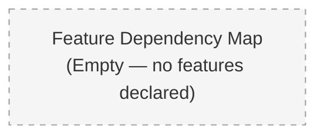

When features are introduced, this subsection will host a directed graph in which nodes represent `F-XXX` feature entries and edges represent the *Prerequisite Features* relationship defined in the schema in §2.2.2.

### 2.4.2 Integration Points

§1.2.1 establishes that **no integration artifacts — such as API specifications, service contracts, message schemas, authentication configurations, or data exchange formats — are present in the repository**. Accordingly, no integration points exist for features to share, expose, or consume. The integration surface summary is:

| Integration Surface | Documented? | Source |
|---------------------|-------------|--------|
| Inbound APIs | No | No service contracts present |
| Outbound APIs / Webhooks | No | No external dependencies declared |
| Message Bus / Event Streams | No | No schema or topology declared |
| File / Data Exchange Contracts | No | No data domains declared (§1.3.1) |

### 2.4.3 Shared Components and Common Services

§1.2.2 records that **no software components exist in the repository — there is no folder hierarchy, no modular subdivision, no service boundary definition, and no architectural decomposition recorded in any file**. The shared-components and common-services view is therefore empty:

| Asset Class | Identified Instances | Source |
|-------------|----------------------|--------|
| Shared Libraries / Modules | None | No source directories exist (§1.4.2) |
| Common Services | None | No service boundaries declared (§1.2.1) |
| Cross-Cutting Utilities | None | No source files of any kind exist (§1.4.3) |
| Configuration / Secrets Stores | None | No configuration files declared (§1.4.3) |

---

## 2.5 IMPLEMENTATION CONSIDERATIONS

The section prompt requests five categories of implementation consideration. Each is recorded below with its current status. Because no technology choices have been committed to the repository (see §1.2.2 *Core Technical Approach*), no concrete consideration can be authoritatively documented. The table format is preserved so that contributors can populate concrete values once decisions are made.

### 2.5.1 Technical Constraints

| Constraint Dimension | Status | Source |
|----------------------|--------|--------|
| Programming Language Constraints | Not defined | No source files; no language manifest (§1.2.2) |
| Framework Constraints | Not defined | No dependency declarations (§1.2.2) |
| Build & Tooling Constraints | Not defined | No build scripts, Makefile, or task runners (§1.2.2) |
| Runtime Environment Constraints | Not defined | No Dockerfile, container configs, or platform specs (§1.2.2) |

### 2.5.2 Performance Requirements

| Performance Dimension | Status | Source |
|-----------------------|--------|--------|
| Latency Targets | Not defined | No NFRs or SLOs declared (§1.2.3) |
| Throughput Targets | Not defined | No capacity targets declared |
| Resource Budgets (CPU / Memory / I/O) | Not defined | No deployment profile declared |
| Availability Targets | Not defined | No SLA artifacts present |

### 2.5.3 Scalability Considerations

| Scalability Dimension | Status | Source |
|-----------------------|--------|--------|
| Horizontal Scaling Approach | Not defined | No deployment architecture declared |
| Vertical Scaling Bounds | Not defined | No runtime environment declared (§1.2.2) |
| Data Partitioning Strategy | Not defined | No data domains declared (§1.3.1) |
| Caching Strategy | Not defined | No system components declared (§1.2.2) |

### 2.5.4 Security Implications

| Security Dimension | Status | Source |
|--------------------|--------|--------|
| Authentication Model | Not defined | No security controls declared (§1.2.2) |
| Authorization Model | Not defined | No roles, personas, or access tiers (§1.3.1) |
| Data Protection Requirements | Not defined | No data domains or schemas declared |
| Auditability and Logging | Not defined | No instrumentation declared (§1.2.3) |

### 2.5.5 Maintenance Requirements

| Maintenance Dimension | Status | Source |
|-----------------------|--------|--------|
| Ownership and CODEOWNERS | Not defined | No CODEOWNERS file present (§1.1.4) |
| Contribution Workflow | Not defined | No CONTRIBUTING.md present (§1.4.3) |
| Licensing | Not defined | No LICENSE file present (§1.4.3) |
| Versioning Strategy | Not defined | No release artifacts or tags declared |

---

## 2.6 TRACEABILITY MATRIX

### 2.6.1 Traceability Matrix Purpose

The traceability matrix correlates feature identifiers (`F-XXX`), their child requirement identifiers (`F-XXX-RQ-YYY`), and the implementation artifacts (source files, tests, or configuration) that realize each requirement. The matrix is the primary mechanism for verifying that every declared requirement has both an implementation and a verification artifact.

### 2.6.2 Current Traceability Records

Because §2.2.3 contains no feature entries and §2.3.3 contains no requirement entries, and because §1.4.2 confirms **no source or test hierarchies exist within the repository**, the matrix has zero rows.

| Feature ID | Requirement ID | Implementation Artifact | Verification Artifact |
|------------|----------------|--------------------------|-----------------------|
| — | — | — | — |

*No traceable items exist. The matrix will be populated as `F-XXX`, `F-XXX-RQ-YYY`, source files, and verification artifacts are committed to the repository.*

### 2.6.3 Coverage Summary

| Coverage Dimension | Current Value | Target |
|--------------------|---------------|--------|
| Requirements with Implementation Artifacts | 0 / 0 | 100% when populated |
| Requirements with Verification Artifacts | 0 / 0 | 100% when populated |
| Features with At Least One Child Requirement | 0 / 0 | 100% when populated |
| Orphaned Implementation Artifacts | 0 | 0 maintained |

---

## 2.7 ASSUMPTIONS, CONSTRAINTS, AND REVISION TRIGGERS

### 2.7.1 Documented Assumptions

| Assumption | Basis |
|------------|-------|
| Section 2 will be revised once concrete features are committed to the repository | Living-document posture from §1.3.3, extended to Section 2 in §2.1.3 |
| `README.md` is the sole evidentiary artifact at the time of authoring | Direct verification recorded in §1.4.1 and §1.4.2 |
| The H1 heading `# Artifact-2` constitutes a project identifier, not a product feature | Conventional interpretation of Markdown title syntax; consistent with §1.3.1 framing |
| Schema definitions in §2.2.2 and §2.3.2 will be honored when features are introduced | Published as the authoritative identifier convention for the project |

### 2.7.2 Documented Constraints

| Constraint | Basis |
|------------|-------|
| Features may not be enumerated without supporting repository artifacts | Evidence-only authoring posture from §1.1.1 |
| Requirement IDs may not be assigned without a parent feature | Composite identifier schema `F-XXX-RQ-YYY` requires a parent `F-XXX` |
| Priority and complexity classifications require a declared problem domain | §1.1.3 records that no business problem is declared |
| Acceptance criteria require a declared functional intent | §1.2.2 records that no functional features are declared |

### 2.7.3 Revision Triggers Specific to Section 2

The following triggers, when satisfied, will cause specific subsections of Section 2 to be revised. Each row maps a repository event to the subsections it activates.

| Repository Event | Subsections Activated |
|------------------|------------------------|
| Commit of a product brief, PRD, or user-story document | §2.2.3 (Feature Entries), §2.3.3 (Requirement Entries) |
| Commit of a dependency manifest (e.g., `package.json`, `requirements.txt`) | §2.5.1 (Technical Constraints), §2.4.3 (Shared Components) |
| Commit of source directories with implementation files | §2.6.2 (Traceability Matrix), §2.4.1 (Dependency Map) |
| Commit of API specifications or service contracts | §2.4.2 (Integration Points) |
| Commit of `CODEOWNERS`, `LICENSE`, or `CONTRIBUTING.md` | §2.5.5 (Maintenance Requirements) |
| Commit of test directories or verification artifacts | §2.6.2 (Traceability Matrix — Verification Artifacts column) |

### 2.7.4 Revision Activation Flow

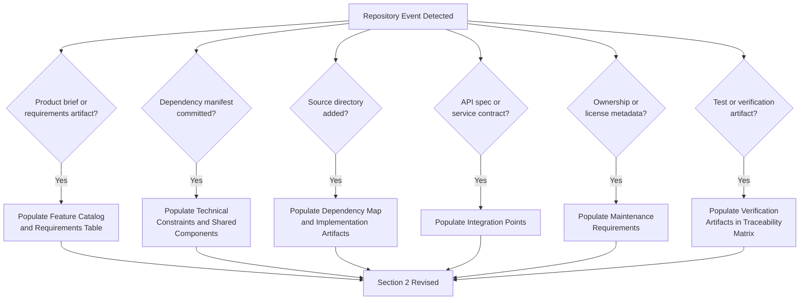

---

## 2.8 SECTION 2 VERSION AND CHANGE TRACKING

### 2.8.1 Current Version Disposition

| Attribute | Value |
|-----------|-------|
| Section Version | 1.0 (initial issue) |
| Authoring Mode | Pre-implementation, evidence-only |
| Concrete Feature Count | 0 |
| Concrete Requirement Count | 0 |
| Pending Revision Triggers | All six listed in §2.7.3 are unsatisfied |

### 2.8.2 Future Versioning Conventions

When Section 2 is revised in response to one or more of the triggers in §2.7.3, the revision should preserve this version-tracking subsection and append an entry describing the trigger that motivated the revision and the subsections that were repopulated. This convention enables downstream consumers (engineering teams, QA, compliance reviewers) to determine which parts of the section reflect committed evidence and which remain in the schema-only state.

---

## 2.9 REFERENCES

### 2.9.1 Files Examined

- `README.md` — The sole content-bearing file in the repository. Contains the single H1 heading `# Artifact-2`. This is the only evidentiary artifact considered in Section 2; its content does not declare any feature, requirement, acceptance criterion, or capability.

### 2.9.2 Folders Examined

- `/` (repository root) — Confirmed to contain exactly one child entry (`README.md`) and zero subdirectories. This finding is the basis for the empty feature catalog, empty requirements table, empty traceability matrix, and empty shared-components view in this section.

### 2.9.3 Cross-Referenced Technical Specification Sections

- **§1.1 Executive Summary** — Cited to establish the pre-implementation classification (§1.1.1, §1.1.2), the absence of a declared business problem (§1.1.3), the absence of stakeholder definitions (§1.1.4), and the absence of value-proposition statements (§1.1.5).
- **§1.2 System Overview** — Cited to establish the absence of system capabilities (§1.2.2 *Primary System Capabilities*), the absence of architectural decomposition (§1.2.2 *Major System Components*), the absence of technical-approach decisions (§1.2.2 *Core Technical Approach*), and the absence of success criteria (§1.2.3).
- **§1.3 Scope** — Cited to establish the absence of in-scope features (§1.3.1), the undefined nature of implementation boundaries (§1.3.1), and the living-document posture (§1.3.3) extended to Section 2.
- **§1.4 References** — Cited to establish the verified file and folder inventory (§1.4.1, §1.4.2) and the catalog of absent artifacts (§1.4.3) that informs every "Not defined" status throughout Section 2.

### 2.9.4 Related Process Flowcharts

- **Section 2 Lifecycle** (§2.1.4) — State diagram capturing the lifecycle of Section 2 from `Pre-Implementation` through `Maintained`.
- **Revision Activation Flow** (§2.7.4) — Flowchart mapping repository events to the subsections they activate.
- *External process flowcharts*: None present in the repository.

# 3. Technology Stack

## 3.1 SECTION POSTURE AND AUTHORING CONSTRAINTS

### 3.1.1 Repository State Recap

This section documents the technology stack of the **Artifact-2** project. As established in §1.1 (Executive Summary), §1.2 (System Overview), §1.3 (Scope), and §2.1 (Section Posture and Authoring Constraints), the repository at the time of authoring exists in a verified **pre-implementation state**. The sole evidentiary artifact in the repository is the file `README.md`, which contains exactly one line of content: the Markdown H1 heading `# Artifact-2`. No source files, dependency manifests, configuration artifacts, container definitions, infrastructure-as-code modules, build descriptors, or CI/CD configurations have been committed to the repository.

The repository's complete inventory of artifacts relevant to Section 3 is reproduced below for traceability:

| Artifact Category | Path | Status | Implication for Section 3 |
|-------------------|------|--------|---------------------------|
| README | `README.md` | Present (12 bytes; single H1 heading) | Does not declare any technology choice |
| Source Code Files | — | Absent | No language can be inferred from extensions or syntax |
| Dependency Manifests | — | Absent | No frameworks, libraries, or registry references |
| Configuration Files | — | Absent | No environment, build, or runtime configuration |
| Container Definitions | — | Absent | No `Dockerfile`, `docker-compose.yml`, or OCI artifacts |
| Infrastructure-as-Code | — | Absent | No Terraform, CloudFormation, Pulumi, or equivalent |
| CI/CD Configuration | — | Absent | No `.github/`, `.gitlab-ci.yml`, `Jenkinsfile`, or `.circleci/` |

This inventory is consistent with the absent-artifact catalog recorded in §1.4.3.

### 3.1.2 Authoring Constraints Applied to This Section

The following constraints govern the content of Section 3 and extend the evidence-only authoring posture established in §1.1.1 and reaffirmed in §2.1.2. They are applied uniformly to every subsection below:

| Constraint | Rationale |
|------------|-----------|
| No assumed programming languages | No source files or language-specific manifests exist (§1.2.2, §1.4.3) |
| No assumed framework or library selections | No dependency declarations of any kind are present (§1.2.2, §2.5.1) |
| No fabricated version numbers | No manifest, lockfile, or release artifact records any version (§1.4.3) |
| No invented third-party services or APIs | No integration artifacts, service contracts, or API specifications exist (§1.2.1, §2.4) |
| No assumed authentication, monitoring, or cloud services | No security controls or instrumentation are declared (§2.5.4) |
| No assumed database, caching, or storage technologies | No data domains, schemas, or persistence configurations exist (§1.3.1, §2.5.3) |
| No assumed containerization or orchestration platform | No `Dockerfile`, compose file, or Kubernetes manifests exist (§1.2.2) |
| No assumed CI/CD platform or pipeline configuration | No workflow definitions are committed (§1.4.3) |
| No assumed infrastructure-as-code tooling | No Terraform, CloudFormation, or Pulumi modules exist (§1.4.3) |

### 3.1.3 Treatment of the Section Prompt's Default Technology Stack

The section prompt provides a **Default Technology Stack** template enumerating candidate technologies across infrastructure, backend, frontend, and native application tiers. Under the evidence-only authoring posture established in §1.1.1, §2.1.2, and reaffirmed in §3.1.2, this template **cannot be adopted as the project's actual technology stack** because no artifact in the repository declares, references, or implies any of the listed technologies.

The Default Technology Stack is therefore preserved in this document strictly as a **non-binding candidate template** that contributors may consult as a starting reference when making future technology decisions. Each subsection below records the candidate defaults applicable to its category and explicitly marks the project's current selection as **Not defined**. The distinction between "candidate default" and "selected technology" must be preserved across all future revisions of this section until a corresponding repository artifact (e.g., a committed dependency manifest, a `Dockerfile`, a CI workflow) provides authoritative evidence of selection.

### 3.1.4 Living-Document Disposition

Consistent with the documentation maintenance posture declared in §1.3.3 and extended to Section 2 in §2.1.3, **Section 3 is established as a living document**. Each subsection below preserves the structural schema requested in the section prompt so that future revisions can populate concrete entries without re-architecting the section. The technology-stack-specific revision triggers are enumerated in §3.9.

### 3.1.5 Technology Stack Lifecycle

The diagram below records the lifecycle states of Section 3 with respect to repository content. The current state is `Pre-Implementation`.

```mermaid
stateDiagram-v2
    [*] --> PreImpl
    PreImpl: Pre-Implementation<br/>(Current State)
    PartialStack: Partial Stack Declared<br/>(Future State)
    StackSelected: Stack Selected<br/>(Future State)
    Maintained: Maintained<br/>(Steady State)

    PreImpl --> PartialStack: First dependency manifest<br/>or runtime artifact committed
    PartialStack --> StackSelected: Complete stack declared<br/>across all applicable tiers
    StackSelected --> Maintained: Stack stabilizes;<br/>version pinning established
    Maintained --> PartialStack: Major dependency upgrade<br/>or technology swap

    note right of PreImpl
        Sole artifact: README.md
        Languages declared: 0
        Frameworks declared: 0
        Dependencies declared: 0
        Services declared: 0
        Storage systems declared: 0
        Build/Deploy tools declared: 0
    end note
```

---

## 3.2 PROGRAMMING LANGUAGES

### 3.2.1 Languages by Platform/Component

No platform or component decomposition has been declared for the Artifact-2 project. As recorded in §1.2.2 (*Major System Components*), the repository contains no folder hierarchy, no modular subdivision, no service boundary definition, and no architectural decomposition. Consequently, the conventional axis of "language by platform/component" cannot be populated with evidentiary entries.

The schema below preserves the requested categorization so that future revisions may populate language selections per platform tier:

| Platform / Component Tier | Selected Language | Version | Source Evidence |
|---------------------------|-------------------|---------|-----------------|
| Backend Services | Not defined | — | No source files; no language manifest (§1.2.2, §1.4.3) |
| Web Frontend | Not defined | — | No source files; no language manifest (§1.2.2, §1.4.3) |
| Mobile / Cross-platform Frontend | Not defined | — | No source files; no language manifest (§1.2.2, §1.4.3) |
| Native iOS Application | Not defined | — | No source files; no language manifest (§1.2.2, §1.4.3) |
| Native Android Application | Not defined | — | No source files; no language manifest (§1.2.2, §1.4.3) |
| macOS / Desktop Application | Not defined | — | No source files; no language manifest (§1.2.2, §1.4.3) |
| Infrastructure / Tooling Scripts | Not defined | — | No build scripts, Makefile, or task runners (§1.2.2) |

### 3.2.2 Selection Criteria and Justification Framework

No language selection criteria have been recorded for the project. Contributors introducing language choices in future revisions are expected to document the rationale against the dimensions below:

| Selection Dimension | Current Value | Notes for Future Population |
|---------------------|---------------|------------------------------|
| Performance Requirements | Not defined | Cross-reference §2.5.2 once performance targets are declared |
| Ecosystem and Library Availability | Not defined | Will be tied to framework selection in §3.3 |
| Team Familiarity and Hiring Considerations | Not defined | Cross-reference §2.5.5 once ownership metadata is committed |
| Security Posture | Not defined | Cross-reference §2.5.4 once security model is declared |
| Tooling and Static Analysis Maturity | Not defined | Will inform §3.7 development tooling selection |
| Long-Term Support and Community Health | Not defined | Will inform version-pinning strategy |

### 3.2.3 Current Language Inventory

The current inventory of programming languages declared in the Artifact-2 repository is the empty set:

| Metric | Value |
|--------|-------|
| Distinct Languages Declared | 0 |
| Source Files Present | 0 |
| Language-Specific Manifests Present | 0 |

### 3.2.4 Candidate Default (Non-Binding)

The section prompt's Default Technology Stack enumerates the following candidate languages by tier. These are recorded here strictly as a **non-binding reference template** per §3.1.3 and **must not be interpreted as the project's selected languages**:

| Tier (per Default Template) | Candidate Language | Adoption Status |
|------------------------------|--------------------|------------------|
| Backend Primary | Python | Not adopted; no repository evidence |
| Web Frontend | TypeScript (with React) | Not adopted; no repository evidence |
| Mobile Cross-Platform | TypeScript (with React Native) | Not adopted; no repository evidence |
| Native iOS | Swift | Not adopted; no repository evidence |
| Native Android | Kotlin | Not adopted; no repository evidence |
| macOS | Objective-C | Not adopted; no repository evidence |
| Desktop | JavaScript / TypeScript (with ElectronJS) | Not adopted; no repository evidence |

### 3.2.5 Constraints and Dependencies

No language constraints or interlanguage dependencies have been declared for the project. This subsection will be populated when language choices are committed to the repository. Cross-reference §2.5.1 (*Technical Constraints* — *Programming Language Constraints*), which independently records this dimension as "Not defined."

---

## 3.3 FRAMEWORKS & LIBRARIES

### 3.3.1 Core Frameworks

No core frameworks have been declared in the Artifact-2 repository. The schema below preserves the categorical tiers requested in the section prompt:

| Framework Category | Selected Framework | Version | Source Evidence |
|--------------------|--------------------|---------|-----------------|
| Backend Web / Application Framework | Not defined | — | No dependency manifest (§1.4.3) |
| Frontend Web Framework | Not defined | — | No dependency manifest (§1.4.3) |
| Mobile / Cross-Platform Framework | Not defined | — | No dependency manifest (§1.4.3) |
| Native Application Framework(s) | Not defined | — | No project files for any native platform (§1.4.3) |
| AI / ML Framework (if applicable) | Not defined | — | No dependency manifest (§1.4.3) |
| Testing Framework | Not defined | — | No test directories or verification artifacts (§2.7.3) |

### 3.3.2 Supporting Libraries

No supporting libraries have been declared in the Artifact-2 repository. The schema below preserves the conventional categories so that future revisions may populate selected libraries:

| Supporting Library Category | Selected Library | Version | Source Evidence |
|------------------------------|------------------|---------|-----------------|
| HTTP Client | Not defined | — | No dependency manifest |
| Serialization / Validation | Not defined | — | No dependency manifest |
| Logging | Not defined | — | No instrumentation declared (§2.5.4) |
| State Management (Frontend) | Not defined | — | No frontend source files |
| Styling / CSS Framework | Not defined | — | No frontend source files |
| ORM / Data Access | Not defined | — | No data domains declared (§1.3.1) |
| Authentication Client Library | Not defined | — | No authentication model declared (§2.5.4) |
| Telemetry / Instrumentation | Not defined | — | No KPIs or instrumentation declared (§1.2.3) |

### 3.3.3 Compatibility Requirements

No compatibility requirements have been declared. Cross-reference §2.5.1 (*Framework Constraints* — "Not defined") and §2.5.3 (*Scalability Considerations* — all dimensions "Not defined").

| Compatibility Dimension | Status |
|-------------------------|--------|
| Language Runtime Compatibility | Not defined |
| Browser Support Matrix (Frontend) | Not defined |
| Mobile OS Version Matrix | Not defined |
| Database Engine Compatibility | Not defined |
| Inter-framework Version Pinning Strategy | Not defined |

### 3.3.4 Candidate Defaults (Non-Binding)

The section prompt's Default Technology Stack enumerates the following candidate frameworks. These are recorded here strictly as a **non-binding reference template** per §3.1.3:

| Tier (per Default Template) | Candidate Framework | Adoption Status |
|------------------------------|---------------------|------------------|
| Backend Application Framework | Flask | Not adopted; no repository evidence |
| AI Framework | Langchain | Not adopted; no repository evidence |
| Web Frontend Framework | React | Not adopted; no repository evidence |
| CSS Framework | TailwindCSS | Not adopted; no repository evidence |
| Mobile / Cross-Platform Framework | React Native | Not adopted; no repository evidence |
| Desktop Framework | ElectronJS | Not adopted; no repository evidence |

### 3.3.5 Justification Framework

No major framework choices have been made; therefore no justifications can be authored from repository evidence. Contributors introducing framework selections in future revisions are expected to record their justifications against the dimensions enumerated in §3.2.2.

---

## 3.4 OPEN SOURCE DEPENDENCIES

### 3.4.1 Dependency Manifest Status

No dependency manifests of any kind exist in the Artifact-2 repository. The exhaustive verification recorded in §1.4.3 confirms the absence of every manifest category that would conventionally declare open-source dependencies:

| Manifest File | Ecosystem | Status |
|---------------|-----------|--------|
| `package.json` | npm / Node.js | Absent |
| `package-lock.json` / `yarn.lock` / `pnpm-lock.yaml` | npm / Node.js (lockfiles) | Absent |
| `requirements.txt` | Python (pip) | Absent |
| `pyproject.toml` | Python (PEP 621 / Poetry / Hatch) | Absent |
| `Pipfile` / `Pipfile.lock` | Python (Pipenv) | Absent |
| `pom.xml` | Java (Maven) | Absent |
| `build.gradle` / `build.gradle.kts` | Java / Kotlin (Gradle) | Absent |
| `Cargo.toml` / `Cargo.lock` | Rust | Absent |
| `go.mod` / `go.sum` | Go | Absent |
| `Gemfile` / `Gemfile.lock` | Ruby | Absent |
| `composer.json` | PHP | Absent |
| `Podfile` / `Package.swift` | iOS / Swift | Absent |
| `*.csproj` / `packages.config` | .NET | Absent |

### 3.4.2 Current Open-Source Dependency Inventory

The current inventory of open-source dependencies declared in the Artifact-2 repository is the empty set:

| Metric | Value |
|--------|-------|
| Distinct Direct Dependencies | 0 |
| Distinct Transitive Dependencies | 0 |
| Distinct Registries Referenced | 0 |
| Pinned Versions Recorded | 0 |
| License Declarations | 0 |

### 3.4.3 Registry and Versioning Conventions

No package registries are referenced by any artifact in the repository, and no versioning convention has been adopted. Contributors introducing dependencies in future revisions are expected to record the following metadata for each entry:

| Field | Description |
|-------|-------------|
| Package Name | Canonical identifier as registered in the source registry |
| Registry | Authoritative registry URL (e.g., npmjs.com, pypi.org, mavencentral) |
| Declared Version | Exact version or version range as committed to the manifest |
| Resolved Version | Version recorded in the lockfile (if a lockfile is present) |
| License | SPDX identifier of the license under which the dependency is distributed |
| Dependency Scope | Production / Development / Optional / Peer |
| Justification | Reason for inclusion, mapped to a Section 2 requirement when available |

### 3.4.4 Supply Chain and Security Considerations

No supply-chain controls have been declared for the project. The following dimensions are reserved for future population:

| Control Dimension | Status | Source |
|-------------------|--------|--------|
| Vulnerability Scanning | Not defined | No CI/CD configuration (§3.7.4) |
| Dependency Pinning Strategy | Not defined | No lockfile present (§3.4.1) |
| Allowed-License Policy | Not defined | No `LICENSE` file present (§1.4.3) |
| SBOM Generation | Not defined | No build pipeline (§3.7.2) |
| Update Cadence and Renovation Policy | Not defined | No automation configuration |

---

## 3.5 THIRD-PARTY SERVICES

### 3.5.1 External API and Integration Inventory

As established in §1.2.1 (*Integration with Existing Enterprise Landscape*) and reaffirmed in §2.4 (*Feature Relationships*), no integration artifacts — such as API specifications, service contracts, message schemas, authentication configurations, or data exchange formats — are present in the repository. The inventory of external APIs and integrations is therefore empty:

| External Integration | Purpose | Protocol | Endpoint Reference | Status |
|----------------------|---------|----------|--------------------|--------|
| — | — | — | — | No entries; integration surface undefined |

### 3.5.2 Authentication Services

No authentication services have been declared for Artifact-2. Cross-reference §2.5.4 (*Security Implications* — *Authentication Model* — "Not defined").

| Authentication Concern | Selected Service | Status | Source |
|------------------------|------------------|--------|--------|
| Identity Provider | Not defined | — | No security controls declared (§2.5.4) |
| Single Sign-On (SSO) Protocol | Not defined | — | No protocols declared |
| Federation / Social Login | Not defined | — | No identity configuration |
| Token Format / Issuance | Not defined | — | No token schemas declared |
| Session Management | Not defined | — | No runtime configuration |

The section prompt's Default Technology Stack lists **Auth0** as a candidate identity provider. Per §3.1.3, this is a non-binding reference only and is not adopted as the project's authentication service.

### 3.5.3 Monitoring and Observability Services

No monitoring or observability tools have been declared. Cross-reference §1.2.3 (*Key Performance Indicators* — "Not defined") and §2.5.4 (*Auditability and Logging* — "Not defined").

| Observability Pillar | Selected Service | Status |
|----------------------|------------------|--------|
| Metrics | Not defined | No instrumentation declared |
| Distributed Tracing | Not defined | No tracing configuration |
| Centralized Logging | Not defined | No logging configuration (§2.5.4) |
| Error Tracking | Not defined | No error-reporting integration |
| Real-User Monitoring (RUM) | Not defined | No frontend instrumentation |
| Synthetic Monitoring / Uptime | Not defined | No availability targets (§2.5.2) |
| Alerting | Not defined | No SLA artifacts (§2.5.2) |

### 3.5.4 Cloud Services

No cloud platform or hosted-service dependencies have been declared. As recorded in §1.2.2 (*Core Technical Approach* — *Runtime Environment*), no runtime environment is declared in the repository.

| Cloud Service Category | Selected Service | Status |
|------------------------|------------------|--------|
| Compute (VMs / Containers / Functions) | Not defined | No deployment architecture (§2.5.3) |
| Managed Database | Not defined | No data domains (§1.3.1) |
| Object Storage | Not defined | No persistence requirements |
| Content Delivery Network (CDN) | Not defined | No frontend deployment configuration |
| Message Queue / Streaming | Not defined | No integration points (§2.4) |
| Secrets Management | Not defined | No configuration files (§1.4.3) |
| DNS and Edge Routing | Not defined | No deployment topology |
| Email / Notification Services | Not defined | No integration points (§2.4) |

The section prompt's Default Technology Stack lists **AWS** as the candidate cloud platform. Per §3.1.3, this is a non-binding reference only and is not adopted as the project's cloud provider.

### 3.5.5 Integration Requirements Schema

When external services are introduced in future revisions, each entry must be recorded against the following schema to enable cross-referencing with §2.4 (*Feature Relationships*):

| Field | Description |
|-------|-------------|
| Service Name | Vendor and product identifier |
| Service Category | Authentication / Monitoring / Cloud / API / Other |
| Protocol(s) | REST / gRPC / GraphQL / Webhook / SDK / Other |
| Authentication Mechanism | API key / OAuth / mTLS / Other |
| Data Classification | Sensitivity tier of data exchanged |
| Failure Mode | Behavior when service is unreachable |
| SLA / SLO Reference | Cross-reference to §2.5.2 once performance targets are declared |
| Cost / Quota Profile | Billing and rate-limit considerations |

---

## 3.6 DATABASES & STORAGE

### 3.6.1 Primary and Secondary Databases

No databases — primary, secondary, analytical, or otherwise — have been declared in the Artifact-2 repository. As recorded in §1.3.1 (*Implementation Boundaries* — *Data Domains Included* — "Undefined") and §2.5.3 (*Scalability Considerations* — *Data Partitioning Strategy* — "Not defined"), the data domains and persistence requirements of the project remain undefined.

| Database Role | Selected Engine | Version | Hosting Model | Source Evidence |
|---------------|------------------|---------|---------------|-----------------|
| Primary Operational Store | Not defined | — | — | No data domains declared (§1.3.1) |
| Secondary / Replica Store | Not defined | — | — | No data domains declared (§1.3.1) |
| Analytical / Reporting Store | Not defined | — | — | No reporting requirements declared |
| Search Index | Not defined | — | — | No search requirements declared |
| Time-Series / Telemetry Store | Not defined | — | — | No metrics declared (§3.5.3) |
| Graph Store (if applicable) | Not defined | — | — | No graph data model declared |

The section prompt's Default Technology Stack lists **MongoDB** as a candidate database engine. Per §3.1.3, this is a non-binding reference only and is not adopted as the project's primary or secondary database.

### 3.6.2 Data Persistence Strategies

No data persistence strategies have been declared. The schema below preserves the conventional dimensions of a persistence strategy:

| Persistence Concern | Strategy | Status |
|---------------------|----------|--------|
| Schema Management / Migrations | Not defined | No schema artifacts present |
| Transaction Boundaries | Not defined | No service boundaries declared (§1.2.2) |
| Consistency Model (Strong / Eventual) | Not defined | No data domains declared (§1.3.1) |
| Backup and Restore Policy | Not defined | No operational artifacts present |
| Retention and Archival Policy | Not defined | No compliance obligations declared |
| Encryption at Rest | Not defined | No data protection requirements (§2.5.4) |
| Encryption in Transit | Not defined | No security controls declared (§2.5.4) |

### 3.6.3 Caching Solutions

No caching layers have been declared. Cross-reference §2.5.3 (*Scalability Considerations* — *Caching Strategy* — "Not defined").

| Cache Tier | Selected Technology | Purpose | Status |
|------------|---------------------|---------|--------|
| Application In-Process Cache | Not defined | — | No application code present |
| Distributed Cache | Not defined | — | No deployment architecture declared |
| HTTP / Edge Cache | Not defined | — | No CDN configuration (§3.5.4) |
| Database Query Cache | Not defined | — | No database engine selected (§3.6.1) |

### 3.6.4 Storage Services

No storage services have been declared. The schema below preserves the conventional categories:

| Storage Category | Selected Service | Purpose | Status |
|------------------|------------------|---------|--------|
| Object Storage (Blob / File) | Not defined | — | No persistence requirements |
| Block Storage | Not defined | — | No deployment architecture |
| File Storage / Shared Filesystem | Not defined | — | No deployment architecture |
| Archival / Cold Storage | Not defined | — | No retention policy declared |
| Secrets / Credential Storage | Not defined | — | No security model (§2.5.4) |

### 3.6.5 Data Flow Considerations

No data flows have been declared. Because §2.4 (*Feature Relationships*) records no integration points or shared components, no data-flow diagrams can be authoritatively constructed at this time. This subsection will be revised in concert with §2.4.1 (*Dependency Map*) when source directories with implementation files are committed (see §2.7.3 revision triggers, carried forward to §3.9).

---

## 3.7 DEVELOPMENT & DEPLOYMENT

### 3.7.1 Development Tools

No development tooling has been declared in the Artifact-2 repository. The schema below preserves the conventional categories:

| Tooling Category | Selected Tool | Version | Status |
|------------------|---------------|---------|--------|
| Editor / IDE Configuration | Not defined | — | No editor configs (e.g., `.editorconfig`, `.vscode/`, `.idea/`) present |
| Linter | Not defined | — | No linter configuration present |
| Formatter | Not defined | — | No formatter configuration present |
| Pre-commit Hooks | Not defined | — | No `.pre-commit-config.yaml` or `husky` configuration |
| Type Checker | Not defined | — | No language selected (§3.2) |
| Local Development Orchestration | Not defined | — | No `docker-compose.yml` or equivalent present |
| Package / Dependency Manager | Not defined | — | No dependency manifest (§3.4.1) |
| Documentation Generator | Not defined | — | No documentation source files |

### 3.7.2 Build System

No build system has been declared. Cross-reference §1.2.2 (*Core Technical Approach* — *Build & Tooling* — "No") and §2.5.1 (*Technical Constraints* — *Build & Tooling Constraints* — "Not defined").

| Build Concern | Selected Tool | Status |
|---------------|---------------|--------|
| Build Orchestrator (e.g., `Makefile`, `Bazel`, `Gradle`) | Not defined | No build descriptors present |
| Bundler / Transpiler (Frontend) | Not defined | No frontend source files |
| Artifact Registry | Not defined | No release artifacts declared |
| Reproducible-Build Strategy | Not defined | No build configuration |
| Build Caching | Not defined | No build configuration |

### 3.7.3 Containerization

No containerization artifacts exist in the Artifact-2 repository. The exhaustive verification recorded in §1.4.3 confirms the absence of `Dockerfile`, `docker-compose.yml`, and equivalent OCI-related files.

| Containerization Concern | Selected Tool | Version | Status |
|--------------------------|---------------|---------|--------|
| Container Image Builder | Not defined | — | No `Dockerfile` present |
| Base Image Strategy | Not defined | — | No runtime declared (§1.2.2) |
| Multi-Stage Build Strategy | Not defined | — | No build configuration |
| Image Registry | Not defined | — | No registry configuration |
| Container Orchestration (e.g., Kubernetes, ECS) | Not defined | — | No orchestration manifests |
| Service Mesh | Not defined | — | No service boundaries declared (§1.2.2) |

The section prompt's Default Technology Stack lists **Docker** as a candidate containerization tool. Per §3.1.3, this is a non-binding reference only and is not adopted as the project's containerization standard.

### 3.7.4 CI/CD Pipeline

No CI/CD configuration exists in the Artifact-2 repository. The exhaustive verification recorded in §1.4.3 confirms the absence of `.github/`, `.gitlab-ci.yml`, `Jenkinsfile`, `.circleci/`, and all other recognized pipeline definitions.

| CI/CD Concern | Selected Platform / Tool | Status |
|---------------|--------------------------|--------|
| CI Platform | Not defined | No workflow definitions |
| Pipeline-as-Code Format | Not defined | No workflow definitions |
| Triggering Events | Not defined | No workflow definitions |
| Test Execution Strategy | Not defined | No test directories (§2.7.3) |
| Static Analysis Gates | Not defined | No linter or scanner configuration |
| Security Scanning Gates | Not defined | No security policy declared (§2.5.4) |
| Artifact Publication | Not defined | No artifact registry declared |
| Deployment Strategy (Blue/Green, Canary, etc.) | Not defined | No deployment topology |
| Environment Promotion Flow | Not defined | No environment declarations |
| Rollback Strategy | Not defined | No deployment configuration |

The section prompt's Default Technology Stack lists **GitHub Actions** as a candidate CI/CD platform. Per §3.1.3, this is a non-binding reference only and is not adopted as the project's CI/CD platform.

### 3.7.5 Infrastructure as Code

No infrastructure-as-code artifacts exist in the Artifact-2 repository. The exhaustive verification recorded in §1.4.3 confirms the absence of Terraform, CloudFormation, Pulumi, Ansible, and equivalent IaC files.

| IaC Concern | Selected Tool | Status |
|-------------|---------------|--------|
| IaC Framework | Not defined | No IaC files present |
| State Management | Not defined | No backend configuration |
| Module Organization | Not defined | No modules present |
| Environment Layering | Not defined | No environment declarations |
| Policy-as-Code | Not defined | No policy artifacts |

The section prompt's Default Technology Stack lists **Terraform** as a candidate IaC tool. Per §3.1.3, this is a non-binding reference only and is not adopted as the project's IaC framework.

---

## 3.8 TECHNOLOGY STACK DEPENDENCY GRAPH

Because no technologies, frameworks, libraries, services, or storage systems have been declared in the repository, the technology-stack dependency graph for Artifact-2 is presently empty. The placeholder diagram below records this empty state explicitly and serves as a structural anchor for future revisions:

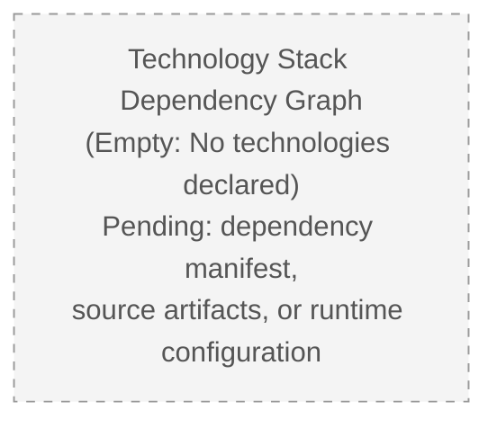

When the repository transitions out of its pre-implementation state, this diagram will be replaced with a populated dependency graph that records:

- Language → Runtime edges
- Framework → Library edges
- Application → Database / Cache / Storage edges
- Application → External Service edges
- Build → CI/CD → Deployment edges
- IaC → Cloud Resource edges

---

## 3.9 REVISION TRIGGERS FOR SECTION 3

Consistent with §2.7.3, this subsection enumerates the repository events that, when satisfied, will cause specific subsections of Section 3 to be revised. Each row maps a repository event to the subsections it activates.

| Repository Event | Subsections Activated |
|------------------|------------------------|
| Commit of source files in any language | §3.2 (Programming Languages), §3.8 (Technology Stack Dependency Graph) |
| Commit of a dependency manifest (`package.json`, `requirements.txt`, `pom.xml`, `Cargo.toml`, `go.mod`, `pyproject.toml`, etc.) | §3.3 (Frameworks & Libraries), §3.4 (Open Source Dependencies), §3.8 (Technology Stack Dependency Graph) |
| Commit of a lockfile (`package-lock.json`, `yarn.lock`, `Pipfile.lock`, `go.sum`, etc.) | §3.4.2 (Open-Source Dependency Inventory), §3.4.4 (Supply Chain Considerations) |
| Commit of API specifications or service contracts (OpenAPI, gRPC `.proto`, GraphQL SDL) | §3.5.1 (External API Inventory), §3.5.5 (Integration Requirements Schema) |
| Commit of authentication configuration (OIDC client, OAuth secrets schema, SSO metadata) | §3.5.2 (Authentication Services) |
| Commit of monitoring or observability configuration (Prometheus, OpenTelemetry, log shipper) | §3.5.3 (Monitoring and Observability Services) |
| Commit of database schema, migration, or connection configuration | §3.6.1 (Primary and Secondary Databases), §3.6.2 (Data Persistence Strategies) |
| Commit of caching configuration (Redis, Memcached client config, CDN rules) | §3.6.3 (Caching Solutions) |
| Commit of object/file storage configuration | §3.6.4 (Storage Services) |
| Commit of `Dockerfile`, `docker-compose.yml`, or Kubernetes manifests | §3.7.3 (Containerization), §3.5.4 (Cloud Services) |
| Commit of CI/CD configuration (`.github/workflows/`, `.gitlab-ci.yml`, `Jenkinsfile`) | §3.7.4 (CI/CD Pipeline) |
| Commit of IaC modules (Terraform, CloudFormation, Pulumi, Ansible) | §3.7.5 (Infrastructure as Code), §3.5.4 (Cloud Services) |
| Commit of editor/linter/formatter configuration | §3.7.1 (Development Tools) |
| Commit of build descriptors (`Makefile`, `Bazel`, `gradle`, `webpack.config.js`) | §3.7.2 (Build System) |

### 3.9.1 Revision Activation Flow

The flowchart below records how repository events drive revisions to Section 3. It is structurally parallel to §2.7.4 and applies the same activation pattern to technology-stack subsections.

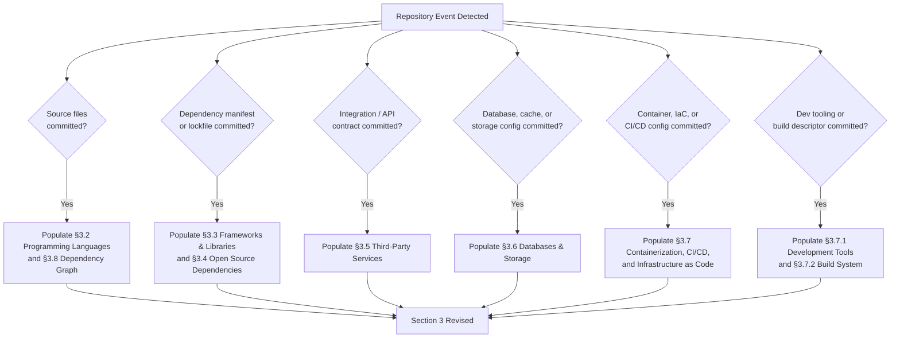

---

## 3.10 REFERENCES

### 3.10.1 Files Examined

- `README.md` — The sole content-bearing file in the repository; contains exactly one line consisting of the H1 Markdown heading `# Artifact-2`. This file declares no technology choice and is the basis for the determination that the repository is in a pre-implementation state.

### 3.10.2 Folders Examined

- `/` (repository root) — Confirmed to contain exactly one child entry (`README.md`) and zero subdirectories. This finding establishes that no source, configuration, build, deployment, test, or infrastructure hierarchies exist within the repository.

### 3.10.3 Absent Artifacts Reaffirmed for Section 3

The following categories of artifacts were systematically verified to be absent from the repository and directly inform the "Not defined" entries throughout Section 3. This list extends and reaffirms the catalog recorded in §1.4.3:

| Category | Examples Verified Absent |
|----------|--------------------------|
| Dependency Manifests | `package.json`, `requirements.txt`, `pom.xml`, `Cargo.toml`, `go.mod`, `pyproject.toml`, `Gemfile`, `composer.json`, `Podfile`, `Package.swift`, `*.csproj` |
| Lockfiles | `package-lock.json`, `yarn.lock`, `pnpm-lock.yaml`, `Pipfile.lock`, `poetry.lock`, `Cargo.lock`, `go.sum`, `Gemfile.lock` |
| Source Code Files | Files with extensions `.py`, `.js`, `.ts`, `.tsx`, `.jsx`, `.java`, `.kt`, `.swift`, `.m`, `.go`, `.rs`, `.rb`, `.c`, `.cpp`, `.cs`, `.php` |
| Container Artifacts | `Dockerfile`, `docker-compose.yml`, `.dockerignore`, OCI image specs |
| Infrastructure-as-Code | Terraform (`*.tf`), CloudFormation (`*.yaml`/`*.json` templates), Pulumi (`Pulumi.yaml`), Ansible playbooks |
| CI/CD Configuration | `.github/workflows/`, `.gitlab-ci.yml`, `Jenkinsfile`, `.circleci/`, `azure-pipelines.yml`, `bitbucket-pipelines.yml` |
| Runtime / Environment Configuration | `.env`, `config.yaml`, `settings.json`, `application.properties`, `appsettings.json` |
| Build Descriptors | `Makefile`, `Bazel BUILD`, `webpack.config.js`, `vite.config.ts`, `rollup.config.js`, `gulpfile.js` |
| Editor / Tooling Configuration | `.editorconfig`, `.vscode/`, `.idea/`, `.eslintrc`, `.prettierrc`, `.flake8`, `pyproject.toml [tool.*]` sections |
| Project Metadata | `LICENSE`, `CONTRIBUTING.md`, `CODE_OF_CONDUCT.md`, `CODEOWNERS`, `.gitignore`, `SECURITY.md` |

### 3.10.4 Cross-Referenced Specification Sections

The following sections of this Technical Specification were consulted to ground the constraints, "Not defined" determinations, and revision triggers recorded in Section 3:

| Section | Relevance to Section 3 |
|---------|------------------------|
| §1.1 (Executive Summary) | Establishes the verified pre-implementation state of the repository (§1.1.1, §1.1.2) |
| §1.2 (System Overview) | Records that programming language, framework, build/tooling, and runtime environment are all undocumented (§1.2.2, *Core Technical Approach*) |
| §1.3 (Scope) | Records that data domains, system boundaries, and user groups are undefined (§1.3.1); establishes living-document maintenance posture (§1.3.3) |
| §1.4 (References) | Provides the absent-artifact catalog (§1.4.3) that underpins the "Not defined" entries throughout Section 3 |
| §2.1 (Section Posture and Authoring Constraints) | Establishes the evidence-only authoring posture and prohibits assumed technology stack, framework, or runtime (§2.1.2) |
| §2.4 (Feature Relationships) | Records that no integration points, shared components, or common services exist — directly supports §3.5 entries |
| §2.5 (Implementation Considerations) | Independently records "Not defined" status for Technical Constraints (§2.5.1), Performance Requirements (§2.5.2), Scalability Considerations (§2.5.3), Security Implications (§2.5.4), and Maintenance Requirements (§2.5.5) |
| §2.7 (Assumptions, Constraints, and Revision Triggers) | Defines the revision-trigger pattern (§2.7.3, §2.7.4) that §3.9 extends to technology-stack-specific events |

# 4. Process Flowchart

## 4.1 Section Posture and Authoring Constraints

### 4.1.1 Repository State Recap

This section documents the process flowcharts, system workflows, and state transition diagrams of the **Artifact-2** project. As established in §1.1 (Executive Summary), §1.2 (System Overview), §1.3 (Scope), §2.1 (Section Posture and Authoring Constraints), and §3.1 (Section Posture and Authoring Constraints), the repository at the time of authoring exists in a verified **pre-implementation state**. The sole evidentiary artifact in the repository is the file `README.md`, which contains exactly one line of content: the Markdown H1 heading `# Artifact-2`. No source files, dependency manifests, configuration artifacts, API specifications, state-machine definitions, message-queue schemas, middleware implementations, business-logic modules, or workflow orchestration definitions have been committed to the repository.

Consequently, Section 4 cannot enumerate concrete user journeys, system interactions, decision points, error-handling paths, integration sequences, state transitions, or SLA targets grounded in repository evidence. Instead, it establishes the **authoritative schema and structural conventions** that will be applied when workflows, processes, and state machines are introduced, and it records the **current population status** (zero entries) for each requested category. The repository's complete inventory of artifacts relevant to Section 4 is reproduced below for traceability:

| Artifact Category | Path | Status | Implication for Section 4 |
|-------------------|------|--------|---------------------------|
| README | `README.md` | Present (12 bytes; single H1 heading) | Declares no workflow, process, or state |
| Business Logic Source | — | Absent | No end-to-end user journeys derivable |
| API / Service Contracts | — | Absent | No integration sequence diagrams derivable |
| State Machine Definitions | — | Absent | No state transition diagrams derivable |
| Error Handling Middleware | — | Absent | No error-handling flowcharts derivable |
| Message Queue / Event Bus Config | — | Absent | No event processing flows derivable |
| Workflow Orchestration | — | Absent | No batch processing sequences derivable |
| CI/CD Configuration | — | Absent | No automated process sequences derivable |

This inventory is consistent with the absent-artifact catalog recorded in §1.4.3 and reaffirmed in §3.10.3.

### 4.1.2 Authoring Constraints Applied to This Section

The following constraints govern the content of Section 4 and extend the evidence-only authoring posture established in §1.1.1, reaffirmed in §2.1.2, and further extended in §3.1.2. They are applied uniformly to every subsection below:

| Constraint | Rationale |
|------------|-----------|
| No fabricated user journeys or end-to-end workflows | No business problem is declared (§1.1.3); no user personas or stakeholders exist (§1.1.4) |
| No assumed system interactions between components | No system components exist (§1.2.2, *Major System Components*) |
| No invented decision points or business rules | Business Rules status is "No" (§2.3.4); no functional requirements declared (§2.3.3) |
| No manufactured error-handling paths | No source code or middleware exists (§1.4.3); no error-handling artifacts present |
| No assumed integration sequences or API call patterns | No API specifications, service contracts, or message schemas are present (§1.2.1, §2.4.2, §3.5.1) |
| No fabricated state machines or entity lifecycles | No state machine definitions, no source code declaring states or transitions (§1.4.3) |
| No invented SLA, latency, or throughput targets | All performance dimensions recorded as "Not defined" (§2.5.2) |
| No assumed authorization checkpoints | Authentication Model and Authorization Model recorded as "Not defined" (§2.5.4) |
| No manufactured retry, fallback, or recovery procedures | No resilience patterns declared; no Failure Mode declarations exist (§3.5.5) |
| No assumed data persistence or transaction boundaries | Transaction Boundaries, Consistency Model, and Backup Policy recorded as "Not defined" (§3.6.2) |
| No assumed caching requirements at any tier | All cache tiers recorded as "Not defined" (§3.6.3); Caching Strategy "Not defined" (§2.5.3) |
| No invented regulatory compliance checks | Compliance Requirements status is "No" (§2.3.4) |

These constraints are direct extensions of the authoring posture chain established across §1.1.1, §2.1.2, and §3.1.2.

### 4.1.3 Treatment of the Section Prompt's Default Workflow Templates

The Section 4 prompt enumerates conventional workflow patterns that typically appear in enterprise process documentation, including: swim-lane decompositions across actors and systems, decision diamonds for business-rule branching, retry mechanisms with exponential backoff, fallback processes for graceful degradation, error notification flows, recovery procedures, state-transition diagrams with persistence checkpoints, and batch processing sequences with timing constraints.

Under the evidence-only authoring posture established in §1.1.1, §2.1.2, and §3.1.2 — and consistent with the treatment of the Default Technology Stack template in §3.1.3 — these prompt-supplied workflow patterns **cannot be adopted as the project's actual workflows** because no artifact in the repository declares, references, or implies any business process, user journey, system interaction, or state machine.

The conventional workflow patterns enumerated above are therefore preserved in this document strictly as **non-binding reference templates** that contributors may consult as a starting point when authoring concrete workflows in future revisions. Each subsection below records the conventional categories applicable to its scope and explicitly marks the project's current entries as **Not defined**. The distinction between "candidate reference pattern" and "selected workflow" must be preserved across all future revisions of Section 4 until a corresponding repository artifact (e.g., a committed business-logic module, an API specification, a state-machine definition file, a CI/CD workflow file) provides authoritative evidence of an actual project workflow.

### 4.1.4 Living-Document Disposition

Consistent with the documentation maintenance posture declared in §1.3.3, extended to Section 2 in §2.1.3, and to Section 3 in §3.1.4, **Section 4 is established as a living document**. Each subsection below preserves the structural schema requested in the section prompt so that future revisions can populate concrete entries without re-architecting the section. The workflow-specific revision triggers are enumerated in §4.6.

### 4.1.5 Section 4 Lifecycle

The diagram below records the lifecycle states of Section 4 with respect to repository content. The current state is `Pre-Implementation`. This diagram is structurally parallel to the Section 2 Lifecycle in §2.1.4 and the Technology Stack Lifecycle in §3.1.5.

```mermaid
stateDiagram-v2
    [*] --> PreImpl
    PreImpl: Pre-Implementation<br/>(Current State)
    WorkflowsDeclared: Workflows Declared<br/>(Future State)
    WorkflowsImplemented: Workflows Implemented<br/>(Future State)
    Maintained: Maintained<br/>(Steady State)

    PreImpl --> WorkflowsDeclared: Business-process documentation<br/>or workflow specification committed
    WorkflowsDeclared --> WorkflowsImplemented: Source code, API contracts,<br/>or state-machine definitions committed
    WorkflowsImplemented --> Maintained: Workflow set stabilizes;<br/>SLAs and error-handling formalized
    Maintained --> WorkflowsDeclared: New workflow requests<br/>or process redesigns introduced

    note right of PreImpl
        Sole artifact: README.md
        End-to-end workflows declared: 0
        Process flows defined: 0
        Decision points enumerated: 0
        State machines specified: 0
        Integration sequences declared: 0
        Error handling paths declared: 0
        SLA constraints declared: 0
    end note
```

---

## 4.2 System Workflows

### 4.2.1 Core Business Processes

The section prompt requests documentation of end-to-end user journeys, inter-system interactions, decision points, and error-handling paths. Each is recorded below with its current population status. Because no business problem has been declared (§1.1.3), no user personas exist (§1.1.4), no functional features are cataloged (§2.2.3), and no functional requirements are registered (§2.3.3), no core business process can be authoritatively documented at this time.

| Workflow Dimension | Status | Source Evidence |
|--------------------|--------|-----------------|
| End-to-End User Journeys | Not defined | No user personas or stakeholders identified (§1.1.4); no in-scope features declared (§1.3.1) |
| System Interactions | Not defined | No system components declared (§1.2.2); no integration points declared (§2.4.2) |
| Decision Points | Not defined | No business rules declared (§2.3.4); no functional requirements registered (§2.3.3) |
| Error Handling Paths | Not defined | No source code or middleware exists (§1.4.3); no auditability/logging declared (§2.5.4) |
| User Touchpoints | Not defined | No user groups defined (§1.3.1); no interfaces declared (§1.2.2) |
| System Boundaries | Undefined | Recorded as "Undefined" in §1.3.1 (*Implementation Boundaries*) |
| Timing and SLA Considerations | Not defined | Latency / Throughput / Availability targets all "Not defined" (§2.5.2) |

### 4.2.2 Integration Workflows

The section prompt requests documentation of data flows between systems, API interactions, event processing flows, and batch processing sequences. Each is recorded below with its current population status. Because §1.2.1 records that **no integration artifacts — such as API specifications, service contracts, message schemas, authentication configurations, or data exchange formats — are present in the repository**, and §2.4.2 records that Inbound APIs, Outbound APIs/Webhooks, Message Bus/Event Streams, and File/Data Exchange Contracts are all undocumented, no integration workflow can be authoritatively documented.

| Integration Workflow Dimension | Status | Source Evidence |
|--------------------------------|--------|-----------------|
| Data Flow Between Systems | Not defined | No data flows declared (§3.6.5); no data domains (§1.3.1) |
| API Interactions (Inbound) | Not defined | Inbound APIs: No (§2.4.2); external API inventory empty (§3.5.1) |
| API Interactions (Outbound) | Not defined | Outbound APIs / Webhooks: No (§2.4.2) |
| Event Processing Flows | Not defined | Message Bus / Event Streams: No (§2.4.2); no Message Queue / Streaming service (§3.5.4) |
| Batch Processing Sequences | Not defined | No build system, CI/CD, or orchestration platform declared (§3.7, via §3.1.1) |
| File / Data Exchange Contracts | Not defined | No data exchange formats declared (§2.4.2) |
| Webhook Subscriptions | Not defined | No Outbound APIs / Webhooks declared (§2.4.2) |

### 4.2.3 Swim-Lane Decomposition Schema

The section prompt requests swim-lane diagrams to delineate the responsibilities of distinct actors and systems within each workflow. Swim-lane decomposition is meaningful only when (a) actors or roles are declared and (b) system components with distinct boundaries are declared. Both prerequisites are currently absent:

| Swim-Lane Source | Status | Source Evidence |
|------------------|--------|-----------------|
| Actor / User Lanes | Not defined | No user personas, roles, or access tiers (§1.1.4, §1.3.1) |
| Internal Service Lanes | Not defined | No system components or service boundaries declared (§1.2.2, §2.4.3) |
| External System Lanes | Not defined | No external integrations declared (§3.5.1) |
| Data Store Lanes | Not defined | No databases declared (§3.6.1) |
| Infrastructure / Platform Lanes | Not defined | No cloud services, runtime environment, or container platform declared (§3.5.4, §3.7) |

---

## 4.3 Flowchart Inventory

This subsection hosts the five diagram categories explicitly requested by the section prompt. Because no workflows, processes, or state machines have been declared (see §4.2), each diagram is rendered as an **empty placeholder** following the styling convention established in §2.4.1 (Empty Feature Dependency Map) and §3.8 (Empty Technology Stack Dependency Graph). The placeholders use dashed borders and gray fill to signal their pre-population state and to remain visually distinct from any future populated diagrams.

### 4.3.1 High-Level System Workflow

A high-level system workflow diagram requires a declared business problem, identified user touchpoints, and at least one set of system components through which a user journey may be traced. None of these prerequisites are satisfied by the current repository state. The placeholder below records the empty state explicitly:

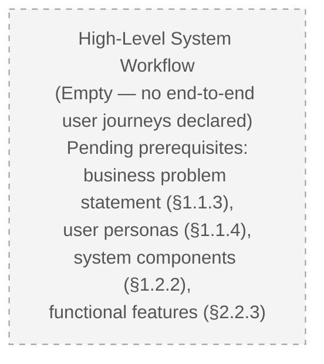

When the prerequisites above are satisfied, this subsection will host a populated `flowchart` that records the start and end points of each user journey, the major process steps traversed, the decision diamonds encountered, the system boundaries crossed, and the user touchpoints exercised.

### 4.3.2 Detailed Process Flows

Detailed process flows are authored per feature, per workflow, or per use case. As recorded in §2.2.3, the active feature catalog is empty, and as recorded in §2.3.3, the active functional requirements register is empty. Consequently, no candidate flow exists for detailed decomposition. The placeholder below records the empty state:

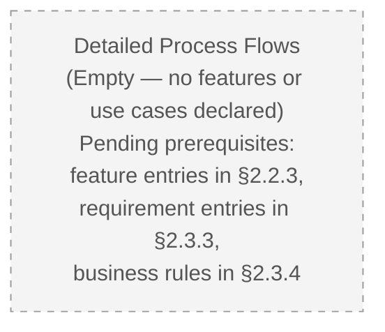

When features and requirements are introduced, this subsection will host one populated `flowchart` per cataloged feature (`F-XXX`) and per high-priority requirement (`F-XXX-RQ-YYY`), in alignment with the identifier schemas reserved in §2.2.2 and §2.3.2.

### 4.3.3 Error Handling Flowcharts

An error-handling flowchart records the detection, classification, propagation, recovery, and notification of error conditions across a system's surfaces. Authoring such a flowchart requires the prior existence of (a) source code in which errors can arise, (b) declared error categories and severities, (c) retry/fallback policies, and (d) declared notification channels. None of these prerequisites are satisfied: no source code exists (§1.4.3), no auditability/logging is declared (§2.5.4), no alerting service is declared (§3.5.3), and no Failure Mode is declared for any integration (§3.5.5). The placeholder below records the empty state:

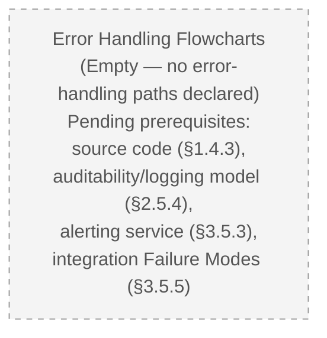

When the prerequisites above are satisfied, this subsection will host one populated `flowchart` per error category, recording: the originating component, the detection mechanism, the classification logic, retry-with-backoff paths, fallback branches, recovery procedures, and notification destinations.

### 4.3.4 Integration Sequence Diagrams

An integration sequence diagram records the temporal ordering of message exchanges between a client, the system under specification, and one or more external services. Authoring such a diagram requires the prior declaration of (a) at least one external integration partner, (b) the wire protocol used (REST, gRPC, GraphQL, webhook, message queue, etc.), and (c) the authentication mechanism for the integration. None of these prerequisites are satisfied: the external API and integration inventory is empty (§3.5.1), no protocols are declared, and no authentication services are declared (§3.5.2). The placeholder below records the empty state:

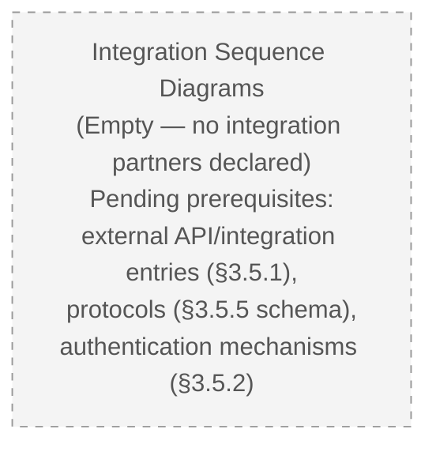

When integration partners are introduced, this subsection will host one populated `sequenceDiagram` per integration, using actor lanes for the client, the Artifact-2 system, and each external partner; lifelines to express temporal ordering; activation bars to express synchronous call duration; and `Note` blocks to express timing constraints, authentication context, and failure handling.

### 4.3.5 State Transition Diagrams

A state transition diagram records the lifecycle of an entity, session, or transaction as it moves between discrete states in response to events. Authoring such a diagram requires the prior declaration of (a) at least one entity with a non-trivial lifecycle, (b) the events that trigger state transitions, and (c) the persistence boundary at which state changes are durably recorded. None of these prerequisites are satisfied: no data domains are declared (§1.3.1), no databases are declared (§3.6.1), no transaction boundaries are declared (§3.6.2), and no source code exists in which entities or sessions could be defined. The placeholder below records the empty state:

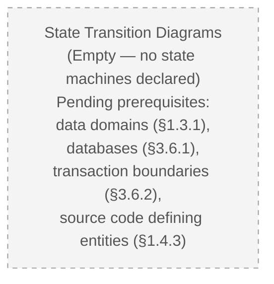

When entity lifecycles are introduced, this subsection will host one populated `stateDiagram-v2` per stateful entity, recording: the initial state, all reachable states, the events that drive transitions, the guard conditions on each transition, the persistence checkpoints at which state is durably recorded, and the terminal states.

---

## 4.4 Validation Rules

The section prompt requests documentation of business rules applied at each workflow step, data validation requirements, authorization checkpoints, and regulatory compliance checks. Each category's current population status is recorded below. These statuses are direct consequences of the validation-rules status table in §2.3.4 and the security-implications table in §2.5.4.

### 4.4.1 Business Rules at Each Workflow Step

| Rule Dimension | Status | Source Evidence |
|----------------|--------|-----------------|
| Business Rule Inventory | Not defined | Business Rules: No (§2.3.4) |
| Rule Engine Selection | Not defined | No source code or framework declared (§1.4.3, §3.3) |
| Rule Versioning Strategy | Not defined | No versioning strategy declared (§2.5.5) |
| Per-Step Guard Conditions | Not defined | No workflow steps declared (§4.2.1) |

### 4.4.2 Data Validation Requirements

| Validation Dimension | Status | Source Evidence |
|----------------------|--------|-----------------|
| Input Validation Schemas | Not defined | Data Validation: No (§2.3.4); no schemas declared (§1.3.1) |
| Output Validation Schemas | Not defined | No interfaces declared (§2.3.2 — *Input Parameters / Output / Response*) |
| Cross-Field Validation | Not defined | No data models declared (§1.3.1) |
| Validation Library / Framework | Not defined | No dependency manifest (§1.4.3, §3.4) |

### 4.4.3 Authorization Checkpoints

| Authorization Dimension | Status | Source Evidence |
|-------------------------|--------|-----------------|
| Authentication Checkpoints | Not defined | Authentication Model: Not defined (§2.5.4) |
| Authorization Checkpoints | Not defined | Authorization Model: Not defined (§2.5.4) |
| Role / Permission Model | Not defined | No roles, personas, or access tiers (§1.3.1) |
| Token / Session Validation | Not defined | No token schemas declared (§3.5.2) |

### 4.4.4 Regulatory Compliance Checks

| Compliance Dimension | Status | Source Evidence |
|----------------------|--------|-----------------|
| Compliance Inventory | Not defined | Compliance Requirements: No (§2.3.4) |
| Jurisdictional Scope | Undefined | Geographic / Market Coverage: Undefined (§1.3.1) |
| Data Residency Requirements | Not defined | No data domains declared (§1.3.1) |
| Retention and Archival Policy | Not defined | Retention and Archival Policy: Not defined (§3.6.2) |
| Audit Trail Requirements | Not defined | Auditability and Logging: Not defined (§2.5.4) |

---

## 4.5 Technical Implementation Schema

The section prompt requests documentation of state management and error handling as the technical-implementation underpinnings of the workflows declared in §4.2 and §4.3. Each category's current population status is recorded below. These statuses are direct consequences of the implementation-considerations table in §2.5 and the data-persistence table in §3.6.2.

### 4.5.1 State Management

| State Management Dimension | Status | Source Evidence |
|----------------------------|--------|-----------------|
| State Transitions | Not defined | No state machines declared (§4.3.5); no source code (§1.4.3) |
| Data Persistence Points | Not defined | No databases declared (§3.6.1); no persistence strategies (§3.6.2) |
| Transaction Boundaries | Not defined | Transaction Boundaries: Not defined (§3.6.2) |
| Consistency Model | Not defined | Consistency Model: Not defined (§3.6.2) |
| Caching Requirements (Application In-Process) | Not defined | Application In-Process Cache: Not defined (§3.6.3) |
| Caching Requirements (Distributed) | Not defined | Distributed Cache: Not defined (§3.6.3) |
| Caching Requirements (HTTP / Edge) | Not defined | HTTP / Edge Cache: Not defined (§3.6.3) |
| Caching Requirements (Database Query) | Not defined | Database Query Cache: Not defined (§3.6.3) |
| Session Storage | Not defined | No session management declared (§3.5.2) |
| Idempotency Strategy | Not defined | No integration partners or API surface declared (§3.5.1) |

### 4.5.2 Error Handling

| Error Handling Dimension | Status | Source Evidence |
|--------------------------|--------|-----------------|
| Error Classification Taxonomy | Not defined | No source code or error categories declared (§1.4.3) |
| Retry Mechanisms (Backoff Policy) | Not defined | No resilience patterns declared; no integration Failure Modes (§3.5.5) |
| Fallback Processes (Graceful Degradation) | Not defined | No alternative paths declared; no source code (§1.4.3) |
| Circuit Breaker Configuration | Not defined | No external dependencies declared (§3.5.1) |
| Dead-Letter Queue / Poison Message Handling | Not defined | No Message Bus / Event Streams declared (§2.4.2) |
| Error Notification Flows | Not defined | No Alerting service declared (§3.5.3); no Auditability/Logging (§2.5.4) |
| Recovery Procedures | Not defined | No Backup and Restore Policy declared (§3.6.2) |
| Compensating Transactions | Not defined | No transaction boundaries declared (§3.6.2) |
| Timeout Defaults Per Integration | Not defined | No integration partners declared (§3.5.1) |

---

## 4.6 Assumptions, Constraints, and Revision Triggers for Section 4

### 4.6.1 Documented Assumptions

Structurally parallel to §2.7.1, the assumptions governing Section 4 are:

| Assumption | Basis |
|------------|-------|
| Section 4 will be revised once concrete workflows, processes, or state machines are committed to the repository | Living-document posture from §1.3.3, extended to §2.1.3, §3.1.4, and §4.1.4 |
| The structural schemas published in §4.2, §4.3, §4.4, and §4.5 will be honored when workflows are introduced | Published as the authoritative organization scheme for the project's process documentation |
| Cross-references in this section to "Not defined" statuses in §2.5, §3.5, and §3.6 will track those sections' populations | Each "Not defined" entry sources its rationale from the referenced section |
| Conventional workflow patterns (decision diamonds, swim lanes, retry-with-backoff, etc.) enumerated by the section prompt are non-binding reference templates only | Explicit treatment recorded in §4.1.3 |

### 4.6.2 Documented Constraints

Structurally parallel to §2.7.2, the constraints governing Section 4 are:

| Constraint | Basis |
|------------|-------|
| Workflows may not be enumerated without supporting repository artifacts | Evidence-only authoring posture from §1.1.1, §2.1.2, §3.1.2, §4.1.2 |
| Decision points may not be invented without declared business rules | Business Rules: No (§2.3.4) |
| State transitions may not be authored without a declared entity lifecycle | No data domains (§1.3.1); no databases (§3.6.1) |
| SLA constraints may not be specified without performance targets | All Performance Requirements: Not defined (§2.5.2) |
| Retry, fallback, and recovery procedures may not be authored without declared external dependencies or Failure Modes | External API inventory empty (§3.5.1); no Failure Modes (§3.5.5) |
| Authorization checkpoints may not be authored without a declared authorization model | Authorization Model: Not defined (§2.5.4) |

### 4.6.3 Revision Triggers Specific to Section 4

The following triggers, when satisfied, will cause specific subsections of Section 4 to be revised. Each row maps a repository event to the subsections it activates. This table is structurally parallel to §2.7.3 and §3.9.

| Repository Event | Subsections Activated |
|------------------|------------------------|
| Commit of source files implementing business logic | §4.2.1 (Core Business Processes), §4.3.1 (High-Level System Workflow), §4.3.2 (Detailed Process Flows) |
| Commit of API specifications or service contracts (OpenAPI, gRPC `.proto`, GraphQL SDL) | §4.2.2 (Integration Workflows — API Interactions), §4.3.4 (Integration Sequence Diagrams) |
| Commit of state-machine definitions (XState, statecharts, workflow-engine DSL) | §4.3.5 (State Transition Diagrams), §4.5.1 (State Management) |
| Commit of error-handling middleware, retry libraries, or circuit-breaker configuration | §4.3.3 (Error Handling Flowcharts), §4.5.2 (Error Handling) |
| Commit of message queue, event bus, or stream configuration | §4.2.2 (Integration Workflows — Event Processing Flows) |
| Commit of authentication / authorization middleware or policy files | §4.4.3 (Authorization Checkpoints), §4.2.1 (User Touchpoints) |
| Commit of database schemas with transaction definitions or migration files | §4.5.1 (Data Persistence Points, Transaction Boundaries) |
| Commit of caching configuration (Redis client, CDN rules, in-process cache library) | §4.5.1 (Caching Requirements) |
| Commit of CI/CD workflows or batch job definitions (cron, Airflow DAGs, Argo Workflows) | §4.2.2 (Integration Workflows — Batch Processing Sequences) |
| Commit of validation libraries or schema definitions (JSON Schema, Pydantic, Joi, Zod) | §4.4.2 (Data Validation Requirements) |
| Commit of business-rule definitions or rule-engine configuration | §4.4.1 (Business Rules at Each Workflow Step) |
| Commit of compliance documentation or audit-logging configuration | §4.4.4 (Regulatory Compliance Checks), §4.5.2 (Error Notification Flows) |
| Commit of SLO/SLA documentation or instrumentation declaring latency / throughput / availability targets | §4.2.1 (Timing and SLA Considerations) |

### 4.6.4 Revision Activation Flow

The flowchart below records how repository events drive revisions to Section 4. It is structurally parallel to §2.7.4 and §3.9.1 and applies the same activation pattern to workflow- and process-specific subsections.

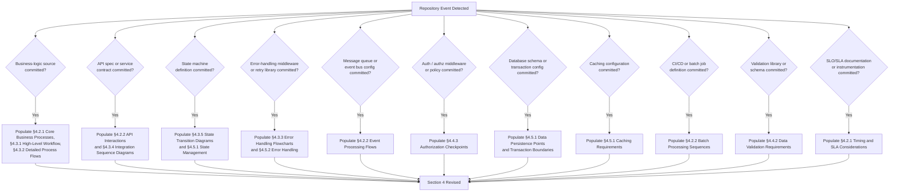

---

## 4.7 References

### 4.7.1 Files Examined

- `README.md` — The sole content-bearing file in the repository; contains exactly one line consisting of the H1 Markdown heading `# Artifact-2`. This file declares no workflow, process, decision point, state machine, or integration sequence and is the basis for the determination that the repository is in a pre-implementation state with respect to Section 4.

### 4.7.2 Folders Examined

- `/` (repository root) — Confirmed to contain exactly one child entry (`README.md`) and zero subdirectories. This finding establishes that no business-logic source, API contract directory, state-machine definition directory, middleware directory, message-queue configuration, or workflow-orchestration hierarchy exists within the repository.

### 4.7.3 Absent Artifacts Reaffirmed for Section 4

The following categories of artifacts were systematically verified to be absent from the repository and directly inform the "Not defined" entries throughout Section 4. This list extends and reaffirms the catalogs recorded in §1.4.3 and §3.10.3 with a specific focus on workflow-, process-, and state-related artifacts:

| Category | Examples Verified Absent |
|----------|--------------------------|
| Business-Logic Source Files | Any source file declaring controllers, services, handlers, use-case modules, or domain models |
| API / Service Contracts | OpenAPI / Swagger definitions, gRPC `.proto` files, GraphQL SDL, AsyncAPI definitions, WSDL/XSD |
| State Machine Definitions | XState configurations, statechart DSLs, workflow-engine definitions (Temporal, Cadence, Camunda BPMN, Step Functions ASL) |
| Error Handling / Resilience | Retry libraries (e.g., `polly`, `tenacity`, `resilience4j`), circuit-breaker config, dead-letter queue config |
| Message Queue / Event Bus | RabbitMQ, Kafka, NATS, SNS/SQS, EventBridge, Pub/Sub, ActiveMQ topology or schema |
| Batch / Workflow Orchestration | Airflow DAGs, Argo Workflows, Prefect flows, Luigi tasks, cron specs, Kubernetes `CronJob` manifests |
| Authentication / Authorization | OIDC client configuration, OAuth secrets schema, RBAC policy files, Casbin / OPA Rego policies, JWT signing config |
| Validation Schemas | JSON Schema, Pydantic models, Joi / Zod / Yup schemas, Protobuf message definitions used as validators |
| Persistence / Transaction | Database migration files, ORM model definitions, transactional outbox tables, `BEGIN/COMMIT` blocks in source |
| Caching Configuration | Redis client config, Memcached config, CDN rule sets, in-process cache library declarations |
| Observability / Audit | Logging library config, OpenTelemetry instrumentation, audit-trail schema, alert rules |
| SLA / SLO Documentation | Error budget policies, SLO YAML/JSON files, runbooks declaring response-time targets |
| CI/CD Process Definitions | `.github/workflows/`, `.gitlab-ci.yml`, `Jenkinsfile`, `.circleci/`, build pipeline declarations |

### 4.7.4 Cross-Referenced Specification Sections

The following sections of this Technical Specification were consulted to ground the constraints, "Not defined" determinations, and revision triggers recorded in Section 4:

| Section | Relevance to Section 4 |
|---------|------------------------|
| §1.1 (Executive Summary) | Establishes the verified pre-implementation state (§1.1.1); records absence of business problem (§1.1.3) and stakeholders (§1.1.4) — directly invalidates derivation of user journeys |
| §1.2 (System Overview) | Records absence of integration artifacts (§1.2.1), system components (§1.2.2), and technical approach (§1.2.2) — directly invalidates derivation of system interactions and integration workflows |
| §1.3 (Scope) | Records that system boundaries, user groups, and data domains are undefined (§1.3.1); establishes living-document maintenance posture (§1.3.3) |
| §1.4 (References) | Provides the file/folder inventory (§1.4.1, §1.4.2) and absent-artifact catalog (§1.4.3) that underpin Section 4's "Not defined" entries |
| §2.1 (Section Posture and Authoring Constraints) | Establishes the evidence-only authoring posture (§2.1.2) and the Section Lifecycle pattern (§2.1.4) that §4.1.5 mirrors |
| §2.3 (Functional Requirements Table) | Records validation-rule statuses as "No" across business rules, data validation, security, and compliance categories (§2.3.4) — directly drives §4.4 |
| §2.4 (Feature Relationships) | Records that no integration points (§2.4.2) and no shared components (§2.4.3) exist; provides the empty-placeholder diagram styling pattern (§2.4.1) |
| §2.5 (Implementation Considerations) | Independently records "Not defined" for Performance Requirements (§2.5.2), Scalability Considerations including Caching Strategy (§2.5.3), and Security Implications (§2.5.4) — directly drives §4.4 and §4.5 |
| §2.7 (Assumptions, Constraints, and Revision Triggers) | Provides the assumption-table, constraint-table, and Revision Activation Flow patterns (§2.7.1–§2.7.4) that §4.6 mirrors |
| §3.1 (Section Posture and Authoring Constraints) | Reaffirms the evidence-only authoring posture (§3.1.2) and establishes the treatment of section-prompt defaults as non-binding reference templates (§3.1.3) — the model for §4.1.3 |
| §3.5 (Third-Party Services) | Records empty external API inventory (§3.5.1), no authentication services (§3.5.2), no observability/alerting services (§3.5.3), no message queue or notification services (§3.5.4) — directly drives §4.2.2, §4.3.3, §4.3.4, §4.5.2 |
| §3.6 (Databases & Storage) | Records "Not defined" for transaction boundaries, consistency model, backup/restore policy (§3.6.2); no cache tiers declared (§3.6.3); "no data flows have been declared" (§3.6.5) — directly drives §4.5.1 |
| §3.8 (Technology Stack Dependency Graph) | Provides the empty-placeholder diagram styling pattern (`classDef empty fill:#f4f4f4,stroke:#999,stroke-dasharray: 5 5,color:#555`) reused throughout §4.3 |
| §3.9 (Revision Triggers for Section 3) | Provides the revision-trigger table and Revision Activation Flow pattern (§3.9.1) that §4.6.3 and §4.6.4 mirror |

# 5. System Architecture

## 5.1 Section Posture and Authoring Constraints

### 5.1.1 Repository State Recap

This section documents the system architecture of the **Artifact-2** project. As established in §1.1 (Executive Summary), §1.2 (System Overview), §1.3 (Scope), §2.1 (Section Posture and Authoring Constraints), §3.1 (Section Posture and Authoring Constraints), and §4.1 (Section Posture and Authoring Constraints), the repository at the time of authoring exists in a verified **pre-implementation state**. The sole evidentiary artifact in the repository is the file `README.md`, which contains exactly one line of content: the Markdown H1 heading `# Artifact-2`. No source files, dependency manifests, configuration artifacts, API specifications, container definitions, infrastructure-as-code modules, architectural decision records, deployment topology diagrams, service contracts, schema definitions, or cross-cutting policy documents have been committed to the repository.

Consequently, Section 5 cannot enumerate concrete system components, communication topologies, integration partners, technical decisions, or cross-cutting concerns grounded in repository evidence. Instead, it establishes the **authoritative schema and structural conventions** that will be applied when architectural artifacts are introduced, and it records the **current population status** (zero entries) for each requested category. The repository's complete inventory of artifacts relevant to Section 5 is reproduced below for traceability:

| Artifact Category | Status | Implication for Section 5 |
|-------------------|--------|---------------------------|
| README (`README.md`) | Present (12 bytes; single H1 heading) | Declares no components, interfaces, or architectural style |
| Source Code Files | Absent | No component boundaries derivable; no module decomposition |
| Dependency Manifests | Absent | No framework or runtime selection; no library catalogue |
| API / Service Contracts | Absent | No external integration points; no protocol declarations |
| Container / Orchestration | Absent | No deployment topology; no scaling primitives |
| Infrastructure-as-Code | Absent | No cloud resource declarations; no environment definitions |
| Architectural Decision Records | Absent | No documented design trade-offs |
| Observability Configuration | Absent | No monitoring, tracing, or logging primitives |

This inventory is consistent with the absent-artifact catalog recorded in §1.4.3 and reaffirmed in §3.1.1 and §4.1.1.

### 5.1.2 Authoring Constraints Applied to This Section

The following constraints govern the content of Section 5 and extend the evidence-only authoring posture established in §1.1.1, reaffirmed in §2.1.2, further extended in §3.1.2, and carried forward in §4.1.2. They are applied uniformly to every subsection below:

| Constraint | Rationale |
|------------|-----------|
| No fabricated component identifiers or service boundaries | No software components exist (§1.2.2 — *Major System Components*); no folder hierarchy, no modular subdivision |
| No assumed architectural style (microservices, monolith, serverless, etc.) | No source code, no deployment artifacts, no decomposition recorded (§1.2.2, §3.7 via §3.1.1) |
| No invented integration points or external dependencies | Inbound APIs, Outbound APIs/Webhooks, Message Bus, File/Data Exchange: all "No" (§2.4.2); external API inventory empty (§3.5.1) |
| No assumed communication protocols (REST, gRPC, GraphQL, AMQP, etc.) | No service contracts, no protocol declarations (§3.5.1, §3.5.5) |
| No manufactured performance, scalability, or availability targets | Latency, Throughput, Resource Budgets, Availability: all "Not defined" (§2.5.2) |
| No assumed database, caching, or storage technologies | All database roles, persistence strategies, and cache tiers "Not defined" (§3.6.1, §3.6.2, §3.6.3) |
| No assumed authentication or authorization framework | Authentication Model and Authorization Model "Not defined" (§2.5.4); Authentication Services "Not defined" (§3.5.2) |
| No assumed monitoring, tracing, or logging strategy | Metrics, Tracing, Logging, Alerting: all "Not defined" (§3.5.3); Auditability and Logging "Not defined" (§2.5.4) |
| No fabricated error-handling, retry, or fallback patterns | Error Classification, Retry Mechanisms, Fallback Processes, Recovery Procedures: all "Not defined" (§4.5.2) |
| No assumed disaster-recovery or business-continuity procedures | Backup and Restore Policy "Not defined" (§3.6.2); Recovery Procedures "Not defined" (§4.5.2) |
| No invented Architecture Decision Records (ADRs) | No design-decision artifacts exist in the repository (§1.4.3) |
| No assumed cross-cutting policies (rate limiting, validation, etc.) | Validation Rules: all "Not defined" (§4.4); no shared utilities (§2.4.3) |

These constraints are direct extensions of the authoring posture chain established across §1.1.1, §2.1.2, §3.1.2, and §4.1.2.

### 5.1.3 Treatment of the Section Prompt's Default Architecture Patterns

The Section 5 prompt enumerates conventional architectural patterns that typically appear in enterprise system-architecture documentation, including: layered or hexagonal architectures, service-oriented decompositions (monolithic, modular monolith, microservices, serverless functions), event-driven and message-oriented topologies, request/response communication via REST / gRPC / GraphQL, polyglot persistence with relational and document stores, multi-tier caching strategies (in-process, distributed, edge), defense-in-depth security with OAuth/OIDC and mTLS, observability triads (metrics / logs / traces), retry-with-backoff and circuit-breaker resilience patterns, and active-active or active-passive disaster-recovery topologies.

Under the evidence-only authoring posture established in §1.1.1, §2.1.2, §3.1.2, and §4.1.2 — and consistent with the treatment of the Default Technology Stack template in §3.1.3 and the Default Workflow Templates in §4.1.3 — these prompt-supplied architectural patterns **cannot be adopted as the project's actual architecture** because no artifact in the repository declares, references, or implies any architectural style, component decomposition, communication topology, or cross-cutting policy.

The conventional architectural patterns enumerated above are therefore preserved in this document strictly as **non-binding reference templates** that contributors may consult as a starting point when authoring concrete architectural decisions in future revisions. Each subsection below records the conventional categories applicable to its scope and explicitly marks the project's current entries as **Not defined**. The distinction between "candidate reference pattern" and "selected architecture" must be preserved across all future revisions of Section 5 until a corresponding repository artifact (e.g., a committed source directory, an Architecture Decision Record, a deployment manifest, an API specification) provides authoritative evidence of an actual project architecture.

### 5.1.4 Living-Document Disposition

Consistent with the documentation maintenance posture declared in §1.3.3, extended to Section 2 in §2.1.3, to Section 3 in §3.1.4, and to Section 4 in §4.1.4, **Section 5 is established as a living document**. Each subsection below preserves the structural schema requested in the section prompt so that future revisions can populate concrete entries without re-architecting the section. The architecture-specific revision triggers are enumerated in §5.6.

### 5.1.5 Section 5 Lifecycle

The diagram below records the lifecycle states of Section 5 with respect to repository content. The current state is `Pre-Implementation`. This diagram is structurally parallel to the Section 2 Lifecycle in §2.1.4, the Technology Stack Lifecycle in §3.1.5, and the Section 4 Lifecycle in §4.1.5.

```mermaid
stateDiagram-v2
    [*] --> PreImpl
    PreImpl: Pre-Implementation<br/>(Current State)
    ComponentsIdentified: Components Identified<br/>(Future State)
    ArchitectureRealized: Architecture Realized<br/>(Future State)
    Maintained: Maintained<br/>(Steady State)

    PreImpl --> ComponentsIdentified: System components, interfaces,<br/>or ADRs committed
    ComponentsIdentified --> ArchitectureRealized: Source code, integration contracts,<br/>and cross-cutting policies implemented
    ArchitectureRealized --> Maintained: Architecture stabilizes;<br/>ADRs ratified and SLAs published
    Maintained --> ComponentsIdentified: Major architectural revision<br/>or decomposition change

    note right of PreImpl
        Sole artifact: README.md
        Components declared: 0
        Integration points declared: 0
        ADRs ratified: 0
        SLAs published: 0
        Cross-cutting policies declared: 0
    end note
```

---

## 5.2 High-Level Architecture

### 5.2.1 System Overview

The section prompt requests a textual description of the overall system architecture style and rationale, the key architectural principles and patterns adopted, and the system boundaries and major interfaces exposed by the system. Each of these elements requires evidentiary grounding in committed repository artifacts. As recorded in §1.2.2 (*Core Technical Approach*), the repository declares no programming language, no framework selection, no build and tooling choices, and no runtime environment. As recorded in §1.3.1 (*Implementation Boundaries*), the System Boundaries, User Groups Covered, Geographic / Market Coverage, and Data Domains Included are all "Undefined."

Consequently:

| Architectural Element | Status | Source Evidence |
|-----------------------|--------|-----------------|
| Overall Architecture Style | Not defined | No source code, no deployment artifacts (§1.2.2); no architectural decomposition recorded |
| Architectural Principles and Patterns | Not defined | No design documents, no ADRs (§1.4.3); no constraints declared (§2.5.1) |
| System Boundaries | Undefined | Recorded as "Undefined" in §1.3.1 (*Implementation Boundaries*) |
| Major Interfaces | Not defined | No service contracts, no API specifications (§2.4.2, §3.5.1) |
| Deployment Topology | Not defined | No runtime environment, no container or orchestration platform (§3.1.1, §3.7 via §3.1.1) |
| Quality Attributes Prioritization | Not defined | All Performance, Scalability, and Security dimensions "Not defined" (§2.5.2, §2.5.3, §2.5.4) |

No architectural rationale, principles, or boundary descriptions are asserted by this specification. This subsection will be revised when a foundational artifact — such as a committed source directory, an Architecture Decision Record, a deployment manifest, or an API specification — provides authoritative evidence of an architectural style and its supporting rationale.

### 5.2.2 Core Components Table

A core components table can only be populated when discrete software components, services, or modules have been declared in the repository. As recorded in §1.2.2 (*Major System Components*), no software components exist in the repository; there is no folder hierarchy, no modular subdivision, no service boundary definition, and no architectural decomposition recorded in any file. The shared-components and common-services view in §2.4.3 is also empty across Shared Libraries, Common Services, Cross-Cutting Utilities, and Configuration / Secrets Stores.

The table below preserves the requested four-column schema so that contributors can populate component entries when source directories and service boundaries are introduced:

| Component Name | Primary Responsibility | Key Dependencies | Integration Points |
|----------------|------------------------|------------------|--------------------|
| — | — | — | No entries; component catalog empty (§1.2.2, §2.4.3) |

The "Critical Considerations" dimension requested by the section prompt — a fifth column that would exceed the four-column table convention adopted across this specification — will be captured in narrative form under each component's entry in §5.3 (Component Details) when components are introduced. This decomposition preserves the four-column table convention without losing the requested information dimension.

The identification artifact `# Artifact-2` is treated consistently with §2.2.3 as a **project identifier, not a system component**. It is therefore not recorded as a row in this table.

### 5.2.3 Data Flow Description

A data-flow description requires the prior existence of (a) at least two components or services between which data may flow, (b) declared data domains or entity definitions, and (c) declared protocols or formats by which data is exchanged. None of these prerequisites are satisfied by the current repository state. As recorded in §3.6.5 (*Data Flow Considerations*), no data flows have been declared; the absence of integration points (§2.4.2) and shared components (§2.4.3) means that no data-flow diagram can be authoritatively constructed at this time.

The conventional categories of data-flow description are recorded below with their current population status:

| Data Flow Dimension | Status | Source Evidence |
|---------------------|--------|-----------------|
| Primary Data Flows Between Components | Not defined | No components declared (§1.2.2); no flows (§3.6.5) |
| Integration Patterns and Protocols | Not defined | No integration points (§2.4.2); no protocol declarations (§3.5.5) |
| Data Transformation Points | Not defined | No source code, no schema artifacts (§1.4.3) |
| Key Data Stores | Not defined | No databases declared (§3.6.1); no storage services (§3.6.4) |
| Caches and Materialized Views | Not defined | All cache tiers "Not defined" (§3.6.3) |
| Messaging and Event Topologies | Not defined | Message Bus / Event Streams: No (§2.4.2); no Message Queue / Streaming service (§3.5.4) |

No primary data flows, integration patterns, transformation points, or data stores are asserted by this specification. This subsection will be revised in concert with §2.4.1 (*Feature Dependency Map*) and §3.8 (*Technology Stack Dependency Graph*) when source directories with implementation files and integration contracts are committed.

### 5.2.4 External Integration Points Table

External integration points require the prior declaration of at least one external system with which Artifact-2 exchanges data. As recorded in §3.5.1 (*External API and Integration Inventory*), the inventory of external APIs and integrations is empty, and as reaffirmed in §1.2.1 (*Integration with Existing Enterprise Landscape*) and §2.4.2 (*Integration Points*), no integration artifacts — API specifications, service contracts, message schemas, authentication configurations, or data exchange formats — are present in the repository.

The table below preserves the requested four-column schema for future population. The "SLA Requirements" dimension requested by the section prompt — a fifth column that would exceed the four-column table convention adopted across this specification — will be captured in §5.5.5 (Performance Requirements and SLAs) when performance targets are declared in §2.5.2:

| System Name | Integration Type | Data Exchange Pattern | Protocol / Format |
|-------------|------------------|-----------------------|-------------------|
| — | — | — | No entries; external integration inventory empty (§3.5.1) |

When external integrations are introduced, each entry must conform to the Integration Requirements Schema published in §3.5.5, which captures Service Name, Service Category, Protocol(s), Authentication Mechanism, Data Classification, Failure Mode, SLA / SLO Reference, and Cost / Quota Profile.

---

## 5.3 Component Details

### 5.3.1 Component Catalog Status

The section prompt requests, for each major component, documentation of its purpose and responsibilities, the technologies and frameworks employed, the key interfaces and APIs it exposes, its data persistence requirements, and its scaling considerations. As recorded in §5.2.2 above and §1.2.2 (*Major System Components*), the active component catalog is empty: there are zero components for which these five dimensions may be documented.

The schema below preserves the per-component dimensions requested by the section prompt so that future revisions can populate concrete entries:

| Per-Component Dimension | Current Population | Source Evidence |
|-------------------------|--------------------|------------------|
| Purpose and Responsibilities | Empty | No components declared (§1.2.2) |
| Technologies and Frameworks | Empty | All language tiers "Not defined" (§3.2); no frameworks declared (§3.3 via §3.1.1) |
| Key Interfaces and APIs | Empty | No service contracts; external API inventory empty (§3.5.1) |
| Data Persistence Requirements | Empty | All database roles "Not defined" (§3.6.1); no persistence strategies (§3.6.2) |
| Scaling Considerations | Empty | Horizontal Scaling, Vertical Scaling, Data Partitioning, Caching Strategy: all "Not defined" (§2.5.3) |

No per-component entries are asserted by this specification. This subsection will be revised when source directories with implementation files, dependency manifests, and configuration artifacts are committed and the component catalog in §5.2.2 is populated.

### 5.3.2 Component Interaction Diagram

A component interaction diagram records the synchronous and asynchronous interactions between two or more components within a system. Authoring such a diagram requires the prior declaration of (a) at least two components in the catalog defined in §5.2.2, (b) the interaction protocol between them, and (c) the directionality and cardinality of the interaction. None of these prerequisites are satisfied: the component catalog is empty (§5.2.2, §1.2.2), no protocols are declared (§3.5.5), and no shared components or services exist (§2.4.3). The placeholder below records the empty state explicitly, following the styling convention established in §2.4.1, §3.8, and §4.3:

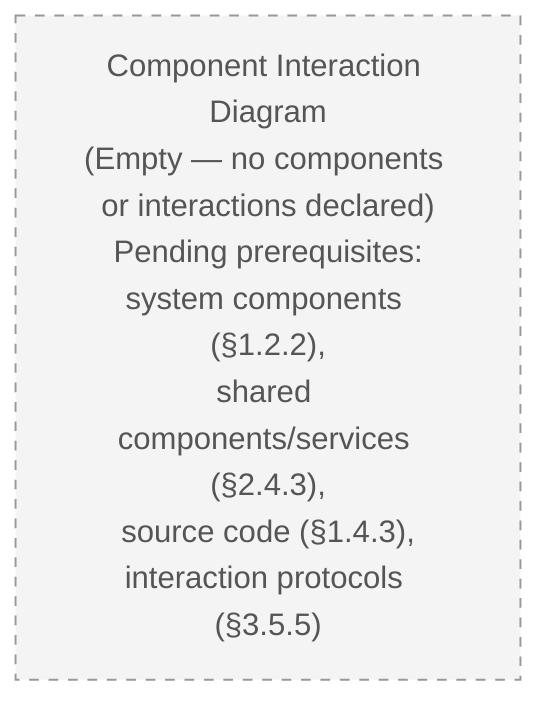

When components are introduced, this subsection will host a populated `flowchart` recording the nodes representing each component, the edges representing each interaction (annotated with protocol and directionality), the subgraphs representing service or deployment boundaries, and the call-out notes representing cross-cutting concerns (authentication, rate limiting, circuit breakers).

### 5.3.3 State Transition Diagrams

State transition diagrams for components mirror the entity-lifecycle state diagrams discussed in §4.3.5. Authoring such diagrams requires the prior declaration of (a) at least one component with a non-trivial internal state, (b) the events that trigger state transitions, and (c) the persistence checkpoints at which state changes are durably recorded. None of these prerequisites are satisfied: no components are declared (§5.2.2), no data domains are declared (§1.3.1), no databases are declared (§3.6.1), no transaction boundaries are declared (§3.6.2), and no source code exists in which states could be defined. The placeholder below records the empty state explicitly:

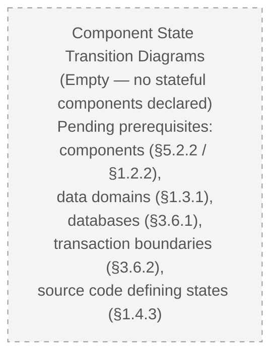

This subsection is structurally complementary to §4.3.5 (*State Transition Diagrams*), which addresses entity-lifecycle state machines. When stateful components or entities are introduced, the two subsections will host populated `stateDiagram-v2` diagrams in coordination: §5.3.3 will cover component-internal states, and §4.3.5 will cover entity-lifecycle states.

### 5.3.4 Sequence Diagrams for Key Flows

Sequence diagrams record the temporal ordering of message exchanges between components, actors, and external systems for a given flow. Authoring such diagrams requires the prior declaration of (a) at least two participants in the flow, (b) the messages exchanged between them, and (c) the timing or ordering constraints on those messages. None of these prerequisites are satisfied: no components are declared (§5.2.2), no external integrations are declared (§3.5.1), no protocols are declared (§3.5.5), and no end-to-end user journeys exist (§4.2.1). The placeholder below records the empty state explicitly:

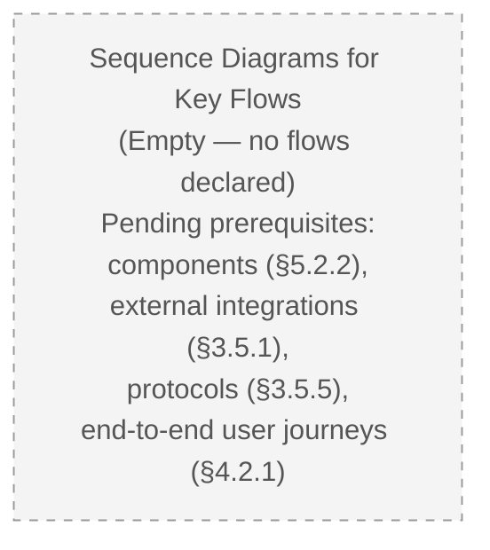

This subsection is structurally complementary to §4.3.4 (*Integration Sequence Diagrams*), which addresses external-integration sequences. When key flows are introduced, the two subsections will host populated `sequenceDiagram` diagrams in coordination: §5.3.4 will cover component-to-component flows internal to Artifact-2, and §4.3.4 will cover client-to-system-to-external-partner sequences.

---

## 5.4 Technical Decisions

### 5.4.1 Architecture Style Decisions and Trade-offs

Architecture style decisions document the trade-offs accepted when selecting a particular structural approach — monolith vs. modular monolith vs. microservices vs. serverless, layered vs. hexagonal vs. event-driven, request/response vs. publish/subscribe, and so forth. Each decision is meaningful only when it is anchored to a declared problem domain, a declared set of quality attributes, and a declared technology stack. None of these anchors are present: §1.1.3 records that no business problem is declared, §2.5.2 records that all performance dimensions are "Not defined," and §3.1.1 through §3.7 record that no technology selections have been committed.

| Architecture Style Dimension | Status | Source Evidence |
|------------------------------|--------|-----------------|
| Structural Style (Monolith / Microservices / Serverless / Modular Monolith) | Not defined | No source code, no deployment artifacts (§1.2.2, §3.7 via §3.1.1) |
| Interaction Style (Layered / Hexagonal / Event-Driven) | Not defined | No design documents (§1.4.3); no functional requirements (§2.3.3) |
| Decomposition Boundary | Not defined | No system components (§1.2.2); no shared components (§2.4.3) |
| Trade-off Rationale | Not defined | No quality-attribute priorities (§2.5.2, §2.5.3, §2.5.4) |

### 5.4.2 Communication Pattern Choices

Communication pattern choices document the protocols, message formats, and interaction styles used between components and with external partners. These choices are meaningful only when components and external integrations exist. As recorded in §5.2.2 (component catalog empty), §3.5.1 (external API inventory empty), and §2.4.2 (Inbound APIs, Outbound APIs/Webhooks, Message Bus, and File/Data Exchange all "No"), no communication context exists in which patterns may be selected.

| Communication Concern | Status | Source Evidence |
|-----------------------|--------|-----------------|
| Synchronous Protocol (REST / gRPC / GraphQL) | Not defined | No service contracts (§3.5.1, §3.5.5) |
| Asynchronous Protocol (AMQP / Kafka / SNS-SQS / Webhooks) | Not defined | No Message Bus / Event Streams (§2.4.2); no Message Queue / Streaming (§3.5.4) |
| Message Format (JSON / Protobuf / Avro / XML) | Not defined | No data exchange formats (§2.4.2); no schema artifacts (§1.4.3) |
| Inter-Service Authentication (mTLS / Bearer / API Key) | Not defined | Authentication Model "Not defined" (§2.5.4); Identity Provider "Not defined" (§3.5.2) |
| Idempotency / Exactly-Once Guarantees | Not defined | Idempotency Strategy: Not defined (§4.5.1) |

### 5.4.3 Data Storage Solution Rationale

Data storage rationale documents the trade-offs accepted when selecting relational vs. document vs. key-value vs. time-series vs. graph stores, the consistency model adopted (strong, bounded-staleness, eventual), the partitioning and replication strategy, and the encryption and retention posture. As recorded comprehensively in §3.6 (*Databases & Storage*), all database roles, persistence strategies, caching tiers, and storage services are "Not defined." As recorded in §1.3.1, no data domains have been declared from which storage selections could be derived.

| Storage Rationale Dimension | Status | Source Evidence |
|------------------------------|--------|-----------------|
| Engine Selection Rationale | Not defined | All database roles "Not defined" (§3.6.1) |
| Consistency Model Rationale | Not defined | Consistency Model "Not defined" (§3.6.2) |
| Partitioning and Replication Rationale | Not defined | Data Partitioning Strategy "Not defined" (§2.5.3) |
| Retention and Archival Rationale | Not defined | Retention and Archival Policy "Not defined" (§3.6.2) |
| Encryption Posture Rationale | Not defined | Encryption at Rest, Encryption in Transit "Not defined" (§3.6.2) |

### 5.4.4 Caching Strategy Justification

Caching strategy justification documents the trade-offs accepted when selecting in-process vs. distributed vs. HTTP/edge vs. database-query caching, the cache invalidation policy, the consistency vs. staleness trade-off, and the cost vs. latency trade-off. As recorded in §2.5.3 (*Scalability Considerations* — *Caching Strategy* — "Not defined") and reaffirmed across all four tiers in §3.6.3 (*Caching Solutions*), no caching layer has been declared.

| Caching Justification Dimension | Status | Source Evidence |
|----------------------------------|--------|-----------------|
| Application In-Process Cache Justification | Not defined | Application In-Process Cache "Not defined" (§3.6.3); no application code (§1.4.3) |
| Distributed Cache Justification | Not defined | Distributed Cache "Not defined" (§3.6.3); no deployment architecture (§2.5.3) |
| HTTP / Edge Cache Justification | Not defined | HTTP / Edge Cache "Not defined" (§3.6.3); no CDN configuration (§3.5.4) |
| Database Query Cache Justification | Not defined | Database Query Cache "Not defined" (§3.6.3); no database engine selected (§3.6.1) |
| Invalidation Policy | Not defined | No source code; no state model (§4.5.1) |

### 5.4.5 Security Mechanism Selection

Security mechanism selection documents the trade-offs accepted when selecting authentication providers, authorization models (RBAC vs. ABAC vs. ReBAC), encryption posture, audit-logging strategy, and threat-modeling depth. As recorded in §2.5.4 (*Security Implications*), Authentication Model, Authorization Model, Data Protection Requirements, and Auditability and Logging are all "Not defined." As recorded in §3.5.2, all Authentication Services dimensions are "Not defined."

| Security Mechanism Dimension | Status | Source Evidence |
|------------------------------|--------|-----------------|
| Authentication Mechanism | Not defined | Authentication Model "Not defined" (§2.5.4); Identity Provider "Not defined" (§3.5.2) |
| Authorization Mechanism | Not defined | Authorization Model "Not defined" (§2.5.4); no roles, personas, or access tiers (§1.3.1) |
| Token / Session Management | Not defined | Token Format, Session Management "Not defined" (§3.5.2) |
| Data Protection (Encryption / Masking / Tokenization) | Not defined | Data Protection Requirements "Not defined" (§2.5.4) |
| Audit and Compliance Logging | Not defined | Auditability and Logging "Not defined" (§2.5.4); Compliance Requirements: No (§2.3.4) |
| Secrets Management | Not defined | Secrets Management "Not defined" (§3.5.4); Secrets / Credential Storage "Not defined" (§3.6.4) |

### 5.4.6 Architecture Decision Records (ADRs)

Architecture Decision Records are durable, versioned records that capture the context, the considered alternatives, the selected decision, and the consequences of each significant architectural choice. As recorded in §1.4.3 (*Absent Artifacts Verified*), no ADR artifacts of any form exist in the repository. The ADR register for Artifact-2 is therefore the empty set:

| ADR Identifier | Title | Status | Decision Date |
|----------------|-------|--------|----------------|
| — | — | — | No ADRs ratified |

When the first architectural decision is ratified, contributors are expected to introduce an `adr/` or `docs/decisions/` directory and to follow a recognized ADR template (e.g., Michael Nygard's format or MADR) that records, at minimum, the context, the alternatives considered, the decision selected, the consequences accepted, and the status (proposed / accepted / superseded). The placeholder below preserves the visual convention for empty architectural artifacts:

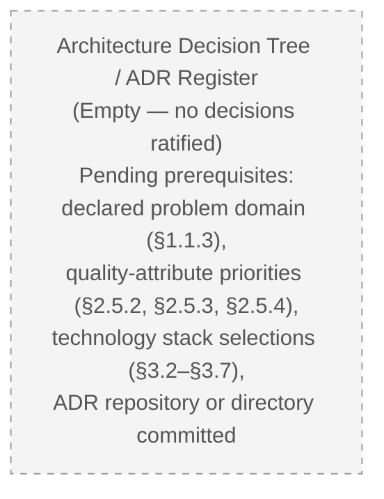

When ADRs are introduced, this subsection will host a populated decision-tree `flowchart` in which nodes represent decision points (with their alternatives) and edges represent the rationale linkages between decisions; it will also host an ADR index table cross-referenced by ADR identifier.

---

## 5.5 Cross-Cutting Concerns

### 5.5.1 Monitoring and Observability Approach

Monitoring and observability concerns capture the instrumentation strategy across the three observability pillars — metrics, distributed traces, and centralized logs — together with error tracking, real-user monitoring, synthetic checks, and alerting. As recorded in §3.5.3 (*Monitoring and Observability Services*), every pillar is "Not defined," and as recorded in §1.2.3 (*Key Performance Indicators*), no KPIs are declared from which monitoring targets could be derived.

| Observability Pillar | Status | Source Evidence |
|----------------------|--------|-----------------|
| Metrics Collection | Not defined | No instrumentation declared (§3.5.3) |
| Distributed Tracing | Not defined | No tracing configuration (§3.5.3) |
| Centralized Logging | Not defined | Centralized Logging "Not defined" (§3.5.3); Auditability and Logging "Not defined" (§2.5.4) |
| Error Tracking | Not defined | No error-reporting integration (§3.5.3) |
| Real-User Monitoring (RUM) | Not defined | No frontend instrumentation (§3.5.3) |
| Synthetic Monitoring / Uptime Checks | Not defined | No availability targets (§2.5.2); no Synthetic Monitoring (§3.5.3) |
| Alerting and On-Call Routing | Not defined | No SLA artifacts (§2.5.2); no Alerting service (§3.5.3) |
| Dashboards and Service-Level Visibility | Not defined | No KPIs (§1.2.3); no SLOs declared |

### 5.5.2 Logging and Tracing Strategy

Logging and tracing strategy documents the log levels, structured-log schema, correlation-identifier propagation, trace sampling policy, log retention, and PII redaction policy. Each is meaningful only when an instrumentation library, a log shipper, or a tracing SDK has been committed. None are present: §2.5.4 records Auditability and Logging as "Not defined," §3.5.3 records Distributed Tracing and Centralized Logging as "Not defined," and §1.4.3 records the absence of all configuration files including logging configurations.

| Logging / Tracing Concern | Status | Source Evidence |
|---------------------------|--------|-----------------|
| Log Schema and Structured Logging Convention | Not defined | No source code; no instrumentation (§1.4.3, §3.5.3) |
| Correlation Identifier Propagation | Not defined | No tracing configuration (§3.5.3) |
| Trace Sampling Policy | Not defined | No tracing SDK declared (§3.5.3) |
| Log Retention and Archival | Not defined | Retention and Archival Policy "Not defined" (§3.6.2) |
| PII Redaction / Field Masking | Not defined | Data Protection Requirements "Not defined" (§2.5.4) |
| Audit-Trail Distinction from Application Logs | Not defined | Auditability and Logging "Not defined" (§2.5.4) |

### 5.5.3 Error Handling Patterns

Error handling patterns at the architectural tier document the classification taxonomy, the retry-with-backoff policy, the fallback and graceful-degradation strategy, the circuit-breaker thresholds, the dead-letter-queue and poison-message policy, the error-notification routing, and the recovery procedures. As comprehensively recorded in §4.5.2 (*Error Handling*), every dimension is "Not defined." Section 4.3.3 (*Error Handling Flowcharts*) already records the empty placeholder for the corresponding flowchart artifact.

| Error Handling Dimension | Status | Source Evidence |
|--------------------------|--------|-----------------|
| Error Classification Taxonomy | Not defined | No source code or error categories (§4.5.2 via §1.4.3) |
| Retry Mechanisms (Backoff Policy) | Not defined | No resilience patterns; no Failure Modes (§4.5.2 via §3.5.5) |
| Fallback Processes (Graceful Degradation) | Not defined | No alternative paths declared (§4.5.2) |
| Circuit Breaker Configuration | Not defined | No external dependencies (§4.5.2 via §3.5.1) |
| Dead-Letter Queue / Poison-Message Handling | Not defined | No Message Bus / Event Streams (§4.5.2 via §2.4.2) |
| Error Notification and Escalation | Not defined | No Alerting service (§4.5.2 via §3.5.3); no Auditability/Logging (§2.5.4) |
| Recovery Procedures | Not defined | No Backup and Restore Policy (§4.5.2 via §3.6.2) |
| Timeout Defaults Per Integration | Not defined | No integration partners (§4.5.2 via §3.5.1) |

The placeholder below preserves the visual convention for empty error-handling artifacts. It is structurally consistent with the error-handling flowchart placeholder recorded in §4.3.3:

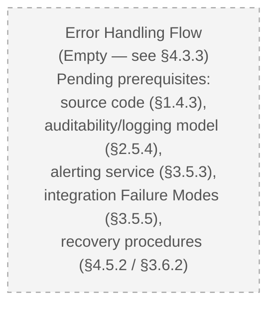

When error-handling middleware, retry libraries, or circuit-breaker configuration is committed, this subsection will host a populated `flowchart` and the corresponding `flowchart` in §4.3.3 will be populated in concert.

### 5.5.4 Authentication and Authorization Framework

The authentication and authorization framework at the architectural tier documents the identity provider integration, the federation and single-sign-on configuration, the token issuance and validation flow, the authorization model (role-based, attribute-based, or relationship-based), the policy-decision and policy-enforcement points, and the session-management posture. As recorded in §2.5.4 (Authentication Model, Authorization Model "Not defined") and §3.5.2 (every authentication service dimension "Not defined"), no authentication or authorization framework has been selected.

| Framework Dimension | Status | Source Evidence |
|---------------------|--------|-----------------|
| Identity Provider | Not defined | Identity Provider "Not defined" (§3.5.2) |
| Single Sign-On Protocol | Not defined | SSO Protocol "Not defined" (§3.5.2) |
| Federation / Social Login | Not defined | Federation / Social Login "Not defined" (§3.5.2) |
| Token Format and Issuance | Not defined | Token Format / Issuance "Not defined" (§3.5.2) |
| Authorization Model (RBAC / ABAC / ReBAC) | Not defined | Authorization Model "Not defined" (§2.5.4); no roles or access tiers (§1.3.1) |
| Policy-Decision and Policy-Enforcement Points | Not defined | No middleware or policy files declared (§4.6.3 trigger inactive) |
| Session Management | Not defined | Session Management "Not defined" (§3.5.2); Session Storage "Not defined" (§4.5.1) |
| Authorization Checkpoints in Workflows | Not defined | Authorization Checkpoints schema "Not defined" (§4.4 / §4.1.2) |

### 5.5.5 Performance Requirements and SLAs

Performance requirements and SLAs at the architectural tier document the latency budgets at the user-perceptible boundary, the throughput targets at component and system boundaries, the resource budgets (CPU, memory, I/O, network), the availability targets (uptime percentage and error budget), and the capacity-planning model. As comprehensively recorded in §2.5.2 (*Performance Requirements*), every dimension is "Not defined."

| Performance Dimension | Status | Source Evidence |
|-----------------------|--------|-----------------|
| Latency Targets (P50 / P95 / P99) | Not defined | Latency Targets "Not defined" (§2.5.2) |
| Throughput Targets (Requests / Events per Second) | Not defined | Throughput Targets "Not defined" (§2.5.2) |
| Resource Budgets (CPU / Memory / I/O) | Not defined | Resource Budgets "Not defined" (§2.5.2) |
| Availability Targets (Uptime / Error Budget) | Not defined | Availability Targets "Not defined" (§2.5.2) |
| Horizontal and Vertical Scaling Bounds | Not defined | Horizontal Scaling Approach, Vertical Scaling Bounds "Not defined" (§2.5.3) |
| Capacity-Planning Model | Not defined | No deployment architecture (§2.5.3); no Resource Budgets (§2.5.2) |
| Timing and SLA Considerations in Workflows | Not defined | Timing and SLA Considerations "Not defined" (§4.2.1) |

When performance targets are declared, the entries above will cross-reference the SLA / SLO Reference field in the Integration Requirements Schema published in §3.5.5 and the Timing and SLA Considerations dimension in §4.2.1.

### 5.5.6 Disaster Recovery Procedures

Disaster recovery procedures document the recovery time objective (RTO), the recovery point objective (RPO), the backup-and-restore policy, the active-active vs. active-passive failover topology, the multi-region or multi-zone redundancy posture, and the disaster-recovery rehearsal cadence. Each is meaningful only when at least one data store, one runtime, and one deployment topology have been declared. None are present: §3.6.2 records Backup and Restore Policy as "Not defined," §3.6.1 records all database roles as "Not defined," §3.5.4 records all cloud services as "Not defined," and §4.5.2 records Recovery Procedures as "Not defined."

| Disaster Recovery Dimension | Status | Source Evidence |
|------------------------------|--------|-----------------|
| Recovery Time Objective (RTO) | Not defined | No availability targets (§2.5.2); no SLA artifacts |
| Recovery Point Objective (RPO) | Not defined | No persistence strategies (§3.6.2); no Backup Policy (§3.6.2) |
| Backup and Restore Procedure | Not defined | Backup and Restore Policy "Not defined" (§3.6.2) |
| Failover Topology (Active-Active / Active-Passive) | Not defined | No deployment topology (§3.5.4); no runtime environment (§1.2.2) |
| Multi-Region / Multi-Zone Redundancy | Not defined | No cloud services declared (§3.5.4); no Geographic / Market Coverage (§1.3.1) |
| Recovery Rehearsal Cadence | Not defined | No operational artifacts present (§3.6.2) |
| Compensating Transactions | Not defined | Compensating Transactions "Not defined" (§4.5.2) |

---

## 5.6 Assumptions, Constraints, and Revision Triggers for Section 5

### 5.6.1 Documented Assumptions

Structurally parallel to §2.7.1, §3.9 (via §3.1.4), and §4.6.1, the assumptions governing Section 5 are:

| Assumption | Basis |
|------------|-------|
| Section 5 will be revised once concrete architectural artifacts (components, ADRs, deployment manifests, integration contracts) are committed to the repository | Living-document posture from §1.3.3, extended to §2.1.3, §3.1.4, §4.1.4, and §5.1.4 |
| The structural schemas published in §5.2, §5.3, §5.4, and §5.5 will be honored when architectural decisions are introduced | Published as the authoritative organization scheme for the project's architecture documentation |
| Cross-references in this section to "Not defined" statuses in §1.2, §1.3, §2.4, §2.5, §3.5, §3.6, §4.2, §4.3, and §4.5 will track those sections' populations | Each "Not defined" entry sources its rationale from the referenced section |
| Conventional architectural patterns enumerated by the section prompt (microservices, layered, event-driven, retry-with-backoff, etc.) are non-binding reference templates only | Explicit treatment recorded in §5.1.3 |
| The identification artifact `# Artifact-2` is treated as a project identifier, not a system component | Consistent with §2.2.3 framing |

### 5.6.2 Documented Constraints

Structurally parallel to §2.7.2, §3.9 (via §3.1.2), and §4.6.2, the constraints governing Section 5 are:

| Constraint | Basis |
|------------|-------|
| Components may not be enumerated without supporting repository artifacts | Evidence-only authoring posture from §1.1.1, §2.1.2, §3.1.2, §4.1.2, §5.1.2 |
| Architecture style may not be asserted without source code, deployment artifacts, or ADRs | No source code, no deployment artifacts (§1.2.2, §1.4.3) |
| Communication patterns may not be specified without integration contracts | External API inventory empty (§3.5.1); Inbound and Outbound APIs: No (§2.4.2) |
| Storage solutions may not be justified without declared data domains | Data Domains Included: Undefined (§1.3.1); all database roles "Not defined" (§3.6.1) |
| Caching strategy may not be justified without scalability targets and storage selections | Caching Strategy "Not defined" (§2.5.3); all cache tiers "Not defined" (§3.6.3) |
| Security mechanisms may not be selected without a declared threat model | Authentication Model and Authorization Model "Not defined" (§2.5.4) |
| Performance and SLA targets may not be specified without committed instrumentation or NFR documents | All Performance Requirements "Not defined" (§2.5.2) |
| Disaster recovery procedures may not be authored without backup policy, runtime, and deployment topology | Backup Policy "Not defined" (§3.6.2); no cloud services (§3.5.4); Recovery Procedures "Not defined" (§4.5.2) |

### 5.6.3 Revision Triggers Specific to Section 5

The following triggers, when satisfied, will cause specific subsections of Section 5 to be revised. Each row maps a repository event to the subsections it activates. This table is structurally parallel to §2.7.3, §3.9, and §4.6.3:

| Repository Event | Subsections Activated |
|------------------|------------------------|
| Commit of source directories establishing component boundaries | §5.2.1 (System Overview), §5.2.2 (Core Components Table), §5.3.1 (Component Catalog) |
| Commit of API specifications or service contracts (OpenAPI, gRPC `.proto`, GraphQL SDL) | §5.2.4 (External Integration Points), §5.3.4 (Sequence Diagrams), §5.4.2 (Communication Patterns) |
| Commit of inter-component interaction code or shared interface definitions | §5.3.2 (Component Interaction Diagram), §5.4.2 (Communication Patterns) |
| Commit of state-machine definitions or stateful entity code | §5.3.3 (Component State Transition Diagrams) |
| Commit of Architecture Decision Records (in `adr/`, `docs/decisions/`, or equivalent) | §5.4.1–§5.4.6 (Technical Decisions), §5.4.6 (ADR Register) |
| Commit of database schema, migration, or connection configuration | §5.4.3 (Data Storage Rationale), §5.5.6 (Disaster Recovery — RPO / Backup) |
| Commit of caching configuration (Redis, Memcached client config, CDN rules) | §5.4.4 (Caching Strategy Justification) |
| Commit of authentication / authorization middleware or policy files | §5.4.5 (Security Mechanism Selection), §5.5.4 (Authentication and Authorization) |
| Commit of monitoring, tracing, or logging configuration | §5.5.1 (Monitoring and Observability), §5.5.2 (Logging and Tracing) |
| Commit of error-handling middleware or retry libraries | §5.5.3 (Error Handling Patterns) |
| Commit of SLO/SLA documentation or NFR specification | §5.5.5 (Performance Requirements and SLAs) |
| Commit of disaster-recovery runbook, backup automation, or failover topology | §5.5.6 (Disaster Recovery Procedures) |
| Commit of deployment topology (`Dockerfile`, Kubernetes manifests, IaC modules) | §5.2.1 (System Overview — Deployment Topology), §5.5.6 (Disaster Recovery — Failover) |

### 5.6.4 Revision Activation Flow

The flowchart below records how repository events drive revisions to Section 5. It is structurally parallel to §2.7.4, §3.9.1, and §4.6.4 and applies the same activation pattern to architecture- and cross-cutting-concern subsections:

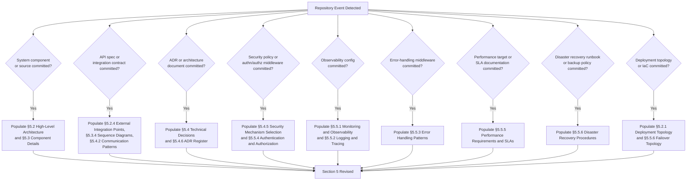

---

## 5.7 References

### 5.7.1 Files Examined

- `README.md` — The sole content-bearing file in the repository; contains exactly one line consisting of the H1 Markdown heading `# Artifact-2`. Confirmed to declare no architectural style, no components, no interfaces, no integration partners, no cross-cutting concerns, and no decisions. This file is the basis for Section 5's verified pre-implementation determination.

### 5.7.2 Folders Examined

- `/` (repository root) — Confirmed to contain exactly one child entry (`README.md`) and zero subdirectories. The absence of any subdirectory establishes that no source hierarchy, no architecture documentation folder (`docs/`, `architecture/`), no decision-records folder (`adr/`, `docs/decisions/`), no deployment manifest folder (`deploy/`, `k8s/`, `terraform/`), and no configuration folder exists.

### 5.7.3 Absent Artifacts Reaffirmed for Section 5

The following categories of artifacts were systematically verified to be absent from the repository and inform every "Not defined" status recorded in Section 5. This catalog reaffirms and is consistent with §1.4.3, §3.1.1, and §4.1.1:

| Category | Examples Searched For |
|----------|----------------------|
| Architectural Decision Records | `adr/`, `docs/decisions/`, MADR or Nygard-format ADR files |
| Component / Service Source Directories | `src/`, `app/`, `lib/`, `services/`, `components/`, `pkg/` |
| API and Service Contracts | OpenAPI / Swagger, gRPC `.proto`, GraphQL SDL, AsyncAPI schemas |
| Deployment and Orchestration | `Dockerfile`, `docker-compose.yml`, Kubernetes manifests, Helm charts |
| Infrastructure-as-Code Modules | Terraform, CloudFormation, Pulumi, Ansible, CDK |
| Observability Configuration | Prometheus, OpenTelemetry, log shipper, tracing SDK configuration |
| Authentication / Authorization | OIDC client config, OAuth secrets schema, SSO metadata, policy files (OPA, Cedar) |
| Resilience Libraries / Configuration | Retry libraries, circuit-breaker configuration, bulkhead/timeout policies |
| Disaster Recovery Artifacts | Backup automation, restore runbooks, failover topology declarations |
| Performance / NFR Documentation | SLO documents, latency budgets, capacity-planning models |

### 5.7.4 Cross-Referenced Specification Sections

The following sections of this Technical Specification were consulted during the authoring of Section 5 to ensure structural and terminological consistency:

- **§1.1 Executive Summary** — Establishes pre-implementation state; repository artifact inventory; absence of business problem, stakeholders, and value proposition
- **§1.2 System Overview** — Records absence of system capabilities, major system components, core technical approach, and success criteria
- **§1.3 Scope** — Records undefined system boundaries, user groups, geographic coverage, and data domains; establishes living-document maintenance posture
- **§1.4 References** — Files and folders examined; comprehensive absent-artifact catalog
- **§2.1 Section Posture and Authoring Constraints** — Authoring constraints chain; Section 2 Lifecycle pattern adopted by §5.1.5
- **§2.2 Feature Catalog** — Identification-artifact treatment carried forward to §5.2.2
- **§2.4 Feature Relationships** — Empty integration points and shared components; basis for §5.2.4 and §5.4.2
- **§2.5 Implementation Considerations** — Technical Constraints, Performance, Scalability, Security, and Maintenance dimensions all "Not defined"; foundational source for §5.4 and §5.5
- **§2.7 Assumptions, Constraints, and Revision Triggers** — Pattern templates adopted by §5.6
- **§3.1 Section Posture and Authoring Constraints** — Extends constraint chain; non-binding-default-template treatment adopted by §5.1.3
- **§3.2 Programming Languages** — All language tiers "Not defined"
- **§3.5 Third-Party Services** — External API inventory, Authentication Services, Monitoring/Observability Services, Cloud Services all "Not defined"; Integration Requirements Schema referenced by §5.2.4
- **§3.6 Databases & Storage** — All databases, persistence strategies, caching tiers, storage services, and data flows "Not defined"; foundational source for §5.4.3, §5.4.4, and §5.5.6
- **§3.8 Technology Stack Dependency Graph** — Empty-placeholder styling convention adopted by §5.2, §5.3, §5.4, and §5.5
- **§3.9 Revision Triggers for Section 3** — Pattern adopted by §5.6.3 and §5.6.4
- **§4.1 Section Posture and Authoring Constraints** — Extends constraint chain to workflows; informs §5.1.2
- **§4.2 System Workflows** — Workflows, integrations, and swim-lane schemas all "Not defined"; informs §5.3.4
- **§4.3 Flowchart Inventory** — Empty placeholder patterns for high-level workflow, detailed flows, error handling, integration sequences, and state transitions; basis for cross-references in §5.3.2, §5.3.3, §5.3.4, and §5.5.3
- **§4.5 Technical Implementation Schema** — State Management and Error Handling dimensions all "Not defined"; foundational source for §5.5.3 and §5.5.6
- **§4.6 Assumptions, Constraints, and Revision Triggers for Section 4** — Pattern templates adopted by §5.6

# 6. SYSTEM COMPONENTS DESIGN

## 6.1 Core Services Architecture

### 6.1.1 Applicability Determination

**Core Services Architecture is not applicable for this system at the time of authoring.**

The Section 6.1 prompt explicitly authorizes this disposition for systems that do not require microservices, distributed architecture, or distinct service components. The determination is grounded in the verified pre-implementation state of the **Artifact-2** repository as established in §1.1.1 (*Project Overview*) and reaffirmed across §2.1.1, §3.1.1, §4.1.1, and §5.1.1. The repository contains exactly one artifact — `README.md` (12 bytes; single H1 heading `# Artifact-2`) — and zero subdirectories. No source code, dependency manifests, configuration files, deployment manifests, infrastructure-as-code modules, API specifications, service contracts, Architecture Decision Records, or operational runbooks have been committed.

The following preconditions for a Core Services Architecture are each absent:

| Precondition for Applicability | Repository Evidence of Absence | Source |
|--------------------------------|--------------------------------|--------|
| Two or more discrete service components | Component catalog empty; no folder hierarchy | §1.2.2, §5.2.2 |
| Declared inter-service communication contract | Inbound/Outbound APIs, Message Bus, Webhooks all "No" | §2.4.2, §3.5.1 |
| Deployment topology supporting multi-service runtime | No `Dockerfile`, Kubernetes manifests, or IaC modules | §3.5.4, §5.7.3 |
| Performance, availability, or scalability targets | All NFR dimensions "Not defined" | §2.5.2, §2.5.3, §5.5.5 |

Because no service decomposition exists, no inter-service contract has been declared, no deployment topology supports multiple runtimes, and no non-functional requirement establishes the need for scaling, resilience, or fault-tolerance mechanisms, the conventional building blocks of a Core Services Architecture — service boundaries, inter-service protocols, service discovery, load balancing, circuit breakers, retry/fallback, auto-scaling, failover, disaster recovery, and data redundancy — cannot be authoritatively documented.

Consistent with §5.1.3 (*Treatment of the Section Prompt's Default Architecture Patterns*), the conventional patterns enumerated by the Section 6.1 prompt are preserved below strictly as **non-binding reference templates**. Each requested sub-dimension is recorded with status "Not defined" and cross-referenced to the upstream section that established the absence. This preserves the section's authoritative schema for future population without asserting unsupported architectural facts.

### 6.1.2 Repository State and Authoring Constraints Applied to Section 6.1

Section 6.1 extends the evidence-only authoring posture established in §1.1.1, reaffirmed in §2.1.2, §3.1.2, §4.1.2, and §5.1.2. The constraints below govern every subsection of 6.1 and parallel the constraint table in §5.1.2:

| Constraint | Rationale |
|------------|-----------|
| No fabricated service identifiers or service boundaries | No components, no folder hierarchy (§1.2.2, §5.2.2) |
| No assumed inter-service communication protocol (REST, gRPC, AMQP, etc.) | External API inventory empty; no service contracts (§3.5.1, §3.5.5) |
| No assumed service-discovery mechanism (DNS-SD, Consul, K8s Services, etc.) | No DNS/edge routing service declared (§3.5.4); no runtime (§1.2.2) |
| No assumed load-balancing strategy (L4/L7, round-robin, least-connections) | No deployment topology declared (§2.5.3, §3.5.4) |
| No fabricated circuit-breaker, retry, or fallback policy | Circuit Breaker, Retry, Fallback dimensions all "Not defined" (§4.5.2, §5.5.3) |
| No manufactured horizontal/vertical scaling targets or auto-scaling rules | Horizontal Scaling, Vertical Scaling Bounds "Not defined" (§2.5.3) |
| No invented resource budgets, performance optimization, or capacity-planning model | All Performance Requirements and SLAs "Not defined" (§2.5.2, §5.5.5) |
| No assumed fault-tolerance, redundancy, failover, or DR procedures | All Disaster Recovery dimensions "Not defined" (§5.5.6) |
| No invented service-degradation policy | Fallback Processes / Graceful Degradation "Not defined" (§4.5.2) |

Per §5.6.2 (*Documented Constraints*), components may not be enumerated without supporting repository artifacts; architecture style may not be asserted without source code, deployment artifacts, or ADRs; communication patterns may not be specified without integration contracts; and performance, scalability, and disaster-recovery procedures may not be authored without committed instrumentation, NFR documents, or operational runbooks. These constraints apply with equal force to every subsection of 6.1.

### 6.1.3 Service Components

The section prompt requests documentation of six service-component dimensions: service boundaries and responsibilities, inter-service communication patterns, service discovery mechanisms, load balancing strategy, circuit breaker patterns, and retry/fallback mechanisms. Each dimension is recorded below with current population status "Not defined" and source evidence drawn from §1.2.2, §2.4.2, §2.4.3, §3.5.1, §3.5.4, §3.5.5, §4.5.2, §5.2.2, §5.4.2, and §5.5.3. The four-column table convention adopted across this specification (see §5.2.2) is preserved.

#### 6.1.3.1 Service Boundaries and Responsibilities

A service-boundaries table requires that at least two discrete components, services, or modules be declared in the repository. As recorded in §1.2.2 (*Major System Components*), no software components exist; there is no folder hierarchy, no modular subdivision, no service boundary definition, and no architectural decomposition recorded in any file. The shared-components view in §2.4.3 is also empty.

| Service Identifier | Primary Responsibility | Owning Domain | Source Evidence |
|--------------------|------------------------|---------------|-----------------|
| — | — | — | No service catalog; no components declared (§1.2.2, §5.2.2) |

The identification artifact `# Artifact-2` is treated consistently with §2.2.3 and §5.2.2 as a **project identifier, not a service**. It is therefore not recorded as a row in this table.

#### 6.1.3.2 Inter-Service Communication Patterns

Inter-service communication patterns require the prior declaration of at least one synchronous or asynchronous protocol, message format, and authentication mechanism. As recorded in §5.4.2 (*Communication Pattern Choices*) and §3.5.1 (*External API and Integration Inventory*), no protocol declarations exist:

| Communication Dimension | Status | Source Evidence |
|-------------------------|--------|-----------------|
| Synchronous Protocol (REST / gRPC / GraphQL) | Not defined | No service contracts (§3.5.1, §3.5.5) |
| Asynchronous Protocol (AMQP / Kafka / SNS-SQS / Webhooks) | Not defined | Message Bus / Event Streams: No (§2.4.2); no Message Queue / Streaming service (§3.5.4) |
| Message Format (JSON / Protobuf / Avro / XML) | Not defined | No schema artifacts (§2.4.2, §3.6.5) |
| Inter-Service Authentication (mTLS / Bearer / API Key) | Not defined | Authentication Services "Not defined" (§2.5.4, §3.5.2) |
| Idempotency / Exactly-Once Guarantees | Not defined | Idempotency Strategy "Not defined" (§4.5.1); no API surface (§3.5.1) |

#### 6.1.3.3 Service Discovery Mechanisms

Service discovery mechanisms require the prior declaration of at least one runtime environment, one service registry, or one DNS/edge routing service. None are present. As recorded in §3.5.4 (*Cloud Services*), DNS and Edge Routing is "Not defined," and as recorded in §1.2.2 (*Core Technical Approach* — *Runtime Environment*), no runtime environment is declared.

| Discovery Dimension | Status | Source Evidence |
|---------------------|--------|-----------------|
| Service Registry (Consul / Eureka / etcd / Zookeeper) | Not defined | No runtime environment (§1.2.2); no cloud services (§3.5.4) |
| DNS-Based Discovery (Kubernetes Services, Route53, etc.) | Not defined | DNS and Edge Routing "Not defined" (§3.5.4) |
| Client-Side vs. Server-Side Discovery Model | Not defined | No deployment topology (§2.5.3, §5.2.1) |
| Health-Check Endpoint Convention | Not defined | No source code; no observability configuration (§3.5.3, §5.5.1) |

#### 6.1.3.4 Load Balancing Strategy

A load-balancing strategy requires the prior declaration of at least one front-end ingress, one cluster of compute targets, and one algorithmic policy. None are present. As recorded in §2.5.3 (*Scalability Considerations*), the Horizontal Scaling Approach is "Not defined," and as recorded in §3.5.4, no Compute, CDN, or DNS/Edge Routing service is declared.

| Load Balancing Dimension | Status | Source Evidence |
|--------------------------|--------|-----------------|
| Layer (L4 / L7) | Not defined | No deployment topology (§3.5.4, §5.2.1) |
| Algorithm (Round-Robin / Least-Connections / IP-Hash / Weighted) | Not defined | No scaling approach declared (§2.5.3) |
| Sticky Sessions / Session Affinity Policy | Not defined | Session Management "Not defined" (§3.5.2); Session Storage "Not defined" (§4.5.1) |
| Health-Check Protocol and Threshold | Not defined | No observability configuration (§3.5.3) |

#### 6.1.3.5 Circuit Breaker Patterns

Circuit-breaker patterns require the prior declaration of at least one external dependency and one resilience library or middleware. As comprehensively recorded in §4.5.2 (*Error Handling*) and §5.5.3 (*Error Handling Patterns*), the Circuit Breaker Configuration dimension is "Not defined" because no external dependencies exist (§3.5.1). The absent-artifact catalog in §5.7.3 explicitly confirms the absence of retry libraries, circuit-breaker configuration, and bulkhead/timeout policies.

| Circuit Breaker Dimension | Status | Source Evidence |
|---------------------------|--------|-----------------|
| Library / Middleware (Resilience4j / Polly / Hystrix-style) | Not defined | No resilience libraries (§5.7.3) |
| Threshold Configuration (Failure Rate / Slow Call Rate) | Not defined | Circuit Breaker Configuration "Not defined" (§4.5.2, §5.5.3) |
| State Transitions (Closed / Open / Half-Open) | Not defined | No source code (§1.4.3); no state machines (§4.5.1) |
| Per-Integration Tuning | Not defined | No integration partners (§3.5.1); no Failure Modes (§3.5.5) |

#### 6.1.3.6 Retry and Fallback Mechanisms

Retry and fallback mechanisms require the prior declaration of at least one integration partner, one backoff policy, and one alternative execution path. As recorded in §4.5.2 and reaffirmed in §5.5.3, Retry Mechanisms (Backoff Policy) and Fallback Processes (Graceful Degradation) are both "Not defined." The absent-artifact catalog in §5.7.3 confirms that no retry libraries have been committed.

| Retry / Fallback Dimension | Status | Source Evidence |
|----------------------------|--------|-----------------|
| Backoff Policy (Constant / Linear / Exponential / Jittered) | Not defined | Retry Mechanisms "Not defined" (§4.5.2, §5.5.3) |
| Maximum Attempts / Timeout Defaults | Not defined | Timeout Defaults Per Integration "Not defined" (§4.5.2) |
| Fallback Path (Static Response / Cached Value / Alternate Service) | Not defined | Fallback Processes "Not defined" (§4.5.2); no alternative paths declared (§4.5.2 via §1.4.3) |
| Dead-Letter Queue / Poison-Message Handling | Not defined | No Message Bus / Event Streams (§2.4.2); DLQ "Not defined" (§4.5.2, §5.5.3) |

#### 6.1.3.7 Service Interaction Diagram (Empty Placeholder)

The diagram below preserves the visual convention for empty service-interaction artifacts. It is structurally consistent with the empty-placeholder convention adopted across §2.4.1, §3.8, §4.3, §5.3.2, §5.3.4, and §5.5.3.

```mermaid
flowchart TD
    Placeholder["Service Interaction Diagram<br/>(Empty — Core Services Architecture<br/>not applicable; see §6.1.1)<br/>Pending prerequisites:<br/>component boundaries (§1.2.2, §5.2.2),<br/>communication contracts (§3.5.1, §3.5.5),<br/>shared services (§2.4.3),<br/>integration points (§2.4.2),<br/>deployment topology (§3.5.4)"]:::empty

    classDef empty fill:#f4f4f4,stroke:#999,stroke-dasharray: 5 5,color:#555
```

### 6.1.4 Scalability Design

The section prompt requests documentation of five scalability dimensions: horizontal/vertical scaling approach, auto-scaling triggers and rules, resource allocation strategy, performance optimization techniques, and capacity-planning guidelines. Each dimension is recorded below with current population status "Not defined" and source evidence drawn from §2.5.2, §2.5.3, §3.5.4, §3.6.3, §5.4.4, and §5.5.5.

#### 6.1.4.1 Horizontal and Vertical Scaling Approach

A horizontal/vertical scaling approach requires the prior declaration of at least one deployment unit (container, VM, or function) and one orchestration platform. As recorded in §2.5.3 (*Scalability Considerations*), both the Horizontal Scaling Approach and Vertical Scaling Bounds are "Not defined," and as recorded in §3.5.4 (*Cloud Services*), no Compute service is declared.

| Scaling Dimension | Status | Source Evidence |
|-------------------|--------|-----------------|
| Horizontal Scaling Approach (Stateless Replicas / Sharding) | Not defined | Horizontal Scaling Approach "Not defined" (§2.5.3, §5.5.5) |
| Vertical Scaling Bounds (CPU / Memory Ceilings) | Not defined | Vertical Scaling Bounds "Not defined" (§2.5.3, §5.5.5) |
| Stateless vs. Stateful Workload Classification | Not defined | No source code; no state management (§4.5.1) |
| Data Partitioning Strategy (Shard Key / Range / Hash) | Not defined | Data Partitioning Strategy "Not defined" (§2.5.3); no data domains (§1.3.1) |

#### 6.1.4.2 Auto-Scaling Triggers and Rules

Auto-scaling triggers and rules require the prior declaration of at least one metric source, one orchestration platform with scaling primitives, and one threshold policy. As recorded in §3.5.3 (*Monitoring and Observability Services*), Metrics, Alerting, and Synthetic Monitoring are all "Not defined," and as recorded in §3.5.4, no Compute service is declared.

| Auto-Scaling Dimension | Status | Source Evidence |
|------------------------|--------|-----------------|
| Trigger Metrics (CPU / Memory / RPS / Queue Depth) | Not defined | Metrics "Not defined" (§3.5.3); no NFRs (§2.5.2) |
| Scale-Out / Scale-In Thresholds | Not defined | No availability targets (§2.5.2, §5.5.5) |
| Cooldown and Stabilization Window | Not defined | No deployment architecture (§3.5.4, §5.2.1) |
| Minimum / Maximum Replica Counts | Not defined | Horizontal Scaling Approach "Not defined" (§2.5.3) |

#### 6.1.4.3 Resource Allocation Strategy

A resource allocation strategy requires the prior declaration of at least one runtime profile and one resource-budget specification. As recorded in §2.5.2 (*Performance Requirements*), Resource Budgets (CPU/Memory/I/O) are "Not defined," and as recorded in §2.5.1, Runtime Environment Constraints are "Not defined."

| Resource Allocation Dimension | Status | Source Evidence |
|-------------------------------|--------|-----------------|
| Compute Resource Requests / Limits | Not defined | Resource Budgets "Not defined" (§2.5.2, §5.5.5) |
| Memory Reservation and Burst Bounds | Not defined | Resource Budgets "Not defined" (§2.5.2) |
| Storage Tier Assignment (SSD / HDD / Object) | Not defined | All Storage Services "Not defined" (§3.6.4) |
| Quality-of-Service Classification (Guaranteed / Burstable / Best-Effort) | Not defined | No runtime environment (§2.5.1, §1.2.2) |

#### 6.1.4.4 Performance Optimization Techniques

Performance optimization techniques require the prior declaration of at least one component, one workload profile, and one optimization target. As recorded in §3.6.3 (*Caching Solutions*), all four cache tiers — Application In-Process, Distributed, HTTP/Edge, and Database Query — are "Not defined," and as recorded in §5.4.4 (*Caching Strategy Justification*), the caching strategy is "Not defined." No application code, asynchronous workers, or query-tuning artifacts have been committed.

| Optimization Dimension | Status | Source Evidence |
|------------------------|--------|-----------------|
| Multi-Tier Caching (In-Process / Distributed / Edge / Query) | Not defined | All cache tiers "Not defined" (§3.6.3); Caching Strategy "Not defined" (§2.5.3, §5.4.4) |
| Asynchronous Processing / Worker Offload | Not defined | No Message Queue / Streaming service (§3.5.4); no workflows (§4.2) |
| Connection Pooling / Resource Reuse | Not defined | No databases declared (§3.6.1); no source code (§1.4.3) |
| Query and Index Optimization | Not defined | No schemas, no migrations (§3.6.2) |

#### 6.1.4.5 Capacity Planning Guidelines

Capacity-planning guidelines require the prior declaration of at least one workload baseline, one growth projection, and one cost/quota constraint. As recorded in §5.5.5 (*Performance Requirements and SLAs*), the Capacity-Planning Model is "Not defined," and as recorded in §2.5.2, no Throughput Targets or Resource Budgets are declared.

| Capacity Planning Dimension | Status | Source Evidence |
|-----------------------------|--------|-----------------|
| Workload Baseline (Steady-State RPS / TPS) | Not defined | Throughput Targets "Not defined" (§2.5.2, §5.5.5) |
| Growth Projection / Headroom Reserve | Not defined | No SLOs; no business KPIs (§1.2.3) |
| Cost / Quota Profile per Component | Not defined | No cloud services (§3.5.4); Cost/Quota Profile schema (§3.5.5) unpopulated |
| Capacity Review Cadence | Not defined | No operational runbooks (§5.7.3) |

#### 6.1.4.6 Scalability Architecture Diagram (Empty Placeholder)

```mermaid
flowchart TD
    Placeholder["Scalability Architecture Diagram<br/>(Empty — Core Services Architecture<br/>not applicable; see §6.1.1)<br/>Pending prerequisites:<br/>deployment topology (§3.5.4),<br/>scaling approach (§2.5.3),<br/>performance targets (§2.5.2, §5.5.5),<br/>capacity-planning model (§5.5.5),<br/>caching tiers (§3.6.3, §5.4.4)"]:::empty

    classDef empty fill:#f4f4f4,stroke:#999,stroke-dasharray: 5 5,color:#555
```

### 6.1.5 Resilience Patterns

The section prompt requests documentation of five resilience dimensions: fault-tolerance mechanisms, disaster-recovery procedures, data-redundancy approach, failover configurations, and service-degradation policies. Each dimension is recorded below with current population status "Not defined" and source evidence drawn from §3.5.4, §3.6.1, §3.6.2, §4.5.2, §5.5.3, and §5.5.6.

#### 6.1.5.1 Fault Tolerance Mechanisms

Fault-tolerance mechanisms require the prior declaration of at least one component, one error-classification taxonomy, and one degradation path. As comprehensively recorded in §4.5.2 and §5.5.3, every error-handling dimension is "Not defined."

| Fault Tolerance Dimension | Status | Source Evidence |
|---------------------------|--------|-----------------|
| Error Classification Taxonomy | Not defined | No source code; no error categories (§4.5.2, §5.5.3) |
| Bulkhead / Resource Isolation | Not defined | No resilience libraries (§5.7.3); no deployment topology (§3.5.4) |
| Timeout Defaults Per Integration | Not defined | Timeout Defaults "Not defined" (§4.5.2) |
| Health-Check and Self-Healing | Not defined | No observability configuration (§3.5.3); no orchestration platform (§3.5.4) |

#### 6.1.5.2 Disaster Recovery Procedures

Disaster recovery procedures require the prior declaration of at least one data store, one runtime environment, one backup automation artifact, and one deployment topology. As comprehensively recorded in §5.5.6 (*Disaster Recovery Procedures*), every DR dimension is "Not defined." This is reinforced by §3.6.2 (Backup and Restore Policy "Not defined") and §5.7.3 (no DR artifacts present).

| Disaster Recovery Dimension | Status | Source Evidence |
|-----------------------------|--------|-----------------|
| Recovery Time Objective (RTO) | Not defined | No availability targets (§2.5.2, §5.5.5) |
| Recovery Point Objective (RPO) | Not defined | Backup and Restore Policy "Not defined" (§3.6.2, §5.5.6) |
| Backup and Restore Procedure | Not defined | Backup automation absent (§5.7.3); no databases (§3.6.1) |
| Recovery Rehearsal Cadence | Not defined | No operational artifacts (§3.6.2, §5.5.6) |

#### 6.1.5.3 Data Redundancy Approach

A data-redundancy approach requires the prior declaration of at least one primary data store and one replica or cross-zone configuration. As recorded in §3.6.1 (*Primary and Secondary Databases*), all database roles — including the Secondary / Replica Store — are "Not defined," and as recorded in §3.6.2, the Consistency Model is "Not defined."

| Data Redundancy Dimension | Status | Source Evidence |
|---------------------------|--------|-----------------|
| Replica Topology (Primary-Replica / Multi-Primary) | Not defined | Secondary/Replica Store "Not defined" (§3.6.1) |
| Consistency Model (Strong / Eventual / Tunable) | Not defined | Consistency Model "Not defined" (§3.6.2, §4.5.1) |
| Cross-Zone / Cross-Region Replication | Not defined | No cloud services (§3.5.4); no Geographic Coverage (§1.3.1) |
| Encrypted At-Rest and In-Transit Replication | Not defined | Encryption At Rest, In Transit "Not defined" (§3.6.2) |

#### 6.1.5.4 Failover Configurations

Failover configurations require the prior declaration of at least one deployment topology, one health-check signal, and one routing-failover mechanism. As recorded in §5.5.6, Failover Topology and Multi-Region/Multi-Zone Redundancy are "Not defined," and as recorded in §3.5.4, no cloud services are declared.

| Failover Dimension | Status | Source Evidence |
|--------------------|--------|-----------------|
| Failover Topology (Active-Active / Active-Passive / Pilot Light) | Not defined | Failover Topology "Not defined" (§5.5.6) |
| Multi-Region / Multi-Zone Redundancy | Not defined | No cloud services (§3.5.4); no Geographic Coverage (§1.3.1) |
| DNS / Traffic Routing Failover (Health-Based) | Not defined | DNS and Edge Routing "Not defined" (§3.5.4) |
| Stateful Failover Mechanism (Replicated State / Sticky-to-Primary) | Not defined | Session Management "Not defined" (§3.5.2, §4.5.1) |

#### 6.1.5.5 Service Degradation Policies

Service-degradation policies require the prior declaration of at least one component, one alternative execution path, and one user-experience contract. As recorded in §4.5.2 and reaffirmed in §5.5.3, Fallback Processes (Graceful Degradation) is "Not defined."

| Service Degradation Dimension | Status | Source Evidence |
|-------------------------------|--------|-----------------|
| Graceful Degradation Path (Static Response / Reduced Feature Set) | Not defined | Fallback Processes "Not defined" (§4.5.2, §5.5.3) |
| Feature-Flag / Kill-Switch Mechanism | Not defined | No source code; no configuration files (§1.4.3) |
| Priority / Shedding Policy Under Load | Not defined | No NFRs (§2.5.2); no Throughput Targets (§5.5.5) |
| User-Facing Error Contract During Degradation | Not defined | No API surface (§3.5.1); no error taxonomy (§4.5.2) |

#### 6.1.5.6 Resilience Pattern Implementations Diagram (Empty Placeholder)

```mermaid
flowchart TD
    Placeholder["Resilience Pattern Implementations<br/>(Empty — Core Services Architecture<br/>not applicable; see §6.1.1)<br/>Pending prerequisites:<br/>error-handling middleware (§4.5.2, §5.5.3),<br/>retry/circuit-breaker libraries (§5.7.3),<br/>backup automation (§3.6.2),<br/>disaster-recovery procedures (§5.5.6),<br/>failover topology (§3.5.4, §5.5.6),<br/>data redundancy (§3.6.1)"]:::empty

    classDef empty fill:#f4f4f4,stroke:#999,stroke-dasharray: 5 5,color:#555
```

### 6.1.6 Section 6.1 Lifecycle, Assumptions, and Revision Triggers

#### 6.1.6.1 Section 6.1 Lifecycle

The diagram below records the lifecycle states of Section 6.1 with respect to repository content. The current state is `Not Applicable`. This diagram is structurally parallel to the Section 2 Lifecycle in §2.1.4, the Technology Stack Lifecycle in §3.1.5, the Section 4 Lifecycle in §4.1.5, and the Section 5 Lifecycle in §5.1.5.

```mermaid
stateDiagram-v2
    [*] --> NotApplicable
    NotApplicable: Not Applicable<br/>(Current State)
    ServicesEmerging: Services Emerging<br/>(Future State)
    DistributedRealized: Distributed Architecture Realized<br/>(Future State)
    Maintained: Maintained<br/>(Steady State)

    NotApplicable --> ServicesEmerging: Multiple service boundaries,<br/>deployment topology, or inter-service<br/>contracts committed
    ServicesEmerging --> DistributedRealized: Scaling policies, resilience<br/>middleware, and DR procedures<br/>implemented
    DistributedRealized --> Maintained: SLOs ratified;<br/>DR procedures rehearsed
    Maintained --> ServicesEmerging: Major architectural revision<br/>or service decomposition change

    note right of NotApplicable
        Sole artifact: README.md
        Services declared: 0
        Communication patterns: 0
        Scaling policies: 0
        Resilience mechanisms: 0
        DR procedures: 0
    end note
```

#### 6.1.6.2 Documented Assumptions for Section 6.1

Structurally parallel to §5.6.1, the assumptions governing Section 6.1 are:

| Assumption | Basis |
|------------|-------|
| Section 6.1 will be revised once concrete service-architecture artifacts are committed (component boundaries, communication contracts, deployment manifests, resilience middleware) | Living-document posture from §1.3.3, extended through §5.1.4 |
| The structural schemas published in §6.1.3, §6.1.4, and §6.1.5 will be honored when service-architecture decisions are introduced | Published as the authoritative organization scheme for Core Services Architecture |
| The conventional patterns enumerated by the Section 6.1 prompt (microservices, service discovery, load balancing, circuit breakers, auto-scaling, failover, DR) are non-binding reference templates only | Explicit treatment recorded in §5.1.3 and reaffirmed in §6.1.1 |
| Cross-references to "Not defined" statuses in §2.4, §2.5, §3.5, §3.6, §4.5, §5.4, and §5.5 will track those sections' populations | Each "Not defined" entry sources its rationale from the referenced section |
| The identification artifact `# Artifact-2` remains a project identifier, not a service component | Consistent with §2.2.3 and §5.2.2 framing |

#### 6.1.6.3 Documented Constraints for Section 6.1

Structurally parallel to §5.6.2, the constraints governing Section 6.1 are:

| Constraint | Basis |
|------------|-------|
| Service boundaries may not be enumerated without supporting repository artifacts | Evidence-only authoring posture (§1.1.1, §5.1.2) |
| Inter-service protocols may not be specified without integration contracts or service definitions | External API inventory empty (§3.5.1); Integration Points all "No" (§2.4.2) |
| Service discovery or load-balancing mechanisms may not be selected without a deployment topology | DNS / Edge Routing "Not defined" (§3.5.4); no Compute service (§3.5.4) |
| Circuit-breaker, retry, or fallback configurations may not be authored without integration partners and resilience libraries | All Error Handling dimensions "Not defined" (§4.5.2, §5.5.3) |
| Scaling approach and auto-scaling rules may not be specified without orchestration platform and performance targets | All Scalability and Performance dimensions "Not defined" (§2.5.2, §2.5.3, §5.5.5) |
| Disaster-recovery, failover, and redundancy procedures may not be authored without data stores, runtime, and deployment topology | All DR dimensions "Not defined" (§5.5.6); Backup Policy "Not defined" (§3.6.2) |

#### 6.1.6.4 Revision Triggers Specific to Section 6.1

The following triggers, when satisfied, will cause specific subsections of Section 6.1 to be revised. Each row maps a repository event to the subsections it activates. This table is structurally parallel to §5.6.3:

| Repository Event | Subsections Activated |
|------------------|------------------------|
| Commit of multiple source directories implying service boundaries | §6.1.3.1 (Service Boundaries), §6.1.3.7 (Service Interaction Diagram) |
| Commit of inter-service communication artifacts (OpenAPI, gRPC `.proto`, message schemas) | §6.1.3.2 (Inter-Service Communication) |
| Commit of service-registry configuration or DNS/edge-routing manifest | §6.1.3.3 (Service Discovery), §6.1.3.4 (Load Balancing) |
| Commit of circuit-breaker library or configuration | §6.1.3.5 (Circuit Breaker Patterns) |
| Commit of retry libraries, middleware, or dead-letter queue configuration | §6.1.3.6 (Retry and Fallback Mechanisms) |
| Commit of deployment topology (`Dockerfile`, Kubernetes manifests, IaC modules) | §6.1.4.1 (Scaling Approach), §6.1.4.6 (Scalability Architecture Diagram) |
| Commit of auto-scaling policies, resource requests/limits, or HPA/VPA manifests | §6.1.4.2 (Auto-Scaling Triggers), §6.1.4.3 (Resource Allocation) |
| Commit of caching configuration or asynchronous worker definitions | §6.1.4.4 (Performance Optimization Techniques) |
| Commit of NFR / SLO documentation or capacity-planning model | §6.1.4.5 (Capacity Planning), §6.1.5.1 (Fault Tolerance) |
| Commit of backup automation, restore runbooks, or DR rehearsal scripts | §6.1.5.2 (Disaster Recovery Procedures) |
| Commit of replication configuration or multi-zone/multi-region manifests | §6.1.5.3 (Data Redundancy), §6.1.5.4 (Failover Configurations) |
| Commit of graceful-degradation middleware, feature flags, or kill-switch logic | §6.1.5.5 (Service Degradation Policies), §6.1.5.6 (Resilience Pattern Implementations Diagram) |

#### 6.1.6.5 Revision Activation Flow

The flowchart below records how repository events drive revisions to Section 6.1. It is structurally parallel to §2.7.4, §3.9.1, §4.6.4, and §5.6.4 and applies the same activation pattern to Core Services Architecture subsections.

```mermaid
flowchart TD
    Start[Repository Event Detected]
    Start --> A1{Multiple service source<br/>directories committed?}
    Start --> A2{Inter-service communication<br/>artifact committed?}
    Start --> A3{Deployment manifest or<br/>orchestration config committed?}
    Start --> A4{Service registry or<br/>load-balancer config committed?}
    Start --> A5{Circuit-breaker, retry, or<br/>fallback middleware committed?}
    Start --> A6{Backup automation or<br/>failover topology committed?}
    Start --> A7{NFR / SLO or<br/>capacity-planning doc committed?}
    Start --> A8{Replication or multi-zone<br/>configuration committed?}

    A1 -->|Yes| R1[Populate §6.1.3.1 Service Boundaries<br/>and §6.1.3.7 Service Interaction Diagram]
    A2 -->|Yes| R2[Populate §6.1.3.2 Inter-Service<br/>Communication Patterns]
    A3 -->|Yes| R3[Populate §6.1.4.1 Scaling Approach<br/>and §6.1.4.6 Scalability Architecture Diagram]
    A4 -->|Yes| R4[Populate §6.1.3.3 Service Discovery<br/>and §6.1.3.4 Load Balancing]
    A5 -->|Yes| R5[Populate §6.1.3.5 Circuit Breaker<br/>and §6.1.3.6 Retry and Fallback]
    A6 -->|Yes| R6[Populate §6.1.5.2 Disaster Recovery<br/>and §6.1.5.4 Failover Configurations]
    A7 -->|Yes| R7[Populate §6.1.4.5 Capacity Planning<br/>and §6.1.5.1 Fault Tolerance]
    A8 -->|Yes| R8[Populate §6.1.5.3 Data Redundancy<br/>and §6.1.5.6 Resilience Pattern Implementations]

    R1 --> Revised[Section 6.1 Revised]
    R2 --> Revised
    R3 --> Revised
    R4 --> Revised
    R5 --> Revised
    R6 --> Revised
    R7 --> Revised
    R8 --> Revised
```

### 6.1.7 References

#### 6.1.7.1 Files Examined

- `README.md` — The sole content-bearing file in the repository; 12 bytes; contains exactly one line consisting of the H1 Markdown heading `# Artifact-2`. Confirmed to declare no service boundaries, no communication patterns, no scaling primitives, and no resilience mechanisms. This file is the basis for Section 6.1's "Not Applicable" determination.

#### 6.1.7.2 Folders Examined

- `/` (repository root) — Confirmed to contain exactly one child entry (`README.md`) and zero subdirectories. The absence of any subdirectory establishes that no service source directory (`services/`, `pkg/`, `app/`, `src/`), no orchestration manifest folder (`deploy/`, `k8s/`, `helm/`), no infrastructure-as-code folder (`terraform/`, `cloudformation/`, `cdk/`), and no operational runbook folder (`runbooks/`, `docs/operations/`) exists.

#### 6.1.7.3 Absent Artifacts Reaffirmed for Section 6.1

The following categories of artifacts were systematically verified to be absent and inform every "Not defined" status recorded in Section 6.1. This catalog reaffirms and is consistent with §1.4.3, §3.1.1, §4.1.1, and §5.7.3:

| Category | Examples Searched For |
|----------|----------------------|
| Service Source Directories | `services/`, `pkg/`, `app/`, `src/`, `components/`, `lib/` |
| Inter-Service Communication Contracts | OpenAPI / Swagger, gRPC `.proto`, GraphQL SDL, AsyncAPI, message schemas |
| Service Discovery / Load Balancing | Consul / Eureka / etcd configs, Kubernetes `Service` manifests, ingress/load-balancer definitions |
| Resilience Libraries / Configuration | Resilience4j, Polly, Hystrix-style configs; retry libraries; circuit-breaker policies; bulkhead/timeout configuration |
| Scaling / Orchestration Manifests | `Dockerfile`, `docker-compose.yml`, Kubernetes Deployments, HPA/VPA, Helm charts |
| Infrastructure-as-Code Modules | Terraform, CloudFormation, Pulumi, Ansible, CDK |
| Disaster Recovery Artifacts | Backup automation scripts, restore runbooks, failover topology declarations, DR rehearsal plans |
| Performance / NFR Documentation | SLO documents, latency budgets, capacity-planning models, error budgets |

#### 6.1.7.4 Cross-Referenced Specification Sections

The following sections of this Technical Specification were consulted during the authoring of Section 6.1 to ensure structural and terminological consistency:

- **§1.1 Executive Summary** — Establishes pre-implementation state; repository artifact inventory
- **§1.2 System Overview** — Records absence of system capabilities, major components, core technical approach
- **§1.3 Scope** — Records undefined system boundaries, user groups, data domains
- **§1.4 References** — Files and folders examined; comprehensive absent-artifact catalog
- **§2.1 Section Posture and Authoring Constraints** — Authoring constraints chain extended to §6.1.2
- **§2.4 Feature Relationships** — Empty integration points and shared components; basis for §6.1.3
- **§2.5 Implementation Considerations** — Technical, performance, scalability, security, and maintenance dimensions all "Not defined"; foundational source for §6.1.4
- **§3.1 Section Posture and Authoring Constraints** — Non-binding default-template treatment adopted by §6.1.1
- **§3.5 Third-Party Services** — External APIs, Authentication Services, Monitoring, Cloud Services all "Not defined"; foundational source for §6.1.3.3, §6.1.3.4, §6.1.4.2, §6.1.5.4
- **§3.6 Databases & Storage** — All databases, persistence strategies, caching tiers, storage services "Not defined"; foundational source for §6.1.4.4, §6.1.5.2, §6.1.5.3
- **§4.1 Section Posture and Authoring Constraints** — Extends constraint chain to workflows
- **§4.2 System Workflows** — All workflows, integrations, and swim-lanes "Not defined"
- **§4.5 Technical Implementation Schema** — State Management and Error Handling all "Not defined"; foundational source for §6.1.3.5, §6.1.3.6, §6.1.5.1, §6.1.5.5
- **§5.1 Section Posture and Authoring Constraints** — Architecture-specific authoring constraints and Section 5 Lifecycle pattern adopted by §6.1.6.1
- **§5.2 High-Level Architecture** — Architectural Style, Components Table, Data Flow, External Integration Points all empty; foundational source for §6.1.3.1
- **§5.3 Component Details** — Component Catalog, Interaction Diagrams, State Diagrams, Sequence Diagrams all empty
- **§5.4 Technical Decisions** — Architecture Style, Communication Patterns, Storage, Caching, Security all "Not defined"
- **§5.5 Cross-Cutting Concerns** — Monitoring, Logging/Tracing, Error Handling Patterns, Authentication, Performance/SLAs, Disaster Recovery all "Not defined"; foundational source for §6.1.4.5, §6.1.5.1, §6.1.5.2, §6.1.5.4
- **§5.6 Assumptions, Constraints, and Revision Triggers for Section 5** — Pattern templates adopted by §6.1.6.2, §6.1.6.3, §6.1.6.4, §6.1.6.5
- **§5.7 References** — Absent-artifact catalog and cross-reference pattern adopted by §6.1.7

---

## 6.2 Database Design

### 6.2.1 Applicability Determination

**Database Design is not applicable for this system at the time of authoring.**

The Section 6.2 prompt explicitly authorizes this disposition: *"If the system does not require or direct database or persistent storage interactions are not clearly evident, clearly state 'Database Design is not applicable to this system' and explain why."* The determination is grounded in the verified pre-implementation state of the **Artifact-2** repository as established in §1.1.1 (*Project Overview*) and reaffirmed across §2.1.1, §3.1.1, §4.1.1, §5.1.1, and §6.1.1. The repository contains exactly one artifact — `README.md` (12 bytes; single H1 heading `# Artifact-2`) — and zero subdirectories. No databases, schemas, ORM models, migrations, persistence layers, caching configurations, storage services, replication topologies, backup scripts, or retention policies have been committed.

The following preconditions for a Database Design are each absent:

| Precondition for Applicability | Repository Evidence of Absence | Source |
|--------------------------------|--------------------------------|--------|
| Declared data domain or entity model | Data Domains Included: "Undefined" | §1.3.1, §3.6.1 |
| Selected database engine (relational, document, KV, time-series, graph) | All six database roles "Not defined" | §3.6.1, §5.4.3 |
| Persistence strategy with transaction boundaries and consistency model | All seven persistence concerns "Not defined" | §3.6.2, §4.5.1 |
| Schema definition artifacts (DDL, ORM models, migrations) | No source code, no migrations, no schema files | §1.4.3, §3.6.2 |

Because no data domains have been declared, no database engine has been selected, no persistence strategy has been documented, and no schema artifacts have been committed, the conventional building blocks of a Database Design — entity-relationship models, indexing strategy, partitioning approach, replication topology, backup architecture, migration procedures, retention policies, caching tiers, query optimization, connection pooling, and read/write splitting — cannot be authoritatively documented.

Consistent with §3.1.3 (*Treatment of the Section Prompt's Default Technology Stack*) and §5.1.3 (*Treatment of the Section Prompt's Default Architecture Patterns*), the conventional database technologies enumerated by the Section 6.2 prompt (PostgreSQL, MySQL, MongoDB, Redis, and similar) are preserved below strictly as **non-binding reference templates**. Each requested sub-dimension is recorded with status "Not defined" and cross-referenced to the upstream section that established the absence. This preserves the section's authoritative schema for future population without asserting unsupported database facts.

### 6.2.2 Repository State and Authoring Constraints Applied to Section 6.2

Section 6.2 extends the evidence-only authoring posture established in §1.1.1, reaffirmed in §2.1.2, §3.1.2, §4.1.2, §5.1.2, and §6.1.2. The constraints below govern every subsection of 6.2 and parallel the constraint table in §6.1.2:

| Constraint | Rationale |
|------------|-----------|
| No fabricated entity identifiers, table names, or schema boundaries | Data Domains Included: "Undefined" (§1.3.1); no schema artifacts (§3.6.2) |
| No assumed database engine (PostgreSQL, MySQL, MongoDB, DynamoDB, etc.) | All six database roles "Not defined" (§3.6.1); Default Technology Stack non-binding (§3.1.3) |
| No invented indexes, primary keys, foreign keys, or constraints | No schema artifacts present (§3.6.2); no source code (§1.4.3) |
| No assumed partitioning key, sharding strategy, or replication topology | Data Partitioning Strategy "Not defined" (§2.5.3); Secondary/Replica Store "Not defined" (§3.6.1) |
| No fabricated migration scripts, versioning convention, or schema-evolution policy | Schema Management / Migrations "Not defined" (§3.6.2) |
| No assumed caching layer, eviction policy, or invalidation strategy | All four cache tiers "Not defined" (§3.6.3); Caching Strategy "Not defined" (§2.5.3, §5.4.4) |
| No invented retention period, archival rule, or cold-storage destination | Retention and Archival Policy "Not defined" (§3.6.2); Archival / Cold Storage "Not defined" (§3.6.4) |
| No assumed encryption-at-rest, encryption-in-transit, or tokenization posture | Encryption at Rest, Encryption in Transit "Not defined" (§3.6.2); Data Protection Requirements "Not defined" (§2.5.4) |
| No fabricated audit-trail schema, access-control model, or privacy control | Auditability and Logging "Not defined" (§2.5.4); Authorization Model "Not defined" (§2.5.4) |
| No invented connection-pool size, query-optimization rule, or read/write-split policy | No databases declared (§3.6.1); Connection Pooling "Not defined" (§6.1.4.4); Query and Index Optimization "Not defined" (§6.1.4.4) |
| No assumed RTO, RPO, backup cadence, or DR rehearsal procedure | All seven DR dimensions "Not defined" (§5.5.6); Backup and Restore Policy "Not defined" (§3.6.2) |

Per §5.6.2 (*Documented Constraints*), databases may not be enumerated without supporting repository artifacts; engine selection may not be asserted without source code, dependency manifests, or ADRs; persistence patterns may not be specified without migrations or ORM models; and indexing, partitioning, replication, backup, and caching policies may not be authored without committed schema artifacts, infrastructure-as-code, or operational runbooks. These constraints apply with equal force to every subsection of 6.2.

The identification artifact `# Artifact-2` is treated consistently with §2.2.3, §5.2.2, and §6.1.3.1 as a **project identifier, not a data entity, table, collection, or schema object**. It therefore does not appear as a row in any data-entity catalog, ERD, or schema table in this section.

### 6.2.3 Schema Design

The section prompt requests documentation of six schema-design dimensions: entity relationships, data models and structures, indexing strategy, partitioning approach, replication configuration, and backup architecture. Each dimension is recorded below with current population status "Not defined" and source evidence drawn from §1.3.1, §2.5.3, §3.6.1, §3.6.2, §3.6.4, §4.5.1, §5.4.3, §5.5.6, and §6.1.5.3. The four-column table convention adopted across this specification (see §5.2.2) is preserved.

#### 6.2.3.1 Entity Relationships

An entity-relationship catalog requires that at least one data domain, one entity type, and one relationship cardinality be declared. As recorded in §1.3.1 (*Implementation Boundaries* — *Data Domains Included* — "Undefined") and reaffirmed in §3.6.1 (all six database roles "Not defined"), no entity or relationship has been declared.

| Entity Identifier | Cardinality | Owning Domain | Source Evidence |
|--------------------|--------------|----------------|------------------|
| — | — | — | Data Domains Included: "Undefined" (§1.3.1); no entity catalog (§3.6.1) |

The `# Artifact-2` identifier in `README.md` is treated as a project label under §2.2.3 and §5.2.2 and is therefore not enumerated as an entity.

#### 6.2.3.2 Data Models and Structures

A data-model catalog requires the prior declaration of at least one persistence engine, one type system (relational tuple, document, key-value, time-series row, or graph node/edge), and one structural schema. As recorded in §3.6.1, no engine has been selected, and as recorded in §4.5.1, all ten state-management dimensions — including Data Persistence Points — are "Not defined."

| Data Model Dimension | Status | Source Evidence |
|----------------------|--------|------------------|
| Logical Data Model (Entities, Attributes, Relationships) | Not defined | Data Domains Included: "Undefined" (§1.3.1) |
| Physical Data Model (Tables / Collections / Streams / Nodes) | Not defined | No database engine selected (§3.6.1) |
| Type System / Schema Format (Relational / Document / KV / Time-Series / Graph) | Not defined | All six database roles "Not defined" (§3.6.1) |
| Data Persistence Points in Workflows | Not defined | Data Persistence Points "Not defined" (§4.5.1); no workflows declared (§4.2) |

#### 6.2.3.3 Indexing Strategy

An indexing strategy requires the prior declaration of at least one entity, one access pattern, and one query workload. As recorded in §3.6.2, Schema Management / Migrations is "Not defined," and as recorded in §6.1.4.4, Query and Index Optimization is "Not defined." Per the section prompt requirement to "document all indexes and constraints," the index register is therefore the empty set.

| Index Dimension | Status | Source Evidence |
|------------------|--------|------------------|
| Primary-Key Indexes | Not defined | No entity catalog (§1.3.1, §3.6.1) |
| Secondary / Composite Indexes | Not defined | No query access patterns declared (§3.6.5); no NFRs (§2.5.2) |
| Unique / Constraint Indexes | Not defined | No schema constraints declared (§3.6.2) |
| Full-Text / Geospatial / Vector Indexes | Not defined | No Search Index, no specialized stores (§3.6.1) |

| Constraint Type | Count | Source Evidence |
|------------------|-------|------------------|
| PRIMARY KEY constraints | 0 | No schema artifacts (§3.6.2) |
| FOREIGN KEY constraints | 0 | No entity relationships (§1.3.1, §3.6.1) |
| UNIQUE / CHECK / NOT NULL constraints | 0 | No DDL committed (§3.6.2) |
| Referential / Cascade Rules | 0 | No transaction boundaries declared (§3.6.2, §4.5.1) |

#### 6.2.3.4 Partitioning Approach

A partitioning approach requires the prior declaration of at least one data domain, one growth projection, and one access-pattern model. As recorded in §2.5.3 (*Scalability Considerations* — *Data Partitioning Strategy* — "Not defined") and reaffirmed in §5.4.3 (*Partitioning and Replication Rationale* — "Not defined") and §6.1.4.1, no partitioning strategy has been declared.

| Partitioning Dimension | Status | Source Evidence |
|------------------------|--------|------------------|
| Partitioning Style (Horizontal Shard / Vertical Split / Range / Hash / List) | Not defined | Data Partitioning Strategy "Not defined" (§2.5.3) |
| Shard Key Selection | Not defined | No entity catalog (§1.3.1, §3.6.1); no access patterns (§3.6.5) |
| Cross-Partition Query Pattern | Not defined | No query workload declared (§2.5.2, §3.6.5) |
| Rebalancing / Resharding Policy | Not defined | No deployment topology (§3.5.4); no scaling approach (§2.5.3) |

#### 6.2.3.5 Replication Configuration

A replication configuration requires the prior declaration of at least one primary store and one replica or cross-zone target. As recorded in §3.6.1, both the Primary Operational Store and the Secondary / Replica Store are "Not defined," and as recorded in §6.1.5.3 (*Data Redundancy Approach*), every redundancy dimension is "Not defined."

| Replication Dimension | Status | Source Evidence |
|-----------------------|--------|------------------|
| Replica Topology (Primary-Replica / Multi-Primary / Quorum) | Not defined | Secondary / Replica Store "Not defined" (§3.6.1, §6.1.5.3) |
| Replication Mode (Synchronous / Asynchronous / Semi-Sync) | Not defined | Consistency Model "Not defined" (§3.6.2, §4.5.1) |
| Cross-Zone / Cross-Region Replication | Not defined | No cloud services (§3.5.4); Geographic Coverage: "Undefined" (§1.3.1) |
| Replication Lag Targets and Monitoring | Not defined | No NFRs (§2.5.2); no observability (§3.5.3, §5.5.1) |

#### 6.2.3.6 Backup Architecture

A backup architecture requires the prior declaration of at least one data store, one backup automation artifact, and one restore-rehearsal procedure. As recorded in §3.6.2 (*Backup and Restore Policy* — "Not defined") and reaffirmed comprehensively in §5.5.6 (all seven DR dimensions "Not defined") and §6.1.5.2, no backup architecture has been declared.

| Backup Architecture Dimension | Status | Source Evidence |
|--------------------------------|--------|------------------|
| Backup Type (Full / Incremental / Differential / Log Shipping) | Not defined | Backup and Restore Policy "Not defined" (§3.6.2, §5.5.6) |
| Backup Cadence and Retention Window | Not defined | Recovery Point Objective "Not defined" (§5.5.6) |
| Backup Storage Destination (Object / Cold / Cross-Region) | Not defined | Archival / Cold Storage "Not defined" (§3.6.4); Object Storage "Not defined" (§3.6.4) |
| Restore Procedure and Rehearsal Cadence | Not defined | Backup and Restore Procedure, Recovery Rehearsal Cadence "Not defined" (§5.5.6) |

#### 6.2.3.7 Entity-Relationship Diagram (Empty Placeholder)

The diagram below preserves the visual convention for empty schema artifacts. It is structurally consistent with the empty-placeholder convention adopted across §2.4.1, §3.8, §4.3, §5.3.2, §5.3.4, §5.5.3, §6.1.3.7, §6.1.4.6, and §6.1.5.6.

```mermaid
flowchart TD
    Placeholder["Entity-Relationship Diagram (ERD)<br/>(Empty — Database Design<br/>not applicable; see §6.2.1)<br/>Pending prerequisites:<br/>data domains (§1.3.1),<br/>database engine selection (§3.6.1),<br/>entity definitions (§3.6.1),<br/>schema artifacts / DDL (§3.6.2),<br/>persistence strategies (§3.6.2)"]:::empty

    classDef empty fill:#f4f4f4,stroke:#999,stroke-dasharray: 5 5,color:#555
```

#### 6.2.3.8 Replication Architecture Diagram (Empty Placeholder)

```mermaid
flowchart TD
    Placeholder["Replication Architecture Diagram<br/>(Empty — Database Design<br/>not applicable; see §6.2.1)<br/>Pending prerequisites:<br/>primary database (§3.6.1),<br/>replica / secondary store (§3.6.1),<br/>consistency model (§3.6.2),<br/>multi-zone / multi-region topology (§3.5.4),<br/>deployment topology (§3.5.4),<br/>failover topology (§5.5.6)"]:::empty

    classDef empty fill:#f4f4f4,stroke:#999,stroke-dasharray: 5 5,color:#555
```

### 6.2.4 Data Management

The section prompt requests documentation of five data-management dimensions: migration procedures, versioning strategy, archival policies, data storage and retrieval mechanisms, and caching policies. Each dimension is recorded below with current population status "Not defined" and source evidence drawn from §2.5.3, §2.5.5, §3.6.1, §3.6.2, §3.6.3, §3.6.4, §3.6.5, §5.4.3, and §5.4.4.

#### 6.2.4.1 Migration Procedures

Migration procedures require the prior declaration of at least one database engine, one schema-baseline artifact, and one migration runner (e.g., Flyway, Liquibase, Alembic, Knex migrations, Prisma Migrate). As recorded in §3.6.2 (*Schema Management / Migrations* — "Not defined") and §1.4.3 (no migration artifacts present in the absent-artifact catalog), no migration procedure has been declared.

| Migration Dimension | Status | Source Evidence |
|---------------------|--------|------------------|
| Migration Tool / Runner | Not defined | No dependency manifests (§1.4.3); no source code (§1.4.3) |
| Migration Directory Convention | Not defined | No source directories (§1.4.2); no schema artifacts (§3.6.2) |
| Forward / Reverse Migration Support | Not defined | No migration runner declared (§3.6.2) |
| CI/CD Integration for Schema Changes | Not defined | No CI/CD configurations (§1.4.3); no deployment pipeline (§3.7) |

#### 6.2.4.2 Versioning Strategy

A schema versioning strategy requires the prior declaration of at least one schema baseline and one release-tagging convention. As recorded in §2.5.5 (*Maintenance Requirements* — *Versioning Strategy* — "Not defined") and §3.6.2, no versioning convention has been declared.

| Versioning Dimension | Status | Source Evidence |
|----------------------|--------|------------------|
| Schema Version Numbering Scheme | Not defined | Versioning Strategy "Not defined" (§2.5.5) |
| Backward / Forward Compatibility Policy | Not defined | No API surface declared (§3.5.1); no contracts (§3.5.5) |
| Deprecation and Removal Window | Not defined | No release artifacts or tags (§2.5.5) |
| Schema-Version Tracking Table or Registry | Not defined | No databases declared (§3.6.1) |

#### 6.2.4.3 Archival Policies

Archival policies require the prior declaration of at least one data classification taxonomy, one retention period, and one cold-storage destination. As recorded in §3.6.2 (*Retention and Archival Policy* — "Not defined") and §3.6.4 (*Archival / Cold Storage* — "Not defined"), no archival policy has been declared.

| Archival Dimension | Status | Source Evidence |
|--------------------|--------|------------------|
| Data Classification Tiers (Hot / Warm / Cold / Frozen) | Not defined | No data domains (§1.3.1); no persistence strategies (§3.6.2) |
| Retention Period per Tier | Not defined | Retention and Archival Policy "Not defined" (§3.6.2) |
| Cold-Storage Destination (S3 Glacier / Azure Archive / GCS Coldline) | Not defined | Archival / Cold Storage "Not defined" (§3.6.4); no cloud services (§3.5.4) |
| Lifecycle Transition Automation | Not defined | No infrastructure-as-code (§1.4.3); no storage services declared (§3.6.4) |

#### 6.2.4.4 Data Storage and Retrieval Mechanisms

Data storage and retrieval mechanisms require the prior declaration of at least one storage service, one access protocol, and one client library. As recorded in §3.6.1 (all six database roles "Not defined") and §3.6.4 (all five storage categories "Not defined"), no storage or retrieval mechanism has been declared.

| Storage / Retrieval Dimension | Status | Source Evidence |
|--------------------------------|--------|------------------|
| Primary Operational Storage Mechanism | Not defined | Primary Operational Store "Not defined" (§3.6.1) |
| Object / Blob Storage Mechanism | Not defined | Object Storage "Not defined" (§3.6.4) |
| Block / File / Shared-Filesystem Storage | Not defined | Block Storage, File Storage "Not defined" (§3.6.4) |
| Secrets and Credential Storage | Not defined | Secrets / Credential Storage "Not defined" (§3.6.4); Secrets Management "Not defined" (§3.5.4) |

#### 6.2.4.5 Caching Policies

Caching policies require the prior declaration of at least one cache tier (in-process, distributed, HTTP/edge, or query), one eviction policy, and one invalidation strategy. As recorded in §3.6.3 (all four cache tiers "Not defined"), §2.5.3 (Caching Strategy "Not defined"), and §5.4.4 (all five caching justification dimensions "Not defined"), no caching policy has been declared.

| Caching Policy Dimension | Status | Source Evidence |
|--------------------------|--------|------------------|
| Application In-Process Cache | Not defined | Application In-Process Cache "Not defined" (§3.6.3, §5.4.4) |
| Distributed Cache | Not defined | Distributed Cache "Not defined" (§3.6.3, §5.4.4) |
| HTTP / Edge Cache | Not defined | HTTP / Edge Cache "Not defined" (§3.6.3); no CDN (§3.5.4) |
| Database Query Cache and Invalidation Policy | Not defined | Database Query Cache "Not defined" (§3.6.3); Invalidation Policy "Not defined" (§5.4.4) |

#### 6.2.4.6 Data Flow Diagram (Empty Placeholder)

The diagram below preserves the visual convention for empty data-flow artifacts. As recorded in §3.6.5 (*Data Flow Considerations* — "No data flows have been declared"), no data flows can be authoritatively constructed.

```mermaid
flowchart TD
    Placeholder["Data Flow Diagram<br/>(Empty — Database Design<br/>not applicable; see §6.2.1)<br/>Pending prerequisites:<br/>component catalog (§1.2.2, §5.2.2),<br/>data domains (§1.3.1),<br/>data stores (§3.6.1),<br/>integration points (§2.4.2),<br/>declared data flows (§3.6.5)"]:::empty

    classDef empty fill:#f4f4f4,stroke:#999,stroke-dasharray: 5 5,color:#555
```

### 6.2.5 Compliance Considerations

The section prompt requests documentation of five compliance dimensions: data retention rules, backup and fault tolerance policies, privacy controls, audit mechanisms, and access controls. Each dimension is recorded below with current population status "Not defined" and source evidence drawn from §2.3.4, §2.5.4, §3.6.2, §3.6.4, §5.4.5, §5.5.2, §5.5.6, and §6.1.5.

#### 6.2.5.1 Data Retention Rules

Data retention rules require the prior declaration of at least one regulatory regime (GDPR, HIPAA, PCI-DSS, SOX, or similar), one data classification, and one retention period. As recorded in §2.3.4 (*Compliance Requirements* — No), §3.6.2 (Retention and Archival Policy "Not defined"), and §5.5.2 (Log Retention "Not defined"), no retention rule has been declared.

| Retention Rule Dimension | Status | Source Evidence |
|---------------------------|--------|------------------|
| Regulatory Regime Mapping | Not defined | Compliance Requirements: No (§2.3.4) |
| Operational Data Retention Window | Not defined | Retention and Archival Policy "Not defined" (§3.6.2) |
| Log and Audit-Trail Retention Window | Not defined | Log Retention and Archival "Not defined" (§5.5.2); Auditability and Logging "Not defined" (§2.5.4) |
| Right-to-Erasure / Deletion Workflow | Not defined | No data domains (§1.3.1); no Data Protection Requirements (§2.5.4) |

#### 6.2.5.2 Backup and Fault Tolerance Policies

Backup and fault-tolerance policies require the prior declaration of at least one data store, one RTO/RPO target, and one failover procedure. As comprehensively recorded in §5.5.6 (all seven DR dimensions "Not defined") and §6.1.5.1 (all four fault-tolerance dimensions "Not defined"), no backup or fault-tolerance policy has been declared.

| Backup / Fault Tolerance Dimension | Status | Source Evidence |
|-------------------------------------|--------|------------------|
| Recovery Time Objective (RTO) | Not defined | RTO "Not defined" (§5.5.6); no availability targets (§2.5.2) |
| Recovery Point Objective (RPO) | Not defined | RPO "Not defined" (§5.5.6); Backup and Restore Policy "Not defined" (§3.6.2) |
| Failover Topology (Active-Active / Active-Passive / Pilot Light) | Not defined | Failover Topology "Not defined" (§5.5.6, §6.1.5.4) |
| Bulkhead / Resource Isolation | Not defined | Bulkhead "Not defined" (§6.1.5.1); no deployment topology (§3.5.4) |

#### 6.2.5.3 Privacy Controls

Privacy controls require the prior declaration of at least one data classification (PII, PHI, payment data, secret), one masking/tokenization rule, and one consent or lawful-basis model. As recorded in §2.5.4 (Data Protection Requirements "Not defined"), §5.4.5 (Data Protection Mechanism "Not defined"), and §5.5.2 (PII Redaction / Field Masking "Not defined"), no privacy control has been declared.

| Privacy Control Dimension | Status | Source Evidence |
|---------------------------|--------|------------------|
| PII / PHI / Payment Data Classification | Not defined | Data Protection Requirements "Not defined" (§2.5.4) |
| Encryption at Rest | Not defined | Encryption at Rest "Not defined" (§3.6.2) |
| Encryption in Transit | Not defined | Encryption in Transit "Not defined" (§3.6.2) |
| Masking / Tokenization / Field-Level Redaction | Not defined | PII Redaction / Field Masking "Not defined" (§5.5.2); Data Protection (Encryption / Masking / Tokenization) "Not defined" (§5.4.5) |

#### 6.2.5.4 Audit Mechanisms

Audit mechanisms require the prior declaration of at least one auditable event taxonomy, one immutable audit log, and one review procedure. As recorded in §2.5.4 (Auditability and Logging "Not defined") and §5.4.5 (Audit and Compliance Logging "Not defined"), no audit mechanism has been declared.

| Audit Mechanism Dimension | Status | Source Evidence |
|---------------------------|--------|------------------|
| Auditable Event Taxonomy | Not defined | Auditability and Logging "Not defined" (§2.5.4) |
| Audit-Log Schema and Storage | Not defined | Audit and Compliance Logging "Not defined" (§5.4.5) |
| Audit-Trail Distinction from Application Logs | Not defined | Audit-Trail Distinction "Not defined" (§5.5.2) |
| Audit-Review Cadence and Approvers | Not defined | No operational runbooks (§5.7.3); Compliance Requirements: No (§2.3.4) |

#### 6.2.5.5 Access Controls

Access controls require the prior declaration of at least one identity provider, one authorization model (RBAC / ABAC / ReBAC), and one secrets-management mechanism. As recorded in §2.5.4 (Authorization Model "Not defined"), §3.5.2 (all authentication-service dimensions "Not defined"), §3.6.4 (Secrets / Credential Storage "Not defined"), and §5.4.5 (Secrets Management "Not defined"), no access control has been declared.

| Access Control Dimension | Status | Source Evidence |
|--------------------------|--------|------------------|
| Database Authentication Mechanism | Not defined | Authentication Model "Not defined" (§2.5.4); Identity Provider "Not defined" (§3.5.2) |
| Authorization Model (RBAC / ABAC / Row-Level Security) | Not defined | Authorization Model "Not defined" (§2.5.4); no roles or access tiers (§1.3.1) |
| Network-Level Access (Firewall / VPC / Private Endpoint) | Not defined | No cloud services (§3.5.4); no deployment topology |
| Credential Storage and Rotation | Not defined | Secrets / Credential Storage "Not defined" (§3.6.4); Secrets Management "Not defined" (§5.4.5) |

### 6.2.6 Performance Optimization

The section prompt requests documentation of five performance-optimization dimensions: query optimization patterns, caching strategy, connection pooling, read/write splitting, and batch processing approach. Each dimension is recorded below with current population status "Not defined" and source evidence drawn from §2.5.2, §2.5.3, §3.6.1, §3.6.3, §4.2, §5.4.4, §5.5.5, §6.1.4.4, and §6.1.5.3.

#### 6.2.6.1 Query Optimization Patterns

Query optimization patterns require the prior declaration of at least one database engine, one query workload, and one performance target. As recorded in §6.1.4.4 (Query and Index Optimization "Not defined") and §2.5.2 (all four performance dimensions "Not defined"), no query optimization pattern has been declared.

| Query Optimization Dimension | Status | Source Evidence |
|-------------------------------|--------|------------------|
| Query Plan Inspection / EXPLAIN Workflow | Not defined | No database engine selected (§3.6.1); no source code (§1.4.3) |
| Index Tuning Heuristics | Not defined | Query and Index Optimization "Not defined" (§6.1.4.4) |
| Materialized Views / Denormalization Strategy | Not defined | No schema artifacts (§3.6.2); no Analytical / Reporting Store (§3.6.1) |
| Slow-Query Logging and Threshold | Not defined | No observability configuration (§3.5.3, §5.5.1); no Latency Targets (§2.5.2) |

#### 6.2.6.2 Caching Strategy

A caching strategy requires the prior declaration of at least one cache tier, one cacheable workload, and one invalidation rule. As recorded in §2.5.3 (Caching Strategy "Not defined"), §3.6.3 (all four cache tiers "Not defined"), and §5.4.4 (all five caching justification dimensions "Not defined"), no caching strategy has been declared. This subsection is the schema-design counterpart to §6.1.4.4 (Performance Optimization Techniques — Multi-Tier Caching).

| Caching Strategy Dimension | Status | Source Evidence |
|-----------------------------|--------|------------------|
| Cache Topology (Look-Aside / Read-Through / Write-Through / Write-Behind) | Not defined | All four cache tiers "Not defined" (§3.6.3); Caching Strategy "Not defined" (§2.5.3) |
| Eviction Policy (LRU / LFU / TTL / Adaptive) | Not defined | No cache configuration (§3.6.3); no source code (§1.4.3) |
| Invalidation Strategy (Time-Based / Event-Based / Manual) | Not defined | Invalidation Policy "Not defined" (§5.4.4) |
| Consistency vs. Staleness Trade-off | Not defined | Consistency Model "Not defined" (§3.6.2); no NFRs (§2.5.2) |

#### 6.2.6.3 Connection Pooling

Connection pooling requires the prior declaration of at least one database engine, one client library, and one workload profile. As recorded in §6.1.4.4 (Connection Pooling / Resource Reuse "Not defined") and §3.6.1 (no databases declared), no connection-pooling configuration has been declared.

| Connection Pooling Dimension | Status | Source Evidence |
|------------------------------|--------|------------------|
| Pool Implementation (Driver-Level / Application-Level / Pooler Service) | Not defined | No databases declared (§3.6.1); no source code (§1.4.3) |
| Minimum / Maximum Pool Size | Not defined | Connection Pooling / Resource Reuse "Not defined" (§6.1.4.4) |
| Acquisition Timeout and Wait Queue | Not defined | No Throughput Targets (§2.5.2); no Resource Budgets (§2.5.2) |
| Idle Timeout and Connection Validation | Not defined | No deployment topology (§3.5.4); no observability (§3.5.3) |

#### 6.2.6.4 Read/Write Splitting

Read/write splitting requires the prior declaration of at least one primary store, one read replica, and one routing policy. As recorded in §3.6.1 (both Primary Operational Store and Secondary / Replica Store "Not defined") and §6.1.5.3 (Replica Topology "Not defined"), no read/write splitting strategy has been declared.

| Read/Write Splitting Dimension | Status | Source Evidence |
|--------------------------------|--------|------------------|
| Primary / Replica Topology | Not defined | Primary Operational Store, Secondary / Replica Store "Not defined" (§3.6.1) |
| Routing Mechanism (Driver / Proxy / Service Mesh) | Not defined | No source code (§1.4.3); no service mesh (§3.5.4) |
| Read-After-Write Consistency Handling | Not defined | Consistency Model "Not defined" (§3.6.2, §4.5.1) |
| Replica Lag Tolerance for Reads | Not defined | Replica Topology "Not defined" (§6.1.5.3); no NFRs (§2.5.2) |

#### 6.2.6.5 Batch Processing Approach

A batch processing approach requires the prior declaration of at least one batch workload, one scheduler or orchestration platform, and one throughput target. As recorded in §4.2 (no system workflows declared), §2.5.2 (Throughput Targets "Not defined"), and §3.5.4 (no Message Queue / Streaming or Compute service declared), no batch processing approach has been declared.

| Batch Processing Dimension | Status | Source Evidence |
|-----------------------------|--------|------------------|
| Batch Workload Inventory | Not defined | No system workflows declared (§4.2); no batch processing sequences (§4.2.2) |
| Scheduler / Orchestrator (Cron / Airflow / Step Functions / Kubernetes Jobs) | Not defined | No Compute or Workflow Orchestration service (§3.5.4) |
| Bulk-Load / Bulk-Upsert Mechanism | Not defined | No database engine selected (§3.6.1); no ETL tooling (§3.5.4) |
| Throughput / Window Targets for Batches | Not defined | Throughput Targets "Not defined" (§2.5.2, §5.5.5) |

### 6.2.7 Section 6.2 Lifecycle, Assumptions, and Revision Triggers

#### 6.2.7.1 Section 6.2 Lifecycle

The diagram below records the lifecycle states of Section 6.2 with respect to repository content. The current state is `Not Applicable`. This diagram is structurally parallel to the Section 2 Lifecycle in §2.1.4, the Technology Stack Lifecycle in §3.1.5, the Section 4 Lifecycle in §4.1.5, the Section 5 Lifecycle in §5.1.5, and the Section 6.1 Lifecycle in §6.1.6.1.

```mermaid
stateDiagram-v2
    [*] --> NotApplicable
    NotApplicable: Not Applicable<br/>(Current State)
    SchemaEmerging: Schema Emerging<br/>(Future State)
    PersistenceRealized: Persistence Realized<br/>(Future State)
    Maintained: Maintained<br/>(Steady State)

    NotApplicable --> SchemaEmerging: Data domain, database engine,<br/>or schema artifacts committed
    SchemaEmerging --> PersistenceRealized: Migrations, persistence layer,<br/>caching tiers, and backup<br/>procedures implemented
    PersistenceRealized --> Maintained: Retention, audit, and<br/>compliance procedures ratified;<br/>DR procedures rehearsed
    Maintained --> SchemaEmerging: Major schema migration,<br/>engine change, or<br/>data-domain expansion

    note right of NotApplicable
        Sole artifact: README.md
        Databases declared: 0
        Schema artifacts: 0
        Migration files: 0
        Cache tiers configured: 0
        Backup procedures: 0
        Retention policies: 0
    end note
```

#### 6.2.7.2 Documented Assumptions for Section 6.2

Structurally parallel to §5.6.1 and §6.1.6.2, the assumptions governing Section 6.2 are:

| Assumption | Basis |
|------------|-------|
| Section 6.2 will be revised once concrete database artifacts are committed (engine selection, schema, migrations, persistence layer, caching configuration, backup automation) | Living-document posture from §1.3.3, extended through §5.1.4 and §6.1.6.2 |
| The structural schemas published in §6.2.3, §6.2.4, §6.2.5, and §6.2.6 will be honored when database decisions are introduced | Published as the authoritative organization scheme for Database Design |
| The conventional database technologies enumerated by the Section 6.2 prompt (PostgreSQL, MySQL, MongoDB, Redis, and similar) are non-binding reference templates only | Explicit treatment recorded in §3.1.3, §5.1.3, and reaffirmed in §6.2.1 |
| Cross-references to "Not defined" statuses in §1.3, §2.5, §3.6, §4.5, §5.4, §5.5, and §6.1 will track those sections' populations | Each "Not defined" entry sources its rationale from the referenced section |
| The identification artifact `# Artifact-2` remains a project identifier, not a data entity, table, collection, or schema object | Consistent with §2.2.3, §5.2.2, and §6.1.3.1 framing |

#### 6.2.7.3 Documented Constraints for Section 6.2

Structurally parallel to §5.6.2 and §6.1.6.3, the constraints governing Section 6.2 are:

| Constraint | Basis |
|------------|-------|
| Entity catalogs and ERDs may not be enumerated without supporting repository artifacts (schema files, ORM models, DDL) | Evidence-only authoring posture (§1.1.1, §5.1.2); Data Domains Included: "Undefined" (§1.3.1) |
| Database engine selection may not be asserted without source code, dependency manifests, or ADRs | All six database roles "Not defined" (§3.6.1); no ADRs ratified (§5.4.6) |
| Indexing, partitioning, and constraint inventories may not be authored without schema artifacts | Schema Management / Migrations "Not defined" (§3.6.2); no DDL committed (§1.4.3) |
| Replication topology and read/write splitting may not be specified without primary/replica declarations | Secondary / Replica Store "Not defined" (§3.6.1); Replica Topology "Not defined" (§6.1.5.3) |
| Backup, retention, and disaster-recovery procedures may not be authored without data stores, runtime, and operational runbooks | All seven DR dimensions "Not defined" (§5.5.6); Backup and Restore Policy "Not defined" (§3.6.2) |
| Caching strategy, query optimization, and connection pooling may not be specified without a database engine and workload profile | All four cache tiers "Not defined" (§3.6.3); Connection Pooling "Not defined" (§6.1.4.4) |
| Privacy controls, access controls, and audit mechanisms may not be authored without a data classification taxonomy and security model | Data Protection Requirements, Authorization Model, Auditability and Logging "Not defined" (§2.5.4) |

#### 6.2.7.4 Revision Triggers Specific to Section 6.2

The following triggers, when satisfied, will cause specific subsections of Section 6.2 to be revised. Each row maps a repository event to the subsections it activates. This table is structurally parallel to §5.6.3 and §6.1.6.4:

| Repository Event | Subsections Activated |
|------------------|------------------------|
| Commit of database schema artifacts (DDL `.sql`, schema `.prisma`, `.graphql`, etc.) | §6.2.3.1 (Entity Relationships), §6.2.3.2 (Data Models), §6.2.3.7 (ERD) |
| Commit of ORM models or entity-class definitions (Hibernate, SQLAlchemy, TypeORM, Prisma, Mongoose, etc.) | §6.2.3.1 (Entity Relationships), §6.2.3.2 (Data Models) |
| Commit of index definitions, primary/foreign-key constraints, or unique constraints | §6.2.3.3 (Indexing Strategy) |
| Commit of partitioning, sharding, or routing configuration | §6.2.3.4 (Partitioning Approach), §6.2.6.4 (Read/Write Splitting) |
| Commit of replication, secondary-store, or multi-zone configuration | §6.2.3.5 (Replication Configuration), §6.2.3.8 (Replication Architecture Diagram) |
| Commit of backup automation scripts or restore runbooks | §6.2.3.6 (Backup Architecture), §6.2.5.2 (Backup and Fault Tolerance Policies) |
| Commit of migration files or migration-runner configuration (Flyway, Liquibase, Alembic, Knex, etc.) | §6.2.4.1 (Migration Procedures), §6.2.4.2 (Versioning Strategy) |
| Commit of retention, archival, or lifecycle-transition policies | §6.2.4.3 (Archival Policies), §6.2.5.1 (Data Retention Rules) |
| Commit of database client libraries or connection-pool configuration | §6.2.4.4 (Storage and Retrieval), §6.2.6.3 (Connection Pooling) |
| Commit of caching configuration (Redis, Memcached, in-process LRU, CDN rules) | §6.2.4.5 (Caching Policies), §6.2.6.2 (Caching Strategy) |
| Commit of audit-log schema, PII redaction, or encryption configuration | §6.2.5.3 (Privacy Controls), §6.2.5.4 (Audit Mechanisms) |
| Commit of database authentication, role grants, or network-access configuration | §6.2.5.5 (Access Controls) |
| Commit of query-tuning artifacts, slow-query logs, or materialized views | §6.2.6.1 (Query Optimization Patterns) |
| Commit of batch-job definitions, schedulers, or bulk-load scripts | §6.2.6.5 (Batch Processing Approach), §6.2.4.6 (Data Flow Diagram) |

#### 6.2.7.5 Revision Activation Flow

The flowchart below records how repository events drive revisions to Section 6.2. It is structurally parallel to §2.7.4, §3.9.1, §4.6.4, §5.6.4, and §6.1.6.5 and applies the same activation pattern to Database Design subsections.

```mermaid
flowchart TD
    Start[Repository Event Detected]
    Start --> A1{Schema artifacts<br/>or DDL committed?}
    Start --> A2{ORM models or<br/>entity definitions committed?}
    Start --> A3{Migration files<br/>committed?}
    Start --> A4{Database connection or<br/>pool configuration committed?}
    Start --> A5{Caching configuration<br/>committed?}
    Start --> A6{Backup automation<br/>scripts committed?}
    Start --> A7{Replication or multi-zone<br/>topology committed?}
    Start --> A8{Data retention, privacy, or<br/>audit policy committed?}

    A1 -->|Yes| R1[Populate §6.2.3.1 Entity Relationships,<br/>§6.2.3.2 Data Models,<br/>§6.2.3.3 Indexing Strategy,<br/>§6.2.3.7 ERD]
    A2 -->|Yes| R2[Populate §6.2.3.1 Entity Relationships<br/>and §6.2.3.2 Data Models]
    A3 -->|Yes| R3[Populate §6.2.4.1 Migration Procedures<br/>and §6.2.4.2 Versioning Strategy]
    A4 -->|Yes| R4[Populate §6.2.4.4 Storage and Retrieval<br/>and §6.2.6.3 Connection Pooling]
    A5 -->|Yes| R5[Populate §6.2.4.5 Caching Policies<br/>and §6.2.6.2 Caching Strategy]
    A6 -->|Yes| R6[Populate §6.2.3.6 Backup Architecture<br/>and §6.2.5.2 Backup and Fault Tolerance]
    A7 -->|Yes| R7[Populate §6.2.3.5 Replication Configuration,<br/>§6.2.3.8 Replication Architecture Diagram,<br/>§6.2.6.4 Read/Write Splitting]
    A8 -->|Yes| R8[Populate §6.2.5.1 Data Retention,<br/>§6.2.5.3 Privacy Controls,<br/>§6.2.5.4 Audit Mechanisms]

    R1 --> Revised[Section 6.2 Revised]
    R2 --> Revised
    R3 --> Revised
    R4 --> Revised
    R5 --> Revised
    R6 --> Revised
    R7 --> Revised
    R8 --> Revised
```

### 6.2.8 References

#### 6.2.8.1 Files Examined

- `README.md` — The sole content-bearing file in the repository; 12 bytes; contains exactly one line consisting of the H1 Markdown heading `# Artifact-2`. Confirmed to declare no databases, no schema artifacts, no migrations, no ORM models, no caching configurations, no storage services, and no backup or replication topology. This file is the basis for Section 6.2's "Not Applicable" determination.

#### 6.2.8.2 Folders Examined

- `/` (repository root) — Confirmed to contain exactly one child entry (`README.md`) and zero subdirectories. The absence of any subdirectory establishes that no schema directory (`db/`, `schemas/`, `models/`), no migration directory (`migrations/`, `alembic/`, `prisma/migrations/`), no ORM source directory (`entities/`, `domain/`), no database configuration directory (`config/database/`), no infrastructure-as-code directory (`terraform/`, `cloudformation/`, `cdk/`), no backup automation directory (`backups/`, `dr/`), and no operational runbook directory (`runbooks/`, `docs/operations/`) exists.

#### 6.2.8.3 Absent Artifacts Reaffirmed for Section 6.2

The following categories of artifacts were systematically verified to be absent and inform every "Not defined" status recorded in Section 6.2. This catalog reaffirms and is consistent with §1.4.3, §3.1.1, §4.1.1, §5.7.3, and §6.1.7.3. Four targeted file searches — for *"database schema migration ORM models,"* *"data persistence storage configuration,"* *"SQL schema table index relational,"* and *"NoSQL MongoDB Redis cache key value store"* — each returned empty result sets, confirming the absence below.

| Category | Examples Searched For |
|----------|----------------------|
| Schema Definition Artifacts | `*.sql`, `*.prisma`, `*.graphql`, schema YAML, JSON Schema files, AVSC, Protobuf `.proto` for messages |
| ORM Models and Entity Definitions | Hibernate `@Entity`, SQLAlchemy `Base`, TypeORM `@Entity`, Prisma models, Mongoose schemas, Django models |
| Migration Tooling and Files | Flyway / Liquibase / Alembic / Knex / Prisma Migrate / TypeORM migration directories and runner configurations |
| Database Client Configuration | Connection strings, pool configuration, `.env` database variables, `database.yml`, `data-source.ts` |
| Caching Configuration | Redis / Memcached / in-process LRU configuration; HTTP-cache directives; CDN edge rules |
| Storage Services and IaC | Object-store bucket definitions, block/file storage manifests, archival lifecycle rules, Terraform / CloudFormation / Pulumi / CDK modules |
| Backup, Restore, and DR Automation | Snapshot scripts, restore runbooks, DR rehearsal plans, RTO/RPO declarations |
| Replication and Multi-Zone Configuration | Primary-replica topology files, multi-region routing rules, replica-lag monitoring config |
| Privacy and Compliance Artifacts | PII classification documents, masking/tokenization libraries, retention-policy files, audit-log schemas |

#### 6.2.8.4 Cross-Referenced Specification Sections

The following sections of this Technical Specification were consulted during the authoring of Section 6.2 to ensure structural and terminological consistency:

- **§1.1 Executive Summary** — Establishes pre-implementation state; repository artifact inventory (README only)
- **§1.2 System Overview** — Records absence of system capabilities, major components, and core technical approach
- **§1.3 Scope** — Records **Data Domains Included: "Undefined"** — the foundational source for §6.2.3.1 and §6.2.3.2
- **§1.4 References** — Files and folders examined; comprehensive absent-artifact catalog including dependency manifests, source code, and configuration files
- **§2.3 Functional Requirements Table** — Compliance Requirements: No; foundational source for §6.2.5
- **§2.4 Feature Relationships** — Integration Points (Inbound APIs, Outbound APIs/Webhooks, Message Bus, File/Data Exchange) all "No"; foundational source for §6.2.4.6 (Data Flow Diagram)
- **§2.5 Implementation Considerations** — Data Partitioning Strategy, Caching Strategy, Data Protection Requirements, Auditability and Logging, Versioning Strategy all "Not defined"; foundational source for §6.2.3.4, §6.2.4.2, §6.2.4.5, and §6.2.5
- **§3.1 Section Posture and Authoring Constraints** — Non-binding default-template treatment adopted by §6.2.1 and §6.2.2
- **§3.5 Third-Party Services** — Cloud Services, Authentication Services, Monitoring all "Not defined"; foundational source for §6.2.5.5 (Access Controls) and §6.2.3.5 (Cross-Zone Replication)
- **§3.6 Databases & Storage** — **Primary source.** All database roles, persistence strategies, caching tiers, storage services, and data flows authoritatively "Not defined"; foundational source for every subsection of §6.2.3 and §6.2.4
- **§3.7 Development & Deployment** — Empty; basis for the absence of migration CI/CD integration (§6.2.4.1)
- **§4.2 System Workflows** — No workflows or batch processing sequences declared; foundational source for §6.2.6.5
- **§4.5 Technical Implementation Schema** — State Management (10 dimensions including Data Persistence Points) all "Not defined"; foundational source for §6.2.3.2
- **§5.1 Section Posture and Authoring Constraints** — Architecture-specific authoring constraints and Section 5 Lifecycle pattern adopted by §6.2.7.1
- **§5.4 Technical Decisions** — Data Storage Solution Rationale (§5.4.3) and Caching Strategy Justification (§5.4.4) — all "Not defined"; Security Mechanism Selection (§5.4.5) all "Not defined"; foundational source for §6.2.3.5, §6.2.4.5, §6.2.5.3, and §6.2.5.4
- **§5.5 Cross-Cutting Concerns** — Logging and Tracing Strategy (§5.5.2), Performance Requirements and SLAs (§5.5.5), and Disaster Recovery Procedures (§5.5.6) all "Not defined"; foundational source for §6.2.5.1, §6.2.5.2, and §6.2.6
- **§5.6 Assumptions, Constraints, and Revision Triggers for Section 5** — Pattern templates adopted by §6.2.7.2, §6.2.7.3, §6.2.7.4, and §6.2.7.5
- **§5.7 References** — Absent-artifact catalog and cross-reference pattern adopted by §6.2.8
- **§6.1 Core Services Architecture** — **Primary structural precedent.** The "Not Applicable" determination pattern, the empty-placeholder convention, the lifecycle diagram, the revision-triggers table, and the references structure are all directly adopted by §6.2; in particular, §6.1.4.4 (Connection Pooling, Query and Index Optimization), §6.1.5.2 (Disaster Recovery Procedures), and §6.1.5.3 (Data Redundancy Approach) are directly cross-referenced by §6.2.6.3, §6.2.6.1, §6.2.5.2, and §6.2.3.5

## 6.3 Integration Architecture

### 6.3.1 Applicability Determination

**Integration Architecture is not applicable for this system at the time of authoring.**

The Section 6.3 prompt explicitly authorizes this disposition: *"If the system does not require integration with external systems or services, clearly state 'Integration Architecture is not applicable for this system' and explain why."* The determination is grounded in the verified pre-implementation state of the **Artifact-2** repository as established in §1.1.1 (*Project Overview*) and reaffirmed across §2.1.1, §3.1.1, §4.1.1, §5.1.1, §6.1.1, and §6.2.1. The repository contains exactly one artifact — `README.md` (12 bytes; single H1 heading `# Artifact-2`) — and zero subdirectories. As recorded in §1.2.1 (*Integration with Existing Enterprise Landscape*), **no integration artifacts — such as API specifications, service contracts, message schemas, authentication configurations, or data exchange formats — are present in the repository**, and the project's intended position within any enterprise landscape is not declared.

The following preconditions for an Integration Architecture are each absent:

| Precondition for Applicability | Repository Evidence of Absence | Source |
|--------------------------------|--------------------------------|--------|
| At least one inbound or outbound API surface | Inbound APIs: No; Outbound APIs / Webhooks: No | §2.4.2, §3.5.1 |
| At least one message bus, event stream, or queue | Message Bus / Event Streams: No; Message Queue / Streaming: Not defined | §2.4.2, §3.5.4 |
| At least one third-party service partner | External API and Integration Inventory empty | §3.5.1, §5.2.4 |
| At least one authentication or authorization mechanism | All Authentication Services dimensions "Not defined" | §2.5.4, §3.5.2, §5.5.4 |

Because no API surface has been declared, no message bus has been configured, no third-party partner has been identified, and no authentication or authorization mechanism has been selected, the conventional building blocks of an Integration Architecture — protocol specifications, authentication and authorization frameworks, rate-limiting policies, versioning conventions, documentation standards, event-processing patterns, message-queue topologies, stream-processing pipelines, batch-processing schedules, integration-specific error handling, third-party integration patterns, legacy-system interfaces, API-gateway configurations, and external service contracts — cannot be authoritatively documented.

Consistent with §3.1.3 (*Treatment of the Section Prompt's Default Technology Stack*) and §5.1.3 (*Treatment of the Section Prompt's Default Architecture Patterns*), the conventional integration technologies and patterns enumerated by the Section 6.3 prompt (REST, gRPC, GraphQL, OAuth/OIDC, JWT, Apache Kafka, RabbitMQ, AWS SQS/SNS, Webhooks, API Gateway products such as Kong, Apigee, AWS API Gateway, etc.) are preserved below strictly as **non-binding reference templates**. Each requested sub-dimension is recorded with status "Not defined" and cross-referenced to the upstream section that established the absence. This preserves the section's authoritative schema for future population without asserting unsupported integration facts.

### 6.3.2 Repository State and Authoring Constraints Applied to Section 6.3

Section 6.3 extends the evidence-only authoring posture established in §1.1.1, reaffirmed in §2.1.2, §3.1.2, §4.1.2, §5.1.2, §6.1.2, and §6.2.2. The constraints below govern every subsection of 6.3 and parallel the constraint tables in §6.1.2 and §6.2.2:

| Constraint | Rationale |
|------------|-----------|
| No fabricated API endpoints, schemas, or resource identifiers | External API Inventory empty (§3.5.1); no service contracts (§3.5.5) |
| No assumed synchronous protocol (REST, gRPC, GraphQL, SOAP, etc.) | Synchronous Protocol "Not defined" (§5.4.2); no protocol declarations (§3.5.5) |
| No assumed asynchronous protocol (AMQP, Kafka, SNS/SQS, Webhooks, MQTT) | Asynchronous Protocol "Not defined" (§5.4.2); Message Bus / Event Streams: No (§2.4.2) |
| No assumed message format (JSON, Protobuf, Avro, XML, MessagePack) | Message Format "Not defined" (§5.4.2); no schema artifacts (§1.4.3) |
| No assumed authentication mechanism (API key, OAuth, OIDC, JWT, mTLS, SAML) | Authentication Model "Not defined" (§2.5.4); Identity Provider "Not defined" (§3.5.2) |
| No assumed authorization model (RBAC, ABAC, ReBAC, scope-based, claim-based) | Authorization Model "Not defined" (§2.5.4); no roles, personas, or access tiers (§1.3.1) |
| No invented rate-limiting policy (token bucket, leaky bucket, fixed/sliding window, quota tiers) | All Performance Requirements "Not defined" (§2.5.2); no Cost / Quota Profile populated (§3.5.5) |
| No assumed versioning convention (URI versioning, header versioning, content negotiation, semver) | Versioning Strategy "Not defined" (§2.5.5); no release artifacts (§2.5.5) |
| No assumed documentation standard (OpenAPI/Swagger, AsyncAPI, GraphQL SDL, gRPC `.proto`) | No documentation artifacts present (§1.4.3); no schema files (§3.6.2) |
| No fabricated event-processing pattern (event sourcing, CQRS, saga, choreography, orchestration) | Event Processing Flows "Not defined" (§4.2.2); no Message Bus / Event Streams (§2.4.2) |
| No assumed message-queue technology (Kafka, RabbitMQ, ActiveMQ, AWS SQS, GCP Pub/Sub, Azure Service Bus) | Message Queue / Streaming "Not defined" (§3.5.4) |
| No assumed stream-processing framework (Kafka Streams, Apache Flink, Spark Streaming, Beam) | Message Queue / Streaming "Not defined" (§3.5.4); no stream processing artifacts (§5.7.3 chain) |
| No invented batch-processing schedule, window, or orchestration topology | Batch Processing Sequences "Not defined" (§4.2.2); no Workflow Orchestration service (§3.5.4) |
| No assumed integration-specific error-handling strategy (retry-with-backoff, DLQ, circuit breaker, bulkhead, timeout per integration) | All nine Error Handling dimensions "Not defined" (§4.5.2, §5.5.3) |
| No invented third-party integrations or vendor relationships | External API Inventory empty (§3.5.1); External Integration Points Table empty (§5.2.4) |
| No assumed legacy-system interfaces, migration adapters, or anti-corruption layers | No predecessor system references; no migration notes (§1.2.1) |
| No assumed API gateway product (Kong, Apigee, AWS API Gateway, Azure APIM, GCP API Gateway, Tyk) | DNS and Edge Routing "Not defined" (§3.5.4); no Load Balancing strategy (§6.1.3.4) |
| No fabricated external service contracts, SLAs, or partner-specific failure modes | Integration Requirements Schema published but unpopulated (§3.5.5); no SLA artifacts (§2.5.2) |
| No invented webhook subscriptions, callback URLs, or push notification topologies | Webhook Subscriptions "Not defined" (§4.2.2); no Outbound APIs / Webhooks (§2.4.2) |
| No assumed idempotency, exactly-once, or at-least-once delivery guarantee | Idempotency / Exactly-Once Guarantees "Not defined" (§5.4.2); no integration partners (§3.5.1) |

Per §5.6.2 (*Documented Constraints*), API endpoints may not be enumerated without supporting repository artifacts; protocol selection may not be asserted without source code, dependency manifests, or ADRs; authentication and authorization mechanisms may not be specified without integration contracts or identity provider configuration; and rate-limiting, versioning, error-handling, and gateway configurations may not be authored without committed schema files, infrastructure-as-code, or operational runbooks. These constraints apply with equal force to every subsection of 6.3.

The identification artifact `# Artifact-2` is treated consistently with §2.2.3, §5.2.2, §6.1.3.1, and §6.2.2 as a **project identifier, not an integration endpoint, API resource, message topic, event subject, or external service identifier**. It therefore does not appear as a row in any API inventory, integration partner table, message topic catalog, or service contract register in this section.

### 6.3.3 API Design

The section prompt requests documentation of six API-design dimensions: protocol specifications, authentication methods, authorization framework, rate-limiting strategy, versioning approach, and documentation standards. Each dimension is recorded below with current population status "Not defined" and source evidence drawn from §1.4.3, §2.4.2, §2.5.2, §2.5.4, §2.5.5, §3.5.1, §3.5.2, §3.5.5, §4.4.3, §5.4.2, and §5.5.4. The four-column table convention adopted across this specification (see §5.2.2) is preserved.

#### 6.3.3.1 Protocol Specifications

Protocol specifications require the prior declaration of at least one API surface (inbound or outbound), one wire protocol, and one message format. As recorded in §5.4.2 (*Communication Pattern Choices*), every protocol dimension is "Not defined," and as recorded in §3.5.1 (*External API and Integration Inventory*), the protocol register is the empty set. The section prompt's enumeration of REST, gRPC, GraphQL, and similar protocols is preserved per §3.1.3 and §5.1.3 as **non-binding reference templates only**.

| Protocol Dimension | Status | Source Evidence |
|--------------------|--------|-----------------|
| Synchronous Protocol (REST / gRPC / GraphQL / SOAP) | Not defined | Synchronous Protocol "Not defined" (§5.4.2); no service contracts (§3.5.1, §3.5.5) |
| Asynchronous Protocol (AMQP / Kafka / SNS-SQS / Webhooks / MQTT) | Not defined | Asynchronous Protocol "Not defined" (§5.4.2); Message Bus / Event Streams: No (§2.4.2) |
| Message Format (JSON / Protobuf / Avro / XML / MessagePack) | Not defined | Message Format "Not defined" (§5.4.2); no schema artifacts (§1.4.3) |
| Transport Security (TLS Version / Cipher Suites / mTLS) | Not defined | Encryption in Transit "Not defined" (§3.6.2); no security mechanism selection (§5.4.5) |

The published Integration Requirements Schema in §3.5.5 reserves a `Protocol(s)` field for each future external service entry. When the first API surface is committed, this field must be populated and the entries above must be revised in concert.

#### 6.3.3.2 Authentication Methods

Authentication methods require the prior declaration of at least one identity provider, one token format, and one authentication flow (e.g., authorization-code, client-credentials, password, device, refresh). As comprehensively recorded in §3.5.2 (*Authentication Services*), every authentication-service dimension is "Not defined," and as recorded in §2.5.4 (*Security Implications*), the Authentication Model is "Not defined." The section prompt's enumeration of OAuth 2.0, OIDC, JWT, API keys, and mTLS is preserved per §3.1.3 as **non-binding reference templates only**; the prompt's listing of **Auth0** as a candidate identity provider is recorded in §3.5.2 as a non-binding reference and is not adopted as the project's authentication service.

| Authentication Dimension | Status | Source Evidence |
|--------------------------|--------|-----------------|
| Identity Provider | Not defined | Identity Provider "Not defined" (§3.5.2); Authentication Model "Not defined" (§2.5.4) |
| Single Sign-On Protocol (OIDC / SAML / WS-Federation) | Not defined | SSO Protocol "Not defined" (§3.5.2); no federation declared (§5.5.4) |
| Token Format and Issuance (JWT / Opaque / PASETO) | Not defined | Token Format / Issuance "Not defined" (§3.5.2, §5.5.4) |
| Inter-Service Authentication (mTLS / Bearer / API Key) | Not defined | Inter-Service Authentication "Not defined" (§5.4.2) |

The published Integration Requirements Schema in §3.5.5 reserves an `Authentication Mechanism` field for each future external service entry (API key / OAuth / mTLS / Other). When an authentication configuration is committed, this field must be populated and the entries above must be revised in concert.

#### 6.3.3.3 Authorization Framework

An authorization framework requires the prior declaration of at least one authorization model (RBAC / ABAC / ReBAC / scope-based), one policy-decision point, and one policy-enforcement point. As recorded in §2.5.4 (Authorization Model "Not defined"), §4.4.3 (Authorization Checkpoints "Not defined"), and §5.5.4 (Policy-Decision and Policy-Enforcement Points "Not defined"), no authorization framework has been declared. As recorded in §1.3.1, no roles, personas, or access tiers exist from which an authorization model could be derived.

| Authorization Dimension | Status | Source Evidence |
|-------------------------|--------|-----------------|
| Authorization Model (RBAC / ABAC / ReBAC / Scope-Based) | Not defined | Authorization Model "Not defined" (§2.5.4); no roles or access tiers (§1.3.1) |
| Policy-Decision Point (PDP) / Engine | Not defined | Policy-Decision Points "Not defined" (§5.5.4); no middleware declared (§4.6.3 trigger inactive) |
| Policy-Enforcement Point (PEP) Location | Not defined | Policy-Enforcement Points "Not defined" (§5.5.4); no API surface to enforce against (§3.5.1) |
| Authorization Checkpoints in Workflows | Not defined | Authorization Checkpoints "Not defined" (§4.4.3); no workflows declared (§4.2.1) |

#### 6.3.3.4 Rate Limiting Strategy

A rate-limiting strategy requires the prior declaration of at least one API surface, one throughput target, and one quota or budget contract. As recorded in §2.5.2 (Throughput Targets "Not defined") and §5.5.5 (Throughput Targets "Not defined"), no quantitative basis exists from which to derive limits. The published Integration Requirements Schema in §3.5.5 reserves a `Cost / Quota Profile` field for each future external service entry; that field is currently unpopulated.

| Rate Limiting Dimension | Status | Source Evidence |
|--------------------------|--------|-----------------|
| Limiting Algorithm (Token Bucket / Leaky Bucket / Fixed Window / Sliding Window) | Not defined | No API surface (§3.5.1); Throughput Targets "Not defined" (§2.5.2) |
| Quota Tiers and Subject Identification (Per-User / Per-API-Key / Per-IP / Per-Tenant) | Not defined | No identity provider (§3.5.2); no API consumers declared (§1.3.1) |
| Throttling Response Contract (429 Status / Retry-After Header / Custom Error Envelope) | Not defined | No Error Classification Taxonomy (§4.5.2); no API surface (§3.5.1) |
| Quota Cost Profile per Integration Partner | Not defined | Cost / Quota Profile unpopulated in schema (§3.5.5) |

#### 6.3.3.5 Versioning Approach

A versioning approach requires the prior declaration of at least one API surface, one release-tagging convention, and one backward/forward compatibility policy. As recorded in §2.5.5 (*Maintenance Requirements* — *Versioning Strategy* — "Not defined"), no versioning convention has been declared, and as recorded in §3.5.1, no API surface exists from which to derive a versioning posture.

| Versioning Dimension | Status | Source Evidence |
|----------------------|--------|-----------------|
| Versioning Mechanism (URI Path / Header / Media Type / Query Parameter) | Not defined | No API surface (§3.5.1); Versioning Strategy "Not defined" (§2.5.5) |
| Version Numbering Scheme (Semantic / Date-Based / Sequential) | Not defined | Versioning Strategy "Not defined" (§2.5.5); no release artifacts (§2.5.5) |
| Backward / Forward Compatibility Policy | Not defined | No service contracts (§3.5.5); no schema artifacts (§3.6.2) |
| Deprecation and Sunset Window | Not defined | No release artifacts or tags (§2.5.5); no operational runbooks (§5.7.3 chain) |

#### 6.3.3.6 Documentation Standards

API documentation standards require the prior declaration of at least one API surface and one machine-readable specification artifact (e.g., OpenAPI/Swagger document, AsyncAPI document, GraphQL SDL file, gRPC `.proto` file). As recorded in §1.4.3 (*Absent Artifacts Verified*) and reaffirmed in §3.5.1, no such specification artifact exists in the repository.

| Documentation Dimension | Status | Source Evidence |
|-------------------------|--------|-----------------|
| Specification Format (OpenAPI / AsyncAPI / GraphQL SDL / gRPC `.proto`) | Not defined | No specification artifacts present (§1.4.3); no API surface (§3.5.1) |
| Documentation Hosting (Static Portal / Interactive Console / In-Repository) | Not defined | No documentation folder (§6.1.7.2 catalog); no portal configuration (§3.5.4) |
| Schema Validation in CI/CD | Not defined | No CI/CD configurations (§1.4.3); no build pipeline (§3.7 via §3.1.1) |
| Documentation Currency / Update Cadence | Not defined | No release cadence (§2.5.5); no operational runbooks (§5.7.3 chain) |

#### 6.3.3.7 API Architecture Diagram (Empty Placeholder)

The diagram below preserves the visual convention for empty API-architecture artifacts. It is structurally consistent with the empty-placeholder convention adopted across §2.4.1, §3.8, §4.3, §5.3.2, §5.3.4, §5.5.3, §6.1.3.7, §6.1.4.6, §6.1.5.6, §6.2.3.7, §6.2.3.8, and §6.2.4.6.

```mermaid
flowchart TD
    Placeholder["API Architecture Diagram<br/>(Empty — Integration Architecture<br/>not applicable; see §6.3.1)<br/>Pending prerequisites:<br/>API specifications / service contracts (§3.5.1, §3.5.5),<br/>protocol declarations (§5.4.2),<br/>authentication services (§3.5.2),<br/>authorization model (§2.5.4, §5.5.4),<br/>rate-limiting policy (§2.5.2, §3.5.5),<br/>versioning strategy (§2.5.5)"]:::empty

    classDef empty fill:#f4f4f4,stroke:#999,stroke-dasharray: 5 5,color:#555
```

### 6.3.4 Message Processing

The section prompt requests documentation of five message-processing dimensions: event-processing patterns, message-queue architecture, stream-processing design, batch-processing flows, and integration error-handling strategy. Each dimension is recorded below with current population status "Not defined" and source evidence drawn from §2.4.2, §3.5.4, §4.2.2, §4.5.2, §5.4.2, §5.5.3, and §6.2.6.5. The four-column table convention is preserved.

#### 6.3.4.1 Event Processing Patterns

Event-processing patterns (event sourcing, CQRS, saga, choreography, orchestration, publish-subscribe) require the prior declaration of at least one event schema, one event store or broker, and one consumer or projection. As recorded in §2.4.2 (*Integration Points* — *Message Bus / Event Streams* — "No") and §4.2.2 (*Event Processing Flows* — "Not defined"), no event-processing context exists.

| Event Processing Dimension | Status | Source Evidence |
|----------------------------|--------|-----------------|
| Event Topology (Pub/Sub / Point-to-Point / Fan-Out / Competing Consumers) | Not defined | Message Bus / Event Streams: No (§2.4.2); Event Processing Flows "Not defined" (§4.2.2) |
| Event Schema and Envelope Format | Not defined | No data exchange formats (§2.4.2); no schema artifacts (§1.4.3) |
| Delivery Guarantee (At-Most-Once / At-Least-Once / Exactly-Once) | Not defined | Idempotency / Exactly-Once Guarantees "Not defined" (§5.4.2) |
| Ordering and Partitioning Strategy | Not defined | No partitioning strategy (§2.5.3); no Message Queue / Streaming service (§3.5.4) |

#### 6.3.4.2 Message Queue Architecture

Message-queue architecture requires the prior declaration of at least one broker (Kafka, RabbitMQ, ActiveMQ, NATS, AWS SQS, GCP Pub/Sub, Azure Service Bus), one queue or topic taxonomy, and one consumer-group model. As recorded in §3.5.4 (*Cloud Services* — *Message Queue / Streaming* — "Not defined") and §5.4.2 (Asynchronous Protocol "Not defined"), no message-queue architecture has been declared. The section prompt's enumeration of Kafka, RabbitMQ, and SQS is preserved per §3.1.3 and §5.1.3 as **non-binding reference templates only**.

| Message Queue Dimension | Status | Source Evidence |
|--------------------------|--------|-----------------|
| Broker / Streaming Platform Selection | Not defined | Message Queue / Streaming "Not defined" (§3.5.4); no Asynchronous Protocol (§5.4.2) |
| Topic / Queue / Exchange Taxonomy | Not defined | No schema artifacts (§3.6.2); no system components to publish from (§5.2.2) |
| Consumer-Group / Subscription Model | Not defined | No consumers declared (§1.2.2); no workflows (§4.2) |
| Persistence and Retention Settings | Not defined | Retention and Archival Policy "Not defined" (§3.6.2); no broker selected |

#### 6.3.4.3 Stream Processing Design

Stream-processing design requires the prior declaration of at least one stream source, one processing framework (Kafka Streams, Apache Flink, Spark Structured Streaming, Apache Beam, AWS Kinesis Data Analytics), and one downstream sink. As recorded in §3.5.4, no Message Queue / Streaming service has been declared, and as recorded in the absent-artifact catalogs (§5.7.3 chain, §6.1.7.3, §6.2.8.3), no stream-processing framework, no stream-processing source code, and no windowing or state-store configuration is present.

| Stream Processing Dimension | Status | Source Evidence |
|------------------------------|--------|-----------------|
| Stream Source(s) and Schema Registry | Not defined | No Message Queue / Streaming (§3.5.4); no schema artifacts (§1.4.3) |
| Processing Framework Selection | Not defined | No source code (§1.4.3); no dependency manifests (§3.4) |
| Windowing and Watermark Strategy | Not defined | No workflows (§4.2); no NFRs (§2.5.2) |
| State Store / Checkpoint Configuration | Not defined | No databases (§3.6.1); no state machines (§4.3.5) |

#### 6.3.4.4 Batch Processing Flows

Batch-processing flows require the prior declaration of at least one batch workload, one scheduler or orchestration platform (Cron, Apache Airflow, AWS Step Functions, Kubernetes Jobs), and one throughput or window target. As recorded in §4.2.2 (*Batch Processing Sequences* — "Not defined") and §6.2.6.5 (*Batch Processing Approach* — "Not defined"), no batch-processing flow has been declared. As recorded in §3.5.4, no Compute or Workflow Orchestration service exists.

| Batch Processing Dimension | Status | Source Evidence |
|-----------------------------|--------|-----------------|
| Batch Workload Inventory | Not defined | Batch Processing Sequences "Not defined" (§4.2.2, §6.2.6.5) |
| Scheduler / Orchestrator (Cron / Airflow / Step Functions / Kubernetes Jobs) | Not defined | No Compute or Workflow Orchestration service (§3.5.4) |
| Throughput / Window Targets | Not defined | Throughput Targets "Not defined" (§2.5.2, §5.5.5) |
| Source / Sink Connectors and Data Contracts | Not defined | File / Data Exchange Contracts: No (§2.4.2); no data domains (§1.3.1) |

#### 6.3.4.5 Error Handling Strategy

An integration-specific error-handling strategy requires the prior declaration of at least one error classification taxonomy, one retry-with-backoff policy, one dead-letter destination, and one timeout default per integration. As comprehensively recorded in §4.5.2 (*Error Handling*) and reaffirmed in §5.5.3 (*Error Handling Patterns*), every error-handling dimension is "Not defined." This subsection is the integration-tier counterpart to the service-tier circuit-breaker, retry, and fallback subsections recorded in §6.1.3.5 and §6.1.3.6.

| Error Handling Dimension | Status | Source Evidence |
|--------------------------|--------|-----------------|
| Retry Mechanism (Backoff Policy: Constant / Linear / Exponential / Jittered) | Not defined | Retry Mechanisms "Not defined" (§4.5.2, §5.5.3); no Failure Modes declared (§3.5.5) |
| Dead-Letter Queue / Poison-Message Handling | Not defined | DLQ "Not defined" (§4.5.2, §5.5.3); no Message Bus / Event Streams (§2.4.2) |
| Circuit Breaker and Bulkhead per Integration | Not defined | Circuit Breaker Configuration "Not defined" (§4.5.2); Bulkhead "Not defined" (§6.1.5.1) |
| Timeout Defaults per Integration | Not defined | Timeout Defaults Per Integration "Not defined" (§4.5.2); no integration partners (§3.5.1) |

#### 6.3.4.6 Message Flow Diagram (Empty Placeholder)

The diagram below preserves the visual convention for empty message-flow artifacts. It is structurally consistent with the empty-placeholder convention adopted across §4.3.3, §4.3.4, §5.3.4, §5.5.3, §6.1.3.7, §6.1.5.6, and §6.2.4.6.

```mermaid
flowchart LR
    Placeholder["Message Flow Diagram<br/>(Empty — Integration Architecture<br/>not applicable; see §6.3.1)<br/>Pending prerequisites:<br/>message bus or event stream (§2.4.2),<br/>broker / streaming platform (§3.5.4),<br/>event schemas and envelope format (§4.2.2),<br/>consumer-group / subscription model (§3.5.4),<br/>delivery guarantees (§5.4.2),<br/>dead-letter and retry policies (§4.5.2, §5.5.3)"]:::empty

    classDef empty fill:#f4f4f4,stroke:#999,stroke-dasharray: 5 5,color:#555
```

### 6.3.5 External Systems

The section prompt requests documentation of four external-system dimensions: third-party integration patterns, legacy-system interfaces, API gateway configuration, and external service contracts. Each dimension is recorded below with current population status "Not defined" and source evidence drawn from §1.2.1, §1.2.2, §2.4.2, §3.5.1, §3.5.4, §3.5.5, §5.2.4, and §6.1.3.4. The four-column table convention is preserved.

#### 6.3.5.1 Third-Party Integration Patterns

Third-party integration patterns require the prior declaration of at least one external service partner, one integration style (synchronous request/response, asynchronous publish/subscribe, file transfer, batch reconciliation, push webhook, pull-and-poll), and one resilience contract. As recorded in §3.5.1 (*External API and Integration Inventory* — empty) and §5.2.4 (*External Integration Points Table* — empty), no third-party partner has been declared.

| Third-Party Integration Dimension | Status | Source Evidence |
|------------------------------------|--------|-----------------|
| Integration Style (Sync RPC / Async Pub-Sub / File Transfer / Webhook / Poll) | Not defined | External API Inventory empty (§3.5.1); Integration Points all "No" (§2.4.2) |
| Partner Category (Authentication / Payments / Email / Analytics / Other) | Not defined | All third-party service categories "Not defined" (§3.5.2, §3.5.3, §3.5.4) |
| Resilience Contract (Circuit Breaker / Bulkhead / Timeout per Partner) | Not defined | All Error Handling dimensions "Not defined" (§4.5.2, §5.5.3) |
| Data Classification of Exchange | Not defined | Data Classification field unpopulated in schema (§3.5.5); Data Protection Requirements "Not defined" (§2.5.4) |

The placeholder below preserves the four-column schema established in §5.2.4 for future external-partner enumeration:

| System Name | Integration Type | Data Exchange Pattern | Protocol / Format |
|-------------|------------------|-----------------------|-------------------|
| — | — | — | No entries; external integration inventory empty (§3.5.1, §5.2.4) |

#### 6.3.5.2 Legacy System Interfaces

Legacy-system interfaces require the prior declaration of at least one predecessor system, one migration path, and one adapter or anti-corruption-layer artifact. As recorded in §1.2.1 (*Current System Limitations*), there is no indication within the repository that Artifact-2 is replacing, upgrading, or migrating from a predecessor system, and no legacy system references, migration notes, or transition plans appear in any retrievable file.

| Legacy Interface Dimension | Status | Source Evidence |
|----------------------------|--------|-----------------|
| Predecessor System References | Not declared | No legacy system references in repository (§1.2.1) |
| Migration / Transition Plan | Not declared | No migration notes or transition plans (§1.2.1) |
| Adapter / Anti-Corruption Layer | Not defined | No source code or middleware (§1.4.3); no architectural decomposition (§1.2.2) |
| Strangler Fig / Coexistence Strategy | Not defined | No deployment topology (§3.5.4); no integration points (§2.4.2) |

#### 6.3.5.3 API Gateway Configuration

API gateway configuration requires the prior declaration of at least one ingress topology, one gateway product (Kong, Apigee, AWS API Gateway, Azure APIM, GCP API Gateway, Tyk, KrakenD), and one set of routing, security, and observability policies. As recorded in §3.5.4 (*Cloud Services* — *DNS and Edge Routing* — "Not defined") and §6.1.3.4 (*Load Balancing Strategy* — all dimensions "Not defined"), no gateway product, no edge routing, and no ingress topology has been declared. The section prompt's enumeration of API gateway products is preserved per §3.1.3 and §5.1.3 as **non-binding reference templates only**.

| Gateway Dimension | Status | Source Evidence |
|-------------------|--------|-----------------|
| Gateway Product Selection | Not defined | DNS and Edge Routing "Not defined" (§3.5.4); no cloud services declared (§3.5.4) |
| Routing and Path-Mapping Rules | Not defined | No API surface (§3.5.1); no service boundaries (§5.2.2) |
| Edge Security Policies (TLS Termination / WAF / mTLS Origin) | Not defined | Encryption in Transit "Not defined" (§3.6.2); no security mechanism selection (§5.4.5) |
| Gateway-Level Observability (Access Logs / Metrics / Tracing) | Not defined | All observability pillars "Not defined" (§3.5.3, §5.5.1) |

#### 6.3.5.4 External Service Contracts

External service contracts require the prior declaration of at least one external partner, one machine-readable specification, and one runtime conformance test. As recorded in §3.5.5 (*Integration Requirements Schema*), the schema for capturing such contracts is published but unpopulated. The eight schema fields — Service Name, Service Category, Protocol(s), Authentication Mechanism, Data Classification, Failure Mode, SLA / SLO Reference, and Cost / Quota Profile — remain empty across all categories.

| External Contract Dimension | Status | Source Evidence |
|------------------------------|--------|-----------------|
| Contract Specification Artifact (OpenAPI / AsyncAPI / `.proto` / SDL) | Not defined | No specification artifacts (§1.4.3); no API surface (§3.5.1) |
| Failure Mode Declaration per Partner | Not defined | Failure Mode field unpopulated (§3.5.5); no Recovery Procedures (§4.5.2) |
| SLA / SLO Cross-Reference | Not defined | SLA / SLO Reference unpopulated (§3.5.5); all Performance dimensions "Not defined" (§2.5.2, §5.5.5) |
| Cost / Quota Profile Cross-Reference | Not defined | Cost / Quota Profile unpopulated (§3.5.5); no Throughput Targets (§2.5.2) |

#### 6.3.5.5 Integration Flow Diagram (Empty Placeholder)

The diagram below preserves the visual convention for empty integration-flow artifacts. It is structurally consistent with the empty-placeholder convention adopted across §4.3.4 (*Integration Sequence Diagrams* — empty), §5.2.4 (*External Integration Points Table* — empty), and §6.1.3.7 (*Service Interaction Diagram* — empty). When integration partners are introduced, this subsection will host a populated `sequenceDiagram` per integration, using actor lanes for the client, the Artifact-2 system, and each external partner, with lifelines, activation bars, and `Note` blocks expressing temporal ordering, authentication context, and failure handling — as specified in §4.3.4.

```mermaid
flowchart TD
    Placeholder["Integration Flow Diagram<br/>(Empty — Integration Architecture<br/>not applicable; see §6.3.1)<br/>Pending prerequisites:<br/>external API / integration entries (§3.5.1),<br/>protocols (§3.5.5 schema),<br/>authentication mechanisms (§3.5.2),<br/>external integration points (§5.2.4),<br/>integration sequence diagrams (§4.3.4),<br/>data flows between systems (§4.2.2)"]:::empty

    classDef empty fill:#f4f4f4,stroke:#999,stroke-dasharray: 5 5,color:#555
```

### 6.3.6 Section 6.3 Lifecycle, Assumptions, and Revision Triggers

#### 6.3.6.1 Section 6.3 Lifecycle

The diagram below records the lifecycle states of Section 6.3 with respect to repository content. The current state is `Not Applicable`. This diagram is structurally parallel to the Section 2 Lifecycle in §2.1.4, the Technology Stack Lifecycle in §3.1.5, the Section 4 Lifecycle in §4.1.5, the Section 5 Lifecycle in §5.1.5, the Section 6.1 Lifecycle in §6.1.6.1, and the Section 6.2 Lifecycle in §6.2.7.1.

```mermaid
stateDiagram-v2
    [*] --> NotApplicable
    NotApplicable: Not Applicable<br/>(Current State)
    IntegrationsEmerging: Integrations Emerging<br/>(Future State)
    ConnectivityRealized: Connectivity Realized<br/>(Future State)
    Maintained: Maintained<br/>(Steady State)

    NotApplicable --> IntegrationsEmerging: API specifications,<br/>service contracts, or<br/>integration configurations committed
    IntegrationsEmerging --> ConnectivityRealized: Authentication, authorization,<br/>message-bus topology, and<br/>error-handling middleware<br/>implemented
    ConnectivityRealized --> Maintained: Versioning, rate-limiting,<br/>and SLA contracts ratified;<br/>resilience policies rehearsed
    Maintained --> IntegrationsEmerging: New integration partner,<br/>protocol change, or<br/>contract revision introduced

    note right of NotApplicable
        Sole artifact: README.md
        APIs declared: 0
        Integration partners: 0
        Message buses: 0
        Authentication services: 0
        Authorization frameworks: 0
        Rate-limiting policies: 0
        Versioning strategies: 0
        API gateways: 0
    end note
```

#### 6.3.6.2 Documented Assumptions for Section 6.3

Structurally parallel to §5.6.1, §6.1.6.2, and §6.2.7.2, the assumptions governing Section 6.3 are:

| Assumption | Basis |
|------------|-------|
| Section 6.3 will be revised once concrete integration artifacts are committed (API specifications, authentication configuration, message-bus topology, integration partner contracts) | Living-document posture from §1.3.3, extended through §5.1.4, §6.1.6.2, and §6.2.7.2 |
| The structural schemas published in §6.3.3, §6.3.4, and §6.3.5 will be honored when integration decisions are introduced | Published as the authoritative organization scheme for Integration Architecture |
| The conventional integration technologies enumerated by the Section 6.3 prompt (REST, GraphQL, OAuth/OIDC, JWT, Kafka, RabbitMQ, SQS/SNS, Webhooks, API gateway products) are non-binding reference templates only | Explicit treatment recorded in §3.1.3, §5.1.3, and reaffirmed in §6.3.1 |
| Cross-references to "Not defined" statuses in §2.4, §2.5, §3.5, §4.2, §4.5, §5.4, §5.5, §6.1, and §6.2 will track those sections' populations | Each "Not defined" entry sources its rationale from the referenced section |
| The identification artifact `# Artifact-2` remains a project identifier, not an integration endpoint, API resource, message topic, or external service identifier | Consistent with §2.2.3, §5.2.2, §6.1.3.1, and §6.2.2 framing |
| The Integration Requirements Schema published in §3.5.5 will be honored when external integrations are introduced | The eight schema fields establish the canonical population structure |

#### 6.3.6.3 Documented Constraints for Section 6.3

Structurally parallel to §5.6.2, §6.1.6.3, and §6.2.7.3, the constraints governing Section 6.3 are:

| Constraint | Basis |
|------------|-------|
| API endpoints, schemas, and resource catalogs may not be enumerated without supporting repository artifacts (OpenAPI, gRPC `.proto`, GraphQL SDL, AsyncAPI) | Evidence-only authoring posture (§1.1.1, §5.1.2); External API Inventory empty (§3.5.1) |
| Protocol selection may not be asserted without source code, dependency manifests, or service contracts | All Communication Pattern dimensions "Not defined" (§5.4.2); no service contracts (§3.5.5) |
| Authentication and authorization frameworks may not be specified without identity-provider configuration, middleware, or policy files | All Authentication Services dimensions "Not defined" (§3.5.2); Authorization Model "Not defined" (§2.5.4) |
| Rate-limiting and versioning strategies may not be authored without throughput targets, quota contracts, or release artifacts | All Performance Requirements "Not defined" (§2.5.2); Versioning Strategy "Not defined" (§2.5.5) |
| Event-processing patterns, message-queue architecture, and stream-processing design may not be specified without broker selection, schema artifacts, or workflow declarations | Message Bus / Event Streams: No (§2.4.2); Message Queue / Streaming "Not defined" (§3.5.4); Event Processing Flows "Not defined" (§4.2.2) |
| Batch-processing flows may not be specified without batch workload definitions, scheduler configuration, or throughput targets | Batch Processing Sequences "Not defined" (§4.2.2); no Compute or Workflow Orchestration (§3.5.4) |
| Integration-specific error handling (retry, DLQ, circuit breaker, timeout) may not be authored without integration partners and resilience libraries | All nine Error Handling dimensions "Not defined" (§4.5.2, §5.5.3) |
| Third-party integration patterns may not be specified without external service partners and resilience contracts | External API Inventory empty (§3.5.1); External Integration Points Table empty (§5.2.4) |
| Legacy-system interfaces may not be specified without predecessor-system references, migration plans, or adapter artifacts | No legacy system references; no migration notes (§1.2.1) |
| API-gateway configurations may not be specified without ingress topology, gateway product selection, or routing rules | DNS and Edge Routing "Not defined" (§3.5.4); no Load Balancing strategy (§6.1.3.4) |
| External service contracts may not be authored without machine-readable specifications, SLA artifacts, or quota declarations | Integration Requirements Schema published but unpopulated (§3.5.5); no SLA artifacts (§2.5.2) |

#### 6.3.6.4 Revision Triggers Specific to Section 6.3

The following triggers, when satisfied, will cause specific subsections of Section 6.3 to be revised. Each row maps a repository event to the subsections it activates. This table is structurally parallel to §5.6.3, §6.1.6.4, and §6.2.7.4, and consolidates the integration-relevant triggers already enumerated in §2.7.3, §3.9, §4.6.3, and §5.6.3:

| Repository Event | Subsections Activated |
|------------------|------------------------|
| Commit of API specifications or service contracts (OpenAPI, gRPC `.proto`, GraphQL SDL, AsyncAPI) | §6.3.3.1 (Protocol Specifications), §6.3.3.6 (Documentation Standards), §6.3.3.7 (API Architecture Diagram) |
| Commit of authentication configuration (OIDC client, OAuth secrets schema, SSO metadata, JWT signing keys) | §6.3.3.2 (Authentication Methods) |
| Commit of authorization middleware or policy files (RBAC/ABAC policies, OPA / Cedar / Casbin rules) | §6.3.3.3 (Authorization Framework) |
| Commit of rate-limiting configuration (token bucket, sliding window, quota tiers, API key registry) | §6.3.3.4 (Rate Limiting Strategy) |
| Commit of API version-tagging convention or release artifacts (semver tags, version-routing rules) | §6.3.3.5 (Versioning Approach) |
| Commit of message-queue, event-bus, or stream-processing configuration (Kafka, RabbitMQ, SQS, Pub/Sub) | §6.3.4.1 (Event Processing Patterns), §6.3.4.2 (Message Queue Architecture), §6.3.4.6 (Message Flow Diagram) |
| Commit of stream-processing source code or framework configuration (Kafka Streams, Flink, Spark, Beam) | §6.3.4.3 (Stream Processing Design) |
| Commit of batch-job definitions, schedulers, or orchestration configuration (Cron, Airflow, Step Functions, Kubernetes Jobs) | §6.3.4.4 (Batch Processing Flows) |
| Commit of retry libraries, circuit-breaker configuration, dead-letter queue, or timeout policies | §6.3.4.5 (Error Handling Strategy) |
| Commit of third-party SDK, partner-specific client, or webhook subscription | §6.3.5.1 (Third-Party Integration Patterns), §6.3.5.4 (External Service Contracts) |
| Commit of predecessor-system reference, migration plan, or adapter / anti-corruption-layer code | §6.3.5.2 (Legacy System Interfaces) |
| Commit of API gateway product configuration (Kong, Apigee, AWS API Gateway, Azure APIM, KrakenD) or edge-routing manifest | §6.3.5.3 (API Gateway Configuration), §6.3.5.5 (Integration Flow Diagram) |
| Commit of external service contract artifacts, SLA documents, or quota declarations | §6.3.5.4 (External Service Contracts), §6.3.5.5 (Integration Flow Diagram) |

#### 6.3.6.5 Revision Activation Flow

The flowchart below records how repository events drive revisions to Section 6.3. It is structurally parallel to §2.7.4, §3.9.1, §4.6.4, §5.6.4, §6.1.6.5, and §6.2.7.5, and applies the same activation pattern to Integration Architecture subsections.

```mermaid
flowchart TD
    Start[Repository Event Detected]
    Start --> A1{API specification or<br/>service contract committed?}
    Start --> A2{Authentication configuration<br/>committed?}
    Start --> A3{Authorization middleware or<br/>policy file committed?}
    Start --> A4{Rate-limiting or versioning<br/>configuration committed?}
    Start --> A5{Message-queue or event-bus<br/>configuration committed?}
    Start --> A6{Stream-processing or batch-job<br/>artifact committed?}
    Start --> A7{Retry / DLQ / circuit-breaker<br/>configuration committed?}
    Start --> A8{Third-party SDK, partner client,<br/>or webhook subscription committed?}
    Start --> A9{API gateway configuration or<br/>edge-routing manifest committed?}

    A1 -->|Yes| R1[Populate §6.3.3.1 Protocol Specifications,<br/>§6.3.3.6 Documentation Standards,<br/>§6.3.3.7 API Architecture Diagram]
    A2 -->|Yes| R2[Populate §6.3.3.2 Authentication Methods]
    A3 -->|Yes| R3[Populate §6.3.3.3 Authorization Framework]
    A4 -->|Yes| R4[Populate §6.3.3.4 Rate Limiting Strategy<br/>and §6.3.3.5 Versioning Approach]
    A5 -->|Yes| R5[Populate §6.3.4.1 Event Processing Patterns,<br/>§6.3.4.2 Message Queue Architecture,<br/>§6.3.4.6 Message Flow Diagram]
    A6 -->|Yes| R6[Populate §6.3.4.3 Stream Processing Design<br/>and §6.3.4.4 Batch Processing Flows]
    A7 -->|Yes| R7[Populate §6.3.4.5 Error Handling Strategy]
    A8 -->|Yes| R8[Populate §6.3.5.1 Third-Party Integration Patterns<br/>and §6.3.5.4 External Service Contracts]
    A9 -->|Yes| R9[Populate §6.3.5.3 API Gateway Configuration<br/>and §6.3.5.5 Integration Flow Diagram]

    R1 --> Revised[Section 6.3 Revised]
    R2 --> Revised
    R3 --> Revised
    R4 --> Revised
    R5 --> Revised
    R6 --> Revised
    R7 --> Revised
    R8 --> Revised
    R9 --> Revised
```

### 6.3.7 References

#### 6.3.7.1 Files Examined

- `README.md` — The sole content-bearing file in the repository; 12 bytes; contains exactly one line consisting of the H1 Markdown heading `# Artifact-2`. Confirmed to declare no APIs, no integration partners, no message queues or event streams, no authentication mechanisms, no authorization frameworks, no protocols, no rate-limiting policies, no versioning strategies, no documentation standards, no third-party services, no legacy-system interfaces, no API gateway, and no external service contracts. This file is the basis for Section 6.3's "Not Applicable" determination.

#### 6.3.7.2 Folders Examined

- `/` (repository root) — Confirmed to contain exactly one child entry (`README.md`) and zero subdirectories. The absence of any subdirectory establishes that no API specification folder (`api/`, `openapi/`, `swagger/`), no protocol-buffer folder (`proto/`, `grpc/`), no GraphQL schema folder (`graphql/`, `schema/`), no message-schema folder (`schemas/`, `messages/`, `events/`), no AsyncAPI specification folder, no integration test folder (`integration/`, `tests/integration/`), no API gateway configuration folder, no message-broker configuration folder, no webhook subscription folder, and no integration documentation folder exists.

#### 6.3.7.3 Absent Artifacts Reaffirmed for Section 6.3

The following categories of artifacts were systematically verified to be absent and inform every "Not defined" status recorded in Section 6.3. This catalog reaffirms and is consistent with §1.4.3, §3.1.1, §4.1.1, §5.7.3, §6.1.7.3, and §6.2.8.3:

| Category | Examples Searched For |
|----------|----------------------|
| API Specification Artifacts | OpenAPI / Swagger documents, gRPC `.proto` files, GraphQL SDL files, AsyncAPI documents, RAML, API Blueprint |
| Service Contract Files | Endpoint definition documents, interface specifications, IDL files, contract-test fixtures (Pact, Spring Cloud Contract) |
| Message and Event Schemas | AVSC, Protobuf `.proto` for messages, JSON Schema for messages, CloudEvents envelopes |
| Authentication Configuration | OIDC client configuration, OAuth client secrets schema, SSO metadata (SAML XML, OIDC discovery JSON), JWT signing keys |
| Authorization Policy Artifacts | RBAC role definitions, ABAC policy files, OPA / Rego policies, Cedar policies, Casbin model and policy files |
| Message Queue / Event Bus Configuration | Kafka topic configuration, RabbitMQ exchange/queue declarations, AWS SQS / SNS subscriptions, GCP Pub/Sub topics, Azure Service Bus namespaces |
| Stream Processing Configuration | Kafka Streams topology files, Apache Flink job definitions, Spark Structured Streaming applications, Apache Beam pipelines, AWS Kinesis Data Analytics applications |
| Batch Processing Artifacts | Cron schedules, Apache Airflow DAGs, AWS Step Functions state machines, Kubernetes Job manifests, Spring Batch job definitions |
| Webhook Subscription Artifacts | Endpoint registrations, callback URL declarations, push notification configurations |
| API Gateway Configuration | Kong declarative configuration, Apigee API proxy bundles, AWS API Gateway OpenAPI export, Azure APIM ARM templates, GCP API Gateway configs, Tyk / KrakenD configurations, Nginx ingress rules |
| Service Discovery Configuration | Consul / Eureka / etcd configuration, Kubernetes `Service` manifests, ingress controllers, service mesh (Istio / Linkerd) manifests |
| Resilience Libraries / Configuration | Resilience4j, Polly, Hystrix-style configurations; retry libraries; circuit-breaker policies; bulkhead and timeout configuration; dead-letter queue declarations |
| Rate Limiting Configuration | Token bucket configuration, leaky bucket configuration, fixed/sliding window rules, API key registries, quota tier definitions |
| Documentation Hosting Artifacts | Static API portal configuration (Redocly, Stoplight, Swagger UI), interactive API consoles, in-repository API documentation folders |

#### 6.3.7.4 Cross-Referenced Specification Sections

The following sections of this Technical Specification were consulted during the authoring of Section 6.3 to ensure structural and terminological consistency:

- **§1.1 Executive Summary** — Establishes pre-implementation state; repository artifact inventory (README only)
- **§1.2 System Overview** — Records absence of system capabilities, major components, core technical approach; **§1.2.1 (Integration with Existing Enterprise Landscape)** is the foundational source for §6.3.1 and §6.3.5.2
- **§1.3 Scope** — Records Implementation Boundaries all "Undefined"; Essential Integrations: No
- **§1.4 References** — Files and folders examined; comprehensive absent-artifact catalog including API specifications, message schemas, authentication configurations, and integration configurations
- **§2.1 Section Posture and Authoring Constraints** — Authoring constraint chain extended to §6.3.2
- **§2.3 Functional Requirements Table** — Validation rules and compliance requirements all "No"; foundational source for §6.3.3.3 (Authorization Framework) and the API surface absence
- **§2.4 Feature Relationships** — **Primary source.** §2.4.2 records Inbound APIs, Outbound APIs / Webhooks, Message Bus / Event Streams, and File / Data Exchange Contracts all "No"; foundational source for §6.3.3.1, §6.3.4.1, §6.3.4.2, and §6.3.5.1
- **§2.5 Implementation Considerations** — Authentication Model, Authorization Model, Data Protection Requirements, Auditability and Logging, Throughput Targets, Versioning Strategy all "Not defined"; foundational source for §6.3.3.2, §6.3.3.3, §6.3.3.4, §6.3.3.5, and §6.3.4.5
- **§2.7 Assumptions, Constraints, and Revision Triggers** — Pattern template adopted by §6.3.6
- **§3.1 Section Posture and Authoring Constraints** — Non-binding default-template treatment adopted by §6.3.1 and §6.3.2
- **§3.5 Third-Party Services** — **Primary source.** §3.5.1 records empty External API and Integration Inventory; §3.5.2 records all Authentication Services dimensions "Not defined"; §3.5.4 records Message Queue / Streaming, DNS and Edge Routing, and all cloud services "Not defined"; §3.5.5 publishes the Integration Requirements Schema; foundational source for every subsection of §6.3.3, §6.3.4, and §6.3.5
- **§3.6 Databases & Storage** — Encryption at Rest, Encryption in Transit, and Retention and Archival Policy all "Not defined"; foundational source for §6.3.3.1 (Transport Security) and §6.3.5.3 (Edge Security Policies)
- **§3.9 Revision Triggers for Section 3** — Pattern template adopted by §6.3.6.4; specific integration-related triggers (API specifications, authentication configurations, monitoring) cross-referenced
- **§4.1 Section Posture and Authoring Constraints** — Extends constraint chain to workflows
- **§4.2 System Workflows** — **Primary source.** §4.2.2 records Data Flow Between Systems, API Interactions (Inbound), API Interactions (Outbound), Event Processing Flows, Batch Processing Sequences, File / Data Exchange Contracts, and Webhook Subscriptions all "Not defined"; foundational source for §6.3.4 and §6.3.5
- **§4.3 Flowchart Inventory** — §4.3.3 (Error Handling Flowcharts) and §4.3.4 (Integration Sequence Diagrams) establish the empty-placeholder convention; foundational source for §6.3.3.7, §6.3.4.6, and §6.3.5.5
- **§4.4 Validation Rules** — §4.4.3 records all Authorization Checkpoints "Not defined"; foundational source for §6.3.3.3
- **§4.5 Technical Implementation Schema** — **Primary source.** §4.5.2 records all nine Error Handling dimensions "Not defined" (Error Classification, Retry, Fallback, Circuit Breaker, DLQ, Notification, Recovery, Compensating Transactions, Timeout per Integration); foundational source for §6.3.4.5
- **§4.6 Assumptions, Constraints, and Revision Triggers for Section 4** — Pattern template adopted; integration-related triggers (API specifications, message-queue configuration, authentication middleware) cross-referenced
- **§5.1 Section Posture and Authoring Constraints** — Architecture-specific authoring constraints adopted by §6.3.2
- **§5.2 High-Level Architecture** — §5.2.4 records empty External Integration Points Table; four-column schema preserved by §6.3.5.1
- **§5.4 Technical Decisions** — **Primary source.** §5.4.2 records all Communication Pattern Choices "Not defined" (Synchronous Protocol, Asynchronous Protocol, Message Format, Inter-Service Authentication, Idempotency); §5.4.5 records all Security Mechanism Selection dimensions "Not defined"; foundational source for §6.3.3.1, §6.3.3.2, §6.3.4.1, and §6.3.4.2
- **§5.5 Cross-Cutting Concerns** — §5.5.3 records all Error Handling Patterns "Not defined"; §5.5.4 records all Authentication and Authorization Framework dimensions "Not defined"; foundational source for §6.3.3.2, §6.3.3.3, and §6.3.4.5
- **§5.6 Assumptions, Constraints, and Revision Triggers for Section 5** — Pattern template adopted; integration-related triggers (API specifications, authentication middleware) cross-referenced
- **§5.7 References** — Absent-artifact catalog and cross-reference pattern adopted by §6.3.7
- **§6.1 Core Services Architecture** — **Primary structural precedent.** The "Not Applicable" determination pattern, the empty-placeholder convention, the lifecycle state diagram, the assumptions/constraints/revision-triggers structure, and the references convention are all directly adopted by §6.3; §6.1.3.4 (Load Balancing Strategy), §6.1.3.5 (Circuit Breaker Patterns), §6.1.3.6 (Retry and Fallback Mechanisms), and §6.1.5.1 (Fault Tolerance Mechanisms) are directly cross-referenced by §6.3.4.5, §6.3.5.3, and §6.3.5.1
- **§6.2 Database Design** — **Secondary structural precedent.** Confirms the §6.1 pattern as the standard template for Section 6 subsections; §6.2.6.5 (Batch Processing Approach) is directly cross-referenced by §6.3.4.4

---

## 6.4 Security Architecture

### 6.4.1 Applicability Determination

**Detailed Security Architecture is not applicable for this system at the time of authoring.**

The Section 6.4 prompt explicitly authorizes this disposition: *"If the system does not require specific security considerations beyond standard practices, clearly state 'Detailed Security Architecture is not applicable for this system' and explain which standard security practices will be followed instead."* The determination is grounded in the verified pre-implementation state of the **Artifact-2** repository as established in §1.1.1 (*Project Overview*) and reaffirmed across §2.1.1, §3.1.1, §4.1.1, §5.1.1, §6.1.1, §6.2.1, and §6.3.1. The repository contains exactly one artifact — `README.md` (12 bytes; single H1 heading `# Artifact-2`) — and zero subdirectories. As recorded systematically across §2.5.4 (*Security Implications*), §3.5.2 (*Authentication Services*), §4.4.3 (*Authorization Checkpoints*), §5.4.5 (*Security Mechanism Selection*), and §5.5.4 (*Authentication and Authorization Framework*), **no security artifacts of any kind — identity provider configurations, MFA modules, session middleware, token signing keys, password-policy modules, RBAC/ABAC policy files, audit-logging schemas, encryption configurations, key-management integrations, masking rules, TLS configurations, or compliance-control documents — are present in the repository**, and no roles, personas, access tiers, data classifications, or compliance regimes have been declared.

The following preconditions for a Detailed Security Architecture are each absent:

| Precondition for Applicability | Repository Evidence of Absence | Source |
|--------------------------------|--------------------------------|--------|
| At least one declared authentication or identity model | Authentication Model "Not defined"; Identity Provider "Not defined" | §2.5.4, §3.5.2 |
| At least one declared authorization model with roles or attributes | Authorization Model "Not defined"; no roles, personas, or access tiers | §2.5.4, §1.3.1 |
| At least one declared data protection or encryption requirement | Data Protection Requirements "Not defined"; Encryption at Rest, Encryption in Transit "Not defined" | §2.5.4, §3.6.2 |
| At least one declared compliance obligation or regulatory regime | Compliance Requirements: No; Compliance Inventory "Not defined" | §2.3.4, §4.4.4 |

Because no authentication model has been declared, no authorization model has been declared, no data protection requirement has been recorded, and no compliance obligation has been identified, the conventional building blocks of a Security Architecture — identity management, multi-factor authentication, session management, token handling, password policies, role-based access control, permission management, resource authorization, policy-enforcement points, audit logging, encryption standards, key management, data masking, secure communication, and compliance controls — cannot be authoritatively documented.

**Treatment of the "Standard Security Practices" Clause.** The Section 6.4 prompt offers an alternative disposition: "explain which standard security practices will be followed instead." Per the evidence-only authoring posture chain established in §1.1.1 and reaffirmed in §2.1.2, §3.1.2, §4.1.2, §5.1.2, §6.1.2, §6.2.2, and §6.3.2, no standard security practice may be asserted as currently in effect. The reasoning is direct: no programming language has been adopted (per the chain through §3.2), and so no standard secure-coding practice can be specified; no framework has been adopted (per §3.3), and so no standard security library can be specified; no deployment topology has been declared (per §3.5.4 — all Cloud Service categories "Not defined"), and so no standard network-security practice can be specified; and no data domains have been declared (per §1.3.1), and so no standard data-classification practice can be specified. The schemas below therefore preserve placeholders under which standard practices will be recorded once preconditions are met, rather than asserting that any standard practice is currently in effect.

Consistent with §3.1.3 (*Treatment of the Section Prompt's Default Technology Stack*) and §5.1.3 (*Treatment of the Section Prompt's Default Architecture Patterns*), the conventional security technologies and frameworks enumerated by the Section 6.4 prompt — including OAuth 2.0, OpenID Connect (OIDC), JSON Web Tokens (JWT), SAML, WebAuthn/FIDO2, TOTP, RBAC, ABAC, ReBAC, AES-256, RSA, ECDSA, TLS 1.2/1.3, mTLS, AWS KMS, Azure Key Vault, Google Cloud KMS, HashiCorp Vault, GDPR, HIPAA, PCI-DSS, SOX, SOC 2, and ISO 27001 — are preserved below strictly as **non-binding reference templates**. Each requested sub-dimension is recorded with status "Not defined" and cross-referenced to the upstream section that established the absence. This preserves the section's authoritative schema for future population without asserting unsupported security facts. The Section 3.5.2 advisory regarding the Default Technology Stack's mention of **Auth0** as a candidate identity provider is reaffirmed here: per §3.1.3, this is a non-binding reference only and is not adopted as the project's authentication service.

### 6.4.2 Repository State and Authoring Constraints Applied to Section 6.4

Section 6.4 extends the evidence-only authoring posture established in §1.1.1, reaffirmed in §2.1.2, §3.1.2, §4.1.2, §5.1.2, §6.1.2, §6.2.2, and §6.3.2. The constraints below govern every subsection of 6.4 and parallel the constraint tables in §6.1.2, §6.2.2, and §6.3.2:

| Constraint | Rationale |
|------------|-----------|
| No fabricated identity providers, identity records, or user accounts | Identity Provider "Not defined" (§3.5.2); Authentication Model "Not defined" (§2.5.4) |
| No assumed MFA mechanism (TOTP, WebAuthn, FIDO2, SMS, Push, Hardware Token) | All authentication service dimensions "Not defined" (§3.5.2); Default Technology Stack non-binding (§3.1.3) |
| No invented session middleware, cookie schema, or session-store configuration | Session Management "Not defined" (§3.5.2); Session Storage "Not defined" (§4.5.1) |
| No assumed token format (JWT / Opaque / PASETO) or signing algorithm (HS256 / RS256 / ES256 / EdDSA) | Token Format and Issuance "Not defined" (§3.5.2, §5.5.4) |
| No fabricated password policy (length, complexity, rotation, hashing algorithm) | All authentication service dimensions "Not defined" (§3.5.2); Authentication Model "Not defined" (§2.5.4) |
| No assumed authorization model (RBAC, ABAC, ReBAC, scope-based, claim-based) | Authorization Model "Not defined" (§2.5.4); no roles, personas, or access tiers (§1.3.1) |
| No invented role inventory, permission set, or capability list | No roles, personas, or access tiers (§1.3.1); Role / Permission Model "Not defined" (§4.4.3) |
| No fabricated resource authorization model or attribute predicate | No resource catalog (§5.2.2); no entities (§6.2.3.1); no API surface (§3.5.1) |
| No assumed Policy-Decision Point (PDP) or Policy-Enforcement Point (PEP) | Policy-Decision and Policy-Enforcement Points "Not defined" (§5.5.4); Authorization Checkpoints "Not defined" (§4.4.3) |
| No invented audit-event taxonomy, audit-log schema, or retention window | Auditability and Logging "Not defined" (§2.5.4); Audit and Compliance Logging "Not defined" (§5.4.5); Log Retention "Not defined" (§5.5.2) |
| No assumed encryption algorithm (AES-256-GCM, ChaCha20-Poly1305, RSA-OAEP, ECDSA, EdDSA) | Encryption at Rest, Encryption in Transit "Not defined" (§3.6.2); Encryption Posture Rationale "Not defined" (§5.4.3) |
| No invented key-management posture (envelope encryption, KEK/DEK hierarchy, rotation cadence) | Secrets Management "Not defined" (§3.5.4); Secrets / Credential Storage "Not defined" (§3.6.4); Secrets Management "Not defined" (§5.4.5) |
| No fabricated data masking, tokenization, or redaction rules | PII Redaction / Field Masking "Not defined" (§5.5.2); Data Protection (Encryption / Masking / Tokenization) "Not defined" (§5.4.5) |
| No assumed transport security configuration (TLS version, cipher suites, mTLS topology, certificate pinning) | Encryption in Transit "Not defined" (§3.6.2); Inter-Service Authentication "Not defined" (§5.4.2) |
| No invented compliance regime mapping (GDPR, HIPAA, PCI-DSS, SOX, SOC 2, ISO 27001) | Compliance Requirements: No (§2.3.4); Compliance Inventory "Not defined" (§4.4.4) |
| No assumed data residency, jurisdictional scope, or sovereignty posture | Jurisdictional Scope: Undefined (§4.4.4, §1.3.1); Data Residency Requirements "Not defined" (§4.4.4) |
| No fabricated security zones, trust boundaries, or network segments | No deployment topology (§3.5.4); no components (§5.2.2); no integration points (§2.4.2) |
| No assumed threat-modeling depth, STRIDE category, or risk register | No quality-attribute priorities (§2.5.2, §2.5.3, §2.5.4); no ADRs ratified (§5.4.6) |

Per §5.6.2 (*Documented Constraints*), authentication mechanisms may not be enumerated without supporting repository artifacts (identity-provider configuration, middleware, libraries); authorization mechanisms may not be specified without role/permission models, policy files, or middleware; encryption configurations may not be authored without source code, dependency manifests, or infrastructure-as-code; and compliance controls may not be specified without regulatory-regime declarations or audit-trail schemas. These constraints apply with equal force to every subsection of 6.4.

The identification artifact `# Artifact-2` is treated consistently with §2.2.3, §5.2.2, §6.1.3.1, §6.2.2, and §6.3.2 as a **project identifier, not an authentication subject, identity record, role, permission, encryption target, key-material identifier, or compliance entity**. It therefore does not appear as a row in any identity inventory, role catalog, permission register, encryption-key register, or compliance-control table in this section.

### 6.4.3 Authentication Framework

The section prompt requests documentation of five authentication framework dimensions: identity management, multi-factor authentication, session management, token handling, and password policies. Each dimension is recorded below with current population status "Not defined" and source evidence drawn from §2.5.4, §3.5.2, §4.4.3, §4.5.1, §5.4.5, and §5.5.4. The four-column table convention adopted across this specification (see §5.2.2) is preserved.

#### 6.4.3.1 Identity Management

Identity management requires the prior declaration of at least one identity provider, one identity record schema, and one onboarding/offboarding lifecycle. As comprehensively recorded in §3.5.2 (*Authentication Services*), the Identity Provider is "Not defined" and every other authentication-service dimension is "Not defined." As recorded in §2.5.4, the Authentication Model is "Not defined," and as recorded in §5.5.4, every dimension of the Authentication and Authorization Framework is "Not defined." The section prompt's enumeration of identity providers (Auth0, Okta, Azure AD, Cognito, Keycloak, custom IdP) is preserved per §3.1.3 as **non-binding reference templates only**; the prompt's mention of **Auth0** is recorded in §3.5.2 as a non-binding reference and is not adopted as the project's identity provider.

| Identity Management Dimension | Status | Source Evidence |
|-------------------------------|--------|-----------------|
| Identity Provider Selection (IdP / SSO Hub / Directory) | Not defined | Identity Provider "Not defined" (§3.5.2); Authentication Model "Not defined" (§2.5.4) |
| Identity Record Schema (User Attributes / Claims / Custom Profile) | Not defined | No data domains declared (§1.3.1); no schema artifacts (§3.6.2) |
| Onboarding / Offboarding Lifecycle (Self-Service / Admin-Driven / SCIM / JIT) | Not defined | No workflows declared (§4.2); no source code (§1.4.3) |
| Federation / Social Login (OIDC / SAML / WS-Federation) | Not defined | Federation / Social Login "Not defined" (§3.5.2); SSO Protocol "Not defined" (§3.5.2) |

The published Integration Requirements Schema in §3.5.5 reserves an `Authentication Mechanism` field for each future external service entry. When an identity-management configuration is committed, this subsection and that field must be populated in concert.

#### 6.4.3.2 Multi-Factor Authentication

Multi-factor authentication requires the prior declaration of at least one identity provider, one second-factor mechanism, and one enrollment and recovery workflow. As recorded in §3.5.2, no Identity Provider has been declared, and no second-factor mechanism configuration of any form exists in the repository. The section prompt's enumeration of MFA mechanisms (TOTP via RFC 6238 authenticators, WebAuthn/FIDO2 platform and roaming authenticators, SMS-based OTP, push-notification approval, hardware tokens such as YubiKey or Nitrokey, biometric verification) is preserved per §3.1.3 and §5.1.3 as **non-binding reference templates only**.

| MFA Dimension | Status | Source Evidence |
|---------------|--------|-----------------|
| Primary Second-Factor Mechanism (TOTP / WebAuthn / FIDO2 / SMS / Push / Hardware Token) | Not defined | All authentication service dimensions "Not defined" (§3.5.2); no Identity Provider (§3.5.2) |
| Adaptive / Risk-Based Step-Up Authentication | Not defined | Authentication Model "Not defined" (§2.5.4); no risk-scoring service declared (§3.5.4) |
| Enrollment Workflow and Self-Service Recovery | Not defined | No workflows declared (§4.2); no source code (§1.4.3) |
| Recovery Codes / Backup Authentication Path | Not defined | No Identity Provider (§3.5.2); no Secrets / Credential Storage (§3.6.4) |

#### 6.4.3.3 Session Management

Session management requires the prior declaration of at least one session-store technology, one session-lifetime policy, and one session-validation mechanism at the policy-enforcement boundary. As recorded in §3.5.2, Session Management is "Not defined"; as recorded in §4.5.1 (*State Management*), Session Storage is "Not defined" (cross-referenced from §6.1.3.4); and as recorded in §5.5.4, Session Management is "Not defined" within the Authentication and Authorization Framework. No middleware, no cookie configuration, no server-side store, and no client-side store has been committed.

| Session Management Dimension | Status | Source Evidence |
|-------------------------------|--------|-----------------|
| Session Store (Server-Side / Stateless Token / Client-Side Cookie) | Not defined | Session Management "Not defined" (§3.5.2); Session Storage "Not defined" (§4.5.1) |
| Session Lifetime Policy (Absolute Timeout / Idle Timeout / Sliding Window) | Not defined | Session Management "Not defined" (§5.5.4); no NFRs (§2.5.2) |
| Session Validation at Policy Enforcement (Per-Request / Cached / Introspection) | Not defined | Token / Session Validation "Not defined" (§4.4.3); no policy-enforcement points (§5.5.4) |
| Concurrent Session Policy and Forced Logout Mechanism | Not defined | No authorization model (§2.5.4); no audit logging (§5.4.5) |

#### 6.4.3.4 Token Handling

Token handling requires the prior declaration of at least one token format, one signing algorithm and key-material location, one token-lifetime policy, and one introspection or validation flow. As recorded in §3.5.2, Token Format / Issuance is "Not defined," and as reaffirmed in §5.5.4, Token Format and Issuance within the Authentication and Authorization Framework is "Not defined." No token-signing keys, no JWKS endpoint configuration, no key-rotation procedure, and no token-validation middleware exist in the repository.

| Token Handling Dimension | Status | Source Evidence |
|--------------------------|--------|-----------------|
| Token Format (JWT / Opaque / PASETO / Macaroon) | Not defined | Token Format / Issuance "Not defined" (§3.5.2, §5.5.4) |
| Signing Algorithm and Key-Material Storage (HS256 / RS256 / ES256 / EdDSA) | Not defined | Secrets / Credential Storage "Not defined" (§3.6.4); Secrets Management "Not defined" (§3.5.4, §5.4.5) |
| Token Lifetime and Refresh-Token Strategy | Not defined | No Identity Provider (§3.5.2); no source code (§1.4.3) |
| Token Validation and Revocation (Introspection / JWKS / Allowlist / Denylist) | Not defined | Token / Session Validation "Not defined" (§4.4.3); no API surface (§3.5.1) |

#### 6.4.3.5 Password Policies

Password policies require the prior declaration of at least one identity provider that manages passwords, one credential-storage mechanism (e.g., Argon2id, scrypt, bcrypt, PBKDF2-HMAC), and one policy specification (minimum length, character class diversity, breach-database checks, rotation cadence). As recorded in §3.5.2, every authentication service dimension — including any password-policy configuration — is "Not defined," and as recorded in §3.6.4, Secrets / Credential Storage is "Not defined." No hashing library, no password-strength estimator, no breached-credential check, and no rotation enforcement is present.

| Password Policy Dimension | Status | Source Evidence |
|---------------------------|--------|-----------------|
| Hashing Algorithm and Work-Factor (Argon2id / scrypt / bcrypt / PBKDF2-HMAC) | Not defined | No dependency manifests (§1.4.3); Authentication Model "Not defined" (§2.5.4) |
| Composition Rules (Minimum Length / Character Diversity / Breach-Check) | Not defined | All authentication service dimensions "Not defined" (§3.5.2) |
| Rotation Cadence and History Window | Not defined | No security model (§2.5.4); no operational runbooks (§5.7.3 chain) |
| Lockout and Throttling Policy | Not defined | No rate-limiting (§6.3.3.4); no Alerting service (§3.5.3) |

#### 6.4.3.6 Authentication Flow Diagram (Empty Placeholder)

The diagram below preserves the visual convention for empty authentication-flow artifacts. It is structurally consistent with the empty-placeholder convention adopted across §2.4.1, §3.8, §4.3, §5.3.2, §5.3.4, §5.5.3, §6.1.3.7, §6.1.4.6, §6.1.5.6, §6.2.3.7, §6.2.3.8, §6.2.4.6, §6.3.3.7, §6.3.4.6, and §6.3.5.5. When an authentication framework is implemented, this subsection will host a populated `sequenceDiagram` with lanes for the user agent, the client application, the identity provider, and the resource server, including all relevant token-issuance, MFA, and consent exchanges as specified by §4.3.4.

```mermaid
flowchart TD
    Placeholder["Authentication Flow Diagram<br/>(Empty — Detailed Security Architecture<br/>not applicable; see §6.4.1)<br/>Pending prerequisites:<br/>identity provider configuration (§3.5.2),<br/>token format and signing keys (§3.5.2, §5.5.4),<br/>session store (§4.5.1),<br/>MFA mechanism (§3.5.2),<br/>password / credential hashing (§3.6.4),<br/>authentication checkpoints (§4.4.3)"]:::empty

    classDef empty fill:#f4f4f4,stroke:#999,stroke-dasharray: 5 5,color:#555
```

### 6.4.4 Authorization System

The section prompt requests documentation of five authorization system dimensions: role-based access control, permission management, resource authorization, policy enforcement points, and audit logging. Each dimension is recorded below with current population status "Not defined" and source evidence drawn from §1.3.1, §2.5.4, §4.4.3, §5.4.5, and §5.5.4. The four-column table convention is preserved.

#### 6.4.4.1 Role-Based Access Control

Role-based access control requires the prior declaration of at least one role inventory, one permission set per role, and one role-assignment mechanism. As recorded in §1.3.1, no roles, personas, or access tiers exist; as recorded in §2.5.4, the Authorization Model is "Not defined"; and as recorded in §4.4.3, the Role / Permission Model is "Not defined." The section prompt's enumeration of authorization models (RBAC, ABAC, ReBAC, scope-based, claim-based) is preserved per §3.1.3 and §5.1.3 as **non-binding reference templates only**.

| RBAC Dimension | Status | Source Evidence |
|----------------|--------|-----------------|
| Role Inventory and Naming Convention | Not defined | No roles, personas, or access tiers (§1.3.1) |
| Role Hierarchy / Inheritance Model | Not defined | Authorization Model "Not defined" (§2.5.4); Role / Permission Model "Not defined" (§4.4.3) |
| Role Assignment Mechanism (Direct / Group-Based / Just-In-Time) | Not defined | No Identity Provider (§3.5.2); no provisioning workflow (§4.2) |
| Separation-of-Duties and Toxic-Combination Detection | Not defined | No audit-logging configuration (§5.4.5); no compliance regime (§2.3.4) |

#### 6.4.4.2 Permission Management

Permission management requires the prior declaration of at least one permission catalog, one assignment binding (role-to-permission, user-to-permission, group-to-permission), and one administrative workflow. As recorded in §4.4.3, the Role / Permission Model is "Not defined," and as recorded in §5.5.4, the Authorization Model is "Not defined." No permission catalog, no capability list, and no scope inventory exists.

| Permission Management Dimension | Status | Source Evidence |
|----------------------------------|--------|-----------------|
| Permission / Capability Catalog | Not defined | Role / Permission Model "Not defined" (§4.4.3); no API surface (§3.5.1) |
| Permission Granularity (Resource-Level / Operation-Level / Field-Level) | Not defined | No entities (§6.2.3.1); no resource catalog (§5.2.2) |
| Administrative Workflow (Self-Service / Approver-Driven / Time-Bound Grants) | Not defined | No workflows declared (§4.2); no Identity Provider (§3.5.2) |
| Permission Review Cadence and Recertification | Not defined | No compliance regime (§2.3.4); no operational runbooks (§5.7.3 chain) |

#### 6.4.4.3 Resource Authorization

Resource authorization requires the prior declaration of at least one resource catalog, one attribute or relationship predicate, and one decision-evaluation strategy. As recorded in §2.5.4, the Authorization Model is "Not defined"; as recorded in §5.2.2, the component catalog is empty; and as recorded in §6.2.3.1, no entity catalog exists. The section prompt's reference to row-level security, field-level security, and tenant isolation patterns is preserved per §5.1.3 as **non-binding reference templates only**.

| Resource Authorization Dimension | Status | Source Evidence |
|-----------------------------------|--------|-----------------|
| Resource Catalog and Identifier Scheme | Not defined | No entity catalog (§6.2.3.1); no API surface (§3.5.1); no components (§5.2.2) |
| Attribute / Claim / Relationship Predicate Definitions | Not defined | Authorization Model "Not defined" (§2.5.4); no schema artifacts (§3.6.2) |
| Decision Evaluation Strategy (Compile-Time / Runtime / Cached) | Not defined | No source code (§1.4.3); no Policy-Decision Point (§5.5.4) |
| Tenant Isolation / Multi-Tenancy Model | Not defined | No data domains (§1.3.1); no Geographic / Market Coverage (§1.3.1) |

#### 6.4.4.4 Policy Enforcement Points

Policy enforcement points require the prior declaration of at least one Policy-Decision Point (PDP), at least one Policy-Enforcement Point (PEP), and at least one workflow checkpoint where access is mediated. As comprehensively recorded in §5.5.4, both the Policy-Decision Point and the Policy-Enforcement Point are "Not defined"; as recorded in §4.4.3, all Authorization Checkpoints are "Not defined"; and as recorded across §6.3.3.3, no authorization framework has been declared. No middleware, no API gateway policy plug-in, no service-mesh authorization filter, and no in-process authorization library has been committed.

| Policy Enforcement Dimension | Status | Source Evidence |
|-------------------------------|--------|-----------------|
| Policy-Decision Point (PDP) Engine (OPA / Cedar / Casbin / Custom) | Not defined | Policy-Decision Points "Not defined" (§5.5.4); no dependency manifests (§1.4.3) |
| Policy-Enforcement Point (PEP) Location (Gateway / Service / Sidecar / In-Process) | Not defined | Policy-Enforcement Points "Not defined" (§5.5.4); no API gateway (§6.3.5.3) |
| Policy Specification Language and Source Location | Not defined | No source directories (§1.4.2); no schema artifacts (§3.6.2) |
| Authorization Checkpoints in Workflows | Not defined | Authorization Checkpoints "Not defined" (§4.4.3); no workflows declared (§4.2.1) |

#### 6.4.4.5 Audit Logging

Audit logging requires the prior declaration of at least one auditable event taxonomy, one immutable audit-log destination, one retention window, and one access-review procedure. As recorded in §2.5.4, Auditability and Logging is "Not defined"; as recorded in §5.4.5, Audit and Compliance Logging is "Not defined"; as recorded in §5.5.2, both the Audit-Trail Distinction from Application Logs and Log Retention and Archival are "Not defined"; and as recorded in §3.5.3, Centralized Logging is "Not defined." No audit-event schema, no append-only store, no log shipper, and no review automation has been committed.

| Audit Logging Dimension | Status | Source Evidence |
|--------------------------|--------|-----------------|
| Auditable Event Taxonomy (Authentication / Authorization / Data-Access / Admin) | Not defined | Auditability and Logging "Not defined" (§2.5.4); Audit and Compliance Logging "Not defined" (§5.4.5) |
| Audit-Log Schema and Immutability Guarantee | Not defined | No schema artifacts (§3.6.2); Audit-Trail Distinction "Not defined" (§5.5.2) |
| Retention and Archival Window | Not defined | Log Retention and Archival "Not defined" (§5.5.2); Retention and Archival Policy "Not defined" (§3.6.2) |
| Review Cadence and Approver Workflow | Not defined | Compliance Requirements: No (§2.3.4); no operational runbooks (§5.7.3 chain) |

#### 6.4.4.6 Authorization Flow Diagram (Empty Placeholder)

The diagram below preserves the visual convention for empty authorization-flow artifacts. When an authorization framework is implemented, this subsection will host a populated `sequenceDiagram` with lanes for the subject (user or service), the policy-enforcement point, the policy-decision point, and the resource, including attribute-fetch, decision, and obligation exchanges as specified by §4.3.4.

```mermaid
flowchart TD
    Placeholder["Authorization Flow Diagram<br/>(Empty — Detailed Security Architecture<br/>not applicable; see §6.4.1)<br/>Pending prerequisites:<br/>authorization model (§2.5.4, §5.5.4),<br/>role / permission inventory (§1.3.1, §4.4.3),<br/>resource catalog (§5.2.2, §6.2.3.1),<br/>policy-decision point (§5.5.4),<br/>policy-enforcement point (§5.5.4),<br/>audit-logging schema (§5.4.5, §5.5.2)"]:::empty

    classDef empty fill:#f4f4f4,stroke:#999,stroke-dasharray: 5 5,color:#555
```

### 6.4.5 Data Protection

The section prompt requests documentation of five data-protection dimensions: encryption standards, key management, data masking rules, secure communication, and compliance controls. Each dimension is recorded below with current population status "Not defined" and source evidence drawn from §2.3.4, §2.5.4, §3.5.4, §3.6.2, §3.6.4, §4.4.4, §5.4.3, §5.4.5, §5.5.2, and §6.2.5. The four-column table convention is preserved.

#### 6.4.5.1 Encryption Standards

Encryption standards require the prior declaration of at least one data classification taxonomy, one cipher suite per protection state (at-rest, in-transit, in-use), and one validation regime (FIPS 140-2/3 module references, library audit attestations). As recorded in §3.6.2 (*Data Persistence Strategies*), both Encryption at Rest and Encryption in Transit are "Not defined"; as recorded in §5.4.3 (*Data Storage Solution Rationale*), the Encryption Posture Rationale is "Not defined"; and as recorded in §2.5.4, Data Protection Requirements are "Not defined." The section prompt's enumeration of cipher suites (AES-256-GCM, ChaCha20-Poly1305, RSA-OAEP, ECDSA, EdDSA) and TLS versions (1.2, 1.3) is preserved per §3.1.3 and §5.1.3 as **non-binding reference templates only**.

| Encryption Standards Dimension | Status | Source Evidence |
|---------------------------------|--------|-----------------|
| Encryption at Rest (Algorithm / Mode / Key Size) | Not defined | Encryption at Rest "Not defined" (§3.6.2); Encryption Posture Rationale "Not defined" (§5.4.3) |
| Encryption in Transit (TLS Version / Cipher Suites / mTLS Topology) | Not defined | Encryption in Transit "Not defined" (§3.6.2, §6.3.3.1); Inter-Service Authentication "Not defined" (§5.4.2) |
| Application-Level / Field-Level Encryption | Not defined | Data Protection Requirements "Not defined" (§2.5.4); no schema artifacts (§3.6.2) |
| Validated-Module Posture (FIPS 140-2/3 / CC EAL / Library Attestation) | Not defined | Compliance Requirements: No (§2.3.4); no dependency manifests (§1.4.3) |

#### 6.4.5.2 Key Management

Key management requires the prior declaration of at least one key-management service or hardware security module, one key hierarchy (KEK/DEK), one rotation cadence, and one audit-trail integration. As recorded in §3.5.4 (*Cloud Services*), Secrets Management is "Not defined"; as recorded in §3.6.4 (*Storage Services*), Secrets / Credential Storage is "Not defined"; and as recorded in §5.4.5, Secrets Management is "Not defined." The section prompt's enumeration of key-management products (AWS KMS, Azure Key Vault, Google Cloud KMS, HashiCorp Vault, on-premises HSMs) is preserved per §3.1.3 as **non-binding reference templates only**.

| Key Management Dimension | Status | Source Evidence |
|--------------------------|--------|-----------------|
| Key-Management Service / HSM Selection | Not defined | Secrets Management "Not defined" (§3.5.4, §5.4.5); no Cloud Services declared (§3.5.4) |
| Key Hierarchy and Envelope-Encryption Model (KEK / DEK) | Not defined | Secrets / Credential Storage "Not defined" (§3.6.4); no source code (§1.4.3) |
| Rotation Cadence and Key-Material Lifecycle | Not defined | No operational runbooks (§5.7.3 chain); no Cloud Services (§3.5.4) |
| Audit-Trail Integration for Key Operations | Not defined | Audit and Compliance Logging "Not defined" (§5.4.5); Auditability and Logging "Not defined" (§2.5.4) |

#### 6.4.5.3 Data Masking Rules

Data masking rules require the prior declaration of at least one data classification (PII, PHI, payment data, secret), one masking or tokenization mechanism, and one application boundary (storage, transport, presentation, log emission). As recorded in §5.5.2 (*Logging and Tracing Strategy*), PII Redaction / Field Masking is "Not defined"; as recorded in §5.4.5, Data Protection (Encryption / Masking / Tokenization) is "Not defined"; and as recorded in §6.2.5.3 (*Privacy Controls*), every privacy-control dimension is "Not defined."

| Data Masking Dimension | Status | Source Evidence |
|------------------------|--------|-----------------|
| Data Classification Taxonomy (PII / PHI / Payment / Secret / Public) | Not defined | Data Protection Requirements "Not defined" (§2.5.4); no data domains (§1.3.1) |
| Masking Mechanism (Static / Dynamic / Format-Preserving) | Not defined | Data Protection (Encryption / Masking / Tokenization) "Not defined" (§5.4.5) |
| Tokenization / Pseudonymization Strategy | Not defined | PII Redaction / Field Masking "Not defined" (§5.5.2) |
| Application Boundary (Storage / Transport / Presentation / Log Emission) | Not defined | No source code (§1.4.3); no API surface (§3.5.1) |

#### 6.4.5.4 Secure Communication

Secure communication requires the prior declaration of at least one transport-security configuration (TLS version, cipher suites, certificate validation policy), one inter-service authentication mechanism (mTLS, bearer tokens, signed requests), and one edge-security posture (WAF, DDoS protection, request validation). As recorded in §3.6.2, Encryption in Transit is "Not defined"; as recorded in §5.4.2 (*Communication Pattern Choices*), Inter-Service Authentication is "Not defined"; and as recorded in §6.3.5.3 (*API Gateway Configuration*), all Edge Security Policies are "Not defined."

| Secure Communication Dimension | Status | Source Evidence |
|---------------------------------|--------|-----------------|
| Transport Security Configuration (TLS Version / Cipher Suites / HSTS) | Not defined | Encryption in Transit "Not defined" (§3.6.2, §6.3.3.1) |
| Mutual TLS (mTLS) / Service-Mesh Identity | Not defined | Inter-Service Authentication "Not defined" (§5.4.2); no service mesh (§3.5.4) |
| Certificate Lifecycle Management (Issuance / Rotation / Revocation) | Not defined | Secrets Management "Not defined" (§3.5.4); no Cloud Services declared (§3.5.4) |
| Edge Security Policies (WAF / Bot Mitigation / DDoS Protection) | Not defined | All Edge Security Policies "Not defined" (§6.3.5.3); DNS and Edge Routing "Not defined" (§3.5.4) |

#### 6.4.5.5 Compliance Controls

Compliance controls require the prior declaration of at least one regulatory regime, one mapping from regime to technical control, and one assurance-testing cadence. As recorded in §2.3.4 (*Validation Rules Status*), Compliance Requirements: **No**; as recorded in §4.4.4 (*Regulatory Compliance Checks*), every compliance dimension is "Not defined"; and as recorded in §6.2.5.1 (*Data Retention Rules*), no regulatory-regime mapping has been declared. The section prompt's enumeration of compliance frameworks (GDPR, HIPAA, PCI-DSS, SOX, SOC 2, ISO 27001, FedRAMP, NIST 800-53) is preserved per §3.1.3 and §5.1.3 as **non-binding reference templates only**.

The compliance requirements register for Artifact-2 is therefore the empty set:

| Regulatory Regime | Applicability | Mapped Controls | Source Evidence |
|-------------------|---------------|------------------|-----------------|
| — | — | — | No regulatory regime declared; Compliance Requirements: No (§2.3.4) |

| Compliance Control Dimension | Status | Source Evidence |
|-------------------------------|--------|-----------------|
| Regulatory Regime Mapping (GDPR / HIPAA / PCI-DSS / SOX / SOC 2 / ISO 27001) | Not defined | Compliance Requirements: No (§2.3.4); Compliance Inventory "Not defined" (§4.4.4) |
| Data Residency and Jurisdictional Scope | Not defined | Jurisdictional Scope: Undefined (§4.4.4, §1.3.1); Data Residency Requirements "Not defined" (§4.4.4) |
| Right-to-Erasure / Right-to-Access Workflows | Not defined | No data domains (§1.3.1); Data Protection Requirements "Not defined" (§2.5.4) |
| Audit Trail Requirements and Assurance Cadence | Not defined | Audit Trail Requirements "Not defined" (§4.4.4); Auditability and Logging "Not defined" (§2.5.4) |

#### 6.4.5.6 Security Zone Diagram (Empty Placeholder)

Security zones (also called trust boundaries or trust zones) require the prior declaration of at least one deployment topology, one network-segmentation model, and one set of zone-to-zone traffic rules. As recorded in §3.5.4 (*Cloud Services*), no deployment topology exists; as recorded in §5.2.2, the component catalog is empty; and as recorded in §6.3.5.3, no API gateway or edge routing has been declared. The diagram below preserves the visual convention for empty security-zone artifacts and is structurally consistent with the empty-placeholder convention adopted across §6.1.3.7, §6.1.4.6, §6.1.5.6, §6.2.3.7, §6.2.3.8, §6.2.4.6, §6.3.3.7, §6.3.4.6, §6.3.5.5, §6.4.3.6, and §6.4.4.6.

```mermaid
flowchart TD
    Placeholder["Security Zone Diagram<br/>(Empty — Detailed Security Architecture<br/>not applicable; see §6.4.1)<br/>Pending prerequisites:<br/>deployment topology (§3.5.4),<br/>component catalog (§5.2.2),<br/>integration points (§2.4.2),<br/>edge routing / API gateway (§6.3.5.3),<br/>network segmentation / trust boundaries (§3.5.4),<br/>data classification taxonomy (§2.5.4)"]:::empty

    classDef empty fill:#f4f4f4,stroke:#999,stroke-dasharray: 5 5,color:#555
```

### 6.4.6 Security Control Matrix

This matrix consolidates the population status of every security control surfaced in §6.4.3, §6.4.4, and §6.4.5. It functions as a single index for downstream sections (e.g., §6.2.5 *Compliance Considerations*, §6.3.3.2 *Authentication Methods*, §6.3.3.3 *Authorization Framework*) and as the authoritative reference for revision-trigger evaluation. Each row preserves the four-column convention established in §5.2.2 and the "Not defined" entries traced to upstream sources per §6.1.6.4, §6.2.7.4, and §6.3.6.4.

#### 6.4.6.1 Authentication Controls Matrix

| Control | Status | Primary Upstream Source | Subsection |
|---------|--------|-------------------------|------------|
| Identity Provider Configuration | Not defined | §3.5.2 Identity Provider | §6.4.3.1 |
| Multi-Factor Authentication | Not defined | §3.5.2 Authentication Services | §6.4.3.2 |
| Session Store and Lifetime Policy | Not defined | §3.5.2, §4.5.1 Session Storage | §6.4.3.3 |
| Token Format and Signing-Key Management | Not defined | §3.5.2, §5.5.4 Token Format | §6.4.3.4 |
| Password Hashing and Composition Rules | Not defined | §3.5.2, §3.6.4 Secrets / Credential Storage | §6.4.3.5 |

#### 6.4.6.2 Authorization Controls Matrix

| Control | Status | Primary Upstream Source | Subsection |
|---------|--------|-------------------------|------------|
| Role Inventory and Hierarchy (RBAC) | Not defined | §1.3.1 Roles, §4.4.3 Role/Permission Model | §6.4.4.1 |
| Permission Catalog and Bindings | Not defined | §4.4.3 Role/Permission Model | §6.4.4.2 |
| Resource Authorization Predicates | Not defined | §2.5.4 Authorization Model, §6.2.3.1 Entities | §6.4.4.3 |
| Policy-Decision and Policy-Enforcement Points | Not defined | §5.5.4 PDP/PEP | §6.4.4.4 |
| Audit Event Taxonomy and Retention | Not defined | §2.5.4 Auditability, §5.4.5 Audit Logging | §6.4.4.5 |

#### 6.4.6.3 Data Protection Controls Matrix

| Control | Status | Primary Upstream Source | Subsection |
|---------|--------|-------------------------|------------|
| Encryption at Rest and In Transit | Not defined | §3.6.2 Encryption at Rest / In Transit | §6.4.5.1 |
| Key-Management Service and Rotation | Not defined | §3.5.4, §3.6.4, §5.4.5 Secrets Management | §6.4.5.2 |
| Data Masking and Tokenization | Not defined | §5.4.5, §5.5.2 PII Redaction | §6.4.5.3 |
| Transport Security and mTLS | Not defined | §3.6.2, §5.4.2 Inter-Service Authentication | §6.4.5.4 |
| Compliance Regime Mapping | Not defined | §2.3.4, §4.4.4 Compliance Inventory | §6.4.5.5 |

### 6.4.7 Section 6.4 Lifecycle, Assumptions, and Revision Triggers

#### 6.4.7.1 Section 6.4 Lifecycle

The diagram below records the lifecycle states of Section 6.4 with respect to repository content. The current state is `Not Applicable`. This diagram is structurally parallel to the Section 2 Lifecycle in §2.1.4, the Technology Stack Lifecycle in §3.1.5, the Section 4 Lifecycle in §4.1.5, the Section 5 Lifecycle in §5.1.5, the Section 6.1 Lifecycle in §6.1.6.1, the Section 6.2 Lifecycle in §6.2.7.1, and the Section 6.3 Lifecycle in §6.3.6.1.

```mermaid
stateDiagram-v2
    [*] --> NotApplicable
    NotApplicable: Not Applicable<br/>(Current State)
    ControlsEmerging: Security Controls Emerging<br/>(Future State)
    PostureRealized: Security Posture Realized<br/>(Future State)
    Maintained: Maintained<br/>(Steady State)

    NotApplicable --> ControlsEmerging: Identity provider, authorization<br/>middleware, encryption configuration,<br/>or compliance artifacts committed
    ControlsEmerging --> PostureRealized: Authentication, authorization,<br/>data protection, and audit-logging<br/>controls implemented end-to-end
    PostureRealized --> Maintained: Compliance regime ratified;<br/>threat models published;<br/>incident-response procedures rehearsed
    Maintained --> ControlsEmerging: New regulatory regime,<br/>algorithm deprecation,<br/>or threat-model revision introduced

    note right of NotApplicable
        Sole artifact: README.md
        Identity providers: 0
        MFA mechanisms: 0
        Session stores: 0
        Token-signing keys: 0
        Password policies: 0
        Roles: 0
        Permissions: 0
        Policy enforcement points: 0
        Audit-log schemas: 0
        Encryption configurations: 0
        Key-management services: 0
        Data classifications: 0
        Compliance regimes: 0
    end note
```

#### 6.4.7.2 Documented Assumptions for Section 6.4

Structurally parallel to §5.6.1, §6.1.6.2, §6.2.7.2, and §6.3.6.2, the assumptions governing Section 6.4 are:

| Assumption | Basis |
|------------|-------|
| Section 6.4 will be revised once concrete security artifacts are committed (identity provider configuration, authorization middleware, encryption keys, audit-log schemas, compliance documents) | Living-document posture from §1.3.3, extended through §5.1.4, §6.1.6.2, §6.2.7.2, and §6.3.6.2 |
| The structural schemas published in §6.4.3, §6.4.4, §6.4.5, and §6.4.6 will be honored when security decisions are introduced | Published as the authoritative organization scheme for Security Architecture |
| The conventional security technologies enumerated by the Section 6.4 prompt (OAuth, OIDC, JWT, SAML, MFA mechanisms, RBAC/ABAC, AES, TLS, KMS products, GDPR/HIPAA/PCI-DSS) are non-binding reference templates only | Explicit treatment recorded in §3.1.3, §5.1.3, and reaffirmed in §6.4.1 |
| Cross-references to "Not defined" statuses in §2.3, §2.5, §3.5, §3.6, §4.4, §5.4, §5.5, §6.1, §6.2, and §6.3 will track those sections' populations | Each "Not defined" entry sources its rationale from the referenced section |
| The identification artifact `# Artifact-2` remains a project identifier, not an authentication subject, role, permission, encryption target, or compliance entity | Consistent with §2.2.3, §5.2.2, §6.1.3.1, §6.2.2, and §6.3.2 framing |
| The "standard security practices" clause of the Section 6.4 prompt cannot be activated until a language, framework, deployment topology, or data domain exists to which a standard practice could attach | Evidence-only authoring posture (§1.1.1, §5.1.2); no language (§3.2), no framework (§3.3), no deployment topology (§3.5.4), no data domains (§1.3.1) |

#### 6.4.7.3 Documented Constraints for Section 6.4

Structurally parallel to §5.6.2, §6.1.6.3, §6.2.7.3, and §6.3.6.3, the constraints governing Section 6.4 are:

| Constraint | Basis |
|------------|-------|
| Identity providers, MFA mechanisms, session stores, token formats, and password policies may not be enumerated without supporting repository artifacts (identity-provider configuration, middleware, dependency manifests) | Evidence-only authoring posture (§1.1.1, §5.1.2); all authentication-service dimensions "Not defined" (§3.5.2) |
| Authorization models, role inventories, permission catalogs, and policy-enforcement points may not be specified without role/permission models, policy files, or middleware | Authorization Model "Not defined" (§2.5.4); no roles, personas, or access tiers (§1.3.1); Policy-Decision and Policy-Enforcement Points "Not defined" (§5.5.4) |
| Encryption standards, key-management postures, and data-masking rules may not be authored without source code, dependency manifests, infrastructure-as-code, or data classifications | Encryption at Rest, Encryption in Transit "Not defined" (§3.6.2); Secrets Management "Not defined" (§3.5.4, §5.4.5); Data Protection Requirements "Not defined" (§2.5.4) |
| Transport-security configurations, mTLS topologies, and edge-security policies may not be specified without ingress topology, certificate authorities, or gateway products | Inter-Service Authentication "Not defined" (§5.4.2); DNS and Edge Routing "Not defined" (§3.5.4); Edge Security Policies "Not defined" (§6.3.5.3) |
| Compliance regimes, data-residency requirements, and audit-trail schemas may not be enumerated without declared regulatory obligations or jurisdictional scope | Compliance Requirements: No (§2.3.4); Compliance Inventory "Not defined" (§4.4.4); Jurisdictional Scope: Undefined (§1.3.1, §4.4.4) |
| Audit logging, audit-event taxonomies, and retention windows may not be authored without instrumentation, immutable storage, or operational runbooks | Auditability and Logging "Not defined" (§2.5.4); Audit and Compliance Logging "Not defined" (§5.4.5); Audit-Trail Distinction "Not defined" (§5.5.2) |
| Security zones, trust boundaries, and network segmentation may not be specified without deployment topology, component catalog, or integration points | No deployment topology (§3.5.4); component catalog empty (§5.2.2); Integration Points all "No" (§2.4.2) |
| Threat models, STRIDE categorizations, or risk registers may not be authored without quality-attribute priorities or ADRs | All NFR dimensions "Not defined" (§2.5.2, §2.5.3, §2.5.4); no ADRs ratified (§5.4.6) |

#### 6.4.7.4 Revision Triggers Specific to Section 6.4

The following triggers, when satisfied, will cause specific subsections of Section 6.4 to be revised. Each row maps a repository event to the subsections it activates. This table is structurally parallel to §5.6.3, §6.1.6.4, §6.2.7.4, and §6.3.6.4, and consolidates the security-relevant triggers already enumerated in §2.7.3, §3.9, §4.6.3, and §5.6.3:

| Repository Event | Subsections Activated |
|------------------|------------------------|
| Commit of identity-provider configuration (OIDC client, SAML metadata, Auth0/Okta/Cognito/Keycloak configuration) | §6.4.3.1 (Identity Management), §6.4.3.6 (Authentication Flow Diagram) |
| Commit of MFA library or configuration (TOTP secrets, WebAuthn registration handlers, FIDO2 attestation) | §6.4.3.2 (Multi-Factor Authentication) |
| Commit of session middleware, cookie configuration, or session-store backend | §6.4.3.3 (Session Management) |
| Commit of token-signing keys, JWKS endpoint, or token-validation middleware | §6.4.3.4 (Token Handling) |
| Commit of password-hashing library configuration or password-policy module | §6.4.3.5 (Password Policies) |
| Commit of role definitions, RBAC policy files, or ABAC attribute schemas | §6.4.4.1 (Role-Based Access Control), §6.4.4.2 (Permission Management) |
| Commit of resource-authorization rules or row/field-level security policies | §6.4.4.3 (Resource Authorization) |
| Commit of OPA / Cedar / Casbin / custom-PDP configuration or PEP middleware | §6.4.4.4 (Policy Enforcement Points), §6.4.4.6 (Authorization Flow Diagram) |
| Commit of audit-log schema, audit-event emission library, or immutable-store configuration | §6.4.4.5 (Audit Logging) |
| Commit of encryption configuration (TLS certificates, AES library configuration, field-encryption code) | §6.4.5.1 (Encryption Standards), §6.4.5.4 (Secure Communication) |
| Commit of KMS / HSM / Vault client configuration or key-rotation automation | §6.4.5.2 (Key Management) |
| Commit of data-classification taxonomy, masking library configuration, or tokenization service | §6.4.5.3 (Data Masking Rules) |
| Commit of mTLS configuration, service-mesh policies, WAF rules, or DDoS protection | §6.4.5.4 (Secure Communication) |
| Commit of compliance documents (GDPR/HIPAA/PCI-DSS attestation, SOC 2 control mappings, ISO 27001 SoA) | §6.4.5.5 (Compliance Controls) |
| Commit of network-segmentation manifests, VPC topology, or security-group definitions | §6.4.5.6 (Security Zone Diagram) |
| Commit of threat models, risk registers, or security ADRs | §6.4.6.1, §6.4.6.2, §6.4.6.3 (Security Control Matrices) |

#### 6.4.7.5 Revision Activation Flow

The flowchart below records how repository events drive revisions to Section 6.4. It is structurally parallel to §2.7.4, §3.9.1, §4.6.4, §5.6.4, §6.1.6.5, §6.2.7.5, and §6.3.6.5, and applies the same activation pattern to Security Architecture subsections.

```mermaid
flowchart TD
    Start[Repository Event Detected]
    Start --> A1{Identity provider or<br/>MFA configuration committed?}
    Start --> A2{Session middleware or<br/>token-signing keys committed?}
    Start --> A3{Password-hashing library or<br/>password-policy module committed?}
    Start --> A4{Role / permission / RBAC<br/>policy file committed?}
    Start --> A5{Policy-decision or policy-enforcement<br/>middleware committed?}
    Start --> A6{Audit-log schema or<br/>audit-emission library committed?}
    Start --> A7{Encryption configuration or<br/>KMS / HSM client committed?}
    Start --> A8{Data-classification or<br/>masking rules committed?}
    Start --> A9{Compliance documents or<br/>regulatory regime declared?}
    Start --> A10{Network-segmentation or<br/>security-zone manifest committed?}

    A1 -->|Yes| R1[Populate §6.4.3.1 Identity Management,<br/>§6.4.3.2 Multi-Factor Authentication,<br/>§6.4.3.6 Authentication Flow Diagram]
    A2 -->|Yes| R2[Populate §6.4.3.3 Session Management<br/>and §6.4.3.4 Token Handling]
    A3 -->|Yes| R3[Populate §6.4.3.5 Password Policies]
    A4 -->|Yes| R4[Populate §6.4.4.1 Role-Based Access Control,<br/>§6.4.4.2 Permission Management,<br/>§6.4.4.3 Resource Authorization]
    A5 -->|Yes| R5[Populate §6.4.4.4 Policy Enforcement Points<br/>and §6.4.4.6 Authorization Flow Diagram]
    A6 -->|Yes| R6[Populate §6.4.4.5 Audit Logging]
    A7 -->|Yes| R7[Populate §6.4.5.1 Encryption Standards,<br/>§6.4.5.2 Key Management,<br/>§6.4.5.4 Secure Communication]
    A8 -->|Yes| R8[Populate §6.4.5.3 Data Masking Rules]
    A9 -->|Yes| R9[Populate §6.4.5.5 Compliance Controls]
    A10 -->|Yes| R10[Populate §6.4.5.6 Security Zone Diagram]

    R1 --> Revised[Section 6.4 Revised]
    R2 --> Revised
    R3 --> Revised
    R4 --> Revised
    R5 --> Revised
    R6 --> Revised
    R7 --> Revised
    R8 --> Revised
    R9 --> Revised
    R10 --> Revised
```

### 6.4.8 References

#### 6.4.8.1 Files Examined

- `README.md` — The sole content-bearing file in the repository; 12 bytes; contains exactly one line consisting of the H1 Markdown heading `# Artifact-2`. Confirmed to declare no authentication mechanisms, no identity providers, no MFA configurations, no session stores, no token formats, no password policies, no authorization models, no roles or permissions, no policy-decision or policy-enforcement points, no audit-log schemas, no encryption configurations, no key-management integrations, no data-masking rules, no transport-security configurations, no security zones, and no compliance-control documents. This file is the basis for Section 6.4's "Not Applicable" determination.

#### 6.4.8.2 Folders Examined

- `/` (repository root) — Confirmed to contain exactly one child entry (`README.md`) and zero subdirectories. The absence of any subdirectory establishes that no security-policy folder (`security/`, `policies/`, `auth/`), no identity-provider configuration folder (`idp/`, `oidc/`, `saml/`), no authorization-policy folder (`rbac/`, `abac/`, `opa/`, `cedar/`), no encryption-key folder (`keys/`, `secrets/`, `kms/`), no compliance-documentation folder (`compliance/`, `gdpr/`, `hipaa/`, `pci/`, `soc2/`), no audit-log schema folder (`audit/`, `logs/schemas/`), no certificate folder (`certs/`, `tls/`, `pki/`), and no threat-model folder (`threat-models/`, `risk/`) exists.

#### 6.4.8.3 Absent Artifacts Reaffirmed for Section 6.4

The following categories of artifacts were systematically verified to be absent and inform every "Not defined" status recorded in Section 6.4. This catalog reaffirms and is consistent with §1.4.3, §3.1.1, §4.1.1, §5.7.3, §6.1.7.3, §6.2.8.3, and §6.3.7.3:

| Category | Examples Searched For |
|----------|----------------------|
| Identity Provider Configuration | OIDC client JSON, SAML XML metadata, Auth0/Okta/Cognito/Keycloak configuration, SCIM endpoints |
| MFA Configuration | TOTP secret stores, WebAuthn registration handlers, FIDO2 attestation, push-notification configuration |
| Session Management Artifacts | Session middleware configuration, cookie schema definitions, session-store backend declarations (Redis, in-memory, JWT) |
| Token Management Artifacts | JWT signing keys (HS256/RS256/ES256/EdDSA), JWKS endpoint configuration, token-validation middleware, PASETO keys |
| Password Policy Artifacts | Argon2id/scrypt/bcrypt/PBKDF2 library configuration, password-strength estimator, breached-credential check integration |
| Authorization Policy Artifacts | RBAC role definitions, ABAC policy files, OPA / Rego policies, Cedar policies, Casbin model and policy files |
| Policy Engine Configuration | OPA bundle configuration, Cedar agent configuration, custom PDP source code, in-process authorization library configuration |
| Audit Logging Artifacts | Audit-event schema definitions, audit-emission library configuration, immutable audit-log storage configuration (CloudTrail, GCP Audit Logs, append-only store) |
| Encryption Configuration | TLS certificate configuration, AES library configuration, field-level encryption code, application-layer encryption configuration |
| Key Management Artifacts | AWS KMS / Azure Key Vault / Google Cloud KMS / HashiCorp Vault client configuration, HSM integration, key-rotation automation |
| Data Classification Artifacts | PII / PHI / payment-data classification documents, masking-library configuration, tokenization service configuration |
| Transport Security Artifacts | TLS configuration files, mTLS service-mesh manifests (Istio, Linkerd), certificate-lifecycle automation, certificate-authority integration |
| Edge Security Artifacts | WAF rules (Cloudflare, AWS WAF, Azure Front Door), DDoS protection configuration, bot-mitigation rules, request-validation middleware |
| Compliance Documentation | GDPR Article 30 records, HIPAA risk assessments, PCI-DSS Self-Assessment Questionnaires, SOC 2 control mappings, ISO 27001 Statement of Applicability, FedRAMP control implementations |
| Threat-Modeling Artifacts | STRIDE diagrams, attack trees, abuse cases, risk registers, security ADRs |
| Secrets Management Artifacts | `.env` files, secrets-manager client configuration, sealed secrets, sops-encrypted configuration, secret-rotation automation |

#### 6.4.8.4 Cross-Referenced Specification Sections

The following sections of this Technical Specification were consulted during the authoring of Section 6.4 to ensure structural and terminological consistency:

- **§1.1 Executive Summary** — Establishes pre-implementation state; repository artifact inventory (README only)
- **§1.2 System Overview** — Records absence of system capabilities, major components, core technical approach, and KPIs from which security objectives could be derived
- **§1.3 Scope** — Records Implementation Boundaries all "Undefined"; foundational source for the absence of roles, personas, access tiers, data domains, and jurisdictional scope
- **§1.4 References** — Files and folders examined; comprehensive absent-artifact catalog
- **§2.1 Section Posture and Authoring Constraints** — Authoring constraint chain extended to §6.4.2
- **§2.2 Feature Catalog** — §2.2.3 framing of `# Artifact-2` as project identifier, adopted by §6.4.2
- **§2.3 Functional Requirements Table** — **Primary source.** §2.3.4 records **Security Requirements: No** and **Compliance Requirements: No**; foundational source for §6.4.1, §6.4.5.5, and the absence of every security control
- **§2.4 Feature Relationships** — Records Integration Points all "No"; foundational source for the absence of inter-service authentication and authorization
- **§2.5 Implementation Considerations** — **Primary source.** §2.5.4 records Authentication Model, Authorization Model, Data Protection Requirements, and Auditability and Logging all "Not defined"; foundational source for §6.4.3, §6.4.4, and §6.4.5
- **§2.7 Assumptions, Constraints, and Revision Triggers** — Pattern template adopted by §6.4.7
- **§3.1 Section Posture and Authoring Constraints** — Non-binding default-template treatment adopted by §6.4.1 and §6.4.2; §3.1.3 directly cited for the treatment of OAuth, JWT, MFA, RBAC, AES, TLS, KMS, GDPR, HIPAA, and PCI-DSS as reference templates only
- **§3.5 Third-Party Services** — **Primary source.** §3.5.2 records all Authentication Services dimensions "Not defined" (Identity Provider, SSO Protocol, Federation / Social Login, Token Format / Issuance, Session Management); §3.5.4 records Secrets Management "Not defined" and all Cloud Services categories "Not defined"; §3.5.5 publishes the Integration Requirements Schema with `Authentication Mechanism` and `Data Classification` fields; foundational source for every subsection of §6.4.3 and §6.4.5
- **§3.6 Databases & Storage** — **Primary source.** §3.6.2 records Encryption at Rest, Encryption in Transit, and Retention and Archival Policy all "Not defined"; §3.6.4 records Secrets / Credential Storage "Not defined"; foundational source for §6.4.5.1, §6.4.5.2, and §6.4.5.4
- **§3.9 Revision Triggers for Section 3** — Pattern template adopted by §6.4.7.4; security-related triggers (authentication configuration, secrets management) cross-referenced
- **§4.1 Section Posture and Authoring Constraints** — Extends constraint chain to workflows
- **§4.2 System Workflows** — Records all workflows and swim-lanes "Not defined"; foundational source for the absence of authorization checkpoints in workflows
- **§4.3 Flowchart Inventory** — Establishes the empty-placeholder convention adopted by §6.4.3.6, §6.4.4.6, and §6.4.5.6
- **§4.4 Validation Rules** — **Primary source.** §4.4.3 records all Authorization Checkpoints "Not defined" (Authentication Checkpoints, Authorization Checkpoints, Role / Permission Model, Token / Session Validation); §4.4.4 records all Regulatory Compliance Checks "Not defined" (Compliance Inventory, Jurisdictional Scope, Data Residency, Retention and Archival, Audit Trail Requirements); foundational source for §6.4.3, §6.4.4, and §6.4.5.5
- **§4.5 Technical Implementation Schema** — §4.5.1 records Session Storage "Not defined"; foundational source for §6.4.3.3
- **§4.6 Assumptions, Constraints, and Revision Triggers for Section 4** — Pattern template adopted by §6.4.7
- **§5.1 Section Posture and Authoring Constraints** — Architecture-specific authoring constraints adopted by §6.4.2; §5.1.3 directly cited for the treatment of conventional authorization models (RBAC, ABAC, ReBAC) as reference templates only
- **§5.2 High-Level Architecture** — Records empty component catalog and External Integration Points Table; foundational source for the absence of security zones and trust boundaries (§6.4.5.6)
- **§5.4 Technical Decisions** — **Primary source.** §5.4.2 records Inter-Service Authentication "Not defined"; §5.4.3 records Encryption Posture Rationale "Not defined"; §5.4.5 records all six Security Mechanism Selection dimensions "Not defined" (Authentication Mechanism, Authorization Mechanism, Token / Session Management, Data Protection, Audit and Compliance Logging, Secrets Management); foundational source for every subsection of §6.4.3, §6.4.4, and §6.4.5
- **§5.5 Cross-Cutting Concerns** — **Primary source.** §5.5.2 records PII Redaction / Field Masking, Audit-Trail Distinction, and Log Retention and Archival all "Not defined"; §5.5.4 records all eight dimensions of the Authentication and Authorization Framework "Not defined" (Identity Provider, SSO Protocol, Federation, Token Format, Authorization Model, PDP/PEP, Session Management, Authorization Checkpoints); foundational source for §6.4.3, §6.4.4, and §6.4.5.3
- **§5.6 Assumptions, Constraints, and Revision Triggers for Section 5** — Pattern templates adopted by §6.4.7
- **§5.7 References** — Absent-artifact catalog and cross-reference pattern adopted by §6.4.8
- **§6.1 Core Services Architecture** — **Primary structural precedent.** The "Not Applicable" determination pattern, the empty-placeholder convention, the lifecycle state diagram, the assumptions/constraints/revision-triggers structure, the security control matrix concept, and the references convention are all directly adopted by §6.4
- **§6.2 Database Design** — **Secondary structural precedent.** §6.2.5 (*Compliance Considerations*) and §6.2.5.5 (*Access Controls*) are directly cross-referenced by §6.4.4 and §6.4.5; §6.2.5.3 (*Privacy Controls*) is directly cross-referenced by §6.4.5.3
- **§6.3 Integration Architecture** — **Tertiary structural precedent.** §6.3.3.2 (*Authentication Methods*), §6.3.3.3 (*Authorization Framework*), and §6.3.5.3 (*API Gateway Configuration* — Edge Security Policies) are directly cross-referenced by §6.4.3, §6.4.4, and §6.4.5.4

---

## 6.5 Monitoring and Observability

### 6.5.1 Applicability Determination

**Detailed Monitoring Architecture is not applicable for this system at the time of authoring.**

The Section 6.5 prompt explicitly authorizes this disposition: *"If the system does not require specific monitoring beyond basic health checks, clearly state 'Detailed Monitoring Architecture is not applicable for this system' and explain which basic monitoring practices will be followed instead."* The determination is grounded in the verified pre-implementation state of the **Artifact-2** repository as established in §1.1.1 (*Project Overview*) and reaffirmed across §2.1.1, §3.1.1, §4.1.1, §5.1.1, §6.1.1, §6.2.1, §6.3.1, and §6.4.1. The repository contains exactly one artifact — `README.md` (12 bytes; single H1 heading `# Artifact-2`) — and zero subdirectories. As recorded comprehensively in §3.5.3 (*Monitoring and Observability Services*), every observability pillar — Metrics, Distributed Tracing, Centralized Logging, Error Tracking, Real-User Monitoring, Synthetic Monitoring / Uptime, and Alerting — is "Not defined." As reaffirmed in §5.5.1 (*Monitoring and Observability Approach*) and §5.5.2 (*Logging and Tracing Strategy*), **no instrumentation libraries, log shippers, tracing SDKs, alert rules, dashboard definitions, runbooks, SLO documents, or capacity-planning models are present in the repository**.

The following preconditions for a Detailed Monitoring Architecture are each absent:

| Precondition for Applicability | Repository Evidence of Absence | Source |
|--------------------------------|--------------------------------|--------|
| At least one declared observability pillar (metrics, traces, logs) | All seven pillars "Not defined" | §3.5.3, §5.5.1 |
| At least one performance, availability, or capacity target | All Performance Requirements "Not defined" | §2.5.2, §5.5.5 |
| At least one key performance indicator or service-level objective | No KPIs defined; no SLOs declared | §1.2.3, §5.5.5 |
| At least one runtime, component, or deployment topology to monitor | No system components; no Cloud Services declared | §1.2.2, §3.5.4, §5.2.2 |

Because no metric source has been instrumented, no trace context has been propagated, no log destination has been declared, no alert rule has been authored, no dashboard definition exists, no SLO has been ratified, no runbook has been written, and no health-check endpoint has been committed, the conventional building blocks of a Monitoring Architecture — metrics collection pipelines, log-aggregation stacks, distributed-tracing backbones, alert-management routing, dashboard design, health-check probes, performance metrics, business metrics, SLA monitoring, capacity tracking, alert escalation, runbook libraries, post-mortem workflows, and improvement-tracking ledgers — cannot be authoritatively documented.

**Treatment of the "Basic Monitoring Practices" Clause.** The Section 6.5 prompt's alternative disposition — "explain which basic monitoring practices will be followed instead" — cannot be activated for this repository. Per the evidence-only authoring posture chain established in §1.1.1 and reaffirmed in §2.1.2, §3.1.2, §4.1.2, §5.1.2, §6.1.2, §6.2.2, §6.3.2, and §6.4.1, no basic monitoring practice may be asserted as currently in effect. The reasoning is direct and parallels §6.4.1's treatment of "standard security practices":

- No programming language has been adopted (Programming Language: No, §1.2.2; §3.2 unpopulated) → no language-specific metrics client, log formatter, or tracer can be specified;
- No framework has been adopted (Framework Selection: No, §1.2.2; §3.3 unpopulated) → no framework-specific instrumentation middleware (e.g., a request logger, a tracing interceptor, or a metrics exporter) can be specified;
- No deployment topology has been declared (Runtime Environment: No, §1.2.2; all Cloud Services "Not defined," §3.5.4) → no platform-level health-check mechanism (e.g., Kubernetes `livenessProbe` / `readinessProbe`, AWS ELB target-group health checks, or container-runtime liveness signals) can be specified;
- No NFRs have been declared (all Performance Requirements "Not defined," §2.5.2; all Performance Requirements and SLAs "Not defined," §5.5.5) → no latency, throughput, error-rate, or availability threshold can be specified.

The schemas below therefore preserve placeholders under which basic monitoring practices will be recorded once preconditions are met, rather than asserting that any basic practice is currently in effect.

Consistent with §3.1.3 (*Treatment of the Section Prompt's Default Technology Stack*) and §5.1.3 (*Treatment of the Section Prompt's Default Architecture Patterns*), the conventional monitoring and observability technologies that might otherwise be enumerated by a Section 6.5 prompt — including Prometheus, StatsD, Graphite, Datadog, New Relic, AWS CloudWatch Metrics, OpenTelemetry, Jaeger, Zipkin, AWS X-Ray, Honeycomb, Lightstep, ELK Stack (Elasticsearch / Logstash / Kibana), Splunk, Fluentd, Loki, Datadog Logs, AWS CloudWatch Logs, PagerDuty, Opsgenie, VictorOps, Alertmanager, AWS SNS, Grafana, Kibana, Sentry, Bugsnag, Rollbar, Airbrake, Pingdom, AWS CloudWatch Synthetics, and UptimeRobot — are preserved below strictly as **non-binding reference templates**. Each requested sub-dimension is recorded with status "Not defined" and cross-referenced to the upstream section that established the absence. This preserves the section's authoritative schema for future population without asserting unsupported observability facts. The Section 3.5.4 advisory regarding the Default Technology Stack's mention of **AWS** as a candidate cloud platform is reaffirmed here: per §3.1.3, this is a non-binding reference only and is not adopted as the project's monitoring backbone, even though AWS CloudWatch, AWS X-Ray, AWS SNS, and AWS CloudWatch Synthetics would otherwise be the platform-native instances of the dimensions enumerated below.

### 6.5.2 Repository State and Authoring Constraints Applied to Section 6.5

Section 6.5 extends the evidence-only authoring posture established in §1.1.1, reaffirmed in §2.1.2, §3.1.2, §4.1.2, §5.1.2, §6.1.2, §6.2.2, §6.3.2, and §6.4.2. The constraints below govern every subsection of 6.5 and parallel the constraint tables in §6.1.2, §6.2.2, §6.3.2, and §6.4.2:

| Constraint | Rationale |
|------------|-----------|
| No fabricated metric names, units, or label taxonomies (RED, USE, golden signals) | All Metrics "Not defined" (§3.5.3, §5.5.1); no source code (§1.4.3) |
| No assumed metrics-collection backend (Prometheus, StatsD, Graphite, CloudWatch Metrics, Datadog) | Metrics "Not defined" (§3.5.3); no Cloud Services (§3.5.4) |
| No invented log schema, log levels, structured-logging convention, or log-shipper configuration | Log Schema and Structured Logging Convention "Not defined" (§5.5.2); Centralized Logging "Not defined" (§3.5.3) |
| No assumed log-aggregation backend (ELK, Loki, Splunk, CloudWatch Logs, Datadog Logs) | Centralized Logging "Not defined" (§3.5.3); Auditability and Logging "Not defined" (§2.5.4) |
| No fabricated trace context, span schema, or correlation-identifier propagation rule | Correlation Identifier Propagation "Not defined" (§5.5.2); Distributed Tracing "Not defined" (§3.5.3) |
| No assumed tracing SDK or backend (OpenTelemetry, Jaeger, Zipkin, X-Ray, Honeycomb, Lightstep) | Distributed Tracing "Not defined" (§3.5.3); Trace Sampling Policy "Not defined" (§5.5.2) |
| No invented alert rules, severity tiers, alert thresholds, or alert-routing topology | Alerting "Not defined" (§3.5.3); Alerting and On-Call Routing "Not defined" (§5.5.1) |
| No assumed alerting platform (PagerDuty, Opsgenie, VictorOps, Alertmanager, AWS SNS) | Alerting "Not defined" (§3.5.3); no Cloud Services (§3.5.4) |
| No fabricated dashboard layouts, widget catalogs, or panel definitions | Dashboards and Service-Level Visibility "Not defined" (§5.5.1); no KPIs (§1.2.3) |
| No assumed dashboard platform (Grafana, Kibana, Datadog Dashboards, New Relic One, CloudWatch Dashboards) | All observability pillars "Not defined" (§3.5.3); no system components (§5.2.2) |
| No invented health-check endpoint convention (`/health`, `/healthz`, `/ready`, `/live`) | Health-Check Endpoint Convention "Not defined" (§6.1.3.3); no source code (§1.4.3) |
| No fabricated SLI / SLO / error-budget definitions or burn-rate alert rules | No SLOs declared (§5.5.1); Availability Targets "Not defined" (§2.5.2, §5.5.5) |
| No assumed capacity-planning model, growth projection, or headroom-reserve policy | Capacity-Planning Model "Not defined" (§5.5.5); no Throughput Targets (§2.5.2) |
| No invented error-tracking destination or error-categorization taxonomy | Error Tracking "Not defined" (§3.5.3); Error Classification Taxonomy "Not defined" (§4.5.2, §5.5.3) |
| No fabricated Real-User Monitoring (RUM) instrumentation, beacon endpoint, or browser-perf event | Real-User Monitoring "Not defined" (§3.5.3); no frontend declared (§1.2.2) |
| No assumed Synthetic Monitoring tool (Pingdom, Datadog Synthetics, CloudWatch Synthetics, UptimeRobot) | Synthetic Monitoring / Uptime "Not defined" (§3.5.3); no Availability Targets (§2.5.2) |
| No invented incident severity matrix (SEV-1 / SEV-2 / SEV-3) or escalation policy | No Alerting service (§3.5.3); Error Notification and Escalation "Not defined" (§4.5.2, §5.5.3) |
| No fabricated runbook inventory, runbook owners, or runbook rehearsal cadence | No operational runbooks (§5.7.3 chain; §6.1.7.3); no system components (§5.2.2) |
| No assumed post-mortem template, blameless-retrospective process, or improvement-tracking ledger | No incident-response procedures (§5.7.3 chain); no operational artifacts (§6.1.7.3, §6.2.8.3) |
| No assumed PII redaction, field-masking, or log-sanitization rule | PII Redaction / Field Masking "Not defined" (§5.5.2); Data Protection Requirements "Not defined" (§2.5.4) |
| No invented log-retention window, archival policy, or audit-trail schema | Log Retention and Archival "Not defined" (§5.5.2); Audit-Trail Distinction "Not defined" (§5.5.2) |

Per §5.6.2 (*Documented Constraints*), metrics may not be enumerated without supporting repository artifacts (instrumentation libraries, exporter configuration, scrape-target manifests); logs may not be defined without source code, logging configurations, or log-shipper manifests; traces may not be specified without tracing SDKs, exporter configuration, or sampling policies; alerts may not be authored without alert-rule files, alert-routing configuration, or on-call schedules; and dashboards, SLOs, runbooks, and post-mortems may not be documented without source code, infrastructure-as-code, or operational documentation. These constraints apply with equal force to every subsection of 6.5.

The identification artifact `# Artifact-2` is treated consistently with §2.2.3, §5.2.2, §6.1.3.1, §6.2.2, §6.3.2, and §6.4.2 as a **project identifier, not a metric source, log producer, trace span, alert target, dashboard widget, runbook entity, SLO subject, or capacity-tracking unit**. It therefore does not appear as a row in any metrics catalog, log-source register, trace-service inventory, alert-routing table, dashboard widget catalog, runbook inventory, or capacity-tracking matrix in this section.

### 6.5.3 Monitoring Infrastructure

The section prompt requests documentation of five monitoring-infrastructure dimensions: metrics collection, log aggregation, distributed tracing, alert management, and dashboard design. Each dimension is recorded below with current population status "Not defined" and source evidence drawn from §1.2.3, §2.5.2, §2.5.4, §3.5.3, §3.5.4, §3.6.2, §4.5.2, §5.5.1, §5.5.2, §5.5.3, and §5.5.5. The four-column table convention adopted across this specification (see §5.2.2) is preserved.

#### 6.5.3.1 Metrics Collection

A metrics-collection pipeline requires the prior declaration of at least one runtime component to instrument, one metrics client library, one transport protocol (push or pull), and one time-series backend. As comprehensively recorded in §3.5.3, Metrics is "Not defined"; as recorded in §5.5.1, Metrics Collection is "Not defined"; and as recorded in §1.2.3, no KPIs exist from which metric definitions could be derived. The section prompt's conventional enumeration of metric backends (Prometheus, StatsD, Graphite, CloudWatch Metrics, Datadog, New Relic) is preserved per §3.1.3 and §5.1.3 as **non-binding reference templates only**.

| Metrics Collection Dimension | Status | Source Evidence |
|------------------------------|--------|-----------------|
| Metrics Backend Selection (Prometheus / StatsD / Datadog / CloudWatch) | Not defined | Metrics "Not defined" (§3.5.3); no Cloud Services (§3.5.4) |
| Collection Model (Pull / Scrape vs. Push / Agent) | Not defined | No instrumentation declared (§5.5.1); no runtime (§1.2.2) |
| Metric Taxonomy (RED / USE / Golden Signals / Custom) | Not defined | No KPIs (§1.2.3); no NFRs (§2.5.2, §5.5.5) |
| Cardinality and Label Governance | Not defined | No metrics schema declared (§5.5.1); no source code (§1.4.3) |

The placeholder catalog below preserves the four-column schema for future metric definitions:

| Metric Name | Type (Counter / Gauge / Histogram / Summary) | Unit | Source Component |
|-------------|----------------------------------------------|------|------------------|
| — | — | — | No entries; metrics inventory empty (§3.5.3, §5.5.1) |

#### 6.5.3.2 Log Aggregation

A log-aggregation pipeline requires the prior declaration of at least one log producer, one structured-log schema, one log-shipper or forwarder, and one centralized log destination with retention and indexing policies. As recorded in §3.5.3, Centralized Logging is "Not defined"; as recorded in §2.5.4, Auditability and Logging is "Not defined"; as recorded in §5.5.2, every logging-strategy dimension (log schema, correlation identifiers, sampling, retention, PII redaction, audit-trail distinction) is "Not defined"; and as recorded in §3.6.2, Retention and Archival Policy is "Not defined." The section prompt's conventional enumeration of log-aggregation stacks (ELK / Elasticsearch-Logstash-Kibana, Splunk, Fluentd, Loki, Datadog Logs, AWS CloudWatch Logs) is preserved per §3.1.3 and §5.1.3 as **non-binding reference templates only**.

| Log Aggregation Dimension | Status | Source Evidence |
|---------------------------|--------|-----------------|
| Log Aggregation Backend (ELK / Splunk / Loki / CloudWatch Logs / Datadog Logs) | Not defined | Centralized Logging "Not defined" (§3.5.3) |
| Structured Log Schema and Required Fields | Not defined | Log Schema and Structured Logging Convention "Not defined" (§5.5.2) |
| Log Shipper / Forwarder (Fluentd / Fluent Bit / Vector / Filebeat / Logstash) | Not defined | No log shippers (§5.5.2); no deployment topology (§3.5.4) |
| Retention, Indexing, and PII Redaction Policy | Not defined | Log Retention and Archival "Not defined" (§5.5.2); PII Redaction / Field Masking "Not defined" (§5.5.2) |

The placeholder catalog below preserves the four-column schema for future log-source definitions:

| Log Source | Log Level Convention | Format (JSON / Logfmt / Plain) | Destination |
|------------|----------------------|-------------------------------|-------------|
| — | — | — | No entries; log-source inventory empty (§3.5.3, §5.5.2) |

#### 6.5.3.3 Distributed Tracing

A distributed-tracing backbone requires the prior declaration of at least one tracing SDK or auto-instrumentation library, one context-propagation header convention (W3C Trace Context, B3, AWS X-Amzn-Trace-Id), one exporter, one tracing backend, and one sampling policy. As recorded in §3.5.3, Distributed Tracing is "Not defined"; as recorded in §5.5.2, Correlation Identifier Propagation and Trace Sampling Policy are "Not defined"; and as recorded in §1.4.3 and §3.4, no dependency manifests declare any tracing SDK. The section prompt's conventional enumeration of tracing technologies (OpenTelemetry, Jaeger, Zipkin, AWS X-Ray, Honeycomb, Lightstep) is preserved per §3.1.3 and §5.1.3 as **non-binding reference templates only**.

| Distributed Tracing Dimension | Status | Source Evidence |
|-------------------------------|--------|-----------------|
| Tracing SDK / Auto-Instrumentation (OpenTelemetry / Jaeger Client / Zipkin Brave / X-Ray SDK) | Not defined | Distributed Tracing "Not defined" (§3.5.3); no dependency manifests (§3.4) |
| Context Propagation Convention (W3C Trace Context / B3 / X-Amzn-Trace-Id) | Not defined | Correlation Identifier Propagation "Not defined" (§5.5.2) |
| Tracing Backend (Jaeger / Tempo / X-Ray / Honeycomb / Lightstep / Datadog APM) | Not defined | Distributed Tracing "Not defined" (§3.5.3); no Cloud Services (§3.5.4) |
| Sampling Policy (Head-Based / Tail-Based / Adaptive / Probability) | Not defined | Trace Sampling Policy "Not defined" (§5.5.2) |

#### 6.5.3.4 Alert Management

An alert-management system requires the prior declaration of at least one metric, log, or trace signal source; one alert-rule expression language and rule catalog; one severity taxonomy; one alert-routing topology; and one notification channel inventory. As recorded in §3.5.3, Alerting is "Not defined"; as recorded in §5.5.1, Alerting and On-Call Routing is "Not defined"; as recorded in §4.5.2 and §5.5.3, Error Notification and Escalation is "Not defined"; and as recorded in §3.5.4, no Email / Notification Service has been declared. The section prompt's conventional enumeration of alerting platforms (PagerDuty, Opsgenie, VictorOps, Alertmanager, AWS SNS) is preserved per §3.1.3 and §5.1.3 as **non-binding reference templates only**.

| Alert Management Dimension | Status | Source Evidence |
|----------------------------|--------|-----------------|
| Alert-Rule Catalog and Expression Language | Not defined | No metrics declared (§3.5.3); no SLOs (§5.5.5) |
| Severity Taxonomy (SEV-1 / SEV-2 / SEV-3 / SEV-4) | Not defined | No incident-response procedures (§4.5.2); no Alerting service (§3.5.3) |
| Alert Routing and Deduplication / Grouping Rules | Not defined | Alerting and On-Call Routing "Not defined" (§5.5.1) |
| Notification Channel Inventory (Email / SMS / Push / ChatOps / Phone) | Not defined | No Email / Notification Services (§3.5.4); no Alerting (§3.5.3) |

The placeholder alert-threshold matrix below preserves the four-column schema. Until performance targets are declared (§2.5.2, §5.5.5) and metric sources are instrumented (§3.5.3, §5.5.1), no threshold may be authored:

| Alert Name | Signal Source | Threshold Expression | Severity |
|------------|--------------|----------------------|----------|
| — | — | — | No entries; alert rule catalog empty (§3.5.3, §5.5.1) |

#### 6.5.3.5 Dashboard Design

Dashboard design requires the prior declaration of at least one dashboard platform, one persona (operator, developer, executive, on-call responder), one data source bound to the platform, and one widget catalog. As recorded in §5.5.1, Dashboards and Service-Level Visibility is "Not defined"; as recorded in §1.2.3, no KPIs exist from which executive dashboards could be composed; and as recorded in §2.5.2 and §5.5.5, no Latency, Throughput, Resource, or Availability targets exist from which operational dashboards could be composed. The section prompt's conventional enumeration of dashboard platforms (Grafana, Kibana, Datadog Dashboards, New Relic One, CloudWatch Dashboards) is preserved per §3.1.3 and §5.1.3 as **non-binding reference templates only**.

| Dashboard Design Dimension | Status | Source Evidence |
|----------------------------|--------|-----------------|
| Dashboard Platform Selection (Grafana / Kibana / Datadog / CloudWatch / New Relic) | Not defined | Dashboards "Not defined" (§5.5.1); no observability backend (§3.5.3) |
| Persona Catalog (Operator / Developer / On-Call / Executive) | Not defined | No roles, personas, or access tiers (§1.3.1) |
| Data Source Bindings (Metrics / Logs / Traces / Events) | Not defined | All observability pillars "Not defined" (§3.5.3) |
| Widget / Panel Catalog (Time-Series / Single-Stat / Heat-Map / Table) | Not defined | No KPIs (§1.2.3); no SLOs (§5.5.5) |

#### 6.5.3.6 Monitoring Architecture Diagram (Empty Placeholder)

The diagram below preserves the visual convention for empty monitoring-architecture artifacts. It is structurally consistent with the empty-placeholder convention adopted across §2.4.1, §3.8, §4.3, §5.3.2, §5.3.4, §5.5.3, §6.1.3.7, §6.1.4.6, §6.1.5.6, §6.2.3.7, §6.2.3.8, §6.2.4.6, §6.3.3.7, §6.3.4.6, §6.3.5.5, §6.4.3.6, §6.4.4.6, and §6.4.5.6. When monitoring infrastructure is implemented, this subsection will host a populated `flowchart` showing the producer-to-collector-to-backend-to-visualization-to-notification pipeline across the three observability pillars, with lanes for metrics, logs, traces, error events, RUM beacons, and synthetic probes, as specified by §5.5.1.

```mermaid
flowchart TD
    Placeholder["Monitoring Architecture Diagram<br/>(Empty — Detailed Monitoring Architecture<br/>not applicable; see §6.5.1)<br/>Pending prerequisites:<br/>monitoring services (§3.5.3),<br/>observability approach (§5.5.1),<br/>logging and tracing strategy (§5.5.2),<br/>performance targets (§2.5.2, §5.5.5),<br/>KPIs (§1.2.3),<br/>deployment topology (§3.5.4),<br/>system components (§5.2.2)"]:::empty

    classDef empty fill:#f4f4f4,stroke:#999,stroke-dasharray: 5 5,color:#555
```

### 6.5.4 Observability Patterns

The section prompt requests documentation of five observability-pattern dimensions: health checks, performance metrics, business metrics, SLA monitoring, and capacity tracking. Each dimension is recorded below with current population status "Not defined" and source evidence drawn from §1.2.3, §2.3.4, §2.5.2, §2.5.3, §3.5.3, §3.5.4, §4.2.1, §5.5.1, §5.5.5, and §6.1.5.1. The four-column table convention is preserved.

#### 6.5.4.1 Health Checks

A health-check regime requires the prior declaration of at least one runtime endpoint, one probe convention (liveness, readiness, startup), one health-aggregation policy, and one degradation-signal contract. As recorded in §6.1.3.3 (*Service Discovery Mechanisms* — *Health-Check Endpoint Convention* — "Not defined"), §6.1.5.1 (*Fault Tolerance* — *Health-Check and Self-Healing* — "Not defined"), and §3.5.3, no health-check endpoint, no probe configuration, and no health-aggregation policy has been declared. As established in §1.2.2 and reaffirmed in §6.4.1, no runtime environment exists to host a probe endpoint, so even the simplest "basic" health-check practice cannot be asserted.

| Health Check Dimension | Status | Source Evidence |
|------------------------|--------|-----------------|
| Endpoint Convention (`/health` / `/healthz` / `/ready` / `/live`) | Not defined | Health-Check Endpoint Convention "Not defined" (§6.1.3.3); no source code (§1.4.3) |
| Probe Type (Liveness / Readiness / Startup) and Platform Wiring | Not defined | No runtime (§1.2.2); no Compute service (§3.5.4) |
| Dependency Health Aggregation (Hard / Soft / Cached) | Not defined | No integration partners (§3.5.1); no Failure Modes (§3.5.5) |
| Health-Signal Contract (Status Code / JSON Body / Header) | Not defined | No API surface (§3.5.1); no Error Classification Taxonomy (§4.5.2) |

#### 6.5.4.2 Performance Metrics

Performance metrics require the prior declaration of at least one latency target, one throughput target, one error-rate target, one saturation target, and one component to instrument. As comprehensively recorded in §2.5.2 (*Performance Requirements*) and reaffirmed in §5.5.5 (*Performance Requirements and SLAs*), every performance dimension is "Not defined."

| Performance Metrics Dimension | Status | Source Evidence |
|-------------------------------|--------|-----------------|
| Latency Distribution (P50 / P95 / P99 / Max) | Not defined | Latency Targets "Not defined" (§2.5.2, §5.5.5) |
| Throughput Counters (Requests / Events per Second) | Not defined | Throughput Targets "Not defined" (§2.5.2, §5.5.5) |
| Error Rate and Error-Budget Burn | Not defined | Availability Targets "Not defined" (§2.5.2); no SLOs (§5.5.5) |
| Saturation Indicators (CPU / Memory / I/O / Queue Depth) | Not defined | Resource Budgets "Not defined" (§2.5.2); no NFRs (§5.5.5) |

#### 6.5.4.3 Business Metrics

Business metrics require the prior declaration of at least one business KPI, one event source from which the KPI can be computed, and one persona to whom the KPI is reported. As recorded in §1.2.3 (*Key Performance Indicators*), no KPIs are defined within the repository; the absence of monitoring configurations, instrumentation libraries, analytics declarations, or service-level objectives means there is no foundation from which to extract measurement criteria. As recorded in §2.3 (*Functional Requirements Table*) and §1.3.1, no functional features and no user roles exist from which business events could be derived.

| Business Metrics Dimension | Status | Source Evidence |
|----------------------------|--------|-----------------|
| Business KPI Catalog (Conversion / Engagement / Revenue / Retention) | Not defined | No KPIs (§1.2.3); no Critical Success Factors (§1.2.3) |
| Business Event Source (User Action / Transaction / Workflow Completion) | Not defined | No workflows declared (§4.2.1); no functional features (§2.2) |
| Reporting Persona and Cadence (Real-Time / Hourly / Daily / Weekly) | Not defined | No roles, personas, or access tiers (§1.3.1) |
| Attribution and Cohort Dimensions | Not defined | No data domains (§1.3.1); no entities (§6.2.3.1) |

The placeholder business-KPI register below preserves the four-column schema:

| Business KPI | Definition / Formula | Source Event | Target Threshold |
|--------------|----------------------|--------------|------------------|
| — | — | — | No entries; KPI register empty (§1.2.3) |

#### 6.5.4.4 SLA Monitoring

SLA monitoring requires the prior declaration of at least one service-level indicator (SLI), one service-level objective (SLO), one error budget, one burn-rate policy, and one external service-level agreement (SLA). As comprehensively recorded in §5.5.5 (*Performance Requirements and SLAs*), every performance dimension is "Not defined"; as recorded in §4.2.1, Timing and SLA Considerations is "Not defined"; as recorded in §3.5.5, the SLA / SLO Reference field in the Integration Requirements Schema is unpopulated for every (non-existent) external service entry. No SLA artifact, no SLO ratification document, and no error-budget calculation has been committed.

| SLA Monitoring Dimension | Status | Source Evidence |
|--------------------------|--------|-----------------|
| Service-Level Indicator (SLI) Definitions | Not defined | All Performance Requirements "Not defined" (§2.5.2, §5.5.5) |
| Service-Level Objective (SLO) Targets and Window | Not defined | Availability Targets "Not defined" (§2.5.2); no SLOs (§5.5.5) |
| Error-Budget Policy and Burn-Rate Alerts | Not defined | No NFRs (§2.5.2); no Alerting service (§3.5.3) |
| External SLA Contracts and Penalty Clauses | Not defined | SLA / SLO Reference unpopulated (§3.5.5); Compliance Requirements: No (§2.3.4) |

The placeholder SLO register below preserves the four-column schema. SLA requirements for Artifact-2 are therefore the empty set:

| Service | SLI Definition | SLO Target | Measurement Window |
|---------|----------------|------------|--------------------|
| — | — | — | No entries; SLO register empty (§5.5.5) |

#### 6.5.4.5 Capacity Tracking

Capacity tracking requires the prior declaration of at least one workload baseline, one growth projection, one resource-budget specification, and one headroom-reserve policy. As recorded in §5.5.5, the Capacity-Planning Model is "Not defined"; as recorded in §2.5.2 and §2.5.3, all Resource Budgets, Throughput Targets, Horizontal Scaling Approach, and Vertical Scaling Bounds are "Not defined"; and as recorded in §6.1.4.5 (*Capacity Planning Guidelines*), every capacity-planning dimension is "Not defined." No workload baseline, no growth projection, and no cost / quota profile has been committed.

| Capacity Tracking Dimension | Status | Source Evidence |
|-----------------------------|--------|-----------------|
| Workload Baseline (Steady-State RPS / TPS / Connection Count) | Not defined | Throughput Targets "Not defined" (§2.5.2, §5.5.5) |
| Growth Projection and Headroom Reserve | Not defined | No business KPIs (§1.2.3); no SLOs (§5.5.5) |
| Resource Utilization Tracking (CPU / Memory / Storage / Bandwidth) | Not defined | Resource Budgets "Not defined" (§2.5.2); no Cloud Services (§3.5.4) |
| Capacity Review Cadence and Cost / Quota Profile | Not defined | Cost / Quota Profile unpopulated (§3.5.5); no operational runbooks (§5.7.3 chain) |

#### 6.5.4.6 Dashboard Layout Diagram (Empty Placeholder)

The diagram below preserves the visual convention for empty dashboard-layout artifacts. When dashboards are implemented, this subsection will host a populated `flowchart` per persona — an Operator dashboard (golden-signals view of latency, throughput, error rate, saturation), an On-Call dashboard (active alerts, runbook links, recent deployments), a Developer dashboard (service-level RED metrics with trace-sample links), and an Executive dashboard (business KPIs and SLO compliance) — as specified by §5.5.1.

```mermaid
flowchart TD
    Placeholder["Dashboard Layout Diagram<br/>(Empty — Detailed Monitoring Architecture<br/>not applicable; see §6.5.1)<br/>Pending prerequisites:<br/>dashboard platform selection (§5.5.1),<br/>KPIs (§1.2.3),<br/>SLIs / SLOs (§5.5.5),<br/>personas and roles (§1.3.1),<br/>metric / log / trace sources (§3.5.3),<br/>business event sources (§4.2.1)"]:::empty

    classDef empty fill:#f4f4f4,stroke:#999,stroke-dasharray: 5 5,color:#555
```

### 6.5.5 Incident Response

The section prompt requests documentation of five incident-response dimensions: alert routing, escalation procedures, runbooks, post-mortem processes, and improvement tracking. Each dimension is recorded below with current population status "Not defined" and source evidence drawn from §3.5.3, §3.5.4, §4.5.2, §5.5.1, §5.5.3, and §5.5.6. The four-column table convention is preserved.

#### 6.5.5.1 Alert Routing

Alert routing requires the prior declaration of at least one alert source, one routing-policy expression language, one on-call rotation, and one notification-channel inventory. As recorded in §3.5.3, Alerting is "Not defined"; as recorded in §5.5.1, Alerting and On-Call Routing is "Not defined"; as recorded in §3.5.4, no Email / Notification Service has been declared; and as recorded in §1.3.1, no roles, personas, or access tiers exist from which an on-call rotation could be derived.

| Alert Routing Dimension | Status | Source Evidence |
|-------------------------|--------|-----------------|
| Routing Policy (Service Owner / Severity-Based / Time-of-Day / Team-Based) | Not defined | Alerting and On-Call Routing "Not defined" (§5.5.1) |
| On-Call Rotation Schedule and Overrides | Not defined | No roles, personas, or access tiers (§1.3.1); no Alerting (§3.5.3) |
| Notification Channel per Severity (Phone / SMS / Push / Email / ChatOps) | Not defined | No Email / Notification Services (§3.5.4); no Alerting (§3.5.3) |
| Suppression / Maintenance-Window Policy | Not defined | No operational runbooks (§5.7.3 chain); no Alerting (§3.5.3) |

#### 6.5.5.2 Escalation Procedures

Escalation procedures require the prior declaration of at least one severity matrix, one acknowledgement-timeout policy, one secondary-on-call ladder, and one executive-escalation contract. As recorded in §4.5.2 and §5.5.3, Error Notification and Escalation is "Not defined"; as recorded in §5.5.6, no Recovery Rehearsal Cadence has been declared; and as recorded in §3.5.4, no notification platform exists to mediate an escalation. The conventional severity matrix (SEV-1 catastrophic / SEV-2 major / SEV-3 moderate / SEV-4 minor) is preserved per §3.1.3 and §5.1.3 as a **non-binding reference template only**.

| Escalation Dimension | Status | Source Evidence |
|----------------------|--------|-----------------|
| Severity Matrix (SEV-1 / SEV-2 / SEV-3 / SEV-4) | Not defined | No incident classification (§4.5.2); no Alerting (§3.5.3) |
| Acknowledgement-Timeout and Auto-Escalation Window | Not defined | Error Notification and Escalation "Not defined" (§5.5.3) |
| Secondary On-Call Ladder and Manager Escalation Path | Not defined | No roles, personas, or access tiers (§1.3.1) |
| Executive / Customer-Communications Escalation Contract | Not defined | No SLA artifacts (§2.5.2, §5.5.5); no compliance regimes (§2.3.4) |

The placeholder alert threshold-and-routing matrix below preserves the four-column schema:

| Severity | Acknowledgement SLA | Primary Channel | Auto-Escalation Window |
|----------|--------------------|-----------------|------------------------|
| — | — | — | No entries; severity matrix empty (§4.5.2, §5.5.3) |

#### 6.5.5.3 Runbooks

Runbooks require the prior declaration of at least one operational scenario (failure mode, degradation pattern, recovery procedure), one runbook owner, one repository location, and one rehearsal cadence. As recorded in §4.5.2, Recovery Procedures is "Not defined"; as recorded in §5.5.6, Backup and Restore Procedure and Recovery Rehearsal Cadence are "Not defined"; and as confirmed in the absent-artifact catalogs of §6.1.7.3, §6.2.8.3, §6.3.7.3, and §6.4.8.3, no `runbooks/`, `docs/operations/`, `docs/runbooks/`, or `ops/` folder exists.

| Runbook Dimension | Status | Source Evidence |
|-------------------|--------|-----------------|
| Runbook Repository Location and Authoring Convention | Not defined | No runbook folders (§6.1.7.2); no source code (§1.4.3) |
| Runbook Inventory (Per-Service / Per-Failure-Mode) | Not defined | No system components (§5.2.2); no Failure Modes (§3.5.5) |
| Runbook Owner and Review Cadence | Not defined | No roles, personas, or access tiers (§1.3.1); no CODEOWNERS (§2.5.5) |
| Recovery and Rehearsal Procedure | Not defined | Recovery Procedures "Not defined" (§4.5.2, §5.5.3); Recovery Rehearsal Cadence "Not defined" (§5.5.6) |

The placeholder runbook inventory below preserves the four-column schema:

| Runbook Name | Triggering Alert | Owning Team | Last Rehearsed |
|--------------|------------------|-------------|----------------|
| — | — | — | No entries; runbook inventory empty (§4.5.2, §5.5.6) |

#### 6.5.5.4 Post-Mortem Processes

A post-mortem process requires the prior declaration of at least one incident-record template, one blameless-retrospective policy, one publication channel, and one action-item ledger. As recorded in §4.5.2, Recovery Procedures is "Not defined"; as recorded in §5.5.6, no Disaster Recovery procedures exist; and as confirmed in the absent-artifact catalogs of §6.1.7.3, §6.2.8.3, §6.3.7.3, and §6.4.8.3, no `post-mortems/`, `incidents/`, `retros/`, or `docs/post-mortems/` folder exists.

| Post-Mortem Dimension | Status | Source Evidence |
|-----------------------|--------|-----------------|
| Post-Mortem Template (Timeline / Impact / Root Cause / Action Items) | Not defined | No operational artifacts (§5.7.3 chain); no incident records (§6.1.7.3) |
| Blameless Retrospective Policy | Not defined | No roles, personas, or access tiers (§1.3.1); no team structure declared (§2.5.5) |
| Publication and Visibility Channel | Not defined | No documentation hosting (§6.3.3.6); no roles (§1.3.1) |
| Action-Item Ledger and Owner Assignment | Not defined | No issue tracker integration declared (§2.5.5); no CODEOWNERS (§2.5.5) |

#### 6.5.5.5 Improvement Tracking

Improvement tracking requires the prior declaration of at least one corrective-action backlog, one ownership convention, one prioritization framework, and one closure-verification policy. As recorded in §2.5.5 (*Maintenance Requirements*), Ownership and CODEOWNERS, Contribution Workflow, and Versioning Strategy are all "Not defined"; as confirmed in §6.1.7.3, §6.2.8.3, §6.3.7.3, and §6.4.8.3, no issue-tracker integration and no improvement-ledger folder exists.

| Improvement Tracking Dimension | Status | Source Evidence |
|--------------------------------|--------|-----------------|
| Corrective Action Backlog (Issue Tracker / Project Board) | Not defined | No issue tracker integration (§2.5.5); no Contribution Workflow (§2.5.5) |
| Ownership and CODEOWNERS Mapping | Not defined | Ownership and CODEOWNERS "Not defined" (§2.5.5) |
| Prioritization Framework (Impact × Effort / RICE / WSJF) | Not defined | No NFR weights (§2.5.2); no Critical Success Factors (§1.2.3) |
| Closure Verification (Test Coverage / Drill / Synthetic Probe) | Not defined | Synthetic Monitoring "Not defined" (§3.5.3); no test artifacts (§6.3.7.3) |

#### 6.5.5.6 Alert Flow Diagram (Empty Placeholder)

The diagram below preserves the visual convention for empty alert-flow artifacts. It is structurally consistent with the empty-placeholder convention adopted across §6.1.3.7, §6.1.4.6, §6.1.5.6, §6.2.3.7, §6.2.3.8, §6.2.4.6, §6.3.3.7, §6.3.4.6, §6.3.5.5, §6.4.3.6, §6.4.4.6, §6.4.5.6, §6.5.3.6, and §6.5.4.6. When an alerting pipeline is implemented, this subsection will host a populated `flowchart` showing the path from signal source → rule evaluation → grouping/deduplication → severity classification → routing policy → on-call rotation → notification channel → acknowledgement → escalation ladder → resolution → post-mortem, as specified by §5.5.1 and §4.5.2.

```mermaid
flowchart LR
    Placeholder["Alert Flow Diagram<br/>(Empty — Detailed Monitoring Architecture<br/>not applicable; see §6.5.1)<br/>Pending prerequisites:<br/>alerting service (§3.5.3),<br/>on-call routing (§5.5.1),<br/>severity matrix (§4.5.2, §5.5.3),<br/>notification channels (§3.5.4),<br/>runbooks (§4.5.2, §5.5.6),<br/>post-mortem template (§5.5.6),<br/>improvement-tracking ledger (§2.5.5)"]:::empty

    classDef empty fill:#f4f4f4,stroke:#999,stroke-dasharray: 5 5,color:#555
```

### 6.5.6 Monitoring and Observability Control Matrix

This matrix consolidates the population status of every monitoring and observability dimension surfaced in §6.5.3, §6.5.4, and §6.5.5. It functions as a single index for downstream sections and as the authoritative reference for revision-trigger evaluation. Each row preserves the four-column convention established in §5.2.2 and the "Not defined" entries traced to upstream sources per §6.1.6.4, §6.2.7.4, §6.3.6.4, and §6.4.6.

#### 6.5.6.1 Monitoring Infrastructure Controls Matrix

| Control | Status | Primary Upstream Source | Subsection |
|---------|--------|-------------------------|------------|
| Metrics Collection Pipeline | Not defined | §3.5.3 Metrics; §5.5.1 Metrics Collection | §6.5.3.1 |
| Log Aggregation Pipeline | Not defined | §3.5.3 Centralized Logging; §5.5.2 | §6.5.3.2 |
| Distributed Tracing Backbone | Not defined | §3.5.3 Distributed Tracing; §5.5.2 | §6.5.3.3 |
| Alert Management System | Not defined | §3.5.3 Alerting; §5.5.1 | §6.5.3.4 |
| Dashboard Platform and Catalog | Not defined | §5.5.1 Dashboards; §1.2.3 KPIs | §6.5.3.5 |

#### 6.5.6.2 Observability Pattern Controls Matrix

| Control | Status | Primary Upstream Source | Subsection |
|---------|--------|-------------------------|------------|
| Health-Check Endpoints and Probes | Not defined | §6.1.3.3, §6.1.5.1 Health-Check | §6.5.4.1 |
| Performance Metrics (RED / USE / Golden Signals) | Not defined | §2.5.2, §5.5.5 Performance Requirements | §6.5.4.2 |
| Business Metrics (KPIs / Conversion / Engagement) | Not defined | §1.2.3 KPIs; §2.3 Functional Requirements | §6.5.4.3 |
| SLA / SLO / Error-Budget Monitoring | Not defined | §2.5.2, §5.5.5; §3.5.5 SLA Reference | §6.5.4.4 |
| Capacity Tracking and Growth Projection | Not defined | §5.5.5 Capacity-Planning Model; §6.1.4.5 | §6.5.4.5 |

#### 6.5.6.3 Incident Response Controls Matrix

| Control | Status | Primary Upstream Source | Subsection |
|---------|--------|-------------------------|------------|
| Alert Routing and On-Call Rotation | Not defined | §5.5.1; §3.5.3 Alerting | §6.5.5.1 |
| Escalation Procedures and Severity Matrix | Not defined | §4.5.2, §5.5.3 Error Notification | §6.5.5.2 |
| Runbook Library and Rehearsal Cadence | Not defined | §4.5.2 Recovery; §5.5.6 Rehearsal | §6.5.5.3 |
| Post-Mortem Process and Templates | Not defined | §4.5.2, §5.5.6 | §6.5.5.4 |
| Improvement-Tracking Ledger | Not defined | §2.5.5 Maintenance Requirements | §6.5.5.5 |

### 6.5.7 Section 6.5 Lifecycle, Assumptions, and Revision Triggers

#### 6.5.7.1 Section 6.5 Lifecycle

The diagram below records the lifecycle states of Section 6.5 with respect to repository content. The current state is `Not Applicable`. This diagram is structurally parallel to the Section 2 Lifecycle in §2.1.4, the Technology Stack Lifecycle in §3.1.5, the Section 4 Lifecycle in §4.1.5, the Section 5 Lifecycle in §5.1.5, the Section 6.1 Lifecycle in §6.1.6.1, the Section 6.2 Lifecycle in §6.2.7.1, the Section 6.3 Lifecycle in §6.3.6.1, and the Section 6.4 Lifecycle in §6.4.7.1.

```mermaid
stateDiagram-v2
    [*] --> NotApplicable
    NotApplicable: Not Applicable<br/>(Current State)
    InstrumentationEmerging: Instrumentation Emerging<br/>(Future State)
    ObservabilityRealized: Observability Realized<br/>(Future State)
    Maintained: Maintained<br/>(Steady State)

    NotApplicable --> InstrumentationEmerging: Metrics, tracing, or logging<br/>libraries committed
    InstrumentationEmerging --> ObservabilityRealized: Dashboards, alerts, SLOs,<br/>and runbooks published
    ObservabilityRealized --> Maintained: SLOs ratified; runbooks rehearsed;<br/>post-mortem process established
    Maintained --> InstrumentationEmerging: Major instrumentation revision<br/>or platform change

    note right of NotApplicable
        Sole artifact: README.md
        Metrics declared: 0
        Traces configured: 0
        Log shippers: 0
        Alert rules: 0
        Dashboards: 0
        Health-check endpoints: 0
        SLOs: 0
        Runbooks: 0
        Post-mortems: 0
        On-call rotations: 0
    end note
```

#### 6.5.7.2 Documented Assumptions for Section 6.5

Structurally parallel to §5.6.1, §6.1.6.2, §6.2.7.2, §6.3.6.2, and §6.4.7.2, the assumptions governing Section 6.5 are:

| Assumption | Basis |
|------------|-------|
| Section 6.5 will be revised once concrete observability artifacts are committed (instrumentation libraries, log-shipper configuration, tracing SDKs, alert rules, dashboard definitions, runbooks, SLO documents) | Living-document posture from §1.3.3, extended through §5.1.4, §6.1.6.2, §6.2.7.2, §6.3.6.2, and §6.4.7.2 |
| The structural schemas published in §6.5.3, §6.5.4, §6.5.5, and §6.5.6 will be honored when monitoring decisions are introduced | Published as the authoritative organization scheme for Monitoring and Observability |
| The conventional monitoring technologies enumerated in §6.5.1 (Prometheus, OpenTelemetry, ELK, PagerDuty, Grafana, Sentry, etc.) are non-binding reference templates only | Explicit treatment recorded in §3.1.3, §5.1.3, and reaffirmed in §6.5.1 |
| Cross-references to "Not defined" statuses in §1.2, §2.3, §2.5, §3.5, §3.6, §4.2, §4.5, §5.4, §5.5, §6.1, §6.2, §6.3, and §6.4 will track those sections' populations | Each "Not defined" entry sources its rationale from the referenced section |
| The identification artifact `# Artifact-2` remains a project identifier, not a metric source, log producer, trace span, alert target, dashboard widget, runbook entity, SLO subject, or capacity-tracking unit | Consistent with §2.2.3, §5.2.2, §6.1.3.1, §6.2.2, §6.3.2, and §6.4.2 framing |
| The "basic monitoring practices" clause of the Section 6.5 prompt cannot be activated until a language, framework, runtime, deployment topology, or NFR exists to which a basic practice could attach | Evidence-only authoring posture (§1.1.1, §5.1.2); no language (§3.2), no framework (§3.3), no runtime (§1.2.2), no deployment topology (§3.5.4), no NFRs (§2.5.2, §5.5.5) |
| The Integration Requirements Schema published in §3.5.5 will cross-reference the SLO catalog in §6.5.4.4 once both are populated | The schema's `SLA / SLO Reference` field is reserved for this binding |

#### 6.5.7.3 Documented Constraints for Section 6.5

Structurally parallel to §5.6.2, §6.1.6.3, §6.2.7.3, §6.3.6.3, and §6.4.7.3, the constraints governing Section 6.5 are:

| Constraint | Basis |
|------------|-------|
| Metric names, units, labels, and collection backends may not be enumerated without supporting repository artifacts (instrumentation libraries, exporter configuration, scrape-target manifests) | Evidence-only authoring posture (§1.1.1, §5.1.2); Metrics "Not defined" (§3.5.3) |
| Log schemas, log shippers, and log-aggregation backends may not be specified without source code, logging configurations, or log-shipper manifests | Centralized Logging "Not defined" (§3.5.3); Log Schema "Not defined" (§5.5.2) |
| Tracing SDKs, context-propagation conventions, exporters, and sampling policies may not be specified without dependency manifests or tracing configuration | Distributed Tracing "Not defined" (§3.5.3); Correlation Identifier Propagation, Trace Sampling Policy "Not defined" (§5.5.2) |
| Alert rules, severity tiers, alert-routing topologies, and notification channels may not be authored without alert-rule files, alert-routing configuration, or on-call schedules | Alerting "Not defined" (§3.5.3); Alerting and On-Call Routing "Not defined" (§5.5.1); Error Notification and Escalation "Not defined" (§4.5.2, §5.5.3) |
| Dashboards, persona catalogs, and widget definitions may not be authored without dashboard platform selection, KPI declarations, or SLO ratification | Dashboards "Not defined" (§5.5.1); no KPIs (§1.2.3); no SLOs (§5.5.5) |
| Health-check endpoint conventions and probe configurations may not be specified without source code, runtime declaration, or deployment topology | Health-Check Endpoint Convention "Not defined" (§6.1.3.3); no runtime (§1.2.2); no Cloud Services (§3.5.4) |
| SLIs, SLOs, error budgets, and burn-rate alerts may not be authored without availability targets or NFR documents | Availability Targets "Not defined" (§2.5.2); Performance Requirements and SLAs all "Not defined" (§5.5.5) |
| Business KPIs and business-event sources may not be enumerated without functional features, workflows, or roles | No KPIs (§1.2.3); no workflows (§4.2.1); no roles (§1.3.1) |
| Capacity baselines, growth projections, and headroom-reserve policies may not be authored without workload baselines, throughput targets, or cost/quota profiles | Capacity-Planning Model "Not defined" (§5.5.5); no Throughput Targets (§2.5.2); no Cost / Quota Profile (§3.5.5) |
| Runbooks, post-mortem templates, and improvement-tracking ledgers may not be authored without operational scenarios, owning teams, or issue-tracker integration | Recovery Procedures "Not defined" (§4.5.2, §5.5.3); no DR procedures (§5.5.6); no CODEOWNERS or Contribution Workflow (§2.5.5) |
| PII redaction, field masking, and audit-trail distinctions may not be specified without data classifications or compliance regimes | PII Redaction / Field Masking "Not defined" (§5.5.2); Data Protection Requirements "Not defined" (§2.5.4); Compliance Requirements: No (§2.3.4) |
| RUM, synthetic monitoring, and error tracking may not be specified without frontend declarations, external uptime targets, or error-reporting integrations | RUM, Synthetic Monitoring, Error Tracking all "Not defined" (§3.5.3); no frontend declared (§1.2.2) |

#### 6.5.7.4 Revision Triggers Specific to Section 6.5

The following triggers, when satisfied, will cause specific subsections of Section 6.5 to be revised. Each row maps a repository event to the subsections it activates. This table is structurally parallel to §5.6.3, §6.1.6.4, §6.2.7.4, §6.3.6.4, and §6.4.7.4, and consolidates the observability-relevant triggers already enumerated in §2.7.3, §3.9, §4.6.3, and §5.6.3:

| Repository Event | Subsections Activated |
|------------------|------------------------|
| Commit of metrics instrumentation (Prometheus client library, StatsD client, OpenTelemetry metrics SDK, custom metric emitter) | §6.5.3.1 (Metrics Collection), §6.5.3.6 (Monitoring Architecture Diagram), §6.5.4.2 (Performance Metrics) |
| Commit of logging configuration (Logback / Winston / Log4j / Python logging) or log-shipper manifest (Fluentd / Fluent Bit / Vector / Filebeat) | §6.5.3.2 (Log Aggregation) |
| Commit of tracing SDK or auto-instrumentation (OpenTelemetry, Jaeger client, Zipkin Brave, X-Ray SDK) | §6.5.3.3 (Distributed Tracing) |
| Commit of alert-rule files (Prometheus alert rules, Alertmanager config, CloudWatch Alarms, PagerDuty service definitions) or on-call schedule | §6.5.3.4 (Alert Management), §6.5.5.1 (Alert Routing), §6.5.5.6 (Alert Flow Diagram) |
| Commit of dashboard definitions (Grafana JSON, Kibana exports, Datadog JSON, CloudWatch Dashboards) | §6.5.3.5 (Dashboard Design), §6.5.4.6 (Dashboard Layout Diagram) |
| Commit of health-check endpoint code (`/health`, `/healthz`, `/ready`, `/live`) or Kubernetes liveness/readiness probe configuration | §6.5.4.1 (Health Checks) |
| Commit of NFR documentation (latency budgets, throughput targets, availability targets) or SLO ratification document | §6.5.4.2 (Performance Metrics), §6.5.4.4 (SLA Monitoring) |
| Commit of business KPI definitions, business-event taxonomy, or analytics instrumentation | §6.5.4.3 (Business Metrics) |
| Commit of capacity-planning model, workload baseline, or growth projection | §6.5.4.5 (Capacity Tracking) |
| Commit of severity matrix, escalation policy, or on-call rotation in IaC or operational documentation | §6.5.5.2 (Escalation Procedures) |
| Commit of `runbooks/`, `docs/operations/`, or `docs/runbooks/` folder with operational procedures | §6.5.5.3 (Runbooks) |
| Commit of post-mortem template, blameless-retrospective policy, or `docs/post-mortems/` folder | §6.5.5.4 (Post-Mortem Processes) |
| Commit of issue-tracker integration, CODEOWNERS file, or improvement-tracking workflow | §6.5.5.5 (Improvement Tracking) |
| Commit of RUM SDK, synthetic monitoring configuration, or error-tracking integration (Sentry / Bugsnag / Rollbar) | §6.5.3.1, §6.5.3.6, and §6.5.4.2 (with explicit RUM / synthetic notation) |
| Commit of PII redaction, field-masking, or log-sanitization configuration | §6.5.3.2 (Log Aggregation, retention/PII column) |

#### 6.5.7.5 Revision Activation Flow

The flowchart below records how repository events drive revisions to Section 6.5. It is structurally parallel to §2.7.4, §3.9.1, §4.6.4, §5.6.4, §6.1.6.5, §6.2.7.5, §6.3.6.5, and §6.4.7.5, and applies the same activation pattern to Monitoring and Observability subsections.

```mermaid
flowchart TD
    Start[Repository Event Detected]
    Start --> A1{Metrics instrumentation<br/>committed?}
    Start --> A2{Logging configuration or<br/>log-shipper manifest committed?}
    Start --> A3{Tracing SDK or<br/>exporter configuration committed?}
    Start --> A4{Alert-rule file or<br/>on-call schedule committed?}
    Start --> A5{Dashboard definition<br/>committed?}
    Start --> A6{Health-check endpoint or<br/>liveness/readiness probe committed?}
    Start --> A7{NFR / SLO document<br/>committed?}
    Start --> A8{Business KPI / event<br/>taxonomy committed?}
    Start --> A9{Runbook, post-mortem template,<br/>or escalation policy committed?}
    Start --> A10{Capacity model or<br/>workload baseline committed?}

    A1 -->|Yes| R1[Populate §6.5.3.1 Metrics Collection,<br/>§6.5.3.6 Monitoring Architecture Diagram,<br/>§6.5.4.2 Performance Metrics]
    A2 -->|Yes| R2[Populate §6.5.3.2 Log Aggregation]
    A3 -->|Yes| R3[Populate §6.5.3.3 Distributed Tracing]
    A4 -->|Yes| R4[Populate §6.5.3.4 Alert Management,<br/>§6.5.5.1 Alert Routing,<br/>§6.5.5.6 Alert Flow Diagram]
    A5 -->|Yes| R5[Populate §6.5.3.5 Dashboard Design<br/>and §6.5.4.6 Dashboard Layout Diagram]
    A6 -->|Yes| R6[Populate §6.5.4.1 Health Checks]
    A7 -->|Yes| R7[Populate §6.5.4.2 Performance Metrics<br/>and §6.5.4.4 SLA Monitoring]
    A8 -->|Yes| R8[Populate §6.5.4.3 Business Metrics]
    A9 -->|Yes| R9[Populate §6.5.5.2 Escalation Procedures,<br/>§6.5.5.3 Runbooks,<br/>§6.5.5.4 Post-Mortem Processes,<br/>§6.5.5.5 Improvement Tracking]
    A10 -->|Yes| R10[Populate §6.5.4.5 Capacity Tracking]

    R1 --> Revised[Section 6.5 Revised]
    R2 --> Revised
    R3 --> Revised
    R4 --> Revised
    R5 --> Revised
    R6 --> Revised
    R7 --> Revised
    R8 --> Revised
    R9 --> Revised
    R10 --> Revised
```

### 6.5.8 References

#### 6.5.8.1 Files Examined

- `README.md` — The sole content-bearing file in the repository; 12 bytes; contains exactly one line consisting of the H1 Markdown heading `# Artifact-2`. Confirmed to declare no metric sources, no log producers, no tracing context, no alert rules, no dashboard definitions, no health-check endpoints, no SLIs / SLOs / error budgets, no business KPIs, no capacity baselines, no on-call rotations, no runbooks, no post-mortem templates, no improvement-tracking ledgers, no RUM beacons, no synthetic probes, and no error-tracking integrations. This file is the basis for Section 6.5's "Not Applicable" determination.

#### 6.5.8.2 Folders Examined

- `/` (repository root) — Confirmed to contain exactly one child entry (`README.md`) and zero subdirectories. The absence of any subdirectory establishes that no monitoring-configuration folder (`monitoring/`, `observability/`, `telemetry/`), no Prometheus folder (`prometheus/`, `alerts/`, `rules/`), no Grafana folder (`grafana/`, `dashboards/`), no logging folder (`logging/`, `logs/`, `fluent/`), no tracing folder (`tracing/`, `otel/`, `jaeger/`), no runbook folder (`runbooks/`, `docs/runbooks/`, `docs/operations/`, `ops/`), no post-mortem folder (`post-mortems/`, `incidents/`, `retros/`, `docs/post-mortems/`), no SLO folder (`slo/`, `slos/`, `error-budgets/`), no capacity-planning folder (`capacity/`, `forecasting/`), and no on-call folder (`oncall/`, `rotations/`, `pagerduty/`) exists.

#### 6.5.8.3 Absent Artifacts Reaffirmed for Section 6.5

The following categories of artifacts were systematically verified to be absent and inform every "Not defined" status recorded in Section 6.5. This catalog reaffirms and is consistent with §1.4.3, §3.1.1, §4.1.1, §5.7.3, §6.1.7.3, §6.2.8.3, §6.3.7.3, and §6.4.8.3:

| Category | Examples Searched For |
|----------|----------------------|
| Metrics Instrumentation | Prometheus client libraries, StatsD clients, OpenTelemetry metrics SDK, custom metric emitters, CloudWatch metrics client, Datadog statsd / DogStatsD |
| Tracing Instrumentation | OpenTelemetry SDK and exporters, Jaeger client, Zipkin Brave, AWS X-Ray SDK, Honeycomb Beeline, Lightstep tracer |
| Logging Configuration | Logback / Log4j / SLF4J configuration, Winston / Pino / Bunyan configuration, Python logging configuration, structured-log formatters, MDC / context propagation |
| Log Shipper / Forwarder Configuration | Fluentd config, Fluent Bit config, Vector config, Filebeat config, Logstash pipelines, Promtail config |
| Alert Definitions | Prometheus alert rules (`*.rules.yml`), Alertmanager configuration, PagerDuty service definitions, Opsgenie integrations, CloudWatch Alarms, on-call schedules |
| Dashboard Definitions | Grafana dashboard JSON, Kibana dashboard exports, Datadog dashboard JSON, CloudWatch Dashboards in CDK/Terraform, New Relic NRQL dashboards |
| Health Check Endpoints | `/health`, `/healthz`, `/ready`, `/live` endpoint source code; Kubernetes `livenessProbe` / `readinessProbe` / `startupProbe`; AWS ELB target-group health checks |
| SLO / SLI Documentation | Service Level Objective documents, error-budget calculations, burn-rate alert rules, SLO ratification meeting notes, SRE workbooks |
| Runbook Documentation | `runbooks/` directory, incident-response procedures, escalation policies, on-call handbooks, paging policies |
| Post-Mortem Templates | Post-mortem documents in `docs/post-mortems/`, blameless retrospective templates, incident-record forms, timeline-construction tooling |
| Capacity Planning Artifacts | Capacity-planning spreadsheets, load-test results (k6, Gatling, Locust, JMeter), growth projections, headroom-reserve calculations |
| Notification Integrations | PagerDuty service tokens, Opsgenie API keys, Slack incoming webhooks, Microsoft Teams connectors, email-alerting configuration, SMS gateway integration |
| Monitoring Infrastructure-as-Code | Terraform Prometheus operator modules, Helm charts for Grafana / Loki / Tempo, CloudWatch dashboards in CDK, CloudFormation templates for CloudWatch / X-Ray |
| Error Tracking Integration | Sentry SDK / DSN, Bugsnag client, Rollbar client, Airbrake integration, Honeybadger integration |
| Real-User Monitoring Instrumentation | Datadog RUM, New Relic Browser, Sentry Performance, Google Analytics performance API, web-vitals library |
| Synthetic Monitoring Configuration | Pingdom check definitions, Datadog Synthetics tests, AWS CloudWatch Synthetics canaries, UptimeRobot configurations, Checkly tests |
| Improvement-Tracking Artifacts | Issue tracker exports, action-item ledgers, retrospective backlog, KPI improvement trackers |

#### 6.5.8.4 Cross-Referenced Specification Sections

The following sections of this Technical Specification were consulted during the authoring of Section 6.5 to ensure structural and terminological consistency:

- **§1.1 Executive Summary** — Establishes pre-implementation state; repository artifact inventory (README only)
- **§1.2 System Overview** — Records absence of system capabilities, major components, core technical approach; **§1.2.3 (Key Performance Indicators)** is the foundational source for §6.5.4.3 (Business Metrics) and §6.5.3.5 (Dashboard Design)
- **§1.3 Scope** — Records Implementation Boundaries all "Undefined"; foundational source for the absence of roles, personas, and access tiers from which on-call rotations or persona dashboards could be derived
- **§1.4 References** — Files and folders examined; comprehensive absent-artifact catalog
- **§2.1 Section Posture and Authoring Constraints** — Authoring constraint chain extended to §6.5.2
- **§2.2 Feature Catalog** — §2.2.3 framing of `# Artifact-2` as project identifier, adopted by §6.5.2
- **§2.3 Functional Requirements Table** — §2.3.4 records **Compliance Requirements: No**; foundational source for §6.5.5.2 (Escalation customer-communications) and §6.5.3.2 (PII redaction)
- **§2.4 Feature Relationships** — Records Integration Points all "No"; foundational source for the absence of inter-service tracing context
- **§2.5 Implementation Considerations** — **Primary source.** §2.5.2 records all Performance Requirements "Not defined" (Latency Targets, Throughput Targets, Resource Budgets, Availability Targets); §2.5.4 records Auditability and Logging "Not defined"; §2.5.5 records Ownership and CODEOWNERS, Contribution Workflow, and Versioning Strategy all "Not defined"; foundational source for §6.5.4.2, §6.5.4.4, §6.5.4.5, §6.5.5.5, and §6.5.3.2
- **§2.7 Assumptions, Constraints, and Revision Triggers** — Pattern template adopted by §6.5.7
- **§3.1 Section Posture and Authoring Constraints** — Non-binding default-template treatment adopted by §6.5.1 and §6.5.2; §3.1.3 directly cited for the treatment of Prometheus, OpenTelemetry, ELK, PagerDuty, Grafana, Sentry, AWS CloudWatch, and similar technologies as reference templates only
- **§3.5 Third-Party Services** — **Primary source.** §3.5.3 records all seven Monitoring and Observability Services dimensions "Not defined" (Metrics, Distributed Tracing, Centralized Logging, Error Tracking, RUM, Synthetic Monitoring, Alerting); §3.5.4 records Email / Notification Services and all Cloud Services "Not defined"; §3.5.5 publishes the Integration Requirements Schema with `SLA / SLO Reference` and `Cost / Quota Profile` fields reserved for binding to §6.5.4.4 and §6.5.4.5; foundational source for every subsection of §6.5.3, §6.5.4, and §6.5.5
- **§3.6 Databases & Storage** — §3.6.2 records Retention and Archival Policy "Not defined"; foundational source for §6.5.3.2 (Log Aggregation retention) and §6.5.3.3 (Tracing retention)
- **§3.9 Revision Triggers for Section 3** — Pattern template adopted by §6.5.7.4; monitoring-related triggers (instrumentation, alerting, logging) cross-referenced
- **§4.1 Section Posture and Authoring Constraints** — Extends constraint chain to workflows
- **§4.2 System Workflows** — §4.2.1 records Timing and SLA Considerations "Not defined"; foundational source for §6.5.4.4 (SLA Monitoring); §4.2.2 records absence of business events from which §6.5.4.3 could be populated
- **§4.3 Flowchart Inventory** — Establishes the empty-placeholder convention adopted by §6.5.3.6, §6.5.4.6, and §6.5.5.6
- **§4.5 Technical Implementation Schema** — **Primary source.** §4.5.2 records all nine Error Handling dimensions "Not defined," including Error Classification Taxonomy, Error Notification and Escalation, Recovery Procedures, and Timeout Defaults Per Integration; foundational source for §6.5.3.4, §6.5.5.1, §6.5.5.2, and §6.5.5.3
- **§4.6 Assumptions, Constraints, and Revision Triggers for Section 4** — Pattern template adopted by §6.5.7
- **§5.1 Section Posture and Authoring Constraints** — Architecture-specific authoring constraints adopted by §6.5.2; §5.1.3 directly cited for the treatment of conventional monitoring stacks as reference templates only
- **§5.2 High-Level Architecture** — Records empty component catalog; foundational source for the absence of metric sources, log producers, and trace spans
- **§5.4 Technical Decisions** — §5.4.5 records Audit and Compliance Logging "Not defined"; cross-referenced by §6.5.3.2 (Log Aggregation) and §6.5.5.4 (Post-Mortem Processes)
- **§5.5 Cross-Cutting Concerns** — **Primary source.** §5.5.1 records all eight Monitoring and Observability Approach dimensions "Not defined" (Metrics, Tracing, Logging, Error Tracking, RUM, Synthetic, Alerting, Dashboards); §5.5.2 records all six Logging and Tracing Strategy dimensions "Not defined" (Log Schema, Correlation Identifiers, Trace Sampling, Log Retention, PII Redaction, Audit-Trail Distinction); §5.5.3 records all eight Error Handling Patterns "Not defined"; §5.5.5 records all seven Performance Requirements and SLAs "Not defined" (Latency, Throughput, Resource Budgets, Availability, Scaling Bounds, Capacity Planning, Timing/SLA); §5.5.6 records all seven Disaster Recovery Procedures "Not defined" (RTO, RPO, Backup/Restore, Failover, Multi-Region, Rehearsal Cadence, Compensating Transactions); foundational source for every subsection of §6.5.3, §6.5.4, and §6.5.5
- **§5.6 Assumptions, Constraints, and Revision Triggers for Section 5** — Pattern templates adopted by §6.5.7
- **§5.7 References** — Absent-artifact catalog and cross-reference pattern adopted by §6.5.8
- **§6.1 Core Services Architecture** — **Primary structural precedent.** The "Not Applicable" determination pattern, the empty-placeholder convention, the lifecycle state diagram, the assumptions/constraints/revision-triggers structure, the control matrix concept, and the references convention are all directly adopted by §6.5; §6.1.3.3 (Health-Check Endpoint Convention "Not defined"), §6.1.4.2 (Auto-Scaling Triggers — Metrics "Not defined"), §6.1.4.5 (Capacity Planning Guidelines all "Not defined"), and §6.1.5.1 (Fault Tolerance — Health-Check and Self-Healing "Not defined") are directly cross-referenced by §6.5.4.1 and §6.5.4.5
- **§6.2 Database Design** — **Secondary structural precedent.** Confirms the §6.1 pattern as the standard template for Section 6 subsections
- **§6.3 Integration Architecture** — **Tertiary structural precedent.** §6.3.5.3 (API Gateway — Gateway-Level Observability "Not defined") is directly cross-referenced by §6.5.3.1, §6.5.3.2, and §6.5.3.3
- **§6.4 Security Architecture** — **Quaternary structural precedent.** §6.4.4.5 (Audit Logging — all dimensions "Not defined") is directly cross-referenced by §6.5.3.2 (Log Aggregation, audit-trail distinction) and §6.5.5.4 (Post-Mortem Processes, evidence preservation); the "standard practices" treatment in §6.4.1 is directly adopted by the "basic monitoring practices" treatment in §6.5.1

---

## 6.6 Testing Strategy

### 6.6.1 Applicability Determination

**Detailed Testing Strategy is not applicable for this system at the time of authoring.**

The Section 6.6 prompt explicitly authorizes this disposition: *"If the system is a simple library, tool, or does not require comprehensive testing, clearly state 'Detailed Testing Strategy is not applicable for this system' and explain why, then document only the basic unit testing approach that will be used."* The determination is grounded in the verified pre-implementation state of the **Artifact-2** repository as established in §1.1.1 (*Project Overview*) and reaffirmed across §2.1.1, §3.1.1, §4.1.1, §5.1.1, §6.1.1, §6.2.1, §6.3.1, §6.4.1, and §6.5.1. The repository contains exactly one artifact — `README.md` (12 bytes; single H1 heading `# Artifact-2`) — and zero subdirectories. As recorded directly in §3.3.1 (*Core Frameworks*), the **Testing Framework is "Not defined"** with source evidence "No test directories or verification artifacts (§2.7.3)"; as recorded in §3.7.4 (*CI/CD Pipeline*), the **Test Execution Strategy is "Not defined"** with source evidence "No test directories (§2.7.3)"; and as recorded in §2.7.3 (*Revision Triggers Specific to Section 2*), the commit of test directories or verification artifacts is explicitly enumerated as a revision trigger that has not yet been satisfied. No unit test suite, no integration test harness, no end-to-end test scenario, no test fixture, no mock catalog, no coverage configuration, no CI pipeline definition, no quality gate, and no test reporting integration is present in the repository.

The following preconditions for a Detailed Testing Strategy are each absent:

| Precondition for Applicability | Repository Evidence of Absence | Source |
|--------------------------------|--------------------------------|--------|
| At least one declared programming language with a testing toolchain | All seven language tiers "Not defined" (Backend, Web Frontend, Mobile, Native iOS / Android, Desktop, Infrastructure) | §3.2 |
| At least one declared application framework with testing utilities | Backend, Frontend, Mobile, Native, AI/ML, and Testing Framework rows all "Not defined" | §3.3.1 |
| At least one source code file or module to exercise under test | No source files; no subdirectories; no dependency manifest | §1.4.3, §2.5.1 |
| At least one CI/CD platform on which automated tests could execute | CI Platform, Pipeline-as-Code Format, Test Execution Strategy all "Not defined" | §3.7.4 |

Because no programming language has been adopted, no framework has been selected, no source code has been committed, no dependency manifest exists, no runtime environment is declared, no deployment topology is recorded, no API surface exists, no data domain has been defined, no system component has been catalogued, no functional requirement has been authored, no non-functional requirement has been ratified, and no CI/CD platform has been declared, the conventional building blocks of a Testing Strategy — unit test frameworks, integration test harnesses, end-to-end test scenarios, UI automation drivers, API contract tests, database integration fixtures, external service mocks, performance test scripts, security test suites, accessibility checks, cross-browser test matrices, mutation tests, property-based tests, contract tests, smoke tests, regression suites, coverage instrumentation, test reporting collectors, quality gates, flaky test quarantines, and test environment manifests — cannot be authoritatively documented.

**Treatment of the "Basic Unit Testing Approach" Clause.** The Section 6.6 prompt offers an alternative disposition: "document only the basic unit testing approach that will be used." Per the evidence-only authoring posture chain established in §1.1.1 and reaffirmed in §2.1.2, §3.1.2, §4.1.2, §5.1.2, §6.1.2, §6.2.2, §6.3.2, §6.4.1, and §6.5.1, no basic unit testing approach may be asserted as currently in effect. The reasoning is direct and parallels §6.4.1's treatment of "standard security practices" and §6.5.1's treatment of "basic monitoring practices":

- No programming language has been adopted (per §3.2; all seven language tiers "Not defined") → no language-specific testing framework (e.g., pytest, unittest, Jest, Mocha, JUnit, NUnit, RSpec, Go testing, cargo test, MSTest) can be specified;
- No framework has been adopted (per §3.3.1; Testing Framework explicitly "Not defined") → no framework-specific test utility (e.g., a request-test client, a fixture loader, a model factory, or a mocking facade) can be specified;
- No source code has been committed (per §1.4.3) → no test organization pattern (`tests/`, `__tests__/`, co-located `*.test.*`, mirror tree) can be specified, and no test naming convention can be derived;
- No CI/CD platform has been declared (per §3.7.4; CI Platform, Pipeline-as-Code Format, Triggering Events all "Not defined") → no automated test trigger, parallelization model, or test-reporting pipeline can be specified;
- No NFRs have been ratified (per §2.5.2 and §5.5.5; all Performance Requirements "Not defined") → no performance test threshold, latency budget, throughput target, or error-rate bound can be specified;
- No security model has been declared (per §2.5.4 and §6.4.1; all security dimensions "Not defined") → no security testing requirement (e.g., SAST/DAST/IAST/SCA gate, fuzz-test coverage, authentication-bypass test) can be specified.

The schemas below therefore preserve placeholders under which basic unit testing approaches will be recorded once preconditions are met, rather than asserting that any basic approach is currently in effect.

Consistent with §3.1.3 (*Treatment of the Section Prompt's Default Technology Stack*) and §5.1.3 (*Treatment of the Section Prompt's Default Architecture Patterns*), the conventional testing technologies and frameworks that might otherwise be enumerated by a Section 6.6 prompt — including pytest, unittest, Jest, Mocha, Jasmine, Vitest, Karma, JUnit, TestNG, NUnit, MSTest, xUnit.net, RSpec, Minitest, Go's `testing` package, cargo test, Quick/Nimble, XCTest, Espresso; coverage instrumentation tools such as coverage.py, Istanbul/nyc, JaCoCo, SimpleCov, Coverlet, Cobertura, llvm-cov, gcov; mocking libraries such as unittest.mock, jest.mock, Sinon, Mockito, Moq, NSubstitute, gomock, testify/mock; integration and E2E frameworks such as Selenium, Cypress, Playwright, Puppeteer, TestCafe, Detox, Appium, WebdriverIO, Nightwatch; API testing tools such as Postman/Newman, REST-assured, Karate, Hoppscotch, Pact, Spring Cloud Contract; performance testing tools such as k6, Gatling, Locust, JMeter, Artillery, Vegeta, wrk; property-based testing libraries such as Hypothesis, fast-check, QuickCheck, jqwik, ScalaCheck; mutation testing tools such as Stryker, PIT, mutmut; security testing tools such as OWASP ZAP, Burp Suite, Semgrep, Snyk, Trivy, Bandit; CI/CD platforms such as GitHub Actions, GitLab CI, Jenkins, CircleCI, Azure DevOps, Buildkite, TeamCity, Travis CI; and quality gate platforms such as SonarQube, CodeClimate, Codacy, Codecov, Coveralls — are preserved below strictly as **non-binding reference templates**. Each requested sub-dimension is recorded with status "Not defined" and cross-referenced to the upstream section that established the absence. This preserves the section's authoritative schema for future population without asserting unsupported testing facts. The Section 3.7.4 advisory regarding the Default Technology Stack's mention of **GitHub Actions** as a candidate CI/CD platform is reaffirmed here: per §3.1.3, this is a non-binding reference only and is not adopted as the project's test automation platform.

### 6.6.2 Repository State and Authoring Constraints Applied to Section 6.6

Section 6.6 extends the evidence-only authoring posture established in §1.1.1, reaffirmed in §2.1.2, §3.1.2, §4.1.2, §5.1.2, §6.1.2, §6.2.2, §6.3.2, §6.4.2, and §6.5.2. The constraints below govern every subsection of 6.6 and parallel the constraint tables in §6.1.2, §6.2.2, §6.3.2, §6.4.2, and §6.5.2:

| Constraint | Rationale |
|------------|-----------|
| No fabricated test files, test suites, test cases, or test fixtures | No source code (§1.4.3); no test directories (§2.7.3); Testing Framework "Not defined" (§3.3.1) |
| No assumed unit test framework (pytest, unittest, Jest, Mocha, JUnit, NUnit, RSpec, Go testing, cargo test, XCTest) | Testing Framework "Not defined" (§3.3.1); no programming language (§3.2) |
| No invented test organization convention (`tests/`, `__tests__/`, `spec/`, co-located `*.test.*`, mirror tree) | No subdirectories (§1.4.2); no source code (§1.4.3) |
| No assumed mocking library (unittest.mock, jest.mock, Sinon, Mockito, Moq, gomock, NSubstitute) | No dependency manifest (§1.4.3); no source code (§1.4.3) |
| No fabricated code coverage targets (line / branch / statement / function / mutation thresholds) | Linter, Formatter, Type Checker "Not defined" (§3.7.1); Static Analysis Gates "Not defined" (§3.7.4) |
| No invented test naming convention (`test_*`, `*_test`, `Should_*`, `When_*_Then_*`, `Given_*_When_*_Then_*`) | No source code (§1.4.3); no language conventions discoverable (§3.2) |
| No assumed test data management approach (fixtures directories, factory libraries, faker libraries, snapshot files) | No entity catalog (§6.2.3.1); no data domains (§1.3.1); no schema artifacts (§3.6.2) |
| No fabricated integration test harness (testcontainers, in-memory database, embedded message broker, WireMock server) | Database Service "Not defined" (§3.6.1); no External APIs (§3.5.1); no Message Bus (§2.4.2) |
| No assumed API testing approach (contract-first via OpenAPI fixtures, consumer-driven Pact, REST-assured) | No API surface (§3.5.1); no integration architecture (§6.3.1); no service contracts (§3.5.5) |
| No invented database integration test strategy (testcontainers, sqlite shim, transaction rollback, schema migration) | No databases declared (§3.6.1); no schema artifacts (§3.6.2); Database Design not applicable (§6.2.1) |
| No assumed external service mocking strategy (WireMock, MockServer, Mountebank, msw, nock) | No External API inventory (§3.5.1); no integration partners (§3.5.5) |
| No fabricated test environment topology (ephemeral / per-PR / staging / preview / canary) | No Cloud Services (§3.5.4); no deployment topology (§3.5.4); no runtime environment (§1.2.2) |
| No assumed end-to-end framework (Cypress, Playwright, Selenium, Puppeteer, TestCafe, Detox, Appium, WebdriverIO) | No frontend declared (§1.2.2); no Frontend Framework (§3.3.1); no UI surface (§3.3.3) |
| No invented UI automation locator strategy (data-testid attributes, CSS selectors, XPath, accessibility roles, page-object model) | No frontend source files (§3.3.2); no Browser Support Matrix (§3.3.3) |
| No assumed performance testing tool (k6, Gatling, Locust, JMeter, Artillery, Vegeta, wrk) or threshold | All Performance Requirements "Not defined" (§2.5.2, §5.5.5); no NFRs (§2.5.2) |
| No fabricated cross-browser matrix (Chrome / Edge / Firefox / Safari versions; mobile Safari / Chrome) | Browser Support Matrix "Not defined" (§3.3.3); no frontend (§1.2.2) |
| No assumed CI/CD trigger model (push, pull-request, schedule, manual dispatch, tag, release) | Triggering Events "Not defined" (§3.7.4); no workflow definitions (§3.7.4) |
| No invented parallel test execution strategy (matrix sharding, file-level parallelization, container-per-suite) | No CI Platform (§3.7.4); no Test Execution Strategy (§3.7.4) |
| No fabricated test reporting format (JUnit XML, TAP, TestNG XML, Allure, HTML, JSON, cobertura) | No Pipeline-as-Code Format (§3.7.4); no Artifact Publication (§3.7.4) |
| No assumed failed-test handling policy (fail-fast, fail-soft, retry-on-failure, quarantine, auto-revert) | No Rollback Strategy (§3.7.4); no CI Platform (§3.7.4) |
| No invented flaky test management approach (auto-retry with budget, quarantine, statistical detection, ownership routing) | No CI Platform (§3.7.4); no CODEOWNERS (§2.5.5) |
| No fabricated quality gate thresholds (coverage %, security findings, code smells, duplication, complexity bounds) | Static Analysis Gates, Security Scanning Gates "Not defined" (§3.7.4); no Quality Gates declared (§2.5.5) |
| No assumed test documentation requirement (BDD scenarios, test plan, traceability matrix entries, RTM populations) | Verification Artifacts column unpopulated (§2.6.2 via §2.7.3); no documentation generator (§3.7.1) |
| No invented security testing requirement (SAST / DAST / IAST / SCA / fuzzing / penetration test cadence) | Security Scanning Gates "Not defined" (§3.7.4); all security dimensions "Not defined" (§2.5.4); Security Architecture not applicable (§6.4.1) |
| No assumed accessibility testing approach (axe-core, Pa11y, WAVE; WCAG 2.1 AA / 2.2 AAA conformance level) | No frontend (§1.2.2); no Accessibility Requirements declared (§2.3.4 via §1.3.1) |
| No fabricated resource requirements for test execution (CPU / memory / disk / network budgets per suite) | Resource Budgets "Not defined" (§2.5.2); no Cloud Services declared (§3.5.4) |

Per §5.6.2 (*Documented Constraints*), test frameworks may not be enumerated without supporting repository artifacts (test files, runner configuration, dependency manifests); test organization conventions may not be specified without source directories or test directories; mocking and fixture strategies may not be authored without source code or dependency declarations; integration and E2E test environments may not be specified without runtime, deployment topology, or infrastructure-as-code; performance test thresholds may not be authored without NFR documents; security test gates may not be specified without a security model; and CI/CD-driven test automation may not be specified without a pipeline platform or workflow definition. These constraints apply with equal force to every subsection of 6.6.

The identification artifact `# Artifact-2` is treated consistently with §2.2.3, §5.2.2, §6.1.3.1, §6.2.2, §6.3.2, §6.4.2, and §6.5.2 as a **project identifier, not a test subject, test fixture, test suite, system-under-test, coverage target, performance baseline, or quality-gate entity**. It therefore does not appear as a row in any test catalog, fixture register, coverage report, performance benchmark, or quality-gate evaluation in this section.

### 6.6.3 Testing Approach

The section prompt requests documentation of three testing-approach dimensions: unit testing, integration testing, and end-to-end testing. Each dimension is recorded below with current population status "Not defined" and source evidence drawn from §1.2.2, §1.3.1, §1.4.3, §2.3, §2.5.2, §2.5.4, §3.2, §3.3.1, §3.3.3, §3.5.1, §3.5.4, §3.6.1, §3.6.2, §3.7.4, §4.2, §5.5.5, §6.1.1, §6.2.1, §6.3.1, §6.4.1, and §6.5.1. The four-column table convention adopted across this specification (see §5.2.2) is preserved.

#### 6.6.3.1 Unit Testing

A unit testing regime requires the prior declaration of at least one programming language, one testing framework, one source code module to exercise, one mocking strategy, one coverage threshold, one naming convention, and one test data management approach. As recorded directly in §3.3.1, the Testing Framework is "Not defined" with source evidence "No test directories or verification artifacts (§2.7.3)"; as recorded in §3.2, every programming language tier is "Not defined"; as recorded in §1.4.3, no source files exist; and as recorded in §2.5.5, no Ownership and CODEOWNERS, Contribution Workflow, or Versioning Strategy has been declared. The section prompt's conventional enumeration of unit test frameworks (pytest, unittest, Jest, Mocha, JUnit, NUnit, RSpec, Go testing, cargo test, XCTest, MSTest) is preserved per §3.1.3 and §5.1.3 as **non-binding reference templates only**.

| Unit Testing Dimension | Status | Source Evidence |
|------------------------|--------|-----------------|
| Testing Framework Selection (pytest / Jest / JUnit / NUnit / RSpec / Go testing / cargo test) | Not defined | Testing Framework "Not defined" (§3.3.1); no language selected (§3.2) |
| Test Organization Structure (`tests/` / `__tests__/` / co-located `*.test.*` / mirror tree) | Not defined | No subdirectories (§1.4.2); no source code (§1.4.3) |
| Mocking Strategy (unittest.mock / jest.mock / Sinon / Mockito / Moq / gomock / NSubstitute) | Not defined | No dependency manifest (§1.4.3); no source code (§1.4.3) |
| Code Coverage Requirement and Tooling (coverage.py / Istanbul/nyc / JaCoCo / SimpleCov / Coverlet) | Not defined | No tooling declared (§3.7.1); Static Analysis Gates "Not defined" (§3.7.4) |

The placeholder catalog below preserves the four-column schema for future unit test definitions:

| Unit Test Suite | System-Under-Test Module | Framework | Coverage Target |
|-----------------|--------------------------|-----------|-----------------|
| — | — | — | No entries; unit test inventory empty (§3.3.1, §2.7.3) |

A test naming convention requires the prior declaration of a language and a community-conventional pattern such as `test_*` (Python pytest), `*_test.go` (Go), `should_*` or `when_*_then_*` (BDD-style), `Given_*_When_*_Then_*` (Gherkin), or method-suffix annotations (`@Test`). As recorded in §1.4.3 and §3.2, no language or source code exists from which a naming convention could be derived. Likewise, a test data management approach requires the prior declaration of at least one entity, one schema, one factory pattern (Factory Boy, FactoryBot, fishery, AutoFixture), and one fixture-loading convention. As recorded in §6.2.3.1, no entity catalog exists; as recorded in §1.3.1, no data domains have been declared; and as recorded in §3.6.2, no schema artifacts have been committed.

| Test Naming / Data Management Dimension | Status | Source Evidence |
|-----------------------------------------|--------|-----------------|
| Test Naming Convention (`test_*` / `*_test` / `Should_*` / Gherkin) | Not defined | No source code (§1.4.3); no language conventions discoverable (§3.2) |
| Factory / Faker Strategy (Factory Boy / FactoryBot / fishery / AutoFixture / faker / Mimesis) | Not defined | No entity catalog (§6.2.3.1); no data domains (§1.3.1) |
| Fixture Loading Convention (per-suite setup/teardown / shared fixtures / golden files) | Not defined | No schema artifacts (§3.6.2); no source directories (§1.4.2) |
| Snapshot Testing Strategy (Jest snapshots / approval tests / golden masters) | Not defined | No frontend declared (§1.2.2); no Frontend Framework (§3.3.1) |

#### 6.6.3.2 Integration Testing

An integration testing approach requires the prior declaration of at least two service components, one inter-service communication contract, one database integration mechanism, one external service mocking strategy, and one test environment configuration. As recorded in §6.1.1, Core Services Architecture is not applicable (no service components declared); as recorded in §6.2.1, Database Design is not applicable; as recorded in §6.3.1, Integration Architecture is not applicable; as recorded in §3.5.1, the External API Inventory is empty; and as recorded in §3.5.4, all Cloud Services categories are "Not defined." The section prompt's conventional enumeration of integration test tooling (testcontainers, WireMock, MockServer, Mountebank, msw, nock, Pact, Spring Cloud Contract, Karate, REST-assured) is preserved per §3.1.3 and §5.1.3 as **non-binding reference templates only**.

| Integration Testing Dimension | Status | Source Evidence |
|-------------------------------|--------|-----------------|
| Service Integration Test Approach (testcontainers / in-memory harness / spun-up local services) | Not defined | Core Services Architecture not applicable (§6.1.1); no components (§5.2.2) |
| API Testing Strategy (REST contract / OpenAPI conformance / Pact / Karate / REST-assured / Postman) | Not defined | Integration Architecture not applicable (§6.3.1); no API surface (§3.5.1) |
| Database Integration Testing (testcontainers / sqlite shim / transaction rollback / schema migration) | Not defined | Database Design not applicable (§6.2.1); no databases (§3.6.1); no schemas (§3.6.2) |
| External Service Mocking (WireMock / MockServer / Mountebank / msw / nock / responses) | Not defined | External API Inventory empty (§3.5.1); no integration partners (§3.5.5) |

A test environment management approach requires the prior declaration of at least one runtime environment, one infrastructure provisioning mechanism, and one environment lifecycle policy. As recorded in §1.2.2 and §3.5.4, no runtime environment, no compute service, no container orchestration, no DNS/edge routing, and no cloud platform has been declared. The placeholder catalog below preserves the four-column schema:

| Integration Test Environment | Provisioning Mechanism | Lifecycle Policy | Status |
|------------------------------|------------------------|------------------|--------|
| — | — | — | No entries; test environment register empty (§3.5.4, §3.7.3) |

#### 6.6.3.3 End-to-End Testing

An end-to-end (E2E) testing approach requires the prior declaration of at least one user-facing surface (web, mobile, native, CLI, API), one workflow to exercise, one UI automation driver, one test data setup and teardown strategy, one performance budget, and (for browser-based E2E) one browser support matrix. As recorded in §1.2.2, no frontend or mobile platform is declared; as recorded in §3.3.1, no Frontend Framework, Mobile Framework, or Native Application Framework is declared; as recorded in §3.3.3, the Browser Support Matrix is "Not defined"; as recorded in §4.2 and §4.3, no system workflows or flowcharts are declared; and as recorded in §2.5.2 and §5.5.5, all Performance Requirements are "Not defined." The section prompt's conventional enumeration of E2E frameworks (Cypress, Playwright, Selenium, Puppeteer, TestCafe, Detox, Appium, WebdriverIO, Nightwatch) and performance testing tools (k6, Gatling, Locust, JMeter, Artillery, Vegeta) is preserved per §3.1.3 and §5.1.3 as **non-binding reference templates only**.

| End-to-End Testing Dimension | Status | Source Evidence |
|------------------------------|--------|-----------------|
| E2E Test Scenarios and Critical-Path Inventory | Not defined | No workflows declared (§4.2); no functional features (§2.2) |
| UI Automation Approach (Cypress / Playwright / Selenium / Puppeteer / WebdriverIO / Detox / Appium) | Not defined | Frontend Framework "Not defined" (§3.3.1); no frontend declared (§1.2.2) |
| Test Data Setup / Teardown (API seeding / database fixtures / clean-slate per-test / shared sandbox) | Not defined | No entity catalog (§6.2.3.1); no data domains (§1.3.1) |
| Cross-Browser Testing Matrix (Chrome / Edge / Firefox / Safari; Mobile Safari / Chrome) | Not defined | Browser Support Matrix "Not defined" (§3.3.3); no frontend (§1.2.2) |

A performance testing regime requires the prior declaration of at least one latency target, one throughput target, one workload baseline, one error-rate threshold, and one resource budget. As comprehensively recorded in §2.5.2 (*Performance Requirements*) and §5.5.5 (*Performance Requirements and SLAs*), every performance dimension is "Not defined." The placeholder catalog below preserves the four-column schema:

| Performance Test Type | Workload Profile | Latency / Throughput Threshold | Tool |
|-----------------------|------------------|-------------------------------|------|
| — | — | — | No entries; performance test register empty (§2.5.2, §5.5.5) |

The placeholder E2E test scenario catalog below preserves the four-column schema. Until system workflows are declared (§4.2) and a UI surface is committed (§3.3.1, §1.2.2), no scenario may be authored:

| E2E Scenario | Persona / Actor | Critical Path Steps | Browser / Device Coverage |
|--------------|-----------------|---------------------|---------------------------|
| — | — | — | No entries; E2E scenario inventory empty (§4.2, §3.3.3) |

#### 6.6.3.4 Security and Accessibility Testing Dimensions

Per the Section 6.6 prompt's note "*Include security testing requirements*", a security testing regime requires the prior declaration of at least one authentication model, one authorization model, one data protection requirement, and one compliance obligation. As recorded in §2.3.4 (*Validation Rules Status*), Security Requirements: **No** and Compliance Requirements: **No**; as recorded in §2.5.4, all security dimensions (Authentication Model, Authorization Model, Data Protection Requirements, Auditability and Logging) are "Not defined"; and as established in §6.4.1, Detailed Security Architecture is not applicable. Consequently, no security testing requirement (SAST, DAST, IAST, SCA, fuzz testing, dependency scanning, secret scanning, container scanning, infrastructure scanning, penetration testing, threat modeling) may be authored. The conventional security testing tools (OWASP ZAP, Burp Suite, Semgrep, Snyk, Trivy, Bandit, Brakeman, GoSec, gitleaks) are preserved per §3.1.3 as **non-binding reference templates only**.

| Security Testing Dimension | Status | Source Evidence |
|----------------------------|--------|-----------------|
| Static Application Security Testing (SAST) (Semgrep / Bandit / Brakeman / GoSec / SonarQube) | Not defined | Security Scanning Gates "Not defined" (§3.7.4); Security Requirements: No (§2.3.4) |
| Dynamic Application Security Testing (DAST) / Penetration Testing (OWASP ZAP / Burp Suite) | Not defined | Security Architecture not applicable (§6.4.1); no API surface (§3.5.1) |
| Software Composition Analysis (SCA) / Dependency Scanning (Snyk / Dependabot / Trivy / OWASP DC) | Not defined | No dependency manifest (§1.4.3); no Cloud Services (§3.5.4) |
| Secret / Credential Scanning (gitleaks / TruffleHog / detect-secrets / GitHub secret scanning) | Not defined | Secrets / Credential Storage "Not defined" (§3.6.4); no CI Platform (§3.7.4) |

Per the Section 6.6 prompt's note on testing implications for all system components, an accessibility testing regime requires the prior declaration of at least one frontend surface, one accessibility conformance target (WCAG 2.1 AA, WCAG 2.2 AAA, EN 301 549), and one automation tool (axe-core, Pa11y, WAVE, Accessibility Insights). As recorded in §1.2.2 and §3.3.1, no frontend exists; as recorded in §1.3.1, no accessibility-related personas have been declared.

| Accessibility Testing Dimension | Status | Source Evidence |
|---------------------------------|--------|-----------------|
| Accessibility Conformance Target (WCAG 2.1 AA / WCAG 2.2 AAA / EN 301 549) | Not defined | No frontend (§1.2.2); no Accessibility Requirements (§2.3.4 via §1.3.1) |
| Automated Accessibility Tool (axe-core / Pa11y / WAVE / Accessibility Insights) | Not defined | Frontend Framework "Not defined" (§3.3.1); no UI surface (§1.2.2) |
| Manual Accessibility Review Cadence (Keyboard / Screen-Reader / Color-Contrast) | Not defined | No personas (§1.3.1); no UI design surface (§3.3.1) |
| Accessibility Defect Triage and Severity Convention | Not defined | No issue tracker integration (§2.5.5); no CODEOWNERS (§2.5.5) |

#### 6.6.3.5 Test Execution Flow Diagram (Empty Placeholder)

The diagram below preserves the visual convention for empty test-execution-flow artifacts. It is structurally consistent with the empty-placeholder convention adopted across §2.4.1, §3.8, §4.3, §5.3.2, §5.3.4, §5.5.3, §6.1.3.7, §6.1.4.6, §6.1.5.6, §6.2.3.7, §6.2.3.8, §6.2.4.6, §6.3.3.7, §6.3.4.6, §6.3.5.5, §6.4.3.6, §6.4.4.6, §6.4.5.6, §6.5.3.6, §6.5.4.6, and §6.5.5.6. When a testing strategy is implemented, this subsection will host a populated `flowchart` showing the pipeline from developer commit → linter and formatter → unit test runner → integration test runner → contract test runner → E2E driver → performance test → security scan → coverage aggregation → quality gate evaluation → reporting → status badge update, as specified by §3.7.4.

```mermaid
flowchart TD
    Placeholder["Test Execution Flow Diagram<br/>(Empty — Detailed Testing Strategy<br/>not applicable; see §6.6.1)<br/>Pending prerequisites:<br/>programming language (§3.2),<br/>testing framework (§3.3.1),<br/>source code (§1.4.3),<br/>CI/CD platform (§3.7.4),<br/>quality gates (§3.7.4),<br/>NFRs (§2.5.2, §5.5.5)"]:::empty

    classDef empty fill:#f4f4f4,stroke:#999,stroke-dasharray: 5 5,color:#555
```

#### 6.6.3.6 Test Environment Architecture Diagram (Empty Placeholder)

The diagram below preserves the visual convention for empty test-environment-architecture artifacts. When test environments are implemented, this subsection will host a populated `flowchart` showing per-PR ephemeral environments, shared dev/staging environments, performance/load test environments, and security test environments — with lanes for compute, database, message broker, cache, external service mocks, observability, and secrets management — as specified by §3.5.4 and §3.7.4.

```mermaid
flowchart TD
    Placeholder["Test Environment Architecture Diagram<br/>(Empty — Detailed Testing Strategy<br/>not applicable; see §6.6.1)<br/>Pending prerequisites:<br/>runtime environment (§1.2.2),<br/>Cloud Services (§3.5.4),<br/>deployment topology (§3.5.4),<br/>system components (§5.2.2),<br/>containerization (§3.7.3),<br/>infrastructure-as-code (§3.7.5)"]:::empty

    classDef empty fill:#f4f4f4,stroke:#999,stroke-dasharray: 5 5,color:#555
```

#### 6.6.3.7 Test Data Flow Diagram (Empty Placeholder)

The diagram below preserves the visual convention for empty test-data-flow artifacts. When test data management is implemented, this subsection will host a populated `flowchart` showing the path from data seeding source → fixture loader → factory / faker generator → system-under-test → assertion harness → teardown / clean-slate → snapshot or golden-file comparison → coverage aggregator → reporting backend, as specified by §6.2.3 and §6.2.4 (when populated).

```mermaid
flowchart TD
    Placeholder["Test Data Flow Diagram<br/>(Empty — Detailed Testing Strategy<br/>not applicable; see §6.6.1)<br/>Pending prerequisites:<br/>data domains (§1.3.1),<br/>entity catalog (§6.2.3.1),<br/>schema artifacts (§3.6.2),<br/>workflows (§4.2),<br/>data stores (§3.6.1),<br/>fixture / factory strategy (§6.6.3.1)"]:::empty

    classDef empty fill:#f4f4f4,stroke:#999,stroke-dasharray: 5 5,color:#555
```

### 6.6.4 Test Automation

The section prompt requests documentation of six test-automation dimensions: CI/CD integration, automated test triggers, parallel test execution, test reporting requirements, failed test handling, and flaky test management. Each dimension is recorded below with current population status "Not defined" and source evidence drawn from §2.5.5, §3.7.1, §3.7.4, and §3.7.5. The four-column table convention is preserved.

#### 6.6.4.1 CI/CD Integration

CI/CD integration requires the prior declaration of at least one CI platform, one pipeline-as-code format, one trigger source, and one artifact-publication target. As comprehensively recorded in §3.7.4 (*CI/CD Pipeline*), every CI/CD dimension is "Not defined" — including CI Platform, Pipeline-as-Code Format, Triggering Events, Test Execution Strategy, Static Analysis Gates, Security Scanning Gates, Artifact Publication, Deployment Strategy, Environment Promotion Flow, and Rollback Strategy. The exhaustive verification recorded in §1.4.3 confirms the absence of `.github/workflows/`, `.gitlab-ci.yml`, `Jenkinsfile`, `.circleci/`, Azure Pipelines YAML, and all other recognized pipeline definitions. The Section 3.7.4 advisory regarding the Default Technology Stack's mention of **GitHub Actions** as a candidate CI/CD platform is reaffirmed: per §3.1.3, this is a non-binding reference only and is not adopted as the project's test automation platform.

| CI/CD Integration Dimension | Status | Source Evidence |
|-----------------------------|--------|-----------------|
| CI Platform Selection (GitHub Actions / GitLab CI / Jenkins / CircleCI / Azure DevOps / Buildkite) | Not defined | CI Platform "Not defined" (§3.7.4) |
| Pipeline-as-Code Format (YAML workflow / Jenkinsfile DSL / Tekton TaskRun / Argo Workflow) | Not defined | Pipeline-as-Code Format "Not defined" (§3.7.4) |
| Build/Test Stage Composition (lint → unit → integration → E2E → perf → security) | Not defined | Test Execution Strategy "Not defined" (§3.7.4); no Build System (§3.7.2) |
| Artifact Publication and Cache Strategy (test reports / coverage / binaries / containers) | Not defined | Artifact Publication "Not defined" (§3.7.4); no Artifact Registry (§3.7.2) |

#### 6.6.4.2 Automated Test Triggers

Automated test triggers require the prior declaration of at least one triggering event (push, pull-request, schedule, manual dispatch, tag, release, repository_dispatch), one filter strategy (branch, path, label), and one concurrency/cancellation policy. As recorded in §3.7.4, Triggering Events is "Not defined."

| Automated Test Trigger Dimension | Status | Source Evidence |
|----------------------------------|--------|-----------------|
| Triggering Events (push / pull-request / schedule / manual / tag / release) | Not defined | Triggering Events "Not defined" (§3.7.4) |
| Branch and Path Filtering (main / develop / release/* / monorepo path filters) | Not defined | No CI Platform (§3.7.4); no source directories (§1.4.2) |
| Concurrency and Cancellation Policy (cancel-in-progress / queue / fail-fast across matrix) | Not defined | No CI Platform (§3.7.4); no Pipeline-as-Code Format (§3.7.4) |
| Manual / Approval Gates for Privileged Stages (production deploy / E2E against prod) | Not defined | Environment Promotion Flow "Not defined" (§3.7.4); no environments (§3.7.4) |

#### 6.6.4.3 Parallel Test Execution

Parallel test execution requires the prior declaration of at least one CI runner pool, one sharding strategy (file-level, suite-level, container-level), one test discovery mechanism, and one balancing heuristic (historical timing, file count, lexicographic). As recorded in §3.7.4, no CI Platform exists, and as recorded in §3.7.3, no containerization or orchestration platform has been declared.

| Parallel Execution Dimension | Status | Source Evidence |
|------------------------------|--------|-----------------|
| Sharding Strategy (matrix job / file-level / suite-level / container-level) | Not defined | No CI Platform (§3.7.4); no containerization (§3.7.3) |
| Concurrency Limits and Runner Pool Sizing | Not defined | Resource Budgets "Not defined" (§2.5.2); no CI Platform (§3.7.4) |
| Test Discovery and Balancing Heuristic (historical timing / file count / annotation-driven) | Not defined | No source code (§1.4.3); no Testing Framework (§3.3.1) |
| Cross-Job State Isolation (per-shard database / namespace / temp directory) | Not defined | No databases declared (§3.6.1); no runtime environment (§1.2.2) |

#### 6.6.4.4 Test Reporting Requirements

Test reporting requires the prior declaration of at least one report format (JUnit XML, TAP, TestNG XML, Allure, HTML, JSON), one collector / aggregator, one publication channel (PR comment, status check, dashboard), and one retention policy. As recorded in §3.7.1 and §3.7.4, no test tooling and no CI Platform has been declared.

| Test Reporting Dimension | Status | Source Evidence |
|--------------------------|--------|-----------------|
| Report Format (JUnit XML / TAP / TestNG XML / Allure / HTML / JSON / cobertura) | Not defined | No Testing Framework (§3.3.1); no CI Platform (§3.7.4) |
| Aggregator / Dashboard (Allure / ReportPortal / TestRail / Codecov / Coveralls) | Not defined | No tooling declared (§3.7.1); no quality gates (§3.7.4) |
| PR-Comment / Status-Check Integration (annotations, summary, surfaced failures) | Not defined | No CI Platform (§3.7.4); no Pipeline-as-Code Format (§3.7.4) |
| Report Retention and Archival Window | Not defined | Retention and Archival Policy "Not defined" (§3.6.2); no Artifact Publication (§3.7.4) |

#### 6.6.4.5 Failed Test Handling

Failed test handling requires the prior declaration of at least one failure policy (fail-fast, fail-soft, retry-on-failure with budget), one notification routing, one quarantine mechanism, and one auto-revert or rollback hook. As recorded in §3.7.4, Rollback Strategy is "Not defined"; as recorded in §4.5.2 and §5.5.3, Error Notification and Escalation is "Not defined"; and as recorded in §6.5.1, Detailed Monitoring Architecture is not applicable (no Alerting service exists, §3.5.3).

| Failed Test Handling Dimension | Status | Source Evidence |
|--------------------------------|--------|-----------------|
| Failure Policy (fail-fast / fail-soft / retry-on-failure with budget) | Not defined | No CI Platform (§3.7.4); no Rollback Strategy (§3.7.4) |
| Notification Routing on Test Failure (PR check / Slack / email / paging) | Not defined | No Alerting (§3.5.3); Error Notification and Escalation "Not defined" (§5.5.3) |
| Auto-Revert / Quarantine Hook on Main-Branch Failure | Not defined | No Rollback Strategy (§3.7.4); no Contribution Workflow (§2.5.5) |
| Bisect / Root-Cause Tooling (`git bisect` automation / regression-window analysis) | Not defined | No source code (§1.4.3); no CI Platform (§3.7.4) |

#### 6.6.4.6 Flaky Test Management

Flaky test management requires the prior declaration of at least one test history store (per-test pass/fail telemetry), one statistical detection threshold (e.g., flip rate > N%), one quarantine mechanism, and one ownership routing (CODEOWNERS or per-suite owner). As recorded in §2.5.5, Ownership and CODEOWNERS is "Not defined"; as recorded in §3.7.4, no CI Platform exists from which test history could be collected.

| Flaky Test Management Dimension | Status | Source Evidence |
|---------------------------------|--------|-----------------|
| Detection Threshold (Flip Rate / Consecutive-Failure Window / Statistical Outlier) | Not defined | No CI Platform (§3.7.4); no test history store (§3.7.4) |
| Auto-Retry Budget per Test / per Suite | Not defined | No Testing Framework (§3.3.1); no CI Platform (§3.7.4) |
| Quarantine Mechanism (skip annotation / quarantine list / dedicated quarantine pipeline) | Not defined | No source code (§1.4.3); no Testing Framework (§3.3.1) |
| Ownership Routing for Flaky-Test Tickets (CODEOWNERS / per-suite owner / SRE rotation) | Not defined | Ownership and CODEOWNERS "Not defined" (§2.5.5); no roles (§1.3.1) |

### 6.6.5 Quality Metrics

The section prompt requests documentation of five quality-metrics dimensions: code coverage targets, test success rate requirements, performance test thresholds, quality gates, and documentation requirements. Each dimension is recorded below with current population status "Not defined" and source evidence drawn from §1.4.3, §2.3.4, §2.5.2, §2.5.5, §2.6.2, §3.7.1, §3.7.4, §5.5.5, and §6.5.4.4. The four-column table convention is preserved.

#### 6.6.5.1 Code Coverage Targets

Code coverage targets require the prior declaration of at least one coverage tool (coverage.py, Istanbul/nyc, JaCoCo, SimpleCov, Coverlet, llvm-cov, gcov), one coverage type (line, branch, statement, function, condition), one target threshold, and one trend policy (no-regression, monotonic-increase, banded). As recorded in §3.7.1, no coverage tooling has been declared; as recorded in §2.5.5, no Quality Gates have been declared; and as recorded in §3.7.4, Static Analysis Gates are "Not defined." The section prompt's conventional enumeration of coverage tools (coverage.py, Istanbul/nyc, JaCoCo, SimpleCov, Coverlet, Cobertura) is preserved per §3.1.3 as **non-binding reference templates only**.

| Code Coverage Dimension | Status | Source Evidence |
|-------------------------|--------|-----------------|
| Coverage Tooling (coverage.py / Istanbul/nyc / JaCoCo / SimpleCov / Coverlet / Cobertura) | Not defined | No tooling declared (§3.7.1); no Testing Framework (§3.3.1) |
| Coverage Type (Line / Branch / Statement / Function / Condition / Path) | Not defined | No source code (§1.4.3); no language selected (§3.2) |
| Target Threshold (Overall %, Per-Module %, Per-File %, Critical-Path %) | Not defined | Static Analysis Gates "Not defined" (§3.7.4); no Quality Gates (§2.5.5) |
| Trend Policy (No-Regression / Monotonic-Increase / Banded / Diff-Coverage) | Not defined | No CI Platform (§3.7.4); no Quality Gates (§2.5.5) |

The placeholder coverage target catalog below preserves the four-column schema:

| Coverage Type | Tool | Target Percentage | Enforcement Stage |
|---------------|------|-------------------|-------------------|
| — | — | — | No entries; coverage register empty (§3.7.1, §3.7.4) |

#### 6.6.5.2 Test Success Rate Requirements

Test success rate requirements require the prior declaration of at least one test execution history, one acceptance threshold per stage (e.g., 100% unit, ≥99% integration, ≥95% E2E), and one continuous-improvement policy. As recorded in §3.7.4, no CI Platform and no Test Execution Strategy exists from which test history could be collected; as recorded in §5.5.5, no SLOs exist from which success-rate targets could be derived; and as recorded in §6.5.4.4, the SLO register is empty.

| Test Success Rate Dimension | Status | Source Evidence |
|-----------------------------|--------|-----------------|
| Acceptance Threshold per Stage (Unit / Integration / E2E / Smoke / Regression) | Not defined | No Test Execution Strategy (§3.7.4); no SLOs (§5.5.5) |
| Trend Window (last-N-runs / rolling-24h / per-release) | Not defined | No CI Platform (§3.7.4); no operational artifacts (§6.5.5) |
| Continuous-Improvement Policy (failure-rate ceiling per release / per-team scorecard) | Not defined | No CODEOWNERS (§2.5.5); no Contribution Workflow (§2.5.5) |
| Blocker Threshold for Release Promotion (red-line failure count / severity-weighted) | Not defined | Environment Promotion Flow "Not defined" (§3.7.4); no quality gates (§2.5.5) |

#### 6.6.5.3 Performance Test Thresholds

Performance test thresholds require the prior declaration of at least one latency budget, one throughput target, one error-rate ceiling, one resource budget, and one workload profile against which to assert these thresholds. As comprehensively recorded in §2.5.2 (*Performance Requirements*) and §5.5.5 (*Performance Requirements and SLAs*), every performance dimension is "Not defined."

| Performance Test Threshold Dimension | Status | Source Evidence |
|--------------------------------------|--------|-----------------|
| Latency Threshold (P50 / P95 / P99 / Max) | Not defined | Latency Targets "Not defined" (§2.5.2, §5.5.5) |
| Throughput Threshold (RPS / TPS / Events per Second) | Not defined | Throughput Targets "Not defined" (§2.5.2, §5.5.5) |
| Error-Rate Threshold (% Failed Requests / 5xx Rate) | Not defined | Availability Targets "Not defined" (§2.5.2); no SLOs (§5.5.5) |
| Resource Budget Threshold (CPU / Memory / I/O / Network) | Not defined | Resource Budgets "Not defined" (§2.5.2); no NFRs (§5.5.5) |

The placeholder performance-threshold catalog below preserves the four-column schema:

| Performance Scenario | Workload Profile | Metric Threshold | Tool |
|----------------------|------------------|------------------|------|
| — | — | — | No entries; performance threshold register empty (§2.5.2, §5.5.5) |

#### 6.6.5.4 Quality Gates

Quality gates require the prior declaration of at least one gate platform (SonarQube, CodeClimate, Codacy, Codecov, in-house), one rule set (coverage minimum, security severity ceiling, code smell count, duplication %, complexity bound), and one enforcement strategy (block PR, warn, advise). As recorded in §3.7.4, both Static Analysis Gates and Security Scanning Gates are "Not defined"; as recorded in §3.7.1, no linter or formatter is declared; and as recorded in §2.5.5, no Quality Gates have been declared. The section prompt's conventional enumeration of quality gate platforms (SonarQube, CodeClimate, Codacy, Codecov, Coveralls) is preserved per §3.1.3 as **non-binding reference templates only**.

| Quality Gate Dimension | Status | Source Evidence |
|------------------------|--------|-----------------|
| Quality Gate Platform (SonarQube / CodeClimate / Codacy / Codecov / Coveralls) | Not defined | Static Analysis Gates "Not defined" (§3.7.4); no tooling (§3.7.1) |
| Gate Rule Set (Coverage % / Security Severity / Code Smells / Duplication / Complexity) | Not defined | Security Scanning Gates "Not defined" (§3.7.4); no Quality Gates (§2.5.5) |
| Enforcement Strategy (Block PR / Warn / Advise / Trend-Only) | Not defined | No CI Platform (§3.7.4); no Pipeline-as-Code Format (§3.7.4) |
| Bypass / Waiver Workflow (Exception Approval / Owner Sign-Off / Time-Boxed) | Not defined | No CODEOWNERS (§2.5.5); no Contribution Workflow (§2.5.5) |

The placeholder quality-gate catalog below preserves the four-column schema:

| Quality Gate | Rule Expression | Severity / Threshold | Enforcement Stage |
|--------------|-----------------|----------------------|-------------------|
| — | — | — | No entries; quality gate register empty (§3.7.4, §2.5.5) |

#### 6.6.5.5 Documentation Requirements

Test documentation requirements require the prior declaration of at least one documentation generator (Sphinx, MkDocs, JSDoc, TypeDoc, Javadoc, rustdoc, GoDoc), one test artifact taxonomy (test plan, test design specification, traceability matrix, BDD scenarios, runbook), and one publication channel. As recorded in §3.7.1, no Documentation Generator is declared; as recorded in §2.6.2, the Verification Artifacts column of the Traceability Matrix is unpopulated (cross-referenced from §2.7.3); and as recorded in §1.4.3, no documentation files (other than the project-identifier README) exist.

| Test Documentation Dimension | Status | Source Evidence |
|------------------------------|--------|-----------------|
| Documentation Generator (Sphinx / MkDocs / JSDoc / TypeDoc / Javadoc / rustdoc / GoDoc) | Not defined | Documentation Generator "Not defined" (§3.7.1); no source code (§1.4.3) |
| Test Plan / Test Design Specification Convention (IEEE 829-style / ad-hoc / BDD scenarios) | Not defined | No test directories (§2.7.3); no source code (§1.4.3) |
| Traceability Matrix Linkage (Test ↔ Requirement ↔ Code) | Not defined | Verification Artifacts unpopulated (§2.6.2 via §2.7.3); no requirements (§2.3) |
| Publication Channel (Repository docs/ folder / GitHub Pages / ReadTheDocs / Confluence) | Not defined | No documentation hosting (§6.3.3.6); no Cloud Services (§3.5.4) |

### 6.6.6 Testing Strategy Control Matrix

This matrix consolidates the population status of every testing dimension surfaced in §6.6.3, §6.6.4, and §6.6.5. It functions as a single index for downstream sections and as the authoritative reference for revision-trigger evaluation. Each row preserves the four-column convention established in §5.2.2 and the "Not defined" entries traced to upstream sources per §6.1.6.4, §6.2.7.4, §6.3.6.4, §6.4.6, and §6.5.6.

#### 6.6.6.1 Testing Approach Controls Matrix

| Control | Status | Primary Upstream Source | Subsection |
|---------|--------|-------------------------|------------|
| Unit Testing Framework and Organization | Not defined | §3.3.1 Testing Framework; §3.2 Languages | §6.6.3.1 |
| Integration Testing Harness and Mocks | Not defined | §6.1.1, §6.2.1, §6.3.1; §3.5.1 External APIs | §6.6.3.2 |
| End-to-End / UI Automation | Not defined | §3.3.1 Frontend Framework; §3.3.3 Browser Matrix | §6.6.3.3 |
| Security Testing (SAST / DAST / SCA / Secret Scanning) | Not defined | §3.7.4 Security Scanning Gates; §6.4.1 | §6.6.3.4 |
| Accessibility Testing and Conformance Targets | Not defined | §3.3.1 Frontend; §1.3.1 Personas | §6.6.3.4 |

#### 6.6.6.2 Test Automation Controls Matrix

| Control | Status | Primary Upstream Source | Subsection |
|---------|--------|-------------------------|------------|
| CI/CD Platform and Pipeline-as-Code | Not defined | §3.7.4 CI Platform / Pipeline-as-Code Format | §6.6.4.1 |
| Automated Test Triggers and Concurrency | Not defined | §3.7.4 Triggering Events | §6.6.4.2 |
| Parallel Execution and Sharding | Not defined | §3.7.4 Test Execution Strategy; §3.7.3 | §6.6.4.3 |
| Test Reporting and Aggregation | Not defined | §3.7.4 Artifact Publication; §3.7.1 | §6.6.4.4 |
| Failed Test Handling and Notification | Not defined | §3.7.4 Rollback Strategy; §5.5.3 Error Notification | §6.6.4.5 |
| Flaky Test Detection and Quarantine | Not defined | §3.7.4; §2.5.5 Ownership / CODEOWNERS | §6.6.4.6 |

#### 6.6.6.3 Quality Metrics Controls Matrix

| Control | Status | Primary Upstream Source | Subsection |
|---------|--------|-------------------------|------------|
| Code Coverage Targets and Tooling | Not defined | §3.7.1; §3.7.4 Static Analysis Gates | §6.6.5.1 |
| Test Success Rate Thresholds | Not defined | §3.7.4 Test Execution Strategy; §5.5.5 SLOs | §6.6.5.2 |
| Performance Test Thresholds | Not defined | §2.5.2, §5.5.5 Performance Requirements | §6.6.5.3 |
| Quality Gates and Enforcement Strategy | Not defined | §3.7.4 Static Analysis Gates; §2.5.5 | §6.6.5.4 |
| Test Documentation and Traceability | Not defined | §3.7.1 Documentation Generator; §2.6.2 | §6.6.5.5 |

### 6.6.7 Section 6.6 Lifecycle, Assumptions, and Revision Triggers

#### 6.6.7.1 Section 6.6 Lifecycle

The diagram below records the lifecycle states of Section 6.6 with respect to repository content. The current state is `Not Applicable`. This diagram is structurally parallel to the Section 2 Lifecycle in §2.1.4, the Technology Stack Lifecycle in §3.1.5, the Section 4 Lifecycle in §4.1.5, the Section 5 Lifecycle in §5.1.5, the Section 6.1 Lifecycle in §6.1.6.1, the Section 6.2 Lifecycle in §6.2.7.1, the Section 6.3 Lifecycle in §6.3.6.1, the Section 6.4 Lifecycle in §6.4.7.1, and the Section 6.5 Lifecycle in §6.5.7.1.

```mermaid
stateDiagram-v2
    [*] --> NotApplicable
    NotApplicable: Not Applicable<br/>(Current State)
    TestSuiteEmerging: Test Suite Emerging<br/>(Future State)
    TestStrategyRealized: Test Strategy Realized<br/>(Future State)
    Maintained: Maintained<br/>(Steady State)

    NotApplicable --> TestSuiteEmerging: Testing framework, test files,<br/>or CI workflow committed
    TestSuiteEmerging --> TestStrategyRealized: Unit, integration, and E2E suites<br/>plus quality gates implemented
    TestStrategyRealized --> Maintained: Coverage targets ratified;<br/>flaky-test policy established;<br/>performance/security gates enforced
    Maintained --> TestSuiteEmerging: Major framework migration<br/>or test strategy revision

    note right of NotApplicable
        Sole artifact: README.md
        Test files: 0
        Test directories: 0
        Testing frameworks: 0
        Mock catalogs: 0
        Coverage configurations: 0
        CI workflows: 0
        Quality gates: 0
        Test reports: 0
        Performance test scripts: 0
        Security test gates: 0
        E2E scenarios: 0
    end note
```

#### 6.6.7.2 Documented Assumptions for Section 6.6

Structurally parallel to §5.6.1, §6.1.6.2, §6.2.7.2, §6.3.6.2, §6.4.7.2, and §6.5.7.2, the assumptions governing Section 6.6 are:

| Assumption | Basis |
|------------|-------|
| Section 6.6 will be revised once concrete testing artifacts are committed (testing framework dependency, test files, CI workflow, coverage configuration, quality gate rules) | Living-document posture from §1.3.3, extended through §5.1.4, §6.1.6.2, §6.2.7.2, §6.3.6.2, §6.4.7.2, and §6.5.7.2 |
| The structural schemas published in §6.6.3, §6.6.4, §6.6.5, and §6.6.6 will be honored when testing decisions are introduced | Published as the authoritative organization scheme for Testing Strategy |
| The conventional testing technologies enumerated in §6.6.1 (pytest, Jest, JUnit, Cypress, Playwright, k6, SonarQube, GitHub Actions, etc.) are non-binding reference templates only | Explicit treatment recorded in §3.1.3, §5.1.3, and reaffirmed in §6.6.1 |
| Cross-references to "Not defined" statuses in §1.2, §2.3, §2.5, §3.2, §3.3, §3.5, §3.6, §3.7, §4.2, §5.5, §6.1, §6.2, §6.3, §6.4, and §6.5 will track those sections' populations | Each "Not defined" entry sources its rationale from the referenced section |
| The identification artifact `# Artifact-2` remains a project identifier, not a test subject, fixture, system-under-test, coverage target, performance baseline, or quality-gate entity | Consistent with §2.2.3, §5.2.2, §6.1.3.1, §6.2.2, §6.3.2, §6.4.2, and §6.5.2 framing |
| The "basic unit testing approach" clause of the Section 6.6 prompt cannot be activated until a language, framework, source file, or CI/CD platform exists to which a basic unit test could attach | Evidence-only authoring posture (§1.1.1, §5.1.2); no language (§3.2), no framework (§3.3.1), no source code (§1.4.3), no CI/CD (§3.7.4) |
| The Traceability Matrix's Verification Artifacts column in §2.6.2 will be populated in concert with §6.6.3.1 once test files are committed | The matrix's Verification Artifacts column is explicitly reserved for this binding (§2.7.3) |
| The performance test thresholds in §6.6.5.3 will be cross-bound to the SLO register in §6.5.4.4 once both are populated | Both subsections share §2.5.2 and §5.5.5 as their primary upstream source for NFRs |
| The security testing dimensions in §6.6.3.4 will be cross-bound to the Security Architecture controls in §6.4.6 once both are populated | Both sections share §2.3.4, §2.5.4, and §3.7.4 as their primary upstream sources |

#### 6.6.7.3 Documented Constraints for Section 6.6

Structurally parallel to §5.6.2, §6.1.6.3, §6.2.7.3, §6.3.6.3, §6.4.7.3, and §6.5.7.3, the constraints governing Section 6.6 are:

| Constraint | Basis |
|------------|-------|
| Test frameworks, test organizations, test naming conventions, and mocking strategies may not be enumerated without supporting repository artifacts (test files, runner configuration, dependency manifests) | Evidence-only authoring posture (§1.1.1, §5.1.2); Testing Framework "Not defined" (§3.3.1); no source code (§1.4.3) |
| Integration test harnesses, contract test fixtures, and external service mocks may not be specified without service contracts, API specifications, or integration partner declarations | Core Services Architecture not applicable (§6.1.1); Integration Architecture not applicable (§6.3.1); External API Inventory empty (§3.5.1) |
| Database integration test strategies may not be authored without database engines, schema artifacts, or entity catalogs | Database Design not applicable (§6.2.1); all databases "Not defined" (§3.6.1); no schemas (§3.6.2) |
| End-to-end test scenarios, UI automation drivers, and cross-browser matrices may not be specified without a frontend, a Frontend Framework, or a Browser Support Matrix | No frontend declared (§1.2.2); Frontend Framework "Not defined" (§3.3.1); Browser Support Matrix "Not defined" (§3.3.3) |
| Performance test thresholds, workload profiles, and resource budgets may not be authored without NFR documents, SLO ratification, or capacity-planning models | All Performance Requirements "Not defined" (§2.5.2, §5.5.5); Capacity-Planning Model "Not defined" (§5.5.5) |
| Security testing gates (SAST / DAST / IAST / SCA / fuzz / pentest) may not be specified without a security model, authentication framework, or compliance regime | Security Architecture not applicable (§6.4.1); all security dimensions "Not defined" (§2.5.4); Security Scanning Gates "Not defined" (§3.7.4); Security Requirements: No (§2.3.4) |
| Accessibility testing requirements may not be authored without a frontend surface, conformance target, or persona declaration | No frontend declared (§1.2.2); no Accessibility Requirements (§2.3.4 via §1.3.1); no personas (§1.3.1) |
| CI/CD-driven test automation, parallel execution, sharding, and reporting may not be specified without a CI platform or pipeline-as-code definition | CI Platform "Not defined" (§3.7.4); Pipeline-as-Code Format "Not defined" (§3.7.4); Test Execution Strategy "Not defined" (§3.7.4) |
| Failed-test handling policies, notification routing, and auto-revert hooks may not be authored without a CI platform, alerting service, or rollback strategy | No Alerting (§3.5.3); Rollback Strategy "Not defined" (§3.7.4); Error Notification and Escalation "Not defined" (§5.5.3) |
| Flaky test management approaches (statistical detection, quarantine, ownership routing) may not be specified without a CI platform or CODEOWNERS file | No CI Platform (§3.7.4); Ownership and CODEOWNERS "Not defined" (§2.5.5) |
| Code coverage tooling, targets, types, and trend policies may not be authored without source code, language selection, or static analysis gates | No source code (§1.4.3); no language selected (§3.2); Static Analysis Gates "Not defined" (§3.7.4) |
| Test success-rate thresholds and trend windows may not be specified without a Test Execution Strategy or SLO register | No Test Execution Strategy (§3.7.4); no SLOs (§5.5.5); §6.5.4.4 SLO register empty |
| Quality gate platforms, rules, and enforcement strategies may not be specified without a gate platform, a CI Platform, or a Contribution Workflow | Static Analysis Gates "Not defined" (§3.7.4); no Quality Gates declared (§2.5.5); Contribution Workflow "Not defined" (§2.5.5) |
| Test documentation, traceability matrix bindings, and BDD scenario catalogs may not be authored without a Documentation Generator or populated requirements | Documentation Generator "Not defined" (§3.7.1); Verification Artifacts unpopulated (§2.6.2 via §2.7.3); no functional requirements (§2.3) |
| Resource requirements for test execution (CPU / memory / disk / network budgets per suite) may not be specified without Resource Budgets, Cloud Services, or runner pool sizing | Resource Budgets "Not defined" (§2.5.2); no Cloud Services (§3.5.4); no CI Platform (§3.7.4) |

#### 6.6.7.4 Revision Triggers Specific to Section 6.6

The following triggers, when satisfied, will cause specific subsections of Section 6.6 to be revised. Each row maps a repository event to the subsections it activates. This table is structurally parallel to §5.6.3, §6.1.6.4, §6.2.7.4, §6.3.6.4, §6.4.7.4, and §6.5.7.4, and consolidates the testing-relevant trigger already enumerated in §2.7.3 ("Commit of test directories or verification artifacts | §2.6.2 (Traceability Matrix — Verification Artifacts column)"):

| Repository Event | Subsections Activated |
|------------------|------------------------|
| Commit of testing framework dependency in `requirements.txt`, `package.json`, `pom.xml`, `build.gradle`, `Cargo.toml`, `Gemfile`, or `go.mod` (pytest, Jest, JUnit, NUnit, RSpec, Go testing, cargo test, XCTest, MSTest) | §6.6.3.1 (Unit Testing), §6.6.3.5 (Test Execution Flow Diagram) |
| Commit of test directory structure (`tests/`, `__tests__/`, `spec/`, `test/`, co-located `*.test.*`, `*_test.go`, `*.spec.*`) | §6.6.3.1 (Unit Testing), §6.6.3.7 (Test Data Flow Diagram), §2.6.2 (Verification Artifacts column) |
| Commit of mocking library dependency (unittest.mock, jest.mock, Sinon, Mockito, Moq, gomock, NSubstitute) or mock fixture files | §6.6.3.1 (Mocking Strategy row) |
| Commit of fixture / factory libraries (Factory Boy, FactoryBot, fishery, AutoFixture, faker, Mimesis, Hypothesis, fast-check) or fixture data directories | §6.6.3.1 (Test Data Management rows), §6.6.3.7 (Test Data Flow Diagram) |
| Commit of integration test harness (testcontainers, WireMock, MockServer, Mountebank, msw, nock) or contract test (Pact, Spring Cloud Contract, Karate) | §6.6.3.2 (Integration Testing), §6.6.3.6 (Test Environment Architecture Diagram) |
| Commit of E2E framework configuration (Cypress, Playwright, Selenium, Puppeteer, TestCafe, Detox, Appium, WebdriverIO) or E2E scenario file | §6.6.3.3 (End-to-End Testing), §6.6.3.5 (Test Execution Flow Diagram) |
| Commit of performance test scripts (k6, Gatling, Locust, JMeter, Artillery, Vegeta, wrk) or load profile definitions | §6.6.3.3 (Performance row), §6.6.5.3 (Performance Test Thresholds) |
| Commit of security test gates (Semgrep, Bandit, Snyk, Trivy, gitleaks, OWASP ZAP, Brakeman, GoSec) or SAST/DAST configuration | §6.6.3.4 (Security Testing), §6.6.5.4 (Quality Gates row) |
| Commit of accessibility test configuration (axe-core, Pa11y, WAVE, Accessibility Insights) or WCAG conformance documentation | §6.6.3.4 (Accessibility Testing) |
| Commit of CI/CD workflow definition (`.github/workflows/`, `.gitlab-ci.yml`, `Jenkinsfile`, `.circleci/config.yml`, Azure Pipelines YAML, Tekton/Argo) | §6.6.4.1 (CI/CD Integration), §6.6.4.2 (Automated Test Triggers), §6.6.4.3 (Parallel Test Execution), §6.6.3.5 (Test Execution Flow Diagram) |
| Commit of test reporting configuration (JUnit XML output, Allure, ReportPortal, TestRail, Codecov, Coveralls integration) | §6.6.4.4 (Test Reporting Requirements) |
| Commit of failed-test / retry / quarantine policy (auto-retry annotations, quarantine list, bisect automation) | §6.6.4.5 (Failed Test Handling), §6.6.4.6 (Flaky Test Management) |
| Commit of coverage tooling configuration (coverage.py, Istanbul/nyc, JaCoCo, SimpleCov, Coverlet, llvm-cov, gcov) or coverage threshold file | §6.6.5.1 (Code Coverage Targets) |
| Commit of NFR / SLO documentation, latency budgets, throughput targets, or capacity-planning model | §6.6.5.3 (Performance Test Thresholds), §6.6.6.3 (Quality Metrics Controls Matrix) |
| Commit of quality gate configuration (SonarQube, CodeClimate, Codacy, Codecov, Coveralls; linter/formatter rules with severity thresholds) | §6.6.5.4 (Quality Gates), §6.6.6.3 (Quality Metrics Controls Matrix) |
| Commit of CODEOWNERS, Contribution Workflow, or PR template referencing test policy | §6.6.4.5 (Failed Test Handling), §6.6.4.6 (Flaky Test Management), §6.6.5.4 (Quality Gates bypass workflow) |
| Commit of test documentation (test plan, test design specification, BDD `*.feature` files, RTM populations) | §6.6.5.5 (Documentation Requirements), §2.6.2 (Verification Artifacts column) |
| Commit of containerization (`Dockerfile`, `docker-compose.yml`) or IaC (Terraform, CloudFormation, Pulumi) for test environments | §6.6.3.2 (Integration Testing, test environment row), §6.6.3.6 (Test Environment Architecture Diagram) |

#### 6.6.7.5 Revision Activation Flow

The flowchart below records how repository events drive revisions to Section 6.6. It is structurally parallel to §2.7.4, §3.9.1, §4.6.4, §5.6.4, §6.1.6.5, §6.2.7.5, §6.3.6.5, §6.4.7.5, and §6.5.7.5, and applies the same activation pattern to Testing Strategy subsections.

```mermaid
flowchart TD
    Start[Repository Event Detected]
    Start --> A1{Testing framework dependency<br/>or test files committed?}
    Start --> A2{Mocking library or<br/>fixture / factory committed?}
    Start --> A3{Integration / contract test<br/>harness committed?}
    Start --> A4{E2E framework or<br/>UI automation script committed?}
    Start --> A5{Performance test script or<br/>load profile committed?}
    Start --> A6{Security / accessibility test<br/>gate committed?}
    Start --> A7{CI/CD workflow definition<br/>committed?}
    Start --> A8{Test reporting or<br/>retry / quarantine policy committed?}
    Start --> A9{Coverage tooling configuration<br/>or threshold committed?}
    Start --> A10{Quality gate platform or<br/>rule set committed?}
    Start --> A11{NFR / SLO document or<br/>capacity model committed?}
    Start --> A12{Test documentation,<br/>BDD feature, or RTM update?}

    A1 -->|Yes| R1[Populate §6.6.3.1 Unit Testing<br/>and §6.6.3.5 Test Execution Flow Diagram;<br/>update §2.6.2 Verification Artifacts]
    A2 -->|Yes| R2[Populate §6.6.3.1 Mocking and<br/>Test Data Management rows;<br/>§6.6.3.7 Test Data Flow Diagram]
    A3 -->|Yes| R3[Populate §6.6.3.2 Integration Testing<br/>and §6.6.3.6 Test Environment Architecture Diagram]
    A4 -->|Yes| R4[Populate §6.6.3.3 End-to-End Testing]
    A5 -->|Yes| R5[Populate §6.6.3.3 Performance row<br/>and §6.6.5.3 Performance Test Thresholds]
    A6 -->|Yes| R6[Populate §6.6.3.4 Security<br/>and Accessibility Testing]
    A7 -->|Yes| R7[Populate §6.6.4.1 CI/CD Integration,<br/>§6.6.4.2 Automated Test Triggers,<br/>§6.6.4.3 Parallel Test Execution]
    A8 -->|Yes| R8[Populate §6.6.4.4 Test Reporting,<br/>§6.6.4.5 Failed Test Handling,<br/>§6.6.4.6 Flaky Test Management]
    A9 -->|Yes| R9[Populate §6.6.5.1 Code Coverage Targets]
    A10 -->|Yes| R10[Populate §6.6.5.4 Quality Gates<br/>and §6.6.6.3 Quality Metrics Controls Matrix]
    A11 -->|Yes| R11[Populate §6.6.5.2 Test Success Rate,<br/>§6.6.5.3 Performance Test Thresholds]
    A12 -->|Yes| R12[Populate §6.6.5.5 Documentation Requirements;<br/>update §2.6.2 Verification Artifacts]

    R1 --> Revised[Section 6.6 Revised]
    R2 --> Revised
    R3 --> Revised
    R4 --> Revised
    R5 --> Revised
    R6 --> Revised
    R7 --> Revised
    R8 --> Revised
    R9 --> Revised
    R10 --> Revised
    R11 --> Revised
    R12 --> Revised
```

### 6.6.8 References

#### 6.6.8.1 Files Examined

- `README.md` — The sole content-bearing file in the repository; 12 bytes; contains exactly one line consisting of the H1 Markdown heading `# Artifact-2`. Confirmed to declare no test files, no test suites, no test fixtures, no mocking strategies, no coverage configurations, no CI/CD workflows, no quality gates, no test reporting integrations, no performance test scripts, no security test gates, no accessibility test configurations, no E2E scenarios, no integration test harnesses, no contract test fixtures, no flaky-test policies, no test documentation, and no traceability matrix populations. This file is the basis for Section 6.6's "Not Applicable" determination.

#### 6.6.8.2 Folders Examined

- `/` (repository root) — Confirmed to contain exactly one child entry (`README.md`) and zero subdirectories. The absence of any subdirectory establishes that no test folder (`tests/`, `test/`, `__tests__/`, `spec/`, `specs/`), no E2E folder (`e2e/`, `cypress/`, `playwright/`, `selenium/`), no integration test folder (`integration/`, `it/`), no performance test folder (`perf/`, `performance/`, `load/`, `benchmark/`), no security test folder (`security/`, `pentest/`, `dast/`), no fixture folder (`fixtures/`, `factories/`, `mocks/`, `stubs/`, `__mocks__/`), no test resource folder (`resources/test/`, `testdata/`), no CI/CD folder (`.github/workflows/`, `.gitlab/`, `.circleci/`, `.jenkins/`, `azure-pipelines/`, `tekton/`, `argo/`), no coverage folder (`coverage/`, `.coverage/`, `htmlcov/`), no quality gate folder (`sonar/`, `codeclimate/`), no test report folder (`reports/`, `test-results/`, `allure-results/`), and no test documentation folder (`docs/testing/`, `docs/test-plan/`) exists.

#### 6.6.8.3 Absent Artifacts Reaffirmed for Section 6.6

The following categories of artifacts were systematically verified to be absent and inform every "Not defined" status recorded in Section 6.6. This catalog reaffirms and is consistent with §1.4.3, §3.1.1, §4.1.1, §5.7.3, §6.1.7.3, §6.2.8.3, §6.3.7.3, §6.4.8.3, and §6.5.8.3:

| Category | Examples Searched For |
|----------|----------------------|
| Unit Test Frameworks | pytest, unittest, nose2, Jest, Mocha, Jasmine, Vitest, Karma, JUnit, TestNG, NUnit, MSTest, xUnit.net, RSpec, Minitest, Go `testing`, cargo test, Quick/Nimble, XCTest, Espresso |
| Test Runner Configurations | `pytest.ini`, `pyproject.toml` `[tool.pytest]`, `jest.config.*`, `karma.conf.*`, `vitest.config.*`, `tox.ini`, `nox.py`, `phpunit.xml`, `karate-config.js` |
| Coverage Instrumentation Tools | coverage.py, Istanbul / nyc, JaCoCo, SimpleCov, Coverlet, Cobertura, llvm-cov, gcov, kcov, c8 |
| Mocking Libraries | unittest.mock, pytest-mock, jest.mock, Sinon, Mockito, Moq, NSubstitute, gomock, testify/mock, mockk |
| Test Data / Fixture Libraries | Factory Boy, FactoryBot, fishery, AutoFixture, NBuilder, faker, Mimesis, Bogus, Hypothesis, fast-check, QuickCheck, jqwik, ScalaCheck |
| Integration / Contract Test Frameworks | testcontainers, WireMock, MockServer, Mountebank, msw, nock, Pact, Spring Cloud Contract, Karate, REST-assured, Hoppscotch |
| End-to-End Frameworks | Selenium, Cypress, Playwright, Puppeteer, TestCafe, Detox, Appium, WebdriverIO, Nightwatch, Codeception |
| Performance Testing Tools | k6, Gatling, Locust, JMeter, Artillery, Vegeta, wrk, hey, autocannon, NBomber |
| Security Testing Tools | OWASP ZAP, Burp Suite, Semgrep, Snyk, Trivy, Bandit, Brakeman, GoSec, gitleaks, TruffleHog, detect-secrets, Checkov, Hadolint |
| Accessibility Testing Tools | axe-core, Pa11y, WAVE, Accessibility Insights, Lighthouse a11y, jest-axe, cypress-axe |
| Mutation Testing Tools | Stryker, PIT (PITest), mutmut, mull |
| CI/CD Pipeline Definitions | `.github/workflows/*.yml`, `.gitlab-ci.yml`, `Jenkinsfile`, `.circleci/config.yml`, Azure Pipelines YAML, Tekton TaskRun, Argo Workflow, Buildkite pipeline, Travis CI `.travis.yml` |
| Quality Gate Configurations | SonarQube `sonar-project.properties`, CodeClimate `.codeclimate.yml`, Codacy configuration, Codecov `codecov.yml`, Coveralls integration |
| Test Reporting / Aggregator Configurations | Allure config, ReportPortal integration, TestRail integration, Codecov / Coveralls uploaders, JUnit XML emitters |
| Linter / Formatter / Static Analysis | ESLint, Prettier, Pylint, Flake8, Black, isort, Rubocop, gofmt, golangci-lint, rustfmt, clippy, Checkstyle, SpotBugs, PMD, StyleCop |
| Test Documentation Artifacts | Test Plan, Test Design Specification, BDD `*.feature` files (Cucumber, SpecFlow, Behave), traceability matrix exports, RTM tables |
| Container / IaC for Test Environments | `Dockerfile.test`, `docker-compose.test.yml`, testcontainers configuration, Terraform modules for test environments, Helm test hooks |

#### 6.6.8.4 Cross-Referenced Specification Sections

The following sections of this Technical Specification were consulted during the authoring of Section 6.6 to ensure structural and terminological consistency:

- **§1.1 Executive Summary** — Establishes pre-implementation state; repository artifact inventory (README only)
- **§1.2 System Overview** — Records absence of system capabilities, major components, core technical approach, and KPIs from which test objectives could be derived; §1.2.2 records Runtime Environment "No," which precludes any concrete test environment specification
- **§1.3 Scope** — Records Implementation Boundaries all "Undefined"; foundational source for the absence of roles, personas, and access tiers from which BDD personas or accessibility scenarios could be derived
- **§1.4 References** — Files and folders examined; comprehensive absent-artifact catalog
- **§2.1 Section Posture and Authoring Constraints** — Authoring constraint chain extended to §6.6.2
- **§2.2 Feature Catalog** — §2.2.3 framing of `# Artifact-2` as project identifier, adopted by §6.6.2
- **§2.3 Functional Requirements Table** — §2.3.4 records Security Requirements: **No** and Compliance Requirements: **No**; foundational source for §6.6.3.4 (Security Testing) and §6.6.5.4 (Quality Gates)
- **§2.4 Feature Relationships** — Records Integration Points all "No"; foundational source for the absence of contract tests and integration test partners
- **§2.5 Implementation Considerations** — **Primary source.** §2.5.1 records Programming Language, Framework, Build & Tooling, and Runtime Environment Constraints all "Not defined"; §2.5.2 records all Performance Requirements "Not defined" (Latency Targets, Throughput Targets, Resource Budgets, Availability Targets); §2.5.4 records Authentication Model, Authorization Model, Data Protection Requirements, and Auditability and Logging all "Not defined"; §2.5.5 records Ownership and CODEOWNERS, Contribution Workflow, and Versioning Strategy all "Not defined"; foundational source for §6.6.5.3, §6.6.3.4, §6.6.4.5, §6.6.4.6, and §6.6.5.4
- **§2.6 Traceability Matrix** — §2.6.2 publishes the Verification Artifacts column reserved for binding to §6.6.3.1 once test files are committed
- **§2.7 Assumptions, Constraints, and Revision Triggers** — **Primary source.** §2.7.3 explicitly enumerates "Commit of test directories or verification artifacts" as a revision trigger that has not yet been satisfied; this is the foundational evidence for §6.6.1's "Not Applicable" determination
- **§3.1 Section Posture and Authoring Constraints** — Non-binding default-template treatment adopted by §6.6.1 and §6.6.2; §3.1.3 directly cited for the treatment of pytest, Jest, JUnit, Cypress, Playwright, k6, SonarQube, GitHub Actions, and similar testing technologies as reference templates only
- **§3.2 Programming Languages** — **Primary source.** All seven language tiers (Backend, Web Frontend, Mobile, Native iOS / Android, Desktop, Infrastructure) "Not defined"; foundational source for the absence of any language-specific testing framework
- **§3.3 Frameworks & Libraries** — **Primary source.** §3.3.1 records **Testing Framework "Not defined"** with source evidence "No test directories or verification artifacts (§2.7.3)"; this is the direct evidence for §6.6.1's "Not Applicable" determination; Frontend Framework, Mobile Framework, and Native Application Framework rows also "Not defined" (foundational source for §6.6.3.3); §3.3.3 records Browser Support Matrix "Not defined" (foundational source for §6.6.3.3 cross-browser row)
- **§3.4 Open Source Dependencies** — Records absence of dependency manifests (foundational source for the absence of testing-framework dependencies, mocking-library dependencies, and coverage-tool dependencies)
- **§3.5 Third-Party Services** — §3.5.1 records empty External API Inventory (foundational source for §6.6.3.2 external service mocking); §3.5.2 records all Authentication Services "Not defined" (cross-referenced by §6.6.3.4 security testing); §3.5.3 records all Monitoring services "Not defined" (foundational source for §6.6.4.4 test reporting and §6.6.4.5 failure notification); §3.5.4 records all Cloud Services "Not defined" (foundational source for §6.6.3.6 Test Environment Architecture Diagram)
- **§3.6 Databases & Storage** — §3.6.1 records all databases "Not defined"; §3.6.2 records schema artifacts and Retention and Archival Policy "Not defined" (foundational source for §6.6.3.2 database integration testing)
- **§3.7 Development & Deployment** — **Primary source.** §3.7.1 records Linter, Formatter, Type Checker, Pre-commit Hooks, Local Development Orchestration, Package Manager, and Documentation Generator all "Not defined"; §3.7.3 records all Containerization concerns "Not defined"; §3.7.4 records **all CI/CD Pipeline dimensions "Not defined"** including CI Platform, Pipeline-as-Code Format, Triggering Events, **Test Execution Strategy**, Static Analysis Gates, Security Scanning Gates, Artifact Publication, Deployment Strategy, Environment Promotion Flow, and Rollback Strategy; §3.7.5 records all Infrastructure as Code concerns "Not defined"; foundational source for every subsection of §6.6.4 and §6.6.5
- **§3.9 Revision Triggers for Section 3** — Pattern template adopted by §6.6.7.4; testing-related triggers (testing framework dependency, CI workflow, coverage tooling) cross-referenced
- **§4.1 Section Posture and Authoring Constraints** — Extends constraint chain to workflows
- **§4.2 System Workflows** — Records all workflows and swim-lanes "Not defined"; foundational source for the absence of E2E scenarios and BDD feature files (§6.6.3.3)
- **§4.3 Flowchart Inventory** — Establishes the empty-placeholder convention adopted by §6.6.3.5, §6.6.3.6, and §6.6.3.7
- **§4.5 Technical Implementation Schema** — §4.5.2 records all nine Error Handling dimensions "Not defined" (foundational source for §6.6.4.5 Failed Test Handling)
- **§4.6 Assumptions, Constraints, and Revision Triggers for Section 4** — Pattern template adopted by §6.6.7
- **§5.1 Section Posture and Authoring Constraints** — Architecture-specific authoring constraints adopted by §6.6.2; §5.1.3 directly cited for the treatment of conventional test patterns as reference templates only
- **§5.2 High-Level Architecture** — Records empty component catalog; foundational source for the absence of integration test partners
- **§5.4 Technical Decisions** — Records all six Security Mechanism Selection dimensions "Not defined" (cross-referenced by §6.6.3.4 security testing)
- **§5.5 Cross-Cutting Concerns** — §5.5.3 records all eight Error Handling Patterns "Not defined" (foundational source for §6.6.4.5); §5.5.5 records all seven Performance Requirements and SLAs "Not defined" (foundational source for §6.6.5.3); §5.5.6 records all seven Disaster Recovery Procedures "Not defined" (cross-referenced for recovery-rehearsal context)
- **§5.6 Assumptions, Constraints, and Revision Triggers for Section 5** — Pattern templates adopted by §6.6.7
- **§5.7 References** — Absent-artifact catalog and cross-reference pattern adopted by §6.6.8
- **§6.1 Core Services Architecture** — **Primary structural precedent.** The "Not Applicable" determination pattern, the empty-placeholder convention, the lifecycle state diagram, the assumptions/constraints/revision-triggers structure, the control matrix concept, and the references convention are all directly adopted by §6.6; §6.1.1 establishes that no service components exist for integration testing
- **§6.2 Database Design** — **Secondary structural precedent.** §6.2.1 establishes that no databases exist for database integration testing (§6.6.3.2)
- **§6.3 Integration Architecture** — **Tertiary structural precedent.** §6.3.1 establishes that no integration architecture exists for contract testing or API testing (§6.6.3.2)
- **§6.4 Security Architecture** — **Quaternary structural precedent.** §6.4.1 establishes that no Security Architecture exists for security testing (§6.6.3.4); the "standard practices" treatment in §6.4.1 is directly adopted by the "basic unit testing approach" treatment in §6.6.1
- **§6.5 Monitoring and Observability** — **Quinary structural precedent.** §6.5.1 establishes that no Monitoring Architecture exists for test telemetry, test result tracking, or test failure alerting (§6.6.4.4, §6.6.4.5); the "basic monitoring practices" treatment in §6.5.1 is the closest structural parallel to the "basic unit testing approach" treatment in §6.6.1; §6.5.4.4 SLO register is reserved for binding to §6.6.5.2 (Test Success Rate Requirements) and §6.6.5.3 (Performance Test Thresholds) once both are populated

---

# 7. User Interface Design

**No user interface required.**

The Section 7 prompt explicitly authorizes this disposition: *"If the project doesn't define a user interface (UI), leave the section empty with the note 'No user interface required'."* The determination is grounded in the verified pre-implementation state of the **Artifact-2** repository, which contains exactly one artifact (`README.md`, 12 bytes, single H1 heading `# Artifact-2`) and zero subdirectories. No frontend source files, no UI frameworks, no design assets, no screen definitions, and no user personas have been committed.

This section preserves a minimal authoritative schema parallel to the "Not Applicable" disposition pattern established in §6.1.1 so that future revisions may populate UI design content when frontend artifacts are introduced.

## 7.1 Applicability Determination

### 7.1.1 No User Interface Required

The Artifact-2 repository contains no user interface and no source code of any kind. Per the section prompt's explicit fallback directive, the substantive content of this section is the single-line determination above. The remaining subsections of Section 7 preserve the requested categorical schema with each dimension recorded as "Not defined" and cross-referenced to the upstream section that established the absence.

The following preconditions for a User Interface Design section are each absent from the repository:

| Precondition for UI Applicability | Repository Evidence of Absence | Source |
|-----------------------------------|--------------------------------|--------|
| Frontend source files (HTML, CSS, JS/TS, JSX, TSX, Vue, Svelte) | No source files of any kind | §1.2.2, §3.2 |
| Frontend framework declaration (React, Vue, Angular, Svelte, etc.) | Frontend Web Framework "Not defined" | §3.3.1 |
| Mobile / cross-platform framework declaration | Mobile / Cross-Platform Framework "Not defined" | §3.3.1 |
| Native application framework declaration (iOS, Android, macOS) | Native Application Framework(s) "Not defined" | §3.3.1 |
| Styling system (CSS framework, design tokens, theme files) | Styling / CSS Framework "Not defined" | §3.3.2 |
| State-management library (Redux, Zustand, MobX, Pinia, etc.) | State Management (Frontend) "Not defined" | §3.3.2 |
| Browser or device compatibility matrix | Browser Support Matrix and Mobile OS Version Matrix "Not defined" | §3.3.3 |
| Declared user personas, roles, or access tiers | No stakeholders or user groups identified | §1.1.4, §1.3.1 |
| User-facing workflows or end-to-end user journeys | User-Facing Workflows and End-to-End User Journeys "Not defined" | §1.2.2, §4.2.1 |
| User touchpoints or interaction surfaces | User Touchpoints "Not defined" | §4.2.1 |
| Component catalog or UI component inventory | Component catalog empty | §5.2.2, §5.3 |
| Design assets (mockups, wireframes, design tokens, asset folders) | No `assets/`, `public/`, `static/`, `design/`, `mockups/` folders | §1.4.3, §6.1.7.3 |

Because no frontend framework has been selected, no styling system has been declared, no user personas have been identified, no user-facing workflows have been documented, no component catalog has been populated, and no design assets have been committed, the conventional building blocks of a User Interface Design — UI technology stack, UI use cases, UI/backend interaction boundaries, UI schemas, screen inventories, user interactions, and visual design considerations — cannot be authoritatively documented.

### 7.1.2 Evidentiary Basis for Determination

The determination is supported by systematic searches across the repository's single level (its root) and by independent confirmations across multiple upstream sections of this Technical Specification:

| Search Activity | Result |
|-----------------|--------|
| Filesystem search for folders named `ui/`, `frontend/`, `client/`, `web/`, `components/`, `views/`, `pages/`, `screens/`, `public/`, `static/`, `assets/`, `templates/`, `css/`, `js/` | None found |
| Semantic file search for "user interface UI screens frontend components" | 0 results |
| Semantic folder search for "frontend UI client web application" | 0 results |
| Repository root listing | One child: `README.md`; zero subdirectories |

The following upstream sections independently confirm the absence of UI artifacts and provide the cross-referenced evidence cited throughout Section 7:

| Source Section | Confirmed Absence |
|----------------|-------------------|
| §1.1.4 (Key Stakeholders and Users) | No stakeholders, user personas, or target audiences identified |
| §1.2.2 (Major System Components) | User-Facing Workflows "Not defined"; no folder hierarchy; no modular subdivision |
| §1.3.1 (In-Scope Elements) | Primary User Workflows "None present"; User Groups Covered "Undefined" |
| §3.2.1 (Programming Languages by Platform) | Web Frontend, Mobile/Cross-platform Frontend, Native iOS, Native Android, macOS/Desktop all "Not defined" |
| §3.3.1 (Core Frameworks) | Frontend Web Framework, Mobile/Cross-Platform Framework, Native Application Framework(s) all "Not defined" |
| §3.3.2 (Supporting Libraries) | State Management (Frontend), Styling / CSS Framework all "Not defined" |
| §3.3.3 (Compatibility Requirements) | Browser Support Matrix (Frontend), Mobile OS Version Matrix all "Not defined" |
| §3.3.4 (Candidate Defaults) | React, TailwindCSS, React Native, ElectronJS all "Not adopted; no repository evidence" |
| §4.2.1 (Core Business Processes) | End-to-End User Journeys and User Touchpoints "Not defined" |
| §5.2.2 (Core Components Table) | Component catalog empty |

### 7.1.3 Authoring Constraints Applied to Section 7

Section 7 extends the evidence-only authoring posture established in §1.1.1 and reaffirmed in §2.1.2, §3.1.2, §4.1.2, §5.1.2, and §6.1.2. The constraints below govern every subsection of Section 7 and parallel the constraint table in §6.1.2:

| Constraint | Rationale |
|------------|-----------|
| No fabricated UI technology stack (no invented framework, no invented language) | Frontend Web Framework, Mobile/Cross-Platform Framework, Native Application Framework(s) all "Not defined" (§3.3.1) |
| No fabricated UI use cases or user journeys | User-Facing Workflows "Not defined" (§1.2.2); End-to-End User Journeys "Not defined" (§4.2.1) |
| No assumed UI/backend interaction boundaries | No backend declared (§3.3.1); no API surface (§3.5.1); no integration points (§2.4.2) |
| No invented UI schemas (no fabricated component contracts or data models) | No schema artifacts (§3.6.5); no data domains (§1.3.1) |
| No fabricated screens, page inventories, or routing tables | No frontend source files (§3.3.2); no folder hierarchy (§1.2.2) |
| No invented user interactions (no fabricated gestures, keyboard handlers, or events) | No source code (§1.4.3); no user personas (§1.1.4) |
| No fabricated visual design considerations (no invented color palettes, typography, design tokens, accessibility targets) | Styling / CSS Framework "Not defined" (§3.3.2); no design assets (§6.1.7.3) |
| Candidate UI frameworks from the default template (React, TailwindCSS, React Native, ElectronJS) are non-binding only | Explicit "Not adopted; no repository evidence" treatment in §3.3.4 |

## 7.2 UI Design Dimensions

The section prompt requests documentation of seven UI design dimensions: core UI technologies involved, UI use cases, UI/backend interaction boundaries, UI schemas, screens required, user interactions, and visual design considerations. Each dimension is recorded below with current population status "Not defined" and source evidence drawn from the upstream sections cataloged in §7.1.2. No content is asserted; the schema is preserved for future population.

### 7.2.1 Core UI Technologies

A Core UI Technologies inventory requires the prior declaration of at least one frontend framework, one rendering target (browser, native, or hybrid), one styling system, and at least one supporting library (state management, routing, HTTP client, etc.).

| UI Technology Dimension | Status | Source Evidence |
|-------------------------|--------|-----------------|
| Frontend Web Framework (React, Vue, Angular, Svelte, etc.) | Not defined | Frontend Web Framework "Not defined" (§3.3.1) |
| Mobile / Cross-Platform Framework (React Native, Flutter, Ionic, etc.) | Not defined | Mobile / Cross-Platform Framework "Not defined" (§3.3.1) |
| Native UI Framework (UIKit, SwiftUI, Jetpack Compose, AppKit, WinUI) | Not defined | Native Application Framework(s) "Not defined" (§3.3.1) |
| Desktop / Hybrid Framework (Electron, Tauri, .NET MAUI) | Not defined | Desktop Framework "Not adopted" (§3.3.4) |
| Templating / Rendering Engine (JSX, Handlebars, Jinja2, ERB) | Not defined | No source files (§3.2); no templates folder (§7.1.2) |
| Styling System (CSS, SCSS, CSS-in-JS, Tailwind, design tokens) | Not defined | Styling / CSS Framework "Not defined" (§3.3.2) |
| State Management Library (Redux, Zustand, MobX, Pinia, etc.) | Not defined | State Management (Frontend) "Not defined" (§3.3.2) |
| Client-Side Routing Library | Not defined | No frontend source files (§3.3.2); no page inventory (§7.2.5) |
| HTTP / API Client Library (Fetch, Axios, React Query, SWR) | Not defined | HTTP Client "Not defined" (§3.3.2) |
| Build / Bundling Toolchain (Webpack, Vite, Rollup, Turbopack) | Not defined | No build configuration (§1.2.2) |

### 7.2.2 UI Use Cases

A UI Use Case inventory requires the prior declaration of at least one user persona, one user-facing workflow, and one interaction surface (screen, page, dialog, or modal). As recorded in §1.1.4, no stakeholders or user personas have been identified, and as recorded in §1.2.2 and §4.2.1, no user-facing workflows or end-to-end user journeys are declared.

| UI Use Case Dimension | Status | Source Evidence |
|-----------------------|--------|-----------------|
| Primary User Workflows | Not defined | Primary User Workflows "None present" (§1.3.1); User-Facing Workflows "Not defined" (§1.2.2) |
| User Personas / Roles / Access Tiers | Not defined | User Groups Covered "Undefined" (§1.3.1); no stakeholders (§1.1.4) |
| End-to-End User Journeys | Not defined | End-to-End User Journeys "Not defined" (§4.2.1) |
| User Touchpoints / Interaction Surfaces | Not defined | User Touchpoints "Not defined" (§4.2.1) |
| Goal-Oriented Task Catalog | Not defined | No functional features (§2.2); no requirements (§2.3) |
| Error / Edge-Case User Scenarios | Not defined | No source code; no error taxonomy (§4.5.2, §5.5.3) |

### 7.2.3 UI / Backend Interaction Boundaries

A UI/Backend interaction boundary specification requires the prior declaration of at least one frontend artifact and at least one backend service or API contract. As recorded in §3.3.1, neither a frontend framework nor a backend application framework has been declared, and as recorded in §3.5.1 (*External API and Integration Inventory*), no API surface is present.

| UI / Backend Interaction Dimension | Status | Source Evidence |
|-------------------------------------|--------|-----------------|
| API Surface (REST, GraphQL, gRPC-Web, tRPC) | Not defined | No service contracts (§3.5.1); no Inter-Service Communication (§6.1.3.2) |
| Authentication Flow (Session, JWT, OAuth, OIDC, SSO) | Not defined | Authentication Services "Not defined" (§3.5.2); no Authentication Client Library (§3.3.2) |
| Real-Time Channel (WebSocket, SSE, Long-Polling, MQTT) | Not defined | No Message Bus / Event Streams (§2.4.2); no streaming services (§3.5.4) |
| Data Fetching Strategy (Server-Rendered, Client-Fetched, Streaming) | Not defined | No frontend source files; no backend (§3.3.1) |
| Caching Boundary (Browser Cache, Service Worker, CDN, Server Cache) | Not defined | All cache tiers "Not defined" (§3.6.3) |
| Error and Loading State Contract Between UI and Backend | Not defined | No error taxonomy (§4.5.2); no API surface (§3.5.1) |
| File Upload / Download Path | Not defined | No storage services (§3.6.4); no API surface (§3.5.1) |

### 7.2.4 UI Schemas

UI schemas require the prior declaration of at least one component contract, one form-validation specification, one routing schema, or one type definition for view data. As recorded in §3.6.5, no schema artifacts have been committed, and as recorded in §5.2.2, the component catalog is empty.

| UI Schema Dimension | Status | Source Evidence |
|---------------------|--------|-----------------|
| Component Property (Prop) Contracts | Not defined | Component catalog empty (§5.2.2, §5.3) |
| Form Schema (Field Definitions, Validation Rules) | Not defined | Serialization / Validation library "Not defined" (§3.3.2); no validation rules (§4.4) |
| View-Model / Page-Data Type Definitions | Not defined | No source code; no data domains (§1.3.1) |
| Routing Schema (Route Table, Path Parameters, Query Parameters) | Not defined | No frontend source files (§3.3.2); no folder hierarchy (§1.2.2) |
| Theme / Design Token Schema | Not defined | Styling / CSS Framework "Not defined" (§3.3.2) |
| Internationalization (i18n) Resource Schema | Not defined | No locale files; no source code (§1.4.3) |
| Accessibility (a11y) Annotation Schema (ARIA roles, labels) | Not defined | No source code; no component catalog (§5.2.2) |

### 7.2.5 Screens Required

A screens inventory requires the prior declaration of at least one frontend source directory, one routing table, or one component tree. As recorded in §1.2.2 (*Major System Components*), the repository contains exactly one entry (`README.md`) and no subdirectories. No screens, pages, views, modals, or dialogs exist in any file.

| Screen Inventory Dimension | Status | Source Evidence |
|----------------------------|--------|-----------------|
| Page / Screen Catalog | Not defined | No frontend source files (§3.3.1); no folder hierarchy (§1.2.2) |
| Modal / Dialog / Overlay Catalog | Not defined | No source code (§1.4.3) |
| Navigation Hierarchy (Information Architecture) | Not defined | No routing schema (§7.2.4); no user journeys (§4.2.1) |
| Per-Screen Component Composition | Not defined | Component catalog empty (§5.2.2, §5.3) |
| Per-Screen Data Requirements | Not defined | No data domains (§1.3.1); no API surface (§3.5.1) |
| Responsive Breakpoint Inventory | Not defined | No styling system (§3.3.2); no compatibility matrix (§3.3.3) |

### 7.2.6 User Interactions

A user interactions specification requires the prior declaration of at least one screen, one interactive component, and one event-handling pattern. None of these prerequisites are satisfied by the current repository state.

| User Interaction Dimension | Status | Source Evidence |
|----------------------------|--------|-----------------|
| Input Event Handlers (Click, Tap, Hover, Focus, Blur) | Not defined | No source code (§1.4.3); no component catalog (§5.2.2) |
| Keyboard Interaction Map (Shortcuts, Tab Order, Escape) | Not defined | No source code (§1.4.3); no accessibility schema (§7.2.4) |
| Gesture / Touch Interactions (Swipe, Pinch, Long-Press) | Not defined | No mobile framework (§3.3.1); no source code (§1.4.3) |
| Form Interaction Flow (Validation Feedback, Submission, Reset) | Not defined | No form schema (§7.2.4); no validation rules (§4.4) |
| Drag-and-Drop Interactions | Not defined | No source code (§1.4.3) |
| Animation and Motion Behavior | Not defined | No styling system (§3.3.2); no design tokens (§7.2.4) |
| Error / Loading / Empty-State Behaviors | Not defined | No error taxonomy (§4.5.2); no UI use cases (§7.2.2) |
| Notification / Toast / Snackbar Behavior | Not defined | No component catalog (§5.2.2) |

### 7.2.7 Visual Design Considerations

Visual design considerations require the prior declaration of at least one design system, one color palette, one typography scale, or one accessibility target. As recorded in §3.3.2, the Styling / CSS Framework is "Not defined," and no design assets, mockups, wireframes, or brand guidelines have been committed.

| Visual Design Dimension | Status | Source Evidence |
|-------------------------|--------|-----------------|
| Design System / Component Library (Material, Ant, custom) | Not defined | No styling system (§3.3.2); no component catalog (§5.2.2) |
| Color Palette and Theme (Light / Dark / High-Contrast) | Not defined | No design tokens (§7.2.4); no styling system (§3.3.2) |
| Typography Scale and Font Stack | Not defined | No design tokens (§7.2.4); no asset folders (§7.1.2) |
| Spacing / Layout / Grid System | Not defined | No styling system (§3.3.2) |
| Iconography and Imagery System | Not defined | No asset folders (`assets/`, `icons/`, `images/`) (§7.1.2) |
| Accessibility (a11y) Targets (WCAG Level, Contrast Ratio) | Not defined | No compliance requirements (§2.5.4); no accessibility annotations (§7.2.4) |
| Responsive / Adaptive Layout Strategy | Not defined | No compatibility matrix (§3.3.3); no styling system (§3.3.2) |
| Brand Guidelines / Voice and Tone | Not defined | No business context documents (§1.2.1) |
| Internationalization / Localization Strategy | Not defined | No i18n resource schema (§7.2.4); Geographic Coverage "Undefined" (§1.3.1) |

### 7.2.8 Empty UI Architecture Placeholder

The diagram below preserves the visual convention for empty UI architecture artifacts, structurally consistent with the empty-placeholder convention adopted across §2.4.1, §3.8, §4.3, §5.3.2, §5.3.4, §5.5.3, and §6.1.3.7:

```mermaid
flowchart TD
    Placeholder["User Interface Architecture<br/>(Empty — No User Interface Required;<br/>see §7.1.1)<br/>Pending prerequisites:<br/>frontend framework (§3.3.1),<br/>styling system (§3.3.2),<br/>user personas (§1.1.4),<br/>user-facing workflows (§1.2.2, §4.2.1),<br/>component catalog (§5.2.2),<br/>API surface (§3.5.1)"]:::empty

    classDef empty fill:#f4f4f4,stroke:#999,stroke-dasharray: 5 5,color:#555
```

## 7.3 Section 7 Lifecycle, Assumptions, and Revision Triggers

### 7.3.1 Section 7 Lifecycle

The diagram below records the lifecycle states of Section 7 with respect to repository content. The current state is `No UI Required`. This diagram is structurally parallel to the Section 6.1 Lifecycle in §6.1.6.1.

```mermaid
stateDiagram-v2
    [*] --> NoUIRequired
    NoUIRequired: No UI Required<br/>(Current State)
    UIEmerging: UI Emerging<br/>(Future State)
    UIRealized: UI Realized<br/>(Future State)
    Maintained: Maintained<br/>(Steady State)

    NoUIRequired --> UIEmerging: Frontend framework,<br/>styling system, or first<br/>screen committed
    UIEmerging --> UIRealized: Complete screen inventory,<br/>component catalog, and<br/>UI/backend contracts in place
    UIRealized --> Maintained: Design system ratified;<br/>accessibility targets met
    Maintained --> UIEmerging: Major UI redesign or<br/>platform expansion

    note right of NoUIRequired
        Sole artifact: README.md
        Frontend frameworks: 0
        Screens declared: 0
        Components declared: 0
        Design assets: 0
        User personas: 0
    end note
```

### 7.3.2 Documented Assumptions for Section 7

Structurally parallel to §6.1.6.2, the assumptions governing Section 7 are:

| Assumption | Basis |
|------------|-------|
| Section 7 will be revised once concrete UI artifacts are committed (frontend source files, framework declaration, styling system, component catalog, screen inventory) | Living-document posture from §1.3.3, extended through §6.1.6.2 |
| The structural schemas published in §7.2.1 through §7.2.7 will be honored when UI design decisions are introduced | Published as the authoritative organization scheme for User Interface Design |
| The candidate UI frameworks enumerated in §3.3.4 (React, TailwindCSS, React Native, ElectronJS) are non-binding reference templates only | Explicit "Not adopted; no repository evidence" treatment in §3.3.4 |
| Cross-references to "Not defined" statuses in §1.2.2, §3.3, §4.2.1, §5.2.2, and §6.1 will track those sections' populations | Each "Not defined" entry sources its rationale from the referenced section |
| The identification artifact `# Artifact-2` remains a project identifier, not a UI element or page title | Consistent with §2.2.3, §5.2.2, and §6.1.3.1 framing |

### 7.3.3 Documented Constraints for Section 7

Structurally parallel to §6.1.6.3, the constraints governing Section 7 are:

| Constraint | Basis |
|------------|-------|
| UI technology choices may not be enumerated without supporting repository artifacts | Evidence-only authoring posture (§1.1.1, §6.1.2) |
| UI use cases may not be specified without declared user personas and user-facing workflows | No stakeholders (§1.1.4); User-Facing Workflows "Not defined" (§1.2.2) |
| UI/backend interaction boundaries may not be authored without an API surface and a frontend source tree | No API surface (§3.5.1); no frontend source files (§3.3.1) |
| UI schemas (component contracts, form schemas, routing schemas) may not be fabricated | Component catalog empty (§5.2.2); no schemas committed (§3.6.5) |
| Screens may not be enumerated without a routing table, component tree, or design mockups | No frontend source files (§3.3.1); no asset folders (§7.1.2) |
| User interactions may not be specified without screens and interactive components | No screens (§7.2.5); no component catalog (§5.2.2) |
| Visual design considerations (palettes, typography, accessibility targets) may not be authored without a design system or styling configuration | Styling / CSS Framework "Not defined" (§3.3.2); no design assets (§7.1.2) |

### 7.3.4 Revision Triggers Specific to Section 7

The following triggers, when satisfied, will cause specific subsections of Section 7 to be revised. Each row maps a repository event to the subsections it activates. This table is structurally parallel to §6.1.6.4:

| Repository Event | Subsections Activated |
|------------------|------------------------|
| Commit of a frontend framework declaration (e.g., `package.json` declaring React, Vue, Angular, Svelte) | §7.2.1 (Core UI Technologies) |
| Commit of a mobile or cross-platform framework declaration (e.g., React Native, Flutter, native iOS/Android project) | §7.2.1 (Core UI Technologies) |
| Commit of user personas, user-research artifacts, or user-journey documentation | §7.2.2 (UI Use Cases) |
| Commit of an API specification (OpenAPI, GraphQL SDL), authentication flow, or real-time channel | §7.2.3 (UI / Backend Interaction Boundaries) |
| Commit of component prop contracts, form schemas, routing tables, or theme tokens | §7.2.4 (UI Schemas) |
| Commit of a `pages/`, `screens/`, `views/`, or `routes/` directory with page-level components | §7.2.5 (Screens Required) |
| Commit of event handlers, gesture configurations, or keyboard-interaction maps | §7.2.6 (User Interactions) |
| Commit of a styling system (Tailwind config, SCSS variables, CSS-in-JS tokens), design assets, or accessibility annotations | §7.2.7 (Visual Design Considerations) |
| Commit of any combination of the above (representing the emergence of a UI surface) | §7.2.8 (Empty UI Architecture Placeholder), §7.3.1 (Section 7 Lifecycle transition) |

### 7.3.5 Revision Activation Flow

The flowchart below records how repository events drive revisions to Section 7. It is structurally parallel to §6.1.6.5 and applies the same activation pattern to User Interface Design subsections.

```mermaid
flowchart TD
    Start[Repository Event Detected]
    Start --> A1{Frontend or mobile<br/>framework declared?}
    Start --> A2{User personas or<br/>journeys committed?}
    Start --> A3{API surface or<br/>authentication flow declared?}
    Start --> A4{Component, form, or<br/>routing schema committed?}
    Start --> A5{Page or screen<br/>directory committed?}
    Start --> A6{Event handlers or<br/>interaction maps committed?}
    Start --> A7{Styling system, design assets,<br/>or accessibility annotations committed?}

    A1 -->|Yes| R1[Populate §7.2.1 Core UI Technologies]
    A2 -->|Yes| R2[Populate §7.2.2 UI Use Cases]
    A3 -->|Yes| R3[Populate §7.2.3 UI/Backend Interaction Boundaries]
    A4 -->|Yes| R4[Populate §7.2.4 UI Schemas]
    A5 -->|Yes| R5[Populate §7.2.5 Screens Required]
    A6 -->|Yes| R6[Populate §7.2.6 User Interactions]
    A7 -->|Yes| R7[Populate §7.2.7 Visual Design Considerations]

    R1 --> Revised[Section 7 Revised]
    R2 --> Revised
    R3 --> Revised
    R4 --> Revised
    R5 --> Revised
    R6 --> Revised
    R7 --> Revised
```

## 7.4 References

### 7.4.1 Files Examined

- `README.md` — The sole content-bearing file in the repository; 12 bytes; contains exactly one line consisting of the H1 Markdown heading `# Artifact-2`. Confirmed to declare no UI technologies, no screens, no user interactions, no visual design considerations, no embedded HTML, no design mockup references, and no UI references of any kind. This file is the basis for Section 7's "No User Interface Required" determination.

### 7.4.2 Folders Examined

- `/` (repository root, depth: 0) — Confirmed to contain exactly one child entry (`README.md`) and zero subdirectories. The absence of any subdirectory establishes that no UI-specific folder (`ui/`, `frontend/`, `client/`, `web/`, `components/`, `views/`, `pages/`, `screens/`), no asset folder (`public/`, `static/`, `assets/`, `icons/`, `images/`, `fonts/`), no template folder (`templates/`, `partials/`, `layouts/`), no styling folder (`css/`, `scss/`, `styles/`, `themes/`), and no client-side script folder (`js/`, `scripts/`) exists.

### 7.4.3 Absent Artifacts Reaffirmed for Section 7

The following categories of artifacts were systematically verified to be absent and inform every "Not defined" status recorded in Section 7. This catalog reaffirms and is consistent with §1.4.3, §3.1.1, §6.1.7.3:

| Category | Examples Searched For |
|----------|----------------------|
| Frontend Source Directories | `src/`, `app/`, `pages/`, `screens/`, `views/`, `components/`, `client/`, `web/`, `frontend/`, `ui/` |
| Frontend Framework Manifests | `package.json` declaring React/Vue/Angular/Svelte; `pubspec.yaml` declaring Flutter; native iOS/Android project files |
| Styling and Design Assets | CSS / SCSS files, Tailwind config, design-token files, theme definitions, font files |
| Asset Folders | `public/`, `static/`, `assets/`, `images/`, `icons/`, `fonts/`, `mockups/`, `wireframes/` |
| Template / Layout Files | `*.html`, `*.hbs`, `*.jinja2`, `*.erb`, `*.pug`, `*.vue`, `*.svelte` |
| Routing / Navigation Configurations | Router config files, route tables, navigation tree declarations |
| Form / Validation Schemas | JSON Schema, Yup / Zod / Joi schemas, form-field declarations |
| Accessibility / i18n Artifacts | ARIA annotations, locale resource bundles, translation keys |
| Design System Artifacts | Storybook configurations, component library declarations, design-token JSON |

### 7.4.4 Searches Performed

| Search Type | Target | Result |
|-------------|--------|--------|
| Filesystem search | Folders named `ui`, `frontend`, `client`, `web`, `components`, `views`, `pages`, `screens` | None found |
| Semantic file search | "user interface UI screens frontend components" | 0 results |
| Semantic folder search | "frontend UI client web application" | 0 results |
| Repository root listing | All first-order children of the root directory | Only `README.md`; zero subdirectories |

### 7.4.5 Cross-Referenced Specification Sections

The following sections of this Technical Specification were consulted during the authoring of Section 7 to ensure structural and terminological consistency:

- **§1.1 Executive Summary** — Establishes pre-implementation state; repository artifact inventory; absence of stakeholders and user personas (§1.1.4)
- **§1.2 System Overview** — Records absence of User-Facing Workflows in §1.2.2; no major system components
- **§1.3 Scope** — Records Primary User Workflows "None present"; User Groups Covered "Undefined" (§1.3.1)
- **§1.4 References** — Files and folders examined; comprehensive absent-artifact catalog
- **§2.1 Section Posture and Authoring Constraints** — Authoring constraints chain extended to §7.1.3
- **§2.2 Feature Catalog** — Confirmed zero features cataloged; no user-facing capabilities
- **§3.2 Programming Languages** — Confirmed Web Frontend, Mobile/Cross-platform Frontend, Native iOS/Android, macOS/Desktop language tiers all "Not defined" (§3.2.1)
- **§3.3 Frameworks & Libraries** — Confirmed Frontend Web Framework, Mobile/Cross-Platform Framework, State Management (Frontend), and Styling/CSS Framework all "Not defined" (§3.3.1, §3.3.2); Browser Support Matrix and Mobile OS Version Matrix "Not defined" (§3.3.3); default UI candidates (React, TailwindCSS, React Native, ElectronJS) "Not adopted" (§3.3.4)
- **§3.5 Third-Party Services** — External APIs, Authentication Services all "Not defined"; foundational source for §7.2.3
- **§3.6 Databases & Storage** — All cache tiers "Not defined" (§3.6.3); no schema artifacts (§3.6.5); foundational source for §7.2.3, §7.2.4
- **§4.2 System Workflows** — Confirmed User Touchpoints and End-to-End User Journeys "Not defined" (§4.2.1); foundational source for §7.2.2
- **§4.4 Validation Rules** — Foundational source for §7.2.4 (form schemas)
- **§4.5 Technical Implementation Schema** — Error Handling dimensions "Not defined"; foundational source for §7.2.6
- **§5.2 High-Level Architecture** — Confirmed empty component catalog (§5.2.2); foundational source for §7.2.4, §7.2.5, §7.2.6
- **§5.3 Component Details** — Confirmed empty per-component dimensions
- **§6.1 Core Services Architecture** — Adopted "Not Applicable" disposition pattern; structural parallels in §7.1.1, §7.1.2, §7.1.3, §7.3.1, §7.3.2, §7.3.3, §7.3.4, §7.3.5

# 8. Infrastructure

## 8.1 Applicability Determination

### 8.1.1 Detailed Infrastructure Architecture is Not Applicable

**Detailed Infrastructure Architecture is not applicable for this system at the time of authoring.**

The Section 8 prompt explicitly authorizes this disposition: *"If the system is a standalone application or library that does not require deployment infrastructure, clearly state 'Detailed Infrastructure Architecture is not applicable for this system' and explain why, then document only the minimal build and distribution requirements."* The determination is grounded in the verified pre-implementation state of the **Artifact-2** repository as established in §1.1.1 (*Project Overview*) and reaffirmed across §2.1.1, §3.1.1, §4.1.1, §5.1.1, §6.1.1, §6.2.1, §6.3.1, §6.4.1, §6.5.1, §6.6.1, and §7.1.1. The repository contains exactly one artifact — `README.md` (12 bytes; single H1 heading `# Artifact-2`) — and zero subdirectories. As recorded comprehensively in §3.7.3 (*Containerization*), §3.7.4 (*CI/CD Pipeline*), §3.7.5 (*Infrastructure as Code*), §3.5.4 (*Cloud Services*), §5.5.6 (*Disaster Recovery Procedures*), and §6.1 (*Core Services Architecture*), **no Dockerfile, container manifest, Kubernetes definition, Terraform/CloudFormation/Pulumi module, CI workflow, deployment topology, cloud-service binding, environment promotion configuration, backup automation, failover topology, or resource-budget specification has been committed to the repository**.

### 8.1.2 Preconditions for Infrastructure Architecture

The following preconditions for a Detailed Infrastructure Architecture are each absent from the repository:

| Precondition for Applicability | Repository Evidence of Absence | Source |
|--------------------------------|--------------------------------|--------|
| At least one declared runtime environment or deployment target | Runtime Environment "No"; no Compute service declared | §1.2.2, §3.5.4 |
| At least one containerization, orchestration, or IaC artifact | Containerization, CI/CD Pipeline, IaC all "Not defined" | §3.7.3, §3.7.4, §3.7.5 |
| At least one cloud-service binding or hosted-service contract | All eight Cloud Service categories "Not defined" | §3.5.4 |
| At least one performance, availability, capacity, or cost target | All Performance Requirements and Resource Budgets "Not defined" | §2.5.2, §5.5.5 |
| At least one geographic, jurisdictional, or compliance scope | Geographic/Market Coverage "Undefined"; Compliance Requirements "No" | §1.3.1, §2.3.4 |
| At least one disaster-recovery or business-continuity declaration | All seven DR dimensions "Not defined" | §5.5.6 |

Because no runtime environment has been declared, no deployment target has been selected, no containerization or orchestration platform has been committed, no cloud-service binding exists, no performance or capacity target has been ratified, no geographic or regulatory scope has been documented, and no disaster-recovery procedure has been authored, the conventional building blocks of an Infrastructure Architecture — deployment-environment characterization, environment-management strategy, cloud-provider selection, container platform configuration, orchestration cluster design, CI/CD pipeline definition, infrastructure monitoring, cost estimation, resource sizing, and disaster-recovery planning — cannot be authoritatively documented.

### 8.1.3 Treatment of the "Minimal Build and Distribution Requirements" Clause

The Section 8 prompt's alternative disposition — *"document only the minimal build and distribution requirements"* — cannot be activated for this repository. Per the evidence-only authoring posture chain established in §1.1.1 and reaffirmed in §2.1.2, §3.1.2, §4.1.2, §5.1.2, §6.1.2, §6.2.2, §6.3.2, §6.4.2, §6.5.2, and §6.6.2, no build or distribution requirement may be asserted as currently in effect. The reasoning is direct and parallels §6.5.1's treatment of the "basic monitoring practices" clause and §6.4.1's treatment of "standard security practices":

- No programming language has been adopted (Programming Language: No, §1.2.2; §3.2 unpopulated) → no language-specific build artifact format (wheel, jar, tarball, npm package, crate, gem, OCI image layer) can be specified;
- No build system has been declared (Build Orchestrator "Not defined," §3.7.2) → no build descriptor (`Makefile`, `Bazel BUILD`, `pyproject.toml`, `pom.xml`, `Cargo.toml`, `go.mod`) can be specified;
- No artifact registry has been declared (Artifact Registry "Not defined," §3.7.2) → no distribution target (PyPI, npm registry, Maven Central, Docker Hub, GitHub Releases, OCI registry) can be specified;
- No versioning strategy has been declared (Versioning Strategy "Not defined," §2.5.5) → no release cadence, tag convention, or changelog policy can be specified;
- No licensing has been declared (Licensing "Not defined," §2.5.5; LICENSE file absent, §1.4.3) → no distribution license under which artifacts could be published can be specified.

The schemas below therefore preserve placeholders under which minimal build-and-distribution requirements will be recorded once preconditions are met, rather than asserting that any minimal practice is currently in effect.

### 8.1.4 Treatment of the Section Prompt's Default Infrastructure Technologies

Consistent with §3.1.3 (*Treatment of the Section Prompt's Default Technology Stack*) and §5.1.3 (*Treatment of the Section Prompt's Default Architecture Patterns*), the conventional infrastructure technologies enumerated by the Section 8 prompt and surfaced in §3.5.4, §3.7.3, §3.7.4, and §3.7.5 — including **Docker** (containerization), **Kubernetes / Amazon ECS / Amazon EKS / Google Kubernetes Engine / Azure Kubernetes Service** (orchestration), **AWS / Microsoft Azure / Google Cloud Platform** (cloud providers), **Terraform / AWS CloudFormation / Pulumi / Ansible** (Infrastructure-as-Code), **GitHub Actions / GitLab CI / Jenkins / CircleCI / Azure DevOps Pipelines / AWS CodePipeline** (CI/CD platforms), **Helm / Kustomize** (Kubernetes packaging), **Istio / Linkerd / Consul Connect** (service mesh), **Amazon RDS / Aurora / DynamoDB / Cloud SQL / Cosmos DB** (managed databases), **Amazon S3 / Cloud Storage / Azure Blob Storage** (object storage), **CloudFront / Cloudflare / Akamai / Fastly** (CDN), **Amazon SQS / SNS / Kinesis / EventBridge / Pub/Sub / Service Bus** (messaging), **AWS Secrets Manager / HashiCorp Vault / Azure Key Vault** (secrets), **Route 53 / Cloud DNS / Azure DNS** (DNS), **CloudWatch / Datadog / New Relic / Splunk Observability** (monitoring), **AWS Trusted Advisor / Azure Advisor / Google Recommender** (cost optimization), **Trivy / Snyk / Aqua / Anchore / Twistlock** (image security scanning), **Cosign / Notary / Sigstore** (image signing), and **blue-green / canary / rolling / shadow** (deployment strategies) — are preserved below strictly as **non-binding reference templates**. Each requested sub-dimension is recorded with status "Not defined" and cross-referenced to the upstream section that established the absence. This preserves the section's authoritative schema for future population without asserting unsupported infrastructure facts.

## 8.2 Repository State and Authoring Constraints Applied to Section 8

Section 8 extends the evidence-only authoring posture established in §1.1.1, reaffirmed in §2.1.2, §3.1.2, §4.1.2, §5.1.2, §6.1.2, §6.2.2, §6.3.2, §6.4.2, §6.5.2, §6.6.2, and §7.1.3. The constraints below govern every subsection of 8 and parallel the constraint tables in §6.1.2, §6.5.2, and §7.1.3:

| Constraint | Rationale |
|------------|-----------|
| No fabricated environment type (on-premises / cloud / hybrid / multi-cloud) | Runtime Environment "No" (§1.2.2); all Cloud Services "Not defined" (§3.5.4) |
| No invented geographic distribution, region inventory, or jurisdictional footprint | Geographic/Market Coverage "Undefined" (§1.3.1); Compliance Requirements "No" (§2.3.4) |
| No assumed resource requirements (compute, memory, storage, network) or capacity baseline | All Resource Budgets "Not defined" (§2.5.2, §5.5.5); Capacity-Planning Model "Not defined" (§5.5.5) |
| No invented compliance or regulatory regime (HIPAA, PCI-DSS, GDPR, SOC 2, FedRAMP, ISO 27001) | Compliance Requirements "No" (§2.3.4); no Data Protection Requirements (§2.5.4) |
| No assumed Infrastructure-as-Code framework (Terraform, CloudFormation, Pulumi, Ansible, CDK) | IaC Framework "Not defined" (§3.7.5); no IaC files present (§1.4.3) |
| No invented configuration-management strategy or environment-promotion flow | Environment Layering "Not defined" (§3.7.5); Environment Promotion Flow "Not defined" (§3.7.4) |
| No fabricated backup, restore, or disaster-recovery procedure | All seven DR dimensions "Not defined" (§5.5.6); Backup and Restore Policy "Not defined" (§3.6.2) |
| No assumed cloud provider (AWS, Azure, GCP, Oracle Cloud, IBM Cloud, Alibaba Cloud) | All Cloud Services "Not defined" (§3.5.4); AWS marked non-binding (§3.1.3) |
| No invented cloud-service inventory, version pinning, or SLA binding | Cloud Services schema unpopulated (§3.5.4); Integration Requirements Schema unpopulated (§3.5.5) |
| No assumed high-availability topology (multi-AZ, multi-region, active-active, active-passive) | Failover Topology "Not defined" (§5.5.6); no Geographic Coverage (§1.3.1) |
| No fabricated cost estimate, billing model, reserved-instance plan, or budget guardrail | No cloud provider (§3.5.4); Cost/Quota Profile schema unpopulated (§3.5.5) |
| No assumed container platform (Docker, containerd, CRI-O, Podman) or base image | Container Image Builder, Base Image Strategy "Not defined" (§3.7.3); Docker marked non-binding (§3.1.3) |
| No invented image tagging, signing, scanning, or registry policy | Image Registry "Not defined" (§3.7.3); no security scanning declared (§2.5.4) |
| No assumed orchestration platform (Kubernetes, ECS, Nomad, Docker Swarm, Cloud Run, App Runner) | Container Orchestration "Not defined" (§3.7.3); no Compute service (§3.5.4) |
| No invented cluster architecture, namespace plan, or workload-isolation policy | No orchestration manifests (§3.7.3); no system components (§5.2.2) |
| No assumed auto-scaling rules (HPA / VPA / Cluster Autoscaler / Karpenter / KEDA) | Horizontal Scaling Approach, Vertical Scaling Bounds "Not defined" (§2.5.3); no Metrics (§3.5.3) |
| No fabricated CI/CD platform, pipeline definition, or pipeline-as-code format | CI Platform, Pipeline-as-Code Format "Not defined" (§3.7.4); GitHub Actions marked non-binding (§3.1.3) |
| No assumed source-control trigger, build environment, or dependency-management policy | Triggering Events "Not defined" (§3.7.4); no Package/Dependency Manager (§3.7.1) |
| No invented artifact registry, retention policy, or supply-chain attestation | Artifact Registry "Not defined" (§3.7.2); Artifact Publication "Not defined" (§3.7.4) |
| No assumed quality gates (test, lint, security scan, coverage, license check) | Test Execution Strategy, Static Analysis Gates, Security Scanning Gates "Not defined" (§3.7.4) |
| No fabricated deployment strategy (blue-green, canary, rolling, shadow, dark launch) | Deployment Strategy "Not defined" (§3.7.4); no deployment topology (§3.5.4) |
| No assumed rollback procedure or post-deployment validation policy | Rollback Strategy "Not defined" (§3.7.4); no Recovery Procedures (§4.5.2, §5.5.3) |
| No invented release management process, change-advisory-board cadence, or freeze window | No operational runbooks (§5.7.3 chain); no roles or personas (§1.3.1) |
| No assumed resource monitoring, performance metrics, cost monitoring, or compliance auditing | All Observability Pillars "Not defined" (§3.5.3); Section 6.5 not applicable (§6.5.1) |
| No invented secrets management or key-rotation policy | Secrets Management "Not defined" (§3.5.4); no security controls (§2.5.4) |
| No assumed network architecture, VPC topology, subnet plan, ingress, or egress policy | No DNS and Edge Routing (§3.5.4); no deployment topology (§5.2.1, §5.7.3) |

The identification artifact `# Artifact-2` is treated consistently with §2.2.3, §5.2.2, §6.1.3.1, §6.2.2, §6.3.2, §6.4.2, §6.5.2, and §6.6.2 as a **project identifier, not a deployment target, environment, region, availability zone, cluster, namespace, image, image tag, IaC module, IaC workspace, pipeline, pipeline stage, environment, release, runbook entity, monitor, alert, dashboard, secret, network, subnet, or cost-center identifier**. It therefore does not appear as a row in any infrastructure inventory in this section.

## 8.3 Deployment Environment

The section prompt requests documentation across two deployment-environment dimensions: Target Environment Assessment and Environment Management. Each dimension is recorded below with current population status "Not defined" and source evidence drawn from §1.2.2, §1.3.1, §2.3.4, §2.5.1, §2.5.2, §2.5.3, §3.5.4, §3.6.2, §3.7.4, §3.7.5, and §5.5.6. The four-column table convention adopted across this specification (see §5.2.2) is preserved.

### 8.3.1 Target Environment Assessment

The Target Environment Assessment requires the prior declaration of at least one environment type, one geographic scope, one resource-requirement specification, and one compliance regime. As recorded across the upstream sections cited below, none of these preconditions are met.

#### 8.3.1.1 Environment Type

| Environment Type Dimension | Status | Source Evidence |
|----------------------------|--------|-----------------|
| Environment Class (On-Premises / Public Cloud / Private Cloud / Hybrid / Multi-Cloud) | Not defined | Runtime Environment "No" (§1.2.2); all Cloud Services "Not defined" (§3.5.4) |
| Workload Distribution (Single-Provider / Multi-Provider / Edge / Hybrid Bridge) | Not defined | No Compute service (§3.5.4); no deployment topology (§5.2.1) |
| Tenancy Model (Single-Tenant / Multi-Tenant / Dedicated) | Not defined | No data domains (§1.3.1); no user groups (§1.3.1) |
| Connectivity Profile (Public Internet / VPN / Direct Connect / Private Link) | Not defined | DNS and Edge Routing "Not defined" (§3.5.4); no network artifacts (§5.7.3) |

#### 8.3.1.2 Geographic Distribution Requirements

| Geographic Dimension | Status | Source Evidence |
|----------------------|--------|-----------------|
| Region Inventory (Primary / Secondary / DR / Edge POPs) | Not defined | Geographic/Market Coverage "Undefined" (§1.3.1); no Cloud Services (§3.5.4) |
| Availability Zone Span per Region | Not defined | No Compute service (§3.5.4); Failover Topology "Not defined" (§5.5.6) |
| Cross-Region Replication Posture | Not defined | Multi-Region/Multi-Zone Redundancy "Not defined" (§5.5.6); no managed database (§3.5.4) |
| Data Residency / Sovereignty Constraints | Not defined | Geographic Coverage "Undefined" (§1.3.1); Compliance Requirements "No" (§2.3.4) |

#### 8.3.1.3 Resource Requirements

| Resource Requirement Dimension | Status | Source Evidence |
|--------------------------------|--------|-----------------|
| Compute (vCPU / Cores / Instance Family) | Not defined | Resource Budgets "Not defined" (§2.5.2, §5.5.5); no Compute service (§3.5.4) |
| Memory (RAM Reservation and Burst Ceiling) | Not defined | Resource Budgets "Not defined" (§2.5.2); Runtime Environment Constraints "Not defined" (§2.5.1) |
| Storage (Volume Type / Capacity / IOPS / Throughput) | Not defined | All Storage Services "Not defined" (§3.5.4, §3.6.4); no persistence requirements (§3.6.1) |
| Network (Bandwidth / PPS / Egress Budget / Connection Limits) | Not defined | No deployment topology (§3.5.4, §5.2.1); no Throughput Targets (§2.5.2) |

#### 8.3.1.4 Compliance and Regulatory Requirements

| Compliance Dimension | Status | Source Evidence |
|----------------------|--------|-----------------|
| Regulatory Regime (HIPAA / PCI-DSS / GDPR / SOC 2 / FedRAMP / ISO 27001) | Not defined | Compliance Requirements "No" (§2.3.4) |
| Data Classification and Handling Policy | Not defined | Data Protection Requirements "Not defined" (§2.5.4); no data domains (§1.3.1) |
| Audit-Logging Retention Window | Not defined | Retention and Archival Policy "Not defined" (§3.6.2); Auditability and Logging "Not defined" (§2.5.4) |
| Attestation / Certification Roadmap | Not defined | No compliance regimes (§2.3.4); no operational documentation (§5.7.3) |

### 8.3.2 Environment Management

Environment Management requires the prior declaration of at least one IaC framework, one configuration-management strategy, one environment-promotion convention, and one backup/disaster-recovery procedure. As recorded across the upstream sections cited below, none of these preconditions are met.

#### 8.3.2.1 Infrastructure as Code (IaC) Approach

| IaC Dimension | Status | Source Evidence |
|---------------|--------|-----------------|
| IaC Framework (Terraform / CloudFormation / Pulumi / Ansible / CDK / Bicep) | Not defined | IaC Framework "Not defined" (§3.7.5); Terraform marked non-binding (§3.1.3) |
| State Management (Remote Backend / Locking / Versioning) | Not defined | State Management "Not defined" (§3.7.5); no backend configuration |
| Module Organization (Per-Environment / Per-Service / Per-Layer) | Not defined | Module Organization "Not defined" (§3.7.5); no folder hierarchy (§1.2.2) |
| Policy-as-Code (OPA / Sentinel / Conftest / Checkov) | Not defined | Policy-as-Code "Not defined" (§3.7.5); no policy artifacts |

#### 8.3.2.2 Configuration Management Strategy

| Configuration Management Dimension | Status | Source Evidence |
|------------------------------------|--------|-----------------|
| Configuration Sources (Env Vars / Files / Parameter Store / Vault) | Not defined | No configuration files (§1.4.3); Secrets Management "Not defined" (§3.5.4) |
| Configuration Layering (Default / Environment Override / Instance Override) | Not defined | No environment declarations (§3.7.4); no source code (§1.4.3) |
| Configuration Drift Detection and Reconciliation | Not defined | No IaC framework (§3.7.5); no state management (§3.7.5) |
| Feature Flag / Toggle Mechanism | Not defined | No source code (§1.4.3); no Feature Flag/Kill-Switch (§6.1.5.5) |

#### 8.3.2.3 Environment Promotion Strategy

| Promotion Strategy Dimension | Status | Source Evidence |
|------------------------------|--------|-----------------|
| Environment Tier Inventory (Dev / Test / Staging / Pre-Prod / Prod) | Not defined | Environment Promotion Flow "Not defined" (§3.7.4); Environment Layering "Not defined" (§3.7.5) |
| Promotion Triggers (Manual Approval / Automated Gate / GitOps Sync) | Not defined | Triggering Events "Not defined" (§3.7.4); no CI/CD configuration |
| Configuration Parity Across Environments | Not defined | No IaC modules (§3.7.5); no environment declarations |
| Data Provisioning Between Environments (Seed / Mask / Anonymize) | Not defined | No data domains (§1.3.1); no databases declared (§3.6.1) |

#### 8.3.2.4 Backup and Disaster Recovery Plans

| Backup / DR Dimension | Status | Source Evidence |
|-----------------------|--------|-----------------|
| Recovery Time Objective (RTO) | Not defined | No availability targets (§2.5.2, §5.5.5); RTO "Not defined" (§5.5.6) |
| Recovery Point Objective (RPO) | Not defined | Backup and Restore Policy "Not defined" (§3.6.2, §5.5.6) |
| Backup Cadence, Retention, and Storage Target | Not defined | Backup and Restore Procedure "Not defined" (§5.5.6); Retention and Archival "Not defined" (§3.6.2) |
| Recovery Rehearsal Cadence and Runbook | Not defined | Recovery Rehearsal Cadence "Not defined" (§5.5.6); no operational runbooks (§5.7.3) |

#### 8.3.2.5 Deployment Environment Diagram (Empty Placeholder)

The diagram below preserves the visual convention for empty deployment-environment artifacts. It is structurally consistent with the empty-placeholder convention adopted across §2.4.1, §3.8, §4.3, §5.3.2, §5.5.3, §6.1.3.7, §6.1.4.6, §6.1.5.6, §6.5.3.6, §6.5.4.6, and §6.5.5.6.

```mermaid
flowchart TD
    Placeholder["Deployment Environment Diagram<br/>(Empty — Detailed Infrastructure Architecture<br/>not applicable; see §8.1.1)<br/>Pending prerequisites:<br/>runtime environment (§1.2.2),<br/>cloud services (§3.5.4),<br/>resource budgets (§2.5.2, §5.5.5),<br/>geographic coverage (§1.3.1),<br/>compliance regime (§2.3.4),<br/>IaC framework (§3.7.5),<br/>DR procedures (§5.5.6)"]:::empty

    classDef empty fill:#f4f4f4,stroke:#999,stroke-dasharray: 5 5,color:#555
```

## 8.4 Cloud Services

### 8.4.1 Cloud Services Are Not Applicable at the Time of Authoring

**Cloud Services are not applicable for this system at the time of authoring.** The Section 8 prompt's conditional clause — *"If the system does not use cloud services, clearly state why and skip this section"* — is activated. As recorded comprehensively in §3.5.4 (*Cloud Services*), every one of the eight cloud-service categories — Compute, Managed Database, Object Storage, CDN, Message Queue/Streaming, Secrets Management, DNS and Edge Routing, and Email/Notification Services — is "Not defined." No cloud-provider account, no cloud-service binding, no SDK declaration, and no cloud-resource manifest has been committed to the repository.

The remaining subsections of §8.4 preserve the requested schema with each dimension recorded as "Not defined" so that the schema remains intact for future population. This treatment is structurally parallel to §6.5.1's preservation of the monitoring schema and §7.1.1's preservation of the UI schema.

### 8.4.2 Cloud Provider Selection and Justification

| Provider Selection Dimension | Status | Source Evidence |
|------------------------------|--------|-----------------|
| Primary Cloud Provider (AWS / Azure / GCP / Oracle / IBM / Alibaba) | Not defined | All Cloud Services "Not defined" (§3.5.4); AWS marked non-binding (§3.1.3) |
| Secondary / DR Cloud Provider | Not defined | No Failover Topology (§5.5.6); no Multi-Region Redundancy (§5.5.6) |
| Provider Selection Justification (Cost / Compliance / Capability / Geography) | Not defined | No Critical Success Factors (§1.2.3); no compliance regimes (§2.3.4) |
| Account / Subscription / Project Organization Strategy | Not defined | No IaC framework (§3.7.5); no Module Organization (§3.7.5) |

### 8.4.3 Core Cloud Services Required

| Cloud Service Category | Selected Service | Version | Source Evidence |
|------------------------|------------------|---------|-----------------|
| Compute (VMs / Containers / Functions) | Not defined | — | Compute "Not defined" (§3.5.4); no deployment architecture (§2.5.3) |
| Managed Database | Not defined | — | Managed Database "Not defined" (§3.5.4); no data domains (§1.3.1) |
| Object Storage | Not defined | — | Object Storage "Not defined" (§3.5.4); no persistence requirements |
| Content Delivery Network (CDN) | Not defined | — | CDN "Not defined" (§3.5.4); no frontend declared (§1.2.2) |
| Message Queue / Streaming | Not defined | — | Message Queue/Streaming "Not defined" (§3.5.4); no integration points (§2.4) |
| Secrets Management | Not defined | — | Secrets Management "Not defined" (§3.5.4); no configuration (§1.4.3) |
| DNS and Edge Routing | Not defined | — | DNS and Edge Routing "Not defined" (§3.5.4); no deployment topology |
| Email / Notification Services | Not defined | — | Email/Notification Services "Not defined" (§3.5.4); no integration points (§2.4) |

### 8.4.4 High Availability Design

| HA Design Dimension | Status | Source Evidence |
|---------------------|--------|-----------------|
| Multi-AZ Deployment Topology | Not defined | Failover Topology "Not defined" (§5.5.6); no Compute service (§3.5.4) |
| Multi-Region Failover Posture (Active-Active / Active-Passive / Pilot Light / Warm Standby) | Not defined | Multi-Region/Multi-Zone Redundancy "Not defined" (§5.5.6) |
| Load Balancer / Traffic Distribution Layer | Not defined | No DNS and Edge Routing (§3.5.4); no Load Balancing (§6.1.3.4) |
| Stateful Service Redundancy (Replicas / Quorum / Failover Groups) | Not defined | Secondary/Replica Store "Not defined" (§3.6.1); no Data Redundancy (§6.1.5.3) |

### 8.4.5 Cost Optimization Strategy

| Cost Optimization Dimension | Status | Source Evidence |
|-----------------------------|--------|-----------------|
| Pricing Model (On-Demand / Reserved / Savings Plans / Spot / Committed Use) | Not defined | No cloud provider (§3.5.4); no Cost/Quota Profile (§3.5.5) |
| Budget Guardrails and Cost-Anomaly Alerts | Not defined | No Alerting service (§3.5.3); no NFRs (§2.5.2) |
| Resource Right-Sizing Cadence | Not defined | No Capacity-Planning Model (§5.5.5); no Resource Budgets (§2.5.2) |
| Cost Allocation Tags and Showback / Chargeback Policy | Not defined | No IaC framework (§3.7.5); no governance artifacts (§2.5.5) |

The placeholder cost-estimate catalog below preserves the four-column schema. Until a cloud provider has been selected (§3.5.4) and resource budgets have been declared (§2.5.2, §5.5.5), no infrastructure cost estimate may be authored:

| Cost Line Item | Pricing Model | Estimated Monthly Cost | Confidence |
|----------------|---------------|------------------------|------------|
| — | — | — | No entries; cost catalog empty (§3.5.4, §3.5.5) |

### 8.4.6 Security and Compliance Considerations

| Security / Compliance Dimension | Status | Source Evidence |
|---------------------------------|--------|-----------------|
| Identity and Access Management (IAM) Topology | Not defined | Identity Provider "Not defined" (§3.5.2); Authorization Model "Not defined" (§2.5.4) |
| Encryption at Rest (KMS / HSM Integration) | Not defined | Encryption At Rest "Not defined" (§3.6.2) |
| Encryption in Transit (TLS Configuration / mTLS / Certificate Management) | Not defined | Encryption In Transit "Not defined" (§3.6.2); no Inter-Service Authentication (§6.1.3.2) |
| Compliance Regime Alignment (HIPAA / PCI / GDPR / SOC 2 / FedRAMP) | Not defined | Compliance Requirements "No" (§2.3.4); no regulatory scope (§1.3.1) |

## 8.5 Containerization

### 8.5.1 Containerization Is Not Applicable at the Time of Authoring

**Containerization is not applicable for this system at the time of authoring.** The Section 8 prompt's conditional clause — *"If the system does not use containers, clearly state why and skip this section"* — is activated. As recorded comprehensively in §3.7.3 (*Containerization*), all six containerization concerns — Container Image Builder, Base Image Strategy, Multi-Stage Build Strategy, Image Registry, Container Orchestration, and Service Mesh — are "Not defined." No `Dockerfile`, `docker-compose.yml`, `.dockerignore`, OCI image manifest, container build configuration, or registry-publication artifact has been committed to the repository (§1.4.3, §3.7.3).

The remaining subsections of §8.5 preserve the requested schema with each dimension recorded as "Not defined."

### 8.5.2 Container Platform Selection

| Container Platform Dimension | Status | Source Evidence |
|------------------------------|--------|-----------------|
| Container Runtime (Docker / containerd / CRI-O / Podman) | Not defined | Container Image Builder "Not defined" (§3.7.3); Docker marked non-binding (§3.1.3) |
| Image Build Toolchain (Docker / BuildKit / Buildah / Kaniko / Cloud Native Buildpacks) | Not defined | No `Dockerfile` present (§3.7.3, §1.4.3) |
| Image Format Standard (OCI / Docker v2 Schema 2) | Not defined | No image artifacts (§3.7.3); no runtime declared (§1.2.2) |
| Local Development Container Orchestration (`docker-compose` / `devcontainer`) | Not defined | Local Development Orchestration "Not defined" (§3.7.1) |

### 8.5.3 Base Image Strategy

| Base Image Strategy Dimension | Status | Source Evidence |
|-------------------------------|--------|-----------------|
| Base Image Family (Alpine / Debian Slim / Distroless / UBI / Scratch / Language-Specific) | Not defined | Base Image Strategy "Not defined" (§3.7.3); no language declared (§3.2) |
| Image Hardening Policy (Non-Root User / Read-Only Filesystem / Dropped Capabilities) | Not defined | No security controls (§2.5.4); no source code (§1.4.3) |
| Base Image Update Cadence and Patch SLA | Not defined | No CI/CD configuration (§3.7.4); no Versioning Strategy (§2.5.5) |
| Approved Base Image Registry / Allowlist | Not defined | Image Registry "Not defined" (§3.7.3); no Policy-as-Code (§3.7.5) |

### 8.5.4 Image Versioning Approach

| Image Versioning Dimension | Status | Source Evidence |
|----------------------------|--------|-----------------|
| Tag Convention (SemVer / Git SHA / Build Number / Date-Based / Channel) | Not defined | Versioning Strategy "Not defined" (§2.5.5); no release artifacts |
| Immutable vs. Mutable Tags Policy | Not defined | Image Registry "Not defined" (§3.7.3); no governance artifacts |
| Image Signing and Attestation (Cosign / Notary / Sigstore / In-Toto) | Not defined | No security controls (§2.5.4); no Policy-as-Code (§3.7.5) |
| SBOM Generation and Distribution (Syft / Trivy / SPDX / CycloneDX) | Not defined | No CI/CD configuration (§3.7.4); no Static Analysis Gates (§3.7.4) |

### 8.5.5 Build Optimization Techniques

| Build Optimization Dimension | Status | Source Evidence |
|------------------------------|--------|-----------------|
| Multi-Stage Build Strategy (Builder/Runtime Separation) | Not defined | Multi-Stage Build Strategy "Not defined" (§3.7.3) |
| Layer Caching Policy (Order / `.dockerignore` / BuildKit Cache Mounts) | Not defined | No build configuration (§3.7.2); no `.dockerignore` (§1.4.3) |
| Reproducible Build Posture (Pinned Dependencies / Fixed Timestamps) | Not defined | Reproducible-Build Strategy "Not defined" (§3.7.2) |
| Cross-Platform Build Support (linux/amd64, linux/arm64, multi-arch manifests) | Not defined | No platform target declared (§3.2.1); no Cloud Services (§3.5.4) |

### 8.5.6 Security Scanning Requirements

| Security Scanning Dimension | Status | Source Evidence |
|-----------------------------|--------|-----------------|
| Vulnerability Scanner (Trivy / Snyk / Aqua / Anchore / Twistlock / Grype) | Not defined | Security Scanning Gates "Not defined" (§3.7.4); no security policy (§2.5.4) |
| Scan Trigger Points (Build / Push / Pull / Schedule / Admission) | Not defined | No CI/CD configuration (§3.7.4); no policy enforcement |
| Severity Threshold and Fail-Build Policy | Not defined | No Static Analysis Gates (§3.7.4); no NFR weights (§2.5.2) |
| Runtime Container Threat Detection (Falco / Aqua Enforcer / Sysdig Secure) | Not defined | No runtime (§1.2.2); no monitoring (§3.5.3) |

## 8.6 Orchestration

### 8.6.1 Orchestration Is Not Applicable at the Time of Authoring

**Orchestration is not applicable for this system at the time of authoring.** The Section 8 prompt's conditional clause — *"If the system does not require orchestration, clearly state why and skip this section"* — is activated. As recorded in §3.7.3, Container Orchestration is "Not defined" and Service Mesh is "Not defined"; as recorded in §3.5.4, no Compute service has been declared; and as recorded in §6.1.1, Core Services Architecture is not applicable because no multi-service deployment topology exists. The remaining subsections of §8.6 preserve the requested schema with each dimension recorded as "Not defined."

### 8.6.2 Orchestration Platform Selection

| Orchestration Platform Dimension | Status | Source Evidence |
|----------------------------------|--------|-----------------|
| Orchestrator (Kubernetes / Amazon ECS / Nomad / Cloud Run / App Runner / Docker Swarm) | Not defined | Container Orchestration "Not defined" (§3.7.3); no Compute service (§3.5.4) |
| Managed vs. Self-Hosted Posture | Not defined | No Cloud Services (§3.5.4); no operational runbooks (§5.7.3) |
| Distribution / Variant (EKS / GKE / AKS / OpenShift / Rancher / Vanilla Upstream) | Not defined | No cloud provider (§3.5.4); no runtime (§1.2.2) |
| Cluster Version and Upgrade Cadence | Not defined | No CI/CD configuration (§3.7.4); no Versioning Strategy (§2.5.5) |

### 8.6.3 Cluster Architecture

| Cluster Architecture Dimension | Status | Source Evidence |
|--------------------------------|--------|-----------------|
| Control Plane Topology (Single / Multi-Master / Managed) | Not defined | No orchestration manifests (§3.7.3); Failover Topology "Not defined" (§5.5.6) |
| Node Pool Strategy (Per-Workload / Per-Instance-Family / Spot vs. On-Demand) | Not defined | No deployment architecture (§2.5.3); no Resource Budgets (§2.5.2) |
| Namespace / Tenant Partitioning Plan | Not defined | No service boundaries (§6.1.3.1); no user groups (§1.3.1) |
| Network Plugin / CNI Choice (Calico / Cilium / Weave / AWS VPC CNI / Azure CNI) | Not defined | No network artifacts (§3.5.4); no deployment topology (§5.2.1) |

### 8.6.4 Service Deployment Strategy

| Service Deployment Dimension | Status | Source Evidence |
|------------------------------|--------|-----------------|
| Workload Manifest Type (Deployment / StatefulSet / DaemonSet / Job / CronJob) | Not defined | No system components (§5.2.2); no Container Orchestration (§3.7.3) |
| Packaging (Helm Charts / Kustomize / Plain Manifests / Operators) | Not defined | No orchestration manifests (§3.7.3); no IaC framework (§3.7.5) |
| GitOps Reconciliation (Argo CD / Flux / Custom) | Not defined | No CI/CD platform (§3.7.4); no source-control triggers |
| Service Discovery (DNS / Service Mesh / API Gateway) | Not defined | DNS and Edge Routing "Not defined" (§3.5.4); Service Discovery "Not defined" (§6.1.3.3) |

### 8.6.5 Auto-Scaling Configuration

| Auto-Scaling Dimension | Status | Source Evidence |
|------------------------|--------|-----------------|
| Horizontal Pod Autoscaler (HPA) Trigger Metrics | Not defined | Horizontal Scaling Approach "Not defined" (§2.5.3); no Metrics (§3.5.3) |
| Vertical Pod Autoscaler (VPA) Policy | Not defined | Vertical Scaling Bounds "Not defined" (§2.5.3); no Resource Budgets (§2.5.2) |
| Cluster Autoscaler / Karpenter / Node-Pool Scaling | Not defined | No Compute service (§3.5.4); no NFRs (§5.5.5) |
| Event-Driven Autoscaling (KEDA / Custom Metric Adapters) | Not defined | No Message Queue/Streaming (§3.5.4); no Alerting (§3.5.3) |

### 8.6.6 Resource Allocation Policies

| Resource Allocation Dimension | Status | Source Evidence |
|-------------------------------|--------|-----------------|
| Pod Resource Requests and Limits (CPU / Memory) | Not defined | Resource Budgets "Not defined" (§2.5.2); no Compute service (§3.5.4) |
| QoS Class Assignment (Guaranteed / Burstable / Best-Effort) | Not defined | No runtime environment (§2.5.1, §1.2.2); no Resource Allocation Strategy (§6.1.4.3) |
| Namespace Quotas and Limit Ranges | Not defined | No system components (§5.2.2); no governance artifacts (§2.5.5) |
| Pod Disruption Budgets and Priority Classes | Not defined | No Failover Topology (§5.5.6); no availability targets (§2.5.2) |

The placeholder resource-sizing catalog below preserves the four-column schema. Until a runtime environment has been declared (§1.2.2), resource budgets ratified (§2.5.2, §5.5.5), and a workload baseline established (§5.5.5, §6.1.4.5), no resource-sizing guideline may be authored:

| Workload Profile | CPU Request / Limit | Memory Request / Limit | Replica Range |
|------------------|---------------------|------------------------|---------------|
| — | — | — | No entries; sizing catalog empty (§2.5.2, §2.5.3) |

## 8.7 CI/CD Pipeline

The Section 8 prompt does not classify CI/CD as conditional; both the Build Pipeline and Deployment Pipeline schemas are preserved below. As recorded comprehensively in §3.7.4 (*CI/CD Pipeline*), all ten CI/CD concerns — CI Platform, Pipeline-as-Code Format, Triggering Events, Test Execution Strategy, Static Analysis Gates, Security Scanning Gates, Artifact Publication, Deployment Strategy, Environment Promotion Flow, and Rollback Strategy — are "Not defined." No `.github/workflows/`, `.gitlab-ci.yml`, `Jenkinsfile`, `.circleci/`, `azure-pipelines.yml`, or `bitbucket-pipelines.yml` artifact has been committed to the repository (§1.4.3, §3.7.4).

### 8.7.1 Build Pipeline

The Build Pipeline schema documents source-control triggers, build environment requirements, dependency management, artifact generation and storage, and quality gates. As recorded across the upstream sections cited below, every dimension is "Not defined."

#### 8.7.1.1 Source Control Triggers

| Source Control Trigger Dimension | Status | Source Evidence |
|----------------------------------|--------|-----------------|
| VCS Platform (GitHub / GitLab / Bitbucket / Azure Repos / CodeCommit) | Not defined | No CI Platform (§3.7.4); GitHub Actions marked non-binding (§3.1.3) |
| Branch Strategy (Trunk / GitFlow / GitHub Flow / Release Branches) | Not defined | Contribution Workflow "Not defined" (§2.5.5); no `CONTRIBUTING.md` (§1.4.3) |
| Triggering Events (Push / PR / Tag / Schedule / Manual / Webhook) | Not defined | Triggering Events "Not defined" (§3.7.4) |
| Branch Protection / Required Reviews / Status Checks | Not defined | Ownership and CODEOWNERS "Not defined" (§2.5.5); no CODEOWNERS file (§1.4.3) |

#### 8.7.1.2 Build Environment Requirements

| Build Environment Dimension | Status | Source Evidence |
|-----------------------------|--------|-----------------|
| Runner Type (Hosted / Self-Hosted / Ephemeral / Persistent) | Not defined | No CI Platform (§3.7.4); no runtime declared (§1.2.2) |
| Operating System Image (Ubuntu / Windows Server / macOS / Custom) | Not defined | No platform target (§3.2.1); no build configuration (§3.7.2) |
| Toolchain Bootstrap (Language Runtime / Build Tools / Test Frameworks) | Not defined | No language declared (§3.2); no Build Orchestrator (§3.7.2) |
| Resource Sizing for Build Agents (CPU / Memory / Ephemeral Storage) | Not defined | No Resource Budgets (§2.5.2); no Cost/Quota Profile (§3.5.5) |

#### 8.7.1.3 Dependency Management

| Dependency Management Dimension | Status | Source Evidence |
|---------------------------------|--------|-----------------|
| Package Manager (npm / pip / Maven / Cargo / Go Modules / NuGet) | Not defined | Package/Dependency Manager "Not defined" (§3.7.1); no language declared (§3.2) |
| Lockfile Convention and Pinning Policy | Not defined | No dependency manifests (§3.4.1, §1.4.3) |
| Dependency Cache Strategy (Runner Cache / Proxy Registry / Mirror) | Not defined | Build Caching "Not defined" (§3.7.2); no CI configuration |
| Dependency Vulnerability Scanning (Dependabot / Renovate / Snyk / OSS Index) | Not defined | Security Scanning Gates "Not defined" (§3.7.4); no security policy (§2.5.4) |

#### 8.7.1.4 Artifact Generation and Storage

| Artifact Generation Dimension | Status | Source Evidence |
|-------------------------------|--------|-----------------|
| Artifact Type (Binary / Library / Container Image / Helm Chart / SBOM / Documentation) | Not defined | No build artifacts (§3.7.2); Artifact Publication "Not defined" (§3.7.4) |
| Artifact Registry (GitHub Packages / Artifactory / Nexus / ECR / Docker Hub / npm) | Not defined | Artifact Registry "Not defined" (§3.7.2); no Cloud Services (§3.5.4) |
| Retention Policy and Promotion Across Registries | Not defined | Retention and Archival Policy "Not defined" (§3.6.2); no governance (§2.5.5) |
| Provenance / Attestation (SLSA / In-Toto / Sigstore Cosign) | Not defined | No CI/CD configuration (§3.7.4); no security controls (§2.5.4) |

#### 8.7.1.5 Quality Gates

| Quality Gate Dimension | Status | Source Evidence |
|------------------------|--------|-----------------|
| Unit and Integration Test Execution | Not defined | Test Execution Strategy "Not defined" (§3.7.4); no test directories (§6.6.1) |
| Static Analysis (Linting / Type Checking / Style) | Not defined | Static Analysis Gates "Not defined" (§3.7.4); no Linter / Type Checker (§3.7.1) |
| Security Scanning (SAST / DAST / Secrets / SBOM / License) | Not defined | Security Scanning Gates "Not defined" (§3.7.4); no security policy (§2.5.4) |
| Code Coverage and Quality Thresholds | Not defined | No Test Execution Strategy (§3.7.4); no NFRs (§2.5.2) |

### 8.7.2 Deployment Pipeline

The Deployment Pipeline schema documents deployment strategy, environment promotion workflow, rollback procedures, post-deployment validation, and release management. As recorded across the upstream sections cited below, every dimension is "Not defined."

#### 8.7.2.1 Deployment Strategy

| Deployment Strategy Dimension | Status | Source Evidence |
|-------------------------------|--------|-----------------|
| Strategy Class (Blue/Green / Canary / Rolling / Recreate / Shadow / Dark Launch) | Not defined | Deployment Strategy "Not defined" (§3.7.4); no deployment topology (§3.5.4) |
| Traffic Shifting Mechanism (Service-Mesh Weights / DNS / Load-Balancer Rules) | Not defined | DNS and Edge Routing "Not defined" (§3.5.4); no Service Mesh (§3.7.3) |
| Canary Analysis Tooling (Flagger / Argo Rollouts / Spinnaker / Manual) | Not defined | No CI/CD platform (§3.7.4); no Metrics (§3.5.3) |
| Database / Schema Migration Strategy (Forward-Only / Reversible / Expand-Contract) | Not defined | Migration Strategy "Not defined" (§3.6.2); no databases (§3.6.1) |

#### 8.7.2.2 Environment Promotion Workflow

| Promotion Workflow Dimension | Status | Source Evidence |
|------------------------------|--------|-----------------|
| Promotion Stages (Dev → Test → Staging → Pre-Prod → Prod) | Not defined | Environment Promotion Flow "Not defined" (§3.7.4) |
| Promotion Triggers (Manual Gate / Auto-Promote / Time Window / Test Pass) | Not defined | Triggering Events "Not defined" (§3.7.4); no governance (§2.5.5) |
| Approvers and Change-Advisory-Board Cadence | Not defined | No CODEOWNERS (§2.5.5); no roles or personas (§1.3.1) |
| Configuration Parity Verification Step | Not defined | No IaC framework (§3.7.5); no Configuration Management (§8.3.2.2) |

#### 8.7.2.3 Rollback Procedures

| Rollback Procedure Dimension | Status | Source Evidence |
|------------------------------|--------|-----------------|
| Rollback Trigger Criteria (Health Check / Metric Threshold / Manual) | Not defined | Rollback Strategy "Not defined" (§3.7.4); no Alerting (§3.5.3) |
| Rollback Mechanism (Revert Manifest / Re-Deploy Previous Tag / Database Migration Reversal) | Not defined | No deployment configuration (§3.7.4); no Recovery Procedures (§4.5.2) |
| Rollback Window and Maximum Lookback | Not defined | No Versioning Strategy (§2.5.5); no release artifacts |
| Data-State Reconciliation Policy (Forward-Repair / Compensating Transactions) | Not defined | Compensating Transactions "Not defined" (§4.5.2, §5.5.6) |

#### 8.7.2.4 Post-Deployment Validation

| Post-Deployment Validation Dimension | Status | Source Evidence |
|--------------------------------------|--------|-----------------|
| Smoke Test Suite (Endpoint Probe / Synthetic Transaction / Health Check) | Not defined | No Test Execution Strategy (§3.7.4); Synthetic Monitoring "Not defined" (§3.5.3) |
| Service-Level Indicator Burn-Rate Check | Not defined | No SLOs (§5.5.5); no Metrics (§3.5.3) |
| Canary Analysis Window and Success Criteria | Not defined | No NFRs (§2.5.2); no Performance Targets (§5.5.5) |
| Automated Rollback on Validation Failure | Not defined | Rollback Strategy "Not defined" (§3.7.4); no Alerting (§3.5.3) |

#### 8.7.2.5 Release Management Process

| Release Management Dimension | Status | Source Evidence |
|------------------------------|--------|-----------------|
| Release Cadence (Continuous / Scheduled / On-Demand / Train) | Not defined | Versioning Strategy "Not defined" (§2.5.5); no governance |
| Release Note Authoring and Distribution | Not defined | No documentation (§5.7.3 chain); no Contribution Workflow (§2.5.5) |
| Freeze Windows and Change-Restriction Calendar | Not defined | No operational runbooks (§5.7.3); no compliance regimes (§2.3.4) |
| Feature-Flag Lifecycle (Activation / Cleanup / Auditing) | Not defined | No Feature Flag/Kill-Switch (§6.1.5.5); no source code (§1.4.3) |

#### 8.7.2.6 Deployment Workflow Diagram (Empty Placeholder)

The diagram below preserves the visual convention for empty deployment-workflow artifacts.

```mermaid
flowchart LR
    Placeholder["Deployment Workflow Diagram<br/>(Empty — Detailed Infrastructure Architecture<br/>not applicable; see §8.1.1)<br/>Pending prerequisites:<br/>CI/CD platform (§3.7.4),<br/>build environment (§3.7.2),<br/>artifact registry (§3.7.2),<br/>deployment strategy (§3.7.4),<br/>rollback strategy (§3.7.4),<br/>post-deployment validation (§3.5.3, §3.7.4)"]:::empty

    classDef empty fill:#f4f4f4,stroke:#999,stroke-dasharray: 5 5,color:#555
```

#### 8.7.2.7 Environment Promotion Flow Diagram (Empty Placeholder)

```mermaid
flowchart LR
    Placeholder["Environment Promotion Flow Diagram<br/>(Empty — Detailed Infrastructure Architecture<br/>not applicable; see §8.1.1)<br/>Pending prerequisites:<br/>environment layering (§3.7.5),<br/>environment promotion flow (§3.7.4),<br/>configuration management (§8.3.2.2),<br/>approval governance (§2.5.5),<br/>quality gates (§3.7.4)"]:::empty

    classDef empty fill:#f4f4f4,stroke:#999,stroke-dasharray: 5 5,color:#555
```

## 8.8 Infrastructure Monitoring

Infrastructure Monitoring at the deployment-platform tier is documented in §6.5 (*Monitoring and Observability*) at the application-architecture tier and in §3.5.3 (*Monitoring and Observability Services*) at the technology-stack tier. Per §6.5.1, Detailed Monitoring Architecture is not applicable for this system at the time of authoring, and per §3.5.3, every observability pillar is "Not defined." The schemas below preserve the infrastructure-monitoring sub-dimensions for future population and cross-reference each "Not defined" entry to its upstream source.

### 8.8.1 Resource Monitoring Approach

| Resource Monitoring Dimension | Status | Source Evidence |
|-------------------------------|--------|-----------------|
| Compute Utilization Tracking (CPU / Memory / Disk / Network) | Not defined | Metrics "Not defined" (§3.5.3); no Compute service (§3.5.4) |
| Container / Pod Resource Tracking (cAdvisor / kube-state-metrics) | Not defined | No Container Orchestration (§3.7.3); no Metrics (§3.5.3) |
| Storage Volume Tracking (IOPS / Latency / Throughput / Capacity) | Not defined | All Storage Services "Not defined" (§3.6.4); no Cloud Services (§3.5.4) |
| Network Tracking (Bandwidth / Packets / Flows / VPC Flow Logs) | Not defined | No network artifacts (§3.5.4); no deployment topology (§5.2.1) |

### 8.8.2 Performance Metrics Collection

| Performance Metrics Dimension | Status | Source Evidence |
|-------------------------------|--------|-----------------|
| Application Performance (Latency / Throughput / Error Rate / Apdex) | Not defined | All Performance Requirements "Not defined" (§2.5.2, §5.5.5); §6.5.4.2 not applicable |
| Infrastructure Performance (Saturation / Queue Depth / Connection Counts) | Not defined | Resource Budgets "Not defined" (§2.5.2); no NFRs (§5.5.5) |
| Synthetic Transaction Monitoring | Not defined | Synthetic Monitoring "Not defined" (§3.5.3); no Availability Targets (§2.5.2) |
| Real-User Monitoring (Browser / Mobile Beacons) | Not defined | RUM "Not defined" (§3.5.3); no frontend declared (§1.2.2) |

### 8.8.3 Cost Monitoring and Optimization

| Cost Monitoring Dimension | Status | Source Evidence |
|---------------------------|--------|-----------------|
| Cost-Anomaly Detection (Cost Explorer / Cost Management / Anomaly Alerts) | Not defined | No cloud provider (§3.5.4); no Alerting (§3.5.3) |
| Budget Threshold Alerts | Not defined | Cost/Quota Profile unpopulated (§3.5.5); no Alerting (§3.5.3) |
| Showback / Chargeback Tagging Strategy | Not defined | No IaC framework (§3.7.5); no governance (§2.5.5) |
| Reserved / Savings-Plan Coverage Tracking | Not defined | No cloud provider (§3.5.4); no Cost/Quota Profile (§3.5.5) |

### 8.8.4 Security Monitoring

| Security Monitoring Dimension | Status | Source Evidence |
|-------------------------------|--------|-----------------|
| Audit Log Collection (CloudTrail / Activity Log / Audit Log API) | Not defined | Auditability and Logging "Not defined" (§2.5.4); no Cloud Services (§3.5.4) |
| Vulnerability Posture (CVE Inventory / Patch Compliance) | Not defined | Security Scanning Gates "Not defined" (§3.7.4); no security policy (§2.5.4) |
| Runtime Threat Detection (GuardDuty / Defender for Cloud / Falco) | Not defined | No runtime (§1.2.2); no monitoring backend (§3.5.3) |
| Secrets-Exposure Detection (GitGuardian / Gitleaks / TruffleHog) | Not defined | Secrets Management "Not defined" (§3.5.4); no CI/CD (§3.7.4) |

### 8.8.5 Compliance Auditing

| Compliance Auditing Dimension | Status | Source Evidence |
|-------------------------------|--------|-----------------|
| Compliance Posture Assessment (Config / Security Hub / Defender Compliance) | Not defined | Compliance Requirements "No" (§2.3.4); no cloud provider (§3.5.4) |
| Policy-as-Code Enforcement (OPA / Sentinel / Conftest / Cloud Custodian) | Not defined | Policy-as-Code "Not defined" (§3.7.5); no IaC framework |
| Evidence Collection and Reporting Cadence | Not defined | No compliance regimes (§2.3.4); no operational runbooks (§5.7.3 chain) |
| Audit-Trail Retention Conformance | Not defined | Retention and Archival "Not defined" (§3.6.2); Auditability and Logging "Not defined" (§2.5.4) |

## 8.9 External Dependencies, Cost Estimates, and Resource Sizing

The Section 8 prompt's Output Format Requirements stipulate: *"Include infrastructure cost estimates,"* *"Document all external dependencies,"* and *"Provide resource sizing guidelines."* Per the evidence-only authoring posture established in §1.1.1 and reaffirmed throughout, none of these can be authored at the time of authoring. The schemas below are preserved for future population and cross-reference each unpopulated row to its upstream source.

### 8.9.1 External Dependencies

| External Dependency | Category | Version / SLA Reference | Source Evidence |
|---------------------|----------|-------------------------|-----------------|
| — | — | — | External API Inventory empty (§3.5.1); all third-party services "Not defined" (§3.5.2, §3.5.3, §3.5.4) |

### 8.9.2 Infrastructure Cost Estimates

| Cost Domain | Cost Driver | Estimated Monthly Cost | Source Evidence |
|-------------|-------------|------------------------|-----------------|
| — | — | — | No cloud provider (§3.5.4); Cost/Quota Profile unpopulated (§3.5.5); no Resource Budgets (§2.5.2) |

### 8.9.3 Resource Sizing Guidelines

| Sizing Category | Recommended Allocation | Scale-Out Trigger | Source Evidence |
|-----------------|------------------------|-------------------|-----------------|
| — | — | — | All Resource Budgets "Not defined" (§2.5.2, §5.5.5); Capacity-Planning Model "Not defined" (§5.5.5) |

## 8.10 Required Infrastructure Diagrams (Empty Placeholders)

The Section 8 prompt requires four Mermaid diagrams: an infrastructure architecture diagram, a deployment workflow diagram, an environment promotion flow, and a network architecture diagram. The deployment workflow and environment promotion flow are placed in §8.7.2.6 and §8.7.2.7 respectively. The infrastructure architecture and network architecture diagrams are recorded below using the established empty-placeholder convention.

### 8.10.1 Infrastructure Architecture Diagram (Empty Placeholder)

```mermaid
flowchart TD
    Placeholder["Infrastructure Architecture Diagram<br/>(Empty — Detailed Infrastructure Architecture<br/>not applicable; see §8.1.1)<br/>Pending prerequisites:<br/>runtime environment (§1.2.2),<br/>cloud services (§3.5.4),<br/>container orchestration (§3.7.3),<br/>IaC framework (§3.7.5),<br/>deployment topology (§5.2.1),<br/>resource budgets (§2.5.2, §5.5.5),<br/>geographic coverage (§1.3.1),<br/>HA / DR posture (§5.5.6)"]:::empty

    classDef empty fill:#f4f4f4,stroke:#999,stroke-dasharray: 5 5,color:#555
```

### 8.10.2 Network Architecture Diagram (Empty Placeholder)

```mermaid
flowchart TD
    Placeholder["Network Architecture Diagram<br/>(Empty — Detailed Infrastructure Architecture<br/>not applicable; see §8.1.1)<br/>Pending prerequisites:<br/>cloud provider selection (§3.5.4),<br/>VPC / VNet topology (§3.5.4),<br/>DNS and edge routing (§3.5.4),<br/>load balancing (§6.1.3.4),<br/>service mesh (§3.7.3),<br/>ingress / egress policy (§3.5.4),<br/>cross-region connectivity (§5.5.6)"]:::empty

    classDef empty fill:#f4f4f4,stroke:#999,stroke-dasharray: 5 5,color:#555
```

## 8.11 Infrastructure Control Matrix

This matrix consolidates the population status of every infrastructure dimension surfaced in §8.3 through §8.10. It functions as a single index for downstream sections and as the authoritative reference for revision-trigger evaluation. Each row preserves the four-column convention established in §5.2.2.

### 8.11.1 Deployment Environment Controls

| Control | Status | Primary Upstream Source | Subsection |
|---------|--------|-------------------------|------------|
| Environment Type Classification | Not defined | §1.2.2, §3.5.4 | §8.3.1.1 |
| Geographic Distribution Inventory | Not defined | §1.3.1, §3.5.4, §5.5.6 | §8.3.1.2 |
| Resource Requirements Baseline | Not defined | §2.5.2, §5.5.5 | §8.3.1.3 |
| Compliance / Regulatory Inventory | Not defined | §2.3.4, §2.5.4 | §8.3.1.4 |
| Infrastructure-as-Code Framework | Not defined | §3.7.5 | §8.3.2.1 |
| Configuration Management Strategy | Not defined | §3.7.5, §3.5.4 | §8.3.2.2 |
| Environment Promotion Strategy | Not defined | §3.7.4, §3.7.5 | §8.3.2.3 |
| Backup and DR Plans | Not defined | §3.6.2, §5.5.6 | §8.3.2.4 |

### 8.11.2 Cloud Services and Containerization Controls

| Control | Status | Primary Upstream Source | Subsection |
|---------|--------|-------------------------|------------|
| Cloud Provider Selection | Not defined | §3.5.4, §3.1.3 | §8.4.2 |
| Core Cloud Services Catalog | Not defined | §3.5.4 | §8.4.3 |
| High-Availability Topology | Not defined | §5.5.6, §3.5.4 | §8.4.4 |
| Cost Optimization Strategy | Not defined | §3.5.4, §3.5.5 | §8.4.5 |
| Cloud Security / Compliance Posture | Not defined | §2.3.4, §3.6.2 | §8.4.6 |
| Container Platform Selection | Not defined | §3.7.3, §3.1.3 | §8.5.2 |
| Base Image Strategy | Not defined | §3.7.3, §3.2 | §8.5.3 |
| Image Versioning Approach | Not defined | §3.7.3, §2.5.5 | §8.5.4 |
| Container Build Optimization | Not defined | §3.7.3, §3.7.2 | §8.5.5 |
| Container Security Scanning | Not defined | §3.7.4, §2.5.4 | §8.5.6 |

### 8.11.3 Orchestration Controls

| Control | Status | Primary Upstream Source | Subsection |
|---------|--------|-------------------------|------------|
| Orchestration Platform Selection | Not defined | §3.7.3, §3.5.4 | §8.6.2 |
| Cluster Architecture Design | Not defined | §3.7.3, §5.5.6 | §8.6.3 |
| Service Deployment Strategy | Not defined | §3.7.3, §3.7.4 | §8.6.4 |
| Auto-Scaling Configuration | Not defined | §2.5.3, §3.5.3 | §8.6.5 |
| Resource Allocation Policies | Not defined | §2.5.2, §6.1.4.3 | §8.6.6 |

### 8.11.4 CI/CD Pipeline Controls

| Control | Status | Primary Upstream Source | Subsection |
|---------|--------|-------------------------|------------|
| Source Control Triggers | Not defined | §3.7.4, §2.5.5 | §8.7.1.1 |
| Build Environment Requirements | Not defined | §3.7.4, §3.7.2 | §8.7.1.2 |
| Dependency Management | Not defined | §3.7.1, §3.4 | §8.7.1.3 |
| Artifact Generation and Storage | Not defined | §3.7.2, §3.7.4 | §8.7.1.4 |
| Quality Gates | Not defined | §3.7.4, §2.5.4 | §8.7.1.5 |
| Deployment Strategy | Not defined | §3.7.4, §3.5.4 | §8.7.2.1 |
| Environment Promotion Workflow | Not defined | §3.7.4, §3.7.5 | §8.7.2.2 |
| Rollback Procedures | Not defined | §3.7.4, §4.5.2 | §8.7.2.3 |
| Post-Deployment Validation | Not defined | §3.7.4, §3.5.3 | §8.7.2.4 |
| Release Management Process | Not defined | §2.5.5, §3.7.4 | §8.7.2.5 |

### 8.11.5 Infrastructure Monitoring Controls

| Control | Status | Primary Upstream Source | Subsection |
|---------|--------|-------------------------|------------|
| Resource Monitoring | Not defined | §3.5.3, §3.5.4 | §8.8.1 |
| Performance Metrics Collection | Not defined | §2.5.2, §5.5.5, §6.5.4.2 | §8.8.2 |
| Cost Monitoring and Optimization | Not defined | §3.5.4, §3.5.5 | §8.8.3 |
| Security Monitoring | Not defined | §2.5.4, §3.7.4 | §8.8.4 |
| Compliance Auditing | Not defined | §2.3.4, §3.7.5 | §8.8.5 |

## 8.12 Section 8 Lifecycle, Assumptions, and Revision Triggers

### 8.12.1 Section 8 Lifecycle

The diagram below records the lifecycle states of Section 8 with respect to repository content. The current state is `Not Applicable`. This diagram is structurally parallel to the Section 2 Lifecycle in §2.1.4, the Technology Stack Lifecycle in §3.1.5, the Section 4 Lifecycle in §4.1.5, the Section 5 Lifecycle in §5.1.5, and the Section 6 lifecycles in §6.1.6.1, §6.2.7.1, §6.3.6.1, §6.4.7.1, §6.5.7.1, and §6.6.7.1.

```mermaid
stateDiagram-v2
    [*] --> NotApplicable
    NotApplicable: Not Applicable<br/>(Current State)
    InfrastructureEmerging: Infrastructure Emerging<br/>(Future State)
    InfrastructureRealized: Infrastructure Realized<br/>(Future State)
    Maintained: Maintained<br/>(Steady State)

    NotApplicable --> InfrastructureEmerging: First Dockerfile, IaC module,<br/>CI workflow, or cloud-service<br/>binding committed
    InfrastructureEmerging --> InfrastructureRealized: Multi-environment promotion,<br/>monitoring, and DR procedures<br/>implemented
    InfrastructureRealized --> Maintained: Cost guardrails ratified;<br/>DR rehearsed; release cadence stable
    Maintained --> InfrastructureEmerging: Major platform migration<br/>or topology change

    note right of NotApplicable
        Sole artifact: README.md
        Runtime environments declared: 0
        Cloud services declared: 0
        Container images: 0
        IaC modules: 0
        CI/CD pipelines: 0
        Deployment manifests: 0
        Backup procedures: 0
        DR procedures: 0
        Monitoring configurations: 0
        Cost estimates: 0
        Resource sizing baselines: 0
    end note
```

### 8.12.2 Documented Assumptions for Section 8

Structurally parallel to §5.6.1, §6.1.6.2, §6.2.7.2, §6.3.6.2, §6.4.7.2, §6.5.7.2, and §6.6.7.2, the assumptions governing Section 8 are:

| Assumption | Basis |
|------------|-------|
| Section 8 will be revised once concrete infrastructure artifacts are committed (Dockerfile, IaC modules, CI workflows, cloud-service bindings, deployment manifests, backup procedures, monitoring configurations) | Living-document posture from §1.3.3, extended through §5.1.4, §6.1.6.2, §6.2.7.2, §6.3.6.2, §6.4.7.2, §6.5.7.2, and §6.6.7.2 |
| The structural schemas published in §8.3, §8.4, §8.5, §8.6, §8.7, §8.8, §8.9, §8.10, and §8.11 will be honored when infrastructure decisions are introduced | Published as the authoritative organization scheme for Infrastructure |
| The conventional infrastructure technologies enumerated in §8.1.4 (Docker, Kubernetes, AWS, Terraform, GitHub Actions, Helm, Istio, etc.) are non-binding reference templates only | Explicit treatment recorded in §3.1.3, §5.1.3, and reaffirmed in §8.1.4 |
| Cross-references to "Not defined" statuses in §1.2, §1.3, §2.3, §2.5, §3.5, §3.6, §3.7, §4.5, §5.5, §6.1, and §6.5 will track those sections' populations | Each "Not defined" entry sources its rationale from the referenced section |
| The identification artifact `# Artifact-2` remains a project identifier, not a deployment target, environment, cluster, image, IaC module, pipeline, release, or cost-center identifier | Consistent with §2.2.3, §5.2.2, §6.1.3.1, §6.2.2, §6.3.2, §6.4.2, §6.5.2, and §6.6.2 framing |
| The "minimal build and distribution requirements" clause of the Section 8 prompt cannot be activated until a language, build system, artifact registry, or distribution license exists | Evidence-only authoring posture (§1.1.1); no language (§3.2), no Build Orchestrator (§3.7.2), no Artifact Registry (§3.7.2), no LICENSE (§1.4.3) |
| Infrastructure Monitoring (§8.8) will cross-reference Section 6.5 once both populations become non-empty | Section 6.5 is the authoritative locus for monitoring-and-observability architecture |
| Cost estimates (§8.9.2) and resource sizing guidelines (§8.9.3) will be authored only after a cloud provider is selected (§3.5.4) and resource budgets are ratified (§2.5.2, §5.5.5) | Evidence-only authoring posture (§1.1.1); cost and sizing are derived artifacts |

### 8.12.3 Documented Constraints for Section 8

Structurally parallel to §5.6.2, §6.1.6.3, §6.2.7.3, §6.3.6.3, §6.4.7.3, §6.5.7.3, and §6.6.7.3, the constraints governing Section 8 are:

| Constraint | Basis |
|------------|-------|
| Environment type, geographic distribution, resource requirements, and compliance posture may not be enumerated without supporting repository artifacts (runtime declaration, cloud-service binding, NFR documentation, compliance regime) | Evidence-only authoring posture (§1.1.1, §5.1.2); Runtime Environment "No" (§1.2.2); all Cloud Services "Not defined" (§3.5.4) |
| Infrastructure-as-Code framework, modules, state management, and policy-as-code may not be specified without IaC files | IaC Framework, State Management, Module Organization, Policy-as-Code all "Not defined" (§3.7.5) |
| Cloud provider selection, service inventory, HA topology, cost-optimization plan, and cloud-security posture may not be authored without cloud-service bindings | All Cloud Services "Not defined" (§3.5.4); Cost/Quota Profile unpopulated (§3.5.5) |
| Container platform, base image, tagging policy, build optimization, and security scanning may not be specified without container artifacts | All Containerization concerns "Not defined" (§3.7.3); no Dockerfile (§1.4.3) |
| Orchestration platform, cluster architecture, deployment strategy, auto-scaling, and resource allocation may not be specified without orchestration manifests and runtime declarations | Container Orchestration "Not defined" (§3.7.3); no Compute service (§3.5.4); §6.1 not applicable |
| CI/CD platform, pipeline triggers, build environment, quality gates, deployment strategy, rollback, and release management may not be specified without pipeline configuration | All CI/CD concerns "Not defined" (§3.7.4); no pipeline definitions (§1.4.3) |
| Backup, restore, RTO/RPO, failover topology, and recovery rehearsal cadence may not be authored without data stores, runtime environment, and operational runbooks | All seven DR dimensions "Not defined" (§5.5.6); Backup and Restore Policy "Not defined" (§3.6.2) |
| Resource monitoring, performance metrics, cost monitoring, security monitoring, and compliance auditing may not be specified without instrumentation, NFRs, cloud-service bindings, or compliance regimes | All observability pillars "Not defined" (§3.5.3); §6.5 not applicable; Compliance Requirements "No" (§2.3.4) |
| Infrastructure cost estimates may not be authored without cloud provider selection and resource budgets | Cost/Quota Profile unpopulated (§3.5.5); Resource Budgets "Not defined" (§2.5.2) |
| External dependencies may not be enumerated without the External API and Integration Inventory being populated | External API Inventory empty (§3.5.1); all third-party services "Not defined" (§3.5.2–§3.5.4) |
| Resource sizing guidelines may not be authored without runtime declaration, NFRs, workload baseline, or capacity-planning model | Capacity-Planning Model "Not defined" (§5.5.5); Resource Budgets "Not defined" (§2.5.2) |
| Network architecture, VPC topology, subnet plans, ingress/egress policies, and service mesh may not be specified without cloud-service bindings or container-orchestration manifests | DNS and Edge Routing "Not defined" (§3.5.4); Service Mesh "Not defined" (§3.7.3); Communication Pattern Choices "Not defined" (§5.4.2) |

### 8.12.4 Revision Triggers Specific to Section 8

The following triggers, when satisfied, will cause specific subsections of Section 8 to be revised. Each row maps a repository event to the subsections it activates. This table is structurally parallel to §5.6.3, §6.1.6.4, §6.2.7.4, §6.3.6.4, §6.4.7.4, §6.5.7.4, and §6.6.7.4, and consolidates the infrastructure-relevant triggers already enumerated in §3.9.

| Repository Event | Subsections Activated |
|------------------|------------------------|
| Commit of runtime environment declaration (Dockerfile FROM directive, runtime version manifest, platform target) | §8.3.1.1 (Environment Type), §8.3.1.3 (Resource Requirements) |
| Commit of geographic / region declaration (IaC region variable, cloud-resource region binding, multi-region IaC module) | §8.3.1.2 (Geographic Distribution), §8.4.4 (High Availability Design) |
| Commit of NFR / SLO / resource-budget documentation (latency budgets, throughput targets, availability targets, capacity-planning model) | §8.3.1.3 (Resource Requirements), §8.6.6 (Resource Allocation), §8.8.2 (Performance Metrics), §8.9.3 (Resource Sizing) |
| Commit of compliance / regulatory documentation (HIPAA / PCI-DSS / GDPR / SOC 2 attestation roadmap) | §8.3.1.4 (Compliance), §8.4.6 (Cloud Security/Compliance), §8.8.5 (Compliance Auditing) |
| Commit of IaC modules (Terraform `*.tf`, CloudFormation YAML/JSON, Pulumi project, Ansible playbooks, CDK app) | §8.3.2.1 (IaC Approach), §8.3.2.3 (Environment Promotion), §8.10.1 (Infrastructure Architecture Diagram) |
| Commit of configuration-management artifacts (configmap manifests, parameter-store bindings, vault integration) | §8.3.2.2 (Configuration Management) |
| Commit of backup / DR automation (backup scripts, restore runbooks, replication configuration, failover drills) | §8.3.2.4 (Backup and DR), §8.4.4 (High Availability) |
| Commit of cloud-service binding (cloud SDK initialization, managed-service IaC resource, account/subscription manifest) | §8.4.2 (Cloud Provider), §8.4.3 (Core Cloud Services), §8.4.5 (Cost Optimization), §8.10.1 |
| Commit of Dockerfile / OCI image build configuration | §8.5.2 (Container Platform), §8.5.3 (Base Image), §8.5.5 (Build Optimization) |
| Commit of image registry configuration or tag-promotion policy | §8.5.4 (Image Versioning) |
| Commit of container security scanning configuration (Trivy / Snyk / Aqua / Anchore policy) | §8.5.6 (Security Scanning), §8.8.4 (Security Monitoring) |
| Commit of orchestration manifests (Kubernetes Deployment/StatefulSet/Service, ECS task definitions, Nomad jobs) | §8.6.2 (Orchestration Platform), §8.6.3 (Cluster Architecture), §8.6.4 (Service Deployment) |
| Commit of auto-scaling configuration (HPA / VPA / Cluster Autoscaler / Karpenter / KEDA / ASG policies) | §8.6.5 (Auto-Scaling) |
| Commit of CI workflow files (`.github/workflows/`, `.gitlab-ci.yml`, `Jenkinsfile`, `.circleci/`, `azure-pipelines.yml`) | §8.7.1.1 (Source Control Triggers), §8.7.1.2 (Build Environment), §8.7.1.4 (Artifact Generation), §8.7.1.5 (Quality Gates), §8.7.2.6 (Deployment Workflow Diagram) |
| Commit of dependency manifest (`package.json`, `pyproject.toml`, `pom.xml`, `Cargo.toml`, `go.mod`) | §8.7.1.3 (Dependency Management) |
| Commit of deployment strategy artifacts (Argo Rollouts, Flagger, Spinnaker configuration, traffic-shifting rules) | §8.7.2.1 (Deployment Strategy), §8.7.2.4 (Post-Deployment Validation) |
| Commit of environment-promotion configuration (per-environment IaC layers, environment-specific workflow stages) | §8.7.2.2 (Environment Promotion Workflow), §8.7.2.7 (Environment Promotion Flow Diagram) |
| Commit of rollback / release-management artifacts (release scripts, changelog automation, freeze-window calendar) | §8.7.2.3 (Rollback Procedures), §8.7.2.5 (Release Management) |
| Commit of infrastructure monitoring configuration (Prometheus / Datadog / CloudWatch agent, infrastructure dashboards) | §8.8.1 (Resource Monitoring), §8.8.2 (Performance Metrics), and cross-trigger to §6.5.3.1 |
| Commit of cost-monitoring configuration (budget alerts, cost-anomaly detectors, tag-allocation policy) | §8.4.5 (Cost Optimization), §8.8.3 (Cost Monitoring), §8.9.2 (Cost Estimates) |
| Commit of security-monitoring configuration (CloudTrail / Audit Log forwarding, GuardDuty / Defender, secret scanners) | §8.8.4 (Security Monitoring) |
| Commit of policy-as-code or compliance-evidence artifacts (OPA / Sentinel / Conftest / Checkov rules) | §8.3.2.1 (IaC Policy-as-Code), §8.8.5 (Compliance Auditing) |
| Commit of network architecture artifacts (VPC / VNet IaC modules, subnet plans, security-group definitions, service-mesh configuration) | §8.10.2 (Network Architecture Diagram), §8.6.3 (Cluster Architecture CNI) |
| Commit of External API or third-party SaaS integration (cloud-service binding, third-party SDK, webhook target) | §8.9.1 (External Dependencies), §8.4.3 (Core Cloud Services) |

### 8.12.5 Revision Activation Flow

The flowchart below records how repository events drive revisions to Section 8. It is structurally parallel to §2.7.4, §3.9.1, §4.6.4, §5.6.4, §6.1.6.5, §6.2.7.5, §6.3.6.5, §6.4.7.5, §6.5.7.5, and §6.6.7.5.

```mermaid
flowchart TD
    Start[Repository Event Detected]
    Start --> A1{Runtime / Cloud-service<br/>binding committed?}
    Start --> A2{Dockerfile or container<br/>build configuration committed?}
    Start --> A3{Orchestration manifest<br/>or auto-scaler committed?}
    Start --> A4{IaC module or<br/>state backend committed?}
    Start --> A5{CI workflow file<br/>committed?}
    Start --> A6{Deployment strategy or<br/>rollback artifact committed?}
    Start --> A7{Backup, DR, or<br/>failover artifact committed?}
    Start --> A8{Monitoring or cost<br/>configuration committed?}
    Start --> A9{Compliance, policy-as-code,<br/>or audit artifact committed?}
    Start --> A10{Network / VPC / mesh<br/>configuration committed?}

    A1 -->|Yes| R1[Populate §8.3.1, §8.4.2, §8.4.3,<br/>§8.10.1 Infrastructure Architecture Diagram]
    A2 -->|Yes| R2[Populate §8.5.2, §8.5.3,<br/>§8.5.5, §8.5.6]
    A3 -->|Yes| R3[Populate §8.6.2, §8.6.3,<br/>§8.6.4, §8.6.5, §8.6.6]
    A4 -->|Yes| R4[Populate §8.3.2.1, §8.3.2.3,<br/>§8.11.1 IaC controls]
    A5 -->|Yes| R5[Populate §8.7.1, §8.7.2.6<br/>Deployment Workflow Diagram]
    A6 -->|Yes| R6[Populate §8.7.2.1, §8.7.2.3,<br/>§8.7.2.5, §8.7.2.7]
    A7 -->|Yes| R7[Populate §8.3.2.4, §8.4.4,<br/>cross-trigger §5.5.6 and §6.1.5]
    A8 -->|Yes| R8[Populate §8.8.1, §8.8.2,<br/>§8.8.3, §8.9.2, §8.9.3]
    A9 -->|Yes| R9[Populate §8.3.1.4, §8.4.6,<br/>§8.8.4, §8.8.5]
    A10 -->|Yes| R10[Populate §8.10.2 Network Architecture<br/>Diagram and §8.6.3 CNI]

    R1 --> Revised[Section 8 Revised]
    R2 --> Revised
    R3 --> Revised
    R4 --> Revised
    R5 --> Revised
    R6 --> Revised
    R7 --> Revised
    R8 --> Revised
    R9 --> Revised
    R10 --> Revised
```

## 8.13 References

### 8.13.1 Files Examined

- `README.md` — The sole content-bearing file in the repository; 12 bytes; contains exactly one line consisting of the H1 Markdown heading `# Artifact-2`. Confirmed to declare no runtime environment, no deployment target, no cloud-service binding, no container artifact, no orchestration manifest, no IaC module, no CI/CD workflow, no environment-promotion configuration, no backup automation, no failover topology, no monitoring configuration, no cost estimate, no resource-sizing baseline, no network artifact, and no compliance regime. This file is the basis for Section 8's "Not Applicable" determination.

### 8.13.2 Folders Examined

- `/` (repository root) — Confirmed to contain exactly one child entry (`README.md`) and zero subdirectories. The absence of any subdirectory establishes that no infrastructure folder hierarchy exists, including but not limited to: no container folder (`docker/`, `containers/`), no orchestration folder (`k8s/`, `kubernetes/`, `helm/`, `manifests/`, `charts/`, `ecs/`), no IaC folder (`terraform/`, `cloudformation/`, `pulumi/`, `cdk/`, `bicep/`, `ansible/`, `iac/`), no deployment folder (`deploy/`, `deployment/`, `kustomize/`, `argo/`, `flux/`), no CI/CD folder (`.github/`, `.gitlab/`, `.circleci/`, `.azure-pipelines/`, `pipelines/`, `ci/`, `cd/`), no environment folder (`environments/`, `envs/`, `dev/`, `staging/`, `prod/`), no infrastructure folder (`infrastructure/`, `infra/`, `platform/`, `ops/`), no network folder (`networking/`, `network/`, `vpc/`, `vnet/`), no monitoring folder (`monitoring/`, `observability/`, `prometheus/`, `grafana/`, `datadog/`), no security folder (`security/`, `policies/`, `compliance/`, `audit/`), no cost folder (`cost/`, `finops/`, `billing/`), and no runbook folder (`runbooks/`, `docs/operations/`, `docs/runbooks/`, `disaster-recovery/`, `dr/`, `backup/`).

### 8.13.3 Absent Artifacts Reaffirmed for Section 8

The following categories of artifacts were systematically verified to be absent and inform every "Not defined" status recorded in Section 8. This catalog reaffirms and is consistent with §1.4.3, §3.1.1, §3.10.3, §4.1.1, §5.7.3, §6.1.7.3, §6.2.8.3, §6.3.7.3, §6.4.8.3, §6.5.8.3, and §6.6.8.3:

| Category | Examples Searched For |
|----------|----------------------|
| Container Artifacts | `Dockerfile`, `docker-compose.yml`, `.dockerignore`, OCI image manifests, container build configurations |
| Orchestration Manifests | Kubernetes `Deployment`, `StatefulSet`, `Service`, `Ingress`, `ConfigMap`, `Secret`; ECS task definitions; Nomad jobs; Cloud Run YAML; App Runner config |
| Packaging Artifacts | Helm Charts (`Chart.yaml`, `values.yaml`, `templates/`), Kustomize bases and overlays, Operator manifests |
| Infrastructure-as-Code Modules | Terraform (`*.tf`, `*.tfvars`, `*.tfstate`), CloudFormation (`*.yaml`/`*.json`), Pulumi (`Pulumi.yaml`, language-specific projects), Ansible playbooks (`*.yml`), AWS CDK / Azure Bicep |
| CI/CD Configuration | `.github/workflows/*.yml`, `.gitlab-ci.yml`, `Jenkinsfile`, `.circleci/config.yml`, `azure-pipelines.yml`, `bitbucket-pipelines.yml`, `appveyor.yml`, `buildkite.yml` |
| Build Descriptors | `Makefile`, `Bazel BUILD/WORKSPACE`, `webpack.config.js`, `vite.config.ts`, `rollup.config.js`, `gulpfile.js`, build scripts |
| Cloud-Service Bindings | AWS SDK initialization, Azure SDK, GCP SDK, IAM policies, service-account credentials, managed-service IaC resources |
| Runtime / Environment Configuration | `.env`, `config.yaml`, `settings.json`, `application.properties`, parameter-store bindings, vault integrations |
| Editor / Tooling Configuration | `.editorconfig`, `.vscode/`, `.idea/`, `.eslintrc`, `.prettierrc`, pre-commit hooks |
| Project / Governance Metadata | `LICENSE`, `CONTRIBUTING.md`, `CODE_OF_CONDUCT.md`, `CODEOWNERS`, `.gitignore`, `SECURITY.md`, `SUPPORT.md` |
| Backup / DR Artifacts | Backup automation scripts, restore runbooks, failover topology declarations, DR rehearsal plans, replication configurations |
| Network Configuration | VPC / VNet IaC modules, subnet plans, route tables, security groups / NSGs, load-balancer manifests, service-mesh configuration |
| Cost-Management Artifacts | Cost-allocation tag policies, budget definitions, cost-anomaly detectors, reserved-instance / savings-plan inventories |
| Security / Compliance Artifacts | OPA policies, Sentinel rules, Conftest tests, Checkov configurations, CIS Benchmark scans, vulnerability scanner configurations |
| Image-Supply-Chain Artifacts | SBOMs (SPDX / CycloneDX), Cosign signatures, In-Toto attestations, SLSA provenance |
| Monitoring / Observability Artifacts | Prometheus configurations, Grafana dashboards, alert rules, runbooks, SLO documents, on-call schedules |

### 8.13.4 Cross-Referenced Specification Sections

The following sections of this Technical Specification were consulted during the authoring of Section 8 to ensure structural and terminological consistency:

- **§1.1 Executive Summary** — Establishes pre-implementation state; repository artifact inventory (README only)
- **§1.2 System Overview** — Records absence of system capabilities, major components, runtime environment, build & tooling, and KPIs; **§1.2.2 (Major System Components)** records Runtime Environment "No" and is the foundational source for §8.3.1.1 (Environment Type)
- **§1.3 Scope** — **Primary source for geographic / regulatory scope.** §1.3.1 records Geographic/Market Coverage "Undefined" and Data Domains "Undefined"; foundational source for §8.3.1.2 (Geographic Distribution) and §8.3.1.4 (Compliance); §1.3.3 establishes the living-document maintenance posture adopted by §8.12
- **§1.4 References** — Files and folders examined; comprehensive absent-artifact catalog including all infrastructure artifact types
- **§2.1 Section Posture and Authoring Constraints** — Authoring constraint chain extended to §8.2
- **§2.3 Functional Requirements Table** — §2.3.4 records **Compliance Requirements: No**; foundational source for §8.3.1.4 (Compliance), §8.4.6 (Cloud Security/Compliance), and §8.8.5 (Compliance Auditing)
- **§2.5 Implementation Considerations** — **Primary source for resource and capacity dimensions.** §2.5.1 records Build & Tooling and Runtime Environment Constraints "Not defined"; §2.5.2 records all Performance Requirements and Resource Budgets "Not defined"; §2.5.3 records Horizontal and Vertical Scaling Approaches "Not defined"; §2.5.4 records all Security Implications "Not defined"; §2.5.5 records Ownership, Contribution Workflow, Licensing, and Versioning Strategy all "Not defined"; foundational source for §8.3.1.3, §8.6.5, §8.6.6, §8.7.1.1, §8.7.2.5, and §8.9.3
- **§2.7 Assumptions, Constraints, and Revision Triggers** — Pattern template adopted by §8.12
- **§3.1 Section Posture and Authoring Constraints** — Non-binding default-template treatment adopted by §8.1.4 and §8.2; §3.1.3 directly cited for the treatment of Docker, Kubernetes, AWS, Terraform, GitHub Actions, and similar infrastructure technologies as reference templates only
- **§3.5 Third-Party Services** — **Primary source for cloud-service and monitoring dimensions.** §3.5.1 records the External API Inventory empty; §3.5.3 records all seven Monitoring and Observability Services "Not defined"; §3.5.4 records all eight Cloud Service categories "Not defined" (Compute, Managed Database, Object Storage, CDN, Message Queue/Streaming, Secrets Management, DNS/Edge Routing, Email/Notification); §3.5.5 publishes the Integration Requirements Schema with `SLA / SLO Reference` and `Cost / Quota Profile` fields reserved for binding to §8.4.5 and §8.8.3; foundational source for §8.4 (Cloud Services), §8.8 (Infrastructure Monitoring), and §8.9 (External Dependencies / Cost Estimates)
- **§3.6 Databases & Storage** — §3.6.2 records Backup and Restore Policy, Retention and Archival Policy, Encryption At Rest, Encryption In Transit, and Consistency Model all "Not defined"; foundational source for §8.3.2.4 (Backup and DR) and §8.4.6 (Cloud Security/Compliance)
- **§3.7 Development & Deployment** — **Primary source for infrastructure dimensions.** §3.7.2 records all Build System concerns "Not defined" (Build Orchestrator, Bundler/Transpiler, Artifact Registry, Reproducible-Build Strategy, Build Caching); §3.7.3 records all six Containerization concerns "Not defined" (Container Image Builder, Base Image Strategy, Multi-Stage Build Strategy, Image Registry, Container Orchestration, Service Mesh); §3.7.4 records all ten CI/CD Pipeline concerns "Not defined" (CI Platform, Pipeline-as-Code Format, Triggering Events, Test Execution Strategy, Static Analysis Gates, Security Scanning Gates, Artifact Publication, Deployment Strategy, Environment Promotion Flow, Rollback Strategy); §3.7.5 records all five Infrastructure-as-Code concerns "Not defined" (IaC Framework, State Management, Module Organization, Environment Layering, Policy-as-Code); foundational source for every subsection of §8.3 through §8.8
- **§3.9 Revision Triggers for Section 3** — Pattern template adopted by §8.12.4; infrastructure-related triggers (containerization, CI/CD, IaC, cloud-service binding) cross-referenced
- **§3.10 References** — Absent-artifact catalog and cross-reference pattern adopted by §8.13
- **§4.1 Section Posture and Authoring Constraints** — Extends constraint chain to workflows
- **§4.5 Technical Implementation Schema** — §4.5.2 records all nine Error Handling dimensions "Not defined"; foundational source for §8.7.2.3 (Rollback Procedures) and §8.7.2.4 (Post-Deployment Validation)
- **§5.1 Section Posture and Authoring Constraints** — Architecture-specific authoring constraints adopted by §8.2; §5.1.3 directly cited for the treatment of conventional infrastructure patterns as reference templates only
- **§5.2 High-Level Architecture** — §5.2.1 records absence of deployment topology; §5.2.2 records empty component catalog; foundational source for the absence of services, modules, and network endpoints
- **§5.4 Technical Decisions** — §5.4.2 records Communication Pattern Choices "Not defined"; cross-referenced by §8.10.2 (Network Architecture)
- **§5.5 Cross-Cutting Concerns** — **Primary source for SLA and DR dimensions.** §5.5.1 records all Monitoring and Observability Approach dimensions "Not defined"; §5.5.5 records all Performance Requirements and SLAs "Not defined"; §5.5.6 records all seven Disaster Recovery Procedures "Not defined" (RTO, RPO, Backup/Restore Procedure, Failover Topology, Multi-Region/Multi-Zone Redundancy, Recovery Rehearsal Cadence, Compensating Transactions); foundational source for §8.3.1.3, §8.3.2.4, §8.4.4, §8.7.2.4, and §8.8.2
- **§5.6 Assumptions, Constraints, and Revision Triggers for Section 5** — Pattern templates adopted by §8.12
- **§5.7 References** — Absent-artifact catalog and cross-reference pattern adopted by §8.13
- **§6.1 Core Services Architecture** — **Primary structural precedent.** The "Not Applicable" determination pattern, the empty-placeholder convention, the lifecycle state diagram, the assumptions/constraints/revision-triggers structure, the control matrix concept, and the references convention are all directly adopted by §8; §6.1.3.4 (Load Balancing — all dimensions "Not defined"), §6.1.4.1 (Horizontal/Vertical Scaling — "Not defined"), §6.1.4.2 (Auto-Scaling Triggers — "Not defined"), §6.1.4.3 (Resource Allocation — "Not defined"), §6.1.4.5 (Capacity Planning — "Not defined"), §6.1.5.2 (Disaster Recovery — "Not defined"), §6.1.5.3 (Data Redundancy — "Not defined"), and §6.1.5.4 (Failover Configurations — "Not defined") are directly cross-referenced by §8.4.4, §8.6.4, §8.6.5, §8.6.6, §8.4.5, and §8.3.2.4
- **§6.2 Database Design** — Secondary structural precedent
- **§6.3 Integration Architecture** — Tertiary structural precedent; cross-referenced by §8.10.2 (Network Architecture)
- **§6.4 Security Architecture** — Quaternary structural precedent; cross-referenced by §8.4.6 (Cloud Security) and §8.8.4 (Security Monitoring)
- **§6.5 Monitoring and Observability** — **Direct sibling source.** §6.5.1 records Detailed Monitoring Architecture "not applicable"; every subsection of §6.5 is directly cross-referenced by §8.8 (Infrastructure Monitoring); the "basic monitoring practices" treatment in §6.5.1 is the structural precedent for §8.1.3's treatment of the "minimal build and distribution requirements" clause
- **§6.6 Testing Strategy** — Quinary structural precedent; cross-referenced by §8.7.1.5 (Quality Gates) and §8.7.2.4 (Post-Deployment Validation)
- **§7.1 Applicability Determination** — Direct precedent for "No X Required" disposition pattern adopted by §8.1

---

# 9. Appendices

## 9.1 SECTION POSTURE AND AUTHORING CONSTRAINTS FOR SECTION 9

### 9.1.1 Repository State Recap

This Appendices section consolidates supplementary technical information, glossary entries, and acronym expansions referenced throughout the **Artifact-2** Technical Specification. As established in §1.1 (Executive Summary), §1.2 (System Overview), §1.3 (Scope), and reaffirmed in every preceding section, the repository at the time of authoring exists in a verified **pre-implementation state**. The sole evidentiary artifact in the repository is the file `README.md` — a 12-byte file containing exactly one line of content: the Markdown H1 heading `# Artifact-2`. No source files, dependency manifests, configuration artifacts, design documents, schemas, contracts, or supplementary documentation have been committed to the repository.

Consequently, Section 9 cannot enumerate domain-specific terminology, acronyms, or supplementary technical disclosures grounded in concrete repository implementations. Instead, it consolidates the structural, identifier, and convention vocabulary that has been *introduced as schema* by preceding sections of this specification, along with the standardized industry acronyms referenced in non-binding template clauses.

### 9.1.2 Authoring Constraints Applied to This Section

The following constraints govern the content of Section 9 and are direct extensions of the evidence-only authoring posture chain established in §1.1.1 and propagated through §2.1.2, §3.1.2, §4.1.2, §5.1.2, §6.1.2, §6.2.2, §6.3.2, §6.4.2, §6.5.2, §6.6.2, §7.1.3, §8.2, and now §9.1.

| Constraint | Rationale |
|------------|-----------|
| No fabricated domain-specific terminology beyond what preceding sections introduce as schema | Evidence-only authoring posture (§1.1.1); the repository contains no domain artifacts that would warrant project-specific vocabulary |
| No assertion that any acronym below is bound to a selected technology | All technology-bearing acronyms remain non-binding reference vocabulary per §3.1.3, §5.1.3, and §8.1.4 |
| No fabricated cross-references to nonexistent specification sections | Living-document posture (§1.3.3); only the 53 sections retrieved are referenced |
| No invented industry standards beyond those explicitly cited as non-binding templates by preceding sections | Evidence-only authoring posture; standards cited (WCAG, ISO 27001 SoA, FIPS 140, W3C Trace Context, SPDX, etc.) appear only where preceding sections introduced them as reference templates |
| The identification artifact `# Artifact-2` remains a project identifier only — not a glossary term, acronym, taxonomy node, or terminology authority | Consistent with §2.2.3, §5.2.2, §6.1.3.1, §6.2.2, §6.3.2, §6.4.2, §6.5.2, §6.6.2, §7, and §8.2 framing |
| The four-column table convention established in §5.2.2 is honored in every tabular construct below | Maintains structural parity with all preceding sections |

### 9.1.3 Living-Document Disposition

Consistent with the documentation-maintenance posture declared in §1.3.3 and extended through every preceding section, **Section 9 is established as a living document**. The glossary and acronym tables below catalog vocabulary that has already been introduced as schema or reference template within the specification. Each entry will be revisited, augmented, or refined when concrete repository artifacts introduce new domain-specific terminology, when implementation selections bind any of the non-binding reference acronyms to a concrete technology, or when upstream sections introduce additional terms that warrant centralized definition.

---

## 9.2 ADDITIONAL TECHNICAL INFORMATION

This subsection captures supplementary technical details that have been referenced or assumed across the specification but were not consolidated within any preceding section. Every entry below is traceable to one or more upstream sections.

### 9.2.1 Reserved Identifier Schemas

The specification reserves the following identifier schemas for use when concrete artifacts are committed. These schemas were introduced as part of the requirements taxonomy but have not yet been instantiated, because no features or requirements have been declared.

| Schema | Form | Reserving Section |
|--------|------|-------------------|
| Feature Identifier | `F-XXX` (zero-padded three-digit decimal) | §2.2.2 |
| Functional Requirement Identifier | `F-XXX-RQ-YYY` (composed of feature ID and zero-padded three-digit requirement index) | §2.3.2 |

Both schemas remain **unpopulated**: the Feature Catalog (§2.2) records zero entries, and the Functional Requirements Table (§2.3) records zero entries.

### 9.2.2 Empty Placeholder Mermaid Convention

Throughout the specification, every required diagram for which no concrete content exists is preserved as a structural placeholder using the following standardized `classDef` definition:

```
classDef empty fill:#f4f4f4,stroke:#999,stroke-dasharray: 5 5,color:#555
```

This convention was first applied in §2.4.1 (Feature Relationships placeholder) and extended through §3.8 (Technology Stack Dependency Graph), §4.3 (Flowchart Inventory), §5.3.2 / §5.3.4 / §5.5.3 (Architecture placeholders), all required diagrams in §6.1.3.7, §6.1.4.6, §6.1.5.6, §6.2.3.7, §6.2.3.8, §6.2.4.6, §6.3.3.7, §6.3.4.6, §6.3.5.5, §6.4.3.6, §6.4.4.6, §6.4.5.6, §6.5.3.6, §6.5.4.6, §6.5.5.6, §6.6.3.5, §6.6.3.6, §6.6.3.7, §7.2.8, §8.3.2.5, §8.7.2.6, §8.7.2.7, §8.10.1, and §8.10.2. Section 9 itself contains no required architectural diagrams, but follows the same convention should one be introduced.

### 9.2.3 Four-Column Table Convention

A maximum-four-column tabular convention was adopted in §5.2.2 (Component Catalog template) and honored across every subsequent tabular schema in the specification (assumptions tables, constraints tables, revision-triggers tables, traceability matrices, integration-requirements schemas, control matrices, and reference catalogs). Section 9 honors this convention in every table below.

### 9.2.4 Treatment of the `# Artifact-2` Identifier

Across §2.2.3, §5.2.2, §6.1.3.1, §6.2.2, §6.3.2, §6.4.2, §6.5.2, §6.6.2, §7.1, and §8.2, the `# Artifact-2` H1 heading is treated **exclusively as a project identifier**. It is not:

| Disallowed Interpretation | Disallowed Because |
|----------------------------|--------------------|
| A feature, capability, service, microservice, module, or component | Feature Catalog (§2.2) and Component Catalog (§5.2.2) are empty |
| A data entity, table, schema, or aggregate root | Database Design (§6.2) is "Not Applicable" |
| An integration endpoint, external API, or third-party binding | Third-Party Services (§3.5) records "Not defined" for every category |
| An authentication subject, principal, role, or security boundary | Security Architecture (§6.4) is "Not Applicable" |
| A deployment unit, image, environment, region, cluster, IaC module, pipeline, release, or cost center | Infrastructure Architecture (§8) is "Not Applicable" |
| A UI screen, page, view, or component | UI Design (§7) is "No User Interface Required" |

### 9.2.5 Authorization Patterns Established by Section Prompts

The "Not Applicable" / "No X Required" disposition was authorized by explicit clauses in the section prompts for the following sections:

| Section | Disposition Authorized |
|---------|------------------------|
| §6.1 Core Services Architecture | "Not Applicable" |
| §6.2 Database Design | "Not Applicable" |
| §6.3 Integration Architecture | "Not Applicable" |
| §6.4 Security Architecture | "Not Applicable" |
| §6.5 Monitoring and Observability | "Not Applicable" |
| §6.6 Testing Strategy | "Not Applicable" |
| §7.1 User Interface Design | "No User Interface Required" |
| §8.1 Infrastructure Architecture | "Not Applicable" |

In every case, the section preserves its required schema with "Not defined" status markers, and the disposition becomes the basis for the Lifecycle Diagram's `[*] --> NotApplicable` initial state (or analog).

### 9.2.6 Non-Binding Reference Template Treatment

Established by §3.1.3 and §5.1.3, and reaffirmed in every subsection of §6, §7, and §8 that enumerates conventional industry options, the **non-binding reference template** treatment means that:

- Default options listed in section prompts (e.g., Docker, Kubernetes, AWS, Terraform, GitHub Actions, Istio in §8; Prometheus, OpenTelemetry, Grafana in §6.5; OAuth, OIDC, SAML, JWT in §6.4) are preserved for reference;
- These options are **explicitly NOT adopted** as binding selections;
- They become candidates for adoption only when corresponding repository artifacts (manifests, configurations, IaC modules, SDK initializations, etc.) are committed.

### 9.2.7 Standards and Specifications Referenced as Non-Binding Templates

The following industry standards, specifications, and best-practice frameworks are referenced throughout the specification as non-binding templates. Each is cited only because a preceding section's prompt enumerated it as a reference option; none has been adopted by the repository.

| Standard / Specification | Domain | Referenced In |
|--------------------------|--------|---------------|
| WCAG 2.1 AA, WCAG 2.2 | Accessibility | §7.2 (Accessibility dimension) |
| EN 301 549 | Accessibility | §7.2 (Accessibility dimension) |
| IEEE 829 | Test Plan Style | §6.6 (Testing Strategy) |
| ISO 27001 Statement of Applicability | Security Compliance | §6.4 (Security Architecture) |
| FIPS 140-2 / FIPS 140-3 | Cryptographic Module Validation | §6.4 (Cryptographic Standards) |
| Common Criteria EAL | Security Evaluation | §6.4 (Security Architecture) |
| W3C Trace Context | Distributed Tracing | §6.5 (Trace Propagation) |
| B3 Propagation Headers | Distributed Tracing | §6.5 (Trace Propagation) |
| AWS X-Amzn-Trace-Id | Distributed Tracing | §6.5 (Trace Propagation) |
| SPDX | SBOM Format | §8.5 / §8.7 (Supply Chain) |
| CycloneDX | SBOM Format | §8.5 / §8.7 (Supply Chain) |
| SLSA | Supply-Chain Attestation | §8.7 (CI/CD Pipeline) |
| In-Toto | Supply-Chain Attestation | §8.7 (CI/CD Pipeline) |
| Sigstore / Cosign | Image Signing | §8.5 (Containerization) |
| Gherkin | BDD Scenario Syntax | §6.6 (Testing Strategy) |
| RFC 6238 (TOTP) | Multi-Factor Authentication | §6.4 (Security Architecture) |
| OpenAPI / Swagger | REST API Specification | §3.5, §6.3 |
| gRPC `.proto` (Protocol Buffers) | RPC IDL | §3.5, §6.3 |
| GraphQL SDL | Query Schema | §3.5, §6.3 |
| AsyncAPI | Event-Driven API Specification | §3.5, §6.3 |
| WSDL / XSD | SOAP Web Services | §6.3 |
| MADR | Architecture Decision Record Format | §5.4.6 |

### 9.2.8 Document Conventions Summary

The following document-wide conventions were established by preceding sections and are honored by Section 9:

| Convention | Established In | Description |
|------------|----------------|-------------|
| Evidence-Only Authoring Posture | §1.1.1 | All statements must be traceable to repository content or to a preceding section's schema |
| Living-Document Disposition | §1.3.3 | The specification evolves as repository artifacts are introduced |
| Four-Column Table Maximum | §5.2.2 | No tabular structure exceeds four columns |
| Empty Placeholder Mermaid Styling | §2.4.1 | Standardized `classDef empty` for unfilled required diagrams |
| Lifecycle State Diagram Pattern | §2.1.4 | `stateDiagram-v2` with quantitative inventory note; adopted by every major section |
| Revision Activation Flow Pattern | §2.7.4 | `flowchart TD` mapping repository events to subsection populations |
| Four-Tier References Pattern | §1.4 | Files Examined → Folders Examined → Absent Artifacts → Cross-Referenced Sections |
| "Not Applicable" Disposition Schema | §6.1 / §7.1 / §8.1 | Schema preservation with "Not defined" status markers |

### 9.2.9 Repository State Baseline

The following baseline facts are reaffirmed for Section 9 and are consistent across §1.1.1, §1.4, §2.1.1, §3.1.1, §4.1.1, §5.1.1, §6.1.2, §7.1.2, and §8.2:

| Attribute | Value |
|-----------|-------|
| Sole content-bearing file | `README.md` |
| File size | 12 bytes |
| File content | One line: `# Artifact-2` (Markdown H1 heading) |
| Subdirectories at repository root | 0 |
| `.gitignore`, `.blitzyignore`, `LICENSE`, `CONTRIBUTING.md`, `CODEOWNERS` | All absent |
| Dependency manifests | All absent (verified categories in §1.4.3) |
| Source files (any language) | All absent (verified categories in §1.4.3) |
| Container / IaC / CI/CD artifacts | All absent (verified categories in §8.13.3) |

### 9.2.10 Note on Project Inputs

No attachments were provided alongside the repository for this project. Consequently, no supplementary product brief, design dossier, requirements document, or external context informed the specification beyond the repository content itself. This is consistent with the evidence-only authoring posture established in §1.1.1 and underlies the "Not defined" status markers populated throughout the specification.

---

## 9.3 GLOSSARY

The glossary below consolidates terms introduced as schema or reference vocabulary by preceding sections of this specification. Each entry records the term, its definition in the context of this document, and the originating section(s) where it was introduced. The four-column convention is honored throughout. Where a term originates in a non-binding reference template, the **Source Section(s)** column indicates this.

### 9.3.1 Document-Structural Terms

These terms describe the specification's authoring framework itself.

| Term | Definition | Source Section(s) |
|------|------------|-------------------|
| Absent Artifact | A file or folder category systematically verified to be not present in the repository | §1.4.3, §8.13.3 |
| Authoring Posture | The evidence-only writing approach mandated for this specification | §1.1.1, propagated throughout |
| Empty Placeholder | A Mermaid diagram preserving visual structure when concrete content has not yet been declared, styled with the standardized `classDef empty` definition | §2.4.1, §9.2.2 |
| Evidence-Only Authoring | Posture restricting statements to facts verifiable from repository content | §1.1.1 |
| Identification Artifact | Treatment of `# Artifact-2` heading as project identifier only and never as a feature, component, deployment unit, or other domain entity | §2.2.3, §5.2.2, §9.2.4 |
| Lifecycle State Diagram | `stateDiagram-v2` pattern showing a section's evolution states across repository content changes | §2.1.4, §9.5.1 |
| Living Document | Documentation that evolves alongside repository state | §1.3.3 |
| Non-Binding Reference Template | A default pattern preserved for reference but explicitly not adopted as a binding selection | §3.1.3, §5.1.3, §9.2.6 |
| "Not Applicable" Determination | Authoritative disposition declared when prerequisites for section content are absent | §6.1.1, §6.2.1, §6.3.1, §6.4.1, §6.5.1, §6.6.1, §8.1.1 |
| "Not defined" Status Marker | Population status for schema entries lacking repository evidence | Throughout |
| Pre-Implementation State | Repository state with no source code, manifests, or configuration committed | §1.1.1, §9.2.9 |
| Reference Schema | A field-level structural template populated when corresponding repository artifacts exist | §3.5.5, §5.2.2, §6.5.4.4 |
| Revision Activation Flow | `flowchart TD` mapping repository events to the subsections they activate | §2.7.4, §9.5.4 |
| Revision Trigger | A repository event that mandates re-authoring of a section or subsection | §2.7.3, propagated throughout |

### 9.3.2 Architecture and Component Terms

These terms appear in component-modeling, architectural-pattern, and cross-cutting-concern subsections as reference vocabulary.

| Term | Definition | Source Section(s) |
|------|------------|-------------------|
| Architecture Decision Record | A document capturing important architectural decisions, their context, and consequences | §5.4.6 |
| Backpressure | A mechanism for handling situations where downstream consumers cannot keep up with upstream producers | §5.5 (resilience template) |
| Circuit Breaker | A resilience pattern that detects failures and prevents cascading | §4.5.2, §5.5.3, §6.1.5 |
| Compensating Transaction | A business operation that semantically undoes the effects of a previously committed transaction | §4.5.2, §5.5.6 |
| Component Catalog | The inventory of architectural components established by the §5.2.2 schema | §5.2.2 |
| Cross-Cutting Concern | A concern (logging, security, configuration, observability) spanning multiple components | §5.5 |
| Dead Letter Queue | A message-broker construct that stores messages that cannot be processed | §4.5.2 |
| Failover Topology | The configuration determining how the system transitions during a failure | §5.5.6 |
| Idempotency | The property where multiple identical operations produce the same observable result | §4.5.1 |
| Saga Pattern | A sequence of local transactions coordinated with compensating transactions | §4.5.2 (reference template) |
| Self-Healing | The property of automatically recovering from failures without operator intervention | §6.1.5.1, §6.5.4.1 |
| Service Mesh | An infrastructure layer for service-to-service communication, typically providing mTLS, traffic management, and observability | §3.7.3, §6.3.4, §8.6.4 |
| Sidecar | An auxiliary process running alongside a main service to provide cross-cutting functionality | §3.7.3 (reference template) |

### 9.3.3 Operations, Resilience, and Reliability Terms

These terms appear in resilience, disaster recovery, scaling, and reliability subsections.

| Term | Definition | Source Section(s) |
|------|------------|-------------------|
| Active-Active | Failover topology in which multiple instances handle traffic concurrently | §5.5.6, §8.4.4 |
| Active-Passive | Failover topology in which a primary handles traffic and a standby is ready to take over | §5.5.6, §8.4.4 |
| Auto-Scaling | The automated adjustment of resource allocation based on demand signals | §6.1.4, §8.6.5 |
| Capacity Planning Model | The mathematical and operational model relating workload to resources required | §5.5.5, §6.1.4.5 |
| Disaster Recovery (DR) | The procedures and topology for recovering from major failures | §5.5.6, §8.3.2.4 |
| Error Budget | The allowable amount of unreliability per SLO window | §6.5.4.4 (reference template) |
| Multi-AZ | A deployment topology spanning multiple Availability Zones within a region | §8.4.4 |
| Multi-Region | A deployment topology spanning multiple cloud regions | §8.4.4 |
| Recovery Point Objective | The maximum acceptable data loss measured in time | §5.5.6, §8.3.2.4 |
| Recovery Time Objective | The maximum acceptable downtime measured in time | §5.5.6, §8.3.2.4 |
| Throttling | The rate-limiting of incoming or outbound requests | §6.3.3, §6.4.3.5 |

### 9.3.4 Security, Identity, and Compliance Terms

These terms appear in security-architecture, identity-management, and compliance subsections as reference vocabulary.

| Term | Definition | Source Section(s) |
|------|------------|-------------------|
| Data Classification | The categorization of data by sensitivity and regulatory exposure | §3.5.5, §6.4 |
| Data Residency | The geographic-location requirement for where data may be stored | §4.4.4, §8.3.1.2 |
| Identity Provider (IdP) | A system that authenticates principals and issues identity assertions | §6.4 |
| Policy Decision Point (PDP) | A component that evaluates authorization decisions against policies | §5.5.4, §6.4.4.4 |
| Policy Enforcement Point (PEP) | A component that intercepts requests and enforces authorization decisions | §5.5.4, §6.4.4.4 |
| Statement of Applicability (SoA) | An ISO 27001 control-declaration document | §6.4 |
| STRIDE | A threat-modeling taxonomy: Spoofing, Tampering, Repudiation, Information Disclosure, DoS, Elevation of Privilege | §6.4 (reference template) |
| Trust Boundary | A logical security perimeter across which data or control flows are validated | §6.4.5.6 |
| Trust Zone | A network segment with a defined trust level | §6.4.5.6 |
| Zero Trust | A security model presuming no implicit trust and verifying every request | §6.4 (reference template) |

### 9.3.5 Data, Integration, and Observability Terms

These terms appear in data-management, integration, monitoring, and observability subsections.

| Term | Definition | Source Section(s) |
|------|------------|-------------------|
| Change Data Capture | A pattern propagating database changes downstream as event streams | §3.6.2, §6.2 |
| Consumer-Driven Contract | An integration-testing pattern where consumers define contracts that producers must satisfy | §6.6.3.2 |
| Eventual Consistency | The property that distributed replicas converge to the same state over time | §3.6.2, §6.2 |
| Observability Pillar | One of the three foundational signals — Metrics, Traces, Logs — augmented in some frameworks by Events | §3.5.3, §6.5 |
| Real-User Monitoring | Observability technique collecting telemetry from end-user sessions | §6.5 (reference template) |
| Synthetic Monitoring | Active probing of system endpoints to verify availability and performance | §3.5.3, §6.5 |
| Trace Propagation | The mechanism by which trace context is carried across service boundaries | §6.5 (reference template) |

### 9.3.6 Process, Deployment, and Delivery Terms

These terms appear in CI/CD, release-management, and process-flow subsections.

| Term | Definition | Source Section(s) |
|------|------------|-------------------|
| Blue/Green Deployment | A deployment strategy maintaining two identical production environments and switching traffic between them | §8.7.2.1 (reference template) |
| Canary Deployment | A deployment strategy releasing changes to a subset of traffic before full rollout | §8.7.2.1 (reference template) |
| Dark Launch | A deployment strategy where features are deployed but not visible to end users until activated | §8.7.2.1 (reference template) |
| GitOps | An operational approach using a Git repository as the single source of truth for declarative infrastructure | §8.6.4 (reference template) |
| Persona | A declared user role or stakeholder archetype | §1.1.4, §1.3.1 |
| Policy-as-Code | The encoding of compliance, security, or operational policies as machine-evaluable code artifacts | §3.7.5, §8.3.2.1 |
| Quality Gate | A pass/fail criterion in a CI/CD pipeline that must be satisfied before progression | §3.7.4, §6.6.5.4, §8.7.1.5 |
| Rollback Strategy | The procedure for reverting a deployment to a known-good state | §3.7.4, §8.7.2.3 |
| Shadow Deployment | A deployment strategy duplicating production traffic to a new version without affecting users | §8.7.2.1 (reference template) |
| Smoke Test | A basic test of fundamental functionality executed immediately after deployment | §8.7.2.4 |
| Swim Lane | A visual diagram lane representing an actor, role, or system in a workflow | §4.2.1 |
| Traceability Matrix | A mapping of requirements to verification artifacts | §2.6, §6.6.5.5 |

---

## 9.4 ACRONYMS

The acronym tables below consolidate every abbreviation referenced anywhere in this specification — whether introduced as schema vocabulary, reference template option, or industry-standard citation. Acronyms are grouped by domain. The four-column convention is honored throughout. Where an acronym is bound to a specific specification section, it is noted; acronyms that appear only as part of non-binding reference templates are marked accordingly.

### 9.4.1 Architecture and Design Acronyms

| Acronym | Expansion | Domain Context |
|---------|-----------|----------------|
| ADR | Architecture Decision Record | Documentation methodology (§5.4.6) |
| BPMN | Business Process Model and Notation | Process modeling (§4.7.3) |
| CQRS | Command Query Responsibility Segregation | Architectural pattern (§6.2 reference template) |
| CRUD | Create, Read, Update, Delete | Operation taxonomy (§3.3.2) |
| DDD | Domain-Driven Design | Modeling methodology (implied via domain modeling) |
| DDL | Data Definition Language | Database (§3.6.2) |
| DML | Data Manipulation Language | Database (§3.6.2) |
| DSL | Domain-Specific Language | Language engineering (§3.7.4, §4.7.3) |
| ERD | Entity Relationship Diagram | Data modeling (§6.2.3.7) |
| IDL | Interface Definition Language | API contract (§3.5.5) |
| MADR | Markdown Architecture Decision Records | ADR format (§5.4.6) |
| MVC | Model-View-Controller | Architectural pattern (§7 reference template) |
| BFF | Backend-for-Frontend | Architectural pattern (§7 reference template) |

### 9.4.2 Programming, Frameworks, and Tooling Acronyms

| Acronym | Expansion | Domain Context |
|---------|-----------|----------------|
| API | Application Programming Interface | General |
| CLI | Command Line Interface | General |
| CSS | Cascading Style Sheets | Web (§7 reference template) |
| ESM | ECMAScript Modules | JavaScript module format (§3 reference template) |
| HTML | HyperText Markup Language | Web (§7 reference template) |
| IDE | Integrated Development Environment | Tooling |
| JIT | Just-In-Time (compilation) | Runtime |
| JSX / TSX | JavaScript XML / TypeScript XML | React component syntax (§7 reference template) |
| ORM | Object-Relational Mapping | Data access (§3 reference template) |
| SCSS | Sassy CSS | Stylesheet preprocessor (§7 reference template) |
| SDK | Software Development Kit | General |
| SDLC | Software Development Life Cycle | Process |
| UI | User Interface | UX (§7) |
| UX | User Experience | UX (§7) |
| VCS | Version Control System | Source control (§3.7) |

### 9.4.3 Performance, Capacity, and Reliability Acronyms

| Acronym | Expansion | Domain Context |
|---------|-----------|----------------|
| Apdex | Application Performance Index | Performance metric (§8.8.2) |
| HPA | Horizontal Pod Autoscaler | Kubernetes autoscaling (§8.6.5) |
| KEDA | Kubernetes Event-Driven Autoscaling | Event-driven autoscaling (§8.6.5) |
| KPI | Key Performance Indicator | Business metric (§1.2.3, §6.5) |
| MTBF | Mean Time Between Failures | Reliability (§5.5, §6.5) |
| MTTR | Mean Time To Recovery / Resolution | Reliability (§5.5, §6.5) |
| NFR | Non-Functional Requirement | Requirements (§2.5.2, §5.5.5) |
| PPS | Packets Per Second | Network throughput (§8.3.1.3) |
| QoS | Quality of Service | Network / orchestration (§8.6.6) |
| RED | Rate, Errors, Duration | Service-level metrics (§6.5.3.1) |
| RPS | Requests Per Second | Throughput (§6.5.4.5) |
| SLA | Service Level Agreement | Reliability target (§2.5.2, §5.5.5, §6.5.4.4) |
| SLI | Service Level Indicator | Reliability measurement (§6.5.4.4) |
| SLO | Service Level Objective | Reliability target (§5.5.5, §6.5) |
| SRE | Site Reliability Engineering | Operations discipline (§6.5) |
| TPS | Transactions Per Second | Throughput (§6.5) |
| USE | Utilization, Saturation, Errors | Resource-level metrics (§6.5.3.1) |
| VPA | Vertical Pod Autoscaler | Kubernetes autoscaling (§8.6.5) |

### 9.4.4 Security and Identity Acronyms (Part A — Authentication, Authorization, Identity)

| Acronym | Expansion | Domain Context |
|---------|-----------|----------------|
| ABAC | Attribute-Based Access Control | Authorization model (§6.4) |
| ACL | Access Control List | Authorization model (§6.4) |
| FIDO2 | Fast IDentity Online 2 | Authentication standard (§6.4) |
| IAM | Identity and Access Management | Identity domain (§6.4) |
| IdP | Identity Provider | Authentication (§6.4) |
| JWT | JSON Web Token | Token format (§6.4 reference template) |
| JWKS | JSON Web Key Set | Token signing keys (§6.4 reference template) |
| MFA | Multi-Factor Authentication | Authentication (§6.4) |
| OAuth | Open Authorization | Authorization framework (§6.4 reference template) |
| OIDC | OpenID Connect | Authentication protocol (§6.4 reference template) |
| OPA | Open Policy Agent | Policy engine (§6.4 reference template) |
| OTP | One-Time Password | Authentication factor (§6.4) |
| PASETO | Platform-Agnostic Security Tokens | Token format alternative (§6.4 reference template) |
| PDP | Policy Decision Point | Authorization architecture (§5.5.4, §6.4.4.4) |
| PEP | Policy Enforcement Point | Authorization architecture (§5.5.4, §6.4.4.4) |
| RBAC | Role-Based Access Control | Authorization model (§6.4) |
| ReBAC | Relationship-Based Access Control | Authorization model (§6.4) |
| SAML | Security Assertion Markup Language | Federation protocol (§6.4 reference template) |
| SCIM | System for Cross-domain Identity Management | Identity provisioning (§6.4) |
| SSO | Single Sign-On | Authentication pattern (§6.4) |
| TOTP | Time-based One-Time Password | MFA factor (§6.4, RFC 6238) |
| WebAuthn | Web Authentication | Authentication standard (§6.4) |

### 9.4.5 Security Acronyms (Part B — Cryptography, Compliance, Threat Modeling)

| Acronym | Expansion | Domain Context |
|---------|-----------|----------------|
| AES | Advanced Encryption Standard | Cryptography (§6.4) |
| CVE | Common Vulnerabilities and Exposures | Vulnerability catalog (§6.4) |
| CSRF | Cross-Site Request Forgery | Web threat (§6.4) |
| DAST | Dynamic Application Security Testing | Security testing (§8.7.1.5) |
| DEK | Data Encryption Key | Key management (§6.4) |
| ECDSA | Elliptic Curve Digital Signature Algorithm | Signature algorithm (§6.4) |
| EdDSA | Edwards-curve Digital Signature Algorithm | Signature algorithm (§6.4) |
| FIPS | Federal Information Processing Standards | Cryptographic standard (§6.4) |
| GDPR | General Data Protection Regulation | Compliance (§1.3, §6.4) |
| HIPAA | Health Insurance Portability and Accountability Act | Compliance (§1.3, §6.4) |
| HSM | Hardware Security Module | Key management (§6.4) |
| HSTS | HTTP Strict Transport Security | Transport security (§6.4) |
| IAST | Interactive Application Security Testing | Security testing (§8.7.1.5) |
| ISO | International Organization for Standardization | Standards body (§6.4) |
| KEK | Key Encryption Key | Key management (§6.4) |
| KMS | Key Management Service | Key management (§6.4) |
| mTLS | mutual Transport Layer Security | Transport security (§6.4) |
| NIST | National Institute of Standards and Technology | Standards body (§6.4) |
| OWASP | Open Web Application Security Project | Security guidance (§6.4) |
| PBKDF2 | Password-Based Key Derivation Function 2 | Key derivation (§6.4) |
| PCI-DSS | Payment Card Industry Data Security Standard | Compliance (§1.3, §6.4) |
| PHI | Protected Health Information | Data classification (§6.4) |
| PII | Personally Identifiable Information | Data classification (§6.4) |
| PKI | Public Key Infrastructure | Cryptography (§6.4) |
| RSA | Rivest–Shamir–Adleman | Cryptographic algorithm (§6.4) |
| SAST | Static Application Security Testing | Security testing (§8.7.1.5) |
| SCA | Software Composition Analysis | Dependency security (§8.7.1.5) |
| SoA | Statement of Applicability | ISO 27001 (§6.4) |
| SOC 2 | Service Organization Control 2 | Compliance (§1.3, §6.4) |
| SOX | Sarbanes-Oxley Act | Compliance (§1.3) |
| STRIDE | Spoofing, Tampering, Repudiation, Info Disclosure, DoS, Elevation of Privilege | Threat model (§6.4) |
| TLS | Transport Layer Security | Transport security (§6.4) |
| WAF | Web Application Firewall | Perimeter security (§6.4) |

### 9.4.6 Protocols, Formats, and Messaging Acronyms

| Acronym | Expansion | Domain Context |
|---------|-----------|----------------|
| AMQP | Advanced Message Queuing Protocol | Messaging (§3.5, §6.3 reference template) |
| AsyncAPI | Asynchronous API Specification | Event-driven IDL (§3.5, §6.3) |
| DNS | Domain Name System | Networking (§3.5.4, §8.4.3) |
| FTP | File Transfer Protocol | File transfer (§6.3 reference template) |
| GraphQL | Graph Query Language | Query language (§3.5, §6.3) |
| gRPC | gRPC Remote Procedure Calls | RPC framework (§3.5, §6.3) |
| HTTP / HTTPS | Hypertext Transfer Protocol / Secure | Web protocol (§6.3) |
| JSON | JavaScript Object Notation | Data format (general) |
| MQTT | Message Queuing Telemetry Transport | IoT messaging (§6.3 reference template) |
| OpenAPI | OpenAPI Specification | REST API IDL (§3.5, §6.3) |
| REST | Representational State Transfer | API style (§3.5, §6.3) |
| RPC | Remote Procedure Call | API style (§6.3) |
| SDL | Schema Definition Language | GraphQL contract (§3.5, §6.3) |
| SOAP | Simple Object Access Protocol | Web service protocol (§6.3 reference template) |
| SSE | Server-Sent Events | Streaming protocol (§6.3 reference template) |
| TCP | Transmission Control Protocol | Network (§8.10.2) |
| UDP | User Datagram Protocol | Network (§8.10.2) |
| URI | Uniform Resource Identifier | Web (§6.3) |
| URL | Uniform Resource Locator | Web (§6.3) |
| WS / WebSocket | WebSocket Protocol | Bidirectional protocol (§6.3 reference template) |
| WSDL | Web Services Description Language | SOAP IDL (§6.3 reference template) |
| XML | eXtensible Markup Language | Data format |
| XSD | XML Schema Definition | XML contract (§6.3 reference template) |
| YAML | YAML Ain't Markup Language | Config / IaC format |

### 9.4.7 Cloud, Container, and Infrastructure Acronyms

| Acronym | Expansion | Domain Context |
|---------|-----------|----------------|
| AKS | Azure Kubernetes Service | Managed Kubernetes (§8.4 reference template) |
| ASG | Auto Scaling Group | AWS EC2 scaling (§8.6.5 reference template) |
| AWS | Amazon Web Services | Cloud provider (§8.4 reference template) |
| AZ | Availability Zone | Cloud topology (§8.4.4) |
| BYOC | Bring Your Own Cloud | Deployment model (§8.4 reference template) |
| CDK | Cloud Development Kit | IaC framework (§3.7.5, §8.3.2.1) |
| CDN | Content Delivery Network | Edge service (§3.5.4, §8.4.3) |
| CD | Continuous Delivery / Continuous Deployment | CI/CD (§3.7.4, §8.7) |
| CI | Continuous Integration | CI/CD (§3.7.4, §8.7) |
| CI/CD | Continuous Integration / Continuous Deployment | Pipeline (§3.7.4, §8.7) |
| CNI | Container Network Interface | Kubernetes networking (§8.6.3) |
| CRI | Container Runtime Interface | Kubernetes runtime (§8.5) |
| DR | Disaster Recovery | Resilience (§5.5.6, §8.3.2.4) |
| ECR | Elastic Container Registry | AWS image registry (§8.5 reference template) |
| ECS | Elastic Container Service | AWS orchestration (§8.6 reference template) |
| EKS | Elastic Kubernetes Service | AWS Kubernetes (§8.6 reference template) |
| FaaS | Function as a Service | Cloud compute model (§8.4 reference template) |
| GCP | Google Cloud Platform | Cloud provider (§8.4 reference template) |
| GKE | Google Kubernetes Engine | GCP Kubernetes (§8.6 reference template) |
| IaaS | Infrastructure as a Service | Cloud model (§8.4) |
| IaC | Infrastructure as Code | Provisioning (§3.7.5, §8.3.2.1) |
| OCI | Open Container Initiative | Container standards (§8.5) |
| PaaS | Platform as a Service | Cloud model (§8.4) |
| POP | Point of Presence | CDN topology (§8.4.3) |
| RDS | Relational Database Service | AWS database (§8.4 reference template) |
| S3 | Simple Storage Service | AWS object storage (§8.4 reference template) |
| SaaS | Software as a Service | Cloud model (§3.5, §8.4) |
| SLSA | Supply-chain Levels for Software Artifacts | Supply-chain framework (§8.7) |
| SNS | Simple Notification Service | AWS messaging (§3.5.4 reference template) |
| SQS | Simple Queue Service | AWS messaging (§3.5.4 reference template) |
| UBI | Universal Base Image | Container base image (§8.5.3 reference template) |
| VM | Virtual Machine | Compute primitive (§8.4) |
| VPC | Virtual Private Cloud | AWS / generic networking (§8.10.2) |
| VNet | Virtual Network | Azure networking (§8.10.2) |

### 9.4.8 Data, Storage, and Caching Acronyms

| Acronym | Expansion | Domain Context |
|---------|-----------|----------------|
| ACID | Atomicity, Consistency, Isolation, Durability | Transactional guarantees (§3.6.2, §6.2) |
| BASE | Basically Available, Soft state, Eventually consistent | Distributed-data guarantees (§3.6.2, §6.2) |
| BLOB | Binary Large Object | Storage primitive (§3.6.2) |
| CAP | Consistency, Availability, Partition tolerance | Distributed-systems theorem (§3.6.2, §6.2) |
| CDC | Change Data Capture | Data integration (§3.6.2, §6.2, §6.3) |
| DBA | Database Administrator | Operations role (§6.2) |
| DLQ | Dead Letter Queue | Messaging construct (§4.5.2) |
| ELT | Extract, Load, Transform | Data pipeline (§6.2 reference template) |
| ETL | Extract, Transform, Load | Data pipeline (§6.2 reference template) |
| KV | Key-Value (store) | Data model (§3.6.2 reference template) |
| LFU | Least Frequently Used | Cache eviction policy (§6.2 reference template) |
| LRU | Least Recently Used | Cache eviction policy (§6.2 reference template) |
| MDC | Mapped Diagnostic Context | Logging context (§6.5 reference template) |
| OLAP | Online Analytical Processing | Workload type (§3.6.2) |
| OLTP | Online Transaction Processing | Workload type (§3.6.2) |
| RPO | Recovery Point Objective | DR target (§5.5.6, §8.3.2.4) |
| RTO | Recovery Time Objective | DR target (§5.5.6, §8.3.2.4) |
| SBOM | Software Bill of Materials | Supply-chain artifact (§8.5, §8.7) |
| SPDX | Software Package Data Exchange | SBOM format (§8.5, §8.7) |
| TTL | Time To Live | Cache / record lifetime (§6.2 reference template) |

### 9.4.9 Observability and Operations Acronyms

| Acronym | Expansion | Domain Context |
|---------|-----------|----------------|
| APM | Application Performance Monitoring | Observability (§6.5, §8.8) |
| MELT | Metrics, Events, Logs, Traces | Observability signal taxonomy (§6.5) |
| RCA | Root Cause Analysis | Incident response (§6.5) |
| RUM | Real-User Monitoring | Front-end observability (§6.5 reference template) |
| SEV | Severity (level) | Incident classification (§6.5) |

### 9.4.10 Testing, Quality, and Process Acronyms

| Acronym | Expansion | Domain Context |
|---------|-----------|----------------|
| BDD | Behavior-Driven Development | Testing methodology (§6.6) |
| CAB | Change Advisory Board | Release governance (§8.7.2.5) |
| CDC (Contracts) | Consumer-Driven Contract | Integration testing (§6.6.3.2) |
| E2E | End-to-End (testing) | Test scope (§6.6) |
| MR | Merge Request | VCS workflow (§3.7) |
| PR | Pull Request | VCS workflow (§3.7) |
| RICE | Reach × Impact × Confidence / Effort | Prioritization framework (§2 reference template) |
| RTM | Requirements Traceability Matrix | Verification (§2.6) |
| SemVer | Semantic Versioning | Version scheme (§2.5.5, §3.7) |
| SUT | System Under Test | Testing (§6.6) |
| TDD | Test-Driven Development | Methodology (§6.6) |
| UAT | User Acceptance Testing | Test phase (§6.6) |
| WCAG | Web Content Accessibility Guidelines | Accessibility standard (§7.2) |
| WSJF | Weighted Shortest Job First | Prioritization framework (§2 reference template) |

---

## 9.5 SECTION 9 LIFECYCLE, ASSUMPTIONS, AND REVISION TRIGGERS

### 9.5.1 Section 9 Lifecycle

The diagram below records the lifecycle states of Section 9 with respect to repository content. The current state is `Pre-Implementation`. This diagram is structurally parallel to the Section 2 Lifecycle in §2.1.4, the Technology Stack Lifecycle in §3.1.5, the Section 4 Lifecycle in §4.1.5, the Section 5 Lifecycle in §5.1.5, the Section 6 lifecycles in §6.1.6.1, §6.2.7.1, §6.3.6.1, §6.4.7.1, §6.5.7.1, and §6.6.7.1, the Section 7 Lifecycle in §7.3.1, and the Section 8 Lifecycle in §8.12.1.

```mermaid
stateDiagram-v2
    [*] --> PreImpl
    PreImpl: Pre-Implementation<br/>(Current State)
    VocabEmerging: Vocabulary Emerging<br/>(Future State)
    VocabBearing: Vocabulary-Bearing<br/>(Future State)
    Maintained: Maintained<br/>(Steady State)

    PreImpl --> VocabEmerging: First domain-specific term,<br/>acronym, or supplementary<br/>technical disclosure introduced<br/>by an upstream section
    VocabEmerging --> VocabBearing: Glossary and acronym tables<br/>actively populated from<br/>multiple upstream sources
    VocabBearing --> Maintained: Vocabulary stabilizes;<br/>cross-references complete;<br/>review cadence ratified
    Maintained --> VocabEmerging: New domain terms introduced<br/>by upstream revisions

    note right of PreImpl
        Sole artifact: README.md
        Domain-specific glossary entries: 0
        Project-specific acronyms: 0
        Schema-vocabulary entries cataloged: structural only
        Reference-template acronyms cataloged: per upstream sections
        Cross-referenced sections: 53 (all retrieved)
    end note
```

### 9.5.2 Documented Assumptions for Section 9

Structurally parallel to §5.6.1, §6.1.6.2, §6.2.7.2, §6.3.6.2, §6.4.7.2, §6.5.7.2, §6.6.7.2, §7.3.2, and §8.12.2, the assumptions governing Section 9 are:

| Assumption | Basis |
|------------|-------|
| Section 9 will be revised whenever any upstream section introduces a new term, acronym, or supplementary disclosure | Living-document posture from §1.3.3, extended through every preceding section |
| The structural schemas published in §9.2, §9.3, and §9.4 will be honored when domain-specific vocabulary is introduced | Published as the authoritative organization scheme for the Appendices |
| The acronyms cataloged in §9.4 remain non-binding reference vocabulary until corresponding implementation artifacts bind them | Non-binding reference template treatment per §3.1.3, §5.1.3, §8.1.4, §9.2.6 |
| Cross-references to "Not defined" statuses across §1.2, §1.3, §2.3, §2.5, §3.5, §3.6, §3.7, §4.5, §5.5, §6.x, §7.2, §8.x will track those sections' populations | Each "Not defined" entry sources its rationale from the referenced section |
| The identification artifact `# Artifact-2` remains a project identifier and never becomes a glossary term, acronym, or terminology authority | Consistent with §2.2.3, §5.2.2, §6.1.3.1, §6.2.2, §6.3.2, §6.4.2, §6.5.2, §6.6.2, §7, §8.2 framing |
| No domain-specific terminology is introduced by Section 9 beyond what preceding sections introduced as schema | Evidence-only authoring posture (§1.1.1) |
| The four-column table convention established in §5.2.2 is honored throughout §9.2, §9.3, and §9.4 | Document-wide convention |
| Cross-references in §9.6.4 enumerate the complete set of 53 sections retrieved | Comprehensive Phase 2 coverage |

### 9.5.3 Documented Constraints for Section 9

Structurally parallel to §5.6.2, §6.1.6.3, §6.2.7.3, §6.3.6.3, §6.4.7.3, §6.5.7.3, §6.6.7.3, §7.3.3, and §8.12.3, the constraints governing Section 9 are:

| Constraint | Basis |
|------------|-------|
| Project-specific glossary terms beyond schema vocabulary may not be defined without supporting repository artifacts | Evidence-only authoring posture (§1.1.1); no source files, design dossiers, or domain documentation exist |
| Project-specific acronyms may not be coined without supporting repository artifacts that introduce them | Evidence-only authoring posture (§1.1.1) |
| Acronyms cataloged from reference templates may not be presented as adopted technology selections | Non-binding reference template treatment per §3.1.3, §5.1.3 |
| Standards and specifications cited in §9.2.7 are reference templates only; no claim of compliance, conformance, or adoption may be made | Compliance Requirements "No" in §2.3.4; no compliance artifacts in repository |
| The README.md file summary cannot introduce content beyond the 12-byte file body actually retrieved | Evidence-only authoring posture (§1.1.1); the file body is the authoritative content |
| The absence of attachments precludes Section 9 from referencing any external supplementary inputs | No attachments were provided alongside the repository |
| New cross-references may not be added to specification sections not present in the available section list | Phase 2 coverage is bounded by the section headings actually retrieved |

### 9.5.4 Revision Triggers Specific to Section 9

The following triggers, when satisfied, will cause specific subsections of Section 9 to be revised. Each row maps a repository event or upstream section change to the subsections it activates. This table is structurally parallel to §5.6.3, §6.1.6.4, §6.2.7.4, §6.3.6.4, §6.4.7.4, §6.5.7.4, §6.6.7.4, §7.3.4, and §8.12.4.

| Repository Event or Upstream Change | Subsections Activated |
|--------------------------------------|------------------------|
| Upstream section introduces a new domain-specific term not currently glossed | §9.3.1–§9.3.6 (appropriate domain table) |
| Upstream section introduces a new acronym not currently expanded | §9.4.1–§9.4.10 (appropriate domain table) |
| Upstream section formally adopts a previously non-binding reference template (e.g., a specific cloud provider, container runtime, identity protocol) | §9.4 (domain context column updated from "reference template" to "adopted") and §9.2.6 / §9.2.7 |
| Commit of a `GLOSSARY.md`, `TERMINOLOGY.md`, or `docs/glossary/` artifact | §9.3 (cross-reference to the new authoritative source) |
| Commit of a domain-model artifact (DDD bounded-context definition, entity-relationship file, ubiquitous-language document) | §9.3.2 (Architecture / Component Terms) |
| Commit of a `LICENSE`, `CONTRIBUTING.md`, `CODE_OF_CONDUCT.md`, or `CODEOWNERS` file | §9.2.10 (project inputs disclosure) |
| Commit of an attachment, design dossier, or product brief alongside the repository | §9.2.10 (project inputs disclosure) and §9.3 as applicable |
| Commit of an ADR (`docs/adr/`, `decisions/`) | §9.3.1 (cross-reference) and §9.2.7 (MADR/ADR template binding) |
| Adoption by any upstream section of a new industry standard (e.g., WCAG, ISO 27001 SoA, FIPS, SLSA) | §9.2.7 (Standards table updated from "Referenced" to "Adopted") |
| Population of the Feature Catalog (§2.2) with concrete `F-XXX` entries | §9.2.1 (Reserved Identifier Schemas updated from "unpopulated" to "populated") |
| Population of the Functional Requirements Table (§2.3) with concrete `F-XXX-RQ-YYY` entries | §9.2.1 (Reserved Identifier Schemas updated) |
| Migration of any §6 section from "Not Applicable" to "Applicable" | §9.2.5 (Authorization Patterns table updated) and §9.3, §9.4 as applicable |
| Migration of §7 from "No User Interface Required" to "Applicable" | §9.2.5, §9.3.6, §9.4.2 (UI / front-end terms and acronyms) |
| Migration of §8 from "Not Applicable" to "Applicable" | §9.2.5, §9.3.3, §9.3.6, §9.4.7 (Cloud / container / infrastructure terminology) |

### 9.5.5 Revision Activation Flow

The flowchart below records how repository events drive revisions to Section 9. It is structurally parallel to §2.7.4, §3.9.1, §4.6.4, §5.6.4, §6.1.6.5, §6.2.7.5, §6.3.6.5, §6.4.7.5, §6.5.7.5, §6.6.7.5, §7.3.5, and §8.12.5.

```mermaid
flowchart TD
    Start[Repository Event or<br/>Upstream Section Change Detected]
    Start --> A1{New domain-specific term<br/>introduced upstream?}
    Start --> A2{New acronym introduced<br/>upstream?}
    Start --> A3{Non-binding reference template<br/>formally adopted?}
    Start --> A4{Glossary or terminology<br/>artifact committed?}
    Start --> A5{Domain-model artifact<br/>committed?}
    Start --> A6{ADR or decision record<br/>committed?}
    Start --> A7{Industry standard adopted<br/>by upstream section?}
    Start --> A8{Identifier schema F-XXX or<br/>F-XXX-RQ-YYY populated?}
    Start --> A9{Section disposition changes<br/>from Not Applicable to Applicable?}
    Start --> A10{Project metadata file<br/>or attachment committed?}

    A1 -->|Yes| R1[Populate appropriate<br/>§9.3 domain table]
    A2 -->|Yes| R2[Populate appropriate<br/>§9.4 domain table]
    A3 -->|Yes| R3[Update §9.2.6 and §9.4<br/>Domain Context column]
    A4 -->|Yes| R4[Cross-reference §9.3<br/>to new authoritative source]
    A5 -->|Yes| R5[Populate §9.3.2<br/>Architecture / Component Terms]
    A6 -->|Yes| R6[Update §9.3.1 and §9.2.7<br/>MADR/ADR binding]
    A7 -->|Yes| R7[Update §9.2.7<br/>Standards table]
    A8 -->|Yes| R8[Update §9.2.1<br/>Reserved Identifier Schemas]
    A9 -->|Yes| R9[Update §9.2.5 and<br/>§9.3, §9.4 as applicable]
    A10 -->|Yes| R10[Update §9.2.10<br/>Project Inputs disclosure]

    R1 --> Revised[Section 9 Revised]
    R2 --> Revised
    R3 --> Revised
    R4 --> Revised
    R5 --> Revised
    R6 --> Revised
    R7 --> Revised
    R8 --> Revised
    R9 --> Revised
    R10 --> Revised
```

---

## 9.6 REFERENCES

### 9.6.1 Files Examined

- `README.md` — The sole content-bearing file in the repository; 12 bytes; contains exactly one line consisting of the H1 Markdown heading `# Artifact-2`. Confirmed to declare no glossary entries, no acronym dictionary, no terminology guide, no domain model, no architecture decision record, no industry-standard adoption, no compliance attestation, no attachment manifest, and no supplementary technical disclosure. This file is the basis for Section 9's evidence-only authoring posture and underlies every "schema-vocabulary-only" determination throughout the Appendices.

### 9.6.2 Folders Examined

- `/` (repository root) — Confirmed to contain exactly one child entry (`README.md`) and zero subdirectories. The absence of any subdirectory establishes that no terminology hierarchy exists, including but not limited to: no documentation folder (`docs/`, `documentation/`), no glossary folder (`glossary/`, `terminology/`), no ADR folder (`adr/`, `decisions/`, `docs/adr/`), no design folder (`design/`, `architecture/`, `docs/design/`), no specification folder (`spec/`, `specs/`, `specifications/`), no standards folder (`standards/`, `compliance/`), and no project-metadata folder (`.github/`, `meta/`, `governance/`).

### 9.6.3 Absent Artifacts Reaffirmed for Section 9

The following categories of artifacts were systematically verified to be absent and inform every schema-vocabulary-only determination recorded in Section 9. This catalog reaffirms and is consistent with §1.4.3, §2.9, §3.10.3, §4.7.3, §5.7.3, §6.1.7.3, §6.2.8.3, §6.3.7.3, §6.4.8.3, §6.5.8.3, §6.6.8.3, §7.4.3, and §8.13.3.

| Category | Examples Searched For |
|----------|----------------------|
| Glossary / Terminology Artifacts | `GLOSSARY.md`, `TERMINOLOGY.md`, `docs/glossary/`, `docs/terminology/`, ubiquitous-language documents |
| Acronym Dictionaries | `ACRONYMS.md`, `ABBREVIATIONS.md`, `docs/acronyms/` |
| Architecture Decision Records | `adr/`, `decisions/`, `docs/adr/`, `docs/decisions/`, individual `*.md` ADR files |
| Domain Model Artifacts | Bounded-context definitions, ubiquitous-language documents, entity catalogs, aggregate-root inventories |
| Standards / Compliance Attestations | `compliance/`, `attestations/`, SoA documents, audit reports, certification records |
| Project Governance Metadata | `LICENSE`, `CONTRIBUTING.md`, `CODE_OF_CONDUCT.md`, `CODEOWNERS`, `SECURITY.md`, `SUPPORT.md`, `MAINTAINERS.md` |
| Design and Specification Folders | `design/`, `architecture/`, `spec/`, `specs/`, `specifications/`, `rfc/`, `rfcs/` |
| Documentation Hierarchies | `docs/`, `documentation/`, `wiki/`, `handbook/`, `playbook/`, `runbooks/` |
| Supplementary Attachments | Product briefs, design dossiers, requirements documents, customer journey maps, persona inventories |
| Identifier Population Evidence | Concrete `F-XXX` entries in `features/`, concrete `F-XXX-RQ-YYY` entries in `requirements/` |

### 9.6.4 Cross-Referenced Specification Sections

The following sections of this Technical Specification were consulted during the authoring of Section 9 to ensure structural and terminological consistency. This list comprises the complete set of 53 sections retrieved during Phase 2 coverage.

**Section 1 — Introduction (4 sections):**
- **§1.1 Executive Summary** — Establishes pre-implementation state and the evidence-only authoring posture chain; foundational source for §9.1
- **§1.2 System Overview** — Records absence of system capabilities, runtime environment, and KPIs; foundational source for §9.2.9 (Repository State Baseline)
- **§1.3 Scope** — Records Geographic/Market Coverage and Data Domains "Undefined"; §1.3.3 establishes the living-document maintenance posture adopted by §9.1.3
- **§1.4 References** — Establishes the four-tier References pattern (Files Examined → Folders Examined → Absent Artifacts → Cross-Referenced Sections) adopted by §9.6

**Section 2 — Product Requirements (9 sections):**
- **§2.1 Section Posture and Authoring Constraints** — Authoring-constraint chain extended to §9.1
- **§2.2 Feature Catalog** — Records Feature Identifier schema `F-XXX` (§2.2.2); foundational source for §9.2.1 (Reserved Identifier Schemas); §2.2.3 establishes the `# Artifact-2` project-identifier treatment adopted by §9.2.4
- **§2.3 Functional Requirements Table** — Records Functional Requirement Identifier schema `F-XXX-RQ-YYY` (§2.3.2); foundational source for §9.2.1; §2.3.4 records Compliance Requirements "No"
- **§2.4 Feature Relationships** — Empty-placeholder Mermaid convention introduced (§2.4.1); foundational source for §9.2.2
- **§2.5 Implementation Considerations** — All Performance, Resource, Scaling, Security, and Process dimensions "Not defined"; foundational source for cross-references in §9.3 and §9.4
- **§2.6 Traceability Matrix** — Verification Artifacts column reserved; foundational source for §9.3.6 (Traceability Matrix definition)
- **§2.7 Assumptions, Constraints, and Revision Triggers** — Pattern template adopted by §9.5
- **§2.8 Section 2 Version and Change Tracking** — Version-tracking pattern
- **§2.9 References** — Reference pattern adopted by §9.6

**Section 3 — Technology Stack (10 sections):**
- **§3.1 Section Posture and Authoring Constraints** — Non-binding-reference-template treatment introduced (§3.1.3); foundational source for §9.2.6
- **§3.2 Programming Languages** — All language declarations "Not defined"
- **§3.3 Frameworks & Libraries** — All framework declarations "Not defined"; introduces CRUD acronym (§3.3.2)
- **§3.4 Open Source Dependencies** — Dependency inventory empty
- **§3.5 Third-Party Services** — Integration Requirements Schema published (§3.5.5); all Monitoring (§3.5.3) and Cloud Services (§3.5.4) "Not defined"; foundational source for §9.4.6 (Protocols) and §9.4.7 (Cloud)
- **§3.6 Databases & Storage** — All storage declarations "Not defined"; introduces DDL, DML acronyms (§3.6.2)
- **§3.7 Development & Deployment** — All Build, Containerization, CI/CD, and IaC dimensions "Not defined"; foundational source for §9.4.7 (Cloud / Container / Infrastructure)
- **§3.8 Technology Stack Dependency Graph** — Empty-placeholder convention applied
- **§3.9 Revision Triggers for Section 3** — Pattern template adopted by §9.5.4
- **§3.10 References** — Absent-artifact catalog pattern adopted by §9.6.3

**Section 4 — Process Flowchart (7 sections):**
- **§4.1 Section Posture and Authoring Constraints** — Authoring-constraint chain extended
- **§4.2 System Workflows** — Swim-lane convention introduced (§4.2.1); foundational source for §9.3.6 (Swim Lane definition)
- **§4.3 Flowchart Inventory** — Empty-placeholder convention applied
- **§4.4 Validation Rules** — Data residency concept introduced (§4.4.4); foundational source for §9.3.4
- **§4.5 Technical Implementation Schema** — All Error Handling dimensions "Not defined"; introduces Circuit Breaker, DLQ, Compensating Transaction, Idempotency, Saga Pattern concepts; foundational source for §9.3.2 and §9.3.3
- **§4.6 Assumptions, Constraints, and Revision Triggers** — Pattern template
- **§4.7 References** — Absent-artifact catalog pattern; introduces BPMN, DSL acronyms (§4.7.3); foundational source for §9.4.1

**Section 5 — System Architecture (7 sections):**
- **§5.1 Section Posture and Authoring Constraints** — Non-binding-reference-template treatment reaffirmed (§5.1.3); foundational source for §9.2.6
- **§5.2 High-Level Architecture** — Component Catalog schema published (§5.2.2); four-column-table convention introduced; foundational source for §9.2.3 and §9.3.2 (Component Catalog definition)
- **§5.3 Component Details** — All component declarations "Not defined"
- **§5.4 Technical Decisions** — ADR and MADR concepts introduced (§5.4.6); foundational source for §9.3.1, §9.2.7, and §9.4.1
- **§5.5 Cross-Cutting Concerns** — All Monitoring (§5.5.1), Security (§5.5.4), SLA (§5.5.5), and DR (§5.5.6) dimensions "Not defined"; introduces PDP/PEP, Failover Topology, Backpressure concepts; foundational source for §9.3.2, §9.3.3, §9.3.4
- **§5.6 Assumptions, Constraints, and Revision Triggers** — Pattern templates adopted by §9.5
- **§5.7 References** — Absent-artifact catalog pattern adopted by §9.6.3

**Section 6 — Detailed Design (6 sections):**
- **§6.1 Core Services Architecture** — "Not Applicable" disposition authorized; foundational source for §9.2.5; introduces Self-Healing, Circuit Breaker concepts
- **§6.2 Database Design** — "Not Applicable" disposition; introduces ERD, ACID/BASE/CAP, ETL/ELT, OLTP/OLAP, CDC concepts; foundational source for §9.4.1, §9.4.8
- **§6.3 Integration Architecture** — "Not Applicable" disposition; introduces API/REST/RPC/GraphQL/gRPC/AsyncAPI/MQTT/AMQP/SOAP/WSDL/XSD/SSE/WebSocket vocabulary; foundational source for §9.4.6
- **§6.4 Security Architecture** — "Not Applicable" disposition; introduces complete security/identity acronym set; foundational source for §9.3.4, §9.4.4, §9.4.5
- **§6.5 Monitoring and Observability** — "Not Applicable" disposition; introduces MELT, RED, USE, SLO/SLI, Error Budget, MTBF/MTTR/RCA, APM, RUM, Synthetic Monitoring vocabulary; foundational source for §9.3.5, §9.4.3, §9.4.9
- **§6.6 Testing Strategy** — "Not Applicable" disposition; introduces BDD/TDD/E2E/UAT/SUT/Consumer-Driven Contract vocabulary; foundational source for §9.3.6, §9.4.10

**Section 7 — User Interface Design (4 sections):**
- **§7.1 Applicability Determination** — "No User Interface Required" disposition authorized; foundational source for §9.2.5
- **§7.2 UI Design Dimensions** — Schema preserved with "Not defined" markers; references WCAG, EN 301 549; foundational source for §9.2.7 and §9.4.10
- **§7.3 Section 7 Lifecycle, Assumptions, and Revision Triggers** — Pattern template adopted by §9.5
- **§7.4 References** — Absent-artifact catalog pattern adopted by §9.6.3

**Section 8 — Infrastructure (13 sections):**
- **§8.1 Applicability Determination** — "Not Applicable" disposition authorized; foundational source for §9.2.5
- **§8.2 Repository State and Authoring Constraints Applied to Section 8** — Authoring-constraint chain extended
- **§8.3 Deployment Environment** — All environment dimensions "Not defined"; introduces RTO/RPO/Data Residency cross-references
- **§8.4 Cloud Services** — All cloud dimensions "Not defined"; introduces AWS/AZ/IaaS/PaaS/SaaS/Multi-AZ/Multi-Region vocabulary; foundational source for §9.3.3, §9.4.7
- **§8.5 Containerization** — All container dimensions "Not defined"; introduces OCI/CRI/UBI/SBOM/SPDX/CycloneDX/Sigstore vocabulary; foundational source for §9.2.7, §9.4.7, §9.4.8
- **§8.6 Orchestration** — All orchestration dimensions "Not defined"; introduces CNI/HPA/VPA/KEDA/ASG/QoS/GitOps vocabulary; foundational source for §9.3.6, §9.4.3, §9.4.7
- **§8.7 CI/CD Pipeline** — All pipeline dimensions "Not defined"; introduces SLSA/SAST/DAST/IAST/SCA/Blue-Green/Canary/Shadow/Dark Launch/Smoke Test vocabulary; foundational source for §9.3.6, §9.4.5, §9.4.7
- **§8.8 Infrastructure Monitoring** — All monitoring dimensions "Not defined"; introduces APM/Apdex vocabulary; foundational source for §9.4.3, §9.4.9
- **§8.9 External Dependencies, Cost Estimates, and Resource Sizing** — All dimensions "Not defined"
- **§8.10 Required Infrastructure Diagrams** — Empty-placeholder convention applied
- **§8.11 Infrastructure Control Matrix** — Control matrix schema preserved
- **§8.12 Section 8 Lifecycle, Assumptions, and Revision Triggers** — Pattern templates adopted by §9.5
- **§8.13 References** — Absent-artifact catalog and cross-reference pattern adopted by §9.6